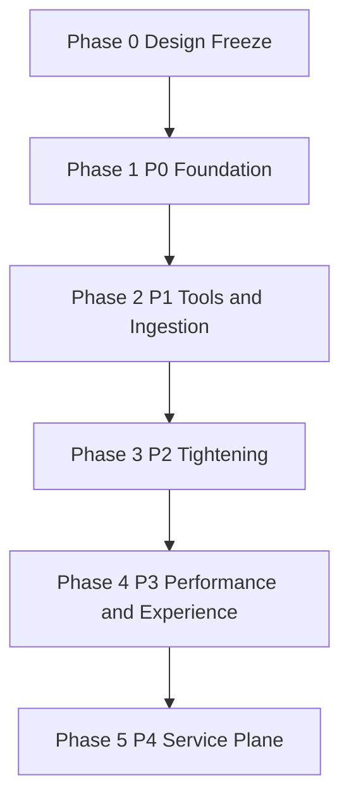

# EmoGPT v4.0 PRD 对齐升级计划

> Status: draft
> Last updated: 2026-04-29
> Scope: 把 EmoGPT v4.0 PRD（`../../EmoGPT/docs/PRD.md`，2129 行）的产品/服务面需求映射到 VolvenceZero 的 NL+ETA 内核 + lifeform 层 + service 层，识别真正的 gap，给出基于第一性原则、不破坏 SSOT 的分阶段升级路径。
> Parent: `docs/prd.md`、`docs/next_gen_emogpt.md`、`SPLIT.md`
> Sibling: `docs/implementation/12_eta_paper_grade_uplift_plan.md`

---

## 0. 目标与非目标

### 0.1 目标

EmoGPT v4.0 PRD 是一份成熟的、生产环境跑过的产品需求文档。它有许多功能点是 VolvenceZero 当前没有的（DLaaS 控制面、Affordance 体系、Apprenticeship 多源学徒、Active Exploration / MidSession 反思、AAC 决策生命周期、Speculative / Lazy Expression 等）。

本计划要回答的问题只有一个：

> **如何在不破坏 VolvenceZero 现有 NL+ETA 第一性原则的前提下，把 EmoGPT 这些产品功能借鉴成 VZ 自己的契约扩展？**

注意词序：

- **"借鉴" ≠ "照搬"**。EmoGPT 是 wave-based + AutonomousModule + CycleBoard 架构；VZ 是 snapshot-based + RuntimeModule + propagate 架构。两者底盘不同。
- **"功能" ≠ "实现"**。多数 EmoGPT 功能在 VZ 里要落到**已有 owner 多发布一段快照** / **新增一种 typed proposal** / **新增一个 lifeform 层 wrapper**，而不是新增一个 kernel 模块。
- **优先级靠"对 NL+ETA 主路径增益最大、对 SSOT 破坏最小"判定**，不是"EmoGPT 里有 / VZ 里没有"就排前面。

### 0.2 非目标

- ❌ 不把 EmoGPT 的 wave / CycleBoard / EventBus 引入 VZ 内核。VZ 已有 `Snapshot` + `propagate` + `WiringLevel`，不需要第二套异步消息总线。
- ❌ 不把 EmoGPT 的 EmotionTracker / SymbolicEmotion / Resistance 系数表 / Coaxing 类型表搬过来。这些是 `.cursor/rules/no-keyword-matching-hacks.mdc` 明令禁止的硬编码——任何"区间→行为"映射必须由 metacontroller 学到。
- ❌ 不把 EmoGPT 的 MetaAnalyzer 上帝视角 + 18 条 CP 检查搬过来。VZ 用 R12 family report + `--require-family-pass` + `tests/contracts/*` 已经覆盖；schema 完整性是 contract test，不是运行时模块。
- ❌ 不照抄 `pretrain_mode_alias` / `coach_plan` 那一类把"训练源"特殊化的设计。VZ 第一性立场是：所有学习走同一 turn pipeline + `WiringLevel.SHADOW` / `vitals override`，多源只是不同 trigger。
- ❌ 不为了"看起来像 EmoGPT"而新建 owner。任何新 owner 必须先在 `docs/DATA_CONTRACT.md` 的 slot 注册表 propose、落 owner 单写者校验、落 wiring level / kill switch。

### 0.3 Source-of-truth 顺序

判断"现状是什么"按以下顺序：

1. `packages/*/src/` 当前代码
2. `docs/DATA_CONTRACT.md` slot 注册表
3. `docs/SYSTEM_DESIGN.md`
4. `docs/specs/00_INDEX.md` → 目标 spec
5. 本计划与其他 implementation notes

如本计划与代码不一致，以代码为准、补丁本计划。

---

## 1. 第一性原则红线

EmoGPT PRD 内不少东西**长得像功能但其实是反模式**。这一节的红线**优先于**任何"照 PRD 抄"的诱惑。

### 红线 A：禁止关键词→行为硬编码

**违反样本**（EmoGPT §13 全节、EmoGPT §6.3 部分、EmoGPT §13.5 Surprise 系数表）：

```python
# ❌ EmoGPT §13.3 风格（VZ 禁止）
if reward > 0.3:
    resistance -= 0.15 * (reward - 0.3) / 0.7
if dominant_need == "validation":
    coaxing_sensitivity *= 1.5
```

**VZ 正确做法**：

- 如果是"系统应该学到"的，让 metacontroller 在 `z_t` / `β_t` 空间学
- 如果是"刚性合规"的（如 RuleGate safety），写死并文档化为 `BoundaryConsentSnapshot` 的硬约束，不参与学习
- 如果是"展示用 readout"的，作为评估 readout 写进 `EvaluationSnapshot`，**不可**反向当学习源

参考：`.cursor/rules/no-keyword-matching-hacks.mdc`、`docs/next_gen_emogpt.md` R3/R4。

### 红线 B：禁止反向同步调用 / 第二 Owner

**违反样本**（EmoGPT 文档自身也警告，但很容易漏）：

- DecisionModule 重新 reasoning attribution（这本来是 ETA 的责任）
- DeepExplorationWorker 修改 DecisionFrame / GoalGraph / MemoryOS state
- 控制面 DB 行直接写 L2 卡 / ETA reward record

**VZ 正确做法**：

- 跨模块**只读快照**，不直接调用其他 owner 的 process()
- 学徒 / 摄入 / teaching case 的 durable 化**只能**走 R6 session-post slow loop + `ReflectionWriteback`
- 服务层（lifeform-service / DLaaS）只能调 `BrainSession.submit_*` 或 `LifeformSession.*`，不可直接戳 owner store

参考：`.cursor/rules/ssot-module-boundaries.mdc`、`docs/next_gen_emogpt.md` R8。

### 红线 C：禁止吞错误 / 滥用 hasattr

**违反样本**（EmoGPT §4.4 fallback "超时则发布 fallback_snapshot"，描述上没问题但实现层很容易滑成 silent swallow）：

```python
# ❌ 静默吞错误
try:
    snapshot = await module.process(upstream)
except Exception:
    snapshot = self.fallback_snapshot()  # 没记录 stale_reason

# ❌ hasattr 防御
if hasattr(snapshot.value, "panorama"):
    consume(snapshot.value.panorama)
```

**VZ 正确做法**：

- fallback 必须显式 `stale_reason ∈ {no_data_yet, timeout, skipped, upstream_timeout, error:<ExceptionType>}`
- 直接读字段，让 schema mismatch fail loudly；可选行为用 `getattr(..., None)` 后**显式判 None**

参考：`.cursor/rules/no-swallow-errors-no-hasattr-abuse.mdc`、`docs/next_gen_emogpt.md` R8。

### 红线 D：评估只能是 readout / gate，不可作为学习源

EmoGPT 在 §17 的 18 条 CP 与 §14 的快照/稳态/性能测试有很多评估指标。**这些可以作为契约测试与 family report，不可作为反向梯度**。VZ 的 `prediction_error` 是源头、`evaluation` 是 readout——这个反向不能开。

参考：`.cursor/rules/first-principles-not-patches.mdc`、`docs/next_gen_emogpt.md` R-PE / R12。

---

## 2. 已覆盖能力对照（DON'T REDO）

EmoGPT 名词若已在 VZ 有对应 owner，**禁止**重做。下表是查重清单：

| EmoGPT 名词（PRD §） | VZ 现有实现 | 备注 |
|---|---|---|
| HomeostasisEvaluator + 持续 tension PE（§3.4） | `lifeform-core/vitals.py:VitalsModule` + `proactive_pe_threshold` | drive 偏离 band 即慢尺度 R-PE |
| TickEngine（§4.6） | `lifeform-core/tick_engine.py:TickEngine` | SYSTEM/ENERGY/CONTEXT 已分档 |
| SceneManager → SlowThinking（§7.6） | `lifeform-core/scene_manager.py` → `runner.begin_new_context()` → `vz-runtime/agent/session_post_slow_loop.py` | scene 闭合即触发 R6 |
| FollowupManager（§4.3） | `lifeform-core/followup_manager.py:FollowupManager` | 由 vitals PE + open-loop / commitment 驱动 |
| EtiquetteWatchdog（§4.5） | `lifeform-expression/etiquette_watchdog.py:EtiquetteWatchdog` | UX-only verdict，**不**反向影响学习 |
| ETA 双轨 World/Self（§5.3） | `vz-cognition/dual_track/core.py:DualTrackSnapshot` + `world_temporal` / `self_temporal` 双 owner | VZ 的双 owner 分离比 EmoGPT 的同图 track 字段更彻底 |
| 四层 Recursive Semantic RL（§5.10） | `vz-cognition/credit/gate.py:GateDecision` + reflection writeback layer | 概念存在；EmoGPT 的证据门槛在 VZ 里是 ModificationGate ladder |
| MemoryOS L0/L2/L1（§7.1） | `vz-memory/cms.py` CMS nested MLP tower | 三频带 `online_fast / session_medium / background_slow` |
| Person 卡 / CounterpartProfile（§7.5） | `semantic_state` 9 owner 之一 `user_model` | 一等 owner，不内嵌在 MemoryOS |
| 多 trigger（§4.3） | `BrainSession.submit_*` 系列（tool_result / profile / task / reviewed_knowledge / semantic events） | 已是 typed event |
| MethodEngine + interaction_regime（§5.4） | `vz-cognition/regime/identity.py:RegimeIdentity` + `RegimeBootstrap` | regime 是持久身份（R14），不是 prompt 标签 |
| RewardComposer / Credit（§3.5） | `vz-cognition/credit/gate.py` + reflection writeback | PE 是源，credit 是聚合 |
| 双 vertical（§11.3 Template 概念的轻量版） | `lifeform-domain-emogpt` / `lifeform-domain-coding` + `lifeform-service.verticals` | drive 集合互不重叠，service registry 自动发现 |
| 6 族 family report (R12)（§17 CP-14） | `lifeform-evolution/family_report.py:FamilyId.F1..F6` + `lifeform-bench --family-report` | 已是 CLI fail-closed gate |
| OutputAct 结构化输出（§8.6） | `lifeform-expression/response_synthesizer.py` 的 `ResponseAssembly` | 已是 frozen 输出契约 |
| 9 类 RuntimeEventInput envelope（§7.2） | `semantic_state.SemanticProposalOperation` 8 类 op + 9 owner slot | 结构齐，缺特定 outcome enum（见 Gap 10） |
| 学徒 forced compliance 思想（§10.3） | `WiringLevel.SHADOW` + `vitals override` 已具备机制 | 但缺 ingestion trigger（见 Gap 2/3） |
| Snapshot 不可变契约（§4.1） | `vz-contracts:Snapshot` frozen + `tests/contracts/test_import_boundaries.py` | 已强制 |

→ 这些**不要照 EmoGPT 命名再开一次**。出现"是不是该新做"念头时，先 grep 上表。

---

## 3. Gap 全表（按能力域 × 优先级）

12 个真正的 gap。每条按统一模板：**EmoGPT 需求 → VZ 现状 → R-ID 对齐 → Owner 落点 → 契约改动 → 实施步骤 → 验收 → wiring rollout → 风险/回滚**。

### Gap 1 — Affordance 体系（Tool / Action / Organ / Shell 统一描述符）

#### 来源

EmoGPT §9 把"AI 能做的事"统一成 `AffordanceDescriptor`：YAML 描述符（`when_to_use ≥ 50 字`、`when_not_to_use ≥ 50 字`、`parameters`（JSON Schema）、`output_schema`、`cost_model`、`safety_model`、`affordance_tags`、`source_path`）+ 单一 `AffordanceRegistry`（O(1) 读、startup atomic write）+ 4 个渲染器（markdown / openai_tools / catalog_json / compact_list）+ lint（`when_to_use < 50` warn）。

#### VZ 现状

- `vz-cognition/semantic_state/__init__.py:semantic_events_from_tool_result` 已有 tool **result** 入口
- 但**没有 "AI 能调用什么"的注册表**：lifeform 不能主动选工具，只能由 host 把工具结果注入
- coding vertical 的"工程结对"档位实际上需要文件读、grep、运行测试这类工具能力——**这是 coding 档位真正可用的硬阻塞**

#### R-ID 对齐

- **R3 / R4**：选哪个 affordance = `temporal_abstraction` 的抽象动作之一，`z_t` 空间多了一类离散动作
- **R8**：affordance 是 lifeform 层契约，`AffordanceRegistry` 是单写者
- **R10**：每个 affordance 进入实际调用前要过 `ModificationGate`（safety / cost）
- **R11**：可被命名、可被发布、可被 reflection 消费

#### Owner 落点

| 元素 | Owner | Wheel |
|---|---|---|
| `AffordanceDescriptor` schema | `vz-contracts`（多 vertical 共享） | `vz-contracts` |
| `AffordanceRegistry` 注册表 | 新 wheel `lifeform-affordance` | `lifeform-affordance` |
| `AffordanceSnapshot`（当前可用 affordance + 选择候选）| `lifeform-affordance:AffordanceModule` | `lifeform-affordance` |
| Affordance 选择决策 | 由 `temporal_abstraction` 的抽象动作输出 | 不新增 owner |
| 实际调用 + 结果回流 | host → `BrainSession.submit_tool_result`（已有） | 不动 |

注意：`lifeform-affordance` 是 lifeform 侧 wheel，可以依赖 `vz-contracts`，**不可**被 `vz-*` 反向 import。

#### 契约改动

新增 `vz-contracts.AffordanceDescriptor`：

```python
@dataclass(frozen=True)
class AffordanceDescriptor:
    name: str
    kind: Literal["tool", "action", "organ", "shell"]
    version: str
    display_name: str
    description: str
    when_to_use: str                 # ≥ 50 char
    when_not_to_use: str             # ≥ 50 char
    parameters_schema: Mapping[str, Any]   # JSON Schema, frozen
    output_schema: Mapping[str, Any]
    cost_model: AffordanceCost
    safety_model: AffordanceSafety
    preconditions: tuple[str, ...]
    affordance_tags: tuple[str, ...]
    examples: tuple[str, ...]
    source_path: str
    excluded_from_runtime_selection: bool = False
```

新增 `AffordanceSnapshot`（lifeform 层 slot）：

```python
@dataclass(frozen=True)
class AffordanceSnapshot:
    available: tuple[AffordanceDescriptor, ...]
    candidates_for_turn: tuple[AffordanceCandidate, ...]   # 由 temporal_abstraction 选出
    description: str
```

`docs/DATA_CONTRACT.md` 加入 lifeform-side slot `affordance`（lifeform-only，不进 kernel slot 注册表）。

#### 实施步骤

1. **Phase 1.1（schema-only）**：在 `vz-contracts` 加 `AffordanceDescriptor` + lint 规则（`when_to_use ≥ 50` 是 dataclass `__post_init__` 强制）。新建 `tests/contracts/test_affordance_descriptor.py` 验证。
2. **Phase 1.2（registry）**：新建 `packages/lifeform-affordance/`，`AffordanceRegistry` + 4 渲染器（markdown / openai_tools / catalog_json / compact_list）。**不接入 runtime**。
3. **Phase 1.3（snapshot publish）**：`AffordanceModule` 发布 `AffordanceSnapshot`（candidates 暂时为空 tuple，由后续步骤填）。`WiringLevel.SHADOW`。
4. **Phase 1.4（temporal_abstraction 消费）**：`temporal_abstraction` 把 affordance 候选作为 z_t 抽象动作的一类。**先做 mock candidate 选择**（uniform random），证明 propagate 通畅。
5. **Phase 1.5（learned selection）**：`metacontroller` 学习 affordance 候选权重（同 regime selection_weights 路径），由 `lifeform-evolution.regime_calibrator` 类似机制训练。`WiringLevel.ACTIVE`。
6. **Phase 1.6（actual execution）**：lifeform 层接 `affordance_invoker`：把选中的 affordance 调用出去（HTTP / 函数 / shell），结果回流走 `BrainSession.submit_tool_result`（**已有通道**）。
7. **Phase 1.7（coding vertical 第一批 affordance）**：read_file / grep / run_test / list_dir 这 4 个最小集合，descriptor 写在 `lifeform-domain-coding/affordances/*.yaml`。

#### 验收

- [ ] 所有 affordance descriptor 都通过 `when_to_use ≥ 50` 校验
- [ ] `tests/contracts/test_import_boundaries.py` 中 `vz-* ↛ lifeform-affordance` 强制
- [ ] `AffordanceSnapshot` 在 SHADOW level 下不影响主路径行为（baseline benchmark 数值不漂）
- [ ] ACTIVE level 下，coding vertical 在带工具的场景下 family report F1（task capability）相对 ablation（`use_affordance=False`）有可测增益
- [ ] affordance 选择**完全**由 metacontroller 输出，repo grep 不到 `if name == "read_file"` 这类硬编码路由

#### Wiring rollout

`DISABLED → SHADOW（candidates 不影响选择，只发布观测）→ ACTIVE`。每一档之间 ≥ 一次 family report 通过 + ≥ 1 次 ablation 对比。

#### 风险/回滚

- **风险**：metacontroller 学到"永远选 read_file"。**缓解**：family report F5（abstraction quality）观察 affordance 多样性熵，低于阈值时回滚到 SHADOW。
- **风险**：affordance 调用副作用泄漏（写文件、网络）。**缓解**：`safety_model.requires_user_confirmation` 强制走人类 gate；coding vertical 第一批限制为只读工具。

---

### Gap 2 — Apprenticeship Trigger（学徒模式）

#### 来源

EmoGPT §10.3：apprentice mode 是同一 pipeline + 两个旋钮（`depth=immersive` + `resistance=0.0`）。Per-request 通过 `interaction_type ∈ {teach, task}` 或 `mode="apprentice"` 进入。学徒 wave 带 `trigger_group="apprentice"` 审计。durable 学习走 `MemoryOS runtime 证据 + SlowThinking`。

#### VZ 现状

完全没有学徒入口。预训练只有 `lifeform-super-loop` 通过离线 scenarios 跑。

#### R-ID 对齐

- **R6**：apprentice durable 化必须走 session-post slow loop
- **R10**：forced compliance 是有界 self-modification 的一种 wiring level（`SHADOW` 的语义已经足够）
- **R15**：每次 apprentice session 是可回滚增量（artifact 只在通过 family report 后才 promote 到 active vertical）

#### Owner 落点

| 元素 | Owner |
|---|---|
| `apprentice_mode` 标志 | `lifeform-core:LifeformSession`（per-session） |
| forced-compliance 行为 | `lifeform-core:VitalsModule.with_apprentice_override()`（已有 vitals override 机制，扩一个语义） |
| 学徒 trigger 审计 | `lifeform-core:TurnSummary.trigger_kind` 字段 |
| durable 化 | 已有 `vz-runtime/agent/session_post_slow_loop.py` |

**不**新建 owner。

#### 契约改动

`lifeform-core/types.py:TurnSummary` 增加：

```python
trigger_kind: Literal[
    "user_input",
    "internal_drive",
    "followup_due",
    "tool_result",
    "apprentice",
    "ingestion",
] = "user_input"
```

`LifeformSession.run_turn(user_input, *, trigger_kind="user_input")` 增加可选参数。

`VitalsModule.set_apprentice_override(enabled: bool)`：apprentice 模式下 PE_weight 扣 0%、recharge_per_turn 视作正常 turn。**不写死系数**——直接走"apprentice = vitals 不消耗"的语义。

#### 实施步骤

1. **Phase 2.1**：扩 `TurnSummary.trigger_kind`，benchmark 路径默认 `"user_input"` 不变。
2. **Phase 2.2**：扩 `VitalsModule` 的 apprentice override，纯 flag 切换；不引入新参数。
3. **Phase 2.3**：`LifeformSession.run_turn(*, trigger_kind="apprentice")` 接通——本质上是给 host 一个**显式标签**告诉 brain "这是教学 turn，请走 forced-compliance"。
4. **Phase 2.4**：`tests/lifeform_e2e/test_apprenticeship.py` 验证：apprentice turn 走完整 cognition pipeline，但 vitals 不消耗、PE 仍计算、scene 仍闭合后触发 slow loop。
5. **Phase 2.5**：`lifeform-evolution.super_loop` 把现有"scenario 喂场景文本"重命名为 apprentice turn，统一 trigger_kind——证明同一管道。

#### 验收

- [ ] benchmark 在 `trigger_kind="user_input"` 下指标不变（≤ 0.5% 漂移）
- [ ] `trigger_kind="apprentice"` 下 vitals snapshot 的 `total_pe` 从 drive 偏离贡献为 0（band 内）但 perception/temporal/regime PE 正常计算
- [ ] apprentice scene 闭合后 slow loop 与普通 scene 走完全相同的 reflection writeback
- [ ] `super_loop` 切换到 trigger_kind 后，预训练 artifact（temporal.snap / regime.bs）和切换前在 family report 上等价（regression test）

#### Wiring rollout

无单独 wiring level——本身只是一个 TurnSummary 标签。但 vitals override 受 `VitalsModule.allow_apprentice_override: bool = False` 默认守护，必须显式打开。

#### 风险/回滚

- **风险**：apprentice override 被忘了关，普通用户 turn 全成 forced compliance。**缓解**：`LifeformSession` 在每个 turn 结束 `assert vitals.apprentice_override == initial_state`。

---

### Gap 3 — Runtime Ingestion（Book / Web / TaskResult 内容摄入）

#### 来源

EmoGPT §10.1–10.2 的 `BookContentSource` / `WebContentSource` / `TaskResultSource`，统一通过 `IngestionEnvelope` → `IngestionPipeline.process_envelope` → 跑完整 cognition pipeline → 异步触发 SlowThinking。

#### VZ 现状

`TaskResult` 已经有 `submit_tool_result`，但没有 PDF / 网页 / 长文本的 chunked ingestion adapter。

#### R-ID 对齐

- **R6**：ingestion 产生的 PE 经 reflection writeback 沉淀
- **R8**：ingestion adapter 是 lifeform 层 wrapper，不进 kernel
- **R15**：可逐 source 回滚（每个 source adapter 是独立 wheel adapter）

#### Owner 落点

| 元素 | Owner | Wheel |
|---|---|---|
| `IngestionEnvelope` schema | `lifeform-ingestion:IngestionEnvelope` | `lifeform-ingestion`（新 wheel） |
| Source adapter（book / web / task）| `lifeform-ingestion.sources.*` | 同上 |
| chunked ingestion 主流程 | `lifeform-ingestion:IngestionPipeline` | 同上 |
| 实际 chunk 进 cognition | 调 `LifeformSession.run_turn(..., trigger_kind="ingestion")`（见 Gap 2） | `lifeform-core` |

`lifeform-ingestion` 依赖 `lifeform-core`、不依赖任何 `vz-*` wheel。

#### 契约改动

新增 `lifeform-ingestion`：

```python
@dataclass(frozen=True)
class IngestionEnvelope:
    envelope_id: str
    source_kind: Literal["book", "web", "task_result", "corpus"]
    source_uri: str
    chunks: tuple[IngestionChunk, ...]
    provenance: IngestionProvenance
    compliance_profile: Literal["forced", "consultative"] = "forced"

@dataclass(frozen=True)
class IngestionChunk:
    chunk_id: str
    text: str
    locator: str           # page / url + offset / row
    confidence: float
```

`IngestionPipeline.process_envelope(env, *, session)` 把 chunks 顺序送入 `session.run_turn(chunk.text, trigger_kind="ingestion")`，per-chunk 也是 typed turn——不绕 kernel。

#### 实施步骤

1. **Phase 3.1**：搭 `lifeform-ingestion` 骨架 + `IngestionEnvelope` schema + `tests/ingestion/test_envelope.py`
2. **Phase 3.2**：`BookContentSource`：PDF / DOCX / TXT chunked 切片（先用 `pypdf` / 标准库，不引入 Playwright）
3. **Phase 3.3**：`TaskResultSource`：JSON 结构化结果 → chunked
4. **Phase 3.4**：`WebContentSource`：基于 `requests` + `readability-lxml` 的纯 HTML adapter（**先不接 Playwright**——浏览器自动安装是大增量，留给独立 spec）
5. **Phase 3.5**：`IngestionPipeline.process_envelope_async(env, *, session, max_concurrency=1)`，异步注入；scene 闭合机制保证 reflection 自动跟上
6. **Phase 3.6**：`tests/lifeform_e2e/test_book_ingestion.py`：喂一份 5KB 内部 spec MD，验证 PE 累积 + reflection writeback 产出 application prior update

#### 验收

- [ ] ingestion 一次 envelope 后，`MemorySnapshot` 在 `session_medium` 频带的条目数有可测增长
- [ ] 同一段文本两次 ingest，第二次 PE 显著低于第一次（说明 memory consolidation 生效）
- [ ] ingestion 与 user turn 不互相阻塞：异步 ingestion 期间 user turn P95 延迟漂移 ≤ 5%
- [ ] **不可能**有 ingestion 直写 memory / regime / temporal owner 的代码路径——`grep` ingestion package 应只见 `session.run_turn(...)` 入口

#### Wiring rollout

每个 source 独立 `WiringLevel`：`book_source.SHADOW → ACTIVE`。Web source 在 ACTIVE 之前要过 safety review（外部内容入认知主路径要 boundary policy + ratelimit）。

#### 风险/回滚

- **风险**：用户 ingestion 大文档把 PE 全打满，导致 followup 洪泛。**缓解**：`vitals.proactive_pe_threshold` 已有 cooldown；ingestion 期间额外加 `ingestion_session=True` 标记，`FollowupManager` 降低主动发起率。
- **风险**：HTML 解析失败静默吞错。**缓解**：每个 chunk 失败显式 `IngestionChunk.parse_error: str` 字段，`IngestionEnvelope` 整体保留 `partial_failures`，强制可见。

---

### Gap 4 — 中频思考时钟（Active Exploration + MidSession Reflector + ProvisionalLesson）

> **P0 优先**——这是 R1 多时间尺度里最大的缺口。VZ 当前只有 `online-fast`（per-turn）+ `background-slow`（post-scene）两档，缺 `session-medium` 中段。

#### 来源

EmoGPT §6 的 ThinkingLoopScheduler 三种异步思考：
- **Active Exploration**（§6.3）：Panorama 在 `consultation_required` turn 之前主动收集证据，read-only worker
- **MidSession Reflector**（§6.4）：会话进行中的 self / world 双 lane 反思
- **ProvisionalLesson**（§6.5 + §5.11）：在线信号产生的 30 min TTL 弱先验、不创 GoalGraph 节点

#### VZ 现状

- `vz-runtime/agent/session_post_slow_loop.py` 是 R6 session-post 慢反思
- 没有"会话内 / scene 内异步思考"机制
- `case_memory` 没有 lifecycle state（candidate / provisional / validated / retired）

#### R-ID 对齐

- **R1**：直接补齐 session-medium 频带
- **R6**：扩展 R6 慢反思的"频率"维度——post-scene 之外允许 mid-scene 异步反思
- **R8**：MidSession 是消费者只读 thinker，不能成为 owner 第二写者

#### Owner 落点

| 元素 | Owner | Wheel |
|---|---|---|
| `ThinkingScheduler`（任务生命周期）| 新建 `lifeform-thinking:ThinkingScheduler` | `lifeform-thinking`（新） |
| `ThinkingTask` / `ThinkingArtifact` 不可变契约 | `vz-contracts`（多 owner 都消费） | `vz-contracts` |
| Active Exploration worker | `lifeform-thinking.workers.exploration` | `lifeform-thinking` |
| MidSession reflection trigger | 复用 `world_temporal` / `self_temporal` 双 owner，把 `reflection_kick` 信号挂上 | `vz-cognition.reflection` |
| ProvisionalLesson 存储 | **不新建 owner** —— 进 `case_memory` 加 lifecycle 字段 | `vz-application` |

#### 契约改动

`vz-contracts` 加：

```python
class ThinkingDepth(str, Enum):
    FAST = "fast"              # wave 内同步（不归此调度器管）
    MID = "mid"                # session-medium，scene 内异步
    SLOW = "slow"              # session-post，已有

class ThinkingTaskStatus(str, Enum):
    QUEUED = "queued"
    RUNNING = "running"
    COMPLETED = "completed"
    STALE = "stale"            # live frame 身份不再匹配
    CANCELLED = "cancelled"
    FAILED = "failed"

@dataclass(frozen=True)
class ThinkingTask:
    task_id: str
    depth: ThinkingDepth
    requested_at_turn_index: int
    purpose: str                # "world_lane_reflect" / "self_lane_reflect" / "exploration"
    snapshot_fingerprint: str   # 任务起手时的快照 hash, 用于 staleness 校验

@dataclass(frozen=True)
class ThinkingArtifact:
    task_id: str
    status: ThinkingTaskStatus
    payload: Any                # frozen dataclass
    produced_at_turn_index: int
    consumer_owner: str         # 哪个 owner 应该消费它
```

`vz-application/runtime.py:CaseMemoryRecord` 增加：

```python
class CaseLifecycle(str, Enum):
    CANDIDATE = "candidate"
    PROVISIONAL = "provisional"
    VALIDATED = "validated"
    RETIRED = "retired"

# 加字段
lifecycle: CaseLifecycle = CaseLifecycle.VALIDATED   # 默认 validated 兼容现有数据
ttl_seconds: int | None = None
expires_at_tick: int | None = None
```

`reflection.writeback` 加一条 path：`reconcile_provisional_cases(now_tick) → tuple[PromotedCase, RetiredCase, ExpiredCase]`，scene-end 时调用。

#### 实施步骤

1. **Phase 4.1（schema）**：`vz-contracts` 加 `ThinkingTask` / `ThinkingArtifact` / `ThinkingDepth`。`vz-application` 给 `CaseMemoryRecord` 加 lifecycle。Migration：所有现有记录默认 `VALIDATED`。
2. **Phase 4.2（scheduler skeleton）**：`packages/lifeform-thinking/` 新 wheel，`ThinkingScheduler` 内部用 `asyncio.create_task` 跑后台 task，状态机 queued → running → (completed | stale | cancelled | failed)。**先不接 worker**，纯生命周期管理。
3. **Phase 4.3（fingerprint guard）**：每个 ThinkingTask 起手时记录上游快照 hash；apply artifact 前比对 fingerprint，过期则 `STALE` 不 apply。
4. **Phase 4.4（mid-session reflection task）**：MidSession reflector 是 ThinkingScheduler 的 worker，由 reflection writeback 在 turn-end 排队。worker 内部读 `world_temporal` / `self_temporal` 双 owner 快照，产出 `MidReflectionArtifact`，consumer 是对应 track owner。
5. **Phase 4.5（provisional case lifecycle）**：reflection writeback 把高置信但未通过 pattern threshold 的 case_memory 候选写为 `provisional` lifecycle + 30min TTL。Scene-end `reconcile_provisional_cases()` 决定 promote → validated / 直接 retired / expired。
6. **Phase 4.6（active exploration worker）**：第二个 worker 类型。当 `boundary_consent` 出现 `consultation_need` 信号且 `panorama_state == "stalled"`，scheduler 排一个 read-only exploration task，read memory + dual_track，产出 `ExplorationArtifact`，consumer 是 next turn 的 perception。
7. **Phase 4.7（contract test）**：`tests/contracts/test_thinking_lifecycle.py` 验证：worker 不可调用任何 owner 的 mutation API（contract test grep 调用图）。

#### 验收

- [ ] family report F4（learning quality）在引入 mid-session reflection 后相对 ablation 有可测改善（多轮场景下）
- [ ] family report F5（abstraction quality）在 provisional → validated 提升轨迹上可观察 case_memory 增长曲线
- [ ] 任何 ThinkingArtifact 在 fingerprint 过期时**永远** `STALE`，不允许"再 apply 一次试试"；contract test 强制
- [ ] mid-reflection 不阻塞 user turn：在 `lifeform-bench` 加 `--with-mid-reflection` 后 P95 turn 延迟漂移 ≤ 8%
- [ ] `world_temporal` 与 `self_temporal` 的 mid-reflection throttle 互不饿死（错峰运行）

#### Wiring rollout

`ThinkingScheduler.WiringLevel`：
- DISABLED：不排队任何 task（当前默认）
- SHADOW：排队 + 跑，但 artifact 不 apply（仅 telemetry）
- ACTIVE：consumer apply

每个 worker（mid-reflection / exploration / provisional reconcile）独立 wiring level，可单独回滚。

#### 风险/回滚

- **风险**：mid-reflection 写回 stale snapshot 污染 owner state。**缓解**：fingerprint guard 是硬不变量；contract test 强制。
- **风险**：provisional case 数量爆炸。**缓解**：`max_provisional_cases_per_track = 50` 上限 + LRU 淘汰；F5 family metric 监控。
- **回滚**：把 lifecycle 字段降级为 metadata，scheduler wiring 调到 DISABLED，case_memory 行为退回当前。

---

### Gap 5 — Speculative / Lazy Expression（性能优化）

#### 来源

EmoGPT §8.3–8.4：
- **Speculative**：decision-bypass 模式下用上一 wave 快照预热 LLM 调用，新快照到达时比对 fingerprint，匹配则 commit、不匹配则取消重跑
- **Lazy snapshot mode**：最小稳定前缀 + `tool_choice="auto"` 让 LLM 自己拉 detail（cache hit ≥ 70% / token drop ≥ 30%）
- **Hard 结构化 turn 禁止 speculative adopt**

#### VZ 现状

- `lifeform-expression/prompt_planner.py` 是 frozen `PromptPlan`，无 cache 命中验收、无投机执行
- 没有 detail provider tools

#### R-ID 对齐

纯性能优化。R 编号上**只**触及：
- **R8**：投机的 fingerprint 必须基于发布快照，不可基于 raw user_input 关键词

#### Owner 落点

完全在 `lifeform-expression` 层。**不**进 kernel。

#### 契约改动

`lifeform-expression/response_synthesizer.py:ResponseSynthesizer` 增加可选 wrapper：

```python
class SpeculativeResponseSynthesizer(ResponseSynthesizer):
    def __init__(self, *, base: ResponseSynthesizer,
                 fingerprint_fn: Callable[[ResponseContext, ResponseAssemblySnapshot], str],
                 forbid_in_regimes: frozenset[str] = frozenset({"problem_solving", "repair_and_deescalation"})):
        ...
```

`PromptPlan` 不动；只在 synthesizer 层做投机/重用。

#### 实施步骤

1. **Phase 5.1**：fingerprint 函数：基于 `regime.identity / dual_track.controller_code / memory.frequency_band_summary` 三段的 SHA256。**绝不**包含 user_input 文本。
2. **Phase 5.2**：`SpeculativeResponseSynthesizer.express()`：起手立即用上次 fingerprint 起一个 `dry_run=True` LLM 调用；新快照到达时比 fingerprint。
3. **Phase 5.3**：禁用名单：`regime.identity.regime_id in forbid_in_regimes` 时 fingerprint 永不匹配（强制 fresh build）。
4. **Phase 5.4**：cache hit 日志 + token drop 日志（`[CACHE_HIT]` / `[COST]` prefix）
5. **Phase 5.5**：`scripts/ab_speculative_eval.py` —— A/B 在同一 scenario 跑两次，比 family report + 延迟 + token

#### 验收

- [ ] 在 `casual_social` / `acquaintance_building` regime 下 cache hit ≥ 50%（首版门槛比 EmoGPT 70% 宽松）
- [ ] token drop ≥ 20%（首版门槛宽松）
- [ ] family report F2（interaction quality）在投机模式下 ≥ baseline - 0.02
- [ ] **任何**含 `problem_state ∈ {stalled, regressed}` 的 turn，speculative 永远不 adopt（contract test 验证）

#### Wiring rollout

`speculative_enabled: bool = False` 默认关；A/B 验收通过后切默认 True。

#### 风险/回滚

- **风险**：fingerprint 漏掉某段快照，导致 stale prompt 被 commit。**缓解**：fingerprint 列表必须显式列出所有上游 owner，contract test 验证 owner 集合 ⊇ `prompt_planner` 当前消费集合。
- **回滚**：`speculative_enabled=False`，零代码改动回到当前。

---

### Gap 6 — DLaaS 控制面（Tenant / Exam / License / TeachingCase / OpsLoop）

#### 来源

EmoGPT §11 整套控制面：
- **Tenant / Auth**（§11.1）：每个资源属一个 tenant
- **Shell**（§11.2）：runtime / studio 两类
- **Asset / Template / Contract**（§11.3）：资产引用、版本化模板、合约生命周期
- **AudienceProfile + PersonaSpec**（§11.5）：受众建模 + 人格规约
- **TeachingCase + Weakness**（§11.6）：教学案例 + 弱点修复 backlog
- **Exam + LaunchLicense**（§11.7）：连续两次通过才 grant license
- **OpsLoop**（§11.8）：response confidence、HumanReviewTicket、IdentityLink、OpsMetrics
- **Webhooks**（§11.9）：handoff_required / spot_check_failed / ...

#### VZ 现状

`lifeform-service` 是 aiohttp + 单租户 + session-only。没有 tenant / template / exam / license / ops。

#### R-ID 对齐

**这是部署面 / 运营面，不是认知能力**。R 编号上：
- **R15**：每个增量层有 owner、可回滚
- **R8**：service 层不可绕开 BrainSession 直写 owner

#### Owner 落点

| 元素 | Owner | 持久层 |
|---|---|---|
| Tenant / Shell / Asset / Template / Contract | `lifeform-service` 内 sqlite/postgres | service 层 DB |
| Exam = scripted scenario benchmark | 复用 `lifeform-evolution.benchmark` | 不动 kernel |
| TeachingCase 进入 lifeform | 触发 Gap 2 的 `trigger_kind="apprentice"` turn | 复用 |
| LaunchLicense | `--require-family-pass` 连续两次通过的运营元数据 | service DB |
| OpsMetrics | service-side aggregate worker | service DB |
| Webhook | `lifeform-service.webhooks` | service 层 |

**关键不变量**：

- 控制面 DB 行**永远不**直写 kernel owner
- 学习只通过 `LifeformSession.run_turn(..., trigger_kind="apprentice")` 接入
- License gate 是 service 层 HTTP 中间件，不进 kernel

#### 契约改动

仅 `lifeform-service` 内部。新增表：

```sql
tenant(tenant_id, display_name, config_json, created_at, ...)
shell(shell_id, tenant_id, kind, credentials_hash, ...)
asset(asset_id, tenant_id, kind, uri, ...)
template(template_id, tenant_id, status, version, seed_config_json, ...)
contract(contract_id, tenant_id, template_id, shell_id, status, ...)
exam_run(run_id, tenant_id, template_id, family_report_json, score, passed, ...)
launch_license(license_id, tenant_id, template_id, status, granted_after_runs, ...)
teaching_case(case_id, tenant_id, template_id, scenario_tag, ...)
human_review_ticket(ticket_id, tenant_id, status, ...)
ops_metrics_snapshot(snapshot_id, tenant_id, period_type, ...)
webhook_subscription(subscription_id, tenant_id, event_type, target_url, ...)
```

#### 实施步骤

1. **Phase 6.1**：tenant 隔离：`POST /v1/sessions` 必须带 `tenant_id`（中间件）；`SessionManager` 按 tenant 配额；ratelimit 按 tenant
2. **Phase 6.2**：asset / template / contract CRUD（service 层 DB；不影响 brain）
3. **Phase 6.3**：exam = 把 `lifeform-evolution.benchmark` 包成 service endpoint，结果存 `exam_run` 表
4. **Phase 6.4**：launch_license：连续两次 exam pass 自动 grant；adopt endpoint 检查 `tenant.config.require_launch_license`
5. **Phase 6.5**：teaching_case: 操作员 POST 进 service → 翻译成 `IngestionEnvelope`（compliance_profile=forced）→ 走 Gap 3 管道
6. **Phase 6.6**：webhook：`lifeform-service.webhooks` 异步任务发外部 URL
7. **Phase 6.7**：ops metrics aggregator：定时 worker 汇总 turn-level 数据到 ops 快照表，dashboard 零 LLM 调用读

#### 验收

- [ ] 不同 tenant 完全隔离（contract test：tenant A 看不到 tenant B 的 session/asset/exam）
- [ ] launch_license 不通过的 tenant 调 adopt 返回 503 `TEMPLATE_NOT_LICENSED`
- [ ] teaching_case 流程：操作员 POST → ingestion → reflection writeback → family report 提升（端到端）
- [ ] webhook 失败有重试 + 死信队列
- [ ] ops dashboard 端到端零 LLM 调用（grep service `model.generate` 应只在 turn handler）

#### Wiring rollout

各 endpoint 独立 feature flag。Tenant 隔离一旦开启不可回滚（破坏性 schema 变更需 migration）。

#### 风险/回滚

- **风险**：service 层有人偷偷走捷径直写 kernel owner。**缓解**：service wheel 只 import `lifeform-core` / `lifeform-expression` / `lifeform-ingestion`；contract test 强制 `lifeform-service ↛ vz-application` / `↛ vz-cognition.semantic_state` 之类禁止反向。
- **回滚**：每张表独立 migration；先关 endpoint 后清表。

---

### Gap 7 — AAC 决策生命周期（Advocacy → Alignment → Commitment → Followup）

> **P0 优先**——补 R11 内部状态显式化，无新 owner，工作量小。

#### 来源

EmoGPT §5.6：DecisionFrame 完整生命周期从"分析 → 呈现"延伸到"倡导 → 对齐 → 承诺 → 跟进"。
- `advocacy_state ∈ {not_ready, ready, proposed}`
- `alignment_state ∈ {unknown, agree, modify, reject}`
- `followup_policy ∈ {gentle_checkin, defer_only}`
- `followup_status ∈ {pending, due, answered, expired, resolved, superseded}`
- 显式 outcome 分类：`commitment_progressed / completed / stalled / rejected / followup_no_response`

#### VZ 现状

- `semantic_state` 9 owner 中已有 `commitment` 和 `open_loop`
- `lifeform-core/followup_manager.py:FollowupManager` 在 lifeform 层
- **缺**：advocacy / alignment 这两段；缺显式 commitment outcome 分类

#### R-ID 对齐

- **R11**：内部状态命名 + 发布
- **R8**：commitment owner 单写者，不创新 owner
- **R-PE**：alignment_state 变化是 PE 信号源（用户从 unknown → reject 是高 PE）

#### Owner 落点

**不**新建 owner。`commitment` owner 扩字段。

#### 契约改动

`vz-cognition/semantic_state` 的 `CommitmentSnapshot.value`：

```python
class AdvocacyState(str, Enum):
    NOT_READY = "not_ready"
    READY = "ready"
    PROPOSED = "proposed"

class AlignmentState(str, Enum):
    UNKNOWN = "unknown"
    AGREE = "agree"
    MODIFY = "modify"
    REJECT = "reject"

class FollowupPolicy(str, Enum):
    GENTLE_CHECKIN = "gentle_checkin"
    DEFER_ONLY = "defer_only"

class CommitmentOutcomeKind(str, Enum):
    PROGRESSED = "commitment_progressed"
    COMPLETED = "commitment_completed"
    STALLED = "commitment_stalled"
    REJECTED = "commitment_rejected"
    FOLLOWUP_NO_RESPONSE = "followup_no_response"

# CommitmentEntry 加字段
advocacy_state: AdvocacyState = AdvocacyState.NOT_READY
alignment_state: AlignmentState = AlignmentState.UNKNOWN
followup_policy: FollowupPolicy = FollowupPolicy.GENTLE_CHECKIN
last_outcome: CommitmentOutcomeKind | None = None
last_outcome_evidence: str = ""
```

`SemanticProposalOperation` 已有的 8 类 op（OBSERVE / CREATE / REVISE / DEFER / ACTIVATE / COMPLETE / CLOSE / BLOCK）足够覆盖状态迁移——**不**新增 op。

#### 实施步骤

1. **Phase 7.1（schema）**：commitment owner 加字段，默认值兼容现有数据。
2. **Phase 7.2（proposal path）**：`SemanticProposalRuntime` 的 LLM extraction prompt 扩展，输出 `advocacy_state` / `alignment_state` 字段（structured output，不允许自由文本判定）。
3. **Phase 7.3（reflection writeback outcome）**：`PolicyConsolidation` 加 `commitment_outcomes: tuple[(commitment_id, CommitmentOutcomeKind, evidence), ...]` 字段。`session_post_slow_loop` 写入。
4. **Phase 7.4（followup integration）**：`FollowupManager` 读 `commitment.followup_policy`，按 policy 计算 due tick。
5. **Phase 7.5（PE 信号）**：`prediction_error` 把 `alignment_state` 从 `agree` → `reject` 的转移作为 PE spike——这一步打通 R-PE 和 commitment owner，是这个 gap 真正的"接通收益"。
6. **Phase 7.6（contract test）**：`tests/test_semantic_state_owners.py` 加 `test_commitment_advocacy_alignment_lifecycle.py`，测每条状态转移是合法的（用 SemanticProposal 驱动，不通过裸赋值）。

#### 验收

- [ ] 多轮场景下：`advocacy_state` / `alignment_state` 在快照中可追踪
- [ ] reject 出现时 PE magnitude 显著高于 baseline turn（mean + 1σ 以上）
- [ ] family report F3（relationship continuity）观察"承诺被拒后是否进入 repair_and_deescalation regime"——这是 R7 双轨 + R14 regime 的**联合**验证
- [ ] `SemanticProposalOperation` 不新增即可表达所有状态转移（contract test 强制）
- [ ] grep 仓库找不到 `if "agree" in user_text` 这类硬编码 alignment 判定

#### Wiring rollout

字段加上去就生效。proposal extraction 受 `SemanticProposalRuntime` 自身的 wiring level 守护——默认 SHADOW，验证 schema 后切 ACTIVE。

#### 风险/回滚

- **风险**：LLM 输出 alignment_state 不准（reject 误判为 modify）。**缓解**：`SemanticProposal.confidence` 已是字段，`< 0.6` 默认进 `OBSERVE` 而非 `REVISE`，需要更多证据才转移状态。
- **回滚**：字段保留，但 reflection writeback 的 outcome 写入降级为 metadata-only，不影响 followup policy。

---

### Gap 8 — Cognitive Depth + Participation Hint（参与门）

#### 来源

EmoGPT §5.1–5.2：
- 五档 cognitive_depth：`REFLEXIVE / SHALLOW / FOCUSED / ALERT / DEEP`，决定算力预算
- `TurnParticipationSignal`：`flow_kind / panorama_level / method_level / task_level / confidence`
- PromptPlanner 必须先过参与门再选内容

#### VZ 现状

- `lifeform-expression/prompt_planner.py:_REGIME_DEFAULT_SECTIONS` 直接按 regime 选 section
- 没有"depth / 参与"独立轴

#### R-ID 对齐

- **R3**：cognitive_depth 是抽象动作的属性
- **R4**：参与级别是 z_t 的一个分量，不是表层关键词判定
- **R11**：depth + participation 必须可发布、可被 reflection 学习

#### Owner 落点

**不**新增 owner。让 `regime` snapshot 多发布一段 hint。

#### 契约改动

`vz-cognition/regime/identity.py:RegimeSnapshot` 增加：

```python
@dataclass(frozen=True)
class ParticipationHint:
    flow_kind: Literal["social", "acquaintance", "info", "problem", "task"]
    panorama_level: Literal["silent", "brief", "structured"]
    method_level: Literal["none", "posture", "brief"]
    task_level: Literal["silent", "task_related", "wave_bound"]
    confidence: float

@dataclass(frozen=True)
class CognitiveDepthHint:
    depth: Literal["reflexive", "shallow", "focused", "alert", "deep"]
    rationale: str

# RegimeSnapshot 加字段
participation_hint: ParticipationHint
depth_hint: CognitiveDepthHint
```

`prompt_planner.py` 改造：

```python
def plan(ctx: ResponseContext, assembly: ResponseAssemblySnapshot,
         participation: ParticipationHint, depth: CognitiveDepthHint) -> PromptPlan:
    if participation.panorama_level == "silent":
        # Panorama 内容不进 prompt
        ...
```

#### 实施步骤

1. **Phase 8.1**：`RegimeSnapshot` 加字段，默认值兼容（depth=`focused`、所有 level 中性）
2. **Phase 8.2**：metacontroller 学习 ParticipationHint：把 `regime.identity` + `dual_track.controller_code` + `vitals` 作为输入，输出 5×3×3×3 离散概率分布（学习目标见下）
3. **Phase 8.3**：学习目标 = 当前 turn 真实 prompt section 集合 vs LLM-rated 适配度（family report F2 readout 作为信号），**不**用关键词目标
4. **Phase 8.4**：prompt_planner 接 participation_hint：`silent` level 的 section 直接从 sections tuple 中抽掉
5. **Phase 8.5**：`CognitiveDepthHint` 接 thinking scheduler：`reflexive` 不排队 mid-reflection，`deep` 强制排队 active exploration

#### 验收

- [ ] family report F2（interaction quality）在 casual_social regime 下 panorama 信息被排除时 ≥ baseline + 0.02（更精简 prompt 不掉质量）
- [ ] grep 仓库找不到 `if "你好" in user_input` / `if regime == "casual_social": panorama_level = "silent"` 这类硬规则
- [ ] depth=`reflexive` 时 P95 turn 延迟相对 baseline 降低 ≥ 30%

#### Wiring rollout

`participation_hint` / `depth_hint` 字段加上后默认值兼容；prompt_planner 消费它们走 `WiringLevel.SHADOW`（先 observe 不影响），通过 A/B 后切 ACTIVE。

#### 风险/回滚

- **风险**：metacontroller 学到"问题求解 turn panorama=silent"导致严重质量下降。**缓解**：F1（task capability）作为 fail-closed gate；硬区域（regime=problem_solving）保留 fallback `panorama_level >= brief`。
- **回滚**：固定 hint 为中性默认值即可。

---

### Gap 9 — InterlocutorState + Resistance / Coaxing（差异化体验）

#### 来源

EmoGPT §13 整节："压力驱动有脾气的 AI"—— 12 维 InterlocutorState + Resistance 区间映射 + Coaxing Loop + RelationshipStage 渐进解锁 + Surprise Score。

#### VZ 现状

- `relationship_state` 已是 9 个语义 owner 之一，但 `trust_level` / `stage` / `attachment_style` 颗粒度粗
- 没有 InterlocutorState 12 维 readout

#### R-ID 对齐 + 红线

⚠️ **这条最危险**——EmoGPT §13.3 全表是查表硬编码（`if reward > 0.3: resistance -= 0.15 * (reward-0.3)/0.7` 等等），**红线 A 明确禁止**。VZ 对应做法：

- **R3 / R4**：让 metacontroller 在 z_t 空间学到"什么样的 relationship + interlocutor 状态下倾向哪种 abstract action"
- **R7**：双轨 self / world 分离，self 轨道吃 relationship_state、world 轨道吃 task 信号
- **R14**：regime 持久身份的 selection_weights 由 RegimeBootstrap 学习，不是查表

#### Owner 落点

| 元素 | Owner | 备注 |
|---|---|---|
| InterlocutorState 12 维 readout | `user_model` owner | 多发布一段 readout block，**不**作为决策硬规则输入 |
| Resistance / Coaxing 行为 | `metacontroller` z_t 空间学习 | 不查表 |
| 渐进解锁（RelationshipStage 上限）| `vitals.recharge_per_regime` × `relationship_state.stage` 的 schedule | 已有机制 |

#### 契约改动

`vz-cognition/semantic_state` 的 `UserModelSnapshot.value`：

```python
@dataclass(frozen=True)
class InterlocutorReadout:
    """12-d learned readout. Each dim is metacontroller-readable but
    NOT a hand-tuned coefficient table. Owner is user_model.
    """
    valence: float
    arousal: float
    dominance: float
    reward: float
    cognitive_load: float
    need_venting: float
    need_advice: float
    need_validation: float
    disclosure_depth: float
    formality_pref: float
    pace_pref: float
    engagement: float

# UserModel 加字段
interlocutor_readout: InterlocutorReadout
readout_confidence: float                 # 整体置信度
readout_extraction_method: str            # "llm_structured" / "embedding_similarity"
                                          # 强制不允许 "keyword_match"
```

#### 实施步骤

1. **Phase 9.1（readout schema）**：加上 12 维字段，默认 0.5
2. **Phase 9.2（extraction）**：`SemanticProposalRuntime` LLM prompt 扩 12 维 structured output。**禁止**对 user_input 做关键词匹配——extraction 要么是 LLM 结构化输出，要么是 embedding similarity，禁第三条
3. **Phase 9.3（metacontroller consume）**：metacontroller 把 12 维并入观测特征（已有的 controller_code 输入），让 z_t 学到"在 valence < -0.3 + dominance > 0.6 的状态下哪个 abstract action 历史回报最高"
4. **Phase 9.4（progressive unlock via vitals schedule）**：`VitalsBootstrap.recharge_per_regime` 加 `relationship_stage` 维度（现有机制就支持 dict[str, float]，不新增字段，只新增 schedule key）
5. **Phase 9.5（regression test）**：family report F3（relationship continuity）作为 gate：12 维加进来后 F3 必须 ≥ baseline，否则视为 readout 没有真正帮助

#### 验收

- [ ] grep 仓库找不到 `if dominance > 0.6` / `if disclosure_depth > 0.5` 这类硬阈值——所有 12 维**只**进入 metacontroller 观测向量
- [ ] readout extraction 100% 来自 LLM structured output 或 embedding similarity（contract test grep extraction code 路径）
- [ ] family report F3 在 ACTIVE 后相对 ablation `interlocutor_readout=zeros` 有可测增益

#### Wiring rollout

`user_model` owner 增字段后，`SemanticProposalRuntime` 默认 `readout_method="zero"`（全部 0.5）→ SHADOW 启用 LLM extraction → ACTIVE。每一档之间过红线 A 的 grep 检查。

#### 风险/回滚

- **风险**：开发者偷偷加了 `if interlocutor_readout.valence < -0.3:` 这种规则。**缓解**：CI 加 ruff custom rule 或简单 grep 黑名单 `if .*\.valence|arousal|dominance.*[<>]`，禁止在 prompt_planner / response_synthesizer / temporal 之外的代码里出现这些字段名的 if 比较。
- **回滚**：readout 全置零 = baseline 行为。

---

### Gap 10 — Outcome Kind 完备性

#### 来源

EmoGPT §7.2 列至少 12 类 RuntimeEventInput：`decision_made / assumption_recorded / problem_progress_assessed / outcome_observed / commitment_created / commitment_resolved / user_feedback_received / instruction_received / tool_outcome / crystal_evaluation / crystal_suppression / package_publication / bootstrap_consumption`。

#### VZ 现状

`semantic_state.SemanticProposalOperation` 已有 8 类 op（OBSERVE / CREATE / REVISE / DEFER / ACTIVATE / COMPLETE / CLOSE / BLOCK）+ 4 种外源 event constructor（tool_result / profile / task / reviewed_knowledge）。**结构齐**，缺特定 outcome enum。

#### R-ID 对齐

- **R11**：内部状态可命名、可发布 + outcome 显式分类

#### Owner 落点

不新建 op。给 `commitment` / `plan_intent` / `execution_result` 各加 outcome enum 字段。

#### 契约改动

```python
class CommitmentOutcome(str, Enum):           # Gap 7 已加
    ...

class PlanIntentOutcome(str, Enum):
    DECISION_MADE = "decision_made"
    ASSUMPTION_RECORDED = "assumption_recorded"
    PROBLEM_PROGRESS_ASSESSED = "problem_progress_assessed"
    OUTCOME_OBSERVED = "outcome_observed"

class ExecutionResultOutcome(str, Enum):
    USER_FEEDBACK_RECEIVED = "user_feedback_received"
    INSTRUCTION_RECEIVED = "instruction_received"
    TOOL_OUTCOME = "tool_outcome"
    CRYSTAL_EVALUATION = "crystal_evaluation"
    CRYSTAL_SUPPRESSION = "crystal_suppression"
    PACKAGE_PUBLICATION = "package_publication"
    BOOTSTRAP_CONSUMPTION = "bootstrap_consumption"
```

#### 实施步骤

1. 单 commit 加 enum
2. 现有 reflection writeback 输出 outcome 时填具体值
3. contract test 验证：`outcome_kind != None` 的 commitment 必须有 `last_outcome_evidence != ""`

#### 验收

- [ ] grep 仓库无字符串 outcome 拼接（必须用 enum）
- [ ] family report F4（learning quality）能按 outcome kind 分组统计 reward 归因

#### Wiring rollout

直接 ACTIVE，纯 enum 添加。

#### 风险/回滚

低风险。回滚 = 把 enum 字段降级为 metadata `Mapping[str, Any]`。

---

### Gap 11 — Scenario Package 热加载（不做）

#### 来源

EmoGPT §11.10：场景包可在线 install / uninstall + ETA 重载 + ActionGroup。

#### VZ 立场

**第一阶段不做**。理由：

1. `DomainExperiencePackage` 是 frozen dataclass + 编译进 owner 状态，热加载等于重新构造 lifeform——这是 service 层"重启 session"就能解决的，没必要做"运行时本体替换"。
2. EmoGPT 的"injecting SSOT fragment + 触发 ETA reload"这一招容易绕过 R8 owner 单写者：reload 路径里谁是 atomic write 的 owner？谁负责 audit？这条没厘清就上线，会把 SSOT 弄碎。
3. 真正需要 vertical 切换的场景（DLaaS 多租户 → 多 vertical 共存）已经由 `lifeform-service.verticals` registry + 多进程部署解决。

如果将来真要做：

- `DomainExperiencePackage` 已是 frozen，热加载 = `Lifeform.with_domain_experience(new_packages)` 返回新实例 + drain 老 session
- ActionGroup 不做——VZ 第一性下 affordance 选择是 metacontroller 学到的，不是配置驱动的"动作组"
- 任何"运行时本体修改"必须有显式 ModificationGate audit trail

→ **本计划记录为"不做"，不展开实施**。

---

### Gap 12 — Affordance 描述符质量评估族

#### 来源

EmoGPT §9.5 + CP-16：`when_to_use < 50` warn、`registry.lint_warnings` 计数、tracking warning 数量。

#### VZ 落点

等 Gap 1 落地后：

- `AffordanceDescriptor` 在 `__post_init__` 强制 `len(when_to_use) >= 50`（fail loudly，不 warn）
- `AffordanceRegistry.dump_lint_report() -> LintReport`
- `family_report.py` F5（abstraction quality）添加一个 metric：`affordance_descriptor_lint_warnings`

→ **本计划记录为"Gap 1 的子任务"，不单独展开**。

---

## 4. 优先级与分阶段路线图

### 4.1 优先级矩阵

| 优先级 | Gap | 工作量 | 阻塞了什么 | 收益 |
|---|---|---|---|---|
| **P0** | Gap 4（中频思考时钟）| 中（≈ 2 周）| R1 完整性、coding vertical 真正"边干边想" | 补 R1 中段 |
| **P0** | Gap 7（AAC commitment lifecycle）| 小（≈ 3 天）| R-PE 信号源不完整 | 补 R11 |
| **P1** | Gap 1（Affordance 体系）| 中（≈ 2 周）| coding vertical 真正可用 | 解锁产品级工程结对 |
| **P1** | Gap 2（Apprenticeship trigger）| 小（≈ 2 天）| Gap 3 / Gap 6 共享前置 | 解锁多源学习入口 |
| **P1** | Gap 3（Runtime ingestion）| 中（≈ 1.5 周）| TeachingCase / 操作员上传 | 多源经验吸收 |
| **P2** | Gap 8（CognitiveDepth + ParticipationHint）| 小（≈ 4 天）| prompt_planner 收紧 | 性能 + 质量双重 |
| **P2** | Gap 10（Outcome enum 完备）| 小（≈ 1 天）| commitment / execution lifecycle 闭合 | 评估证据链清晰 |
| **P3** | Gap 5（Speculative / Lazy）| 中（≈ 1.5 周）| 单纯性能 | 等真有延迟问题再上 |
| **P3** | Gap 9（InterlocutorState readout）| 大（≈ 2-3 周）| F3 体验提升 | 想清楚再做，最容易滑进硬编码 |
| **P4** | Gap 6（DLaaS 控制面）| 大（≈ 4-6 周）| 商业化 | service 层增量，非 kernel 紧迫 |
| **P5** | Gap 11 / Gap 12 | 小 | — | 不做 / Gap 1 子任务 |

### 4.2 阶段分组



#### Phase 0 — Design Freeze（**已完成 spec 草稿，2026-04-29**）

**交付物**：

- ✅ 本文档（已完成）
- ✅ `docs/specs/affordance.md`（Gap 1 详 spec）
- ✅ `docs/specs/thinking-loop.md`（Gap 4 详 spec）
- ✅ `docs/specs/aac-lifecycle.md`（Gap 7 详 spec）
- ✅ `docs/specs/runtime-ingestion.md`（Gap 2 + Gap 3 联合 spec）
- ✅ `docs/specs/00_INDEX.md` 注册新增 4 个 spec（条目 13–16）

**Exit 条件**：

- ✅ 每个 P0/P1 gap 有 spec 草稿
- ✅ 每条契约改动列出 `WiringLevel` rollout 路径
- ✅ 每个 Gap 在 `docs/DATA_CONTRACT.md` slot 注册表里有明确 owner 决议（§6.1 lifeform-side slot 表 + §6.2 owner 字段扩展表 + §6.3 新增 vz-contracts 类型表）
- ⬜ §7 决策点全部确认（新 wheel vs 合 wheel、6 维 vs 12 维 readout 等）—— **由 stakeholder 推进**

#### Phase 1 — P0 Foundation（≈ 3 周，**进行中**）

**目标**：补齐 R1 中频带 + R11 AAC 状态机。

**任务**：
- ✅ Gap 7 全部子阶段（7.1–7.6）—— **2026-04-29 落地**。AAC lifecycle（advocacy/alignment/followup_policy/outcome）进 commitment owner、alignment 跳变接 R-PE、FollowupManager policy 分流；21 contract+integration test 全绿，212/212 + 161/161 跨套件回归通过。
- 🟡 Gap 4 slice 1 子阶段（4.1–4.3, 4.5–4.7）—— **2026-04-29 落地**。`vz-contracts.thinking` envelopes（ThinkingTask / ThinkingArtifact / 5 种 status）、`CaseMemoryRecord` lifecycle 字段、`reconcile_provisional_cases` 纯函数路径；33 新测试 + 122/122 lifeform e2e 回归通过。Wheel 边界守住（`vz-cognition ↛ vz-application` 保留）。
- 🟡 Gap 4 slice 2a（scene-end reconcile wiring）—— **2026-04-29 落地**。`AgentSessionRunner.reconcile_case_memory_provisional(now_tick)` + `BrainSession` pass-through + `LifeformSession.end_scene` 在 `drain_slow_loop` 后自动触发 reconcile；`LifeformSession.latest_case_memory_reconcile` 暴露 decision trace 供 observability；7 新 e2e test 覆盖 promote/retire/expire/no-op/idle-timeout/multi-scene；404/404 跨套件回归通过。case memory lifecycle 现在真的会随 scene 流动，不再是 schema-only。
- ✅ Gap 4 slice 2b（full scheduler + mid-reflection workers）—— **2026-04-29 落地**。新 wheel `packages/lifeform-thinking/` + `ThinkingScheduler`（async Task 生命周期 + DISABLED/SHADOW/ACTIVE wiring level + max_concurrent gate）+ `FingerprintScope` / `compute_fingerprint` / `fingerprints_match` + 自动 fingerprint guard（submit 时计算、collect 时比对、mismatch 自动翻 STALE）+ worker 异常捕获成 FAILED + `MidReflectionPayload` / `mid_reflection_worker` skeleton。**25 新测试**（13 scheduler unit + 5 mid-reflection unit + 3 read-only contract + 3 session-integration + 1 `test_worker_files_exist` sanity）全绿，含 "slow worker 不阻塞 next turn" 时延测试 + "new turn 自动使前一个 artifact 变 STALE" 集成证据。132/132 lifeform e2e 回归通过。`ALLOWED_VZ_UPSTREAM` 不需动（lifeform 层 import 走 lifeform 专属 boundary test）；top-level pyproject + install.sh/ps1 声明新 wheel。
- ⬜ Gap 4 slice 2c（production wiring）：LifeformSession 集成 scheduler + 默认启动 mid-reflection 任务 + F4 family-report metric（mid-reflection benefit 相对 ablation 的 delta）。当前 scheduler 可被 host 按需调用但尚未成为默认路径——这留给有真实 eval gate 之后再切。
- ✅ Gap 2（Apprenticeship Trigger）—— **2026-04-29 落地**。`TurnTriggerKind` enum（6 种：USER_INPUT / INTERNAL_DRIVE / FOLLOWUP_DUE / TOOL_RESULT / APPRENTICE / INGESTION）+ `is_apprenticeship_trigger` helper 进 `lifeform_core.types`；`TurnSummary.trigger_kind` 字段（默认 USER_INPUT 向后兼容）；`VitalsModule.set_apprentice_override(enabled)` + `apprentice_override_active` 只读 property：override 期间 `total_pe = 0` / `pe_contribution = 0` / `above_proactive_threshold = False`，但 deviation / out_of_band 字段保持真实供观测；`LifeformSession.run_turn(user_input, *, trigger_kind=...)` 接参数，APPRENTICE/INGESTION 自动套 override 并在 `finally` 恢复（leak-free 抗异常）；vitals `on_turn` 的 `user_input_present` 按 trigger_kind 分流。12 新 e2e test 覆盖 enum 完备 / trigger_kind 穿透 TurnSummary / mid-turn PE=0（用 deterministic fake brain session 捕获）/ 异常后状态恢复 / 交错 12 turn 不漏 / proactive 在 override 下不 trigger / deviation 字段真实。413/413 跨 lifeform e2e + contracts + AAC + scheduler + outcome 综合回归全绿（14m11s）。
- ✅ Gap 3 slice 1（Runtime Ingestion）—— **2026-04-29 落地**。新 wheel `packages/lifeform-ingestion/`（只依赖 `lifeform-core`）；frozen 契约 `IngestionEnvelope` / `IngestionChunk` / `IngestionProvenance` / `IngestionSourceKind` / `IngestionComplianceProfile` with fail-loud `__post_init__`（parse_error 非空必填 locator、partial_failures 必须精确匹配 chunk parse_error、chunk_id 全局唯一、empty envelope rejected）；`IngestionPipeline.process_envelope` 把 chunk 按 `compliance_profile` 映射成 `trigger_kind=INGESTION`（FORCED）或 `USER_INPUT`（CONSULTATIVE）的 turn；parse_error chunk 显式跳过记录在 `IngestionReport.turns` 里；per-chunk kernel 异常隔离（one-chunk failure 不污染后续）；自动 end_scene + drain slow loop；Source adapters `chunk_plain_text` / `envelope_from_text`（段落 + 硬切）/ `envelope_from_task_result`（结构化 JSON 按 known field 分 chunk）。PDF / DOCX / web 留 slice 2。**47 新 test**（14 envelope invariant + 15 sources + 6 pipeline + 7 contract isolation + 5 e2e 端到端：trigger_kind 穿透 / CONSULTATIVE 路径 / task_result 展开 / 保持 scene 开启能混 USER turn / 与 Gap 4 scene-end reconcile 联动）。466/466 跨 lifeform e2e + contracts + ingestion + AAC + scheduler + outcome 综合回归全绿（6m28s）。
- ✅ Gap 8（CognitiveDepth + ParticipationHint）—— **2026-04-29 落地**。`ParticipationHint` / `CognitiveDepthHint` frozen dataclass + `ParticipationFlowKind`（5 值）/ `ParticipationLevel`（SILENT/BRIEF/STRUCTURED）/ `CognitiveDepth`（5 档）enum 加到 `vz-cognition/regime`；`RegimeSnapshot.participation_hint` / `depth_hint` 字段（默认 STRUCTURED / FOCUSED 全包含，保持 pre-Gap-8 行为）；scaffold 派生表 `derive_participation_hint(regime_id)` / `derive_cognitive_depth_hint(regime_id)` 覆盖 6 个已知 regime + safe fallback（未知 regime 不做 drop）；`RegimeModule` 在两条构造路径都发布派生 hint；`lifeform-expression.PromptPlanner.plan(..., participation_hint=None)` 接可选参数，根据 panorama/method/task level 分别 drop CLARIFICATION / REGIME_FRAME / NEXT_STEP+OPEN_LOOP_HANDOFF，全 drop 时 fallback 保留 baseline + 记录 `hint_overapplied_skipped`，rationale_tags 带 `flow_kind` / `participation=panorama:...,method:...,task:...`。Scaffold 明确标记为"待 metacontroller 学到"的 slice 2 工作，不是硬编码最终行为。**27 新 test**（3 enum 完备 + 3 hint 构造不变量 + 8 scaffold 派生（含 fallback）+ 2 RegimeModule 发布 / back-compat + 11 prompt_planner 消费（无 hint 回退、SILENT drop、overapplied fallback、rationale audit）全绿。547/547 综合回归通过（4m40s）。

**Exit 条件**：

- mid-reflection scheduler 在 `WiringLevel.ACTIVE` 下：family report F4 ≥ baseline + 0.02 / P95 turn 延迟漂移 ≤ 8%（slice 2 验收）
- ✅ AAC lifecycle：`reject` outcome 触发 PE spike（`tests/test_aac_lifecycle_integration.py::test_alignment_reject_triggers_pe_spike` 绿）；进入 `repair_and_deescalation` regime 的转移率 ≥ 50%（待 multi-round benchmark gate）
- 两轮 multi-round benchmark：mid-reflection ON vs OFF 的 delta-vs-baseline 显著为正（slice 2 验收）

#### Phase 2 — P1 Tools and Ingestion（≈ 4 周）

**目标**：让 lifeform 真正能"主动用工具" + "吸收外部内容"。

**任务**：
- Gap 1 全部子阶段（1.1–1.7）
- Gap 2 全部子阶段（2.1–2.5）—— Gap 1 阶段并行，因 Gap 3 依赖 Gap 2 完成
- Gap 3 全部子阶段（3.1–3.6）—— 在 Gap 2 完成后启动

**Exit 条件**：

- coding vertical 在 `bug-no-repro` scenario 下 ACTIVE affordance 选择，相对 ablation 在 F1 上有可测增益
- 一份 5KB 内部 spec MD ingestion 后第二次 PE 显著低于第一次
- 所有相关代码 grep 不到硬编码 affordance 路由 / 关键词触发

#### Phase 3 — P2 Tightening（≈ 1.5 周）

**目标**：收紧 prompt 路径 + 闭合证据链。

**任务**：
- Gap 8 全部
- Gap 10 全部

**Exit 条件**：

- depth=`reflexive` turn P95 延迟下降 ≥ 30%
- family report F2 不漂
- enum 化的 outcome 全部进 evaluation record

#### Phase 4 — P3 Performance and Experience（≈ 4 周）

**目标**：性能 + 体验差异化。

**任务**：
- Gap 5（speculative）—— 先做 cache hit ≥ 50% / token drop ≥ 20% 的"宽松门槛"版
- Gap 9（InterlocutorState readout）—— 严格红线 A 把守

**Exit 条件**：

- speculative ON 时 token 总量降低 ≥ 20% + family report F2 不掉
- InterlocutorState 12 维 readout extraction 100% 来自 LLM structured 或 embedding similarity（contract test 强制）
- F3 在 ACTIVE 后相对 readout=zeros 的 ablation 显著为正

#### Phase 5 — P4 Service Plane（≈ 6 周）

**目标**：商业化部署面（多租户、license、teaching loop、ops dashboard）。

**任务**：
- Gap 6 全部子阶段（6.1–6.7）

**Exit 条件**：

- tenant 隔离 contract test 全绿
- launch_license gate 端到端
- teaching_case → ingestion → reflection → family report 提升的端到端测试通过
- service 层零路径绕过 BrainSession

---

## 5. 跨阶段交付物（Cross-Cutting）

### 5.1 `docs/DATA_CONTRACT.md` 必须同步的改动

| Gap | DATA_CONTRACT 改动 |
|---|---|
| 1 | lifeform-side slot `affordance` 注册（lifeform-only） |
| 4 | `vz-contracts.ThinkingTask` / `ThinkingArtifact`；`case_memory` 加 lifecycle |
| 7 | `commitment` owner 字段扩展（advocacy / alignment / followup_policy / outcome） |
| 8 | `regime` snapshot 加 `participation_hint` / `depth_hint` |
| 9 | `user_model` 加 `interlocutor_readout` 12 维 |
| 10 | enum 字段全部进 §15 关键 enum 总览 |

### 5.2 `docs/specs/00_INDEX.md` 必须新增的 spec

- `docs/specs/affordance.md`（Gap 1）
- `docs/specs/thinking-loop.md`（Gap 4）
- `docs/specs/runtime-ingestion.md`（Gap 2/3）
- 现有 spec 扩展：`semantic-state-owners.md` 的 commitment 章（Gap 7）、`continuum-memory.md` 的 case_memory lifecycle 章（Gap 4）、`cognitive-regime.md` 的 participation_hint 章（Gap 8）

### 5.3 contract test 必须新增的检查

- `tests/contracts/test_affordance_descriptor.py`（Gap 1：when_to_use ≥ 50）
- `tests/contracts/test_thinking_lifecycle.py`（Gap 4：worker 不可调 owner mutation）
- `tests/contracts/test_aac_lifecycle.py`（Gap 7：合法状态转移）
- `tests/contracts/test_no_keyword_routing.py`（Gap 8/9：grep 黑名单）
- `tests/contracts/test_ingestion_isolation.py`（Gap 3：ingestion 不直写 owner）
- `tests/contracts/test_service_kernel_isolation.py`（Gap 6：service ↛ 内部 owner 直写）
- `tests/contracts/test_outcome_enum_only.py`（Gap 10：outcome 必须用 enum）

### 5.4 `make lint` 增强

- ruff S110 / S112 / E722（已有，继续保持）
- 自定义 `tests/contracts/test_no_keyword_matching.py`：grep `if .* in user_input` / `if .*\.valence.*[<>]` 等模式
- 文档同步检查：DATA_CONTRACT.md slot 注册表与代码 owner 双向一致

### 5.5 family report 必须新增的 metric

| Gap | F1 | F2 | F3 | F4 | F5 | F6 |
|---|---|---|---|---|---|---|
| 1 | affordance F1 contribution | — | — | affordance learning rate | descriptor lint warnings | safety_model trip rate |
| 4 | — | mid-reflection latency impact | — | mid-reflection benefit delta | provisional → validated promotion rate | stale artifact apply count（必须 0） |
| 7 | — | — | reject → repair regime transition rate | — | commitment outcome distribution | — |
| 8 | — | depth-conditional latency / quality curve | — | — | participation hint entropy | — |
| 9 | — | — | F3 baseline 必须保持 | — | readout dimension informativeness | — |

---

## 6. 反模式红榜（再次重申）

无论实施过程多紧张、demo 多急、stakeholder 多想要"长得像 EmoGPT"，**以下三件事永远不做**：

### Anti-Pattern 1：把 EmoGPT §13 的 Resistance / Coaxing / Surprise 系数表抄进来

```
# ❌ 任何形如这样的代码都会被 review 拒绝
RESISTANCE_DELTA_BY_REWARD = {
    (0.3, 0.5): -0.05,
    (0.5, 0.7): -0.10,
    ...
}
COAXING_SENSITIVITY_BY_DOMINANT_NEED = {
    "validation": 1.5,
    "being_understood": 1.3,
    ...
}
```

→ 这种行为应由 metacontroller 在 z_t 空间学到。如果时间紧不能学，**先空着**，宁可让系统看起来"反应平淡"，也不能让一张查表毒化未来的学习信号。

### Anti-Pattern 2：把 EmoGPT §17 MetaAnalyzer 当系统真理

```
# ❌ 别建运行时 MetaAnalyzer 模块
class MetaAnalyzer:
    def analyze_system_health(self) -> LifeHealthReport: ...
    def generate_proposals(self) -> list[Proposal]: ...
```

→ Schema 完整性是 contract test。运行时质量是 family report + PE。"上帝视角的元分析"在 VZ 第一性下不是必要能力——它最多是 paper-grade 评估的一部分（`docs/specs/evidence_program.md`）。

### Anti-Pattern 3：让 service 层 / DLaaS 控制面 / dashboard 直接戳 owner

```
# ❌ DLaaS template adopt 时直接写 application owner
template_service.adopt(template_id) →
    application_runtime._domain_knowledge_store.replace_all(template.seed_payload)
```

→ 任何持久化变更**必须**通过 `LifeformSession.run_turn(..., trigger_kind="apprentice" | "ingestion")`、由 reflection writeback + ModificationGate 串通。"一键 activate template"在 VZ 里就是"fed enough apprentice turns + family report 通过"。

---

## 7. 决策点（需要 stakeholder 显式确认）

实施前需要确认以下决策（write to PR description / commit message）：

1. **Gap 1 是否新建 `lifeform-affordance` wheel？**
   - 选项 A：新建 wheel（推荐，长期 SSOT 清晰）
   - 选项 B：放进 `lifeform-core`（短期省事，但和 tick / vitals 同 wheel 会模糊职责）

2. **Gap 4 的 ThinkingScheduler 是否独立 wheel？**
   - 选项 A：新建 `lifeform-thinking` wheel（推荐）
   - 选项 B：合并到 `lifeform-core`（同上权衡）

3. **Gap 6 的持久层选型？**
   - 选项 A：sqlite（推荐 v1，零外部依赖）
   - 选项 B：postgres（v2，接入生产环境）

4. **Gap 9 的 12 维 InterlocutorReadout 是否值得做？**
   - 选项 A：做，严格守 readout-only 红线
   - 选项 B：等 metacontroller 在低维（4-6 维）上跑稳了再扩
   - **建议**：先做 6 维（valence / arousal / dominance / reward / engagement / disclosure_depth）作为最小集，验证学习信号有效后再扩到 12

5. **是否把 EmoGPT §10.3 "training_absorption hidden exam loop" 引入？**
   - VZ 推荐：**不引入**。它是 EmoGPT 自己也用 `ABSORPTION_RUNTIME_ENABLED=False` 默认关掉的实验性能力，里面"judge 只检查答案非空"的现状本身就是反模式。VZ 的对应能力是 family report `--require-family-pass`，**已足够**。

---

## 8. 参考文档

### 内部

| 文档 | 用途 |
|---|---|
| `docs/next_gen_emogpt.md` | R-PE / R1-R15 设计源头 |
| `docs/prd.md` | VZ 产品需求总览 |
| `docs/DATA_CONTRACT.md` | slot 注册表、owner 单写者、跨 wheel 边界 |
| `docs/SYSTEM_DESIGN.md` | 系统架构、模块职责、数据流 |
| `docs/specs/00_INDEX.md` | 能力域 spec 索引 |
| `docs/specs/contract-runtime.md` | R8 / R11 / R15 合约式运行时 |
| `docs/specs/multi-timescale-learning.md` | R1 / R2 / R13 多时间尺度（Gap 4 主路径）|
| `docs/specs/semantic-state-owners.md` | 9 个语义 owner（Gap 7 / Gap 9 / Gap 10 改动入口）|
| `docs/specs/credit-and-self-modification.md` | R-PE / R9 / R10 信用 + 自修改 |
| `docs/specs/cognitive-regime.md` | R14 regime 持久身份（Gap 8 改动入口） |
| `docs/specs/lifeform-vitals.md` | always-on drive 层（Gap 2 forced-compliance 入口） |
| `docs/specs/domain-experience-layer.md` | DomainExperiencePackage 编译边界（Gap 6 控制面"激活"语义对齐）|
| `docs/specs/evidence_program.md` | 证据计划，evaluation-as-readout 红线 D 锚点 |
| `SPLIT.md` | 仓库边界 charter，Phase 1 monorepo / Phase 2 触发 |
| `archetecture.md` | 8 wheel 切分轴 + 替换映射 |
| `.cursor/rules/no-keyword-matching-hacks.mdc` | 红线 A 的规则锚点 |
| `.cursor/rules/ssot-module-boundaries.mdc` | 红线 B 的规则锚点 |
| `.cursor/rules/no-swallow-errors-no-hasattr-abuse.mdc` | 红线 C 的规则锚点 |
| `.cursor/rules/first-principles-not-patches.mdc` | 总纲 + 红线 D |

### 外部

| 文档 | 用途 |
|---|---|
| `../EmoGPT/docs/PRD.md`（v4.0, 2026-04-29）| 本计划的需求来源 |
| 本计划 §2 已覆盖能力对照 | 防止重做 |
| 本计划 §3 各 Gap 的 "EmoGPT 来源" 段 | 每个 gap 锁定到 PRD 具体小节 |

---

## 9. 变更日志

- **2026-04-29**：初稿。基于 EmoGPT v4.0 PRD 全文 review + VZ 当前代码扫描，识别 12 个 Gap、3 条红线、6 个分阶段路线图。Phase 0 起步前需确认 §7 决策点。

---

## 10. 完成判据

本计划**完成**的判据：

- [x] §3 所有 12 Gap 落到具体 owner / 契约改动 / 实施步骤 / 验收 / wiring rollout / 风险回滚
- [x] §4 排出基于"对 NL+ETA 主路径增益最大、对 SSOT 破坏最小"的优先级
- [x] §6 列出 anti-pattern 红榜，每条都关联到 `.cursor/rules/*.mdc`
- [x] §7 暴露 stakeholder 必须显式决策的决策点
- [x] §8 把所有 spec / 内部文档 / 外部 PRD 的引用拉齐

本计划**不**承诺：

- 不承诺所有 Gap 都会做。Gap 11 明确不做；Gap 9 / Gap 6 优先级低，可能等更高优先工作完成后重新评估
- 不承诺时间表精度。每个 Phase 的 "≈ X 周"是基于当前对工作量的估计，实际 PR 时按 `docs/specs/evidence_program.md` 的 evidence gate 节奏走
- 不承诺 EmoGPT 所有功能都映射得过来。如果某个 EmoGPT 功能在 VZ 第一性下不能合理落地（如 §11.10 hot reload），它**就不会做**——这正是"借鉴需求、不照搬实现"的意思
