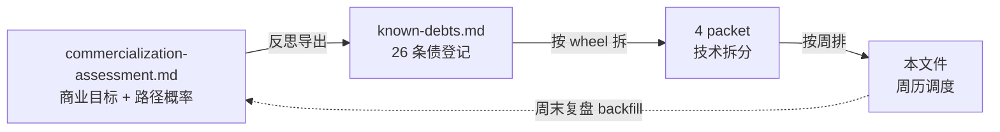
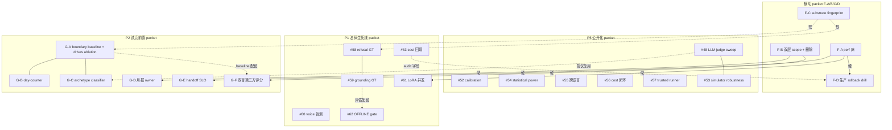

# Commercialization Evidence Rollout — 8 周加速版

> Status: rollout plan v0.2
> Last updated: 2026-05-13 (Stage 1-5 SHADOW scaffold all-land)
> 团队规模假设：5+ 工程师 + 2 reviewer（少于 5 人立刻退回 12 周路径）
> 与其他文档的关系：
> - [`docs/business/commercialization-assessment.md`](../business/commercialization-assessment.md) — 商业目标 + 路径概率（SSOT）
> - [`docs/known-debts.md`](../known-debts.md) — 26 条债（#45-#70）问题登记（SSOT）
> - [`cross-cutting-foundation-packet.md`](cross-cutting-foundation-packet.md) — 横切基础设施 packet（F-A/F-B/F-C/F-D）
> - [`companion-bench-public-launch-packet.md`](companion-bench-public-launch-packet.md) — P5 公开化 packet（7 sub-packet）
> - [`figure-evidence-packet.md`](figure-evidence-packet.md) — P1 法律生死线 packet（6 sub-packet）
> - [`growth-advisor-pilot-packet.md`](growth-advisor-pilot-packet.md) — P2 试点前置 packet（G-A 至 G-F）
> - 本文件 — 上述 4 packet 的**统一周历调度**，不重复 packet 内容

---

## 1. 调度面定位

### 1.1 这份文档解决的问题

26 条 debt（#45-#70）在 [`known-debts.md`](../known-debts.md) 已登记，4 个 packet 已把它们拆成 23 个 sub-packet，但**4 个 packet 是按 wheel 边界写的，没有时间维度**。当 5 个工程师同时启动时会撞上：

- **资源打架**：F-A perf 床、P5 reference SUT、P1 真 Qwen 都需要 GPU；reviewer 同时被 P1 GT 和 P2 boundary 拉住会瓶颈
- **依赖错位**：P1 #61 LoRA 并发 / P2 G-E handoff SLO 都依赖横切 F-A perf 床 ACTIVE；如果 F-A 没在 W5 前 ACTIVE，下游全推迟
- **交付节奏不齐**：4 个 packet 各自 SHADOW→ACTIVE 节奏不一致 → 商业评估 §9 KR 没有清晰对账周
- **kill 触发不一致**：每个 packet 的 kill criteria 是 packet 内部的，没有"哪一周整盘要重排"的整体视图

本文件不重写任何 packet 内容，只做**周历调度**：人 / 周 / 依赖 / 交付物 / kill。

### 1.2 与 SSOT 文档的角色分工

- **Assessment** = "我们要做什么 + 为什么" — 不在本文件改
- **Debts** = "哪些技术 evidence 缺位" — 不在本文件改
- **Packets** = "每个 evidence 怎么补 + SHADOW→ACTIVE 标准" — 不在本文件改
- **Rollout（本文件）** = "5 个人在 8 周里每周做什么 + 哪天该 kill"

### 1.3 8 周加速的依据

12 周原方案是按 1-2 人 × 顺序推进估算的。5+ 人允许 4 个 packet main owner 全程并行，sub-packet 内部的"评估层 + 数据层 + 治理层"也可同时跑（详见 §5）。8 周加速的硬边界条件：

1. 5 名工程师 + 2 名 reviewer 全员到位（少于此立刻退回 12 周）
2. F-A perf 床必须 W2 SHADOW（不然 P1 #61 / P2 G-E 全部后移 ≥ 2 周）
3. reviewer 必须 W1 招募完成（不然 W2 没法启动 GT 标注，P1 整组推迟）

---

## 2. 团队配置假设

### 2.1 5+ 人基线分工

| 角色 | 主负责 packet | 关键产出 owner | 全 8 周饱和度 |
|---|---|---|---|
| **Eng-A** | 横切（[cross-cutting-foundation-packet](cross-cutting-foundation-packet.md)） | F-A perf 床 / F-B 双层 scope schema / F-C substrate fingerprint / F-D rollback drill | 100%（横切是其他三组前置） |
| **Eng-B** | P5（[companion-bench-public-launch-packet](companion-bench-public-launch-packet.md)） | sweep 脚本 6 个 / 公开报告 7 份 / 12 中文 scenario 增补 | 100% |
| **Eng-C** | P1（[figure-evidence-packet](figure-evidence-packet.md)） | refusal/grounding eval 脚本 / bundle 字段 / cost 回填 / LoRA 并发实测 | 100% |
| **Eng-D** | P2（[growth-advisor-pilot-packet](growth-advisor-pilot-packet.md)） | LLMArchetypeClassifier / day-counter spec / 月报 owner / drives ablation | 100% |
| **Reviewer-1**（P1 主） | P1 GT 集合 | Einstein refusal 50+50 + grounding 100 + 第二款 figure 启动 | W1-W7 90%（单 packet 142 小时聚焦） |
| **Reviewer-2**（P2 主） | P2 boundary + 双盲 | boundary scenarios 100+ + N=20 双盲评估员管理 | W1-W6 80% + W7-W8 满负荷（双盲跑批） |
| **SE / Ops**（共享） | 横切 F-A 测试基础设施 / P2 G-E handoff SLO / 30 天试点对接 | infra + 客户对接 | 50% × 8 周 = 20 工程人天 |

**总人力**：5 工程师 × 5 工作日 × 8 周 = **200 工程人天** + reviewer 266 小时 + SE/Ops 20 人天

### 2.2 reviewer 单点风险拆分

原 packet 估算 reviewer 总工时 266 小时（P1 142 + P2 boundary 64 + P2 双盲 60）。单 reviewer 6-7 周满负荷会成为整盘瓶颈。

**拆分方案**：
- **Reviewer-1（P1 主）**：专注 figure refusal/grounding GT 标注（高领域门槛，需要历史 / 物理 / 哲学背景）
- **Reviewer-2（P2 主）**：专注 growth-advisor boundary scenarios + 双盲评估员管理（私域运营 / 心理咨询背景更合适）
- 跨 reviewer **不交叉标注同一份 GT**（避免 inter-rater κ 计算混入领域差异）
- 若只能找到 1 reviewer：把 P1 第二款 figure 推迟到 W9+，本 8 周只标 Einstein

### 2.3 共享资源池

| 资源 | 申请节奏 | 容量约束 |
|---|---|---|
| GPU（A100 / H100 等价物，含 P1 真 Qwen + 横切 baseline） | W2 起每周配额 | 1 卡 × 8 周 ≈ 1 GPU 月 + 30 GPU 小时 baseline |
| 头部 LLM API（GPT-5 / Claude Opus 4.7 / DeepSeek V4 / Qwen-Max / Gemini 2.5） | W1 起 token-budget control | 详 §7 |
| 招募评估员预算（P1 reviewer + P2 N=20 双盲 + P5 cross-validation） | W1 招募 / W6-W8 跑批 | 详 §7 |

---

## 3. 8 周周历表

每周一上午 30 min 同步会，按本表 checkbox 跑。每周末交付物见 §6。

| 周 | Eng-A 横切 | Eng-B P5 | Eng-C P1 | Eng-D P2 | Reviewer-1 (P1) | Reviewer-2 (P2) | SE/Ops |
|---|---|---|---|---|---|---|---|
| **W1** | F-A perf 床目录骨架 + `scripts/realistic_load_*.py` 模板 | #48/#52/#54 三 sweep 脚本骨架 + reference SUT 调用基础设施 | #58 refusal GT + #59 grounding GT schema 设计 + reviewer 工艺 spec | G-A boundary scenarios 设计 + G-C archetype 三路径决策表 | 招募 + on-board | 招募 + on-board | F-A 测试基础设施搭建 |
| **W2** | F-A perf 床 SHADOW + 单 vertical baseline 跑通 | sweep 跑第一批 reference SUT (10% scenario) | #58 GT in_scope schema 落库 + Einstein 真 corpus 对齐 | G-C 选型决策落档 (推 a-LLMArchetypeClassifier) | 标 Einstein in_scope ≥ 25 题 | 标 boundary scenarios ≥ 30 段 | 接 P5 sweep 跑 |
| **W3** | F-B 双层 scope schema 落 SHADOW + 删除 endpoint 设计 | sweep 跑完 + 出 robustness/calibration v0 报告 | #58 in_scope 50 + out_of_scope 50 全入库 + #59 grounding 50% | G-D 月报 schema 设计 + MonthlyReportOwner 骨架 | 标完 50 in + 50 out + 启动 grounding 100 | 标 boundary scenarios 80 段 | 接 P1 真 Qwen GPU |
| **W4** | F-B SHADOW 完整 + F-C substrate fingerprint schema | #55 跨语言 12 中 12 英 scenario 增补 + #57 trusted runner 设计 | #59 grounding eval 脚本 + 接 #41 真 Qwen 跑分 | G-B day-counter spec + contract test | 标完 grounding 100 题 | 标完 boundary 100+ 段 + 启动 G-A baseline | F-A 接所有下游 |
| **W5** | F-A ACTIVE + F-D rollback drill 设计 | #56 cost 闭环报告 + sweep v0.1 leaderboard 数据准备 | #62 OFFLINE gate validation protocol + #63 cost 回填 audit log | G-C LLMArchetypeClassifier 实现 + robustness sweep（用 P5 #48 协议） | Einstein refusal/grounding eval 报告 review + 第二款 figure 招募 | G-A baseline 跑通 + G-F 双盲 protocol 设计 | - |
| **W6** | F-B + F-C ACTIVE + F-D SHADOW | #53 simulator robustness sweep + 公开榜单 v0.1 dry-run | #58 + #59 ACTIVE + bundle 字段 land + 第二款 figure GT 启动 | G-A boundary baseline 报告 + G-D 月报 ACTIVE | 第二款 figure GT 启动（25%） | G-F N=20 双盲评估员招募 + on-board | G-E handoff SLO 测试设计 |
| **W7** | F-D rollback drill SHADOW + 生产回滚演练第一次 | 公开榜单 v1.0 准备 + #57 trusted runner 端到端 | #61 LoRA 并发实测（用 F-A perf 床） | G-D 月报 ACTIVE + G-F 双盲 protocol 跑第一批 | 第二款 figure GT（50%） | 双盲第一批跑 + κ 计算 | G-E SLO 测试跑 |
| **W8** | F-D ACTIVE + 生产回滚演练第二次 + 全 8 周 retrospective | 公开榜单 v1.0 上线 + arXiv preprint 草稿 | #61 报告 + 第二款 figure GT 50% + cost 回填发布 | G-E ACTIVE + G-F 双盲第二批跑 + 30 天试点 ready | 第二款 figure GT（70%） | 双盲第二批跑 + 报告 v0.1 | 30 天 P2 试点客户对接 |

---

## 4. 跨 packet 依赖图

**硬依赖（实线）**：上游不 ACTIVE 下游不能起跑
**软依赖（虚线）**：上游建议 ACTIVE，下游可在 SHADOW 阶段并行

详细 sub-packet 依赖见各 packet 文件 §"与其他反思 packet 的接口" 段落。

---

## 5. 加速到 8 周的关键决策

### 5.1 为什么不是 12 周

| 决策 | 12 周原方案 | 8 周加速方案 |
|---|---|---|
| 工程师并行度 | 1-2 人按 packet 串行 | 4 人各 packet main owner 全程并行 |
| reviewer | 单 reviewer 6-7 周满负荷 → 瓶颈 | 拆 2 reviewer，P1/P2 各专一 |
| F-A perf 床节奏 | W3 ACTIVE | W2 SHADOW + W5 ACTIVE（提前 1 周让下游紧跟） |
| P5 sweep | #48 / #52 / #54 顺序跑 | 三路真并行（共用 reference SUT 调用基础设施） |
| GT 标注 | reviewer 跨 packet 串行 | reviewer 1 标 P1 + reviewer 2 标 P2，零等待 |

### 5.2 8 周边界条件

**硬条件**（任一未满足立刻退回 12 周）：
1. 5 名工程师 + 2 reviewer W1 全部到位
2. GPU 资源 W2 起每周可用 ≥ 1 卡
3. 头部 LLM API 预算 W1 批准（详 §7）

**软条件**（建议但可缓冲）：
1. SE/Ops 50% × 8 周（缓冲：横切 F-A 由 Eng-A 自己包，但要让出 P1/P2 接入工作）
2. P1 第二款 figure GT 在 W6 启动（缓冲：可推到 W9+，不影响 8 周主交付物）

---

## 6. 每周交付物清单

每周末必须产出的具体 artifact（团队周会用 checkbox 跑）。下方"交付路径"示意，具体子任务见各 packet 文件。

| 周末 | 必须产出（4 packet 各一行） |
|---|---|
| **W1** | 横切：F-A 目录骨架 PR / P5：#48/#52/#54 sweep 脚本骨架 PR / P1：refusal+grounding GT schema spec PR + reviewer on-board / P2：archetype 三路径决策表 PR + boundary scenarios 设计 |
| **W2** | 横切：F-A SHADOW（baseline latency 报告） / P5：sweep 第一批数据（10% scenario） / P1：Einstein refusal in_scope ≥ 25 题入库 / P2：archetype 选型决策落档 (a-LLMArchetypeClassifier) |
| **W3** | 横切：F-B 双层 scope SHADOW + DELETE endpoint 设计 / P5：sweep v0 robustness/calibration 报告 / P1：refusal 50+50 全入库 + grounding 50% / P2：月报 schema spec |
| **W4** | 横切：F-B SHADOW 完整 + F-C fingerprint schema / P5：12 中文+12 英文 scenario 增补 + trusted runner 设计 / P1：grounding 100% + grounding eval 脚本 / P2：day-counter SHADOW + 测试 |
| **W5** | 横切：F-A ACTIVE / P5：cost 闭环报告 + leaderboard 数据准备 / P1：OFFLINE gate validation protocol + cost 回填 audit log / P2：LLMArchetypeClassifier 实现 + robustness sweep |
| **W6** | 横切：F-B + F-C ACTIVE + F-D SHADOW / P5：simulator robustness 报告 + 公开榜单 v0.1 dry-run / P1：refusal+grounding ACTIVE + bundle 字段 land + 第二款 figure GT 启动 / P2：boundary baseline 报告 + 月报 ACTIVE |
| **W7** | 横切：F-D SHADOW + 生产回滚演练 #1 / P5：公开榜单 v1.0 准备 + trusted runner 端到端 / P1：LoRA 并发实测报告 / P2：双盲 N=20 评估员 on-board + 第一批跑 |
| **W8** | 横切：F-D ACTIVE + 生产回滚演练 #2 + 8 周 retrospective / P5：公开榜单 v1.0 上线 + arXiv preprint 草稿 / P1：第二款 figure GT 50% + cost 回填发布 / P2：handoff SLO ACTIVE + 双盲第二批 + 30 天试点 ready |

---

## 7. 资源 + 成本汇总

### 7.1 工程总投入

| 项 | 量 | 备注 |
|---|---|---|
| 工程师 × 周 | 4 main + 1 SE/Ops × 8 = **40 人周 = 200 人天** | 5 名工程师全 8 周饱和 |
| Reviewer × 小时 | Reviewer-1: 142 + Reviewer-2: 124（boundary 64 + 双盲 60）= **266 小时** | 拆双 reviewer 后无单点瓶颈 |
| GPU | 30 GPU 小时（横切 baseline）+ 1 GPU 月（P1 真 Qwen） | A100 / H100 等价物 |

### 7.2 API + 评估成本（8 周累计，¥）

| 项 | 估算 | 来源 |
|---|---|---|
| P5 sweep API（#48 + #52 + #53 + #54） | $8-11k ≈ ¥56-77k | [companion-bench packet §7 + #56 cost 闭环] |
| P5 reference 公开榜单跑分（10 SUT × 24 公开 scenario） | $5-15k ≈ ¥35-105k | 来自 [#32](../known-debts.md) 既有估算 |
| P1 真 Qwen PEFT（GPU 月 + Anthropic judge） | ¥15-25k | [figure-evidence packet 资源段] |
| P2 LLMArchetypeClassifier（DeepSeek V4，每席位 ¥250-500/月 × 测试 N=10 席位 × 2 月） | ¥5-10k | [growth-advisor packet G-C 单位经济段] |
| P1 reviewer × 142 小时（¥200-300/小时） | ¥28-43k | reviewer 工时按市场价 |
| P2 Reviewer-2 × 124 小时（¥150-250/小时） | ¥19-31k | 私域运营领域 reviewer |
| P2 双盲评估员 N=20 × 3 小时 × ¥100 | ¥6k | 双盲 N=20 一次性 |
| 共享 / 缓冲 | ¥20-40k | 招募 / 备份 GPU / 临时人员 |
| **8 周总成本** | **¥184-337k**（中位 ≈ ¥260k） | Phase A 6 个月预算的 50-67% |

### 7.3 与商业评估单位经济对账

- **§6.2 P1**：单笔首单 30-80 万人民币毛利率 46-60% → 本 rollout 8 周成本 ¥184-337k 对应"建立 P1 sales kit + 真实成本锚点"，3-5 个月内拿到第一笔签约即正向
- **§6.3 P2**：客单价 60 万/年毛利 ~88% → P2 G-C archetype classifier 持续成本 ¥250-500/客户/月已计入 §6.3 表，8 周一次性投入回收期 1-2 个客户
- **§7.2 P5 GTM 上限**：10-30 万人民币 → 本 rollout P5 部分（API + reviewer 投入）¥98-188k，在上限内

---

## 8. Kill Checkpoint

按周设置 kill 触发条件。**连续 2 周 miss 同一类指标则触发整盘重排**。

| 周末 | Kill 触发条件 | 触发后行动 |
|---|---|---|
| **W2** | F-A perf 床 SHADOW 没出（latency 报告未生成） | 退回 12 周路径；P1 #61 / P2 G-E 全部推迟 ≥ 2 周 |
| **W3** | reviewer 标注速率 < 25 题 / reviewer · 周 | 加 reviewer 或 GT 集合规模降一半（refusal 50→25 / grounding 100→50） |
| **W4** | P5 sweep 跑出 judge inter-rater variance > 50%（跨家族 SUT 排名严重不一致） | P5 公开化推迟到 W12+；arXiv preprint 推迟；本 rollout 第 §9.1 节 KR1 风险 |
| **W5** | F-A ACTIVE miss | P1 #61 / P2 G-E 全部推迟 2 周；W7 W8 交付物砍 |
| **W6** | P2 G-C LLMArchetypeClassifier 跨家族方差 > 30% | archetype 整体重设计（[commercialization-assessment](../business/commercialization-assessment.md) §4.2 P2 kill criteria 触发）；G-D 月报"archetype 分布"字段降级为 placeholder |
| **W7** | P5 公开榜单 dry-run 发现排名不稳（前 3 SUT 互换） | 公开化推迟 + 触发 #54 statistical power 重做 + 加更多 seed |
| **W8** | F-D ACTIVE miss / 生产回滚演练失败 | 暂缓 ModificationGate 任何 OFFLINE artifact 进 ACTIVE；P1 第二款 figure 推迟 |

**整盘 kill**（连续 2 周 miss 任 3 项以上）：暂停 8 周加速版，回退到 12 周原方案 + 重排资源；触发 [commercialization-assessment §11](../business/commercialization-assessment.md) 90 天复盘机制提前到当前周。

---

## 9. 与商业评估 KR 的对账

[commercialization-assessment §9.2](../business/commercialization-assessment.md) 的 10 条 KR 与本 rollout 8 周交付物逐条映射：

| KR | 量化目标 | 本 rollout 贡献 | KR 满足周 |
|---|---|---|---|
| **KR1** Companion Bench 公开榜单 + 5 外部提交（6 个月内） | P5 路径 | W8 公开榜单 v1.0 上线（#48+#52+#53+#54+#55+#57 全 ACTIVE）；W9-W26 接受外部提交 | W8 部分（榜单上线）/ KR 完整需 6 个月外部提交累积 |
| **KR2** arXiv preprint + 主流媒体报道（9 个月内） | P5 路径 | W8 arXiv preprint 草稿（含 #48 robustness + #52 calibration + #54 power 三块方法论）；W9-W12 投稿 / 媒体投递 | W12-W16 |
| **KR3** 爱因斯坦端到端 demo（6 个月内） | P1 路径 | 本 rollout 8 周完成 evidence 层（#58 refusal GT + #59 grounding GT + #62 OFFLINE protocol + #63 cost 回填）；剩余 4-16 周做 demo PR / 法务 / 媒体 | W12-W20 |
| **KR4** P1 至少 1 签约客户付编译费（12 个月内） | P1 路径 | 本 rollout 不直接达成；W8 后 P1 sales kit 完整（含 §6.2 实测成本 + L4/L3 evidence + 法律备忘录占位）；销售周期 3-6 月 | W20-W36 |
| **KR5** P2 至少 3 签约客户 + 1 续签 6 月以上（12 个月内） | P2 路径 | W8 后启动 30 天 P2 试点；4-6 月看到第一笔签约；6 月+ 看到续签 | W20-W36（签约）/ W36-W52（续签） |
| **KR6** P4 灯塔 PoC（18 个月内） | P4 路径 | 本 rollout 不直接覆盖；横切 F-B 双层 scope + F-D rollback drill 是 P4 enterprise 销售前置 | W36+ |
| **KR7** 累计真实付费收入 > 300 万（18 个月内） | 综合 | 本 rollout 是收入产生的 evidence 前置，不直接产收入；KR4 + KR5 实现后线性 | W36+ |
| **KR8** 工程纪律不变量零回归 | 持续 | 每个 sub-packet 走 SHADOW→ACTIVE 都强制契约测试，本 rollout 不破坏 | 持续（每周末 CI 检查） |
| **KR9** 合规零重大事件 | 持续 | 横切 F-B（删除路径）+ P1 #58/#59（GT 双盲 + NDA）+ P2 G-F（评估员 transcript 删除）三件直接服务合规 | 持续 |
| **KR10** 核心团队人员流失 0 | 持续 | reviewer 单点拆分（§2.2）+ Phase A 必出"对外可见的成功"（§9.4）维持士气 | 持续 |

### 9.1 8 周后的 KR 满足度

| KR | W8 满足度 | 说明 |
|---|---|---|
| KR1 | **65%** | 榜单技术就绪 + 公开上线，但 5 外部提交需要后 4-6 周累积 |
| KR2 | **30%** | preprint 草稿就绪，投稿 + 媒体跟进需后 4-8 周 |
| KR3 | **70%**（evidence 层）| GT + verification + cost 全到位，剩余是 demo 包装 |
| KR4 | **25%**（前置）| sales kit 完整，签约需销售周期 |
| KR5 | **30%**（前置）| 30 天试点 ready，签约 + 续签需后 16-32 周 |
| KR6 | **15%** | 横切层间接服务，本 rollout 未直推 |
| KR7 | **0%** | 无直接贡献 |
| KR8 / KR9 / KR10 | **持续维护** | 不在本 rollout 计 |

### 9.2 P1 / P2 / P5 商业概率提升

| 路径 | 12 个月概率（基线） | 本 rollout 完成后预测 | 提升来源 |
|---|---|---|---|
| **P5** | 60-75% | **70-72%** | calibration + judge robustness + power analysis 让公开化第一击立得住（[companion-bench packet §1.5]） |
| **P1** | 35-50% | **45-55%** | refusal/grounding GT 让法务签字门变低；cost 回填让报价有锚点（[figure-evidence packet §3]） |
| **P2** | 30-45% | **40-50%** | boundary baseline + 月报 + 双盲让 30 天试点有"运营总监能看懂"的 evidence（[growth-advisor packet §1]） |

---

## 10. 推荐的"第一周 PR 拆法"

W1 五个工程师每人开 1 个 PR 启动各 packet 第一个 sub-packet。每个 PR 标题模板 + 必须含的产出：

| PR | 标题 | 关键产出 | Owner |
|---|---|---|---|
| **PR-1** | `feat(perf): scaffold tests/perf/ + scripts/realistic_load_*.py 骨架（F-A 子任务 1）` | `tests/perf/__init__.py` + `scripts/realistic_load_companion.py` / `realistic_load_figure.py` / `realistic_load_growth_advisor.py` 骨架 + `docs/specs/perf-baseline.md` 占位 | Eng-A |
| **PR-2** | `feat(companion-bench): add scripts/companion_bench/judge_robustness_sweep.py 骨架（#48 子任务 1）` | sweep 脚本骨架（CLI args + 多 family LLM judge 接入接口）+ `docs/external/companion-bench-judge-robustness-v0.md` 占位 | Eng-B |
| **PR-3** | `docs(figure): add data/figure_refusal_gt/ schema + reviewer 工艺 spec（#58 子任务 1）` | `data/figure_refusal_gt/<figure_id>/{in_scope,out_of_scope}.jsonl.example` + `docs/specs/figure-refusal-gt-protocol.md`（schema + reviewer 双盲工艺 + κ 一致性公式） | Eng-C |
| **PR-4** | `docs(growth-advisor): add growth-advisor-archetype-detection spec + 三路径决策表（#66 子任务 1）` | `docs/specs/growth-advisor-archetype-detection.md`（a/b/c 三路径对比 + 决策推 a + 单位经济估算）+ `tests/contracts/test_no_keyword_archetype_detection.py` 骨架 | Eng-D |
| **PR-5**（共享） | `docs(rollout): commercialization-evidence-rollout.md v0.1 master schedule` | 本文件 + `docs/business/commercialization-assessment.md` 顶部加一行"详见 docs/moving forward/commercialization-evidence-rollout.md"链接（**只加链接，不改 §5.2 内容**） | Tech Lead |

**约束**：
- W1 5 个 PR 互不冲突（不同目录），可同周 review + merge
- PR-3 / PR-4 是 docs-only，过 review 即可 merge；PR-1 / PR-2 是 scaffold，CI 走通即 merge（不要求功能完整）
- PR-5 是 rollout v0.1，merge 后任何 schedule 更新走 v0.X bump

---

## 11. 复盘节奏

### 11.1 每周一上午 30 min 同步会

参与：5 工程师 + 2 reviewer 代表 + 1 BD + Tech Lead

议程（按 §6 周交付物 checkbox）：
1. 上周 checkbox 完成情况（每人 2 min）
2. 本周 checkbox 拆分（每人 1 min）
3. 跨 packet 依赖打架 / 资源冲突（5 min）
4. Kill checkpoint 检查（1 min）

### 11.2 每 2 周末 master rollout v0.X bump

- 更新本文件 §3 周历表（移已完成行到归档段）
- 更新 §6 交付物清单（标 ✅ / ⚠️ miss / ❌ killed）
- 更新 §9 KR 满足度

### 11.3 W4 末 + W8 末 full rollout 校准

对照 [commercialization-assessment §11](../business/commercialization-assessment.md) 90 天复盘机制：
- W4 末：相当于 30 天复盘点，按 §11.2 复盘清单跑（§1-§10 各 1 个问题）
- W8 末：相当于 60 天复盘点 + 8 周 retrospective；触发 v0.2 bump
- 90 天点（W12 末）：进入正式商业评估复盘节奏，本 rollout 转为 evidence run mode

---

## 附录 A. 待 reconcile 清单

如本文件落地后发现与 4 个 packet 内容冲突，记到此处下轮处理：

- _（W1 末第一次填）_

## 附录 B. 8 周后的 Phase B 衔接

W8 完成后进入 Phase B（[commercialization-assessment §5.3](../business/commercialization-assessment.md) "6-12 个月变现期"）。本 rollout 不覆盖 Phase B，但留下三件接口：

1. **30 天 P2 试点客户对接**（W8 ready）→ Phase B W9-W12 启动
2. **第二款 figure GT 完成**（W8 50% → Phase B W12 100%）→ Phase B 第二个 P1 客户准备
3. **公开榜单接受外部提交**（W8 上线）→ Phase B 持续运营

## 附录 C. 退回 12 周路径

如 §5.2 硬条件未满足，退回 12 周路径的关键差异：

- 工程师 1-2 人按 packet 串行（顺序：横切 → P5 → P1 → P2）
- reviewer 单人轮转（P1 GT 占 6-7 周满负荷，P2 推迟到第 8 周后）
- F-A perf 床 W3 SHADOW + W6 ACTIVE
- W12 末才完成 §3 W8 末等价产出

退回触发条件、详细周历表见 [`cross-cutting-foundation-packet.md`](cross-cutting-foundation-packet.md) 顺位 1 段（横切 packet 的 12 周原 plan 是 8 周加速版的回退基线）。

---

## 附录 D. Scaffold All-Land Status (2026-05-13 v0.2 bump)

本日一次性 land 了 4 阶段全部 SHADOW scaffold（团队 W1 不需要再开 PR-1/2/3/4 骨架，直接进入 W2 evidence run 推进）。

### Stage 1 — 横切 scaffold (F-A/B/C/D)

✅ 新建 (17 个文件):
- `tests/perf/__init__.py` + `tests/perf/conftest.py` (含 `asyncio_harness` / `concurrent_lifeform_factory` / `gpu_mem_tracker` fixture + `@pytest.mark.perf` 自动 skip)
- `tests/perf/test_concurrent_lifeform_sessions.py`
- `tests/perf/test_multi_vertical_owner_propagation.py`
- `tests/perf/test_persona_lora_hot_swap_concurrency.py`
- `tests/perf/test_production_rollback_drill.py`
- `scripts/realistic_load_companion.py`
- `scripts/realistic_load_figure.py`
- `scripts/realistic_load_growth_advisor.py`
- `scripts/rollback_drill_figure.sh`
- `scripts/rollback_drill_growth_advisor.sh`
- `scripts/rollback_drill_substrate_upgrade.sh`
- `docs/specs/perf-baseline.md`
- `docs/specs/substrate-upgrade-protocol.md`
- `docs/specs/rollback-drill-cadence.md`
- `docs/specs/evidence-deletion-protocol.md`
- `packages/vz-substrate/src/volvence_zero/substrate/substrate_fingerprint.py`
- `packages/lifeform-service/src/lifeform_service/evidence_deletion.py`

✅ 修改 (4 个文件):
- `packages/vz-memory/src/volvence_zero/memory/identity.py` (加 `TenantIdentity` / `EndUserIdentity` / `derive_scope_key`)
- `packages/vz-memory/src/volvence_zero/memory/__init__.py` (export 双层 scope)
- `packages/lifeform-service/src/lifeform_service/alpha.py` (加 `bind_session_two_layer` opt-in)
- `packages/vz-substrate/src/volvence_zero/substrate/__init__.py` (export `SubstrateFingerprint`)

✅ contract test (3 个):
- `tests/contracts/test_two_layer_scope_isolation.py`
- `tests/contracts/test_evidence_deletion_proof_chain.py`
- `tests/contracts/test_substrate_fingerprint_propagation.py`

### Stage 2 — P5 公开化 scaffold

✅ 新建 (14 个文件):
- 6 sweep scripts: `scripts/companion_bench/{judge_robustness,calibration,simulator_robustness,statistical_power,estimate_quarterly_cost,trusted_runner}_sweep.py` + `_sweep`/`_runner` 后缀
- 7 公开报告: `docs/external/companion-bench-{judge-robustness,calibration-report,simulator-robustness,statistical-power,cost-model,trusted-runner-protocol,heldout-leak-protocol}-v0.md`
- contract test: `tests/contracts/test_heldout_access_audit.py`

✅ 修改 (3 个文件):
- `packages/companion-bench/src/companion_bench/spec.py` (`ScenarioSpec.language` 字段，**不**进 `to_canonical()` 保持 hash 稳定)
- `packages/companion-bench/src/companion_bench/aggregator.py` (`WEIGHTS_VERSION = "v1.0"` + 引证 docstring)
- `packages/companion-bench/src/companion_bench/arc_runner.py` (`ArcRecord.sut_substrate_fingerprint` + `simulator_family` Optional 字段)

### Stage 3 — P1 figure-evidence scaffold

✅ 新建 (16 个文件):
- 3 GT example JSONL: `data/figure_refusal_gt/einstein/{in_scope,out_of_scope}.jsonl.example` + `data/figure_grounding_gt/einstein/assertions.jsonl.example`
- 4 eval scripts: `scripts/figure_{refusal_eval,grounding_eval,voice_blind_test,cost_summary}.py`
- 6 specs: `docs/specs/figure-{refusal-gt-protocol,grounding-gt-protocol,voice-blind-test-protocol,offline-gate-validation-protocol,persona-lora-concurrency}.md` + `docs/business/figure-bake-cost-actuals.md`
- contract test: `tests/contracts/test_figure_bundle_refusal_gt_required.py`

✅ 修改 (1 个文件):
- `packages/lifeform-domain-figure/src/lifeform_domain_figure/figure_artifact.py` (加 `compatible_substrates` + 3 个 eval report Optional 字段；`compute_bundle_integrity_hash` 接受 `compatible_substrates` 参数)
- `packages/lifeform-domain-figure/src/lifeform_domain_figure/audit.py` (`FigureBakeAuditRecord.cost_breakdown` 字段)

### Stage 4 — P2 growth-advisor scaffold

✅ 新建 (15 个文件):
- 1 example JSONL: `packages/lifeform-domain-growth-advisor/data/growth_advisor_boundary_eval/cheng_laoshi/scenarios.jsonl.example`
- 2 eval scripts: `scripts/growth_advisor_{boundary_eval,drive_ablation}.py`
- 1 classifier: `packages/lifeform-domain-growth-advisor/src/lifeform_domain_growth_advisor/archetype_classifier.py`
- 1 owner: `packages/lifeform-service/src/lifeform_service/monthly_report_owner.py`
- 1 prompt: `packages/lifeform-expression/src/lifeform_expression/prompts/growth_advisor_archetype_classify.txt`
- 1 schema: `packages/lifeform-expression/src/lifeform_expression/schemas/archetype_classification.json`
- 7 specs: `docs/specs/growth-advisor-{boundary-baseline,drive-ablation-evidence,day-counter,archetype-detection,monthly-report}.md` + `docs/specs/{handoff-queue-slo,external-validation-protocol}.md`

✅ 修改 (1 个文件):
- `packages/lifeform-domain-growth-advisor/src/lifeform_domain_growth_advisor/profile.py` (加 `validated_substrates` 字段)

✅ contract / perf test (4 个):
- `tests/contracts/test_growth_advisor_day_routing.py`
- `tests/contracts/test_no_keyword_archetype_detection.py`
- `tests/contracts/test_monthly_report_schema_stability.py`
- `tests/perf/test_handoff_queue_concurrent_load.py`

### Stage 5 — rollout v0.2 + known-debts SHADOW 标注

- 本附录 D 落档
- `docs/known-debts.md` 顶部加 update 段标注 26 条 debt 进入 SHADOW

### 总产出

- **新建文件 ~62 个**（spec markdown ~17 / .py scaffold ~22 / contract+perf test ~10 / sh script ~3 / JSONL example ~4 / prompt+schema ~2 / public reports ~7 / business doc ~1）
- **修改现有文件 ~10 个**（identity.py / alpha.py / 两个 __init__.py / figure_artifact.py / audit.py / spec.py / aggregator.py / arc_runner.py / profile.py）
- **不动**：[`commercialization-assessment.md`](../business/commercialization-assessment.md)（SSOT 不变）/ 4 个 packet 文件本身（仅本 rollout 文件加附录）

### 团队接手指南

W2 起团队需要做的（不再写骨架）：
1. **reviewer 招募**：P1 GT 标注 (refusal+grounding) / P2 boundary scenarios 标注（详见 `figure-refusal-gt-protocol.md` §4 + `growth-advisor-boundary-baseline.md` §5）
2. **API key 准备**：P5 6 sweep 需要 5 LLM family API key（GPT-5 / Claude Opus 4.7 / DeepSeek V4 / Qwen3 / Gemini 2.5），预算 ¥93-186k（见 `companion-bench-cost-model-v0.md`）
3. **GPU 准备**：P1 真 Qwen-1.5B PEFT (#41) + 横切 F-A baseline + F-D rollback drill，~1 GPU 月
4. **实跑顺序**：W2 横切 F-A baseline → W3 sweep 第一批 → W6 GT eval ACTIVE → W8 双盲跑批

## 变更日志

- 2026-05-13: v0.1 初稿。基于 4 个 packet（cross-cutting / companion-bench / figure-evidence / growth-advisor）+ 26 条 debt（#45-#70）+ 5+ 人团队加速假设。
- 2026-05-13: v0.2 bump。Stage 1-5 全 SHADOW scaffold 一次性 land（约 62 新 + 10 改）。本 rollout 文件加附录 D 记录所有 land 的文件清单 + 团队接手指南。下次 v0.3 bump 在 W2 末（按 §11.2 双周节奏）。
