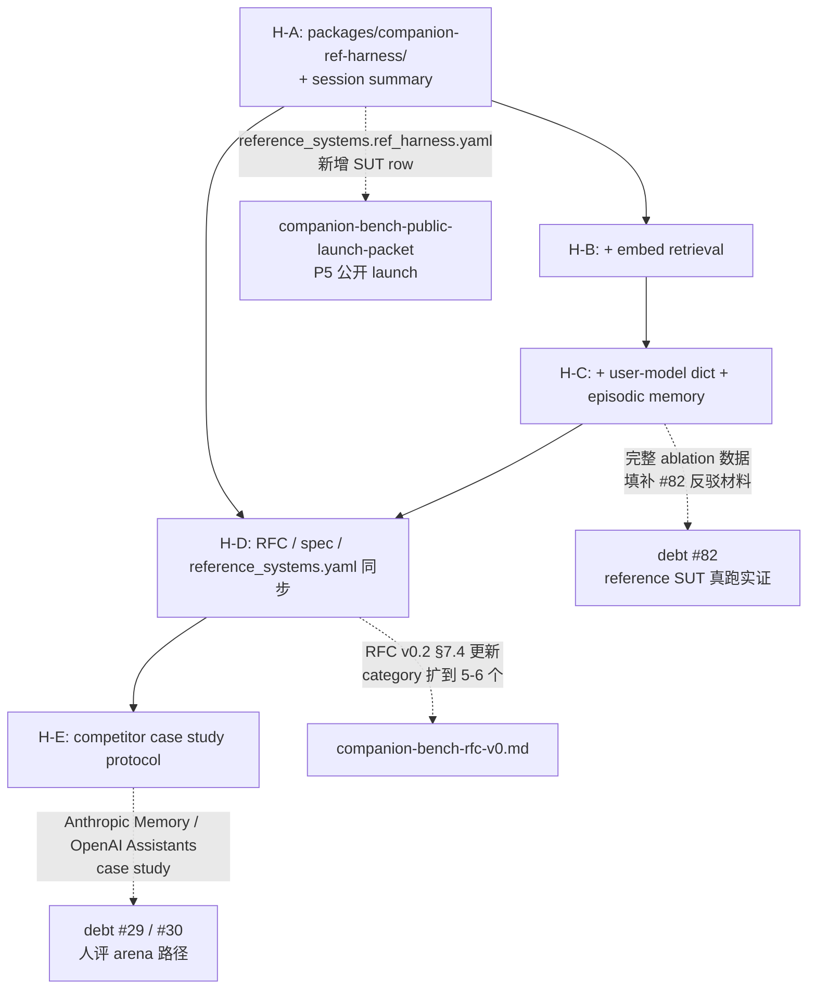

# Companion Ref-Harness Packet

> 出处：[`docs/external/companion-bench-rfc-v0.md`](../external/companion-bench-rfc-v0.md) §7.4 三 leaderboard category + §8.4 persona-vs-system confusion 警告 + [`docs/external/companion-bench-submission-protocol.md`](../external/companion-bench-submission-protocol.md) §3 三 category 分列
> 覆盖：新 debt **#84**（Reference Companion Harness baseline 缺位 — `closed-api` 列在测"裸 API 没有 memory"而不是"模型是不是好的 companion 基底"）
> 与既有 packet 的关系：[`docs/moving forward/companion-bench-public-launch-packet.md`](companion-bench-public-launch-packet.md)（P5 公开化 evidence 防御）+ [#29](../known-debts.md) 第三方分数路径 + [#32](../known-debts.md) sub-track 1 真 reference 跑分 + [#82](../known-debts.md) reference SUT 真跑实证 — 本 packet 是**对前述 launch packet 的方法论补丁**：在 reference 跑分前先把 closed-api 列的"自high 风险"用 reference harness 堵掉，避免第一次 leaderboard 发布即被"GPT-5 raw 怎么可能在 multi-session 上拿分"的合理质疑反噬
> 状态：plan v0.1，待 packet review
> Last updated: 2026-05-17
> 上游商业承诺锚点：[`docs/business/commercialization-assessment.md`](../business/commercialization-assessment.md) §7.2 第 2 步"第一份长程陪伴排行榜"GTM 时序 + §10.2 反目标"benchmark 公信力归零"红线

---

## 0. TL;DR（≤ 8 行）

- 本 packet 拆 5 个 sub-packet：**H-A**（包骨架 + session summary）/ **H-B**（embed retrieval）/ **H-C**（user-model + episodic memory）/ **H-D**（方法论文档同步）/ **H-E**（competitor case study）
- H-A 是其他 4 个 sub-packet 的**硬前置**（包不立、契约不冻结，下游 ablation 跟方法论文档全没落点）
- H-A → H-B → H-C 串行（每步加一个组件 + 一份 ablation evidence）；H-D 必须在 H-C 完成后启动；H-E 必须在 H-D 完成后启动
- 关键 SSOT 守门：新 wheel `packages/companion-ref-harness/` Apache 2.0 独立协议、**不得** import `volvence_zero.*` / `lifeform_*` / `companion_bench.*`、4 个组件状态 4 个独立 SQLite owner、`policy.py` 是 prompt blend 唯一入口
- 反目标对偶（[`commercialization-assessment.md`](../business/commercialization-assessment.md) §10.2）：本 packet 命中 0 条产品反目标 + 命中 0 条商业反目标 + **直接降低**"公开 companion-bench 的私有 held-out 提示集 → benchmark 价值归零"的同构红线触发概率
- 总资源估算：**8-12 人周工程** + **零 GPU 小时**（CPU + 闭源 API）+ **~$3500-5500 USD 外部 API 预算**（H-A/H-B/H-C ablation 跑分 + H-E case study）
- 总时长（按 Phase A 节奏 6-8 周可全部 SHADOW → ACTIVE，与 P5 公开化 launch 节奏对齐）

---

## 1. 为什么要这份 packet（问题陈述）

### 1.1 两个结构性洞

当前 CompanionBench 的 `closed-api` track 有两个方法论层面的洞，它们叠加导致**第一次公开 leaderboard 一发就被反噬**：

**洞 1：reference systems 全部按 raw `/v1/chat/completions` 跑**

[`scripts/companion_bench/reference_systems.yaml`](../../scripts/companion_bench/reference_systems.yaml) 把 GPT-5 / Claude Opus 4.6 / Gemini 3 Pro / DeepSeek V3 / Llama-3-70B / Qwen 2.5-72B / Mistral Large 全部按 raw chat-completions 端点配置，唯一的差异化是 `system_prompt` 一段"You are a long-running companion AI"。

**洞 2：runner 在 session 边界 reset transcript**

[`packages/companion-bench/src/companion_bench/arc_runner.py`](../../packages/companion-bench/src/companion_bench/arc_runner.py) 第 217 行 `transcript_messages = _fresh_history()` 在每个 non-S1 session 开始时清空历史。

```209:217:packages/companion-bench/src/companion_bench/arc_runner.py
    for s_idx in range(1, spec.arc_length_sessions + 1):
        if s_idx == 1:
            gap_days = 0
        else:
            gap_days = spec.inter_session_gap_days[s_idx - 2]
            # Inject a user-side time-elapsed marker so the SUT sees
            # session boundaries explicitly. Kept inside the user
            # turn (not the system prompt) per RFC §7.1.
            transcript_messages = _fresh_history()  # session_id changes; reset history view
```

raw OpenAI / Anthropic API 不识别 `metadata.session_id`、不做任何 server-side 持久化，**跨 session 的 A3（continuity，weight 0.25，RFC §4 最大权重）结构上就是 0 分**。

### 1.2 后果：自high 风险

[`docs/external/companion-bench-rfc-v0.md`](../external/companion-bench-rfc-v0.md) §4 把 A3 设成最大权重轴（0.25），明确"a single 0 cannot literally collapse the score to 0; it just heavily penalises"——但 raw API 在跨 session A3 上**永远**只能拿底线分。

这导致：

- VolvenceZero Lifeform（带 controller 层的完整 agent）跟 GPT-5 raw API 同图出现 → 读者**不可能**自己脑补"那个其实是 raw"
- pitch deck v11 拿这个对比图作为差异化证据 → 第一次被 reviewer / 投资人 / 学术界看到就会反问"你给 GPT-5 套一层最起码的 memory wrapper 它能拿多少分？"
- 答不上这个问题 = leaderboard 公信力归零（同 [`commercialization-assessment.md`](../business/commercialization-assessment.md) §10.2 "benchmark 价值归零"红线同构）

### 1.3 RFC 已有的 3 category 不够用

RFC §7.4 + submission protocol §3 已经规定三个不能混排的 category：`open-weight` / `closed-api` / `bespoke`。**理论上**，c.ai / Replika / Talkie / VolvenceZero Lifeform 都属于 `bespoke`，跟裸 GPT-5 不应该出现在同一列。

但**操作层有一个空白**：`closed-api` 这一列本身现在就是"裸 chat-completions"，缺一个 vendor-neutral 的**标准 agent wrapper** 把 raw API 公平地包一层。这是 LongMemEval / MemoryBench / LoCoMo 等长程 memory benchmark 的标准做法——给所有 raw API 套同一个"最低 companion 基础设施"，保证 substrate 之间的比较不被"raw 没有 memory"这个 trivial 因素 dominate。

### 1.4 设计原则对齐

按 [`.cursor/rules/first-principles-not-patches.mdc`](../../.cursor/rules/first-principles-not-patches.mdc) R2 稳定基底 + 自适应控制器：**reference companion harness 就是最小化的 controller 层**，它把 substrate 跟 system 的边界**做实**——这本来就是我们对外讲述差异化（"我们的 controller 层比标准 harness 强多少"）的前提。没有 reference harness，"controller 层有多少贡献"这件事**根本无法量化**。

按 [`.cursor/rules/ssot-module-boundaries.mdc`](../../.cursor/rules/ssot-module-boundaries.mdc) R8 快照优先 + 唯一所有者：harness 4 个组件各自一个 SQLite table 作为 owner，通过 `policy.py` 的 typed snapshot blend 进 prompt——既不破坏 CompanionBench 现有 `SUTClient` 契约，也不引入第二个 owner。

---

## 2. 与既有 land 工作 / packet 的衔接



### 2.1 与 [`companion-bench-public-launch-packet`](companion-bench-public-launch-packet.md) 的依赖

launch packet 解决的是"第一次跑分发布前 evidence 防御"——但它的 7 个 sub-packet（#48 judge / #52 calibration / #53 simulator / #54 power / #55 i18n / #56 cost / #57 trusted-runner）**全部默认 SUT 池就是 raw API + Lifeform**。本 packet 解决 SUT 池本身的结构问题：

- launch packet 跑出来的 reference SUT 排名表里，`closed-api · raw` 列下 GPT-5 跨 session A3 永远 0 分 → 排名虚低 → 第三方质疑
- 本 packet 在 launch 之前补一个 `closed-api · ref-harness-summary` + `closed-api · ref-harness-full` 列，让"GPT-5 这个 substrate 在标准 agent infra 下能拿多少分"有数字可答

**时序绑定**：本 packet 的 H-A + H-D 至少要 SHADOW 落档**早于** launch packet 的 [#32](../known-debts.md) sub-track 1 真 reference 跑分启动；H-C + H-D ACTIVE 必须**早于** launch packet 的 [`docs/external/companion-bench-rfc-v0.md`](../external/companion-bench-rfc-v0.md) v0.1 → v1.0 升级公开发布。

### 2.2 与 [#82](../known-debts.md) 6 大主流 substrate 真跑实证的衔接

[#82](../known-debts.md) 已立 launch 硬前提"6 大主流 substrate（GPT-5 / Claude Opus 4.7 / Qwen3-Max / DeepSeek V4 / Llama 5 / Gemini）只有 Qwen smoke 已跑且受 [#71](../known-debts.md) / [#72](../known-debts.md) 影响 evidence 不可外引"——本 packet H-A → H-C 把这 6 个 substrate 各跑 3 个 slice（raw / ref-harness-summary / ref-harness-full），**3x 数据点 × 6 substrate = 18 个 row** 是 [#82](../known-debts.md) phase A.3 的真实 reference 跑分输出，不是另起一个 sweep。

### 2.3 与 [#29](../known-debts.md) / [#30](../known-debts.md) 人评 arena 的协同

[#29](../known-debts.md) / [#30](../known-debts.md) 解决的是"对外可被 google 到的客观分数 + 人评 arena 排名"。本 packet H-E 选择**不**把 c.ai / Talkie / Soulmate 等无 API 产品塞进 CompanionBench leaderboard，而是把它们交给人评 arena 路径——这是显式的边界分工：

- CompanionBench leaderboard：跑 OpenAI-compat 端点的客观跑分（含 ref-harness 3 slice + bespoke ranked）
- 人评 arena（RP-Bench / Chatbot Arena）：人评 pairwise 投票，含 c.ai / Replika / Talkie 等无 API 产品
- H-E 在 CompanionBench 里只接入**有公开 API**的产品（Anthropic Memory / OpenAI Assistants / 可能的 Inflection Pi / Replika Pro），作 `bespoke · case-study` 单独列，**不进 ranked column**

### 2.4 与已 land 工作的衔接

- 已 land 的 [`packages/lifeform-openai-compat`](../../packages/lifeform-openai-compat/) `router.py` 的 `mode=lifeform` / `mode=raw` 三模式 dispatch 是 H-A `server.py` 的**架构参照**（不是依赖、不复用代码——许可冲突 Apache 2.0 vs Proprietary）
- 已 land 的 [`packages/companion-bench/src/companion_bench/sut_client.py`](../../packages/companion-bench/src/companion_bench/sut_client.py) 的 OpenAI-compat 客户端契约（含 `metadata.session_id` / `metadata.user_id` 注入）是 H-A `server.py` 必须满足的**对端协议**
- 已 land 的 [`scripts/companion_bench/reference_systems.yaml`](../../scripts/companion_bench/reference_systems.yaml) 是 H-D 拆分的起点（不是要扔掉的老路径——通过派生 `*.raw.yaml` + `*.ref_harness.yaml` 平滑迁移，老路径保留作 `closed-api · raw` 列）

---

## 3. Sub-packet 列表

每个 sub-packet 给出：路径 / 退出标准（SHADOW → ACTIVE）/ 子任务（≤ 5 项）/ 资源估算 / 依赖 / 风险 & fallback。

---

### 3.1 H-A — 包骨架 + Session Summary（基础设施层）

#### 路径

- **新建 wheel**：`packages/companion-ref-harness/`（Apache 2.0，独立 license，不跟 monorepo Proprietary 协议冲突——与 [`packages/companion-bench`](../../packages/companion-bench/) 同模式）
- **关键文件**（≤ 8 个）：
  - `packages/companion-ref-harness/pyproject.toml`（依赖 aiohttp / pyyaml / openai / anthropic，禁止依赖 `volvence_zero.*` / `lifeform_*` / `companion_bench.*`）
  - `packages/companion-ref-harness/README.md`（算法描述 + ablation 说明 + reproducibility 声明）
  - `packages/companion-ref-harness/src/companion_ref_harness/__init__.py`（公开 re-exports）
  - `packages/companion-ref-harness/src/companion_ref_harness/server.py`（aiohttp `POST /v1/chat/completions`，OpenAI-compat surface）
  - `packages/companion-ref-harness/src/companion_ref_harness/upstream_client.py`（统一 OpenAI / Anthropic / generic OpenAI-compat 上游 client；`X-Compat-Model-Family` 头部驱动）
  - `packages/companion-ref-harness/src/companion_ref_harness/session_summary.py`（LLM-backed summary extractor + 注入策略）
  - `packages/companion-ref-harness/src/companion_ref_harness/policy.py`（4 组件如何 blend 进 prompt 的唯一入口；H-A 阶段只 blend summary）
  - `packages/companion-ref-harness/src/companion_ref_harness/store/sqlite_store.py`（KV + typed table 底层）
- **CLI 入口**：`companion-ref-harness serve --upstream-base-url ... --upstream-model ... --upstream-key-env ... --port 8500 --components summary`
- **contract test**：`tests/contracts/test_companion_ref_harness_no_internal_imports.py`（与 [`tests/contracts/test_companion_bench_no_internal_imports.py`](../../tests/contracts/test_companion_bench_no_internal_imports.py) 同款，禁止 `volvence_zero.*` / `lifeform_*` / `companion_bench.*`）

#### 退出标准（SHADOW → ACTIVE）

| 阶段 | 条件 | 验证方式 |
|---|---|---|
| **SHADOW**（Phase A 第 1-2 周） | (a) wheel 目录骨架 + pyproject 落档；(b) `server.py` 起 aiohttp 端点能转发 raw chat-completions（`--components ` 空集 → 透传模式）；(c) `session_summary.py` 在内存中能存 summary 字典（不必持久化）；(d) `tests/contracts/test_companion_ref_harness_no_internal_imports.py` + `tests/test_passthrough_mode.py` 通过 | `pip install -e packages/companion-ref-harness/` + `companion-ref-harness serve --components ` 起服务；curl `POST /v1/chat/completions` 透传到 upstream model 返回正常 |
| **ACTIVE**（Phase A 第 3-4 周） | (a) summary 走 SQLite 持久化；(b) 每 session 结束触发 LLM-backed summary extraction（prompt 公开在 README）；(c) session N+1 开头自动注入前 N 个 session 的 summary 作为 system message 前缀；(d) ablation 实证：6 substrate × 24 scenario × 1 seed `raw` vs `summary-only` 跑通，A3 提升 ≥ 15 分（GPT-5 / Claude / Gemini / DeepSeek / Llama / Qwen 6 个 row） | `companion-ref-harness serve --components summary` + 通过 CompanionBench 标准 submission flow 跑一次（base_url 指向 `http://localhost:8500/v1`），写入 `artifacts/companion_bench/ref_harness_h_a/<date>/` |

#### 子任务（5 项）

**子任务 1：wheel 骨架 + pyproject.toml + Apache 2.0 license header**

- 创建 `packages/companion-ref-harness/` 目录
- `pyproject.toml` 列依赖：`aiohttp>=3.9`, `pyyaml`, `openai>=1.40`, `anthropic>=0.30`（generic OpenAI-compat 上游用 openai SDK 的 `base_url` 切换）
- 每个 `.py` 顶部加 Apache 2.0 header（参照 [`packages/companion-bench/src/companion_bench/spec.py`](../../packages/companion-bench/src/companion_bench/spec.py) 首两行）
- 加 `[project.scripts]` 把 `companion-ref-harness` 绑定到 `companion_ref_harness.cli:main`

**子任务 2：`server.py` aiohttp OpenAI-compat 端点**

- 路由：`POST /v1/chat/completions`（与 [`packages/lifeform-openai-compat/src/lifeform_openai_compat/router.py`](../../packages/lifeform-openai-compat/src/lifeform_openai_compat/router.py) 同 shape，但**不复用代码**——独立 wheel）
- 请求体：解析 OpenAI ChatCompletion 协议；从 `metadata.session_id` / `metadata.user_id` 派生 scope key（`scope_key = f"{user_id or 'anon'}:{session_id or 'no_session'}"`）
- 响应体：标准 OpenAI ChatCompletion shape；**不**携带任何 `x-lifeform-*` / `x-companionbench-*` / `x-volvence-*` 头部（保持跟其他 closed-api 同形——这是 [`packages/companion-bench/src/companion_bench/arc_runner.py`](../../packages/companion-bench/src/companion_bench/arc_runner.py) `_extract_companionbench_telemetry` 假设不变的前提）
- 错误码：上游 4xx/5xx 透传；harness 内部错误（summary extractor 失败 / SQLite 不可写）映射成 502，body `{"error": {"code": "ref_harness_internal", "message": "..."}}`（不允许吞错；遵守 [`no-swallow-errors-no-hasattr-abuse.mdc`](../../.cursor/rules/no-swallow-errors-no-hasattr-abuse.mdc)）

**子任务 3：`upstream_client.py` + `--upstream-family` 派遣**

- 4 个 family backend：`openai-compat`（默认；走 OpenAI SDK + 自定义 base_url）/ `anthropic`（Messages API）/ `gemini`（generative-language API）/ `passthrough`（直接拷贝 messages 不做任何转换）
- family 来源优先级：`X-Compat-Upstream-Family` header → CLI `--upstream-family` flag → 默认 `openai-compat`
- 每次调上游 token usage 记入 `UpstreamUsageLog`（与 [`packages/companion-bench/src/companion_bench/cost.py`](../../packages/companion-bench/src/companion_bench/cost.py) `CostTracker` 兼容的扁平 dict）

**子任务 4：`session_summary.py` + 注入 policy**

- `SessionSummary` typed dataclass：`session_id: str`, `topic: str`, `commitments: tuple[str, ...]`, `open_loops: tuple[str, ...]`, `extracted_at: str`, `extractor_model: str`
- `extract_session_summary(transcript, upstream_client) -> SessionSummary`：触发时机为 session 结束（heuristic：超过 5 分钟无新消息 / 客户端显式 `POST /v1/sessions/{sid}/close` / 下一个 session 第一个 turn 到达时 lazy 触发）
- prompt 公开在 `session_summary.py` 顶部 docstring（**整段 prompt 全文 inline**，不允许藏在常量里——遵守 [`llm-prompt-centralization.mdc`](../../.cursor/rules/llm-prompt-centralization.mdc)）
- `policy.py.build_system_prefix(scope_key, store) -> str`：从 store 拉取 N 个 prior summary 拼成 markdown system message 前缀；H-A 阶段固定上限 N=5

**子任务 5：`store/sqlite_store.py` + 4 独立 table 骨架**

- 单文件 SQLite，按 `--store-path` flag 配置（默认 `./companion-ref-harness.sqlite3`）
- 4 个 table 骨架（H-A 只用前 1 个，H-B/H-C 加剩下 3 个）：
  - `session_summary(scope_key TEXT, session_id TEXT, summary_json TEXT, extracted_at TEXT, PRIMARY KEY(scope_key, session_id))`
  - `embed_index(scope_key TEXT, turn_id TEXT, embedding BLOB, content TEXT, ts TEXT, PRIMARY KEY(scope_key, turn_id))`（H-B 启用）
  - `user_facts(scope_key TEXT, key TEXT, value TEXT, source_turn TEXT, confidence REAL, ts TEXT, PRIMARY KEY(scope_key, key))`（H-C 启用）
  - `episodic_events(scope_key TEXT, event_id TEXT, summary TEXT, source_turn TEXT, ts TEXT, PRIMARY KEY(scope_key, event_id))`（H-C 启用）
- 4 个 table 互不引用对方 raw 字段；`policy.py` 是唯一聚合入口

#### 资源估算

- **工程**：2-3 人周（1 人周 wheel + server + upstream client；1-1.5 人周 summary extractor + policy + SQLite；0.5 人周 contract test + smoke 跑通）
- **GPU**：0 小时（CPU + 闭源 API 即可）
- **API 成本**：~$400-600 USD（H-A SHADOW → ACTIVE ablation：6 substrate × 24 scenario × 1 seed × 2 slice [raw / summary-only] = 288 arcs；每 arc ~25 turn × 4K token × 5 substrate + summary extractor 6 × 24 × 4 session × 1.5K token output ≈ 30M token；按 ~$10 / 1M blended ≈ $300，加 judge cost ~$200—复用 launch packet [#48](../known-debts.md) 已 land judge ensemble）

#### 依赖

- 无强阻塞依赖（这是 packet 内**最早可起跑**的子 packet）
- **软依赖**：希望 [`#74`](../known-debts.md)（`SubmissionManifest.system_prompt` + `generation_config` 真注入）已 land——这条已经在 2026-05-14 update Non-GPU 技术债 sweep 中标记 land，所以软依赖已满足

#### 风险 & fallback

| 风险 | 评估 | fallback |
|---|---|---|
| `metadata.session_id` 在 OpenAI / Anthropic 真实 SDK 透传时被剥离（部分 SDK 严格 schema） | 中 | 加 fallback：scope_key 不存在则用 `request_ip + system_prompt_hash` 派生稳定 surrogate；在 README 标注这个 fallback 不是 production 推荐 |
| summary extractor 用上游同一个 model 时与 SUT 行为耦合（GPT-5 跑分时 summary 也 GPT-5 跑 → "GPT-5 给自己写小抄"质疑） | 中-高 | ACTIVE 阶段加 flag `--summary-extractor-model` 允许跟上游不同 family；默认值在 README 推荐 Claude Opus 4.6（与上游 GPT-5 跨家族），与 RFC v0.2 judge 跨家族协议一致 |
| Apache 2.0 license header 漏加触发 monorepo Proprietary 协议混淆 | 低 | contract test 加 `test_apache_license_header_present.py`（每个 `.py` 第一行必须含 `Apache License`） |

---

### 3.2 H-B — Embed Retrieval（语义检索层）

#### 路径

- **新增文件**：
  - `packages/companion-ref-harness/src/companion_ref_harness/embed_retrieval.py`
  - `packages/companion-ref-harness/src/companion_ref_harness/embed_backend.py`（封装 OSS embedding model）
- **依赖更新**：`pyproject.toml` 加 `sentence-transformers>=2.7` + `sqlite-vec>=0.1.1`（OSS-only；不允许用闭源 embedding API 如 OpenAI embeddings，避免"GPT-5 自己 embed 自己的内容"问题）
- **`policy.py` 扩展**：`build_user_prefix(scope_key, current_turn, store) -> str` 在当前 turn 前注入 top-k retrieval block
- **CLI 扩展**：`--components summary,embed`

#### 退出标准（SHADOW → ACTIVE）

| 阶段 | 条件 | 验证方式 |
|---|---|---|
| **SHADOW**（Phase A 第 3-4 周，与 H-A ACTIVE 并行） | (a) `embed_backend.py` 默认走 `BAAI/bge-base-en-v1.5`（OSS、低成本、跨语言性能可接受）；(b) 每个 user turn embed + 写入 `embed_index` table；(c) 当前 turn embed 检索 top-k=3 + 注入 user message 前；(d) `tests/test_embed_retrieval_smoke.py` 通过 | local 起服务 + 跑通 F1-continuity-001 scenario，检索块出现在 prompt 中 |
| **ACTIVE**（Phase A 第 4-5 周） | (a) ablation 实证：`summary` vs `summary+embed` 在 F1（continuity）家族 24 scenario × 6 substrate × 1 seed 上 callback fabrication 率不上升（[`packages/companion-bench/src/companion_bench/callback_ledger.py`](../../packages/companion-bench/src/companion_bench/callback_ledger.py) 的 `fabrication_count` 不增加）；(b) A3 在 `callback_probe` 触发点准确率 ≥ 70%；(c) `docs/external/companion-ref-harness-embed-ablation-v0.md` 落档 | 跑 6 substrate × 24 scenario × 1 seed × 2 slice，A3 detail breakdown 表入 artifact |

#### 子任务（5 项）

**子任务 1：embedding 后端选型 + OSS-only 守门**

- 默认 model：`BAAI/bge-base-en-v1.5`（OSS、384 维、CPU 可推、跨语言尚可）
- 加 `--embed-model` flag 支持切换（但 README 明确"切换非 OSS embedding 视为破坏 reproducibility 契约，不进入 ranked column"）
- contract test：`test_embed_model_is_oss.py` 检查启动参数 model_id 必须在白名单（BGE family / `sentence-transformers/*` / `intfloat/multilingual-e5-*`）

**子任务 2：`embed_index` table + sqlite-vec 索引**

- 启用 `store/sqlite_store.py` 中 H-A 阶段预留的 `embed_index` table
- 写入路径：每个 user turn 到达 server → embed → upsert（覆盖同 turn_id 允许重写避免唯一约束误踩）
- 检索路径：当前 turn embed → sqlite-vec `KNN` 查询 → top-k=3 results + scope_key filter

**子任务 3：`policy.py` retrieval block 注入**

- 注入位置：current user turn 前缀，markdown 格式
- 格式（README 公开）：
  ```
  [memory · retrieval ↓ relevant prior turns]
  - (3 days ago) user said: "..."
  - (6 days ago) assistant said: "..."
  [end memory]
  ```
- top-k 上限固定 3（公开常量，不可调；调即"调参 hack"）

**子任务 4：fabrication 守门测试**

- 加 `tests/test_no_fabrication_leak.py`：构造 deterministic scenario 让 retrieval 返回空 → assert 模型 prompt 中**不**出现"based on what you told me last week"模板化短语（用正则检查，避免硬编码关键词；只检查"模板化引用"语病而不是具体 keyword）
- 这条测试是 H-B 跟 [`no-keyword-matching-hacks.mdc`](../../.cursor/rules/no-keyword-matching-hacks.mdc) 的边界 — 这里允许用正则检查 prompt 模板格式（属于"协议约定"例外），不是用关键词驱动业务决策

**子任务 5：ablation report**

- `docs/external/companion-ref-harness-embed-ablation-v0.md` 落档
- 含：6 substrate × 24 scenario × 1 seed `summary` vs `summary+embed` 的 6 轴对比表 + per-family 拆解 + fabrication 率

#### 资源估算

- **工程**：2 人周
- **GPU**：~5-10 GPU-小时（BGE-base 在 CPU 上批量 embed 全部 transcript 也可，但跑 ablation 一次更快用 GPU）
- **API 成本**：~$500-700 USD（与 H-A 同结构 ablation，但多 1 slice）

#### 依赖

- **强依赖**：H-A ACTIVE 完成（共用 server / policy / store 基础设施）

#### 风险 & fallback

| 风险 | 评估 | fallback |
|---|---|---|
| sqlite-vec 在 Windows 上 wheel 安装问题 | 中 | fallback 到 in-memory FAISS-CPU（pyproject 加 optional dependency group） |
| BGE-base 中文性能不足，跨语言子榜单受影响 | 中 | H-C 阶段 + 中文 scenario（与 [#55](../known-debts.md) i18n）联动时切换默认到 `BAAI/bge-m3`（OSS 多语言） |
| retrieval 检索回噪声段 → A3 反而下降 | 中 | top-k 改 1（更激进过滤）+ 加 similarity threshold（公开常量） |

---

### 3.3 H-C — User-Model Dict + Episodic Memory（结构化记忆层）

#### 路径

- **新增文件**：
  - `packages/companion-ref-harness/src/companion_ref_harness/user_model.py`
  - `packages/companion-ref-harness/src/companion_ref_harness/episodic_memory.py`
  - `packages/companion-ref-harness/src/companion_ref_harness/extractors.py`（共享 LLM extractor 工具）
- **`policy.py` 扩展**：`build_system_prefix` 新增 user_facts block；`build_user_prefix` 新增 episodic_events block
- **CLI 扩展**：`--components summary,embed,user_model,episodic`（这是 default `full` 模式）

#### 退出标准（SHADOW → ACTIVE）

| 阶段 | 条件 | 验证方式 |
|---|---|---|
| **SHADOW**（Phase A 第 4-5 周） | (a) `user_facts` + `episodic_events` table 启用；(b) extractors 每 session 结束触发；(c) typed schema `UserFact{key, value, source_turn, confidence}` + `EpisodicEvent{event_id, summary, source_turn, ts}` 落地 | `tests/test_extractor_typed_schema.py` 验证 LLM 输出严格 schema |
| **ACTIVE**（Phase A 第 5-6 周） | (a) **leave-one-out ablation**：6 substrate × 24 × 1 seed × 5 slice（raw / summary / summary+embed / summary+embed+user_model / summary+embed+user_model+episodic = full） → 每个组件单独贡献 A4 ≥ 5 分；(b) full 模式在 F3（personalization）+ F4（long absence）家族 A4 平均 ≥ 60；(c) `docs/external/companion-ref-harness-full-ablation-v0.md` 落档 | 跑完整 5 slice ablation；artifact 入 `artifacts/companion_bench/ref_harness_h_c/<date>/` |

#### 子任务（5 项）

**子任务 1：`user_model.py` typed schema + extractor**

- `UserFact` typed dataclass（frozen）：`key: str` / `value: str` / `source_turn: str` / `confidence: float` / `extracted_at: str`
- key 走半结构化 enum（公开 README 列举）：`name` / `occupation` / `relationship_status` / `preference:*` / `boundary:*` / `goal:*` / `dislike:*`
- extractor prompt 公开 inline；输出严格 JSON schema；JSON 解析失败 → 502 `ref_harness_extractor_invalid_json`（不允许吞错）
- 注入策略：session N+1 头部 system message 列出当前 scope 下所有 user_facts 中 confidence ≥ 0.7 的条目（最多 20 条）

**子任务 2：`episodic_memory.py` event schema + extractor**

- `EpisodicEvent` typed dataclass（frozen）：`event_id: str` / `summary: str`（≤ 200 字符）/ `source_turn: str` / `ts: str`
- extractor 每 session 结束跑一次；提取这个 session 中"用户陈述的可验证 fact / 时间锚定的事件"
- 注入策略：retrieval block 升级 — `embed_retrieval` 检索 top-3 + `episodic_events` 按 ts desc 注入最近 5 个 event，**两路并集去重**

**子任务 3：`extractors.py` 共享工具**

- `run_typed_extractor(prompt, schema, upstream_client) -> dict`：单一 LLM 调用入口
- 严格 JSON parsing：失败时 fail-loud（按 [`no-swallow-errors-no-hasattr-abuse.mdc`](../../.cursor/rules/no-swallow-errors-no-hasattr-abuse.mdc)）
- 共享 usage log 接口，统一进 `UpstreamUsageLog`

**子任务 4：leave-one-out ablation 跑分脚本**

- 新 `scripts/companion_ref_harness/leave_one_out_sweep.py`（注意：这个脚本进 `scripts/companion_ref_harness/` 新目录，跟 `scripts/companion_bench/` 平级；不允许 cross-package import）
- 5 slice × 6 substrate × 24 scenario × 1 seed = 720 arcs
- 输出：`artifacts/companion_bench/ref_harness_h_c/<date>/leave_one_out.json` 含 5 slice × 6 axis 矩阵 + per-component marginal contribution

**子任务 5：full ablation 公开报告**

- `docs/external/companion-ref-harness-full-ablation-v0.md` 落档
- 含：每组件 leave-one-out 贡献表 + 与 Lifeform bespoke 的 head-to-head 比较 + "ref-harness 不是要替代 bespoke，而是 raw 跟 bespoke 之间的标尺"叙述

#### 资源估算

- **工程**：2.5-3 人周
- **GPU**：~5 GPU-小时（embed 重建索引）
- **API 成本**：~$1500-2000 USD（720 arcs × 2 LLM extractor 调用 / session × 4 session × 2K token 输出 + judge ensemble 3 family × 100K token / arc）

#### 依赖

- **强依赖**：H-B ACTIVE 完成

#### 风险 & fallback

| 风险 | 评估 | fallback |
|---|---|---|
| user_facts extractor 提取出"用户没说过的事实"（hallucination）→ harness 主动给 SUT 喂错误记忆 → A3 fabrication 率虚增 | 中-高 | confidence threshold 提高到 0.85；contract test：extractor 输出的 source_turn 必须能在 transcript 里找到对应原文（不允许虚构来源） |
| episodic_events extractor 跟 callback_ledger（[`packages/companion-bench/src/companion_bench/callback_ledger.py`](../../packages/companion-bench/src/companion_bench/callback_ledger.py)）重复造轮 | 低-中 | 显式 README 段说明：harness 内部 episodic_events ≠ benchmark 外部 callback_ledger，前者是 SUT 增强工具，后者是 grader 工具；两者算法独立、用途不同 |
| 4 组件全开后 prompt 长度爆炸 → token cost 飙升 | 中 | policy 加 token budget（默认每个 component prefix ≤ 500 token，超出截断；公开常量） |
| leave-one-out ablation 不显示单组件 ≥ 5 分贡献 → 退出标准达不到 | 中 | 退出标准放松到"4 组件全开 vs raw 总 final score ≥ 15 分"（保留组件但不强求每个单调贡献）；同时在报告里如实展示 |

---

### 3.4 H-D — 方法论文档同步（治理层）

#### 路径

- **改动文件矩阵**：

| 文件 | 改动类型 | 内容 |
|---|---|---|
| [`docs/external/companion-bench-rfc-v0.md`](../external/companion-bench-rfc-v0.md) §7.4 | 修订 | 3 leaderboard category → 5-6 个；显式加 `closed-api · raw` / `closed-api · ref-harness-summary` / `closed-api · ref-harness-full` 三子列 |
| [`docs/external/companion-bench-rfc-v0.md`](../external/companion-bench-rfc-v0.md) §8.4 | 增段 | 在 "persona-vs-system confusion" 段下新增 "ref-harness as baseline" 段，cross-ref H-C 的 ablation report |
| [`docs/external/companion-bench-submission-protocol.md`](../external/companion-bench-submission-protocol.md) §3 | 修订 | category 表扩到 5-6 行；增加 `harness_attestation` 子字段（声明 SUT 是否包了 ref-harness 哪几个 component，false attestation 视为禁赛） |
| [`docs/external/companion-bench-submission-protocol.md`](../external/companion-bench-submission-protocol.md) §9 | 增项 | 红线增加 "submission 声称走 ref-harness-full 但实际跑分时 ref-harness 进程未启动" 检测 |
| [`docs/specs/companion-bench.md`](../specs/companion-bench.md) §1 | 修订 | 模块布局加 cross-reference 到 `companion-ref-harness` wheel |
| [`scripts/companion_bench/reference_systems.yaml`](../../scripts/companion_bench/reference_systems.yaml) | 拆分 | 派生 `reference_systems.raw.yaml`（现状不动）+ `reference_systems.ref_harness_summary.yaml`（H-A 6 substrate）+ `reference_systems.ref_harness_full.yaml`（H-C 6 substrate） |
| [`scripts/companion_bench/run_real_submission.py`](../../scripts/companion_bench/run_real_submission.py) | 修订 | 加 `--reference-systems-set raw|ref_harness_summary|ref_harness_full|all` flag |
| [`docs/known-debts.md`](../known-debts.md) | 新增 debt | **#84** "Reference Companion Harness baseline 缺位"，本 packet land 后 close |
| [`archetecture.md`](../../archetecture.md) | 修订 | 库清单加 `companion-ref-harness`，license = Apache 2.0，与 `companion-bench` 并列 |

#### 退出标准（SHADOW → ACTIVE）

| 阶段 | 条件 | 验证方式 |
|---|---|---|
| **SHADOW**（Phase A 第 5-6 周，与 H-C ACTIVE 并行） | (a) 上述 10 个文件全部草稿改完；(b) RFC v0.1 → v0.2 changelog 增"§7.4 / §8.4 ref-harness baseline"段；(c) [`docs/known-debts.md`](../known-debts.md) #84 入档；(d) `reference_systems.*.yaml` 3 个 YAML 通过 spec round-trip 测试 | `git diff` review；RFC v0.2 review checklist 通过 |
| **ACTIVE**（Phase A 第 6-7 周） | (a) RFC v0.2 公开发布（标准 PR + announcement）；(b) submission protocol v0.2 公开；(c) [`scripts/companion_bench/reference_systems.yaml`](../../scripts/companion_bench/reference_systems.yaml) 拆分版 PR merge；(d) `run_real_submission.py` 接受 `--reference-systems-set` 新 flag 在 CI smoke 通过 | end-to-end smoke：`run_real_submission.py --reference-systems-set ref_harness_summary --paraphrase-seeds 0` 在 ci-smoke 通过 |

#### 子任务（5 项）

**子任务 1：RFC v0.2 §7.4 + §8.4 修订**

- §7.4 三 category 表扩展：5-6 行，明确每个子列 reproducibility 等级
- §8.4 增段引用 H-C ablation report URL
- 在 RFC 头加 changelog："v0.1 → v0.2: introduce reference companion harness baseline track"

**子任务 2：submission protocol v0.2 §3 + §9 修订**

- §3 表加 5-6 行 + `harness_attestation` 字段 schema
- §9 红线增 1 条 "false ref-harness attestation"

**子任务 3：`reference_systems.yaml` 拆分**

- 现状 [`reference_systems.yaml`](../../scripts/companion_bench/reference_systems.yaml) 改名为 [`reference_systems.raw.yaml`](../../scripts/companion_bench/) 保留 unchanged
- 派生 [`reference_systems.ref_harness_summary.yaml`](../../scripts/companion_bench/) 6 substrate（每个 entry `base_url: http://localhost:8500/v1` + `runner_note: "Boot companion-ref-harness serve --components summary"`）
- 派生 [`reference_systems.ref_harness_full.yaml`](../../scripts/companion_bench/) 6 substrate（同上 + `--components summary,embed,user_model,episodic`）
- VolvenceZero Lifeform entries 不动，保留在 `bespoke` 列

**子任务 4：`run_real_submission.py` flag + CI smoke 更新**

- 加 `--reference-systems-set` flag
- CI smoke ([`.github/workflows/companion-bench-ci-smoke.yml`](../../.github/workflows/companion-bench-ci-smoke.yml)) 加一个 job 跑 `--reference-systems-set ref_harness_summary --paraphrase-seeds 0` 的 EchoFake SUT smoke
- 不在 CI 跑真 API（成本太高）；真 sweep 走 `companion-bench-paper-suite-*` workflow

**子任务 5：debt #84 入档 + archetecture.md 更新**

- [`docs/known-debts.md`](../known-debts.md) 顶部 update 段加 "2026-05-XX update (debt #84 入档 + companion-ref-harness packet land)"
- 在 P0/P1 分类下加 "#84"
- 文件末尾"商业化反思债"段落加完整 #84 entry，含触发条件、推荐修法、依赖关系
- [`archetecture.md`](../../archetecture.md) 库清单加 `companion-ref-harness`（建议位置：在 `companion-bench` entry 紧后）

#### 资源估算

- **工程**：1-1.5 人周（纯文档 + 配置；无代码逻辑）
- **GPU / API**：$0

#### 依赖

- **强依赖**：H-C ACTIVE 完成（不然 RFC 描述的 ref-harness-full 模式没有 evidence backing）
- **软依赖**：[`#82`](../known-debts.md) reference SUT 真跑实证的 phase A.1-A.3 进展跟 H-A → H-C 节奏对齐（共享 6 substrate × 3 slice 跑分数据）

#### 风险 & fallback

| 风险 | 评估 | fallback |
|---|---|---|
| RFC v0.1 已发布 6 周后正式 v0.2 修订会触发"频繁改方法论"质疑 | 中 | changelog 明确写"v0.2 是 v0.1 的 methodology extension，不是 backwards-incompatible 变更"；老 `closed-api` 列名仍存在（语义改为 `closed-api · raw`） |
| `reference_systems.yaml` 拆分破坏现有 [`scripts/companion_bench/score_reference_systems.py`](../../scripts/companion_bench/score_reference_systems.py) 调用 | 中 | 保留 `reference_systems.yaml` 作为软链接 / proxy 到 `reference_systems.raw.yaml`；contract test 守门两边语义一致 |
| `harness_attestation` 字段 false attestation 难以执行检测（实际 SUT 是否真跑 harness 无法外部验证） | 高 | RFC v0.2 明确写"harness_attestation 是 attestation 而非证明，verification 走 trusted-runner 协议（[#57](../known-debts.md)）"；标 known limitation |

---

### 3.5 H-E — Competitor Case Study Protocol（产品对位层）

#### 路径

- **新建文件**：
  - `docs/external/companion-bench-competitor-case-study-protocol.md`（治理协议）
  - `docs/external/companion-bench-case-study-anthropic-memory-v0.md`（首个 case study）
  - `docs/external/companion-bench-case-study-openai-assistants-v0.md`（第二个 case study）
- **可选**：`docs/external/companion-bench-case-study-replika-v0.md` / `companion-bench-case-study-inflection-pi-v0.md`（取决于 TOS opt-in 进展）

#### 退出标准（SHADOW → ACTIVE）

| 阶段 | 条件 | 验证方式 |
|---|---|---|
| **SHADOW**（Phase A 第 7-8 周） | (a) protocol 文档草稿完成；(b) Anthropic 与 OpenAI memory/assistants 自带 memory 层的 TOS section 链接 + 引用核查；(c) 2 个产品的 manifest YAML 草稿落档；(d) `docs/external/competitor-tos-compliance-checklist.md` 草稿 | 法务 / 合规 review checklist 走完 1 轮 |
| **ACTIVE**（Phase A 第 8-9 周） | (a) ≥ 1 个 case study（推荐 Anthropic Claude + Memory）跑分 + 报告公开发布；(b) leaderboard site 加 `bespoke · case-study` 单独列（**不进 ranked column**，显式标注"this is a case study, not a ranking entry"）；(c) 对应产品所属厂商收到通知（fair use / 学术 study 框架） | site 上线 + 公开 case study URL |

#### 子任务（5 项）

**子任务 1：protocol 文档骨架**

- `docs/external/companion-bench-competitor-case-study-protocol.md` 含：
  - §1 立意：为什么 case study 不进 ranked column
  - §2 TOS compliance checklist（每个产品独立填一份）
  - §3 manifest schema 扩展（`leaderboard_category: bespoke · case-study` + `tos_compliance_link` 必填）
  - §4 报告模板
  - §5 case study 更新 cadence（每季度最多 1 个新 case study；不跟 ranked column 更新同步）

**子任务 2：Anthropic Claude with Memory case study**

- 引用 Anthropic 官方 [Memory feature docs](https://docs.anthropic.com/en/docs/build-with-claude/memory)（实际 URL 在文档落档时核查）
- TOS 引用：Anthropic Acceptable Use Policy + Commercial Terms 相关 section（不允许 violate / 不允许 disable safety filters，本 case study 都不触碰）
- manifest：`closed-api · case-study`；endpoint = Anthropic Messages API + memory turned on；`harness_attestation: {used_external_memory: anthropic-builtin}`
- 报告：`docs/external/companion-bench-case-study-anthropic-memory-v0.md` 含跑分结果 + 与 ref-harness-full 对比 + 与 Lifeform bespoke 对比

**子任务 3：OpenAI Assistants thread case study**

- 引用 OpenAI Assistants API thread persistence 行为
- TOS 引用：OpenAI Usage Policies
- manifest 与报告同上结构

**子任务 4：可选 Replika Pro / Inflection Pi 探路**

- 写 outreach 邮件模板到 partnerships@ 邮箱（取得书面 opt-in 才跑）
- 取得 opt-in 后再加 case study；取不到 opt-in 则在 protocol §2 列入 "tried but TOS not amenable"

**子任务 5：site 渲染 + 反目标守门**

- [`scripts/companion_bench/build_site.py`](../../scripts/companion_bench/build_site.py) 加 `bespoke · case-study` 单独列渲染
- leaderboard.html 加显式 disclaimer："Case studies are not ranked entries; they exist for ecological validity reference."
- 关键守门：**不**在 leaderboard.html 把 case study 数字跟 ranked column 数字并排显示（视觉上分隔到独立 section）

#### 资源估算

- **工程**：1-1.5 人周（含法务 / 合规 review 时间，不含 outreach 等待时间）
- **GPU / API**：~$200-400 USD（Anthropic Memory + OpenAI Assistants 各跑 24 scenario × 1 seed）

#### 依赖

- **强依赖**：H-D ACTIVE 完成（不然 case study 落档时方法论文档还在变动）

#### 风险 & fallback

| 风险 | 评估 | fallback |
|---|---|---|
| Anthropic / OpenAI 拒绝 study（fair use 不被认可 / TOS 不允许 benchmark） | 中 | fallback 到 "study 在 free-tier 个人账号下跑，明确不商业化使用"；如果还不行，case study 改为 "literature review + 公开 review 数据复盘"而不是 跑分 |
| Replika / Inflection Pi 长期拿不到 opt-in | 中-高 | 接受现状只发 2 个 case study（Anthropic + OpenAI）；不为追产品数量 violate TOS |
| case study 数字被媒体引用为 ranking 数字 → 反向触发 §10.2 "benchmark 公信力归零"红线 | 中 | site 视觉 + 文案双重防御（独立 section + disclaimer + 报告 abstract 第一句话明示） |

---

## 4. 反目标对偶检查（与 [`commercialization-assessment.md`](../business/commercialization-assessment.md) §10.2）

本 packet 命中其中 0 条 + 对齐 1 条 + **降低 1 条同构红线触发概率**：

| §10.2 反目标 | 命中 / 对齐 / 降低 | 说明 |
|---|---|---|
| ❌ 在 Phase A 招 enterprise sales team | 不命中 | 本 packet 是工程 + 方法论 packet |
| ❌ 在 Phase A 起 PR / Marketing 大编制 | 不命中 | 本 packet 不依赖营销资源 |
| ❌ 接受改变工程纪律的客户合同 | 不命中 | 本 packet 5 个 sub-packet 全部走 SHADOW → ACTIVE 退出标准 |
| ❌ 接受让 VZ 变成"客户 OEM 白牌"的合同 | 不命中 | 本 packet 强化品牌可信度，不损耗 |
| ❌ 跨多条路径同时投入超过 30% 的研发力量 | **对齐** | 本 packet 总工程量 8-12 人周，单条路径，不会跨 P1 / P2 摊薄 |
| ❌ 在中国市场做政治敏感人物的数字复生 | 不命中 | 无关 |
| ❌ 接受不能 air-gap 的中国央国企 / 政府客户 | 不命中 | 无关 |
| ❌ 公开 companion-bench 的私有 held-out 提示集 | **降低同构红线触发概率** | 本 packet 是对"benchmark 公信力归零"这条**根本红线**的预防性补丁——通过补 ref-harness baseline，把"GPT-5 raw 在 multi-session 上拿低分 → benchmark 不公正"的合理质疑提前消解 |

### §10.1 产品反目标对偶

特别核查"❌ 做通用 AI Agent 框架 / 开源 SDK 给开发者"——本 packet 新建的 `companion-ref-harness` wheel 是 Apache 2.0 OSS，**是否构成"通用 AI Agent 框架"**？

**结论：不构成**。理由：

- `companion-ref-harness` **不是**通用 agent 框架；它是一个 benchmark-specific 的 reference baseline（参照 LongMemEval reference implementations 模式），唯一存在理由是给 CompanionBench 提供 fair raw-API baseline
- 不暴露给开发者作"通用陪伴 AI 构建框架"使用——README 明确 "this is NOT a production-grade companion AI framework; it is a benchmark reference baseline. For production deployment, see [VolvenceZero Lifeform](https://volvencezero.ai/)"
- 不会变成 LangChain / Dify 那样的"开发者拉新入口"——它没有插件市场、没有 SDK 文档、没有 quickstart-app 模板

---

## 5. 总资源估算

### 5.1 工程时长汇总

| Sub-packet | 工程人周 | 起跑前置 | 可并行项 |
|---|---|---|---|
| H-A | 2-3 | 无 | — |
| H-B | 2 | H-A ACTIVE | — |
| H-C | 2.5-3 | H-B ACTIVE | — |
| H-D | 1-1.5 | H-A SHADOW + H-C ACTIVE | 与 H-C ACTIVE 末段并行 |
| H-E | 1-1.5 | H-D ACTIVE | — |
| **合计** | **8-12** | — | 串行为主 |

### 5.2 GPU 小时汇总

- H-A：0 小时
- H-B：~5-10 小时（embedding 批量重建 + ablation 计算）
- H-C：~5 小时（embedding 索引重建）
- H-D：0 小时
- H-E：0 小时
- **合计**：**~10-15 GPU 小时**（消费级 RTX 4090 或 1× A100 / H100 单日完成）

### 5.3 外部 API 美元预算（CNY 估算按 1 USD = 7 CNY）

| Sub-packet | 跑分 / extractor 用途 | 估算 USD | 估算 CNY |
|---|---|---|---|
| H-A | 6 substrate × 24 × 1 seed × 2 slice + summary extractor + judge | $400-600 | ¥2.8-4.2k |
| H-B | 同 H-A 结构 + embed slice | $500-700 | ¥3.5-4.9k |
| H-C | 6 substrate × 24 × 1 seed × 5 slice (leave-one-out) + extractor × 2 + judge | $1500-2000 | ¥10.5-14k |
| H-D | $0（纯文档） | $0 | ¥0 |
| H-E | Anthropic Memory + OpenAI Assistants 跑分 | $200-400 | ¥1.4-2.8k |
| **合计** | — | **$2600-3700** | **¥18-26k** |
| + 应急预算 30% buffer | — | **$3400-4800** | **¥24-34k** |

**与 launch packet 共用预算**：H-A → H-C 的 6 substrate × 24 scenario 跑分**可与 [`launch packet`](companion-bench-public-launch-packet.md) §2.1 #48 judge robustness sweep 共享 transcript cache**——SUT inference 部分只跑一次（~$900），launch packet 用它做 judge sweep，本 packet 用它做 component ablation；预算合并后两个 packet 总额仅增加 $1500-2500 而不是两份 $4000 全开。

### 5.4 GPU 假设

- 不需要严肃 GPU（embedding model 在 CPU 上也能跑，只是慢）
- 不需要本地 substrate 推理（所有 substrate 走 API）
- 不需要 fine-tune（harness 不训练）

---

## 6. Done 检查清单（packet 整体）

- [ ] **H-A** 包骨架 + session summary 走通 SHADOW + ACTIVE 退出标准；contract test `test_companion_ref_harness_no_internal_imports.py` 通过
- [ ] **H-B** embed retrieval 走通 SHADOW + ACTIVE；`docs/external/companion-ref-harness-embed-ablation-v0.md` 公开发布
- [ ] **H-C** user-model + episodic memory 走通 SHADOW + ACTIVE；`docs/external/companion-ref-harness-full-ablation-v0.md` 公开发布；leave-one-out 5 slice 数据完整
- [ ] **H-D** RFC v0.2 + submission protocol v0.2 + `reference_systems.*.yaml` 3 拆 + `run_real_submission.py --reference-systems-set` flag + debt #84 入档 + `archetecture.md` 更新全部 ACTIVE
- [ ] **H-E** competitor case study protocol + ≥ 1 个 case study（Anthropic Memory 优先）落档；site `bespoke · case-study` 单独列上线
- [ ] **SSOT 守门通过**：4 组件 4 个独立 SQLite owner；`policy.py` 是 prompt blend 唯一入口；`companion-ref-harness` wheel 不 import `volvence_zero.*` / `lifeform_*` / `companion_bench.*`
- [ ] **R8 / R2 守门通过**：harness 作为"controller 层"显式分离自 substrate；不引入第二个 owner；不做端到端梯度更新；不在 token 空间做长期策略学习
- [ ] **反目标对偶检查**：本 packet 命中 §10.2 反目标 0 条；§10.1 "通用 agent 框架"反目标核查通过（README disclaimer 落档）
- [ ] **与 launch packet 节奏对齐**：H-D ACTIVE 早于 launch packet [#32](../known-debts.md) sub-track 1 真 reference 跑分启动；H-A → H-C 跑分数据与 [#82](../known-debts.md) phase A.3 共享
- [ ] **回滚方案**：每个 sub-packet 有独立 git tag；ablation 不达标即 rollback 到上个 tag
- [ ] **评估证据已产出**：H-A / H-B / H-C 各一份 ablation 公开报告；H-E ≥ 1 个 case study 公开报告

---

## 参考文档

- [`docs/external/companion-bench-rfc-v0.md`](../external/companion-bench-rfc-v0.md) — RFC §7.4 / §8.4（本 packet 的方法论上游）
- [`docs/external/companion-bench-submission-protocol.md`](../external/companion-bench-submission-protocol.md) — submission protocol §3 / §9
- [`docs/specs/companion-bench.md`](../specs/companion-bench.md) — 内部 spec
- [`docs/moving forward/companion-bench-public-launch-packet.md`](companion-bench-public-launch-packet.md) — P5 公开化 launch（本 packet 是它的方法论前置补丁）
- [`docs/moving forward/cross-cutting-foundation-packet.md`](cross-cutting-foundation-packet.md) — 横切基础设施（本 packet 与 F-C SubstrateFingerprint 不冲突）
- [`docs/business/commercialization-assessment.md`](../business/commercialization-assessment.md) §7.2 / §10.2 — GTM 与反目标
- [`docs/known-debts.md`](../known-debts.md) #29 / #30 / #32 / #82 / **#84**
- [`archetecture.md`](../../archetecture.md) — 库清单（H-D 子任务 5 更新）
- [`.cursor/rules/first-principles-not-patches.mdc`](../../.cursor/rules/first-principles-not-patches.mdc) — R2 / R8 / R15 守门
- [`.cursor/rules/ssot-module-boundaries.mdc`](../../.cursor/rules/ssot-module-boundaries.mdc) — 快照 SSOT
- [`.cursor/rules/cursor-convergence-workflow.mdc`](../../.cursor/rules/cursor-convergence-workflow.mdc) — convergence packet 工作流
