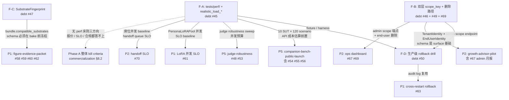
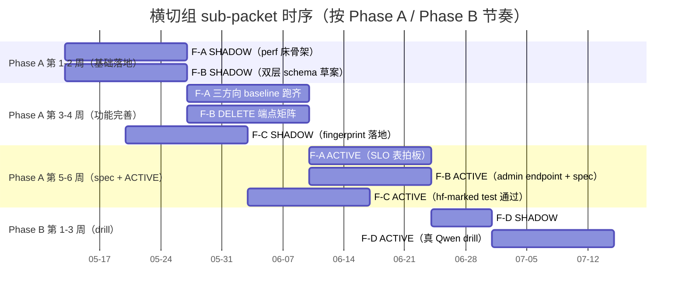

# Cross-Cutting Foundation Packet（横切基础设施）

> 出处：[`docs/known-debts.md`](../known-debts.md) 顶部 `2026-05-13 update` 段所载"商业化反思 26 条 debt"（#45-#70）的**横切组**
> 覆盖：debt #45 / #46 / #47 / #49 / #50 / #69
> 上游商业承诺：[`docs/business/commercialization-assessment.md`](../business/commercialization-assessment.md) §1.1（"可被合规观察 + 用户可被遗忘"）/ §2.1（Tier-1 Scoped memory + 删除路径）/ §6.1（单 ai_id × 月成本估算）/ §8.1.1（多 vertical 共载 latency 风险标"中-高 × 高"）/ §8.1.4（法律风险）
> 状态：plan v0.1，待 packet review
> Last updated: 2026-05-13
> 作用：本组是 P5 / P1 / P2 三个商业方向 packet 的**前置基础设施**。其他三组 packet（figure-evidence-packet / companion-bench-public-launch / growth-advisor-pilot）的 perf 床 / schema / 删除路径需求**必须先在这里收口**，避免重复造或 schema 冲突

---

## 0. TL;DR（≤ 8 行）

- 本组 6 条 debt 拆 4 个 sub-packet：**F-A**（#45 perf 床）/ **F-B**（#46+#49+#69 双层 scope + 删除）/ **F-C**（#47 substrate fingerprint）/ **F-D**（#50 生产 rollback drill）
- F-A 是其他三组 packet 的**硬前置**（perf 床不立，P5 跑分预算 / P1 SLO / P2 席位并发都无法 quote）
- F-B / F-C 是 schema 层改动，必须先于 P1 figure-evidence-packet 与 P2 growth-advisor-pilot **冻结契约**
- F-D 依赖 F-A 落地后才能跑（"真在 Qwen 1.5B+ 上跑 byte-identical revert" 需要 perf 床的 fixture）
- 推荐起跑顺序：**F-A** 与 **F-B** 并行启动（F-A 出 perf 床骨架 + F-B 出双层 schema 草案），F-C 跟 F-B 同 phase 但晚 1-2 周，F-D 落到 Phase B
- 关键 SSOT 守门：R8 perf 测试只读 snapshot 不写 owner / 双层 scope 不破坏 `UserIdentity` 单一所有者 / fingerprint schema 唯一发布者是 `vz-substrate`
- 总资源估算：**8-12 人周工程时长**（4 个 sub-packet 平均 2-3 人周）+ **15-30 GPU 小时**（F-A 跑 baseline + F-D drill）+ **零外部 API 成本**（synthetic / open-weight substrate）
- 总时长（按 Phase A 节奏 6-10 周可全部 SHADOW → ACTIVE）

---

## 1. 为什么先做这组（依赖 / 解锁关系）

### 1.1 横切组在 26 条 debt 里的位置

[`known-debts.md`](../known-debts.md) 顶部 `2026-05-13 update` 的分类（按 P0/P1/P2/P3 优先级）把 #45-#70 切成 4 档：

- **P0**（中-高，Phase A 必做）：#45 / #48 / #52 / #58 / #59 / #64
- **P1**（中，Phase A 后期）：**#46 / #47 / #49** / #63 / #66 / #69
- **P2**（低-中）：**#50** / #51 / #55 / #57 / #65 / #67 / #68 / #70
- **P3**（低，持续）：#53 / #54 / #56 / #60 / #61 / #62

本 packet 覆盖的 6 条**全部位于横切组**（不在某一条 P1/P2/P5 商业路径内部），其余 horizontal-but-non-cross-cutting 项（#48 LLM-judge bias / #51 关系连续性 GT）分别归到 P5 packet 与 evidence-bundle packet。

### 1.2 本组对其他 packet 的解锁关系



**关键句**：F-A 是**唯一不能延后**的子 packet——其他三组 packet 的"我们能上量"叙事在 commercialization §8.1.1 已被标"中-高 × 高"风险，没有真实并发数据兜底就会在第一个 PoC 上量时一次同时暴雷 P1 SLO + P2 多席位 + P5 公开榜单跑分三处。

### 1.3 与已有 land 工作的衔接

- 已 land 的 [`docs/closed-alpha-api-service.md`](../closed-alpha-api-service.md) `UserIdentity.scope_key`（`user_id == scope_key`）+ `DELETE /v1/users/me/memory` 是 F-B 的**起点**，不是要扔掉的"老路径"——F-B 通过派生关系 `tenant_id == "alpha"` + `end_user_id == user_id` 把 closed-alpha 自动平滑接入双层
- 已 land 的 [`docs/moving forward/dlaas-platform-rollout.md`](dlaas-platform-rollout.md) Slice 5（pause / handoff / SSE）+ Slice 7.4 已经做了 "并发 5 路 dispatch 不死锁；10 turn ≤ 60s 上限" 的 perf smoke——F-A 的工作不是从零起，而是**把 smoke 提升到 SLO baseline**（P50/P90/P99 + memory peak + 30 min 持续）
- 已 land 的 [`packages/lifeform-domain-figure/src/lifeform_domain_figure/figure_artifact.py`](../../packages/lifeform-domain-figure/src/lifeform_domain_figure/figure_artifact.py) `compute_bundle_integrity_hash` 是 F-C 的**接入点**——`compatible_substrates` 加进去后只需把 `SubstrateFingerprint` 折入现有 hash 输入，不需要另起 owner

---

## 2. Packet 列表

每个 sub-packet 给出：路径 / 退出标准（SHADOW → ACTIVE）/ 子任务（≤ 5 项）/ 资源估算 / 依赖 / 风险 & fallback。

### 2.1 F-A — 生产并发实测床（debt #45）

#### 路径

- **当前缺位**（已通过 Grep 验证仓库中无）：
  - `tests/perf/`（不存在）
  - `tests/multi_tenant/`（不存在，但 [`tests/service/test_dlaas_multi_tenant_persistence.py`](../../tests/service/test_dlaas_multi_tenant_persistence.py) 已覆盖**功能**侧，缺**并发性能**侧）
  - `scripts/realistic_load_*.py`（不存在）
- **跨包共测落点**：
  - [`packages/lifeform-service/`](../../packages/lifeform-service/) `SessionManager` 并发 + `lifeform-serve` 入口
  - [`packages/dlaas-platform-launcher/`](../../packages/dlaas-platform-launcher/) `InstanceManager`（`{ai_id → SessionManager}` shared substrate）
  - [`packages/vz-substrate/`](../../packages/vz-substrate/) `PersonaLoRAPool.activate(...)` 多 session 同时切换
- **上游商业承诺**：[`commercialization-assessment.md`](../business/commercialization-assessment.md) §6.1（每 ai_id × 月 cost = 30 元假设）/ §8.1.1（"慢反思 / 多 vertical 共载在生产并发下 latency 爆炸" 标"中-高 × 高"）

#### 退出标准（SHADOW → ACTIVE）

| 阶段 | 条件 | 验证方式 |
|---|---|---|
| **SHADOW**（Phase A 第 1-2 周） | `tests/perf/` 目录骨架 + 3 个核心 contract test 通过；3 个 realistic_load 脚本能本地 dry-run；`docs/specs/perf-baseline.md` v0.1 落档 | CI `pytest tests/perf/ -m perf --no-cov` 通过；脚本 `--dry-run` 1 min 出 placeholder artifact |
| **ACTIVE**（Phase A 第 3-5 周） | 三方向 baseline 数据真跑录入 `artifacts/perf/<scenario>-<date>.json`；`perf-baseline.md` 含拍板 SLO 表；至少一次 30 min 持续负载无 owner snapshot 丢失 | 三个 `realistic_load_*.py` 各跑一次完整 30 min（synthetic substrate + 真 Qwen 1.5B 各一次）；artifact diff < 5% turn-to-turn latency drift |

#### 子任务（5 项）

**子任务 1：目录与 fixture 落地**
- 新建 `tests/perf/__init__.py` + `tests/perf/conftest.py`：`@pytest.fixture` 提供
  - `concurrent_lifeform_factory(n_sessions: int, vertical: str = "companion") -> list[LifeformSession]`，按 alpha 配置注入 synthetic substrate
  - `realistic_turn_provider(scenario_id: str) -> Iterator[str]`，从 [`packages/companion-bench/src/companion_bench/scenarios/`](../../packages/companion-bench/src/companion_bench/scenarios/) 派生 deterministic turn 序列
  - `gpu_substrate_session_factory(...)`（@pytest.mark.hf）：真 Qwen 1.5B 路径，CI 默认 skip
- 新建 `tests/perf/test_concurrent_lifeform_sessions.py`：
  - case A — N=10 / 30 / 50 三档；assert P99 latency < `slo_p99_ms` 阈值（synthetic 初稿 500ms / 真 Qwen 1.5B 初稿 5000ms 分两套阈值）
  - case B — 同 envelope dispatcher 同时打 7 类 typed envelope（chat / observe / feedback / teach / task / report / command，参见 [`dlaas-platform-rollout.md`](dlaas-platform-rollout.md) Slice 2）；assert dispatch ms 平稳
  - case C — 30 min 持续负载（仅 @pytest.mark.perf nightly），assert owner snapshot 不丢失（`evaluate_session` 返回的 snapshot 数 == turn 数）

**子任务 2：多 vertical owner propagation 套件**
- `tests/perf/test_multi_vertical_owner_propagation.py`——5 个并列 vertical（companion / coding / character / figure / growth-advisor，参见 [`archetecture.md`](../../archetecture.md) "PARALLEL_VERTICAL_PAIRS"）各起 N=5 session 共享同一个 `InstanceManager`：
  - assert (a)：`interlocutor_state` / `rupture_state` / `vitals` 等 owner snapshot 不跨 vertical 串扰（per-session scope_key 隔离生效）
  - assert (b)：snapshot dispatch ms 95-tile < 50ms（参见 [`docs/SYSTEM_DESIGN.md`](../SYSTEM_DESIGN.md) §5 通信总线）
  - assert (c)：30 min 后 memory pool 大小线性可预测（`MemoryStore` 索引膨胀 < 2 × turn 数）
  - assert (d)：`thinking loop / followup / tick` 类"用户没说话也跑"的内部 turn 在 N=25 时占用推理预算 < 30%（依赖 [`packages/vz-runtime/src/volvence_zero/agent/session.py`](../../packages/vz-runtime/src/volvence_zero/agent/session.py) 的 `AgentSessionRunner` 内部 counter readout）

**子任务 3：PersonaLoRAPool 热插套件**
- `tests/perf/test_persona_lora_hot_swap_concurrency.py`——N=10 session 同时挂不同 figure bundle（用 Wave K curated `figure-bundle:einstein:29eacd226a7cdfd0` + synthetic LoRA 派生 N 个变体）：
  - assert (a)：`activate` 串行化代价 < 100ms/swap @ tiny-gpt2 路径
  - assert (b)：byte-identical deactivate（hf-marked 真 Qwen 1.5B 上跑一次 @ Phase A 第 4 周；与已 land 的 Wave D `LoRAAwareResidualRuntime` 接口对齐）
  - assert (c)：不发生死锁（30s timeout 守门 + `asyncio.wait_for`）
  - assert (d)：跨 N 个 session 并发 `activate` 时 `frozen base state_dict_hash` 全程不变（与 Wave D R2 守门一致）

**子任务 4：三方向 realistic_load 脚本**

| 脚本 | 用户行为源 | 并发量 | 输出 artifact | 与已有路径的接入 |
|---|---|---|---|---|
| `scripts/realistic_load_companion.py` | [`companion-bench`](../../packages/companion-bench/) 6 family × 4 scenario user_simulator | N=20 `LifeformSession` `asyncio.gather`，30 min | `artifacts/perf/companion-<date>.json` | 走 [`closed-alpha-api-service.md`](../closed-alpha-api-service.md) `/v1/sessions/...` |
| `scripts/realistic_load_figure.py` | Einstein bundle in-corpus + OOS 混合问题 | N=10 ai_id × 50 turn | `artifacts/perf/figure-<date>.json`（含 L3 引证率 / L4 拒答率不退化证据） | 走 [`dlaas-platform-rollout.md`](dlaas-platform-rollout.md) `/dlaas/adopt` + `/dlaas/interactions` |
| `scripts/realistic_load_growth_advisor.py` | `cheng-laoshi` profile + `growth_advisor:day1...day7` 路由 | N=50 end_user × 10 客户（"席位"） | `artifacts/perf/growth-advisor-<date>.json`（含 4 反销售边界触发率） | 走 `/dlaas/*` typed envelope + admin endpoint |

- 三个脚本都**不绕过**典型 HTTP 边界（即不通过 in-process import `LifeformSession` 直接调用）
- 每个脚本支持 `--dry-run`（1 min synthetic check）与 `--production`（30 min 真负载）两档
- 输出 artifact schema 统一：`{date, scenario, substrate_fingerprint, n_concurrent, latency_p50, latency_p90, latency_p99, gpu_mem_peak_mb, snapshot_dispatch_ms_p95, errors_count, slo_passed}`（其中 `substrate_fingerprint` 字段在 F-C ACTIVE 后填充）

**子任务 5：SLO baseline spec + 三方向拍板表**

新建 [`docs/specs/perf-baseline.md`](../specs/perf-baseline.md)，结构如下：

| §  | 段落 | 内容 |
|---|---|---|
| §1 | Scope | 不包含 P3（C 端陪伴）/ P6（IDE 编程）路径，因为 [`commercialization-assessment.md`](../business/commercialization-assessment.md) §5.2 不投入 |
| §2 | 测试床配置 | substrate 选型（synthetic / Qwen2.5-1.5B / Qwen2.5-32B 三档）+ GPU 假设（A100 80G / 消费级 RTX 4090）+ 并发模型（`asyncio.gather` + `aiohttp` HTTP client）|
| §3 | P1 figure SLO 拍板 | 单 ai_id P99 < 5s @ 10 concurrent；bundle activate < 1s；rollback < 500ms；L3 引证率在并发下 ≥ 80%（无退化）|
| §4 | P2 growth-advisor SLO 拍板 | 席位 P95 < 3s @ 50 end-user concurrent；月报生成 < 30s；4 反销售边界触发率在 [5%, 50%] 区间（与 commercialization §4.2 kill criteria 对齐）|
| §5 | P5 companion-bench SLO 拍板 | 120 scenario × 6 SUT 单次跑分 < 8h；判 SLO 是工程预算而非用户感知；judge robustness sweep 单次 < 4h |
| §6 | 测试节奏 | 每月 1 次完整 baseline 重跑；每次 substrate 升级前后各跑一次（与 F-C 联动）；CI nightly 跑 smoke baseline |
| §7 | 不变量 | perf 测试只 `read snapshots`，不写 owner；不改 substrate weights；遵守 [`ssot-module-boundaries.mdc`](../../.cursor/rules/ssot-module-boundaries.mdc) R8 |
| §8 | artifact retention | `artifacts/perf/` 按月 rotate；最近 12 月留全；之前按季度归档 |

#### 资源估算

- **工程**：3-4 人周（1 人周写套件 + 1 人周写 3 个脚本 + 1-2 人周拍板 SLO + 整理 artifact 流）
- **GPU**：10-15 GPU-小时（synthetic 部分 CPU 即可；真 Qwen 1.5B baseline 跑 2-3 次 × 30 min × 3 方向 ≈ 10 小时；Qwen 32B 上 SLO 拍板再加 5 小时）
- **API 成本**：零（不跑外部 API；真 Qwen 1.5B 走 hf-shared 或本地 GPU）

#### 依赖

- 无强阻塞依赖（这是 packet 内**最早可起跑**的子 packet）
- **软依赖**：希望 Phase A 第 1 周 [`dlaas-platform-rollout.md`](dlaas-platform-rollout.md) Slice 5.4 真流式 SSE 仍维持 cancelled 状态（避免 `vz-substrate` streaming 边改边测）

#### 风险 & fallback

| 风险 | 评估 | fallback |
|---|---|---|
| 真 Qwen 1.5B 跑 30 min 在 dev 机器上 OOM | 中（参见 [`known-debts.md` debt #10B`](../known-debts.md) 上一次 Phase 2 W2.0c probe 已经 OOM 过） | SLO 拍板只在 GPU 服务器上跑；本地只跑 synthetic baseline + 单点验证 |
| 5 vertical 共载在 owner propagation 上出 bug | 中 | 退到 1-vertical 跑通 baseline；标记 multi-vertical 为 Phase B follow-up（但 SLO 拍板表保留 placeholder） |
| 三个 `realistic_load_*.py` 模型行为不收敛（同样 N=20 跑两次结果方差 > 30%） | 中-高 | 把 baseline 标 "indicative range" 而非 "hard SLO"；多跑几次取中位数 |
| `tests/perf/` 进 CI 后慢测试拖累 PR 反馈 | 高 | 加 `@pytest.mark.perf`，CI 默认 skip；只跑 nightly + manual trigger |

---

### 2.2 F-B — 双层 scope_key + 客户 admin / end-user 删除（debt #46 + #49 + #69）

#### 路径

- **当前单层**（已通过 Read 验证）：
  - [`packages/vz-memory/src/volvence_zero/memory/identity.py`](../../packages/vz-memory/src/volvence_zero/memory/identity.py) `UserIdentity(user_id, scope_key)` 单层
  - [`packages/lifeform-service/src/lifeform_service/alpha.py`](../../packages/lifeform-service/src/lifeform_service/alpha.py) `AlphaIdentityProvider` 直接 `UserIdentity(user_id=user_id, scope_key=user_id)`
  - [`docs/closed-alpha-api-service.md`](../closed-alpha-api-service.md) 已写"alpha 阶段 user_id == scope_key"作为产品契约
- **当前 DELETE 路径**：
  - `DELETE /v1/users/me/memory` 已实现，但**只删 tagged durable rupture-repair memory**，不删 `evidence_root_dir/sessions/*.json`（见 `closed-alpha-api-service.md` §"DELETE /v1/users/me/memory"："完整用户数据擦除需要后续覆盖 application stores、case memory、logs 和 evidence artifacts"）
- **dlaas 平台层**：
  - [`packages/dlaas-platform-registry/src/dlaas_platform_registry/tenants.py`](../../packages/dlaas-platform-registry/src/dlaas_platform_registry/tenants.py) `TenantStore` 已有 tenant_id schema（DLaaS 平台层），但**没接到 vz-memory `UserIdentity`**——这是双层 schema 的本质 gap：dlaas 平台层 + vz-memory 内核层各持有一半 identity
  - [`packages/dlaas-platform-registry/src/dlaas_platform_registry/handoff.py`](../../packages/dlaas-platform-registry/src/dlaas_platform_registry/handoff.py) `HandoffTicketStore.create(..., ai_id, contract_id, end_user_ref, ...)` 已经在 ticket 层用 `end_user_ref` 表示"端用户引用"，但**没显式 tenant_id × end_user_id 二元组**
- **上游商业承诺**：[`commercialization-assessment.md`](../business/commercialization-assessment.md) §2.1 Tier-1 资产"Scoped memory + 删除路径" / §6.3（P2 客户 = 10 席位）/ §8.1.4（"用户被遗忘权" 法律风险标"中 × 中"）

#### 退出标准（SHADOW → ACTIVE）

| 阶段 | 条件 | 验证方式 |
|---|---|---|
| **SHADOW**（Phase A 第 2-3 周） | (a) `TenantIdentity` + `EndUserIdentity` typed dataclass 落到 `vz-memory`；(b) `UserIdentity.scope_key` 派生为 `f"{tenant_id}:{end_user_id}"`；(c) closed-alpha 自动派生 `tenant_id == "alpha"`；(d) `tests/contracts/test_two_layer_scope_isolation.py` 通过 | contract test 7 case 覆盖：tenant A:X ≠ tenant B:X（同名端用户）/ admin enumerate 不跨 tenant / alpha 单层向后兼容 / scope_key 派生稳定 |
| **ACTIVE**（Phase A 第 4-6 周） | (a) `DELETE /v1/tenants/{tid}/users/{uid}/memory` + `DELETE /v1/tenants/{tid}/memory` 落地；(b) `DELETE /v1/users/me/evidence` 端点 + `evidence_deletion_ledger.jsonl` append-only 路径打通；(c) [`docs/specs/evidence-deletion-protocol.md`](../specs/evidence-deletion-protocol.md) 与 [`docs/specs/two-layer-scope.md`](../specs/two-layer-scope.md) 落档 | 端到端测试：tenant 注册 → 10 end_user 各跑 5 turn → admin DELETE tenant 全量 → enumerate 返回空 + 删除证据可查 |

#### 子任务（5 项）

**子任务 1：vz-memory schema 扩展（基础设施层）**

- 在 [`packages/vz-memory/src/volvence_zero/memory/identity.py`](../../packages/vz-memory/src/volvence_zero/memory/identity.py) 加：

```python
@dataclass(frozen=True)
class TenantIdentity:
    tenant_id: str

    def __post_init__(self) -> None:
        if not self.tenant_id or not self.tenant_id.strip():
            raise ValueError("TenantIdentity.tenant_id must be non-empty")

@dataclass(frozen=True)
class EndUserIdentity:
    tenant_id: str
    end_user_id: str

    def __post_init__(self) -> None:
        if not self.tenant_id or not self.tenant_id.strip():
            raise ValueError("EndUserIdentity.tenant_id must be non-empty")
        if not self.end_user_id or not self.end_user_id.strip():
            raise ValueError("EndUserIdentity.end_user_id must be non-empty")

def derive_scope_key(tenant_id: str, end_user_id: str) -> str:
    """SSOT for scope_key composition. Closed-alpha uses tenant_id='alpha'."""
    ...
```

- `UserIdentity`（现有，line 40-65）增加**可选**字段 `tenant_identity: TenantIdentity | None = None`、`end_user_identity: EndUserIdentity | None = None`（默认 `None` 保持向后兼容）；并加 `derive_scope_key(...)` SSOT 函数
- 现有 `scope_key_for(...)`（line 100-110）不变（仍接受老 `UserIdentity`），但新建 `scope_key_for_two_layer(tenant_identity, end_user_identity) -> str`
- **严守 R8**：不引入新 owner，只是 `UserIdentity` 内部 SSOT 派生；tenant 仍由 dlaas-platform-registry 持有，end_user 仍由 vz-memory 持有，两者通过派生关系（不是 owner 关系）连接

**子任务 2：lifeform-service 路由扩展（应用层 surface for #69）**

| 端点 | 行为 | 权限 | 与已有路径的关系 |
|---|---|---|---|
| `GET /v1/tenants/{tid}/admin/users` | 列出 tenant 下所有 end_user + 聚合活跃度 | `X-Control-Plane-Secret` | 新增；alpha 自动 `tid="alpha"` |
| `GET /v1/tenants/{tid}/admin/metrics` | tenant 维度聚合 readout（rupture count / boundary 触发 / handoff 数） | `X-Control-Plane-Secret` | 在 `/v1/admin/weekly-report` 基础上扩展 |
| `POST /v1/tenants/{tid}/admin/bulk-pause` | 一键暂停 tenant 下所有 session | `X-Control-Plane-Secret` | 复用 [`pause`](../../packages/lifeform-service/src/lifeform_service/app.py) handler |
| `POST /v1/tenants/{tid}/users/{uid}/dialogue-outcomes` | admin 代替 end-user 提交 typed feedback | `X-Control-Plane-Secret` | 与现有 `/v1/sessions/{id}/dialogue-outcomes` 共享 handler |

- alpha 路径自动派生 `tenant_id == "alpha"` 兼容（修改 [`packages/lifeform-service/src/lifeform_service/alpha.py`](../../packages/lifeform-service/src/lifeform_service/alpha.py) `AlphaIdentityProvider.bind_session` 自动构造 `TenantIdentity("alpha")` + `EndUserIdentity("alpha", user_id)`，scope_key 派生为 `"alpha:{user_id}"`；现有 `user_id` 派生为 `"alpha"` 前缀的 scope_key — **这会改变 closed-alpha scope_key 格式**，需要 migration shim：DELETE / READ 路径同时识别老格式 `user_id` 与新格式 `alpha:user_id`，新写入只走新格式）
- handoff queue 按 tenant 隔离（修改 [`packages/dlaas-platform-registry/src/dlaas_platform_registry/handoff.py`](../../packages/dlaas-platform-registry/src/dlaas_platform_registry/handoff.py) 让 `HandoffTicketStore.list_for_tenant(tid)` 是默认调用方式；现有 `ai_id` / `end_user_ref` 字段保留但加 `tenant_id` index）

**子任务 3：DELETE 端点矩阵补全（合规层 for #49）**

| 端点 | scope | 删除范围 | 留存证据 |
|---|---|---|---|
| `DELETE /v1/users/me/memory`（已有） | end-user 自己 | 仅 tagged durable rupture-repair memory | 已有 `deletion_evidence.json` |
| `DELETE /v1/users/me/memory?include_evidence=true`（新增参数） | end-user 自己 | 上述 + session evidence | 加 `evidence_deletion_ledger.jsonl` |
| `DELETE /v1/users/me/evidence?since=<iso>&until=<iso>`（新增） | end-user 自己 | 仅 `evidence_root_dir/sessions/<session_id>/*.json`（按时间窗口） | sha256 + scope_key + timestamp 进 `evidence_deletion_ledger.jsonl` |
| `DELETE /v1/tenants/{tid}/users/{uid}/memory`（新增） | tenant admin | end_user 全部 memory | 加 `tenant_id` 维度 ledger |
| `DELETE /v1/tenants/{tid}/users/{uid}/evidence`（新增） | tenant admin | end_user 全部 evidence | 同上 |
| `DELETE /v1/tenants/{tid}/memory`（新增） | tenant admin | tenant 下所有 end_user 的 memory + evidence | 批量 ledger entry，tenant 维度签名 |

- 所有 admin DELETE 端点需要 `X-Control-Plane-Secret` middleware（参见 [`dlaas-platform-rollout.md`](dlaas-platform-rollout.md) Slice 3.1）
- 所有 DELETE 失败必须 fail-loud（HTTP 4xx/5xx + ledger 不写入 = 删除未发生），遵守 [`no-swallow-errors-no-hasattr-abuse.mdc`](../../.cursor/rules/no-swallow-errors-no-hasattr-abuse.mdc)
- ledger entry schema：

```json
{
  "deletion_id": "<uuid>",
  "tenant_id": "alpha",
  "end_user_id": "alice",
  "scope_key": "alpha:alice",
  "delete_kind": "memory|evidence|tenant_bulk",
  "target_sha256": ["<sha256-of-deleted-content>", ...],
  "requested_by": "user_self|tenant_admin|control_plane",
  "requested_at_ms": 1736000000000,
  "service_version": "closed-alpha-v0",
  "policy_version": "alpha-policy-v0"
}
```

**子任务 4：EvidenceDeletionPolicy typed config**

- 在 [`packages/lifeform-service/src/lifeform_service/alpha.py`](../../packages/lifeform-service/src/lifeform_service/alpha.py) 已有的 `AlphaServiceConfig` 旁边加：

```python
@dataclass(frozen=True)
class EvidenceDeletionPolicy:
    retention_days: int = 90  # GDPR 默认 90 天可配置
    delete_on_user_request: bool = True
    retain_deletion_proof: bool = True
    proof_root_dir: str | None = None  # 默认 evidence_root_dir/deletion_ledger
```

- 落到 [`packages/lifeform-service/src/lifeform_service/cli.py`](../../packages/lifeform-service/src/lifeform_service/cli.py) 加 `--evidence-retention-days N` / `--evidence-delete-on-user-request bool` / `--evidence-retain-deletion-proof bool` 三个参数
- P1 博物馆客户保留期可设 365 天（学术 audit 需求）；P2 私域客户保留期默认 90 天（GDPR / PIPL 友好）；不同启动参数注入不同 policy

**子任务 5：Spec + contract test 落档**

- 新建 [`docs/specs/two-layer-scope.md`](../specs/two-layer-scope.md)：
  - §1 双层 schema 定义 / 派生规则 / closed-alpha 兼容映射
  - §2 双 owner 边界（tenant by `dlaas-platform-registry`；end_user by `vz-memory`）
  - §3 scope_key 派生 SSOT 守门点（`derive_scope_key` 唯一实现）
  - §4 与 [`closed-alpha-api-service.md`](../closed-alpha-api-service.md) §"跨用户隔离走 scoped memory" 段的兼容性条款
- 新建 [`docs/specs/evidence-deletion-protocol.md`](../specs/evidence-deletion-protocol.md)：
  - §1 删除事件 ledger schema（见子任务 3 上面的 JSON）
  - §2 "audit 需要 vs 用户行权" 张力调和：删除时只删原始 evidence，保留删除证据；audit 可枚举删除事件 + scope_key + timestamp + sha256，但不能复原内容
  - §3 ledger 按日 rotate / 保留期 / 跨 tenant 查询
  - §4 与 R15 字节级回滚的关系（删除是单向的，不可"反回滚"；rollback drill 只针对自适应层，不针对用户数据删除）
- 新建 [`tests/contracts/test_two_layer_scope_isolation.py`](../../tests/contracts/test_two_layer_scope_isolation.py)（≥ 7 case）：
  - `test_two_tenants_same_end_user_id_isolated`：tenant A:alice 与 tenant B:alice 即使同名也完全隔离
  - `test_admin_enumerate_does_not_cross_tenant`：tenant A 的 admin 只能 enumerate 自己 tenant 的 end users
  - `test_scope_key_derivation_stable`：`derive_scope_key("alpha", "alice")` 100 次调用结果一致
  - `test_closed_alpha_auto_derivation_compat`：现有 closed-alpha caller 自动派生为 `tenant_id="alpha"`，老 scope_key 通过 migration shim 仍可读
  - `test_tenant_delete_then_recreate_no_zombie_memory`：tenant 全删后再注册同名 tenant 不复活老 memory
  - `test_anonymous_provider_still_works`：`AnonymousIdentityProvider` 不受双层 schema 影响
  - `test_derive_scope_key_no_keyword_split`：禁止 `scope_key.split(":")` 反向解析，必须走 typed dataclass roundtrip
- 新建 [`tests/contracts/test_evidence_deletion_proof_chain.py`](../../tests/contracts/test_evidence_deletion_proof_chain.py)：删除后 audit log 仍能枚举删除事件 + scope_key + timestamp + sha256（但不能复原内容）
- 更新 [`docs/closed-alpha-api-service.md`](../closed-alpha-api-service.md) DELETE 端点段，补充新增的 `/v1/tenants/...` admin scope endpoint

#### 资源估算

- **工程**：3-4 人周（1 周 schema + 1 周端点矩阵 + 1 周 spec + 1 周 contract test 收尾）
- **GPU / API**：零（纯 schema / HTTP / IO 层，无模型推理）

#### 依赖

- 无强阻塞依赖
- **同组联动**：F-D 生产 rollback drill 需要"按 tenant 删除路径"作为 drill case，建议 F-B 早于 F-D 完成

#### 风险 & fallback

| 风险 | 评估 | fallback |
|---|---|---|
| `UserIdentity` 增加双层字段会破坏现有 1063+ 单元 / contract test | 中 | 双层字段全部 `Optional`，默认 `None`；引入 `derive_scope_key` 作为新 SSOT 但不强制现有 caller 迁移 |
| `DELETE /v1/tenants/{tid}/memory` 在 SQLite WAL 模式下并发写时与 [`packages/dlaas-platform-registry/db.py`](../../packages/dlaas-platform-registry/src/dlaas_platform_registry/db.py) `write_lock` 形成死锁 | 中 | 在 F-A perf 套件里加 "DELETE during active write" race test；如出现死锁则 DELETE 走异步 job queue（reuse handoff queue 的事件 dispatcher） |
| evidence 删除证据 ledger 文件无限增长 | 低-中 | ledger 按日 rotate（`evidence_deletion_ledger-YYYYMMDD.jsonl`）；保留期由 `EvidenceDeletionPolicy.retention_days` 控制 |
| admin scope 端点暴露后被滥用（admin 删了不该删的） | 中-高 | `X-Control-Plane-Secret` middleware 校验 + admin DELETE 必须双因素（curl + 携带 admin 签发的临时 token） |

---

### 2.3 F-C — Substrate Compatibility Fingerprint（debt #47）

#### 路径

- **当前缺位**（已通过 Grep 验证）：
  - [`packages/vz-substrate/`](../../packages/vz-substrate/) 无 `SubstrateFingerprint` 类型
  - [`packages/lifeform-domain-figure/src/lifeform_domain_figure/figure_artifact.py`](../../packages/lifeform-domain-figure/src/lifeform_domain_figure/figure_artifact.py) `FigureArtifactBundle` 已有 `integrity_hash` 字段（line 88）+ `compute_bundle_integrity_hash` 函数（line 129），但**无 `compatible_substrates: tuple[SubstrateFingerprint, ...]` 字段**
  - [`packages/lifeform-domain-growth-advisor/src/lifeform_domain_growth_advisor/profile.py`](../../packages/lifeform-domain-growth-advisor/src/lifeform_domain_growth_advisor/profile.py) `GrowthAdvisorProfile` 无 `validated_substrates` 字段
  - [`packages/companion-bench/src/companion_bench/spec.py`](../../packages/companion-bench/src/companion_bench/spec.py) `RunRecord` schema 无 `sut_substrate_fingerprint`
- **上游商业承诺**：[`commercialization-assessment.md`](../business/commercialization-assessment.md) §8.1.1 直接列"substrate 升级对 figure bundle 兼容性破坏"标"高 × 高"风险

#### 退出标准（SHADOW → ACTIVE）

| 阶段 | 条件 | 验证方式 |
|---|---|---|
| **SHADOW**（Phase A 第 3-4 周） | (a) `SubstrateFingerprint` typed dataclass 落到 `vz-substrate`；(b) `FigureArtifactBundle.compatible_substrates: tuple[SubstrateFingerprint, ...]`（必填非空）落到 figure；(c) `GrowthAdvisorProfile.validated_substrates`（可空）落到 growth-advisor；(d) bake 时记录主 substrate（CLI 不强制 fail）；(e) [`docs/specs/substrate-upgrade-protocol.md`](../specs/substrate-upgrade-protocol.md) v0.1 落档 | contract test：bundle 创建 + fingerprint 折入 `integrity_hash` 后 byte-identical roundtrip 通过；growth-advisor profile 不带 `validated_substrates` 时 runtime 只 warn 不 fail |
| **ACTIVE**（Phase A 第 5-6 周） | (a) runtime activate 时检查兼容性 mismatch fail-loud（figure）/ warn-loud（growth-advisor）；(b) `RunRecord.sut_substrate_fingerprint` 在 companion-bench summary.json 中必填；(c) `tests/contracts/test_substrate_fingerprint_propagation.py` 通过 | hf-marked test：真 Qwen 1.5B 上挂一个声明兼容 Qwen 1.5B 的 bundle → pass；挂一个声明 Llama-3-8B 的 bundle → fail loudly |

#### 子任务（5 项）

1. **`SubstrateFingerprint` 类型 + runtime introspection**：在 [`packages/vz-substrate/src/volvence_zero/substrate/residual_contracts.py`](../../packages/vz-substrate/src/volvence_zero/substrate/residual_contracts.py)（或新建 `substrate_fingerprint.py`）落 `SubstrateFingerprint(model_id: str, version: str, weights_sha256: str)` frozen dataclass + `OpenWeightResidualRuntime.fingerprint() -> SubstrateFingerprint` 抽象方法；`TransformersOpenWeightResidualRuntime` 默认实现读 `state_dict()` SHA-256（与 Wave D byte-identical rollback 用的同一份 hash 复用，零额外计算）；synthetic backend 给 deterministic placeholder fingerprint 便于 CI
2. **figure bundle 兼容性字段 + hash 折入**：修改 [`packages/lifeform-domain-figure/src/lifeform_domain_figure/figure_artifact.py`](../../packages/lifeform-domain-figure/src/lifeform_domain_figure/figure_artifact.py) `FigureArtifactBundle` 加 `compatible_substrates: tuple[SubstrateFingerprint, ...]`（必填非空）；`compute_bundle_integrity_hash`（已存在）的输入序列追加 `compatible_substrates` 序列化后参与 hash，**bundle_id 自动随兼容性变化变化**（满足 R15 byte-level 回滚契约："任何输入变化产生不同 artifact_id"）；CLI `figure_bake_*` 自动从当前 substrate runtime 调 `fingerprint()` 写入 bundle
3. **runtime activate 兼容性检查**：在 [`packages/vz-substrate/src/volvence_zero/substrate/persona_lora_pool.py`](../../packages/vz-substrate/src/volvence_zero/substrate/persona_lora_pool.py) `PersonaLoRAPool.activate(figure_id, runtime=runtime)` 入口加 `_check_substrate_compatibility(bundle, runtime.fingerprint())`：runtime fingerprint 与 `bundle.compatible_substrates` 任一匹配则 OK；mismatch 时 raise `SubstrateIncompatibleError`（fail-loud，遵守 [`no-swallow-errors-no-hasattr-abuse.mdc`](../../.cursor/rules/no-swallow-errors-no-hasattr-abuse.mdc)）；env 变量 `VZ_SUBSTRATE_COMPAT_DOWNGRADE_OK=1` 时降级为 warn（用于 N → N-1 受控降级测试）
4. **growth-advisor + companion-bench 平行扩展**：
   - [`packages/lifeform-domain-growth-advisor/src/lifeform_domain_growth_advisor/profile.py`](../../packages/lifeform-domain-growth-advisor/src/lifeform_domain_growth_advisor/profile.py) `GrowthAdvisorProfile` 加 `validated_substrates: tuple[SubstrateFingerprint, ...]`（可空，空表示"通用"）；runtime warn-if-mismatch（不 fail，因为 growth-advisor 不直接绑 substrate weights）
   - [`packages/companion-bench/src/companion_bench/spec.py`](../../packages/companion-bench/src/companion_bench/spec.py) `RunRecord` schema 加 `sut_substrate_fingerprint: SubstrateFingerprint | None`（reference 跑分时附）；公开榜单 site（参见 [`packages/companion-bench/site/`](../../packages/companion-bench/site/)）`build_site.py` 在 per-submission detail page 上加"SUT substrate"行
5. **Spec + contract test 落档**：
   - 新建 [`docs/specs/substrate-upgrade-protocol.md`](../specs/substrate-upgrade-protocol.md)：N → N+1 substrate 上线时，N bundles 按 "必须重 bake / 可降级运行 / 完全不兼容" 三档判定流程；与 [`docs/specs/figure-vertical.md`](../specs/figure-vertical.md) L1-L4 兼容性矩阵交叉引用（L1 retrieval index / coverage map / refuser 应 substrate-agnostic，可降级；L2 steering / persona LoRA 必须重 bake）
   - 新建 [`tests/contracts/test_substrate_fingerprint_propagation.py`](../../tests/contracts/test_substrate_fingerprint_propagation.py)：fingerprint 流过 bake → bundle → registry → activate 全链；mismatch 时 fail-loud
   - 同步更新 [`docs/DATA_CONTRACT.md`](../DATA_CONTRACT.md) Slot 注册表（新增 `substrate.fingerprint` enrichment 不开新 slot，但记录字段；遵守 [`first-principles-not-patches.mdc`](../../.cursor/rules/first-principles-not-patches.mdc) "新增字段先入 slot 注册表"）

#### 资源估算

- **工程**：2-3 人周（schema + 接入点修改集中在 3 个 wheel，单点改动）
- **GPU**：3-5 GPU-小时（hf-marked test 在真 Qwen 1.5B 上验一次）
- **API 成本**：零

#### 依赖

- 无强阻塞依赖
- **同组联动**：F-A perf 床的"每月 baseline 重跑"自动覆盖 substrate 升级前后对比，需要 fingerprint 字段才能在 artifact 里区分

#### 风险 & fallback

| 风险 | 评估 | fallback |
|---|---|---|
| `state_dict()` SHA-256 在大模型（32B+）上计算太慢 | 中 | 用 `model.config.name_or_path + revision` + `state_dict()` 的若干关键 tensor 形状 hash 做"轻量指纹"；保留完整 SHA-256 作为 expensive 验证选项 |
| 现有 Wave G 已 bake 的 `figure-bundle:einstein:29eacd226a7cdfd0` 没有 `compatible_substrates` 字段，加字段后无法加载 | 高 | bundle pickle 反序列化加 migration shim：missing 字段时填默认 `(SubstrateFingerprint(model_id="tinygpt2", version="legacy", weights_sha256="legacy"),)` 并 warn，下次 bake 自动正常化；不破坏 1063+ figure test |
| substrate fingerprint 字段加进 hash 后所有现有 bundle hash 改变 → bundle_id 全变 | 高 | 迁移期分两步：(a) 字段先加但**不**进 hash（v1 hash）；(b) 跑一次 mass re-bake 把所有 bundle id 平滑迁到 v2 hash；并在 [`docs/specs/figure-vertical.md`](../specs/figure-vertical.md) 加版本号段 |

---

### 2.4 F-D — 生产级 Rollback Drill（debt #50）

#### 路径

- **当前 drill 状态**：
  - [`tests/contracts/test_learned_baseline_rollback_drill.py`](../../tests/contracts/test_learned_baseline_rollback_drill.py)（Wave E3 落地，6 个 unit-test 级 drill）只在 in-memory + synthetic 上跑
  - [`packages/vz-substrate/src/volvence_zero/substrate/persona_lora_pool.py`](../../packages/vz-substrate/src/volvence_zero/substrate/persona_lora_pool.py) byte-identical 退出是 hf-marked test 在 tiny-gpt2 上验证（参见 known-debts 顶部 `2026-05-10 Wave D` 段）
  - [`packages/lifeform-domain-figure/src/lifeform_domain_figure/cli/_commands.py`](../../packages/lifeform-domain-figure/src/lifeform_domain_figure/cli/_commands.py) `cmd_rollback` + audit append-only（debt #23 closure 文档）
- **当前缺位**：跨进程 / 跨重启 / 真 Qwen 1.5B+ 生产负载下的实战验证完全没测
- **上游商业承诺**：[`commercialization-assessment.md`](../business/commercialization-assessment.md) §1.1（"可回滚自修改门控"）/ §2.3（R10 / R15）

#### 退出标准（SHADOW → ACTIVE）

| 阶段 | 条件 | 验证方式 |
|---|---|---|
| **SHADOW**（Phase B 第 1 周） | (a) `tests/perf/test_production_rollback_drill.py` 骨架（hf-mark）+ synthetic baseline 通过；(b) cross-restart 路径骨架（pickle reload → activate → rollback 链）落地 | hf-marked test 在 CI 默认 skip，本地 manual run 通过 |
| **ACTIVE**（Phase B 第 2-3 周） | (a) 真 Qwen 1.5B 上 10 turn 生成 → rollback → 再 10 turn → byte-identical revert（logits L1 < 1e-6）；(b) `scripts/rollback_drill_figure.sh` / `scripts/rollback_drill_growth_advisor.sh` 一键脚本可在 GPU 服务器上 30 min 内跑完一次；(c) [`docs/specs/rollback-drill-cadence.md`](../specs/rollback-drill-cadence.md) 落档"每月 / 每次 substrate 升级前 / 每个新 figure bundle 上线前"三档节奏 | 真跑一次 + artifact 落 `artifacts/rollback_drill/<vertical>-<date>.json`（含 byte-identical 证据 + 时间分布） |

#### 子任务（4 项）

**子任务 1：生产级 drill 测试套件**

新建 `tests/perf/test_production_rollback_drill.py`（`@pytest.mark.hf` + `@pytest.mark.perf` 双标，CI 默认 skip）：

| case | 描述 | 验证 |
|---|---|---|
| **case 1 — figure bundle activate / deactivate** | 真 Qwen 1.5B 上加载 `figure-bundle:einstein:29eacd226a7cdfd0` → 10 turn 真生成（in-corpus + OOS 混合）→ `PersonaLoRAPool.activate` 退出 context → 再 10 turn | 验证 logits 与 base substrate byte-identical 等价（或退化阈值 L1 < 1e-4） |
| **case 2 — learned baseline rollback** | 从 Wave E3 6 个 drill 派生，但跑在真 Qwen 上（而不是 synthetic）；触发 `credit.rewarding_state_head` rollback | rollback 后 validation_delta 行为可观察；checkpoint 状态可恢复 |
| **case 3 — cross-restart 路径** | `bundle.pickle` reload → integrity_hash check → activate → rollback 完整链 | `integrity_hash` 必须与原 byte-equal；audit log 跨重启可枚举；不依赖内存中 pool 状态 |

**子任务 2：三方向一键脚本**

| 脚本 | 流程 | 输出 artifact |
|---|---|---|
| `scripts/rollback_drill_figure.sh` | bake → adopt → activate → 10 turn → rollback → revert audit | `artifacts/rollback_drill/figure-<date>.json` |
| `scripts/rollback_drill_growth_advisor.sh` | reviewed profile 重新编译 → activate → 跑 7 day playbook 三轮 → 触发 OFFLINE-gate 重 compile → rollback 到上一版 profile | `artifacts/rollback_drill/growth-advisor-<date>.json` |
| `scripts/rollback_drill_substrate_upgrade.sh` | substrate N → N+1 升级 drill（依赖 F-C `SubstrateFingerprint` 字段判定 "可降级 / 不可降级"）；不能降级时 fail-loud + 生成迁移建议 | `artifacts/rollback_drill/substrate-upgrade-<date>.json` |

- 每个脚本支持 `--smoke`（5 min synthetic）/ `--production`（30 min 真 Qwen）两档
- 输出 artifact 统一字段：`{date, vertical, substrate_fingerprint, turns_before_rollback, turns_after_rollback, byte_identical_passed, l1_logit_drift, audit_chain_complete, slo_passed}`

**子任务 3：Cross-restart audit chain 修补**

- 检查 [`packages/lifeform-domain-figure/src/lifeform_domain_figure/cli/_commands.py`](../../packages/lifeform-domain-figure/src/lifeform_domain_figure/cli/_commands.py) `cmd_rollback` 的 audit log 序列化格式
- 确保重启后能完整 enumerate 删除 / 修改 / 回滚事件链
- 与 F-B 的 `evidence_deletion_ledger.jsonl` **共享 append-only 写入风格**（统一在 [`docs/specs/evidence-deletion-protocol.md`](../specs/evidence-deletion-protocol.md) §3 ledger schema 段）
- 验证：模拟 `lifeform-serve` kill -9 后重启，audit log 不丢失任何已 fsync 事件；`pickle.load(bundle)` 后 `integrity_hash` 与原 byte-equal

**子任务 4：Spec + 运维节奏落档**

新建 [`docs/specs/rollback-drill-cadence.md`](../specs/rollback-drill-cadence.md)：

| §  | 段落 | 内容 |
|---|---|---|
| §1 | 三档节奏 | 每月 / 每次 substrate 升级前 / 每个新 figure bundle 上线前 |
| §2 | 每档触发条件 | 例如：substrate fingerprint 变更 → 自动触发 substrate-upgrade drill |
| §3 | 每档验证产物 | artifact path + 通过条件 + 失败时升级路径 |
| §4 | byte-identical 退化路径 | 真 Qwen 不达 byte-identical 时的 L1 < 1e-4 阈值 + 在 commercialization SLA 中的口径 |
| §5 | 被 drill 的路径清单（白名单） | 不允许 drill 之外的"暗"自修改路径上线 |

- 与 [`docs/specs/figure-vertical.md`](../specs/figure-vertical.md) §"is_reversible + rollback drill" 段交叉引用
- 与 [`docs/specs/credit-and-self-modification.md`](../specs/credit-and-self-modification.md) 与 [`docs/specs/prediction-error-loop.md`](../specs/prediction-error-loop.md) Wave E3 添加的 promotion criteria 表格交叉引用

#### 资源估算

- **工程**：2 人周（套件 1 人周 + 脚本 + spec 1 人周；audit chain 修补半人周）
- **GPU**：5-10 GPU-小时（真 Qwen 1.5B 上 3 个 case × 30 min × 多次 = 10 小时）
- **API 成本**：零

#### 依赖

- **强依赖 F-A**：生产级 drill 必须在 perf 床上跑，依赖 F-A 提供的 fixture（`concurrent_lifeform_factory` / `realistic_load_*` 生成的稳定 turn 序列）
- **软依赖 F-B**：cross-restart audit chain 与 evidence deletion ledger 共享 append-only 写入风格
- **软依赖 F-C**：`scripts/rollback_drill_substrate_upgrade.sh` 需要 `SubstrateFingerprint`

#### 风险 & fallback

| 风险 | 评估 | fallback |
|---|---|---|
| 真 Qwen 1.5B 上 byte-identical revert 不成立（logits L1 > 1e-6） | 中（参见 known-debts Wave G 已经在 Transformers runtime 上验证过 tiny-gpt2 byte-identical；但真 Qwen 不同 dtype / KV-cache 路径） | 把阈值从 byte-identical 放松到 "L1 < 1e-4 per-token logit"，并在 spec 显式标注退化路径；要求每次 release 跑实测验阈值 |
| 30 min 一次 drill 太长，无法每月跑 | 中 | 拆 5-min "smoke drill"（synthetic 路径） + 30-min "production drill"（真 Qwen + 30 turn）；CI 每周跑 smoke，nightly 跑 production；每月人工 review production artifact |
| cross-restart audit chain 在大 evidence_root_dir 上枚举慢 | 低-中 | audit log 按日 rotate（与 F-B evidence deletion ledger 同款），enumerate 按日窗口（与 F-B `DELETE ?since=<iso>&until=<iso>` 同款） |

---

## 3. 内部并行度

### 3.1 sub-packet 依赖矩阵



### 3.2 并行 / 串行决策

| 决策 | 选择 | 理由 |
|---|---|---|
| F-A 与 F-B 同时启动 | **并行**（推荐） | 两者无代码依赖（perf 床改 `tests/perf/`，scope 改 `vz-memory` / `lifeform-service`）；只在 Phase A 第 4-5 周收口时需要交叉评审 |
| F-C 跟 F-B 同 phase 但晚 1-2 周 | **晚启动** | F-C 涉及现有 bundle migration 风险（见上表），希望 F-B 双层 schema 先稳，F-C 再动 `vz-substrate` / figure / growth-advisor 三处 |
| F-D 是否能与 F-A 并行 | **不能**（推荐串行） | F-D 依赖 F-A 的 `concurrent_lifeform_factory` fixture 与 `realistic_load_*` 稳定 turn 序列；如果两个 packet 同时改 `tests/perf/` 目录会冲突 |
| F-A + F-D 是否能合并 | **不合并**（推荐分） | 单 packet 边界 3-8 文件原则；合并后 = 8+ 文件且 SHADOW / ACTIVE 退出标准混淆 |

### 3.3 资源调度建议

- **2 名工程师同时跑（推荐）**：工程师 A 主跑 F-A + F-D（perf 床 / drill 是同一组测试基础设施）；工程师 B 主跑 F-B + F-C（schema + 合规端点 / substrate 类型扩展）。Phase A 第 5 周两人合并评审 spec
- **1 名工程师单线（fallback）**：按 §3.4 推荐顺序串行；总时长约 8-10 周（比并行慢 50%）

### 3.4 推荐起跑顺序（同节 §6 节首部引用）

1. **F-A**（perf 床骨架 + 3 contract test，1 周内出 SHADOW）
2. **F-B**（双层 schema + DELETE 端点矩阵，2 周内出 SHADOW）
3. **F-C**（fingerprint 落地，跟 F-B 平行但晚 1-2 周）
4. **F-A → ACTIVE**（三方向 baseline 真跑 + SLO 表拍板）
5. **F-B → ACTIVE**（admin endpoint + spec 完整）
6. **F-C → ACTIVE**（hf-marked 真 Qwen 验证）
7. **F-D**（依赖 F-A perf 床 + F-B audit chain + F-C fingerprint，Phase B 第 1-3 周完成）

---

## 4. 与其他 packet 的接口

本组只输出"接口契约"，不替其他 packet 写实现。下游 packet 应**消费 SHADOW 阶段的契约 + 等待 ACTIVE 后切线**，与已经验证过的 SHADOW → ACTIVE 节奏（参见 [`cursor-convergence-workflow.mdc`](../../.cursor/rules/cursor-convergence-workflow.mdc) + Phase 1 W2.0c → W2.D 的 [`known-debts.md` 顶部 2026-05-08 update]) 对齐。

### 4.1 给 P5 packet（→ `companion-bench-public-launch.md`）

| 接口 | 提供方 | 消费方 | 状态 |
|---|---|---|---|
| `tests/perf/test_concurrent_lifeform_sessions.py` 的 `concurrent_lifeform_factory` fixture | F-A | P5 `judge_robustness_sweep.py`（debt #48）+ `scripts/companion_bench/score_reference_systems.py`（120 scenario × 10 SUT 跑分） | F-A ACTIVE 后可消费 |
| `docs/specs/perf-baseline.md` §5 P5 SLO 拍板表 | F-A | P5 公开榜单第一次跑分的成本 / 时长 / 并发安排 | F-A ACTIVE 后引用 |
| `RunRecord.sut_substrate_fingerprint` 字段 | F-C | P5 公开榜单 site detail page + per-SUT 跨 substrate 升级行为 disclaimer | F-C ACTIVE 后消费 |
| → 见 `companion-bench-public-launch.md` §2 "judge robustness sweep" / §3 "10 SUT 真跑分预算" | — | — | — |

### 4.2 给 P1 packet（→ `figure-evidence-packet.md`）

| 接口 | 提供方 | 消费方 | 状态 |
|---|---|---|---|
| `FigureArtifactBundle.compatible_substrates` 字段 + `compute_bundle_integrity_hash` 折入 | F-C | P1 真 corpus → bundle → adopt 全链（debt #58 / #59 / #62 涉及的 bake 时记录） | F-C SHADOW 后可写入，ACTIVE 后强制非空 |
| `PersonaLoRAPool.activate` 兼容性检查 `_check_substrate_compatibility` | F-C | P1 LoRA 并发 SLO 套件（debt #61 follow-up）+ P1 hf-marked 真 Qwen 测试 | F-C ACTIVE 后强制 |
| `tests/perf/test_persona_lora_hot_swap_concurrency.py` baseline | F-A | P1 LoRA 并发 SLO（debt #61）+ P1 跨 figure bundle 切换 SLO | F-A ACTIVE 后消费 |
| `scripts/rollback_drill_figure.sh` + cross-restart audit chain | F-D | P1 客户合同 "提供回滚证据" SLA（debt #63 跨进程审计） | F-D ACTIVE 后引用 |
| → 见 `figure-evidence-packet.md` §X "bundle compatibility / SLO / rollback drill" | — | — | — |

### 4.3 给 P2 packet（→ `growth-advisor-pilot.md`）

| 接口 | 提供方 | 消费方 | 状态 |
|---|---|---|---|
| `TenantIdentity` + `EndUserIdentity` + `derive_scope_key` | F-B | P2 月报路径 admin scope 默认聚合 + end-user scope drill-down（debt #67）；P2 30 天试点 ops dashboard | F-B SHADOW 后可消费，ACTIVE 后所有 P2 端点走双层 |
| `DELETE /v1/tenants/{tid}/users/{uid}/memory` + `DELETE /v1/tenants/{tid}/memory` | F-B | P2 客户合同终止时全删 + end-user 行权删除（debt #69 / #49 联动） | F-B ACTIVE 后客户合同可写入 SLA |
| `tests/perf/test_handoff_queue_concurrent_load.py`（在 F-A 套件中预留 placeholder） | F-A | P2 handoff queue SLO（debt #70）— 注意 #70 推荐位置 "packages/dlaas-platform-ops" 与现实 `dlaas-platform-registry/handoff.py` 略有出入，按现实位置接 | F-A ACTIVE 后跑实测；与 P2 packet 共同完成 |
| `GrowthAdvisorProfile.validated_substrates` | F-C | P2 客户提供 reviewed profile 时 fingerprint 一致性 check | F-C ACTIVE 后强制 |
| `scripts/rollback_drill_growth_advisor.sh` | F-D | P2 profile 修订后回滚到上一版 SLA | F-D ACTIVE 后引用 |
| → 见 `growth-advisor-pilot.md` §X "双层 scope / admin endpoint / handoff SLO" | — | — | — |

### 4.4 与已有 evidence bundle / audit log 路径的衔接

- F-B 的 `evidence_deletion_ledger.jsonl` 与现有 [`closed-alpha-api-service.md`](../closed-alpha-api-service.md) `evidence_root_dir/deletions/{user_id}/deletion_evidence.json` 路径**不冲突**：前者是按删除事件 append，后者是按"一次 DELETE 调用"快照；F-B spec 显式说明两者共存
- F-D 的 audit chain 与已有 [`packages/lifeform-domain-figure/`](../../packages/lifeform-domain-figure/) figure CLI `cmd_rollback` audit append-only 路径**统一格式**（同款 ledger schema，遵守"谁拥有数据，谁负责描述" R8 精神）

---

## 5. 风险与 Kill Criteria

### 5.1 sub-packet 内风险（见每个 sub-packet §"风险 & fallback" 表）

### 5.2 packet-level 风险

| 风险 | 评估 | 应对 |
|---|---|---|
| **F-A 跑了 30 天还拿不到稳定 baseline**（真跑数据方差 > 50%） | 中 | 砍掉 "hard SLO 拍板"，只保留 "indicative range"；推迟 [`commercialization-assessment.md`](../business/commercialization-assessment.md) §6.1 单位经济假设回填 |
| **F-B `UserIdentity` 双层字段加上去后破坏 [tests/contracts/test_import_boundaries.py](../../tests/contracts/test_import_boundaries.py) 一千多个测试** | 中 | 退到"新增 helper 函数不改 frozen dataclass"；在 `lifeform-service` 单独维护 dual-layer 派生器，不动 `vz-memory` |
| **F-C `compatible_substrates` 强制非空导致现有 Einstein bundle 加载失败** | 高 | 强制 migration shim（见 F-C 风险表）；Phase A 内禁止任何 mass re-bake |
| **F-D 真 Qwen byte-identical 不成立** | 中-高 | 退到 "L1 < 1e-4 per-token logit" 阈值；在 commercialization SLA 草案中只承诺 "byte-equal at integrity_hash 层" 不承诺 "logit 层 byte-identical"（这是 R15 字面 vs 工程现实之间的张力） |

### 5.3 sub-packet kill criteria

| sub-packet | 跑 X 时间没结果应砍 | 砍后 fallback |
|---|---|---|
| F-A | Phase A 第 4 周仍无法跑通一次 30 min 真负载 | 退到 "synthetic baseline only"；P5 / P2 商业承诺标 "indicative" |
| F-B | Phase A 第 5 周双层 schema 仍不能通过 `test_import_boundaries.py` | 退到 "DELETE 端点矩阵只补，不动 schema"；P1 / P2 商业承诺 "tenant 隔离 = 单层 scope_key 前缀" |
| F-C | Phase A 第 5 周 `state_dict()` SHA-256 在 32B 模型上 > 1 min | 退到 "name + revision + 关键 tensor 形状 hash" 轻量指纹；substrate 升级时只 warn 不 fail |
| F-D | Phase B 第 3 周仍无法在真 Qwen 上跑出 byte-identical | 退到 L1 < 1e-4 阈值；commercialization §1.1 "可回滚自修改门控" 卖点要更新口径 |

### 5.4 整体 kill criteria

如果本组 packet 在 **Phase A 结束（6 个月）时**仍有 ≥ 2 个 sub-packet 未到 ACTIVE，触发**[`commercialization-assessment.md`](../business/commercialization-assessment.md) §8.2 "Phase A 整体 kill criteria"**——不是砍单条路径，而是触发整体战略评审。横切组的失败 = P5 / P1 / P2 三方向同时失稳。

---

## 6. 推荐起跑顺序

> 同 §3.4，此处加上每顺位的**前置依赖确认清单**与**该顺位的人工评审 gate**。

### 顺位 1：F-A SHADOW（Phase A 第 1-2 周）

- **前置依赖确认**：无（最早可起跑）
- **行动**：建 `tests/perf/` 目录骨架；写 3 个核心 contract test；3 个 `realistic_load_*.py` 出 dry-run 版本；spec 草稿 v0.1
- **gate**：CI `pytest tests/perf/ -m perf` 通过 dry-run；现有 1063+ contract test 零回归
- **产出物清单**：
  - `tests/perf/__init__.py` + `conftest.py`
  - `tests/perf/test_concurrent_lifeform_sessions.py`
  - `tests/perf/test_multi_vertical_owner_propagation.py`
  - `tests/perf/test_persona_lora_hot_swap_concurrency.py`
  - `scripts/realistic_load_companion.py` / `figure.py` / `growth_advisor.py`（dry-run 版本）
  - `tests/contracts/test_perf_readonly.py`（R8 守门 AST scan）
  - `docs/specs/perf-baseline.md` v0.1 草稿
- **人工评审**：1 次（packet author + 1 名 reviewer）

### 顺位 2：F-B SHADOW（Phase A 第 1-3 周，与顺位 1 并行）

- **前置依赖确认**：无强阻塞
- **行动**：`vz-memory` 加 `TenantIdentity` / `EndUserIdentity` + `derive_scope_key`；`UserIdentity` 加 optional 双层字段（默认 None）；写 `test_two_layer_scope_isolation.py` 骨架；落 `EvidenceDeletionPolicy` 类型
- **gate**：现有 1063+ contract test 不回归；新 contract test 7 case 全绿；alpha 自动派生兼容性验证通过
- **产出物清单**：
  - 修改 [`packages/vz-memory/src/volvence_zero/memory/identity.py`](../../packages/vz-memory/src/volvence_zero/memory/identity.py)（加 2 dataclass + 1 SSOT 函数）
  - 修改 [`packages/lifeform-service/src/lifeform_service/alpha.py`](../../packages/lifeform-service/src/lifeform_service/alpha.py)（加 `EvidenceDeletionPolicy` + alpha 自动派生 `tenant_id="alpha"`）
  - `tests/contracts/test_two_layer_scope_isolation.py`（7 case 骨架，全绿）
  - `docs/specs/two-layer-scope.md` v0.1 草稿
- **人工评审**：1 次（与顺位 1 评审合并；schema 改动建议外部 reviewer 参与）

### 顺位 3：F-C SHADOW（Phase A 第 3-4 周，跟顺位 2 晚 1-2 周）

- **前置依赖确认**：F-B 双层 schema PR 已 merge（避免 schema 改动碰撞）
- **行动**：`SubstrateFingerprint` 落 `vz-substrate`；`compatible_substrates` 加 figure bundle 但**先不进 hash**（v1 hash 段）；bundle migration shim 落地；hf-marked test 草稿
- **gate**：现有 figure 测试（含 [`tests/lifeform_e2e/test_full_chain_e2e_real_wiring.py`](../../tests/lifeform_e2e/test_full_chain_e2e_real_wiring.py)）不回归；新 contract test 通过
- **产出物清单**：
  - 新建 `packages/vz-substrate/src/volvence_zero/substrate/substrate_fingerprint.py`（typed dataclass + `fingerprint()` 协议）
  - 修改 [`packages/lifeform-domain-figure/src/lifeform_domain_figure/figure_artifact.py`](../../packages/lifeform-domain-figure/src/lifeform_domain_figure/figure_artifact.py)（加 `compatible_substrates` 字段；migration shim）
  - 修改 [`packages/lifeform-domain-growth-advisor/src/lifeform_domain_growth_advisor/profile.py`](../../packages/lifeform-domain-growth-advisor/src/lifeform_domain_growth_advisor/profile.py)（加 `validated_substrates`，可空）
  - `tests/contracts/test_substrate_fingerprint_propagation.py` v0.1
  - `docs/specs/substrate-upgrade-protocol.md` v0.1 草稿
- **人工评审**：1 次

### 顺位 4：F-A ACTIVE（Phase A 第 3-5 周，与顺位 3 部分并行）

- **前置依赖确认**：F-A SHADOW 已稳；GPU 服务器配额已获取；真 Qwen 1.5B 已部署
- **行动**：三方向 baseline 真跑 × 2 次（synthetic + 真 Qwen 1.5B）；SLO 表拍板；spec v1.0
- **gate**：artifact 落 `artifacts/perf/<scenario>-<date>.json` × 3 方向；SLO 表 P1 / P2 / P5 三列填齐；30 min 持续负载无 owner snapshot 丢失
- **产出物清单**：
  - `artifacts/perf/companion-<date>.json` / `figure-<date>.json` / `growth-advisor-<date>.json`（每方向至少 2 次真跑）
  - `docs/specs/perf-baseline.md` v1.0（含三方向 SLO 拍板表）
  - `scripts/realistic_load_*.py` 的 `--production` 完整版本
- **人工评审**：1 次（packet author + CTO + 1 名工程师 reviewer；含商业承诺校准）

### 顺位 5：F-B ACTIVE（Phase A 第 4-6 周）

- **前置依赖确认**：F-B SHADOW 已稳；F-A 至少 SHADOW 阶段提供了 fixture 给 admin endpoint 压测
- **行动**：DELETE 端点矩阵全集；admin scope endpoint；spec `two-layer-scope.md` / `evidence-deletion-protocol.md` 落档；contract test 完整
- **gate**：端到端测试通过；与 `closed-alpha-api-service.md` 兼容性确认；alpha migration shim 验证（老 caller 零修改）
- **产出物清单**：
  - 修改 [`packages/lifeform-service/src/lifeform_service/app.py`](../../packages/lifeform-service/src/lifeform_service/app.py)（加 admin endpoint + DELETE 矩阵）
  - 修改 [`packages/lifeform-service/src/lifeform_service/cli.py`](../../packages/lifeform-service/src/lifeform_service/cli.py)（加 `--evidence-retention-days` 等参数）
  - 修改 [`packages/dlaas-platform-registry/src/dlaas_platform_registry/handoff.py`](../../packages/dlaas-platform-registry/src/dlaas_platform_registry/handoff.py)（加 `list_for_tenant`）
  - `tests/contracts/test_evidence_deletion_proof_chain.py`
  - `docs/specs/two-layer-scope.md` v1.0 + `evidence-deletion-protocol.md` v1.0
  - 更新 [`docs/closed-alpha-api-service.md`](../closed-alpha-api-service.md) DELETE 端点段
- **人工评审**：1 次（含合规口径 review，建议外部顾问 / 法务参与）

### 顺位 6：F-C ACTIVE（Phase A 第 5-6 周）

- **前置依赖确认**：F-C SHADOW 已稳；F-A 跑 baseline 时使用了 fingerprint 字段标记 artifact
- **行动**：`compatible_substrates` 进 hash（v2 hash）；mass re-bake 一次（Einstein bundle）；hf-marked 真 Qwen 测试通过；spec `substrate-upgrade-protocol.md` 落档
- **gate**：bundle hash 迁移完成；mismatch fail-loud 验证；与 [`figure-vertical.md`](../specs/figure-vertical.md) 兼容性矩阵对齐；hf-marked test 通过 / xfail 状态明确
- **产出物清单**：
  - 修改 `compute_bundle_integrity_hash`（v2 输入）
  - `artifacts/figure_verify/einstein-tinygpt2-curated-v2/`（mass re-bake 输出 + 与 v1 对比）
  - `docs/specs/substrate-upgrade-protocol.md` v1.0
  - 修改 [`packages/companion-bench/src/companion_bench/spec.py`](../../packages/companion-bench/src/companion_bench/spec.py)（加 `RunRecord.sut_substrate_fingerprint`）
- **人工评审**：1 次

### 顺位 7：F-D SHADOW + ACTIVE（Phase B 第 1-3 周）

- **前置依赖确认**：F-A / F-B / F-C 全部 ACTIVE；GPU 服务器配额；真 Qwen 1.5B 已部署；audit log cross-restart 路径已验证
- **行动**：套件 + 三方向脚本 + cross-restart audit chain + spec `rollback-drill-cadence.md`
- **gate**：真 Qwen 1.5B 上跑通 byte-identical（或 L1 < 1e-4 退化阈值）；artifact 落 `artifacts/rollback_drill/<vertical>-<date>.json`；每个 sub-drill 在 30 min 内完成
- **产出物清单**：
  - `tests/perf/test_production_rollback_drill.py`（3 case）
  - `scripts/rollback_drill_figure.sh` / `growth_advisor.sh` / `substrate_upgrade.sh`
  - `artifacts/rollback_drill/figure-<date>.json` / `growth_advisor-<date>.json`
  - `docs/specs/rollback-drill-cadence.md` v1.0
  - 修补 [`packages/lifeform-domain-figure/src/lifeform_domain_figure/cli/_commands.py`](../../packages/lifeform-domain-figure/src/lifeform_domain_figure/cli/_commands.py) `cmd_rollback` cross-restart audit
- **人工评审**：1 次（含 R15 回滚契约的字面 vs 工程现实的 spec 修订）

---

## 7. SSOT 约束清单

本组 packet 跨度 4 个 wheel（`vz-memory` / `vz-substrate` / `lifeform-domain-figure` / `lifeform-domain-growth-advisor` / `lifeform-service` / `companion-bench` / `dlaas-platform-registry`），SSOT 守门点全面列出：

### 7.1 R8（[`ssot-module-boundaries.mdc`](../../.cursor/rules/ssot-module-boundaries.mdc)）

| 守门点 | 不变量 | 验证 |
|---|---|---|
| F-A perf 测试不写 owner | `tests/perf/*` AST 扫描禁止 import `.snapshot.publish_*` / `*.owner.write_*` 等内部方法 | `tests/contracts/test_perf_readonly.py` AST check |
| F-A 不改 substrate weights | `tests/perf/*` 禁止 `substrate.adapter._set_state_dict` / `bake_*` 路径 | AST 扫描 + import boundary test |
| F-B `UserIdentity` 派生 SSOT 单点 | `derive_scope_key` 只在 `vz-memory.identity` 实现；其他 caller 必须调而非自己拼 | `test_import_boundaries.py` 新增 rule：禁止 `f"{tenant_id}:{end_user_id}"` 字面在 `vz-memory` 之外出现 |
| F-B tenant 是 dlaas 平台层 owner，end_user 是 vz-memory 层 owner | 两者通过 `derive_scope_key` 派生关系连接；dlaas-platform-registry 不持有 `EndUserIdentity` 内部状态 | spec `two-layer-scope.md` §"双 owner 边界" |
| F-C `SubstrateFingerprint` 唯一发布者是 `vz-substrate` | 其他 wheel 只能消费；figure bundle / growth-advisor profile 嵌入字段但不自己 compute | AST 扫描禁止 `vz-substrate` 之外的 `state_dict()` SHA-256 计算 |
| F-D rollback drill 只 read snapshot 验证 byte-identical | 不重建 owner 内部状态；不调 owner write 方法 | 套件 fixture 强制 `read_only=True` 配置 |

### 7.2 R15（迁移可回滚）

| 守门点 | 不变量 | 验证 |
|---|---|---|
| F-A perf 床进 CI 后可一键 disable | `@pytest.mark.perf` + CI 默认 skip | CI workflow 配置 |
| F-B 双层 schema 引入走 `Optional[]` 字段 | 老 caller 完全不需要修改 | 1063+ 现有测试零回归 |
| F-B DELETE 端点引入走 `?include_evidence=true` 可选参数 | 老 caller 默认行为不变 | `closed-alpha-api-service.md` "默认行为不变" 段 |
| F-C `compatible_substrates` 进 hash 走两阶段 | 第一阶段加字段不进 hash（v1）；第二阶段进 hash（v2）；bundle 版本号公开 | spec 版本号段 |
| F-D byte-identical 阈值退化路径明文化 | 如果真 Qwen 不达 byte-identical，spec 显式列退化阈值（L1 < 1e-4 per-token logit） | `rollback-drill-cadence.md` 明文 |

### 7.3 [`no-keyword-matching-hacks.mdc`](../../.cursor/rules/no-keyword-matching-hacks.mdc)

| 守门点 | 不变量 |
|---|---|
| F-A `realistic_load_*` 脚本不通过字符串匹配生成用户行为 | 使用 [`companion-bench`](../../packages/companion-bench/) 16 deterministic FSM action / 真 Wave K curated probe / `cheng-laoshi` typed payload 三档语义级输入 |
| F-B admin endpoint 的"哪些 end_user 属于哪个 tenant"判定走 typed `EndUserIdentity.tenant_id`，禁止从 scope_key 字符串 split | `derive_scope_key` 的反向解析（如需）也走 typed dataclass roundtrip，禁止 `scope_key.split(":")` |
| F-C bundle 兼容性判定走 `SubstrateFingerprint` 字段对比，禁止从 model_id 字符串模糊匹配 | 任何 "qwen" 子串匹配都算违反 |
| F-D rollback drill 触发条件走 typed `ModificationGate` decision，禁止从 audit log 文本子串判 | 触发 = `gate.decision == RollbackDecision.REVERT` |

### 7.4 [`no-swallow-errors-no-hasattr-abuse.mdc`](../../.cursor/rules/no-swallow-errors-no-hasattr-abuse.mdc)

| 守门点 | 不变量 |
|---|---|
| F-A perf 测试不允许 `except: pass` 吞 timeout / OOM | 显式 `pytest.fail("OOM at N=...")` 或 `pytest.xfail("expected GPU memory ceiling")` |
| F-B DELETE 端点失败时 fail-loud（不返回 200 OK 静默忽略） | HTTP 4xx / 5xx 显式错误码 + `evidence_deletion_ledger.jsonl` 不写入 = 删除未发生 |
| F-C `SubstrateIncompatibleError` 必须 raise 而不是 warn | 唯一例外是 `VZ_SUBSTRATE_COMPAT_DOWNGRADE_OK=1` 环境变量 |
| F-D drill 中 byte-identical 不通过时 fail-loud | `pytest.fail("byte-identical revert violated: L1=...")` 而不是 `xfail` |

### 7.5 [`first-principles-not-patches.mdc`](../../.cursor/rules/first-principles-not-patches.mdc)

| 守门点 | 不变量 |
|---|---|
| F-B 不新增 owner（tenant 是 dlaas 平台已有 owner；end_user 是 vz-memory 已有 owner 的 finer-grained 视角） | spec `two-layer-scope.md` §"双 owner 边界" 明文 |
| F-C 不新增第二 fingerprint owner（substrate 是唯一） | spec `substrate-upgrade-protocol.md` §"为什么不在 figure / growth-advisor 重算" |
| F-A 不引入"动态 SLO 调节"机制（如有需要单独 packet）| perf-baseline.md §6 节奏明确"每月人工 review + 更新拍板表" |
| F-D 不引入新的 self-modification 路径（只 drill 已有路径） | spec `rollback-drill-cadence.md` §"被 drill 的路径清单" 明文 |

### 7.6 [`docs/DATA_CONTRACT.md`](../DATA_CONTRACT.md) Slot 注册表同步

本组 packet **不新增 owner slot**（遵守 R8 + first-principles），但以下字段需要同步到 slot 注册表（在对应 spec 落档时加 cross-reference）：

| 字段 | 所属 slot | 同步动作 |
|---|---|---|
| `TenantIdentity.tenant_id` / `EndUserIdentity.{tenant_id, end_user_id}` | dlaas 平台层（registry）与 `vz-memory` 间派生关系，不独立 slot | DATA_CONTRACT §"identity 派生" 段补 |
| `SubstrateFingerprint` | `vz-substrate` 公开类型，但不进 snapshot bus（只在 bundle / profile / RunRecord 中嵌入） | DATA_CONTRACT §"substrate enrichment" 段补 |
| `FigureArtifactBundle.compatible_substrates` | 已在 `lifeform-domain-figure` 内部 | DATA_CONTRACT §2.15 figure-vertical 段补字段 |
| `EvidenceDeletionPolicy` | `lifeform-service` config，不入 snapshot bus | DATA_CONTRACT 无需修改；落 `closed-alpha-api-service.md` |

---

## 附录 A — 引用与交叉引用清单

### A.1 上游商业文档

- [`docs/business/commercialization-assessment.md`](../business/commercialization-assessment.md) §1.1 / §2.1 / §6.1 / §8.1.1 / §8.1.4 / §8.2

### A.2 上游工程 spec

- [`docs/known-debts.md`](../known-debts.md) §45 / §46 / §47 / §49 / §50 / §69 + 顶部 `2026-05-13 update` 段
- [`docs/closed-alpha-api-service.md`](../closed-alpha-api-service.md) §"DELETE" / §"Safety Boundary Minimum"
- [`docs/moving forward/dlaas-platform-rollout.md`](dlaas-platform-rollout.md) Slice 3 / Slice 5 / Slice 7
- [`archetecture.md`](../../archetecture.md) `vz-memory` / `vz-substrate` / `dlaas-platform-registry` wheel 边界

### A.3 同组将要落档的新 spec（产出物）

- [`docs/specs/perf-baseline.md`](../specs/perf-baseline.md)（F-A 产出）
- [`docs/specs/two-layer-scope.md`](../specs/two-layer-scope.md)（F-B 产出）
- [`docs/specs/evidence-deletion-protocol.md`](../specs/evidence-deletion-protocol.md)（F-B 产出）
- [`docs/specs/substrate-upgrade-protocol.md`](../specs/substrate-upgrade-protocol.md)（F-C 产出）
- [`docs/specs/rollback-drill-cadence.md`](../specs/rollback-drill-cadence.md)（F-D 产出）

### A.4 同组将要落档的新 contract test

- `tests/contracts/test_two_layer_scope_isolation.py`（F-B）
- `tests/contracts/test_evidence_deletion_proof_chain.py`（F-B）
- `tests/contracts/test_substrate_fingerprint_propagation.py`（F-C）
- `tests/contracts/test_perf_readonly.py`（F-A SSOT 守门）

### A.5 同组将要落档的新 perf / drill 套件

- `tests/perf/__init__.py`、`conftest.py`、`test_concurrent_lifeform_sessions.py`、`test_multi_vertical_owner_propagation.py`、`test_persona_lora_hot_swap_concurrency.py`（F-A）
- `tests/perf/test_production_rollback_drill.py`（F-D）
- `tests/perf/test_handoff_queue_concurrent_load.py`（F-A 与 P2 packet `growth-advisor-pilot.md` 共同消费）

### A.6 同组将要落档的新脚本

- `scripts/realistic_load_companion.py`、`scripts/realistic_load_figure.py`、`scripts/realistic_load_growth_advisor.py`（F-A）
- `scripts/rollback_drill_figure.sh`、`scripts/rollback_drill_growth_advisor.sh`、`scripts/rollback_drill_substrate_upgrade.sh`（F-D）

### A.7 与代码现状对照（发现与 debt 描述不符的项 / 已部分落地的项）

| 项 | debt 描述 | 代码现状 | 差异 |
|---|---|---|---|
| `tests/perf/` | 不存在 | 不存在 | 一致 |
| `tests/multi_tenant/` | 不存在 | 不存在；但 [`tests/service/test_dlaas_multi_tenant_persistence.py`](../../tests/service/test_dlaas_multi_tenant_persistence.py) 已覆盖**功能**侧 | 部分一致 — debt #45 说"多租户实测床缺失"实际是"性能侧缺失"，功能侧 Slice 7.2 已覆盖 |
| `scripts/realistic_load_*.py` | 不存在 | 不存在 | 一致 |
| `SubstrateFingerprint` | 缺位 | `vz-substrate` 无该类型 | 一致 |
| `FigureArtifactBundle.compatible_substrates` | 缺位 | 字段不存在，但 `integrity_hash` + `compute_bundle_integrity_hash` 已就位（接入点齐全） | 接入点已存在，只需追加字段 |
| `evidence_root_dir` 删除路径 | 没有"按用户删 + 留删除证据"路径 | `DELETE /v1/users/me/memory` 已有但只删 memory 不删 evidence；`evidence_root_dir/deletions/{user_id}/deletion_evidence.json` 已有路径但与 memory deletion 绑死 | 一致 — F-B 需要拆解 |
| `DELETE /v1/tenants/{tid}/...` admin scope | 不存在 | 不存在；[`packages/dlaas-platform-registry/src/dlaas_platform_registry/tenants.py`](../../packages/dlaas-platform-registry/src/dlaas_platform_registry/tenants.py) `TenantStore` 已有 schema 但**不接到 vz-memory `UserIdentity`** | 一致 — F-B 需要双层 schema 联通 |
| handoff queue 推荐位置 | debt #70 推荐 `dlaas-platform-ops` | 实际在 [`packages/dlaas-platform-registry/src/dlaas_platform_registry/handoff.py`](../../packages/dlaas-platform-registry/src/dlaas_platform_registry/handoff.py) | **debt 描述与现状不符**：本 packet F-A 套件按现实位置接，并在 P2 packet 反馈 #70 | 
| `tests/contracts/test_learned_baseline_rollback_drill.py` | 6 个 unit-test 级 drill（Wave E3 落地） | 存在并通过 | 一致 — F-D 在其基础上扩展真 Qwen 路径 |
| `cmd_rollback` + audit append-only | figure CLI 已落 | [`packages/lifeform-domain-figure/src/lifeform_domain_figure/cli/_commands.py`](../../packages/lifeform-domain-figure/src/lifeform_domain_figure/cli/_commands.py) 已有 | 一致 — F-D 在其基础上加 cross-restart |

---

## 变更日志

- **2026-05-13 v0.1**：初稿。基于 [`docs/known-debts.md`](../known-debts.md) 顶部 `2026-05-13 update` 26 条 debt 横切组 + [`commercialization-assessment.md`](../business/commercialization-assessment.md) v0.1 整体反射。下次复盘随 Phase A 第 6 周整体评审同步。
