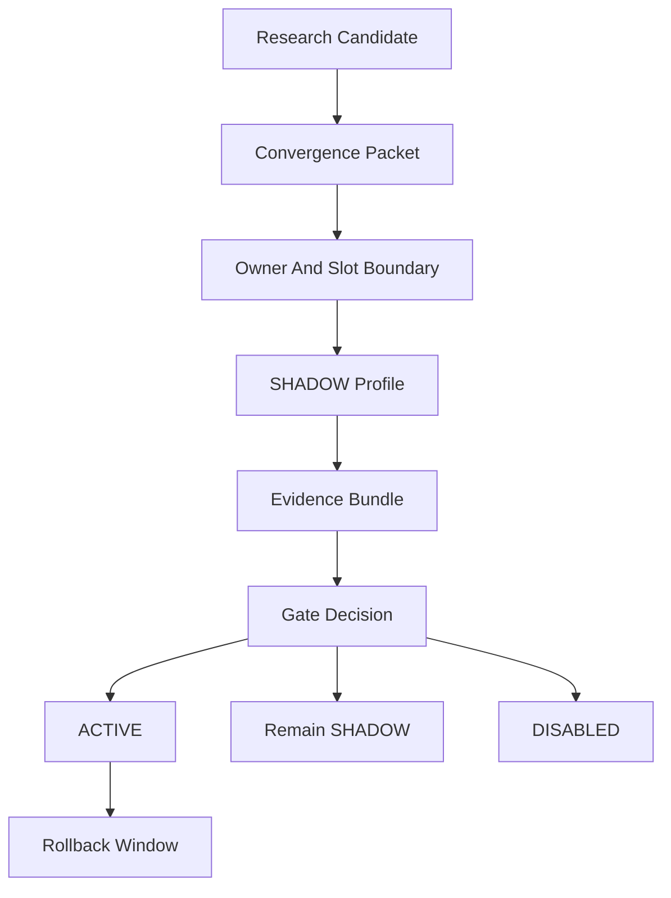

# 工程收敛与证据战争路线图

> Status: execution roadmap
> Last updated: 2026-05-22
> Related: [`探索方向.md`](./探索方向.md), [`experiment.md`](./experiment.md), [`experiment-arch-uplift.md`](./experiment-arch-uplift.md), [`experiment-phase-a-brief.md`](./experiment-phase-a-brief.md), [`real-open-dialogue-learning-loop.md`](./real-open-dialogue-learning-loop.md)

## 0. 定位

`探索方向.md` 已经完成了第一阶段使命：把外部研究线索转化为 VZ 兼容的候选方向。接下来不再把它当作架构发散入口，而是把它视为 convergence backlog。

本文件回答一个更窄的问题：**工程收敛怎么打，证据战争怎么赢**。

核心转向：

- 不再以“新增多少模块 / 方向”为进展指标。
- 不再用“架构更先进”作为胜利叙事。
- 改用 evidence bundle、SHADOW profile、cross-generation winrate、counterfactual baseline 和 gate decision 作为主进度单位。

一句话：**方向探索基本结束，工程收敛和证据战争开始。**

## 1. 三条胜利条件

VZ 的证据战不证明“系统很酷”，只证明三件可对照的事。

### 1.1 比纯 LLM 更稳定

目标：证明 VZ 的 cognitive kernel + memory + regime + semantic owners 在长期生命体能力上稳定优于纯 LLM / prompt-only agent。

必须覆盖：

- 关系连续性：long-session 关系状态不漂移，不把用户当成一次性任务上下文。
- 边界维护：不因讨好、压力、framing 攻击而弱化 boundary consent。
- 记忆一致性：跨 session 记忆能更新、纠错、区分语境。
- 身份稳定性：regime / value priority 在学习和 artifact 导入后不异常漂移。

### 1.2 比旧版 VZ 更会学

目标：证明每一次自适应改动不是“看起来更复杂”，而是在可复现基准上赢过上一代。

必须覆盖：

- cross-generation winrate：新一代在 head-to-head 中稳定赢旧一代。
- PE faithfulness：高 PE upstream 真的改变 `z_t / beta_t` 或 downstream owner readout。
- repair improvement：冲突、误解、承诺违约后的修复质量提升。
- memory probe improvement：`mp.*` 类长程记忆探针进入 generation aggregate，而不是孤立 pytest。

### 1.3 学习后不变坏

目标：证明 VZ 的学习闭环不会把坏 artifact、坏 prompt、坏 memory promotion、坏 controller update 放进 ACTIVE。

必须覆盖：

- ModificationGate fail-closed。
- Mind/Face 隔离有契约测试。
- framing-aware check 能复现并缓解 N4 类失败。
- audit evidence 能阻断缺少验证、容量超限、缺少回滚证据的 artifact。
- persona/regime drift 与 memory drift 有 readout，不靠人工看日志。

## 2. 基线矩阵

每个 convergence packet 至少要和下列基线中的相关项对照。没有 baseline 的“提升”默认不成立。

| Baseline | 用途 | 最低要求 |
|---|---|---|
| 纯 LLM / prompt-only | 证明 VZ 架构是否真的有增益 | 同场景、同输入、同工具可用性 |
| 当前 main | 证明新 packet 是否改善现状 | 同 seed / 同 profile runner |
| ablation profile | 证明关键 owner 是否必要 | 关闭 PE / ETA / memory / ToM / regime 等关键路径 |
| SHADOW profile | 证明候选能力是否值得 ACTIVE | 与 baseline 并跑，不影响主行为 |
| 上一代 ACTIVE | 证明代际进步 | head-to-head / cross-generation aggregate |

基线选择原则：

- 能用 deterministic baseline，就不用 LLM judge。
- LLM judge 只能作为 naturalness / coherence readout，不能反向写 reward 或 gate。
- 关系 / EQ 类开放任务必须有 matched-control 或 head-to-head，否则只算 anecdote。

## 3. Evidence Gate

所有 packet 必须走同一条门槛，不允许“方向正确所以先接进去”。



每个 evidence bundle 必须包含：

- Hypothesis：这个 packet 试图证明什么。
- Owner / slot 边界：哪个 owner 发布权威状态，消费者读哪个 snapshot。
- Baseline：至少一个当前 main 或纯 LLM 对照。
- Counterfactual：关闭候选能力后是否退化。
- Metrics：影响哪些 evaluation family，不能只看单一指标。
- Failure modes：哪些指标变坏时必须 BLOCK。
- Rollback：ACTIVE 后至少一个 release cycle 的回滚开关。

## 4. 阶段打法

### Phase 0: 清零文档与代码偏差

目标：先消除 R8 层面的“以 spec 为真还是以 wiring 为真”的混乱。

优先事项：

- 同步 `docs/DATA_CONTRACT.md` 与 `final_wiring.py` 的已 ACTIVE slot，尤其是 ToM / social cognition 相关 slot。
- 明确 `experiment.md` / `experiment-arch-uplift.md` / `experiment-phase-a-brief.md` 的职责边界。
- 验证 substrate `feature_surface` / `residual_activations` 是否在目标 backend 中实填，避免 COG-3 依赖悬空。

退出标准：

- DATA_CONTRACT 与 wiring 状态无已知偏离。
- 阶段 B packet 引用的 slot 都有明确 owner / snapshot 状态。
- COG-3 是否可起跑有明确结论：可跑、需要补 hook、或暂缓。

### Phase 1: 裁判席先到位

目标：先建设判断系统，而不是先接更多能力。

顺序：

1. Evaluation cascade：cheap -> mid -> expensive，`mp.*` 收编进 cheap / cross-generation aggregate。
2. ModificationGate 双门 / 三门：validation delta、capacity cap、rollback evidence、audit risk。
3. Mind/Face 隔离：expression layer 不接 reward 梯度，Mind 不直接生成 user-facing token。
4. Audit evidence interface：audit owner 只发布 readout，不直接 mutate credit / evaluation / memory。
5. Framing-aware check：复现 N4 类 framing failure，并把缓解率纳入 gate evidence。

退出标准：

- 所有后续 SHADOW profile 能被同一套 cascade 评估。
- Gate 缺证据时 fail-closed。
- LLM judge 只读，不进入学习源。

### Phase 2: 四条 SHADOW profile 并行

目标：让候选能力在同一裁判席上竞争，不靠叙述决定 ACTIVE。

候选：

- SYS-1：CPD beta switch，把 PE spike / reward shift 转成 temporal owner 内部的边界 readout。
- COG-3：persona / regime geometry drift readout，只读监控，不直接 steering。
- COG-1：least-control / commitment lineage，把 counterfactual credit 从“有读数”推进到“可归因”。
- COG-2：ToM owner reframed，补 `UserModelSnapshot` 拆分与 wrong-person / witness / private-leakage fixtures。

退出标准：

- 每条至少跑 5 seeds x paper-suite-small 或等价场景。
- 没有破坏 acceptance gate / safety family。
- 至少一个指标族出现稳定正 delta，且 ablation 证明候选能力是必要原因。

### Phase 3: 组合 profile 与代际胜率

目标：从“单项能力有效”推进到“组合后仍然有效”。

优先组合：

- SYS-1 x COG-1：边界识别 + 边界内归因。
- COG-2 x COG-3：多 interlocutor 社会状态 + persona/regime drift。
- OA-4 x COG-3：audit probe 消费 drift readout。

退出标准：

- 组合 profile 不出现负迁移。
- cross-generation winrate 显著高于上一代 ACTIVE。
- 失败 profile 被保留为 DISABLED / SHADOW 证据，不回收成“成功叙事”。

### Phase 4: 真实 / 半真实 open-dialogue evidence

目标：从 paper-suite / scripted benchmark 走向真实开放对话闭环。

优先事项：

- 把真实对话 outcome 变成 typed environment / dialogue outcome，不让 raw text 直接驱动 owner。
- 把 relationship repair、boundary recovery、memory correction、identity stability 纳入 long-session evidence。
- 将 evidence bundle 与 `real-open-dialogue-learning-loop.md` 的 ingestion / reflection / gate 路径对齐。

退出标准：

- 至少一个真实或半真实 longitudinal corpus 上，VZ 相对纯 LLM / 当前 main 有稳定优势。
- 坏学习事件有可复现 trace：哪个 owner、哪个 snapshot、哪个 gate 应该阻断。

## 5. 核心指标

优先建设的指标不是越多越好，而是要覆盖“会学、学得对、不变坏”。

- PE faithfulness：控制 PE upstream 时，`z_t / beta_t` 分布是否统计可区分。
- Cross-generation winrate：新一代是否稳定赢上一代 ACTIVE。
- Relationship repair：rupture 后是否更快、更稳、更少过度讨好地修复。
- Memory continuity：更新、时间邻域、联想、多语境 disambiguation 是否长期稳定。
- Persona / regime drift：artifact 导入、prompt 变更、memory promotion 后身份是否异常漂移。
- Ablation delta：关闭 PE / ETA / memory / ToM / regime 后是否出现预期退化。
- Gate rejection precision：坏 artifact 是否被 BLOCK，合法改动是否不被无差别拦截。

## 6. Gate Decision 规则

### 切 ACTIVE

同时满足：

- 至少一个目标指标族稳定正 delta。
- safety / boundary / identity / memory drift 无显著负 delta。
- ablation 证明候选能力对提升必要。
- evidence bundle 可复现，包含 seed、profile、artifact、版本、rollback path。
- 对应 owner / slot 已在 spec 和 DATA_CONTRACT 中同步。

### 保持 SHADOW

任一情况成立：

- 指标方向正确但样本不足。
- 对主指标有提升，但某个 safety / identity readout 有轻微风险。
- 组合 profile 尚未验证。
- evidence 缺 cross-generation aggregate。

### DISABLED

任一情况成立：

- 主要提升无法复现。
- 依赖关键词 / prompt hack / 下游重建 owner 状态。
- 对关系、边界、身份、记忆任一核心 family 造成显著退化。
- 需要绕过 R2 / R4 / R8 / R12 才能成立。

### 回滚

ACTIVE 后至少保留一个 release cycle 的 rollback window。回滚触发条件包括：

- 新增真实对话数据暴露未覆盖 failure mode。
- gate false negative 升高。
- persona / regime drift 超阈值。
- memory drift 或 wrong-person attribution 上升。
- PE faithfulness 下降到预设阈值以下。

## 7. 6-12 个月 Milestones

这些 milestone 用 evidence 计进度，不用“完成了多少架构文档”计进度。

### 6 个月内

- DATA_CONTRACT / wiring 偏差清零。
- Evaluation cascade 第一版进入主流程。
- ModificationGate 双门 / 三门 evidence 接口跑通。
- Mind/Face 隔离契约测试落地。
- 至少 2 条 SHADOW profile 跑出 5 seeds evidence bundle。
- `mp.*` 进入 cross-generation aggregate，而不是孤立 longitudinal pytest。

### 12 个月内

- 至少 2 条 profile 切 ACTIVE，旧路径保留 DISABLED 回滚窗口。
- PE faithfulness dashboard 有第一版可复现结果。
- Persona / regime drift 成为 audit probe 的正式 readout。
- 至少一组组合 profile 跑出 cross-generation winrate 优势。
- 在真实或半真实 open-dialogue 数据上，VZ 相对纯 LLM / 当前 main 有可复现优势。

## 8. 作战纪律

- 小 PR 上 main，能力走 SHADOW，不开长寿大分支。
- 长寿 branch 只给训练 artifact 类工作，例如 SYS-5 Latent Action RL。
- 每个 packet 都要有 owner 边界说明；没有 owner 的能力不准落地。
- 每个新 readout 都要说明是否 gate、是否 learning source、是否 read-only。
- 每个 LLM judge 都默认 readout-only，禁止成为 reward generator。
- 每个 ACTIVE 决策都必须能被后人复算，不能只留下总结文字。

## 9. 非目标

本路线图不做这些事：

- 不重新设计 VZ 架构。
- 不把 `探索方向.md` 的 43 条全部升级为 P0。
- 不承诺强义 AGI。
- 不用 prompt / workflow 堆栈替代 owner 学习。
- 不把 evaluation 当学习源。
- 不用 token-level RL 或 Face fine-tune 解决长期策略问题。

## 10. 结论

VZ 当前的核心优势不是“已经完成 cognitive AGI”，而是它有一套适合承载长期认知系统的结构纪律：owner、snapshot、PE-first、多时间尺度、Mind/Face 隔离、ModificationGate、SHADOW/ACTIVE。

接下来的胜负不在继续发明架构，而在能否把这些纪律变成外部也能复核的证据：

```text
Research direction
-> convergence packet
-> SHADOW evidence
-> counterfactual baseline
-> cross-generation decision
-> ACTIVE with rollback
```

只有当这条链路稳定跑通，VZ 才从“先进架构”进入“被证据支撑的数字生命系统”。
