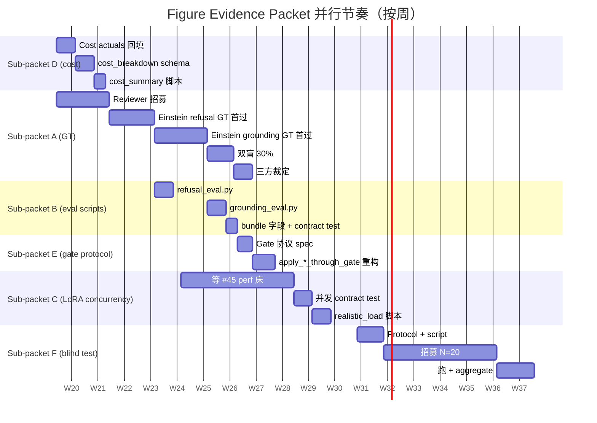

# Figure-as-a-Service 法律生死线 Packet

> 出处：商业化反思 26 条 debt 的 P1 组（[`docs/known-debts.md`](../known-debts.md) 顶部 `2026-05-13 update` 段）
> 覆盖：debt **#58 / #59 / #60 / #61 / #62 / #63** —— P1 Figure-as-a-Service 法律生死线 6 条
> 与既有 debt 的关系：
> - 已闭合架构：~~#18~~（PEFT bake backend）/ ~~#19~~（V2 archive fetcher + curated payload 大部分）/ ~~#20~~（PersonaLoRAPool 真热插）/ ~~#21~~（real-residual steering）/ ~~#22~~（DLaaS adopt 自动 hook）/ ~~#23~~（CLI + audit + bundle 持久化）/ ~~#24~~（D2 三件 helper 接进主管线）/ ~~#25~~（metadata fingerprint 折入 hash）/ ~~#26~~（4 V2 metadata client）
> - 仍开放且本 packet 强依赖：**#41**（真 Qwen-1.5B PEFT bake + verification 跑分）/ **#42**（5 道 OOS 探针离散度过粗）/ **#39**（coverage_map 过严）/ **#40**（synthetic LoRA delta 经 LayerNorm 被吃掉）
> - 横切前置（→ `cross-cutting-foundation-packet.md`）：**#45**（perf 床）/ **#47**（substrate fingerprint）/ **#50**（rollback drill）
> 状态：plan v0.1，待 packet review

---

## 目录

1. [P1 商业化的法律 gate](#1-p1-商业化的法律-gate)
2. [Packet 列表（按 debt 编号）](#2-packet-列表按-debt-编号)
3. [P1 单位经济回填路径（#63 详解）](#3-p1-单位经济回填路径63-详解)
4. [L3 / L4 GT set 工艺（#58 + #59 详解）](#4-l3--l4-gt-set-工艺58--59-详解)
5. [内部并行度](#5-内部并行度)
6. [与其他反思 packet 的接口](#6-与其他反思-packet-的接口)
7. [与既有 figure 已闭合 debt 的关系](#7-与既有-figure-已闭合-debt-的关系)
8. [风险与 kill criteria](#8-风险与-kill-criteria)
9. [推荐起跑顺序](#9-推荐起跑顺序)
10. [SSOT 约束清单](#10-ssot-约束清单)

附录 A — Reviewer 工艺速查 / 附录 B — 引用速查

---

## 1. P1 商业化的法律 gate

### 1.1 P1 价值主张里"法律可签字"那一行的精确兑换链

[`docs/business/commercialization-assessment.md`](../business/commercialization-assessment.md) §1.1 把 VZ 商业本质收敛为"**关系连续性 + 可治理性 + 多角色复用**"三件包；§4.1 把 P1 的第一卖点写为"**它说的每一句话都能溯源 + 拒答它没被授权说的话**"，并明确"L3 引证 + L4 拒答让博物馆 / 教育机构的法务可以签字"。

把这两行抽干，P1 的法律 gate 是这两件事：

- **L3 引证保真**：模型说出的每一段实质性断言都能回溯到一份原文 evidence pointer；任何"用 substrate 先验冒充人物"的输出必须被识别并抑制
- **L4 不知拒答**：模型对没被授权说的话 / 没在 corpus 覆盖的话题，必须明确拒答 / 软免责，而不是默默用基底 LLM 的训练先验补足

这两件事如果落不下 evidence，P1 §6.2 列的"30 万首单 / 46% 首年毛利"全是估算锚点；客户法务不会拿一份"我们承诺会做到"的话术去签合同。

### 1.2 现状：架构齐了，evidence 没齐

Wave A-G（2026-05-12，known-debts 顶部 update）已把整条 figure 全链路接通：[`packages/lifeform-expression/src/lifeform_expression/scope_refuser.py`](../../packages/lifeform-expression/src/lifeform_expression/scope_refuser.py) 真嵌入 `LifeformLLMResponseSynthesizer.synthesize` pre-check，[`packages/lifeform-expression/src/lifeform_expression/grounded_decoder.py`](../../packages/lifeform-expression/src/lifeform_expression/grounded_decoder.py) `verify_with_pointers` 在 post-generation 真出 typed `EvidencePointer`，[`packages/vz-substrate/src/volvence_zero/substrate/persona_lora_pool.py`](../../packages/vz-substrate/src/volvence_zero/substrate/persona_lora_pool.py) Wave D 真改 forward。

Wave O-P（2026-05-12）把 4-gate 验证管线 [`packages/lifeform-domain-figure/src/lifeform_domain_figure/verification/persona/`](../../packages/lifeform-domain-figure/src/lifeform_domain_figure/verification/persona/) 装好：cognition / voice / refusal / evidence 4 个 deterministic gate 的阈值与 scoring 全 in-place。

但 Wave Q（2026-05-12）的真跑诊断暴露了**法律 gate 的 evidence 断层**：
- L4 refusal 用 5 道 OOS 探针（[`out_of_scope_set.py`](../../packages/lifeform-domain-figure/src/lifeform_domain_figure/verification/persona/out_of_scope_set.py)：tiramisu / sourdough / Python / car / pop song），1 道 = 0.20 量化步长，0.80 threshold 在小样本上离散度过粗（debt #42）
- L4 in-scope 题靠 [`question_generator.py`](../../packages/lifeform-domain-figure/src/lifeform_domain_figure/verification/persona/question_generator.py) 从 chunk 自动派生 ≤ 20 道，**没有 reviewer-curated "应该答 / 应该拒"双向 GT 集合**
- L3 cognition 现在是 retrieval_index `assertion_is_supported` cosine score 的均值，**没有"pointer 真支持断言 vs 仅 keyword 重叠"的 reviewer 标注 GT**
- 所有 verification 数据都建立在 Einstein 一份 corpus 上 —— 第二个 figure 上线就裸奔

### 1.3 "只有 Einstein 一份 reference GT 够不够"

不够。有三条理由：

1. **统计不可分**：在单一 corpus 上调出来的 threshold（cognition_delta=0.05 / voice_delta=0.02 / refusal_min=0.80）只反映 Einstein corpus 的离散度，换 figure 必须重 calibrate；没 reviewer GT 就没 calibration ROC
2. **法务核查靠样本反查不靠承诺**：第一次客户尽调一定会挑 10 段 demo 手工核查任意一段拒答错误 / 任意一段引证 hallucination；没有 reviewer-curated 双向 GT 集合，就没有"我们已经在 N=50 题 reviewed set 上跑出 false_refuse_rate ≤ 0.10"这条 SLA 可以写进合同
3. **GT 是 figure-specific 的**：苏轼的 in-scope 范围（诗文 / 政论 / 时评）和 Einstein（物理 / 哲学 / 政治信件）完全不同；OOS 探针的 hashing-embedding 离散度也完全不同（debt #42 已暴露 "Python" 跟 "Lyapunov" 在 hashing space 有意外重叠）

所以 P1 上线第二款 figure 之前必须先建立"**figure → 双向 reviewed GT 集合**"的可复制工艺，而不是为 Einstein 写一次性的 ad hoc 测试集。

### 1.4 与 §6.2 P1 单位经济的对账逻辑

[`docs/business/commercialization-assessment.md`](../business/commercialization-assessment.md) §6.2 给的 P1 首单单位经济：

| 项 | 假设 | 数值 |
|---|---|---|
| 首单（编译 + 3 月托管 + 100 万 token） | 博物馆 / 大学采购 | 30-80 万人民币 |
| Bundle 编译 COGS | 一次性 | 5-15 万 |
| 首年毛利率 | (30 - 10 - 6)/30 | ~46% |

§4.1 kill criteria 写："Einstein bundle 实测成本 > 30 万 → P1 30 万首单的报价需要上调或拆开'编译费 vs 托管费'"。

但 5-15 万的 COGS 是估算锚点，**Wave K 已经真跑了一次 Einstein bundle**（`figure-bundle:einstein:29eacd226a7cdfd0`，6 SUCCESS / 5 cleaned / 2 reviewed），**没人把这次的工时 / GPU / 法务 / archive 等待时间拆开统计回填**。这是 #63 要做的事。

本 packet 的 6 条 debt 串起来就是"**把 P1 法律生死线从 spec 承诺降到 reviewer-curated evidence + 实测成本数据**"——既是给法务签字的弹药，也是给报价表的锚点。

---

## 2. Packet 列表（按 debt 编号）

每条 debt 给：**路径 / 退出标准（SHADOW → ACTIVE）/ 子任务（≤ 5）/ 资源估算 / 依赖 / 风险 & fallback**。

### Packet 58 — L4 ScopeRefuser 双向准确率 GT

**对应 debt**：[`#58`](../known-debts.md#58-p1-l4-scoperefuser-的-false-refuse--false-answer-双向准确率-ground-truth-缺失)

#### 路径

- 实现：[`packages/lifeform-expression/src/lifeform_expression/scope_refuser.py`](../../packages/lifeform-expression/src/lifeform_expression/scope_refuser.py)
- 验证管线：[`packages/lifeform-domain-figure/src/lifeform_domain_figure/verification/persona/`](../../packages/lifeform-domain-figure/src/lifeform_domain_figure/verification/persona/)
- 新增 GT 集合落点：`packages/lifeform-domain-figure/data/figure_refusal_gt/<figure_id>/{in_scope,out_of_scope}.jsonl`
- 新增脚本：`scripts/figure_refusal_eval.py`
- bundle schema 扩展：[`packages/lifeform-domain-figure/src/lifeform_domain_figure/figure_artifact.py`](../../packages/lifeform-domain-figure/src/lifeform_domain_figure/figure_artifact.py) `FigureArtifactBundle.refusal_eval_report` 字段
- 守门：`tests/contracts/test_figure_bundle_refusal_gt_required.py`

#### 退出标准（SHADOW → ACTIVE）

- **SHADOW**：Einstein 双向 GT 集合（≥ 50 in_scope + ≥ 50 out_of_scope）入库；`scripts/figure_refusal_eval.py` 在 Einstein bundle 上跑通；`refusal_eval_report` 字段在 Wave K bundle 上非空；inter-rater κ ≥ 0.65（双盲 2 reviewer 标注 ≥ 30% 样本，详见 §4）；CI 默认跑 synthetic substrate 路径
- **ACTIVE**：在真 Qwen-1.5B substrate 上 `false_refuse_rate ≤ 0.10` AND `false_answer_rate ≤ 0.05`（依赖 #41 真跑分），同时 production-tier bundle 编译时 mandate `refusal_eval_report.figure_id == bundle.figure_id` AND `report.in_scope_n ≥ 50` AND `report.out_of_scope_n ≥ 50`，否则 bake CLI 退出码 4 fail-loud（与 #23 closure 退出码语义对齐：4 = "evidence 不足"，区别于 2 = "gate BLOCK"）

#### 子任务

1. **定义 GT schema + reviewer 模板**（半天工程）
   - 新建 `lifeform_domain_figure.verification.refusal_gt` 子模块：`InScopeGTRecord` / `OutOfScopeGTRecord` typed dataclass + JSONL load/save + `RefusalEvalReport` frozen schema（per-rate 95% CI / per-domain breakdown）
   - reviewer 模板：[附录 A.1](#附录-a1-refusal-gt-标注模板) JSONL 行示例 + 必填字段含义
2. **Einstein 双向 GT 标注**（reviewer 主导，工时见下）
   - in_scope ≥ 50 题：从 Wave K curated bundle 真 corpus（`figure-bundle:einstein:29eacd226a7cdfd0`，444 chunks）派生候选；reviewer 修正 prompt 措辞 + 标注 `expect_answer=True` + 至少 1 个 `cited_chunk_ids` 锚点
   - out_of_scope ≥ 50 题：reviewer 写跨 ≥ 7 domain（culinary / software / automotive / entertainment / modern-tech / sports / fashion / 现代政治 / 当代名人 / 地理冷知识）各 5+ 题；与 #42 推荐修法 (1) 共享同一份扩充集
3. **eval 脚本 + bundle 字段**（1 工程师 × 3-5 天）
   - `scripts/figure_refusal_eval.py`：load GT JSONL → 走 `LifeformLLMResponseSynthesizer.synthesize` 复用 verification.persona 的 ablation runtime → 计算 false_refuse_rate / false_answer_rate / per-domain rate / 95% Wilson CI；输出 `RefusalEvalReport` JSON
   - bundle 字段：`FigureArtifactBundle.refusal_eval_report: RefusalEvalReport | None = None`；`compute_bundle_integrity_hash` 默认**不**折入（与 #47 substrate fingerprint 同 packet 设计：eval readout 走单独 `refusal_eval_report_fingerprint` audit hash，不污染 bundle integrity）
   - bundle 编译时（[`compiler.py`](../../packages/lifeform-domain-figure/src/lifeform_domain_figure/compiler.py)）若 inputs 提供 GT 集合 path → 自动跑 eval → 把 report attach 进 bundle
4. **contract test 守门**（半天）
   - `tests/contracts/test_figure_bundle_refusal_gt_required.py`：production-tier bundle (`bake-bundle --tier production`) 必须 ship 非空 `refusal_eval_report` 且 `report.in_scope_n ≥ 50` AND `report.out_of_scope_n ≥ 50`
   - `tests/contracts/test_refusal_eval_report_no_kernel_writeback.py`：AST 守 `figure_refusal_eval.py` 不 import vz-cognition / vz-temporal kernel owner（GT 是 readout，不是学习源 — R12）
5. **联动 #42 + #39**（1 工程师 × 1-2 天）
   - 把扩充后的 OOS 集合（≥ 50 题，cross-domain）替换 [`out_of_scope_set.py`](../../packages/lifeform-domain-figure/src/lifeform_domain_figure/verification/persona/out_of_scope_set.py) 中 5 道硬编码常量；保留向后兼容 `LEGACY_OUT_OF_SCOPE_REFUSAL_QUESTIONS` alias
   - 调 `gate_refusal_works` 阈值算法：从 single 0.80 改为 per-domain ≥ 0.50（详见 #42 推荐修法 (2)）
   - 同时把 #39 修复（coverage_map.evaluate 加 `SOFT_DISCLAIM` 档）的 contract test `test_coverage_map_self_consistency.py` 一并落，避免 in_scope GT 自己被 STRICT_REFUSE 短路

#### 资源估算

| 角色 | 工作 | 工时 |
|---|---|---|
| 工程师 | schema + 脚本 + 字段 + contract test | 6-8 人天 |
| Reviewer #1 | Einstein 50 in_scope + 50 out_of_scope 标注（首过） | 18-22 小时（约 2-2.5 工作日） |
| Reviewer #2（双盲交叉） | 30% 样本（30 题）独立标注 + 一致性核对 | 6-8 小时 |
| Reviewer 协调 / κ 计算 | 工程师辅助 | 0.5 人天 |

GPU 时间：CPU 走 deterministic synthetic substrate 路径 ~5 分钟全跑完；真 Qwen-1.5B 路径走 #41 同一次 GPU bake → eval 一并跑（不额外占 GPU）。

#### 依赖

- **强依赖**：reviewer 招募（见 §4 reviewer 工艺）；Wave K curated bundle 已就位（`figure-bundle:einstein:29eacd226a7cdfd0`）
- **横切依赖**：#42 OOS 探针扩展（同 packet 一并做）；#39 coverage_map.evaluate 修法 (1)（同 packet 一并做，避免 in_scope GT 撞 STRICT_REFUSE）
- **软依赖**：#41 真 Qwen 跑分（ACTIVE 退出标准依赖；SHADOW 退出标准只用 deterministic substrate 即可）

#### 风险 & fallback

- **风险 1**：reviewer 招募慢于 4 周 → fallback：先用工程师团队内部 1 人完成 Einstein 50+50 首过（不算 final GT，只是 placeholder evidence），同时启动外部 reviewer pipeline；明确"内部首过 GT 不能进客户合同 SLA"
- **风险 2**：50 in_scope 题在 hashing-embedding 上 retrieve 命中率 < 80% → 说明 #39 coverage_map STRICT_REFUSE 阈值仍偏紧，回到 #39 修法 (2)（重 calibrate term_list）
- **风险 3**：50 out_of_scope 题在 false_answer_rate > 0.30 → ScopeRefuser 阈值算法本身需要重设计，本 packet 升级为 R10 OFFLINE-gated 算法变更（不只是数据问题），见 §8 kill criteria

---

### Packet 59 — L3 GroundedDecoder 引证 hallucination GT

**对应 debt**：[`#59`](../known-debts.md#59-p1-l3-groundeddecoder-引证-hallucination-检测率未量化)

#### 路径

- 实现：[`packages/lifeform-expression/src/lifeform_expression/grounded_decoder.py`](../../packages/lifeform-expression/src/lifeform_expression/grounded_decoder.py) `verify_with_pointers` 返回 typed `EvidencePointer`
- cognition scoring：[`packages/lifeform-domain-figure/src/lifeform_domain_figure/verification/persona/scoring.py`](../../packages/lifeform-domain-figure/src/lifeform_domain_figure/verification/persona/scoring.py)
- 新增 GT 集合：`packages/lifeform-domain-figure/data/figure_grounding_gt/<figure_id>/assertions.jsonl`
- 新增脚本：`scripts/figure_grounding_eval.py`
- bundle schema：`FigureArtifactBundle.grounding_eval_report`

#### 退出标准（SHADOW → ACTIVE）

- **SHADOW**：Einstein assertion GT ≥ 100 题入库；`scripts/figure_grounding_eval.py` 跑通；`grounding_eval_report` 字段在 Wave K bundle 上非空；reviewer κ（assertion → ground_truth_chunk_ids 的"是否真支持"标注）≥ 0.60
- **ACTIVE**：在真 Qwen-1.5B substrate（依赖 #41）上 `evidence_faithfulness ≥ 0.95` AND `unsupported_assertion_rate ≤ 0.05`；production-tier bundle 编译时 mandate `grounding_eval_report.assertion_n ≥ 100`，否则退出码 4

#### 子任务

1. **assertion-level GT schema**（半天）
   - 每题字段：`question_id` / `question` / `expected_assertions: tuple[ExpectedAssertion, ...]`，每个 `ExpectedAssertion` 含 `assertion_text` / `ground_truth_chunk_ids: tuple[str, ...]`（多 chunk 同支持）/ `support_kind: Literal["explicit_quote", "paraphrase", "synthesis"]`（reviewer 区分"原文直引 / 转述 / 跨段综合"）
   - reviewer 模板：[附录 A.2](#附录-a2-grounding-gt-标注模板)
2. **Einstein assertion GT 标注**（reviewer 主导）
   - 100 题分布：50 explicit_quote（最严，可被 BM25+cosine 直接命中）+ 35 paraphrase（reviewer 给出原文段 + 转述断言）+ 15 synthesis（跨 ≥ 2 chunk 综合，最难）
   - reviewer 必须在 Wave K curated bundle 真 corpus 上指认 chunk_ids（用 [`build_figure_retrieval_index`](../../packages/lifeform-domain-figure/src/lifeform_domain_figure/retrieval_index.py) 已 emit 的 chunk_id 体系）
3. **eval 脚本**（1 工程师 × 3-5 天）
   - 对每题：synthesizer 生成回答 → `GroundedDecoder.verify_with_pointers` 抽 pointers → 计算两个 rate
     - `evidence_faithfulness = mean over assertions of (returned pointers ∩ ground_truth_chunk_ids != ∅)` —— pointer 真指 GT chunk 的比例
     - `unsupported_assertion_rate = (substantive assertions with 0 pointers) / total substantive assertions` —— 让 substrate 先验冒充人物的比例
   - 输出 `GroundingEvalReport`：per-support_kind 拆分 + per-question 详情 + 95% Wilson CI
4. **bundle 字段 + contract test**（半天）
   - `FigureArtifactBundle.grounding_eval_report: GroundingEvalReport | None = None`，与 #58 同纪律：不进 integrity_hash，走单独 audit fingerprint
   - `tests/contracts/test_figure_bundle_grounding_gt_required.py`：production-tier bundle mandate 非空 + assertion_n ≥ 100
5. **联动 #41 真 Qwen 跑分**（独立 follow-up，不阻塞本 packet SHADOW）
   - 真 Qwen-1.5B 跑分时 `figure_grounding_eval.py` 在 #41 reproduction recipe 里加一步：`bake → verify → grounding_eval` 一次性产 ACTIVE evidence
   - 真 Qwen 上才有意义（tiny-gpt2 上 cognition_score ≡ 0，evidence_faithfulness 没分母）

#### 资源估算

| 角色 | 工作 | 工时 |
|---|---|---|
| 工程师 | schema + 脚本 + 字段 + contract test | 6-8 人天 |
| Reviewer #1 | Einstein 100 题 assertion GT 首过 | 30-40 小时（4-5 工作日） |
| Reviewer #2（双盲交叉） | 30 题（30%）独立标注 | 9-12 小时 |
| Reviewer 协调 / κ 计算 | 工程师辅助 | 1 人天 |

GPU：与 #58 共享 #41 真 Qwen 一次跑分。

#### 依赖

- **强依赖**：reviewer 招募 + 至少基础物理 / 哲学背景（爱因斯坦 corpus 涉及相对论 / 哲学 of science，不是任意 native English speaker 能做高质量 paraphrase / synthesis 标注）
- **横切依赖**：与 #58 共用 reviewer 池 + 标注 pipeline
- **软依赖**：#41 真 Qwen-1.5B 跑分（ACTIVE 退出依赖）

#### 风险 & fallback

- **风险 1**：reviewer 物理背景不足导致 paraphrase / synthesis 标注 κ < 0.5 → fallback：把 100 题降级为 70 explicit_quote + 20 paraphrase + 10 synthesis；上报 PRD 调整 SLA 公允表达（"explicit_quote subset faithfulness ≥ 0.95，paraphrase subset ≥ 0.85"）
- **风险 2**：synthesis 题在 reviewer 内部一致性 κ < 0.4 → 说明 GroundedDecoder.verify_with_pointers 当前 sentence-split 算法在跨 chunk 综合断言上根本不可分（不只是 GT 问题），回到算法层评估是否需要 multi-chunk evidence 聚合；本 packet 改为只跑 explicit_quote + paraphrase 90 题，synthesis 单独追踪在新 follow-up debt
- **风险 3**：真 Qwen 跑分 unsupported_assertion_rate > 0.20 → 说明 GroundedDecoder 算法（current sentence split + min_assertion_tokens=4 + score_threshold=0.22）需要重设计，本 packet 升级为 R10 OFFLINE-gated 算法变更（同 #58 风险 3 同纪律），见 §8 kill criteria

---

### Packet 60 — L1 StylePriorInjector 风格盲测

**对应 debt**：[`#60`](../known-debts.md#60-p1-l1-styleprioringector-风格可感知性盲测)

#### 路径

- 实现：[`packages/lifeform-expression/src/lifeform_expression/style_prior_injector.py`](../../packages/lifeform-expression/src/lifeform_expression/style_prior_injector.py)
- voice scoring：[`scoring.py`](../../packages/lifeform-domain-figure/src/lifeform_domain_figure/verification/persona/scoring.py) `score_voice` 当前是 `top80 overlap × 0.6 + sentence-length p50 match × 0.4`（lexical proxy）
- 新增 protocol 文档：`docs/specs/figure-voice-blind-test-protocol.md`
- 新增脚本：`scripts/figure_voice_blind_test.py`
- bundle schema：`FigureArtifactBundle.voice_blind_test_report`

#### 退出标准（SHADOW → ACTIVE）

- **SHADOW**：盲测 protocol 文档落档；`figure_voice_blind_test.py` 半自动化产 evaluator-ready packet（生成片段 / 打乱 / 收集 CSV）；至少在 Einstein 上跑过 1 次 N=20 评估员盲测；Cronbach's α ≥ 0.70
- **ACTIVE**：在 Einstein 上 `bundle_lora` 条件相对 `raw` 的 5-point Likert "听起来像 X 的程度" 提升均值 ≥ +1.0（差 1 个 Likert 档位），效应量 Cohen's d ≥ 0.5；且 `bundle_lora` vs `bundle`（含 L1 hint 但无 LoRA）的差异显著（paired t-test p < 0.05）—— 后者直接决定 §6.2 "L1 vs L1+L2 选哪档"的客户问询

#### 子任务

1. **盲测 protocol 设计**（1 工程师 × 1-2 天）
   - 新 `docs/specs/figure-voice-blind-test-protocol.md`：
     - sample 设计：N=20 评估员 × M=30 段对话片段（10 题 × 3 condition: raw / bundle / bundle_lora）= 600 评分；每片段 ≤ 200 字
     - 招募标准：母语 / 至少高中物理 OR 大众科普水平（不要求专业物理背景，要的是"普通受过教育的成年人能不能感知"）
     - 评分量表：5-point Likert "这段听起来像 Einstein 自己写的程度"（1=完全不像 / 5=完全像）+ 一道开放注释
     - 双盲：评估员不知道 condition；condition 的 figure_id / bundle_id 不出现在 prompt 里
     - 一致性指标：Cronbach's α（评估员间一致性）+ ICC(3,k)（绝对一致度）+ 每 condition mean / SD / Cohen's d
2. **半自动化脚本**（1 工程师 × 2-3 天）
   - `scripts/figure_voice_blind_test.py`：
     - `prepare`：选 10 个 in-scope question → 对每个 question 跑 3 condition 生成 → shuffle 后输出 CSV `eval_packet.csv`（columns: snippet_id / snippet_text）+ 隐藏 mapping `mapping.json`（condition lookup，sealed 直到收集结束）
     - `aggregate`：收集 evaluator CSV → 反查 mapping → 计算 per-condition mean / SD / Cohen's d / α / ICC → 输出 `VoiceBlindTestReport`
3. **bundle 字段**（半天）
   - `FigureArtifactBundle.voice_blind_test_report: VoiceBlindTestReport | None = None`
   - 与 #58/#59 同纪律：不进 integrity_hash，单独 audit fingerprint
4. **招募 + 跑 N=20 一次**（运维流程，6-12 周自然时间）
   - 招募渠道（推荐）：高校群（清华 / 北大物理系本科 + 文科生混合）/ 朋友圈 BD / 付费招募平台（米筐 / 豌豆 / Prolific）
   - 单个评估员预计：30 段 × 1 分钟 = 30 分钟 + 5 分钟说明 = 35 分钟；按 50-100 元/人补贴
   - 数据收集 → aggregate → 落 `voice_blind_test_report` 进 Einstein bundle
5. **运维流程文档**（0.5 人天）
   - `docs/business/figure-voice-blind-test-recruitment-runbook.md`：招募模板邮件 / 知情同意书模板 / NDA 模板 / 付款流程 / 数据销毁约定（与 §10 SSOT 约束清单 NDA 条款联动）

#### 资源估算

| 角色 | 工作 | 工时 |
|---|---|---|
| 工程师 | protocol + 脚本 + 字段 + runbook | 4-6 人天 |
| Reviewer / 评估员（N=20） | 30 段 × 35 min × 20 人 | 11.7 小时（评估总工时） |
| 招募 + 协调 + 付款 BD | 整轮 6-12 周自然时间 | 1.5 人天（分散） |
| 评估员补贴 | 50-100 元 × 20 人 | 1000-2000 元 |

GPU：3 condition × 10 question × 1 generation = 30 generation；真 Qwen-1.5B 一次几分钟，复用 #41 GPU 槽位。

#### 依赖

- **强依赖**：#41 真 Qwen-1.5B PEFT bake（synthetic LoRA 在 LayerNorm 后被吃掉，盲测会得 null result —— debt #40）
- **横切依赖**：第二款 figure 上线时（推荐苏轼或居里夫人）盲测需要重跑（盲测协议复用，但 N=20 重新招）
- **软依赖**：与 P5 Companion Bench A1 voice axis（详见 [`docs/external/companion-bench-rfc-v0.md`](../external/companion-bench-rfc-v0.md)）方法论可互引

#### 风险 & fallback

- **风险 1**：N=20 跑出来 condition 间均值差 < 0.5 Likert → 说明 voice 在普通用户感知上确实不可分；P1 pricing sheet 把 L1+L2 合并卖（不再拆"含/不含 LoRA"两档），同时上报 §4.1 kill criteria "L2 编译价值被打折"
- **风险 2**：α < 0.5 → 评估员对"听起来像 Einstein"理解不一致；fallback：调整问卷措辞（增加"语气 / 词汇 / 句式"三维子评分），重新跑一次（多花 1-2 周 + 一次招募）
- **风险 3**：招募 N=20 在 12 周内招不齐 → 优先级 P1 pricing 拍板时如果还没 evidence，就在 pricing sheet 写"voice 盲测 evidence pending"，按"不含 LoRA + L1+L3+L4"档报价（30 万首单下限）

---

### Packet 61 — LoRA hot-swap 并发 / 延迟实测

**对应 debt**：[`#61`](../known-debts.md#61-p1-l2-lora-hot-swap-在并发下的状态隔离--延迟实测)

#### 路径

- 实现：[`packages/vz-substrate/src/volvence_zero/substrate/persona_lora_pool.py`](../../packages/vz-substrate/src/volvence_zero/substrate/persona_lora_pool.py) + [`packages/vz-substrate/src/volvence_zero/substrate/residual_backend.py`](../../packages/vz-substrate/src/volvence_zero/substrate/residual_backend.py) `TransformersOpenWeightResidualRuntime.activate_lora`（Wave D / debt #20 closure）
- 现有测试：`packages/vz-substrate/tests/test_lora_aware_runtime_smoke.py`（7 case，含 `@pytest.mark.hf` 单 session 真 forward-hook，**不并发**）
- 新增测试：`tests/perf/test_persona_lora_concurrent_activation.py`
- 新增脚本：`scripts/realistic_load_figure_multi_persona.py`
- 新增 spec：`docs/specs/persona-lora-concurrency.md`

#### 退出标准（SHADOW → ACTIVE）

- **SHADOW**：N=10 asyncio task 各 activate 不同 figure_id × 同时 forward 100 turn，每 task 看到的 logits 与该 figure 单独 forward byte-equivalent；frozen base `state_dict_hash` 在并发 activate / deactivate 全程不变；test 在 #45 perf 床下 CI 周跑（不进 PR gate，太慢）
- **ACTIVE**：`scripts/realistic_load_figure_multi_persona.py` 在 1× A10 GPU 上"10 用户 × 5 figure × 30 min"负载下 P99 per-turn latency < 5s；GPU 显存峰值 < 80% 单卡上限；零 race condition exception；`docs/specs/persona-lora-concurrency.md` thread/asyncio safety contract 显式落档

#### 子任务

1. **横切前置：#45 perf 床建立**（→ `cross-cutting-foundation-packet.md` 主导）
   - 本 packet **不**自建 perf 床；等 #45 把 `tests/perf/` + `scripts/realistic_load_*.py` 模板落地后再追加 figure 专属测试
   - 横切依赖明确写入 §6
2. **并发隔离 contract test**（1 工程师 × 2-3 天，等 #45 ready 后）
   - `tests/perf/test_persona_lora_concurrent_activation.py`：
     - case 1：N=10 asyncio task × 不同 figure_id × forward 100 turn → assert per-task logits == single-task baseline byte-equal（用 fixed seed + `torch.manual_seed`）
     - case 2：嵌套 activate（task A 在 activate Einstein context 内试图 activate Curie）→ assert raises RuntimeError（与 debt #20 closure 单线程语义一致，不依赖 asyncio.Lock 实现）
     - case 3：activate / deactivate 上下文进出 100 次后 frozen base `state_dict_hash` 与初始 hash byte-equal（R2 守门）
3. **真实负载脚本**（1 工程师 × 2 天）
   - `scripts/realistic_load_figure_multi_persona.py`：`asyncio.gather` 10 个 user simulator × 每个 user 在 5 figure 间随机切换 × 按真实 turn 时间分布（poisson interval, mean 5s）跑 30 min
   - 输出 `artifacts/perf/figure_multi_persona_<date>.json`：per-figure × per-percentile latency / GPU mem timeline / activate-overhead per turn
4. **spec 落档**（0.5 人天）
   - `docs/specs/persona-lora-concurrency.md`：明确 `LoRAAwareResidualRuntime.activate_lora` 的 thread-safety / asyncio-safety 保证
     - 当前 Wave D 实现：单线程语义（嵌套抛 RuntimeError）；asyncio 多 task 走不同 figure_id 安全（forward-hook 是 instance 级别的 list，install/remove 配对原子）
     - 真实多 GPU 进程间共享 substrate（→ #17）需要 `RemoteLoRAAwareResidualRuntime` 走 RPC，本 spec 暂不覆盖
5. **race-condition fallback**（条件触发，1 工程师 × 1-2 天）
   - 如果 case 1 暴露 race（per-task logits 不 byte-equal）：在 `TransformersOpenWeightResidualRuntime.activate_lora` 加显式 `asyncio.Lock` per layer，重跑 case 1 验证；spec 同步更新

#### 资源估算

| 角色 | 工作 | 工时 |
|---|---|---|
| 工程师 | contract test + 负载脚本 + spec | 5-7 人天（前提：#45 perf 床 ready） |
| GPU | 1× A10 / L4 实测 30 min × 至少 3 次（baseline + 修后 + ACTIVE） | 2-3 GPU 小时 |

#### 依赖

- **强依赖横切**：[`#45`](../known-debts.md#45-生产并发--多租户下的-latency--显存--调度实测床缺失) perf 床（→ `cross-cutting-foundation-packet.md`）；这是硬阻塞，#45 不 ready 本 packet 不能起跑
- **强依赖**：#41 真 Qwen-1.5B PEFT 至少跑过一次（synthetic LoRA 不能验证真 forward 改变 → debt #40）
- **横切依赖**：[`#47`](../known-debts.md#47-substrate-compatibility-fingerprint--升级降级路径未规约) substrate fingerprint —— 并发实测必须固定 `SubstrateFingerprint`，否则结果不可比

#### 风险 & fallback

- **风险 1**：#45 perf 床 6 个月内不 ready → 本 packet 整体推迟到 Phase B 后期；P1 第一个客户上线时只挂 1 个 figure（避开并发问题）
- **风险 2**：case 1 真暴露 race condition → 升级为 `vz-substrate` 级别 R10 OFFLINE-gated 修法（不只是 figure-vertical 的事），与 #20 closure 同纪律
- **风险 3**：负载脚本 P99 > 5s → 不是单纯 LoRA 问题，而是 substrate 推理本身在 32B+ 模型上单卡饱和；fallback：把 SLO 从"P99 < 5s"调整为"P99 < 8s @ 10 concurrent on 1× A10"（与客户合同 SLA 表达对齐）

---

### Packet 62 — OFFLINE gate `validation_delta ≥ 0.05` 测量协议

**对应 debt**：[`#62`](../known-debts.md#62-p1-offline-gate-validation_delta--005-阈值的-measurement-protocol-未固化)

#### 路径

- gate 阈值实现：[`packages/lifeform-domain-figure/src/lifeform_domain_figure/gate_apply.py`](../../packages/lifeform-domain-figure/src/lifeform_domain_figure/gate_apply.py) `apply_steering_through_gate` / `apply_persona_lora_through_gate`
- kill criteria：[`docs/business/commercialization-assessment.md`](../business/commercialization-assessment.md) §4.1 P1 kill criteria
- 新增 spec：`docs/specs/figure-offline-gate-validation-protocol.md`
- 复用 GT：#58 `data/figure_refusal_gt/` + #59 `data/figure_grounding_gt/`

#### 退出标准（SHADOW → ACTIVE）

- **SHADOW**：spec 落档明确 validation_delta 测量协议；`apply_*_through_gate` 重构为接收 `proposal.train_loss_delta + proposal.downstream_score_delta` 双指标（向后兼容：旧调用只填 train_loss_delta 自动计算 placeholder downstream，标 `audit.notes += ["downstream_proxy"]`）
- **ACTIVE**：production-tier `apply_persona_lora_through_gate` mandate 非空 `downstream_score_delta`（来自 #58/#59 GT set 上的 voice/cognition score 真改善），否则 GateDecision.BLOCK；contract test 守门"任何 production bake 必须有 downstream evidence"

#### 子任务

1. **spec 落档**（1 工程师 × 1-2 天）
   - `docs/specs/figure-offline-gate-validation-protocol.md`：
     - 定义 train_loss_delta（PEFT 训练循环的 `(init_loss - final_loss) / init_loss`，与现 [`lora_bake_peft.py`](../../packages/lifeform-domain-figure/src/lifeform_domain_figure/lora_bake_peft.py) 一致，作为最低门槛）
     - 定义 downstream_score_delta：在 ≥ 50 题 in-scope GT 上的 (voice score post-bake mean - voice score pre-bake mean)；threshold ≥ 0.05
     - 定义 cognition_downstream_delta（可选）：在 ≥ 100 题 grounding GT 上的 cognition score 改善；threshold ≥ 0.03
     - 明确测量集合 = #58/#59 GT 的子集（防止"测的集合 = 训的集合"过拟合：留出 20% 作为 held-out validation subset）
2. **`apply_*_through_gate` 重构**（1 工程师 × 2-3 天）
   - `LoRABakeProposal` / `SteeringBakeProposal` schema 加 `downstream_score_delta: float | None = None` + `downstream_eval_set_id: str = ""` + `downstream_eval_n: int = 0`
   - gate 决策：production-tier 必须 downstream_score_delta ≥ 0.05；否则 BLOCK + block_reason `"production-tier requires downstream evidence"`
   - dev-tier / SHADOW: 旧路径不变（train_loss_delta 唯一）+ audit notes 标 fallback
3. **eval pipeline 接入**（1 工程师 × 2-3 天）
   - PEFT bake CLI（[`cmd_bake_lora`](../../packages/lifeform-domain-figure/src/lifeform_domain_figure/cli/_commands.py)）加 `--downstream-eval-gt-root data/figure_refusal_gt/<figure_id>` 参数
   - bake 完成后自动跑 #58/#59 eval 脚本的子集 → 算 downstream delta → 填进 proposal
4. **联动 #41 真 Qwen 跑分**（独立 follow-up）
   - 真 Qwen 跑分时新协议自动激活；产出 audit record 真带 downstream evidence
5. **contract test**（半天）
   - `tests/contracts/test_offline_gate_requires_downstream_evidence.py`：production-tier proposal 缺 downstream → BLOCK + audit 真写 BLOCK + block_reasons 含 `"production-tier requires downstream evidence"`

#### 资源估算

| 角色 | 工作 | 工时 |
|---|---|---|
| 工程师 | spec + 重构 + eval pipeline + contract test | 5-7 人天 |
| GPU | 复用 #41 跑分槽位 | 0（无独立 GPU 占用） |

#### 依赖

- **强依赖**：#58 + #59 GT 集合至少 SHADOW 退出（无 GT 就没 downstream measurement）
- **强依赖**：#41 真 Qwen-1.5B 跑分（synthetic backend 在 LayerNorm 后 delta=0，downstream score post-bake == pre-bake；只能在真 PEFT 上看 evidence）
- **横切依赖**：#47 substrate fingerprint —— downstream eval 必须钉在 single substrate fingerprint 上，否则结果不可比

#### 风险 & fallback

- **风险 1**：50 in-scope GT 在 train/held-out 拆 80/20 后只剩 10 题做 held-out → 统计 power 不足；fallback：GT 集合扩到 80 题（+30 题增量标注 ≈ +12 reviewer 小时），保证 60 train + 20 held-out
- **风险 2**：真 Qwen PEFT 跑出来 downstream_score_delta ≈ 0 但 train_loss_delta = 0.4（训练上 loss 下降但 voice 没改善）→ 说明 PEFT 在 corpus 上学到的是 token-level 表面 pattern，不是 figure 风格内化；本 packet 升级为算法层 follow-up（增加 contrastive style loss / style-only LoRA），不阻塞 #62 spec 落档（spec 是协议，不是承诺一定能达标）

---

### Packet 63 — Bundle 编译实测成本回填

**对应 debt**：[`#63`](../known-debts.md#63-p1-bundle-编译实测成本回填替代估算-5-15-万)

#### 路径

- bake CLI：[`packages/lifeform-domain-figure/src/lifeform_domain_figure/cli/_commands.py`](../../packages/lifeform-domain-figure/src/lifeform_domain_figure/cli/_commands.py)
- audit 持久化：[`audit.py`](../../packages/lifeform-domain-figure/src/lifeform_domain_figure/audit.py) `FigureBakeAuditRecord`（已有 `validation_delta` / `capacity_cost` / `corpus_mode` / `backend_id`）
- 真采集证据：Wave K Einstein bundle `figure-bundle:einstein:29eacd226a7cdfd0`
- 新增文档：`docs/business/figure-bake-cost-actuals.md`
- 新增脚本：`scripts/figure_cost_summary.py`

#### 退出标准（SHADOW → ACTIVE）

- **SHADOW**：`docs/business/figure-bake-cost-actuals.md` 落档 Einstein Wave K 实际成本明细（工时 / GPU / archive 访问 / reviewer 小时）；`FigureBakeAuditRecord.cost_breakdown` 字段 schema 确定（向后兼容：默认空 dict，旧 audit 仍可读）；`scripts/figure_cost_summary.py` 跑通 Einstein audit log 出 per-bundle 成本汇总
- **ACTIVE**：第二款 figure（推荐苏轼或居里夫人）真跑一次，cost_breakdown 自动捕获；P1 pricing sheet 引用"基于 N=2 figure 平均"+ %CI 而不是估算锚点

#### 子任务

1. **Einstein Wave K 实际成本回填**（1 人 × 1 周）
   - 把 Wave K 的真实开销手工拆开：
     - 工程师人天（含 bake CLI fix / curator metadata 编写 / reviewer 反馈调整）：估约 3-5 人天
     - reviewer human-in-loop 时间（10 URL 选 → 6 SUCCESS → 2 substantive 选）：估约 4-6 reviewer 小时
     - GPU 小时（本次 Wave K 走 tiny-gpt2 CPU 0.5 小时，但 §6.2 估算的 5-15 万 COGS 锚点是基于 PEFT-on-Qwen-1.5B 的 30 min 1× A10 估算 → 同时记录"实跑 Wave K 用 CPU + 计入估算的 GPU 一次成本"两条数字）
     - archive crawl / rate-limit 等待时间（4 FAILED_HTTP × retry / robots.txt 守候时间）：估约 2-4 人小时
     - 法务工时（公共领域确认 / license_notice 校验）：估约 2-4 人小时
2. **`FigureBakeAuditRecord.cost_breakdown` schema**（1 工程师 × 2-3 天）
   - schema 新字段：
     ```python
     # 在 audit.py 内
     # cost_breakdown: dict[str, float] = field(default_factory=dict)
     # 推荐 keys: engineer_hours / reviewer_hours / gpu_seconds /
     # archive_wait_seconds / legal_hours / total_wall_seconds
     ```
   - bake CLI 包装 layer：`cmd_bake_bundle` / `cmd_bake_lora` 起止时间用 `time.monotonic()` 记 wall_seconds；GPU 用 `torch.cuda.Event` 或 `nvidia-smi` 轮询统计 GPU seconds（best-effort，CPU 路径填 0）；reviewer hours / engineer hours 通过 CLI flag `--reviewer-hours` / `--engineer-hours` 在 ops 操作时显式传入（reviewer 操作时长不易自动捕获）
3. **`scripts/figure_cost_summary.py`**（1 工程师 × 2 天）
   - 从 `data/figure_audit/<figure_id>/*.json` 读所有 audit record → group by `bundle_id` → 累加 cost_breakdown → 输出 `artifacts/figure_cost_summary/<figure_id>.json`：per-bundle total + per-action 拆分 + 推算 RMB 成本（按可配置 rate table：engineer 800 元/天 / reviewer 200 元/小时 / GPU 5 元/小时 …）
4. **`docs/business/figure-bake-cost-actuals.md`**（1 工程师 × 1-2 天）
   - 章节：Wave K Einstein 实际成本明细 / 与 §6.2 估算的对比 / per-axis 拆解 / 第二款 figure 推算预算上限 / 已知低估项（如：reviewer-curated 第一波 10-20 份 corpus 的边际工时 / 法务 license sweep 的边际工时）
5. **第二款 figure 跟跑**（独立 follow-up，等 P1 第二款 figure 决策 + 启动）
   - 用同一 cost_breakdown 自动捕获；填进 cost_actuals.md 第二章节；产出"基于 N=2 figure 的成本平均 + 95% CI"

#### 资源估算

| 角色 | 工作 | 工时 |
|---|---|---|
| 工程师 | schema + 脚本 + cost summary + cost_actuals 文档 | 5-7 人天 |
| 工程师（手工回填 Einstein）| 拆解 Wave K 时间 / GPU / 工时 / 法务 | 1-2 人天 |
| BD / 财务（rate table 拍板） | 工程师 / reviewer / GPU / 法务费率 | 0.5 人天 |

#### 依赖

- **强依赖**：Wave K Einstein bundle 已就位（`figure-bundle:einstein:29eacd226a7cdfd0`）
- **软依赖**：第二款 figure 启动（决定 ACTIVE 退出标准能否达成）
- **横切关联**：与 [`docs/business/commercialization-assessment.md`](../business/commercialization-assessment.md) §6.2 单位经济表的回填路径（cost_actuals.md 完成后，§6.2 表格旁边加"实测数字见 cost_actuals.md"链接）

#### 风险 & fallback

- **风险 1**：Einstein 实跑成本 > 30 万人民币 → 命中 §4.1 P1 kill criteria；本 packet 在 cost_actuals.md 里**诚实记录**而不是反向调整估算；同时上报 P1 报价模板：拆开"编译费 vs 托管费"，编译费按"成本 + 30%"，托管费按席位
- **风险 2**：第二款 figure 真跑前 cost_breakdown 字段进 production audit 但没人校验 → ops 流程文档需要明确"每次 production bake 必须填非空 reviewer_hours / engineer_hours"，否则 audit 不能进 cost_summary 计算
- **风险 3**：rate table（800 元/天工程师等）与实际雇佣成本偏差 → cost_summary 输出按 rate 配置渲染，rate 调整时旧 audit 不需要重写；cost_actuals.md 标注 rate 版本

---

## 3. P1 单位经济回填路径（#63 详解）

### 3.1 为什么这一段单独拎出来

[`docs/business/commercialization-assessment.md`](../business/commercialization-assessment.md) §4.1 给的 P1 30-80 万首单价 + §6.2 给的 5-15 万 Bundle 编译 COGS 是**估算锚点**，不是实测。Wave K 已经真跑了一次 Einstein bundle —— 这次的成本如果不拆开 / 不回填，下次客户报价时就只能继续用估算数字。

P1 §6.2 单位经济表里所有黑体字（"~46% 首年毛利 / 首年回本"）都依赖 5-15 万 COGS 这个锚点；如果 Einstein 实跑超过 15 万，§6.2 整张表都要重写。

### 3.2 Einstein 实跑成本拆开（待回填）

下表是 Wave K Einstein bundle 实跑成本的**结构化模板**（数字位是 placeholder，#63 SHADOW 退出时由工程师填实）：

| 成本项 | 实测值（待填） | 备注 |
|---|---|---|
| 工程师人天（bake / curator / debugging） | TBD（估 3-5 人天） | 含 #19 closure / Wave J / Wave K 一次性投入 |
| Reviewer 工时（curator metadata + 选 substantive） | TBD（估 4-6 小时） | 10 URL → 6 SUCCESS → 选 2 篇 |
| Archive crawl 工时（rate-limit / retry） | TBD（估 2-4 小时） | 4 FAILED_HTTP × retry |
| GPU 实跑（Wave K：CPU 短训） | TBD（估 0.5 CPU 小时） | tiny-gpt2 短 epoch；非 production |
| GPU 估算（Qwen-1.5B PEFT，#41 reproduction）| TBD（估 1× A10 × 30 min = 0.5 GPU 小时） | 真 production 路径 |
| 法务工时（公共领域确认 / license sweep） | TBD（估 2-4 小时） | Wave K 是公共领域，时间偏低；非公共领域会高一档 |
| **合计 RMB（按 rate table）** | **TBD** | rate：engineer 800 元/天 / reviewer 200 元/小时 / GPU 5 元/小时 / 法务 1000 元/小时（外包） |

### 3.3 与 §6.2 估算的对账逻辑

§6.2 估算 5-15 万 COGS 的拆解（隐含）：
- 工程师 5-10 人天 × 1500-2500 元/天 ≈ 0.75-2.5 万
- GPU 1-3 GPU 小时 ≈ 5-15 元（可忽略）
- Reviewer + 法务 + 杂项 ≈ 2-5 万
- 风险预留 + 客户支持 ≈ 2-7.5 万

如果 Einstein 实跑落在 **5-10 万**：估算保守了一些但合理，§6.2 不需要重写
如果 Einstein 实跑落在 **10-15 万**：估算锚点已用满，第二款 figure 跑前要复核
如果 Einstein 实跑 > **15 万**：§6.2 表格 COGS 区间上调；首单 30 万的"首年回本"承诺要重新算；合同模板拆开"编译费 vs 托管费"
如果 Einstein 实跑 > **30 万**：直接命中 §4.1 kill criteria，不只是定价问题，是商业模型问题

### 3.4 第二款 figure 的预算上限

P1 §4.1 第一波客户优先级：博物馆 / 大学 / 公共图书馆（爱因斯坦 + 苏轼 / 居里夫人 / 鲁迅 / 特斯拉）。

推荐第二款 = **苏轼**（中文 IP / 文化部门 + 出版社采购意愿强）OR **居里夫人**（女性 + 法语 / 多语言 / 国际媒体效应）。

第二款的预算上限按"Einstein 实测 × 1.2"（学习曲线下来 20% 上浮覆盖第一次没踩到的坑），如果 Einstein 实测 = 10 万，第二款预算上限 = 12 万。

第二款落地后用 cost_summary 算 N=2 平均 + 95% CI，从 Phase B 起 P1 报价模板用此数字。

### 3.5 cost_actuals.md 的复盘节奏

[`docs/business/commercialization-assessment.md`](../business/commercialization-assessment.md) §11 给的 90 天复盘清单 §6 单位经济：每 90 天回看 cost 是否需要回填。

cost_actuals.md 与 §6.2 表的同步规则：
- cost_actuals.md 每加一款 figure → §6.2 表的 "Bundle 编译 COGS" 行旁注链接到 cost_actuals.md 对应章节
- §6.2 数字调整时（每 N=3 款 figure，或重大 substrate 升级时）→ commercialization-assessment 升版 v0.X → v0.X+1
- cost_actuals.md 是 append-only，每款 figure 一个章节，永不覆盖（与 audit log 同纪律）

---

## 4. L3 / L4 GT set 工艺（#58 + #59 详解）

### 4.1 GT set 是 reviewer artifact，不是工程产物

GT set 的核心价值：**reviewer 在 figure corpus 上的领域判断**。任何"工程师快速生成 100 道 grounding GT"的提议都是错误的（生成的题在 hashing-embedding 上的离散度反映工程师的分布，不是 figure 的真实内容覆盖）。

工程产物：schema / 脚本 / 字段 / contract test / 一致性计算
Reviewer 产物：50 in_scope + 50 out_of_scope refusal GT + 100 grounding assertion GT，每题手工标注 chunk_ids

### 4.2 Reviewer 人选标准

不同 figure 不同要求；本 packet 锚定 Einstein：

| Reviewer 资格 | 必要 | 优选 |
|---|---|---|
| 大学教育 | ✅ | 物理 / 哲学 of science / 科学史专业更佳 |
| 英语阅读能力 | ✅ | 阅读 1916 年英德对译相对论原文不障碍 |
| 物理基础 | high school physics 必要 | 大学普物 + 现代物理优选 |
| corpus 投入意愿 | ≥ 30 小时投入 / figure | full-time 4-5 工作日 |
| NDA 签署能力 | ✅ | 个人或 contractor 身份 |
| 时区 | 与团队不超过 8 小时差 | 异步协作可接受 |

苏轼 / 鲁迅 / 居里夫人需要不同语言 + 不同领域 reviewer；本 packet 的工艺设计与 figure 解耦，每个 figure 招募各自的 reviewer team。

### 4.3 Reviewer 人数 + 双盲流程

**推荐 N=2（首过 + 30% 交叉），不是 N=1（成本不可控）也不是 N=5（学术级，超出商业必要）**。

- **Reviewer #1（首过）**：标注全部 50 in_scope + 50 out_of_scope refusal GT + 100 grounding GT
- **Reviewer #2（双盲交叉）**：独立标注其中 30%（30 题 refusal + 30 题 grounding），不看 Reviewer #1 的标注
- **工程师协调**：双盲完成后比对 Reviewer #1 vs Reviewer #2 标注，计算一致性 κ；分歧条目（≥ 阈值差异）走 Reviewer #1 + Reviewer #2 + 工程师三方裁定

### 4.4 一致性公式（按标注类型）

#### Refusal GT（refusal_correct: bool）

二元变量，用 **Cohen's κ**：

\[
\kappa = \frac{p_o - p_e}{1 - p_e}
\]

其中 \( p_o \) 是观察一致率（两个 reviewer 给同一题相同标注的比例），\( p_e \) 是随机一致率（两个 reviewer 各自的边际概率乘积之和）。

**接受阈值**：
- κ ≥ 0.80：excellent，可直接用
- κ ∈ [0.65, 0.80)：substantial，可用但分歧条目走三方裁定
- κ ∈ [0.40, 0.65)：moderate，标注 schema 或 corpus 边界本身有歧义；返工 schema 后重新标
- κ < 0.40：标注任务不可分；停止本款 figure 的 GT 工作，先与 BD 沟通这款 figure 是否适合

#### Grounding GT（chunk_ids 集合)

集合变量，用 **Jaccard Index** + 二元化的 Cohen's κ:

每题：
\[
J = \frac{|R_1 \cap R_2|}{|R_1 \cup R_2|}
\]

其中 \( R_1, R_2 \) 是两个 reviewer 各自给出的 chunk_id 集合。

汇总：跨 30 交叉题计算 mean Jaccard + per-题 二元化"是否完全相同"的 Cohen's κ。

**接受阈值**：
- mean Jaccard ≥ 0.70 AND κ ≥ 0.60：可用
- mean Jaccard ∈ [0.50, 0.70)：分歧条目走三方裁定
- mean Jaccard < 0.50：grounding 任务定义不可分；考虑把 100 题降级为 70 explicit_quote + 20 paraphrase + 10 synthesis（详见 #59 风险 1）

#### Voice 盲测（5-point Likert）

连续变量，用 **Cronbach's α** + **ICC(3,k)**：

\[
\alpha = \frac{k}{k-1} \left( 1 - \frac{\sum_{i=1}^k \sigma_{Y_i}^2}{\sigma_X^2} \right)
\]

其中 \( k \) 是评估员人数（N=20），\( Y_i \) 是第 i 个评估员的全部评分，X 是总分。

**接受阈值**：α ≥ 0.70 + ICC(3,k) ≥ 0.70；< 0.70 → 详见 #60 风险 2

### 4.5 Reviewer 时长估算（per figure）

| 任务 | 单位时长 | 数量 | 总时长 |
|---|---|---|---|
| Refusal in_scope GT 首过（含读 chunk + 写题 + 标 cited_chunk_ids） | 10-15 min/题 | 50 题 | 8.3-12.5 小时 |
| Refusal out_of_scope GT 首过（含写跨 domain 题 + reasoning） | 5-10 min/题 | 50 题 | 4.2-8.3 小时 |
| Grounding GT 首过（含 reading + writing assertion + chunk lookup） | 15-25 min/题 | 100 题 | 25-41.7 小时 |
| **Reviewer #1 首过合计** | | | **37.5-62.5 小时** |
| Reviewer #2 双盲（30% 样本，无写题，仅再标） | 5-15 min/题 | 60 题 | 5-15 小时 |
| 三方裁定会议（与工程师 + Reviewer #1 + #2 同步） | 1-2 小时 × 3-5 次 | 4 次 | 4-8 小时 |
| **Reviewer #2 + 三方合计** | | | **9-23 小时** |
| **Per figure 总 reviewer 工时** | | | **46.5-85.5 小时** |

按中位 65 小时 / figure × 200 元/小时 = **13,000 元 / figure 的 reviewer 成本**（不含工程师协调）。

### 4.6 Einstein 优先 + 第二款跟进

Einstein 优先：
- ✅ Wave K 真 corpus 已就位（444 chunks），Reviewer 不需要花时间收 corpus
- ✅ 公共领域，无 IP 风险
- ✅ 大众识别度高，做 demo 流量大
- ✅ 物理 reviewer 招募门槛相对清晰

第二款（推荐苏轼 OR 居里夫人）：
- 苏轼 → 中文 reviewer 池（北大 / 中文系硕博 / 古典文学背景）
- 居里夫人 → 法语 / 英语双语 reviewer 池（更难招但有国际媒体效应）

### 4.7 NDA 与合规标注

reviewer 必须签 NDA：
- 内容：禁止外传 GT 集合 / 禁止用 GT 训练自家模型 / 90 天后样本数据销毁条款 / 评估透明度（标注完成后可申请看自己的 κ 分数）
- 法务模板：与 [`docs/specs/figure-vertical.md`](../specs/figure-vertical.md) §"Boundary policy" 同纪律 —— 与 §10.1 反目标"P1 figure 必须严格只做公共领域 + 显式授权"对齐

标注内容必须公共领域：
- Einstein 已确认（1955 年逝世 + 主要论文 1900-1955 年；按 70 年 + 多国版权法，2026 年大部分核心论文进入公共领域）
- 苏轼（北宋）/ 居里夫人（1934 年逝世，2026 年大部分作品进入公共领域）/ 鲁迅（1936 年逝世，已进入公共领域）—— 第二款选定时法务先做 license sweep

---

## 5. 内部并行度

本组 6 条 debt **可拆 4-5 个 sub-packet 并行跑**，把 reviewer / 工程师 / GPU / BD 资源最大化复用。

### 5.1 Sub-packet 拆分

| Sub-packet | 包含 debt | 主导角色 | 自然时长 | 关键路径 |
|---|---|---|---|---|
| **A. GT 集合层** | #58 + #59 | Reviewer 主导 | 4-6 周（双向 GT × 2 reviewer + 协调） | reviewer 招募 → 首过 → 双盲 → 三方裁定 |
| **B. 评估脚本层** | #58 + #59 同构 | 工程师 1 人 | 1-2 周 | 等 GT 第一批入库即可起跑（不必全部入库） |
| **C. 并发实测层** | #61 | 工程师 1 人 | 1-2 周 | 等 #45 perf 床 ready（横切阻塞，不在本 packet 控制） |
| **D. 成本回填层** | #63 | 工程师 1 人 | 1 周 | 独立可立刻起跑（Einstein Wave K 已在） |
| **E. Gate 协议层** | #62 | 工程师 1 人 | 1-2 周 | 等 #58 + #59 GT 至少 SHADOW 退出 |
| **F. 盲测层** | #60 | 工程师协调 + 招募 BD | 6-12 周自然时间 | 可后置到 P1 第二款 figure 上线时 |

### 5.2 并行度图



### 5.3 关键并行约束

1. **A 和 D 完全并行**（reviewer 和工程师不冲突）—— Phase A 第 1-2 周同时启动
2. **B 等 A 第一批 GT 入库**（不需要等全部 → 30% 入库时即可起 refusal_eval.py）
3. **E 等 B 落地**（gate 协议要先有 GT 才能定 downstream measurement set）
4. **C 等 #45**（横切阻塞，不在本 packet 控制；独立追踪在 cross-cutting-foundation-packet.md）
5. **F 后置**（盲测 N=20 招募周期长 + 第一款 figure 不上线时不需要拍板 pricing）

### 5.4 Phase 投入估算（汇总）

| Phase | 工程人天 | Reviewer 小时（per figure） | 工时合计（按中位） |
|---|---|---|---|
| Phase A 第 1-4 周（D + A 启动 + B 准备） | 5-7 人天 | 0（招募中） | 6 人天 |
| Phase A 第 5-10 周（A 进行 + B 落地 + E 准备） | 8-12 人天 | 46.5-85.5（Einstein） | 10 人天 + 65 reviewer 小时 |
| Phase A 第 11-12 周（E 落地） | 5-7 人天 | 0 | 6 人天 |
| Phase B 早期（C 横切 + F 启动） | 5-7 人天 | 11.7（盲测） | 6 人天 + 11.7 evaluator 小时 |
| Phase B 中期（第二款 figure GT） | 2-3 人天 | 46.5-85.5（第二款） | 2.5 人天 + 65 reviewer 小时 |
| **总计（前 N=2 figure）** | **25-36 人天（中位 30）** | **104.7-182.7 小时** | **30 工程人天 + 142 评估小时** |

总成本估算（按 [`commercialization-assessment.md`](../business/commercialization-assessment.md) §7.3 P1 GTM 成本一档）：30 工程人天 × 800 元 + 142 评估小时 × 200 元 = 2.4 万 + 2.84 万 = **5.24 万人民币**（不含 GPU + 招募 BD + NDA / 法务模板）。

完整 Phase A + Phase B 早期实施：~6 万人民币 + 0.5-1 GPU 月（推算 §6.1 GPU 成本 ≈ 0.5 万）≈ **总投入 6.5-7 万**，远低于 §6.2 P1 单笔首单 30 万 → 投资回报明确。

---

## 6. 与其他反思 packet 的接口

本 packet 不重复其他组 debt 内容，下面列出依赖 / 引用接口。

### 6.1 横切前置依赖（→ `cross-cutting-foundation-packet.md`，未来同等地位 packet）

- **#45 perf 床**：[`#45 — 生产并发 / 多租户下的 latency / 显存 / 调度实测床缺失`](../known-debts.md#45-生产并发--多租户下的-latency--显存--调度实测床缺失)
  - 本 packet **#61** 强依赖 #45 落地后的 `tests/perf/` 目录 + `scripts/realistic_load_*.py` 模板
  - 接口：`tests/perf/test_persona_lora_concurrent_activation.py` 复用 #45 提供的 perf fixture / asyncio harness / GPU mem tracker 公开 API
- **#47 substrate fingerprint**：[`#47 — substrate compatibility fingerprint + 升级降级路径未规约`](../known-debts.md#47-substrate-compatibility-fingerprint--升级降级路径未规约)
  - 本 packet **#58/#59/#62** 软依赖：所有 eval report 必须钉在固定 `SubstrateFingerprint` 上，否则跨 substrate 升级时 evidence 不可比
  - 接口：`refusal_eval_report.substrate_fingerprint` / `grounding_eval_report.substrate_fingerprint` 字段在 #47 落地后强制非空（v1 schema 兼容空字符串）
  - **同 packet 设计原则**：本 packet 的 `refusal_eval_report` / `grounding_eval_report` / `voice_blind_test_report` 字段都不进 `bundle.integrity_hash`，走单独 `eval_reports_audit_fingerprint` 字段；与 #47 主推的"audit-fingerprint vs integrity-hash 双轨"保持一致
- **#50 rollback drill**：[`#50 — Rollback drill 是 contract test 还是真生产实战未分清`](../known-debts.md#50-rollback-drill-是-contract-test-还是真生产实战未分清)
  - 本 packet **#61** 软依赖：concurrent activation test 是 #50 推荐修法 (1) `tests/perf/test_production_rollback_drill.py` 的姊妹测试
  - 接口：复用同一 GPU fixture / Qwen runtime；test 文件在 `tests/perf/` 同目录

### 6.2 与已有 figure debt 的接口

- **#41 真 Qwen-1.5B PEFT bake + verification 跑分未执行**：[`#41`](../known-debts.md#41-真-qwen-15b-peft-bake--verification-跑分未执行cognition--evidence-gate-通过的硬前提)
  - 本 packet 多个 ACTIVE 退出标准依赖 #41 完成（#58 / #59 / #60 / #62 全部依赖）
  - 接口：#41 reproduction recipe 一次跑分顺带执行 #58 + #59 + #62 的 eval pipeline；本 packet 提供脚本接口 `figure_refusal_eval.py` / `figure_grounding_eval.py`，#41 reproduction recipe 第三步插入这两个脚本调用
- **#42 Persona verification refusal-precision 阈值 + 探针集合**：[`#42`](../known-debts.md#42-persona-verification-refusal-precision-阈值--探针集合在-5-道样本上离散度过粗)
  - 本 packet **#58 子任务 5** 直接消化 #42 推荐修法 (1) + (2)：扩 OOS 探针到 ≥ 50 题 + 拆 `gate_refusal_works` 成 per-domain pass-rate
  - 接口：#42 落地与 #58 同 packet 一并 land；不再独立追踪
- **#39 Wave K curated bundle 的 `coverage_map` 过严**：[`#39`](../known-debts.md#39-wave-k-curated-bundle-的-coverage_map-过严in-corpus-题被-l4-scoperefuser-当-oos-拒掉)
  - 本 packet **#58 子任务 5** 部分消化 #39 推荐修法 (1) + (3)：加 `SOFT_DISCLAIM` 档 + `test_coverage_map_self_consistency.py`
  - 接口：#39 修法 (2)（重 calibrate Wave K bundle 的 term_list）独立追踪；本 packet 不动
- **#40 Synthetic LoRA backend 常数 delta 经 LayerNorm**：[`#40`](../known-debts.md#40-synthetic-lora-backend-的常数-delta-经过-layernorm-被吃掉bundle-与-bundle_lora-forward-不可区分)
  - 本 packet **#60** 风险 1 直接受影响：synthetic LoRA 在盲测上得 null result
  - 接口：#60 ACTIVE 退出依赖真 PEFT；不依赖 #40 修法 land

### 6.3 与 P5 Companion Bench 的接口（→ `companion-bench-public-launch-packet.md`，未来 packet）

- 本 packet 的 `figure_voice_blind_test.py` 在 P5 Companion Bench A1 voice axis 上方法论可互引（详见 [`docs/external/companion-bench-rfc-v0.md`](../external/companion-bench-rfc-v0.md) §6 A1 axis）
- 不冲突：本 packet 是 figure-vertical 内 evaluation，P5 是 cross-product 行业 benchmark；两者都是 readout 不互通学习信号

### 6.4 与 P2 Growth-Advisor 的接口（→ `growth-advisor-pilot-packet.md`，未来 packet）

- 本 packet 的"reviewer 双盲 + κ 标注 + Cronbach's α"工艺**直接复用**到 P2 boundary policy baseline（debt #64）的 reviewer 标注集合
- 不冲突：figure 与 growth-advisor 是不同 vertical 的 reviewer 池（不要让物理 reviewer 标注母婴顾问）

### 6.5 与商业化文档的接口

- **§4.1 P1 kill criteria**：本 packet ACTIVE 退出标准 = §4.1 三条 kill criteria 的精确 evidence；本 packet 完成度 = P1 是否过 kill 的判定材料
- **§6.2 P1 单位经济**：#63 cost_actuals.md 是 §6.2 表的回填路径；§6.2 表更新规则见 §3.5
- **§7.3 P1 GTM**：本 packet 完成度直接影响 P1 GTM 第一击的 demo 可信度（"我们已经在 N=50 题 reviewed set 上跑出"是 BD 第一句话）
- **§8.1.4 法律风险**：本 packet 的 GT 集合 + reviewer 工艺是 §8.1.4 "Figure 复生 corpus 中混入未授权出版物 / 在世人物未授权"应对的工程化兑现

---

## 7. 与既有 figure 已闭合 debt 的关系

本 packet 不重复 #18-#24 / #39-#42 已闭合的工作；下面是边界图。

### 7.1 不在本 packet 范围（已闭合的工作）

- **架构 / wiring 层**：#18 (PEFT bake backend) / #20 (PersonaLoRAPool 真热插) / #21 (real-residual steering) / #22 (DLaaS adopt 自动 hook) / #24 (D2 三件 helper 接进主管线) / #25 (metadata fingerprint 折入 hash) / #26 (4 V2 metadata client) —— 本 packet 完全不动这些代码
- **CLI / 持久化层**：#23 (CLI + audit + bundle 持久化 + rollback) —— 本 packet 在 `FigureBakeAuditRecord` 上扩 `cost_breakdown` 字段（向后兼容），其余不动
- **Corpus 字节流层**：#19 (V2 archive fetcher + parser + curated payload) —— 本 packet 假设 Wave K Einstein bundle 已在；不动 corpus 上游

### 7.2 在本 packet 内（evidence 补全）

- **GT 集合**（全新工作，与 #18-#26 解耦）：#58 + #59 + #60 引入 `data/figure_refusal_gt/` / `data/figure_grounding_gt/` 三类 reviewer artifact
- **Eval pipeline**（基于已闭合 verification.persona harness）：#58 + #59 + #62 的 eval 脚本是 Wave O-P harness 的 reviewer-curated 升级版（不替代 deterministic 4-gate；而是为这 4 个 gate 提供 reviewer-quality ground truth）
- **Bundle schema 扩展**（向后兼容）：`refusal_eval_report` / `grounding_eval_report` / `voice_blind_test_report` / `cost_breakdown` 4 个 optional 字段
- **测试床 figure 专属切片**（#61）：在 #45 perf 床落地后追加 figure 专属 concurrent activation test
- **Audit fingerprint 双轨**（与 #47 同 packet 协议）：bundle integrity_hash 不污染 + eval_reports_audit_fingerprint 单独走

### 7.3 不重复的工作（明确边界）

- 不重新设计 `LoRAAwareResidualRuntime` Protocol（#20 closure 已定）
- 不重新设计 `apply_persona_lora_through_gate` 入口（#23 closure 已定 CLI + #62 只是扩 proposal schema）
- 不重新写 `OUT_OF_SCOPE_REFUSAL_QUESTIONS`（#42 + #58 联合扩到 ≥ 50 题，原 5 题保留为 `LEGACY_*` alias）
- 不重新跑 Wave K curated bundle 编译（#19 已落，#63 是回填成本而不是重 bake）

---

## 8. 风险与 kill criteria

本 packet 的风险已在每条 sub-packet 的"风险 & fallback"段列出；本节是**全局 kill criteria**，决定整组 packet 应不应该砍 / 转方向。

### 8.1 触发 ScopeRefuser 算法重设计的 kill 阈值

- **L4 false_refuse_rate > 0.30 在 Einstein 上**（即 #58 退出标准 false_refuse_rate ≤ 0.10 翻 3 倍以上）
  - 触发：ScopeRefuser 阈值算法（不只是数据问题）需要重设计
  - 行动：本 packet 暂停；新开 R10 OFFLINE-gated 算法变更 packet（重写 [`scope_refuser.py`](../../packages/lifeform-expression/src/lifeform_expression/scope_refuser.py) 决策逻辑，可能引入 substrate hidden-state 真 in/out classifier 替代 hashing-embedding cosine）
  - 接口影响：P1 GTM 推迟；§6.2 单位经济模型需要重算（重设计周期 4-8 周 + 重新跑 evidence）
- **L4 false_refuse_rate ∈ [0.10, 0.30]**：调阈值 / 调 GT / 重 calibrate；本 packet 内迭代解决，不算 kill

### 8.2 触发 GroundedDecoder 算法重设计的 kill 阈值

- **L3 evidence_faithfulness < 0.85 在 Einstein 真 Qwen 上**（即 #59 退出标准 ≥ 0.95 偏低 10 个百分点以上）
  - 触发：GroundedDecoder.verify_with_pointers 算法需要重设计
  - 行动：本 packet 暂停；新开算法变更 packet（可能引入 multi-chunk evidence 聚合 / NLI-based assertion-evidence alignment）
  - 接口影响：P1 法务承诺需要降档（"95% 引证faithfulness" → "85% 引证faithfulness + 5% soft-disclaim 标注"）；客户合同 SLA 措辞要重写

### 8.3 触发商业模型重审的 kill 阈值

- **Einstein bundle 实测成本 > 30 万人民币**（#63 ACTIVE 退出附带条件命中 §4.1 P1 kill criteria）
  - 触发：P1 30 万首单的报价不再可行
  - 行动：(a) 拆开"编译费 vs 托管费"两档报价；(b) 上调首单到 50-80 万；(c) 缩 corpus 规模（少做 OFFLINE-gate L2，只做 L1+L3+L4 minimum-viable）；以上三条至少做一条
  - 接口影响：[`docs/business/commercialization-assessment.md`](../business/commercialization-assessment.md) §4.1 / §6.2 / §7.3 全部需要修订；本 packet 完成 cost_actuals.md 后停止，不影响其它 sub-packet 进度
- **Einstein bundle 实测成本 ∈ [15, 30] 万**：§6.2 数字偏低 10-100%，但 P1 商业模式仍可行；只需 v0.X → v0.X+1 升版
- **Einstein bundle 实测成本 < 15 万**：§6.2 估算与实测吻合，无需调整

### 8.4 reviewer 招募失败的 kill 阈值

- **6 周内招不到 N=2 物理背景 reviewer**：本 packet **#58 / #59 / #62** 全部 SHADOW 退出推迟
  - 行动：(a) 工程师团队内部 1 人完成 Einstein 50+50 + 100 题首过（"内部首过 GT"，明确不能进客户合同 SLA）；(b) 用此 placeholder evidence 推进 #62 spec 落档；(c) 持续招募外部 reviewer 直到至少 1 名 + 自我交叉
- **12 周内招不到任何外部 reviewer**：上报 Phase A → Phase B 转折决策：是否应该把 P1 路径降级为"内部 demo 可用 + 不签客户合同"

### 8.5 整组 packet 的判 kill 时点

每 90 天复盘（与 [`commercialization-assessment.md`](../business/commercialization-assessment.md) §11 同节奏）：
- T+90 天（Phase A 第 3 个月）：sub-packet D 必须完成 SHADOW；A 必须完成 Einstein 首过；B 必须 land
- T+180 天（Phase B 第 3 个月）：sub-packet A / B / E 必须 ACTIVE；C 等 #45 不算缺席；F 启动招募
- T+270 天（Phase B 第 6 个月）：必须有第二款 figure GT 入库或 P1 第一笔签约 → 否则与 P1 路径整体一起进 §4.1 kill 判定

---

## 9. 推荐起跑顺序

按 **依赖图最短路径 + reviewer 招募时间最短被锁** 排序。

### 顺位 1（Phase A 第 1-4 周，立刻起跑）

并行启动 3 件事：

- **#58 + #59 GT 集合启动**（reviewer 招募启动 → 招募 BD 主导，工程师协助写 NDA 模板）
- **#63 成本回填**（独立可立刻做 → 工程师 1 人 × 1-2 周完成 Einstein Wave K 拆解 + cost_breakdown schema）
- **schema 准备工作**（工程师 1 人 × 1 周写 RefusalEvalReport / GroundingEvalReport / VoiceBlindTestReport schema）

退出：reviewer team 招到 ≥ 1 名外部 + cost_actuals.md Einstein 章节 land

### 顺位 2（Phase A 第 5-10 周）

- **#58 + #59 评估脚本**（GT 第一批入库后立即启动）
- **#42 + #39 修法接入**（与 #58 子任务 5 一并）
- **GT 双盲 + 三方裁定**（reviewer 主导）

退出：Einstein bundle 上 refusal_eval_report + grounding_eval_report 非空；CI contract test 全绿

### 顺位 3（Phase A 第 11-12 周 / Phase B 第 1-2 周）

- **#62 OFFLINE gate 协议**（与 #41 真 Qwen 跑分配套）
- 真 Qwen-1.5B PEFT bake 一次（#41 reproduction recipe）顺带跑 #58 + #59 + #62 ACTIVE 退出 evidence

退出：production-tier bake 自动跑 downstream eval；ACTIVE 退出标准命中

### 顺位 4（Phase B 第 3-6 周，等 #45 ready）

- **#61 LoRA 并发**（横切 #45 perf 床 ready 后即可起）

退出：concurrent activation test 全绿；realistic_load 报告落档

### 顺位 5（Phase B 第 6-12 周，等 P1 第二款 figure 决策）

- **#60 盲测**（等 P1 第二款 figure 拉起时一并跑）
- 第二款 figure GT 集合复用本 packet 工艺（reviewer 招募 + 双盲 + 一致性 κ）

退出：Einstein voice_blind_test_report + 第二款 figure refusal/grounding eval report 全部 land；P1 pricing sheet 引用真 N=2 平均 + CI

---

## 10. SSOT 约束清单

本 packet 严格遵守 [`.cursor/rules/ssot-module-boundaries.mdc`](../../.cursor/rules/ssot-module-boundaries.mdc) + [`.cursor/rules/no-swallow-errors-no-hasattr-abuse.mdc`](../../.cursor/rules/no-swallow-errors-no-hasattr-abuse.mdc) + R12 (evaluation 不是学习源)。

### 10.1 GT 集合是 reviewer artifact，不能反向喂 LoRA 训练（R12）

- `data/figure_refusal_gt/` / `data/figure_grounding_gt/` 全部归类为 **evaluation readout 输入**
- 任何代码在 `lifeform-domain-figure/lora_*` / `steering_*` / 任何 PEFT 训练循环里 import GT loader → contract test fail loud
  - 落点：`tests/contracts/test_gt_set_no_training_writeback.py`（AST 静态扫，禁止 `from lifeform_domain_figure.verification.refusal_gt import` 出现在 `lora_bake_*.py` / `steering_bake_*.py`）
- reviewer 标注的 chunk_ids 进 GT 集合，**不**自动反向更新 retrieval_index / coverage_map（如果 reviewer 发现 in_scope 题被 coverage_map 错判，正确路径是开 #39 follow-up debt 改 coverage_map 算法，**不是**直接把 reviewer 标注塞回 coverage_map）

### 10.2 Bundle 字段 audit fingerprint 双轨（与 #47 同 packet 设计）

- `refusal_eval_report` / `grounding_eval_report` / `voice_blind_test_report` 是 readout，**不**进 `bundle.integrity_hash`
- 走单独 `eval_reports_audit_fingerprint: str = ""` 字段：sha256 over (refusal_eval_report.serialized + grounding_eval_report.serialized + voice_blind_test_report.serialized)
- 这样 R15 字节级回滚契约对 bundle 主路径仍稳：同 corpus + 同 PEFT + 同 substrate 但 GT 不同 → bundle.integrity_hash 不变；GT 不同 → eval_reports_audit_fingerprint 变；audit 链可分开追踪
- contract test 守门：`tests/contracts/test_eval_reports_not_in_integrity_hash.py`

### 10.3 cost_breakdown 不污染 bundle 整体 integrity（#63）

- `FigureBakeAuditRecord.cost_breakdown` 是 audit log 内字段，与 `FigureArtifactBundle.integrity_hash` 完全解耦
- audit log 是 append-only（debt #23 closure 已守门），cost_breakdown 字段加到 audit `extra` dict 或新增 typed 字段；不影响既有 audit hash 计算（按 #23 audit_id 是 sha256 over 既定 payload tuple，加新字段需扩展 payload tuple，但旧 audit 用 schema_version=v1 仍可读）
- 切换协议：`FigureBakeAuditRecord` 加 `schema_version` v2（含 `cost_breakdown`）；旧 v1 audit 不强制升版

### 10.4 L4 / L3 GT 数据合规标注（与 §10.1 反目标对齐）

- Reviewer 必须签 NDA：见 §4.7
- 标注内容必须公共领域：见 §4.7
- GT 集合不进客户托管 evidence_root_dir：与 [`#49`](../known-debts.md#49-evidence_root_dir-的可删除性pipl--gdpr路径未明确) 不同 namespace；GT 是 figure-bundle-time artifact，不是 session-time artifact
- GT 集合 NDA 销毁条款：reviewer 离职 / 项目结束 90 天后样本数据销毁；audit 链保留（reviewer 不能要求删除自己的标注 fingerprint，因为它已折进 bundle eval_reports_audit_fingerprint）

### 10.5 Eval 脚本 R8 禁止跨 wheel 直调

- `scripts/figure_refusal_eval.py` / `scripts/figure_grounding_eval.py` / `scripts/figure_voice_blind_test.py` 只通过 `lifeform-domain-figure` / `lifeform-expression` / `lifeform-service` 公开 surface 调用
- 不 import 内部模块（与 #23 closure CLI surface 守门同纪律）
- 落点：`tests/contracts/test_figure_eval_scripts_use_only_public_surface.py`（AST 扫）

### 10.6 Fail-loud 不静默吞错

- 所有 eval 脚本对"GT 集合不存在 / GT schema 不匹配 / substrate fingerprint mismatch"等异常**fail-loud**，非空 exit code（推荐：5 = "GT 不可用"，区别于既定 1 = CLI 参数 / 2 = gate BLOCK / 3 = I/O / 4 = evidence 不足）
- bundle 编译 mandate downstream evidence 但缺失 → BLOCK，audit log 写 BLOCK + block_reasons（与 #62 + 既有 #23 退出码 2 语义一致）
- 不允许 `try: ... except Exception: pass` / `hasattr` 防御性写法（与 [`no-swallow-errors-no-hasattr-abuse.mdc`](../../.cursor/rules/no-swallow-errors-no-hasattr-abuse.mdc) 一致）

---

## 附录 A — Reviewer 工艺速查

### 附录 A.1 Refusal GT 标注模板

每行 JSONL：

```json
{"question_id": "in-scope:001", "category": "in_scope", "prompt": "What is your view on the role of the equivalence principle in your formulation of general relativity?", "expect_answer": true, "cited_chunk_ids": ["paper:wikisource:en:the_foundation_of_the_generalised_theory_of_relativity:0042"], "reviewer_notes": "直引相对论 1916 年文章 §2 段；任何回避都算 false_refuse", "domain_tag": "physics-foundational", "reviewer_id": "R001", "reviewed_at_iso": "2026-05-15T10:30:00Z"}
```

```json
{"question_id": "out-of-scope:culinary:003", "category": "out_of_scope", "prompt": "Walk me through how to make Italian carbonara from scratch.", "expect_refuse": true, "refuse_reason": "off-corpus: 现代意大利菜谱与 Einstein 一手资料无关", "domain_tag": "culinary", "reviewer_id": "R001", "reviewed_at_iso": "2026-05-15T11:00:00Z"}
```

必填字段：`question_id` / `category` / `prompt` / `domain_tag` / `reviewer_id` / `reviewed_at_iso`
- `category=in_scope` 时必填：`expect_answer=true` + `cited_chunk_ids` 至少 1 个
- `category=out_of_scope` 时必填：`expect_refuse=true` + `refuse_reason`

可选字段：`reviewer_notes`（自由文本，分歧裁定时三方会议参考）

### 附录 A.2 Grounding GT 标注模板

每行 JSONL：

```json
{"question_id": "g-001", "prompt": "What is your formulation of the equivalence principle?", "expected_assertions": [{"assertion_text": "The equivalence principle states that the effects of gravity on physical processes are locally indistinguishable from the effects of acceleration in a non-inertial frame.", "ground_truth_chunk_ids": ["paper:wikisource:en:the_foundation_of_the_generalised_theory_of_relativity:0017", "paper:wikisource:en:the_foundation_of_the_generalised_theory_of_relativity:0018"], "support_kind": "synthesis"}], "reviewer_id": "R001", "reviewed_at_iso": "2026-05-15T14:00:00Z"}
```

必填字段：`question_id` / `prompt` / `expected_assertions` (≥ 1) / `reviewer_id` / `reviewed_at_iso`
- 每个 expected_assertion 必填：`assertion_text` + `ground_truth_chunk_ids` (≥ 1) + `support_kind ∈ {explicit_quote, paraphrase, synthesis}`

每题分布建议：50 explicit_quote + 35 paraphrase + 15 synthesis（详见 #59 子任务 2）

### 附录 A.3 Voice Blind Test 评估员 CSV 模板

`eval_packet.csv`（评估员收到）：

```csv
snippet_id,snippet_text,likert_score,notes
0001,"Light, in passing through a gravitational field, undergoes a deflection. The magnitude of the deflection ...",,
0002,"I would respond to your question by reflecting on what we know about the curvature of space-time ...",,
0003,"To address your inquiry, let me consider the implications of relativity in this context ...",,
...
```

评估员填两列：`likert_score`（1-5 整数）+ `notes`（可选自由文本）

`mapping.json`（隐藏，工程师手中）：

```json
{
  "snippets": [
    {"snippet_id": "0001", "condition": "raw", "question_id": "in-scope:001"},
    {"snippet_id": "0002", "condition": "bundle", "question_id": "in-scope:001"},
    {"snippet_id": "0003", "condition": "bundle_lora", "question_id": "in-scope:001"},
    ...
  ],
  "sealed_until": "2026-08-15T00:00:00Z"
}
```

### 附录 A.4 一致性公式（速查）

#### Cohen's κ（refusal GT 二元）

\[
\kappa = \frac{p_o - p_e}{1 - p_e}
\]

接受阈值：≥ 0.65 substantial / ≥ 0.80 excellent

#### Mean Jaccard（grounding GT chunk_ids 集合）

\[
\bar{J} = \frac{1}{N}\sum_{i=1}^N \frac{|R_{1,i} \cap R_{2,i}|}{|R_{1,i} \cup R_{2,i}|}
\]

接受阈值：≥ 0.70 + 二元化 κ ≥ 0.60

#### Cronbach's α（voice 盲测连续）

\[
\alpha = \frac{k}{k-1} \left( 1 - \frac{\sum_{i=1}^k \sigma_{Y_i}^2}{\sigma_X^2} \right)
\]

接受阈值：≥ 0.70

#### 95% Wilson CI（rate 类指标置信区间）

\[
\hat{p} \pm \frac{z}{1+z^2/n} \sqrt{\frac{\hat{p}(1-\hat{p})}{n} + \frac{z^2}{4n^2}}
\]

z = 1.96（95% CI），n = 样本量；落进 RefusalEvalReport / GroundingEvalReport 的 `false_refuse_rate_ci` / `false_answer_rate_ci` / `evidence_faithfulness_ci` / `unsupported_assertion_rate_ci` 字段

---

## 附录 B — 关键引用速查

### B.1 Spec 与文档

- [`docs/specs/figure-vertical.md`](../specs/figure-vertical.md) — Figure vertical 主 spec（L1/L2/L3/L4 阶梯定义）
- [`docs/specs/figure-persona-verification.md`](../specs/figure-persona-verification.md) — Wave O-P 验证管线 spec
- [`docs/specs/figure-corpus-crawl.md`](../specs/figure-corpus-crawl.md) — L0 corpus crawler spec
- [`docs/specs/figure-corpus-cleaning.md`](../specs/figure-corpus-cleaning.md) — L1 cleaning spec
- [`docs/specs/figure-corpus-verification.md`](../specs/figure-corpus-verification.md) — L2 verification spec
- [`docs/business/commercialization-assessment.md`](../business/commercialization-assessment.md) — P1 §1.1 / §4.1 / §6.2 / §7.3 / §8.1.4 / §10.1 商业承诺
- [`docs/known-debts.md`](../known-debts.md) — debt #58-#63 + 已闭合 #18-#26 + 横切 #41 / #42 / #45 / #47 / #50

### B.2 代码（按 packet 组织）

#### Packet 58/59/62 (GT + eval + gate 协议)
- [`packages/lifeform-expression/src/lifeform_expression/scope_refuser.py`](../../packages/lifeform-expression/src/lifeform_expression/scope_refuser.py)
- [`packages/lifeform-expression/src/lifeform_expression/grounded_decoder.py`](../../packages/lifeform-expression/src/lifeform_expression/grounded_decoder.py)
- [`packages/lifeform-domain-figure/src/lifeform_domain_figure/verification/persona/`](../../packages/lifeform-domain-figure/src/lifeform_domain_figure/verification/persona/) (Wave O-P)
- [`packages/lifeform-domain-figure/src/lifeform_domain_figure/figure_artifact.py`](../../packages/lifeform-domain-figure/src/lifeform_domain_figure/figure_artifact.py)
- [`packages/lifeform-domain-figure/src/lifeform_domain_figure/gate_apply.py`](../../packages/lifeform-domain-figure/src/lifeform_domain_figure/gate_apply.py)

#### Packet 60 (voice 盲测)
- [`packages/lifeform-expression/src/lifeform_expression/style_prior_injector.py`](../../packages/lifeform-expression/src/lifeform_expression/style_prior_injector.py)
- [`packages/lifeform-domain-figure/src/lifeform_domain_figure/verification/persona/scoring.py`](../../packages/lifeform-domain-figure/src/lifeform_domain_figure/verification/persona/scoring.py)

#### Packet 61 (LoRA 并发)
- [`packages/vz-substrate/src/volvence_zero/substrate/persona_lora_pool.py`](../../packages/vz-substrate/src/volvence_zero/substrate/persona_lora_pool.py)
- [`packages/vz-substrate/src/volvence_zero/substrate/residual_backend.py`](../../packages/vz-substrate/src/volvence_zero/substrate/residual_backend.py)
- [`packages/vz-substrate/src/volvence_zero/substrate/lora_aware_runtime.py`](../../packages/vz-substrate/src/volvence_zero/substrate/lora_aware_runtime.py)
- [`packages/vz-substrate/tests/test_lora_aware_runtime_smoke.py`](../../packages/vz-substrate/tests/test_lora_aware_runtime_smoke.py)

#### Packet 63 (cost 回填)
- [`packages/lifeform-domain-figure/src/lifeform_domain_figure/cli/_commands.py`](../../packages/lifeform-domain-figure/src/lifeform_domain_figure/cli/_commands.py)
- [`packages/lifeform-domain-figure/src/lifeform_domain_figure/audit.py`](../../packages/lifeform-domain-figure/src/lifeform_domain_figure/audit.py)
- [`packages/lifeform-domain-figure/data/seeds/einstein-2026Q2.jsonl`](../../packages/lifeform-domain-figure/data/seeds/einstein-2026Q2.jsonl)

### B.3 Wave K 真采集 evidence

- bundle id：`figure-bundle:einstein:29eacd226a7cdfd0`
- provenance fingerprint：`c156321de6...`
- corpus：2 篇 substantive paper / 444 chunks
  - Einstein 1916 GR 76967 字
  - Gutenberg 30155 Relativity 184682 字
- L2 ledger：14 行（2 anchors × 7 axes / 3 PASS + 4 NEEDS_REVIEW per anchor）

### B.4 横切 packet（未来同等地位文档）

- `cross-cutting-foundation-packet.md` — 覆盖 #45 / #46 / #47 / #48 / #49 / #50 / #51 横切 7 条
- `companion-bench-public-launch-packet.md` — 覆盖 #52-#57 P5 公开化 6 条
- `growth-advisor-pilot-packet.md` — 覆盖 #64-#70 P2 私域 7 条

---

## 变更日志

- **2026-05-13**：v0.1 初稿 land。覆盖 debt #58 / #59 / #60 / #61 / #62 / #63；reviewer 工艺设计完成；与既有 figure 闭合 debt + 横切前置依赖梳理完成。下次复盘 2026-08-13（90 天，与 [`commercialization-assessment.md`](../business/commercialization-assessment.md) §11 同节奏）。
