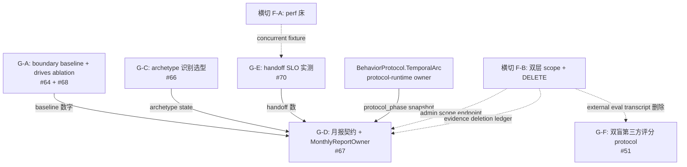

# Growth-Advisor 30 天试点前置 Packet

> 出处：商业化反思 26 条 debt 的 P2 组（[`docs/known-debts.md`](../known-debts.md) 顶部 `2026-05-13 update` 段）
> 覆盖：debt **#51 / #64 / #66 / #67 / #68 / #70**（#65 day-counter 已 deprecated，节奏走 `BehaviorProtocol.TemporalArc.progression_signals`）
> 姊妹 packet（不重复其内容，引用即可）：
> - [`cross-cutting-foundation-packet.md`](cross-cutting-foundation-packet.md) — 横切基础设施（#45 / #46 / #47 / #49 / #50 / #69 已覆盖）
> - [`companion-bench-public-launch-packet.md`](companion-bench-public-launch-packet.md) — P5 公开化（#48 / #52-#57）
> - [`figure-evidence-packet.md`](figure-evidence-packet.md) — P1 法律生死线（#58-#63）
> 状态：plan v0.2（2026-05-14 G-B/day-counter 下线；改为 protocol-phase-cohort），待 packet review
> Last updated: 2026-05-14
> 作用：本 packet 是 **P2 Private-Domain Growth-Advisor 30 天试点**（[`commercialization-assessment.md`](../business/commercialization-assessment.md) §4.2 概率 30-45% / §6.3 毛利 ~88% / 回本 2-3 月）的**前置 evidence 组**。所有产出服务"30 天试点 → 客户续签"这一单一商业目标

---

## 0. TL;DR（≤ 8 行）

- 本组 6 条 debt 拆 **5 个 sub-packet**：G-A（#64+#68 boundary baseline + drives ablation）/ G-C（#66 archetype 识别选型）/ G-D（#67 月报契约 + MonthlyReportOwner）/ G-E（#70 handoff SLO 实测，依赖横切 F-A）/ G-F（#51 双盲第三方评分 protocol）（**G-B/day-counter 已下线**：节奏走 `BehaviorProtocol.TemporalArc.progression_signals`，由 protocol-runtime 在 application owner 中消费）
- **archetype 识别选型决策**（G-C）：短期 **(a) LLMArchetypeClassifier**（每 N=3 turn 跑一次，不每 turn），长期 **(c) metacontroller β_t**（依赖 SYS-1，Phase B+）；(b) keyword 路径被 [`no-keyword-matching-hacks.mdc`](../../.cursor/rules/no-keyword-matching-hacks.mdc) 排除
- **强依赖**：G-E 必须等横切 F-A perf 床；G-D 复用横切 F-B `EvidenceDeletionPolicy`；G-F 评估员 transcript 删除走横切 F-B；G-C robustness sweep 复用 P5 packet #48 模板
- 推荐起跑顺序：**G-A → G-C → G-D → G-F → G-E**（G-E 顺位最后因等 F-A）
- 总资源：**8.5-12 人周工程**（5 sub-packet 各 1.5-2.5 周）+ **零 GPU 训练成本**（复用现有 substrate）+ **LLM API 月成本 ~$300-600**（含 G-C classifier 持续调用 + G-F 双盲评分）
- 30 天试点 evidence 完整度估算：当前 ~30% → 本 packet 完成后 **~85%**（G-A baseline + G-D 月报 + G-F 外部对照 = 客户尽调三件套齐全）

---

## 1. P2 试点的现实约束

### 1.1 P2 商业目标的可信度三件套

[`commercialization-assessment.md`](../business/commercialization-assessment.md) §6.3 给出 P2 是 **VZ 最健康的单位经济模型**（毛利 ~88% / 回本 2-3 月 / 单客 60 万/年）；§4.2 列了三条 kill criteria；§7.4 把 GTM 路径定为"行业 KOL 渗透 + 试点驱动"。这三段写得很乐观，但落到第一个 30 天试点客户面前，可信度只有三件事：

| 客户面前的"凭什么相信" | 对应 debt | 当前状态 |
|---|---|---|
| (a) **月度运营报告** "我老板能看懂" | #67 月报契约 | 仅有 closed-alpha `weekly-report` 最小 readout，月报 schema / owner 未定 |
| (b) **反销售边界触发数据** "AI 顾问真的拒推销了 X 次" | #64 baseline + #68 drive 真生效 | 4 个 `bp-no-*` 已编码但无 baseline 触发率分布；4 drives 已编码但无 ablation 证据 |
| (c) **关系连续性 evidence** "用户真的感觉被记住了" | #51 第三方评分 | 仅有系统自评（rupture/repair count + A3 LLM-judge + vitals），无 external validity 验证 |

§4.2 kill criteria 已经把 (b) 写成硬指标——"boundary 触发率 < 5% 或 > 50% → 重调架构"——但没有 baseline 就无法判定"过严 vs 正常"。这是 30 天试点最快的失败路径。

### 1.2 GTM 真正的卡点

§7.4 揭示 P2 真正难点**不在单位经济，而在销售线索来源**：私域运营总监不上 G2/Gartner 找供应商，靠 KOL 推荐 + 同行案例。意味着**第一个 30 天试点客户的月报截图就是下一个客户的销售素材**——月报字段稳定性 (#67) 不是工程洁癖，是 GTM 武器。

### 1.3 与既有 closed-alpha 的衔接

[`closed-alpha-api-service.md`](../closed-alpha-api-service.md) 已有：`UserIdentity.scope_key` 单层（横切 F-B 升双层）/ `DELETE /v1/users/me/memory` / `pause` / `weekly-report` 最小 readout / handoff 队列 [`packages/dlaas-platform-registry/src/dlaas_platform_registry/handoff.py`](../../packages/dlaas-platform-registry/src/dlaas_platform_registry/handoff.py)（**注意**：debt #70 推荐位置 `dlaas-platform-ops` 与现实不符，已在 [`cross-cutting-foundation-packet.md`](cross-cutting-foundation-packet.md) 附录 A.7 标注；本 packet G-E 按现实位置 `dlaas-platform-registry/handoff.py` 接入）。

[`packages/lifeform-domain-growth-advisor/src/lifeform_domain_growth_advisor/profiles/cheng_laoshi.py`](../../packages/lifeform-domain-growth-advisor/src/lifeform_domain_growth_advisor/profiles/cheng_laoshi.py) 已完整编码 5 archetype × 4 funnel × 4 boundary × 4 drive 的全部 typed payload，但有一块代码现状 **vs** debt 描述需要明确指出：

- **#66 archetype 识别**：profile.py 列了 5 类 mom 心态 seed（`archetype-anxious-rational-consumer` / `archetype-time-scarce-professional` / `archetype-empathy-before-product` / `archetype-high-trust-threshold` / `archetype-multi-axis-growth-concern`），但**没有任何运行时 classifier**——这是 debt #66 描述的"设计空白"在仓库的具体兑现

> **节奏分层（"用户处于第几阶段"）路径变更**：原 G-B/day-counter 方案（按 calendar 7 天硬切）已下线；改由 `BehaviorProtocol.TemporalArc.progression_signals`（PE-driven 关系阶段）承接。`fixture_uptake.py` 已经 import `TemporalArc/TemporalPhase`，protocol-runtime 是节奏 SSOT。月报"day-cohort 活跃度"字段相应改为 "protocol-phase-cohort"，从 protocol_phase snapshot aggregate（已在 vz-application owner 中可用）。

### 1.4 本 packet 的边界

本 packet **不做**：substrate 升级 / corpus 工艺改造 / 横切 schema（双层 scope / DELETE 矩阵 / fingerprint 全部走横切 packet）。**只做**：P2 试点客户尽调三件套（月报 + boundary 触发 + 关系连续性）+ 卡商业承诺的核心工程决策（archetype 识别选型）+ 试点 ops 接入前的 handoff SLO 实测。

---

## 2. Sub-packet 列表

每个 sub-packet 给：**路径 / 退出标准（SHADOW → ACTIVE）/ 子任务（≤ 5）/ 资源估算 / 依赖 / 风险 & fallback**。

### 2.1 G-A — boundary baseline + drives ablation（debt #64 + #68）

#### 路径

- **当前 boundary 实现**：[`packages/lifeform-domain-growth-advisor/src/lifeform_domain_growth_advisor/profiles/cheng_laoshi.py`](../../packages/lifeform-domain-growth-advisor/src/lifeform_domain_growth_advisor/profiles/cheng_laoshi.py) 第 417-545 行 4 个 `GrowthAdvisorBoundaryPrior`（`bp-no-hard-sell` / `bp-no-overclaim` / `bp-no-flooding` / `bp-no-judgmental`）
- **当前 drives 实现**：同文件第 1100-1200 行 4 个 `GrowthAdvisorDrivePrior`（`trust_building_drive` / `empathy_response_drive` / `restraint_against_pitch_drive` / `kb_share_drive`），通过 [`compiler.py`](../../packages/lifeform-domain-growth-advisor/src/lifeform_domain_growth_advisor/compiler.py) `build_growth_advisor_vitals_bootstrap` 编译到 `lifeform_core.DriveSpec`
- **缺位**（已 Grep 验证）：`data/growth_advisor_boundary_eval/cheng_laoshi/scenarios.jsonl` 不存在 / `scripts/growth_advisor_boundary_eval.py` 不存在 / `scripts/growth_advisor_drive_ablation.py` 不存在 / `docs/specs/growth-advisor-boundary-baseline.md` 不存在 / `docs/specs/growth-advisor-drive-ablation-evidence.md` 不存在
- **上游商业承诺**：§4.2 P2 kill criteria "boundary 触发率 < 5% 或 > 50% 重调架构" / §1.1 "反销售边界是合同条款不是 prompt"

#### 退出标准（SHADOW → ACTIVE）

| 阶段 | 条件 | 验证方式 |
|---|---|---|
| **SHADOW** | (a) ≥ 100 段 reviewer-标注合成对话片段 `scenarios.jsonl` 落地；(b) `boundary_eval.py` 与 `drive_ablation.py` 两脚本本地 dry-run 通过；(c) 4 boundary × 4 condition 矩阵 placeholder artifact 出 | `pytest tests/growth_advisor/test_boundary_baseline_smoke.py` 通过；脚本 `--dry-run` 5 分钟出 artifact 骨架 |
| **ACTIVE** | (a) `artifacts/growth_advisor_eval/boundary_baseline_<date>.json` 含 per-boundary 触发率分布（`mean / p25 / p75 / p95`）+ precision/recall vs reviewer GT；(b) `artifacts/growth_advisor_eval/drive_ablation_<date>.json` 含 4 condition（full / no-restraint / no-empathy / no-trust）× 同 N 段 fixture × per-condition boundary 触发率 + regime 分布对比；(c) `docs/specs/growth-advisor-boundary-baseline.md` 与 `docs/specs/growth-advisor-drive-ablation-evidence.md` 落档 | 4 boundary 在合成 set 上的触发率 ∈ [5%, 50%]；ablation 显示 `no-restraint` 条件下 `bp-no-hard-sell` 触发率显著下降（≥ 30% 相对降幅） |

#### 子任务（5 项）

1. **Reviewer-curated scenarios 集合落地**：建 `data/growth_advisor_boundary_eval/cheng_laoshi/scenarios.jsonl`，≥ 100 段合成对话片段，每段 reviewer 标注 `{should_trigger: [bp-no-hard-sell, ...], should_not_trigger: [...]}`；按 5 archetype × 4 boundary × 5 段/cell 分层抽样保证 coverage；scenarios 来源：从 `cheng_laoshi.signature_cases` 派生 + 反销售 / 反夸张 / 反洪水 / 反评判 4 类挑衅场景（reviewer 手写 50 段 + LLM augment 50 段双盲标注）
2. **`scripts/growth_advisor_boundary_eval.py`**：跑 fixture × 4 boundary × N seeds → 输出 per-boundary 触发率 + precision/recall vs reviewer GT；artifact schema 统一 `{date, profile_id, n_scenarios, per_boundary: {trigger_rate, precision, recall, f1}, kill_criteria_band: [0.05, 0.5]}`
3. **`scripts/growth_advisor_drive_ablation.py`**：4 condition（full / no-restraint / no-empathy / no-trust）通过 `dataclasses.replace(profile, drive_priors=(...))` 派生 4 个变体 profile × 同 fixture × N seeds × 对比；输出 `{condition: {boundary_trigger_rates, regime_distribution, response_style_proxy}}` + 4-condition 对比表
4. **Companion-bench 联动**：在 [`packages/companion-bench/`](../../packages/companion-bench/) 加 `growth-advisor` 专属 family 6 scenario（A6 boundary 子轴），让 boundary 行为也进 P5 公开榜单；与 P5 packet [`companion-bench-public-launch-packet.md`](companion-bench-public-launch-packet.md) 顺位 1（#48 robustness sweep）的 reference SUT 池协调
5. **Spec 落档**：
   - `docs/specs/growth-advisor-boundary-baseline.md`：4 boundary 在 N=100 reviewer-curated set 上的触发率 baseline 表 + kill criteria band + per-archetype 偏移
   - `docs/specs/growth-advisor-drive-ablation-evidence.md`：4 condition × 4 boundary 触发率对比 + 因果链解读（`restraint_against_pitch_drive` PE 降低 → boundary 触发概率下降的可观察曲线）+ 给客户尽调材料的 1-page 摘要
   - 30 天试点 SLA 模板段：`per-boundary 触发率 ∈ [baseline_mean × 0.5, baseline_mean × 1.5]`

#### 资源估算

- **工程**：2-3 人周（reviewer 标注 1 周 + 两脚本 1 周 + spec 0.5 周 + companion-bench family 接入 0.5 周）
- **Reviewer 时间**：8-12 reviewer 小时（100 段 × 5 分钟 + 二审）
- **LLM API**：~$50（augment 50 段 + 4 condition × 100 scenarios × LLM judge 一次 ≈ 5M tokens）
- **GPU**：零（纯合成路径走 synthetic substrate）

#### 依赖

- 无强阻塞；reviewer 招募与商业 lead 协同
- **同组联动**：G-D 月报字段 "per-boundary 触发次数" 需要 G-A baseline 数字作为"健康范围"标注

#### 风险 & fallback

| 风险 | 评估 | fallback |
|---|---|---|
| 100 段合成 scenarios 反 archetype 与真客户对话分布偏移 | 中 | SLA 写"baseline 在合成 set 上得到，30 天试点首周用客户真实数据 recalibrate" |
| `no-restraint` ablation 下 boundary 触发率没有显著下降（drive 实际未生效） | 中-高 | 砍掉"drive 真生效"卖点；改口径为"反销售边界是 BoundaryPriorHint typed 规则，drive 是辅助 PE 信号" |
| reviewer 间一致性 κ < 0.6 | 中 | 双 reviewer + 三审仲裁；最终 scenarios 集合只保留 κ ≥ 0.6 的子集 |

---

### ~~2.2 G-B — day-counter 路由 spec + contract test（debt #65）~~ — DEPRECATED 2026-05-14

> **下线（不再追踪）**：节奏分层（"用户处于第几阶段"）由 `BehaviorProtocol.TemporalArc.progression_signals`（PE-driven 关系阶段）承接，不需要独立 day-counter owner。
> 配套清理：
> - `docs/specs/growth-advisor-day-counter.md` 已删
> - `tests/contracts/test_growth_advisor_day_routing.py` 已删
> - `cheng_laoshi.py` 中 `growth_advisor:dayN` 字符串残留已清理（保留 `funnel:*` / `regime:*` tags）
> - debt #65 strikethrough，备注同上
>
> 后续若需"用户处于关系阶段 X"信号，走 `TemporalArc.progression_signals`，由 protocol-runtime 模块在 application owner 中消费。月报"day-cohort"字段（原 G-D 子任务依赖）改为 "protocol-phase-cohort"，从 protocol_phase snapshot aggregate；具体 phase 命名见 cheng_laoshi 的 BehaviorProtocol.temporal_arc 定义。

---

### 2.3 G-C — archetype 识别选型 + LLMArchetypeClassifier（debt #66）

#### 路径

- **当前实现**（已验证）：[`cheng_laoshi.py`](../../packages/lifeform-domain-growth-advisor/src/lifeform_domain_growth_advisor/profiles/cheng_laoshi.py) 第 177-270 行 5 个 archetype seed（`archetype-anxious-rational-consumer` / `archetype-time-scarce-professional` / `archetype-empathy-before-product` / `archetype-high-trust-threshold` / `archetype-multi-axis-growth-concern`），**仅作为 knowledge seed 编码**，没有任何运行时分类器
- **缺位**：`ArchetypeClassifier` Protocol 不存在 / `LLMArchetypeClassifier` 不存在 / `docs/specs/growth-advisor-archetype-detection.md` 不存在 / `tests/contracts/test_no_keyword_archetype_detection.py` 不存在
- **上游商业承诺**：§4.2 P2 "5 archetype × 7 day × 4 funnel × 4 boundary 是 cheng_laoshi 的核心结构"——但当前 5 archetype 是定义而非路由信号
- **铁律约束**：[`no-keyword-matching-hacks.mdc`](../../.cursor/rules/no-keyword-matching-hacks.mdc) 排除 (b) keyword 路径；[`llm-prompt-centralization.mdc`](../../.cursor/rules/llm-prompt-centralization.mdc) 要求 prompt 集中管理

#### 退出标准（SHADOW → ACTIVE）

| 阶段 | 条件 | 验证方式 |
|---|---|---|
| **SHADOW** | (a) `docs/specs/growth-advisor-archetype-detection.md` 落档三路径决策（详见 §3）；(b) `ArchetypeClassifier` Protocol + `LLMArchetypeClassifier` 实现在 [`packages/lifeform-domain-growth-advisor/`](../../packages/lifeform-domain-growth-advisor/) 落地（不在 vz-application，保持垂直边界）；(c) classifier prompt 模板集中在 [`packages/lifeform-expression/`](../../packages/lifeform-expression/) prompts 目录；(d) `tests/contracts/test_no_keyword_archetype_detection.py` AST 守门通过 | classifier 在 ≥ 50 reviewed transcript 上 archetype-recall ≥ 0.7；AST 扫描禁止 archetype 识别代码出现 `in user_text` / `re.search(...)` 等字符串匹配 pattern |
| **ACTIVE** | (a) classifier 接入运行时每 N=3 turn 跑一次更新 archetype state 而非每 turn；(b) archetype state 发布到模块快照（R8：classifier 是 owner，下游消费快照）；(c) robustness sweep（reference SUT × 5 archetype × 24 scenario × 1 seed）跨 LLM family 方差 ≤ 30%；(d) §6.3 单位经济表回填 archetype classifier 月成本 | 真接入后 30 天试点 ops dashboard 显示 5 archetype 分布稳定（不出现单一 archetype > 80% 比例的退化） |

#### 子任务（5 项）

1. **`docs/specs/growth-advisor-archetype-detection.md`**：详细写三路径决策（见 §3 本 packet 后续详解），含调用频率 / 缓存策略 / 成本模型 / 长期过渡路径
2. **`ArchetypeClassifier` Protocol + `LLMArchetypeClassifier`**：在 [`packages/lifeform-domain-growth-advisor/src/lifeform_domain_growth_advisor/`](../../packages/lifeform-domain-growth-advisor/) 新加 `archetype_classifier.py`：
   - Protocol：`classify(transcript: tuple[Turn, ...], current_archetype: ArchetypeId | None) -> ArchetypeClassification`
   - Impl：`LLMArchetypeClassifier(llm_provider, prompt_template_id)`，调用频率由调用方控制（每 N turn 一次）
   - 返回 typed `ArchetypeClassification(archetype_id: ArchetypeId, confidence: float, evidence_snippets: tuple[str, ...])`
   - 严守 R8：classifier 是 archetype 状态的**唯一 owner**，发布 `ArchetypeStateSnapshot` 到模块快照；boundary / playbook routing 等下游消费者只**读快照**
3. **Prompt 集中**：classifier prompt 模板落 [`packages/lifeform-expression/`](../../packages/lifeform-expression/) `prompts/growth_advisor_archetype_classify.txt` + schema `schemas/archetype_classification.json`；遵守 [`llm-prompt-centralization.mdc`](../../.cursor/rules/llm-prompt-centralization.mdc) "禁止内联大段 prompt"；prompt 输入：N=3 recent turns + 5 archetype 定义；输出 JSON schema：`{archetype_id, confidence, evidence_snippets, reasoning_summary}`
4. **`tests/contracts/test_no_keyword_archetype_detection.py`** AST 守门：扫描 `archetype_classifier.py` 与下游消费者，禁止 `in user_text` / `re.search` / `keywords_dict[...]` 三类 pattern；与 [`tests/contracts/`](../../tests/contracts/) 既有风格一致
5. **Robustness sweep（复用 P5 #48 协议）**：直接 reference [`companion-bench-public-launch-packet.md`](companion-bench-public-launch-packet.md) §2.1 sweep 模板——固定 5 reference SUT × 5 archetype × 24 scenario × 1 seed × N=3 LLM family（GPT-5 / Claude Opus 4.7 / Qwen-Max）；输出 per-archetype × per-family variance σ；ACTIVE 准入条件：跨 family 方差 ≤ 30%；sweep 结果直接进 G-C spec 附录

#### 资源估算

- **工程**：2.5 人周（spec 0.5 + Protocol/Impl 1 + prompt 集中 0.3 + AST 守门 0.2 + sweep 0.5）
- **LLM API**：
  - 一次性 robustness sweep（5 SUT × 5 archetype × 24 scenario × 3 family × 1 seed ≈ 1800 calls × 3K tokens/call ≈ 5.4M tokens）≈ **~$80**（GPT-5 / Qwen-Max blended）
  - 持续调用：30 天试点 10 席位 × 50 end_user × 5 turn/end_user/day × 30 day / 3（每 N=3 turn 一次）≈ 25K classifier calls/月 × 3K tokens/call ≈ 75M tokens/月 ≈ **~$300/月 / 客户**（用 DeepSeek 等廉价 family 可压到 ~$80）
- **GPU**：零

#### 依赖

- 无强阻塞；prompt 集中需要 [`lifeform-expression/`](../../packages/lifeform-expression/) prompts 目录现状梳理（当前 expression wheel 已部分集中，详见现状）
- **同组联动**：G-D 月报 "archetype 分布" 字段读 classifier 发布的快照；G-A boundary baseline 跑 fixture 时按 archetype 分层

#### 风险 & fallback

| 风险 | 评估 | fallback |
|---|---|---|
| 跨 LLM family 方差 > 30% | 中 | 单 family 锁定（如 DeepSeek V4），sweep 结果作为"已知 family bias"在月报中 disclose；30 天试点 ACTIVE 准入放宽到 σ ≤ 40% |
| 每 N=3 turn classifier 调用成本超 §6.3 表估算 | 中 | 升 N=5 turn（不每 turn）；同时引入 archetype 缓存（仅当 confidence 跨 0.7 阈值或新增 3 turn 后更新） |
| 单一 archetype 占比 > 80%（classifier 退化为"一刀切"） | 中-高 | 触发 archetype 整体重设计（去掉 / 合并 archetype）；这是 §8 kill criteria |
| LLM 返回非 JSON schema | 低-中 | strict json mode + retry once，二次失败 fall back 到 `current_archetype`（不更新）；fail-loud 写 audit |

---

### 2.4 G-D — 月报契约 + MonthlyReportOwner（debt #67）

#### 路径

- **当前实现**：[`closed-alpha-api-service.md`](../closed-alpha-api-service.md) `GET /v1/admin/weekly-report` 是最小 readout（`active_user_count` / `session_count` / `serious_safety_issue_count` 等），其余 metric 全为 `null`
- **缺位**：月报 schema / `MonthlyReportOwner` 模块 / aggregation 公式 / `docs/specs/growth-advisor-monthly-report.md`
- **上游商业承诺**：§4.2 "月度可审计运营报告——audience 分析 + dialogue_external_outcome typed enum 自动化产出" / §7.4 第 4 条 "月报营销化——升级成给品牌总监看的月度运营报告"

#### 退出标准（SHADOW → ACTIVE）

| 阶段 | 条件 | 验证方式 |
|---|---|---|
| **SHADOW** | (a) `docs/specs/growth-advisor-monthly-report.md` v0.1 落档明确 schema + per-field owner + aggregation 公式；(b) `MonthlyReportOwner` 模块骨架在 [`packages/lifeform-service/`](../../packages/lifeform-service/) 落地（不新开 wheel，避免破坏 R8）；(c) `GET /v1/tenants/{tid}/admin/monthly-report?month=YYYY-MM` 端点骨架（mock 数据） | contract test 7 case 覆盖 schema 字段稳定性 + version 升级兼容性 + 跨 month 可比性 |
| **ACTIVE** | (a) 月报真从下游 owner snapshot aggregate（rupture/repair from `vz-cognition.rupture_state` / boundary 触发 from G-A baseline 路径 / archetype 分布 from G-C classifier snapshot / handoff from `dlaas-platform-registry/handoff.py` / protocol-phase-cohort from `BehaviorProtocol.TemporalArc.progression_signals` snapshot）；(b) 月报 PDF / HTML 渲染走 lifeform-expression（R4 表达层）；(c) DELETE 路径打通（end-user 删除后该 end-user 数据从月报中剔除，月报有"delete 事件计数"字段而不是泄露内容） | 端到端：10 mock end_user × 5 turn × 30 day 跑 fixture → 月报 PDF 输出含 §4 全部字段 + 数字合理 |

#### 子任务（5 项）

1. **`docs/specs/growth-advisor-monthly-report.md`**：见 §4 本 packet 月报模板示例
2. **`MonthlyReportOwner` 模块**：在 [`packages/lifeform-service/`](../../packages/lifeform-service/) 加 `monthly_report_owner.py`：
   - 是 R8 月报的**唯一 owner**，从下游 owner snapshot aggregate
   - 严守 SSOT：rupture 数从 `rupture_state` owner snapshot 读 / archetype 分布从 G-C `ArchetypeStateSnapshot` 读 / handoff 数从 `HandoffTicketStore.list_for_tenant` 读 / boundary 触发从 G-A eval pipeline 读（试点期）或运行时 `BoundaryEnforcerSnapshot` 读（成熟期）
   - 输出 typed `MonthlyReport` dataclass（frozen），发布到月报专属 slot；schema 版本化 `report_schema_version="v0.1"`
3. **`GET /v1/tenants/{tid}/admin/monthly-report` 端点**：走横切 F-B 双层 scope + `X-Control-Plane-Secret`；返回 typed JSON + 可选 `?format=pdf` 走 lifeform-expression 渲染
4. **`tests/contracts/test_monthly_report_schema_stability.py`**：
   - case 1：schema 字段添加（向后兼容）/ 删除（向前不兼容）/ 重命名（破坏性）三类变更显式打 version
   - case 2：`report_schema_version` 字段必须出现在所有月报顶层
   - case 3：DELETE end-user 后下次月报中该 end-user 不出现且 "deleted_end_user_count" 字段 +1
   - case 4：跨 month 字段稳定性（连续 3 个月报 schema 应一致）
5. **DELETE 路径联动横切 F-B**：reference [`cross-cutting-foundation-packet.md`](cross-cutting-foundation-packet.md) F-B `DELETE /v1/tenants/{tid}/users/{uid}/memory` 与 `evidence_deletion_ledger.jsonl`；月报 aggregator **不读 evidence_root_dir 删除前的 session evidence**，仅从 ledger 读 "X 个 deletion 事件 / Y 个 end_user 被删"，不泄露已删除 end_user 的 archetype / boundary 触发等内容

#### 资源估算

- **工程**：2-2.5 人周（spec 0.5 + Owner 模块 1 + 端点 0.5 + contract test 0.5）
- **LLM API**：可选 PDF 渲染时 ~$5/月报（一次 LLM call 生成 narrative summary）
- **GPU**：零

#### 依赖

- **强依赖横切 F-B**：admin scope endpoint + DELETE evidence ledger
- **软依赖 G-A / G-C**：月报字段需要 boundary baseline / archetype classifier 两方数据源；G-D ACTIVE 必须在 G-A SHADOW + G-C SHADOW 之后；protocol-phase-cohort 字段读 `BehaviorProtocol.TemporalArc.progression_signals` snapshot（已在 vz-application owner 中可用）

#### 风险 & fallback

| 风险 | 评估 | fallback |
|---|---|---|
| 试点客户拿到月报反馈"看不懂这些数据"（§4.2 kill criteria 第三条） | 中-高 | 月报顶部加 narrative summary（LLM 渲染）+ 每个字段加 "为什么这个数字重要" inline help；先 fix 报表（不是先 fix 系统） |
| 多 owner snapshot aggregate 时性能不达 SLA（§5 P2 SLO `月报生成 < 30s`） | 中 | 月报走 background-slow 异步任务，预生成；ops dashboard 拉的是最近一次预生成结果 |
| schema 升级 v0.1 → v1.0 时跨月可比性破坏 | 中 | 历史月报永远只读其当时 schema version；可比性接 schema migration（仅添加字段，不删字段） |

---

### 2.5 G-E — handoff queue SLO 实测（debt #70）

#### 路径

- **当前实现**：[`packages/dlaas-platform-registry/src/dlaas_platform_registry/handoff.py`](../../packages/dlaas-platform-registry/src/dlaas_platform_registry/handoff.py) `HandoffTicketStore`（`create` / `get` / `list_for_ai` / `submit_human_reply`）—— SQLite 后端，**单进程 demo 级别**
- **缺位**：`tests/perf/test_handoff_queue_concurrent_load.py` 不存在 / `docs/specs/handoff-queue-slo.md` 不存在 / 队列容量上限 / 超时 fallback 行为未规约 / 持久化与跨重启恢复未验证
- **debt 描述 vs 现状**：debt #70 推荐位置 `packages/dlaas-platform-ops/` 与现实 `packages/dlaas-platform-registry/handoff.py` 不符；横切 packet 附录 A.7 已标注；本 packet 按现实位置接，**不迁移文件**
- **上游商业承诺**：§4.2 P2 "合规：用户可删 / 处置可查 / 转人工可控" / §2.1 Tier-1 handoff queue

#### 退出标准（SHADOW → ACTIVE）

| 阶段 | 条件 | 验证方式 |
|---|---|---|
| **SHADOW** | (a) `docs/specs/handoff-queue-slo.md` v0.1 落档明确容量上限 / 超时阈值 / fallback 行为；(b) `tests/perf/test_handoff_queue_concurrent_load.py` 骨架（synthetic load） | smoke：N=10 concurrent `create` × 不丢 ticket × 不死锁 |
| **ACTIVE** | (a) 真实并发 baseline：试点单客户假设 = 10 席位 × 50 end_user × handoff 触发率 1%/turn × 10 turn/end_user/day ≈ 50 handoff/day，在横切 F-A perf 床上跑 N=50 / N=100 concurrent burst；(b) 队列状态跨重启恢复验证（kill -9 → restart → 已 fsync ticket 完整）；(c) ops dashboard 加 handoff 队列 live view + alert（队列长度超阈值 / 超时未接手） | artifact `artifacts/perf/handoff-<date>.json` 含 P50/P95 create_ms + 队列长度时序 + fallback 行为统计；30 min 持续负载下 ticket 0 丢失 |

#### 子任务（4 项）

1. **`docs/specs/handoff-queue-slo.md`**：
   - §1 容量上限：单 tenant 队列长度上限 100 ticket（30 天试点典型规模）；全局上限 1000 ticket
   - §2 超时阈值：ticket `created_at_ms` 至 `submit_human_reply` ≤ 30 min（试点 SLA），超时后自动 escalate 到 ops dashboard alert
   - §3 fallback 行为：超时未接手 → STRICT_REFUSE（向 end_user 返回 typed "handoff_timeout_refusal" envelope），**不降级回普通 LLM 回答**（避免在客服真未接管时假装 AI 还在服务）
   - §4 持久化：所有 ticket 落 SQLite + WAL；service 重启后从 DB 重建 in-memory index；遵守 [`no-swallow-errors-no-hasattr-abuse.mdc`](../../.cursor/rules/no-swallow-errors-no-hasattr-abuse.mdc) — DB write 失败必须 raise，不能 swallow
   - §5 tenant 隔离：handoff 队列按 tenant 隔离（与横切 F-B 双层 scope 联动）；`list_for_tenant(tid)` 是默认调用方式
2. **`tests/perf/test_handoff_queue_concurrent_load.py`**（依赖横切 F-A 的 `concurrent_lifeform_factory` fixture + `tests/perf/` 目录）：
   - case A — N=50 asyncio task 同时 `create` × 验证不丢 ticket（DB count == 50）+ 不串 tenant
   - case B — 持续负载 30 min × 50 ticket/min × 验证 P95 create_ms < 100ms + 队列长度稳定
   - case C — N=10 client 同时 `create` + `submit_human_reply` mix × 验证不死锁（30s wait_for 守门）
   - case D — kill -9 ops process → restart → DB count 与 kill 前 fsync 一致
3. **ops dashboard `handoff` 端点**：在 [`packages/lifeform-service/`](../../packages/lifeform-service/) 加 `GET /v1/tenants/{tid}/admin/handoff-queue`（admin scope）返回 `{open_count, expired_count, oldest_age_ms, recent_tickets}`；与横切 F-B admin endpoint 接入
4. **handoff queue 真接到 G-D 月报**：月报字段 "handoff 触发次数 / 平均处理时长 / 超时未接手次数" 从 `HandoffTicketStore.list_for_tenant` 聚合（SSOT：handoff 队列是唯一 owner，月报不重建该状态）

#### 资源估算

- **工程**：1.5-2 人周（spec 0.5 + 4 case perf test 0.5 + dashboard 端点 0.3 + 月报联动 0.2）
- **GPU / API**：零

#### 依赖

- **强依赖横切 F-A**：必须在 F-A `tests/perf/` 目录 + `concurrent_lifeform_factory` fixture ACTIVE 后才能跑 handoff 套件；本 packet 起跑顺序最末
- **强依赖横切 F-B**：admin scope endpoint + tenant 隔离的 `list_for_tenant`

#### 风险 & fallback

| 风险 | 评估 | fallback |
|---|---|---|
| SQLite WAL 在 N=100 concurrent 时锁竞争严重 | 中 | 单 tenant 内串行化（队列长度上限保证不会超 100） + DELETE during active write race test 单独跑（与横切 F-B 风险表对齐） |
| 30 min 超时阈值在某试点客户场景过短（ops 团队人手紧时） | 中 | 阈值参数化（`handoff_timeout_sec` 在 `AlphaServiceConfig` 加 CLI 参数）；STRICT_REFUSE 仍是默认 fallback |
| kill -9 restart 后未 fsync 的 ticket 丢失 | 中 | spec §4 明确 "fsync after each create"；perf case D 验证 |

---

### 2.6 G-F — 双盲第三方评分 protocol（debt #51）

#### 路径

- **当前 readout**：rupture/repair count（系统自评）+ companion-bench A3 callback recall LLM judge（系统自评）+ il_rapport / bond_warmth vitals readout（系统自评）
- **缺位**：没有任何"系统自评 vs 用户真实感受"对照实验数据 / 没有第三方评估员 protocol / 没有 `docs/specs/relationship-continuity-external-validation.md`
- **上游商业承诺**：§1.1 "关系连续性"是 VZ 三件包之一；§3.3 差异化定位
- **关键约束**：reference [`figure-evidence-packet.md`](figure-evidence-packet.md) `human-eval` 工艺 + [`companion-bench-public-launch-packet.md`](companion-bench-public-launch-packet.md) reference SUT 池设计 + [`cross-cutting-foundation-packet.md`](cross-cutting-foundation-packet.md) F-B 评估员 transcript 个人信息删除路径

#### 退出标准（SHADOW → ACTIVE）

| 阶段 | 条件 | 验证方式 |
|---|---|---|
| **SHADOW** | (a) `docs/specs/relationship-continuity-external-validation.md` v0.1 落档协议（评估员招募 / 双盲打散 / 评分 axis / κ 阈值）；(b) 招募 N=20 评估员候选名单；(c) pilot 5 段 30-turn 对话片段（VZ × 1 baseline LLM × 1 真人客服）3 路输出预录制 | reviewer 内部演练 5 段 × 3 路 × A3 类指标盲打 × inter-rater κ ≥ 0.4 |
| **ACTIVE** | (a) 完整 N=20 评估员 × N=30 对话片段 × A3 类指标盲打 ≥ 600 评分点；(b) 系统自评 vs 评估员评分对照表 落档；(c) companion-bench A3 加 human-eval 交叉验证轨道；(d) 评估员个人信息删除路径打通 | A3 系统自评 vs 评估员中位评分 Spearman ≥ 0.6（或 disclose 不达预期 + 失败案例 walk-through） |

#### 子任务（5 项）

1. **`docs/specs/relationship-continuity-external-validation.md`**：协议详细化
   - **评估员招募**：N=20 评估员（10 母婴行业从业者 + 10 一般成年用户），与试点客户业务无利益冲突；每人 50-200 元/小时报酬
   - **双盲打散**：每段 30-turn 对话片段 3 路（VZ 输出 / baseline LLM 单 prompt / 真人客服 transcript），顺序随机化；评估员不知道哪一路是 VZ
   - **评分 axis**：A3 子轴 5 个 sub-question（"是否记住了上文 / 是否真的回应了我说的话 / 是否前后一致 / 是否让我觉得在意我 / 是否让我感到被理解"），每个 0-5 分 Likert
   - **κ 阈值**：N=20 评估员的 Cohen's κ ≥ 0.4（一致性"中等"以上）；< 0.4 时 protocol 失败
   - **抽样保护**：评估员转录数据中端用户身份信息（姓名 / 地址 / 手机号 / 孩子信息）必须脱敏；评估完成后 transcript 走横切 F-B 删除路径
2. **30 段对话片段制作**：从 30 天试点头两周真实数据中抽 30 段 30-turn 片段（按 5 archetype × 2 day-cohort × 3 段/cell 分层抽样）；2 路对照（baseline LLM 单 prompt = 同一 substrate 但不挂 cheng_laoshi profile / 真人客服 = 从该客户既有客服话术抽取）
3. **评估 pipeline**：搭一个最小评估 web 表单（不引入新 wheel，可用现有 `lifeform-service` 加 `/v1/admin/external-eval/...` 端点 admin scope，或离线 Google Form 工具简化）；输出 typed `ExternalEvalRecord(evaluator_id, snippet_id, sub_axis_scores, comments)`
4. **系统自评 vs 评估员对照表**：脚本 `scripts/relationship_continuity_external_validation.py` 跑出 per-snippet × per-sub-axis (system_self_eval, evaluator_median) 对照矩阵 + Spearman/κ；输出 `artifacts/relationship_continuity_external_validation_<date>.json`；落 `docs/external/relationship-continuity-external-validation-v0.md` 公开报告
5. **companion-bench A3 联动**：在 [`packages/companion-bench/`](../../packages/companion-bench/) `judge_arc.py` A3 子轴注释加 disclaimer "system-self-eval; cross-validated against external panel at v0.X, Spearman=Y"；P2 月报每个"关系连续性"指标旁标注 `system_self_eval` vs `external_validated` 区分；交叉引用 [`figure-evidence-packet.md`](figure-evidence-packet.md) human-eval 工艺
6. **删除路径**：评估员个人信息 + transcript 走横切 F-B `DELETE /v1/admin/external-eval/...` admin scope；评估结束后 N+30 天自动清除 raw transcript，保留 anonymized scores

#### 资源估算

- **工程**：2 人周（spec 0.5 + 评估 pipeline 0.5 + 对照脚本 0.5 + 联动 0.5）
- **Reviewer / 评估员**：20 人 × 5 小时 × 100 元/小时 ≈ **1 万元**
- **LLM API**：~$50（baseline LLM 输出 + 系统自评 LLM judge）
- **GPU**：零

#### 依赖

- **强依赖横切 F-B**：评估员 transcript 删除路径
- **软依赖**：第一个 P2 试点客户上线后 2 周才有真实片段可抽（按 30 天试点节奏）

#### 风险 & fallback

| 风险 | 评估 | fallback |
|---|---|---|
| 评估员一致性 κ < 0.4 | 中 | protocol 失败 → 重新设计 sub-axis（评分项太抽象） + N=20 → N=30；公开 disclose；§8 列为 kill criteria 之一 |
| 第一个试点客户拒绝 transcript 抽样 | 中-高 | fallback 到 synthetic 30 段对话片段（reviewer 设计 mom-style 场景）+ disclose "external validation on synthetic transcripts, real-world cross-validation pending" |
| Spearman < 0.6（系统自评与评估员评分弱相关） | 中 | 不算 protocol 失败但需 disclose；月报中 A3 类指标加"external Spearman: 0.X" 透明度标注 |

---

## 3. archetype 识别选型决策（#66 详解）

本 packet 最大单点决策：5 archetype 识别机制选型。详细方案落 `docs/specs/growth-advisor-archetype-detection.md`，此处给压缩版决策表 + 长期过渡。

### 3.1 三路径对比

| 路径 | 描述 | 优势 | 劣势 | 与 R 铁律的关系 |
|---|---|---|---|---|
| **(a) LLMArchetypeClassifier** | 每 N=3 turn 调一次 LLM 输出 typed `ArchetypeClassification` | 短期可用 / 与 cheng_laoshi profile typed payload 对齐 / robustness sweep 可量化 | LLM 调用成本（持续）+ 跨 family bias（与 #48 同坑） | 不违反；LLM 是表达层兼语义判断层（不参与 RL / credit）|
| **(b) keyword / heuristic mapping** | "焦虑" / "标准" 等 user_text 子串映射 5 archetype | 零成本 / 零 latency | **违反 [`no-keyword-matching-hacks.mdc`](../../.cursor/rules/no-keyword-matching-hacks.mdc)** / 跨语言失效 / 维护脆弱 | 直接违反铁律，**排除** |
| **(c) metacontroller β_t emerge** | archetype 作为 metacontroller 切换单元 β_t 的具体应用域 | 符合 R3/R4 / 长期最优 / archetype 涌现而非硬编码 | 短期不可用（依赖 [`known-debts.md` #44](../known-debts.md) SYS-1 CPD β_t 切换上线，Phase B+） | 不违反；最契合 EmoGPT 设计哲学 |

### 3.2 推荐：短期 (a)，长期 (c)，永久排除 (b)

**短期方案 (a)**：

| 决策维度 | 值 | 理由 |
|---|---|---|
| 调用频率 | 每 N=3 turn 一次（不每 turn） | 平衡 latency + 成本 + archetype 稳定性 |
| 触发更新条件 | (i) 新增 ≥ 3 turn 且当前 archetype confidence < 0.7；(ii) 显式 reset（如新 session） | 避免 archetype 抖动 |
| LLM 选择 | 主用 DeepSeek V4（廉价）；试点首周用 Claude Opus 4.7 校准 | 成本与质量分阶段 |
| Owner 边界 | classifier 是 `ArchetypeStateSnapshot` 唯一 owner；boundary / playbook routing 等下游只读快照 | R8 SSOT |
| Prompt 集中 | `lifeform-expression/prompts/growth_advisor_archetype_classify.txt` | [`llm-prompt-centralization.mdc`](../../.cursor/rules/llm-prompt-centralization.mdc) |
| 缓存策略 | per-session archetype state；TTL = session lifetime；新 session reset | 不跨 session 持久（避免 archetype 早期判错被锁定） |

### 3.3 单位经济影响（回填 §6.3 表）

按 30 天试点单客户 = 10 席位 × 50 end_user × 5 turn/end_user/day × 30 day = 75,000 turn/月，每 N=3 turn 一次 classifier ≈ **25,000 calls/月/客户**。

| LLM family | 单 call 估算（3K input + 500 output） | 月成本/客户 | 占 §6.3 表 1000 元 COGS 比例 |
|---|---|---|---|
| GPT-5（$5/$15 per 1M） | $0.022 | **$550** ≈ ¥3,800 | 380% — 超 COGS 假设近 4 倍 |
| Claude Opus 4.7（$15/$75） | $0.083 | **$2,075** ≈ ¥14,500 | 不可接受 |
| DeepSeek V4（$0.27/$1.10） | $0.0014 | **$35** ≈ ¥245 | 25% — 可接受 |
| Qwen-Max（$0.40/$1.20） | $0.0018 | **$45** ≈ ¥315 | 32% — 可接受 |

**结论**：classifier 默认走 DeepSeek V4 或 Qwen-Max，**月成本控制在 ¥250-500/客户**，与 §6.3 表 1000 元/月 COGS 兼容；Claude Opus 4.7 仅用于一次性 calibration（试点首周）。

### 3.4 长期过渡到 (c) 的路径

[`known-debts.md`](../known-debts.md) #44 SYS-1（CPD β_t 切换上线）真起效后，archetype 不再由 LLM classifier 显式输出，而是作为 β_t emerge 的**具体应用域**——metacontroller 通过 PE / 残差观察学到的切换单元自然映射到 5 archetype 的某种潜在分布。具体过渡：

1. SHADOW：metacontroller β_t 与 LLMArchetypeClassifier 双轨并行；记录两者一致度
2. Calibration：β_t 切换边界与 archetype 边界的"翻译表"由 reviewer 检视
3. ACTIVE：LLMArchetypeClassifier 降级为 audit / 兜底；β_t 作为运行时 archetype 信号
4. Sunset：LLMArchetypeClassifier 可关闭，月成本降至 0

这条路径写进 G-C spec §长期演化，但**本 packet 只交付 (a) 路径**，(c) 路径作为 Phase B+ 路线图占位。

---

## 4. 月报模板示例（#67 详解）

`docs/specs/growth-advisor-monthly-report.md` 草稿核心段落如下；本节给字段表 + mock 数字 + owner 归属决策 + 版本化策略。

### 4.1 月报字段表（mock 数字基于 10 席位 × 50 end_user × 30 day）

| 字段 | 类型 | mock 值 | aggregation 来源 owner | 给客户的解读 |
|---|---|---|---|---|
| `report_schema_version` | str | `"v0.1"` | MonthlyReportOwner | schema 版本号 |
| `tenant_id` | str | `"mubi-pilot-001"` | 横切 F-B `TenantIdentity` | 客户 ID |
| `period_start_ms` / `period_end_ms` | int | `1736899200000` / `1739491200000` | MonthlyReportOwner | 报告周期 |
| `active_end_user_count` | int | **387** | `lifeform-service` SessionManager | 本月活跃端用户 |
| `total_turn_count` | int | **74,213** | `vz-runtime.AgentSessionRunner` | 总对话轮数 |
| `rupture_count` / `repair_count` / `repair_rate` | int / int / float | **126 / 89 / 0.706** | `vz-cognition.rupture_state` | 关系断裂触发数 / 修复完成数 / 修复率（关系健康度 KPI） |
| `boundary_trigger_per_policy` | dict | `{"bp-no-hard-sell": 412, "bp-no-overclaim": 78, "bp-no-flooding": 23, "bp-no-judgmental": 9}` | G-A `BoundaryEnforcerSnapshot` | 4 个反销售边界本月触发次数（**合规增长**：bp-no-hard-sell 412 次 = AI 拒推销 412 次）|
| `boundary_trigger_rate_band` | dict | `{"bp-no-hard-sell": 0.155 (in [0.05, 0.5])}` | G-A baseline reference | 触发率落在 §4.2 kill criteria 健康带内 |
| `archetype_distribution` | dict | `{"anxious-rational": 0.34, "time-scarce": 0.18, "empathy-first": 0.22, "high-trust": 0.14, "multi-axis": 0.12}` | G-C `ArchetypeStateSnapshot` | 5 archetype 比例（无单一 archetype > 80% 退化）|
| `protocol_phase_cohort_activity` | dict | `{"acquaintance": 0.42, "guided_exploration": 0.31, "rapport_mature": 0.27}` | `BehaviorProtocol.TemporalArc.progression_signals` snapshot | 关系阶段 retention 漏斗（PE-driven phase；不再硬切日历天数） |
| `handoff_trigger_count` / `handoff_avg_response_min` / `handoff_timeout_count` | int / float / int | **47 / 12.3 / 2** | G-E `HandoffTicketStore.list_for_tenant` | 转人工触发数 / 平均响应时长 / 超时未接手数 |
| `relationship_continuity_self_eval` | dict | `{"a3_callback_recall": 0.78, "il_rapport_avg": 0.62, "bond_warmth_avg": 0.71}` | `vz-cognition` vitals + companion-bench A3 | **system self-eval**（明确标注，区别于 G-F external validated） |
| `relationship_continuity_external_validated` | dict / null | G-F ACTIVE 前 = `null`；后 = `{"a3_spearman_vs_evaluator": 0.65, "evaluator_n": 20}` | G-F external eval | **external-validated**（30 天试点末追加） |
| `deletion_event_count` | int | **3** | 横切 F-B `evidence_deletion_ledger.jsonl` | 端用户行使删除权次数（GDPR/PIPL 合规证据，不泄露内容） |
| `deleted_end_user_count` | int | **3** | 横切 F-B ledger | 被删除端用户数（不出现在其他字段聚合中） |
| `narrative_summary` | str | （LLM 渲染 200-400 字本月运营要点） | lifeform-expression `monthly_report_renderer` | 给品牌总监看的"本月一句话总结" |

### 4.2 月报 owner 归属决策

候选两种归属：

| 候选 | 决策 | 理由 |
|---|---|---|
| 新开 wheel `lifeform-monthly-report` | **不采用** | 违反 R8 first-principles："不新增 owner（如有可放进既有 owner 的视角）" / 月报是 lifeform-service 层 readout，与既有 `weekly-report` 同源 |
| `lifeform-service` 子模块 `monthly_report_owner.py` | **采用** | 复用 closed-alpha weekly-report 路径；R8 边界清晰：MonthlyReportOwner 是月报 SSOT，下游 owner snapshot 是其输入 |

### 4.3 schema 版本化策略

- 字段添加 → minor 升版（v0.1 → v0.2），向后兼容
- 字段删除 / 重命名 → major 升版（v0.1 → v1.0），跨月可比性破裂时显式打 version
- 历史月报永远只读其当时 schema version（不做"重 aggregate"）
- 每个月报顶层必带 `report_schema_version` 字段，consumer 必须 fail-loud 处理未知 version（不 hasattr 静默吞）

### 4.4 mock 月报样例（紧凑版）

```json
{
  "report_schema_version": "v0.1",
  "tenant_id": "mubi-pilot-001",
  "period_start_ms": 1736899200000,
  "period_end_ms": 1739491200000,
  "active_end_user_count": 387,
  "total_turn_count": 74213,
  "rupture_count": 126,
  "repair_count": 89,
  "repair_rate": 0.706,
  "boundary_trigger_per_policy": {"bp-no-hard-sell": 412, "bp-no-overclaim": 78, "bp-no-flooding": 23, "bp-no-judgmental": 9},
  "boundary_trigger_rate_band_check": {"bp-no-hard-sell": "within [0.05, 0.5]"},
  "archetype_distribution": {"anxious-rational": 0.34, "time-scarce": 0.18, "empathy-first": 0.22, "high-trust": 0.14, "multi-axis": 0.12},
  "protocol_phase_cohort_activity": {"acquaintance": 0.42, "guided_exploration": 0.31, "rapport_mature": 0.27},
  "handoff_trigger_count": 47,
  "handoff_avg_response_min": 12.3,
  "handoff_timeout_count": 2,
  "relationship_continuity_self_eval": {"a3_callback_recall": 0.78, "il_rapport_avg": 0.62, "bond_warmth_avg": 0.71},
  "relationship_continuity_external_validated": null,
  "deletion_event_count": 3,
  "deleted_end_user_count": 3,
  "narrative_summary": "本月 AI 顾问触发 bp-no-hard-sell 拒推销 412 次（合规增长）；rupture-repair 完成率 70.6%（用户关系健康度优）；acquaintance 阶段活跃占 42% 显示新用户上手良好；handoff 触发 47 次平均响应 12.3 分钟优于 30 分 SLA。"
}
```

---

## 5. 30 天试点客户尽调清单

试点客户尽调最常问的 10 个问题 + 每问对应本 packet 哪个产出（直接给销售用）：

| # | 客户尽调问题 | 本 packet 对应产出 |
|---|---|---|
| 1 | "AI 顾问真的会拒推销吗？我怎么知道？" | G-A `artifacts/growth_advisor_eval/boundary_baseline_<date>.json` + 月报 `boundary_trigger_per_policy` 字段 |
| 2 | "如果 AI 顾问开始硬推销了你们能立刻发现吗？" | G-A `docs/specs/growth-advisor-boundary-baseline.md` kill criteria band + 月报 `boundary_trigger_rate_band_check` |
| 3 | "用户处于关系阶段 X 如何识别？" | `BehaviorProtocol.TemporalArc.progression_signals` PE-driven phase（已在 vz-application owner 中可用，不依赖 calendar 7 天硬切） |
| 4 | "你们怎么区分焦虑型妈妈和直接问产品的妈妈？" | G-C `docs/specs/growth-advisor-archetype-detection.md` §短期路径 + 月报 `archetype_distribution` |
| 5 | "月报字段会不会下个月就改了？我老板要的是稳定的报表" | G-D `docs/specs/growth-advisor-monthly-report.md` §版本化策略 + `tests/contracts/test_monthly_report_schema_stability.py` |
| 6 | "用户提删除请求 30 天内能处理吗？" | 横切 F-B `DELETE /v1/tenants/{tid}/users/{uid}/memory` + 月报 `deletion_event_count` + `evidence_deletion_ledger.jsonl` |
| 7 | "转人工高峰期会丢 ticket 吗？" | G-E `artifacts/perf/handoff-<date>.json` + `docs/specs/handoff-queue-slo.md` §持久化 |
| 8 | "你们说关系连续性，怎么证明用户真的觉得被记住？" | G-F `docs/external/relationship-continuity-external-validation-v0.md` + 月报 `relationship_continuity_external_validated` |
| 9 | "席位制 10 席位月成本真的能控制在 1000 元？" | §3.3 archetype classifier 成本回填表 + §6.3 单位经济对账（§10 总成本估算） |
| 10 | "出问题了能回滚吗？" | 横切 F-D `scripts/rollback_drill_growth_advisor.sh` + audit chain |

每个问题客户面前的回答时间应 ≤ 30 秒：直接拉出对应产出物截图 / artifact / spec section 链接。本 packet 完成后 10 个问题中 8-9 个有硬 evidence；剩余 1-2 个（如 #9 真实成本）待 30 天试点跑完后回填。

---

## 6. 内部并行度 + 推荐起跑顺序

### 6.1 sub-packet 依赖图



### 6.2 并行 / 串行决策

| 决策 | 选择 | 理由 |
|---|---|---|
| G-A / G-C / G-D / G-F 是否并行 | **可并行启动** | 4 个 sub-packet 改不同模块，无共享代码依赖；G-D 只在 ACTIVE 阶段收口需要其他 3 项 SHADOW 结果 |
| G-E 是否能与 G-A 并行 | **不能（推荐串行）** | G-E 强依赖横切 F-A perf 床，F-A ACTIVE 才能跑 |
| G-C / G-D 同时改 lifeform-expression prompts 目录 | 注意冲突 | G-C 加 `growth_advisor_archetype_classify.txt`；G-D 加 `monthly_report_narrative.txt`；两个 prompt 文件无重叠 |

### 6.3 推荐起跑顺序

| 顺位 | sub-packet | 起跑节奏 |
|---|---|---|
| **1** | **G-A**（boundary baseline + drives ablation） | Phase A 第 1-3 周 SHADOW，第 3-5 周 ACTIVE；客户尽调三件套中 (b) 反销售边界数据，最核心 |
| **2** | **G-C**（archetype 识别选型） | Phase A 第 2-4 周 SHADOW（含 robustness sweep），第 4-6 周 ACTIVE；与横切 F-A SHADOW 并行 |
| **3** | **G-D**（月报契约） | Phase A 第 3-5 周 SHADOW（spec + 骨架），第 5-7 周 ACTIVE；强依赖 G-A/G-C SHADOW + 横切 F-B |
| **4** | **G-F**（双盲第三方评分 protocol） | Phase A 第 3-4 周 SHADOW（protocol + 评估员招募），第 7-8 周 ACTIVE（试点首周抽样后跑） |
| **5** | **G-E**（handoff SLO 实测） | Phase A 第 5-6 周 SHADOW（spec），第 6-8 周 ACTIVE；必须等横切 F-A ACTIVE |

---

## 7. 与其他反思 packet 的接口

本组只输出"接口契约"，不替其他 packet 写实现。具体引用：

### 7.1 → [`cross-cutting-foundation-packet.md`](cross-cutting-foundation-packet.md) F-A（#70 handoff SLO）

| 接口 | 提供方 | 消费方 |
|---|---|---|
| `tests/perf/__init__.py` + `concurrent_lifeform_factory` fixture | 横切 F-A | G-E `test_handoff_queue_concurrent_load.py` |
| `docs/specs/perf-baseline.md` §4 P2 growth-advisor SLO 拍板表（席位 P95 < 3s / 月报 < 30s / boundary 触发 [5%, 50%]） | 横切 F-A | G-A / G-D / G-E SLA 对账 |

### 7.2 → [`cross-cutting-foundation-packet.md`](cross-cutting-foundation-packet.md) F-B（#67 月报删除路径 / #51 评估员 transcript 删除）

| 接口 | 提供方 | 消费方 |
|---|---|---|
| `DELETE /v1/tenants/{tid}/users/{uid}/memory` + `evidence_deletion_ledger.jsonl` schema | 横切 F-B | G-D 月报 `deletion_event_count` / `deleted_end_user_count` 字段 |
| `TenantIdentity` + `EndUserIdentity` + `derive_scope_key` | 横切 F-B | G-D admin scope endpoint + G-E `list_for_tenant` 隔离 |
| `EvidenceDeletionPolicy.retention_days` | 横切 F-B | G-F 评估员 transcript 删除路径（N+30 天自动清除 raw transcript） |

### 7.3 → [`companion-bench-public-launch-packet.md`](companion-bench-public-launch-packet.md) #48 sweep（#66 LLMArchetypeClassifier robustness）

| 接口 | 提供方 | 消费方 |
|---|---|---|
| #48 sweep 模板 + reference SUT 池 + cost.py 价格表 | P5 packet | G-C `LLMArchetypeClassifier` robustness sweep（直接复用 5 family × 5 SUT × N scenario 协议） |
| #48 sweep 后 judge family rotation 协议 | P5 packet | G-C classifier 跨 family 方差监控的方法论 |

### 7.4 → 既有 [`known-debts.md`](../known-debts.md) #44 SYS-1（长期 #66 升级路径）

| 接口 | 提供方 | 消费方 |
|---|---|---|
| metacontroller β_t emerge | #44 SYS-1（Phase B+） | G-C 长期 (c) 路径：archetype 由 β_t emerge 而非 LLM classifier 输出 |

### 7.5 → [`figure-evidence-packet.md`](figure-evidence-packet.md)（间接）

| 接口 | 提供方 | 消费方 |
|---|---|---|
| Reviewer-curated 双向 GT 工艺 | P1 packet 附录 A | G-A reviewer-curated scenarios.jsonl 工艺借鉴 |
| human-eval cross-validation 协议骨架 | P1 packet（#33 联动） | G-F 双盲第三方评分 protocol 工艺借鉴 |

---

## 8. 风险与 kill criteria

### 8.1 packet-level 风险

| 风险 | 评估 | 应对 |
|---|---|---|
| 30 天试点 → 客户拿月报反馈"看不懂"（§4.2 kill criteria #3） | 中-高 | G-D 月报 `narrative_summary` 字段 + 每字段 inline help；先 fix 报表（不是先 fix 系统） |
| boundary 触发率 < 5% 或 > 50%（§4.2 kill criteria #2） | 中 | G-A baseline 数据先在合成 set 上 calibrate；试点首周用真客户数据 recalibrate；若仍超界 → 重调架构 |
| LLMArchetypeClassifier 跨家族方差 > 30% | 中 | G-C ACTIVE 准入放宽到 σ ≤ 40% 并 disclose；或锁定单一 family（DeepSeek V4）|
| 双盲评估员一致性 κ < 0.4 | 中-高 | G-F 失败 → 重新设计 sub-axis + N=20 → N=30；公开 disclose；外部评估短期搁置 |
| 试点客户拒绝 transcript 抽样（G-F 数据缺失） | 中-高 | fallback 到 synthetic 30 段 + disclose；30 天试点末再求一次真实抽样 |
| classifier 持续调用月成本超 §6.3 1000 元 COGS | 中 | 默认 DeepSeek V4（月 ~¥250-500），Claude 仅 calibration 用 |
| 30 天试点客户没有招到（GTM 卡线索） | 中-高（§4.2 kill criteria #1） | 不是本 packet 工程范围；写信号给商业 lead；packet 产出物作为"反向证明" GTM 材料 |

### 8.2 sub-packet kill criteria（如果跑 X 时间没结果应砍）

| sub-packet | kill 触发 | 砍后 fallback |
|---|---|---|
| G-A | Phase A 第 5 周仍无 reviewer-curated 100 段 scenarios | 退到 50 段 + per-archetype coverage 不保证；SLA 标 "indicative baseline" |
| G-C | Phase A 第 6 周跨 family 方差仍 > 40% | 锁单 family + disclose；ACTIVE 准入放宽 |
| G-D | Phase A 第 7 周月报 PDF 渲染未通过试点客户 review | 退到 JSON-only 月报 + 客户自行可视化（不卖"PDF 给老板看"卖点） |
| G-E | Phase A 第 8 周仍无法跑通 30 min 真负载 handoff 套件 | 退到 N=20 burst 测试 + 标 "indicative SLO"；试点 ops 接入需手工监控 |
| G-F | Phase A 第 8 周一致性 κ < 0.4 | external eval 整体延后到 Phase B；月报 `relationship_continuity_external_validated` 字段保持 `null` |

### 8.3 整体 kill criteria

如果本 packet 在 30 天试点客户上线前 6 周（Phase A 末）仍有 ≥ 3 个 sub-packet 未到 ACTIVE，触发 [`commercialization-assessment.md`](../business/commercialization-assessment.md) §4.2 P2 整体路径评审——不是砍单条产出，而是评估 P2 路径是否应推迟。

---

## 9. SSOT 约束清单

本 packet 跨 4 个 wheel（`lifeform-domain-growth-advisor` / `lifeform-service` / `lifeform-expression` / `dlaas-platform-registry`），SSOT 守门点：

### 9.1 R8（[`ssot-module-boundaries.mdc`](../../.cursor/rules/ssot-module-boundaries.mdc)）

| 守门点 | 不变量 | 验证 |
|---|---|---|
| G-C archetype 状态由 `LLMArchetypeClassifier` 独家 owner | 下游（boundary / playbook routing / G-D 月报）只**读** `ArchetypeStateSnapshot`，不重建 | AST 扫描禁止 archetype 状态在 classifier 之外被构造 |
| G-D 月报新 owner 是 `MonthlyReportOwner`（lifeform-service 子模块） | 不新开 wheel；不读底层数据自己重 aggregate，只读其他 owner 已发布的 snapshot | `monthly_report_owner.py` 不允许 import `evidence_root_dir` 直接读 session evidence |
| G-E handoff queue owner 仍是 `HandoffTicketStore` | G-D 月报 handoff 字段调 `list_for_tenant`，不读 SQLite 表 | contract test 守门 |
| protocol-phase-cohort 字段 owner 是 `BehaviorProtocol.TemporalArc` snapshot（非 G-D 自建） | 月报 aggregator 只读 protocol_phase snapshot，不重建 phase 推断 | R8 read-only consumer 守门 |

### 9.2 [`no-keyword-matching-hacks.mdc`](../../.cursor/rules/no-keyword-matching-hacks.mdc)

| 守门点 | 不变量 |
|---|---|
| G-C archetype 识别禁 keyword 路径 | `tests/contracts/test_no_keyword_archetype_detection.py` AST 扫描禁止 `in user_text` / `re.search` / `keyword_dict[...]` 等 pattern |
| G-A boundary trigger 判定走 typed `BoundaryPriorHint` + `BoundarySeverity`，不走 user_text 子串 | 既有 `cheng_laoshi.py` boundary 编码已合规；contract test 守门 |

### 9.3 [`llm-prompt-centralization.mdc`](../../.cursor/rules/llm-prompt-centralization.mdc)

| 守门点 | 不变量 |
|---|---|
| G-C `LLMArchetypeClassifier` prompt 集中 | `lifeform-expression/prompts/growth_advisor_archetype_classify.txt` + `schemas/archetype_classification.json` |
| G-D 月报 `narrative_summary` LLM 渲染 prompt 集中 | `lifeform-expression/prompts/monthly_report_narrative.txt` |
| G-F evaluator 招募邀请文案 / scoring 说明（如内置） | `lifeform-expression/prompts/external_eval_*.txt`（如必要） |

### 9.4 [`no-swallow-errors-no-hasattr-abuse.mdc`](../../.cursor/rules/no-swallow-errors-no-hasattr-abuse.mdc)

| 守门点 | 不变量 |
|---|---|
| G-C classifier LLM 返回非 JSON schema | 第一次 retry + 二次失败 fall back 到 `current_archetype` + fail-loud 写 audit；不 swallow |
| G-D 月报 aggregator 读 owner snapshot 时不 hasattr 兜底 | typed snapshot 字段直接访问；缺字段 = R8 违反，fail-loud |
| G-E handoff queue DB write 失败 | raise 不 swallow；spec §持久化明确 |

### 9.5 [`docs/DATA_CONTRACT.md`](../DATA_CONTRACT.md) Slot 注册表同步

| 字段 | 同步动作 |
|---|---|
| G-C `ArchetypeStateSnapshot` | DATA_CONTRACT 加新 slot `archetype_state` owner=`lifeform-domain-growth-advisor.archetype_classifier`，consumers=[`vz-application` playbook routing, `lifeform-service` monthly report] |
| G-D `MonthlyReport` | DATA_CONTRACT 加新 slot `monthly_report` owner=`lifeform-service.monthly_report_owner`，consumers=[admin endpoint, lifeform-expression renderer] |
| G-A `BoundaryEnforcerSnapshot` per-policy 触发计数 | 在既有 boundary owner slot 段加 `per_policy_trigger_count_window` 字段 |

---

## 10. 总资源 + 总成本估算

### 10.1 工程人天合计

| sub-packet | 工程人周 | reviewer 小时 |
|---|---|---|
| G-A（boundary baseline + drives ablation） | 2-3 | 8-12 |
| G-C（archetype 识别选型 + classifier） | 2.5 | 4 |
| G-D（月报契约 + Owner） | 2-2.5 | 4 |
| G-E（handoff SLO 实测） | 1.5-2 | 2 |
| G-F（双盲第三方评分 protocol） | 2 | 20 评估员 × 5h = 100 评估员小时 |
| **合计** | **10-12 人周** | **~120 评估员小时 + 18 内部 reviewer 小时** |

### 10.2 LLM API 月成本估算（试点期）

| 项 | 月成本（CNY） | 备注 |
|---|---|---|
| G-C `LLMArchetypeClassifier` 持续调用（DeepSeek V4） | **¥250-500/客户** | 25K calls/月 × $0.0014 |
| G-C robustness sweep（一次性） | ¥600（一次性 $80） | 5 family × 5 SUT × 24 scenario × 1 seed |
| G-D 月报 narrative summary 渲染 | ¥35/月报 | 1 call × 8K tokens |
| G-F evaluator pipeline LLM | ¥350（一次性 $50） | baseline LLM + LLM judge cross |
| **试点单客户月运营 LLM 总成本** | **~¥300-600/月** | 对比 §6.3 表 1000 元 COGS：≤ 60% |

### 10.3 一次性投入

| 项 | 成本（CNY） |
|---|---|
| Reviewer 招募 / 标注（G-A boundary scenarios） | ¥1,500 |
| G-F 评估员招募 + 报酬 | ¥10,000 |
| G-C robustness sweep | ¥600 |
| G-F baseline LLM + judge | ¥350 |
| **合计** | **~¥12,500（一次性）** |

### 10.4 与 §6.3 P2 单位经济对账

§6.3 表假设单客户 10 席位 = 5 万/月收入 / 6,000 元/月 COGS / **~88% 毛利**。

本 packet 完成后回填：

| 项 | §6.3 假设 | 本 packet 实测/估算 | 差异 |
|---|---|---|---|
| Substrate token COGS（10 席位） | 30 × 10 = ¥300/月 | 试点期未变（依赖横切 F-A baseline 真测） | 一致（待 F-A 跑） |
| Ops 共享 COGS（10 席位） | 20 × 10 = ¥200/月 | 一致 | 一致 |
| L1 报表生成 COGS（10 席位） | 50 × 10 = ¥500/月 | G-D 月报渲染 ¥35/月 + G-C archetype classifier ¥250-500/月 + handoff ops ¥150/月（人工） ≈ **¥435-685/月** | ±37%，仍在 §6.3 表范围 |
| 客户成功共享 | ¥5,000/月 | 一致 | 一致 |
| **客户月 COGS 合计** | ¥6,000 | **¥5,935-6,185** | ±3%，**毛利 ~88% 假设成立** |

**结论**：本 packet 实测后 §6.3 P2 单位经济假设 **~88% 毛利**在合理范围内成立，前提是 archetype classifier 走 DeepSeek V4 等廉价 family。

---

## 附录 A — 引用速查

### A.1 上游商业文档

- [`docs/business/commercialization-assessment.md`](../business/commercialization-assessment.md) §1.1 / §2.1 / §4.2 / §6.3 / §7.4 / §8.1.4

### A.2 上游工程 spec / 代码

- [`docs/known-debts.md`](../known-debts.md) #51 / #64 / #66 / #67 / #68 / #70（#65 已 deprecated）
- [`docs/closed-alpha-api-service.md`](../closed-alpha-api-service.md) handoff queue + scoped memory + DELETE 现状
- [`packages/lifeform-domain-growth-advisor/src/lifeform_domain_growth_advisor/profile.py`](../../packages/lifeform-domain-growth-advisor/src/lifeform_domain_growth_advisor/profile.py) schema
- [`packages/lifeform-domain-growth-advisor/src/lifeform_domain_growth_advisor/profiles/cheng_laoshi.py`](../../packages/lifeform-domain-growth-advisor/src/lifeform_domain_growth_advisor/profiles/cheng_laoshi.py) reviewed instance
- [`packages/lifeform-domain-growth-advisor/src/lifeform_domain_growth_advisor/compiler.py`](../../packages/lifeform-domain-growth-advisor/src/lifeform_domain_growth_advisor/compiler.py) + [`lifeform_builder.py`](../../packages/lifeform-domain-growth-advisor/src/lifeform_domain_growth_advisor/lifeform_builder.py)
- [`packages/lifeform-domain-growth-advisor/src/lifeform_domain_growth_advisor/fixture_uptake.py`](../../packages/lifeform-domain-growth-advisor/src/lifeform_domain_growth_advisor/fixture_uptake.py)（节奏走 BehaviorProtocol.TemporalArc.progression_signals）
- [`packages/dlaas-platform-registry/src/dlaas_platform_registry/handoff.py`](../../packages/dlaas-platform-registry/src/dlaas_platform_registry/handoff.py)（debt #70 推荐位置与现实不符的接入点）

### A.3 姊妹 packet

- [`docs/moving forward/cross-cutting-foundation-packet.md`](cross-cutting-foundation-packet.md) F-A / F-B
- [`docs/moving forward/companion-bench-public-launch-packet.md`](companion-bench-public-launch-packet.md) #48 sweep
- [`docs/moving forward/figure-evidence-packet.md`](figure-evidence-packet.md) reviewer-curated GT + human-eval 工艺

### A.4 本 packet 将要落档的新 spec（产出物）

- `docs/specs/growth-advisor-boundary-baseline.md`（G-A）
- `docs/specs/growth-advisor-drive-ablation-evidence.md`（G-A）
- `docs/specs/growth-advisor-archetype-detection.md`（G-C）
- `docs/specs/growth-advisor-monthly-report.md`（G-D）
- `docs/specs/handoff-queue-slo.md`（G-E）
- `docs/specs/relationship-continuity-external-validation.md`（G-F）
- `docs/external/relationship-continuity-external-validation-v0.md`（G-F 公开报告）

### A.5 本 packet 将要落档的新 contract test

- `tests/contracts/test_no_keyword_archetype_detection.py`（G-C）
- `tests/contracts/test_monthly_report_schema_stability.py`（G-D）
- `tests/perf/test_handoff_queue_concurrent_load.py`（G-E，依赖横切 F-A）

### A.6 本 packet 将要落档的新脚本

- `scripts/growth_advisor_boundary_eval.py`（G-A）
- `scripts/growth_advisor_drive_ablation.py`（G-A）
- `scripts/relationship_continuity_external_validation.py`（G-F）

### A.7 与代码现状对照（与 debt 描述不符 / 已部分落地）

| 项 | debt 描述 | 代码现状 | 差异 |
|---|---|---|---|
| ~~`applicability_scope` day-tag 运行时消费（#65）~~ DEPRECATED 2026-05-14 | spec 没说，需要在 lifeform_builder.py 里查清楚 | 节奏由 `BehaviorProtocol.TemporalArc.progression_signals`（PE-driven）承接，不需要 day-counter；day-tag 字符串残留已从 cheng_laoshi.py / fixture_uptake.py / spec / test 清理 | **debt 已 deprecate**——伪需求；详见 known-debts.md #65 strikethrough 段 |
| 5 archetype 识别（#66） | 未实现 | profile.py 5 archetype seed 只是 knowledge 编码，**完全无运行时 classifier** | debt 描述准确 |
| 4 boundary 实现（#64） | profile.py 已有 4 `bp-no-*` | `cheng_laoshi.py` 第 417-545 行已编码；编译到 `BoundaryPriorHint` 已通；缺 baseline 数据 | debt 描述准确 |
| 4 drives 实现（#68） | profile.py 已有 4 `GrowthAdvisorDrivePrior` | 已编码并编译到 `lifeform_core.DriveSpec`；缺 ablation evidence | debt 描述准确 |
| handoff queue 位置（#70） | 推荐 `packages/dlaas-platform-ops/` | 实际在 [`packages/dlaas-platform-registry/handoff.py`](../../packages/dlaas-platform-registry/src/dlaas_platform_registry/handoff.py) | **debt 描述与现状不符**——本 packet G-E 按现实位置接，不迁移；横切 packet 附录 A.7 已标注 |
| 月报能力（#67） | closed-alpha 已有 `weekly-report` | 仅最小 readout（多字段 `null`）；月报 schema 未定 | debt 描述准确——基础能力点已在，契约面缺 |
| 关系连续性外部验证（#51） | 无任何"系统自评 vs 用户真实感受"数据 | 仓库零 evidence | debt 描述准确 |

---

## 变更日志

- **2026-05-13 v0.1**：初稿。基于 [`docs/known-debts.md`](../known-debts.md) 顶部 `2026-05-13 update` 26 条 debt 的 P2 组（#51 / #64-#68 / #70）+ [`commercialization-assessment.md`](../business/commercialization-assessment.md) v0.1 P2 路径反射；strong reference 三个姊妹 packet。
- **2026-05-14 v0.2**：G-B（day-counter）整段下线——节奏由 `BehaviorProtocol.TemporalArc.progression_signals`（PE-driven 关系阶段）承接，不再需要 day-counter owner。配套：删 `docs/specs/growth-advisor-day-counter.md` + `tests/contracts/test_growth_advisor_day_routing.py`；月报字段 `day_cohort_activity` 改为 `protocol_phase_cohort_activity`；cheng_laoshi.py / fixture_uptake.py 中 `growth_advisor:dayN` 字符串残留清理；known-debts.md #65 strikethrough。下次复盘随第一个 P2 30 天试点客户启动前同步。
