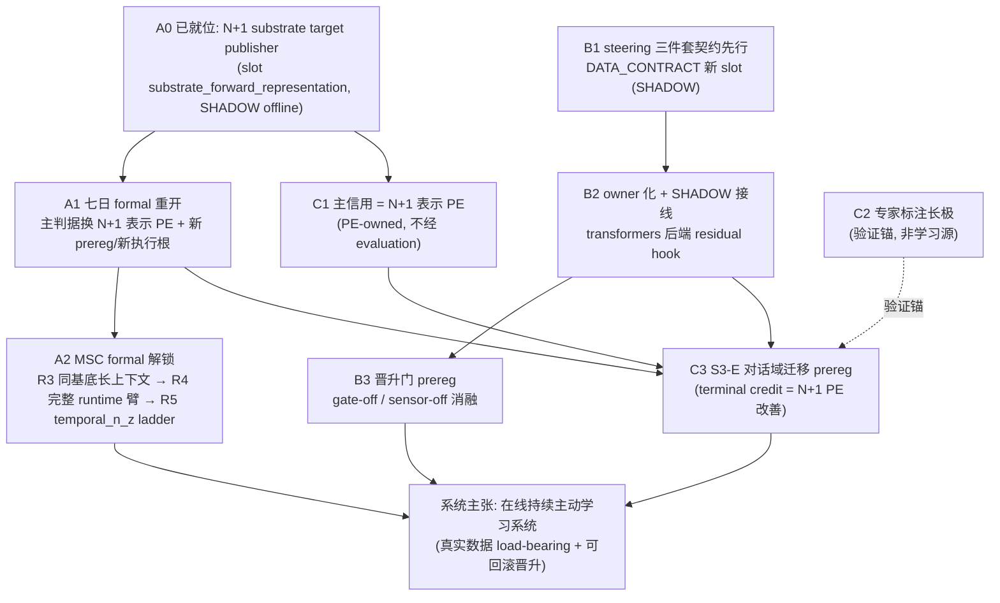

# 主线提升方案：机制证据 → 系统主张（2026-08）

> 状态：**方案冻结稿（未执行）**。本文件是"在线持续主动学习系统"主张从机制级证据升级为系统级证据的唯一路线图。
> 各收敛包启动前必须按本文件冻结各自 prereg；本文件本身不授权任何 formal run、WiringLevel 变更或 production 晋升。
>
> 读者定位：已了解 #92 `thesis-rejected` 台账（[thesis prove.md](../thesis%20prove.md)）与 S3-E 三层闭环
> （[11_S3_INTERNAL_RL_RESULT.md](../../research/steering-2026-08/11_S3_INTERNAL_RL_RESULT.md)）的工程/研究执行者。

---

## 0. 范围与不变量（先读，全程有效）

1. **封存判词不可改写**：`kill-eta`（operationalization-scoped）、S2 additive steering FAIL、S3-D literal FAIL、
  七日 formal `instrument-discrimination` 停跑、#92 `thesis-rejected`——本方案的一切工作都是**新证据**，不是对旧判词的翻案。
2. **evaluation 只读不回灌（R12）**：七日连续性 readout、companion-bench judge 分数**永远不得**成为 PE、credit、
  ModificationGate 或任何学习环路的输入（`docs/specs/relationship-memory-console.md` §硬约束、`00_INDEX.md` 相应行）。
   本方案工作流 C 的信用设计完全绕开 evaluation 通道。
3. **每包先 prereg**：判定门、arm、seeds、预算在看到结果前冻结为 artifact JSON + SHA；跑后不得改判据。
  已冻结旧 prereg 不做 retrofit——只能开新 prereg + 新执行根（`docs/moving forward/七日msctodo.md` §三）。
4. **SHADOW→比对→ACTIVE 且可回滚**：新 owner 一律 `WiringLevel.SHADOW` 起步（双跑只读，`propagate` 写入
  `shadow_snapshots` 不进 active 链），晋升走单字段翻转 + 守门测试 + 回滚注释，先例照抄
   `apprenticeship_alignment`（#90）与 `protocol_runtime`（Packet 4.0，含 `test_protocol_runtime_active_gate_guard.py`）。
5. **MPS 纪律**：仪器改造（A1）落地前**不得**再花 MPS 跑任何七日/gate-suite formal 矩阵
  （`docs/evaluation.md` §1.5 原文约束）；所有 GPU run 遵守 `artifacts/.companion-evidence-mps.lock` 互斥。
6. **收敛包纪律**：一包一 owner 一契约；基底层与控制器层不同包；高 ripple 共享契约单独成包后置（AGENTS.md §8）。
7. **新主判据必须先过分辨力预检**（2026-08-12 追加）：任何拟作 formal 主判据的 readout，在 prereg 冻结前
  必须先在冻结 train-split 语料上通过只读分辨力预检（共模能量占比、same-vs-diff cluster Cohen's d、
  1-NN 检索准确率；工具：`scripts/diagnose_readout_discrimination.py`，不进 formal runner 的 SOURCE_FILES），
  门槛随 prereg 冻结，不过门不许开 formal。动机：A1 formal 在 v1 raw-cosine readout 上产出了一个
  仪器失准的 null（§9 2026-08-12 记录），换判据时缺这一步导致同一个坑踩两次。

---

## 1. 现状基线：哪里是机制证据，哪里还缺系统证据

### 1.1 四支柱 scorecard（2026-08-05）

| 支柱              | 机制层证据（已成立）                                                                              | 系统层缺口（本方案要补的）                                                                   |
| --------------- | --------------------------------------------------------------------------------------- | ------------------------------------------------------------------------------- |
| Prefix/State-KV | Personal 全链 pass（盲判归属）；尽调 partial(3/7)                                                  | Relationship 轨停在 chance（负结果封存，不在本方案范围）                                          |
| 残差流控制           | **三层闭环**：读得到（S1 v2 0.983 / S3-前置 reader 1.0）+ 扳得动（C2 条件写入 PASS）+ 学会何时扳（S3-E 5/5 PASS）   | 全部在代理迷宫 + evidence-lane；无 runtime owner/slot；production turn 残差捕获关闭 → **工作流 B** |
| 多尺度记忆           | 机制可运行可审计可回滚（Gate 5）；wake/sleep causal+longitudinal（Gate 8）；per-user continuity（Gate 11） | 七日 formal 16/36 停跑（仪器无刻度）；MSC formal exit 3（三重阻断）→ **工作流 A**                    |
| 稀疏主动学习          | S3-E：给定稀而准终局信用，门控小样本学会择时；段信用 v13 retain                                                 | Gate 4 `causal not-supported`；companion 域无免费客观信用源 → **工作流 C**                   |

### 1.2 三条工作流的依赖关系

关键依赖读法：

- **A0→C1 是整个方案的中枢**：companion 域唯一合规的"稀而准免费客观信用"就是 N+1 substrate 表示预测误差——
它是 PE-owned 一级信号（R-PE），不是 evaluation readout，因此可以进学习环路。工作流 A 建好这台仪器，工作流 C 直接复用。
- **B 与 A 可并行**（B1/B2 不占 MPS formal 预算），但 **C3 必须等 A1 + B2** 两者就位。

---

## 2. 工作流 A：七日/MSC 仪器改造与 formal 重跑

### 2.0 A0 · 已就位的部件（不需要新造）

| 部件                         | 位置                                                                                                                                       | 状态                                                                                                                                                                                                |
| -------------------------- | ---------------------------------------------------------------------------------------------------------------------------------------- | ------------------------------------------------------------------------------------------------------------------------------------------------------------------------------------------------- |
| N+1 target publisher       | `packages/vz-substrate/src/volvence_zero/substrate/forward_representation.py`（`SubstrateForwardRepresentationPublisher`）                 | 已实现：冻结 LM residual target，schema `substrate-forward-representation.v1`，readout `latest-token-selected-layer-residual-l2.v1`（layers 11/12/13，896→2688 维，L2 归一），禁止 personal conditioning，lineage 冻结 |
| Slot 注册                    | `docs/DATA_CONTRACT.md` slot `substrate_forward_representation`                                                                          | SHADOW（offline research），不进 live DAG；blocker `substrate-owned-n-plus-one-target` 已关闭                                                                                                              |
| Predictor / mismatch owner | `packages/vz-cognition/src/volvence_zero/prediction/forward_representation.py`（`TorchForwardRepresentationHead`：Linear→Tanh→Linear 有界瓶颈） | 已实现：首批绑定 `target_lineage`，漂移即失败；settlement 含 MSE/cosine                                                                                                                                           |
| 七日 N+1 契约与 runner          | `docs/specs/seven-day-companion-evidence.md`（v3 base-only / v4 character-stack）；控制面接受 `seven-day-companion-simulated.v3`                 | 已实现，**无新 formal artifact**                                                                                                                                                                        |
| MSC 控制面                    | `scripts/run_msc_prediction_test_plan.py`（`FORMAL_BLOCKED_EXIT=3`，`FORMAL_BLOCKERS` 三项硬编码）                                               | `permitted_now = {preflight, mechanism-only-smoke}`                                                                                                                                               |

### 2.1 A1 包 · 七日 formal 重开（P0，最先做）

**根因**（`七日msctodo.md` S-1）：七项 owner readout 中四项无分辨力——`user_correction_rate` /
`remembered_item_usefulness` 被逐字节相同的每日 console 探针构造性钉死在 0.5；`callback_hit_rate` 测 owner
对自身 compact readout 的自洽性（stateless 臂反得 1.0）；`seven_day_trust_delta` 恒 0；`fsm_probe_pass_rate` 全 null。
continuity co-primary（composite gain ≥ 0.02 且 paired CI 下界 > 0）在这套仪器上不可判读。

**改造内容**：

1. **主判据替换**：causal 判定的 co-primary 换成 **N+1 substrate 表示预测误差**（arm-independent、非循环、
  `vz-substrate` 拥有 target、PE 拥有 mismatch）；七项 owner readout 全部降为 secondary 描述性指标。
2. **新 prereg + 新执行根**：旧输出根 `artifacts/seven_day_companion_formal_frozen_20260801T122037Z/` 被
  `halt_record.json` 锁死（`resume_as_is_authorized=false`），禁止原样 resume。新 prereg 冻结：矩阵规模、
   臂定义、N+1 判据阈值、seed、预算。
3. **顺带修复（同包，防再次白跑）**：
  - S-2：Gate 9 遥测语义修复（`ssl_m3_slow_gain` 首轮 0→1 必败问题）；
  - S-3/S-5：early/late 覆盖断言与矩阵规模校验**前移到 preflight fail-early**；
  - S-4：CI 统计统一（n=1 退化、z vs t）；
  - S-6/S-7：进程终止顺序与 resume 完整性校验。

**判定门**（新 prereg 冻结时明确，方向已定）：主判据 = volvence 臂相对匹配对照臂的 N+1 表示 PE 改善
（dyad/scenario-clustered CI 下界 > 0 + 预注册最小效应）；secondary 只描述不判决。

**退出条件**：若 N+1 主判据下 volvence 臂仍无可分辨优势 → 如实封存"多尺度记忆在七日窗口无净增益"，
不换判据重试；Gate 8/11 已有的 causal+longitudinal 保留结论不受影响。

### 2.2 A2 包 · MSC formal 解锁（P2，A1 之后，R3→R4→R5 顺序不可并包）

**现状**：`run_msc_prediction_test_plan.py formal` 固定退出码 3，三重阻断硬编码：

| #   | Blocker                                             | 当前缺口                                                                                                     | 关闭动作                                                                                            |
| --- | --------------------------------------------------- | -------------------------------------------------------------------------------------------------------- | ----------------------------------------------------------------------------------------------- |
| R3  | `same-substrate-context-encoder-not-yet-wired`      | long_context 对照臂用 MiniLM@256 截断，非 steelman（M-3）                                                          | 在**同一冻结 substrate**（Qwen tokenizer/模型）上做零截断全历史 long-context 臂，截断计入证据                            |
| R4  | `complete-volvence-runtime-arm-not-yet-wired`       | `run_msc_prediction_research.py` 硬编码 `volvence_full_stack=False`（bounded-state prototype 绕过 `propagate`） | 经完整 runtime collector（复用七日 service 通路）产出 volvence 臂，置 `volvence_full_stack=True` 并附 attestation |
| R5  | `temporal-controller-capacity-ladder-not-yet-wired` | 现有 ladder 只扫 `forward_head_n_z ∈ {3,16,64,256}`（PE 前向 head 瓶颈，明文"不测 temporal 容量"）                        | 单独跑只变 `temporal_n_z ∈ {3,16,64,256}` 的容量实验                                                      |

**附带硬条件**：formal 必须跑全量 heldout **501 dyad**（冻结 split train=1001/val=500/heldout=501）；
默认 CLI 子集（24/12/12）构造性过不了 `complete-heldout-dyads`。同包修 M-2（scaling 成本计量不对称）与
M-4（speaker 位置奇偶解析）。

**判定门（已冻结，沿用不改）**：

- Quality：最长 session `volvence − long_context` cosine ≥ 0.02、dyad-clustered 95% CI 下界 > 0、优势斜率 > 0；
- Scaling：cosine gap ≥ −0.01、token ratio ≤ 0.10、latency ratio ≤ 0.50；
- 胜负只比 `volvence` vs `long_context`；`stateless` / `summary_retrieval` 只做 matched 资格。

**这是"PE/ETA 是否 load-bearing"的主战场**：真实人类多 session 数据 + 免费客观标签 + steelman 对照。
过门 → 系统主张的核心证据；不过 → 如实封存"有界递归状态在该语料上不优于长上下文 steelman"。

---

## 3. 工作流 B：steering 系 SHADOW→ACTIVE 晋升协议

### 3.0 现状与原则

三件套目前是 evidence-lane 脚本（**非** RuntimeModule，无 slot，报告硬编码 `production_wiring_changed=False`）：

| 件        | Owner 模块                             | 数学/接口（冻结不改）                                                                                                                         |
| -------- | ------------------------------------ | ----------------------------------------------------------------------------------------------------------------------------------- |
| Sensor   | `eta_read_steer_prereq.py`           | 冻结线性 ridge reader，特征 = 携带目标的上下文残差（layer 20 / 896），输出 subgoal belief + margin                                                        |
| Executor | `eta_conditional_steering_screen.py` | `delta = U @ (tanh(Z[k]) ⊙ (Vᵀh))`，rank-8、无 free bias、zero-code strict no-op、`control_norm_cap = 0.25 × probe_norm`                 |
| Gate     | `eta_when_to_steer_rl.py`            | REINFORCE 门控：观测 `(belief_margin, fresh_margin, belief_disagrees_fresh, base_action_entropy)`，动作 `{noop, steer}`，multi-restart 训练侧选择 |

**明确不复用旧协议的 ETA-off 条款**：`docs/evaluation.md` §4 的 Learned Active 晋升门是为 z_t 系四后端
（`temporal_runtime/ssl/internal_rl/cms_torch`）设计的，其 `eta_off_control` 消融的是 temporal metacontroller
组件。steering 系是不同的 owner 族，**须另立 prereg**，消融臂语义换为 gate-off / sensor-off（见 B3）。

### 3.1 B1 包 · 契约先行（不占 MPS）

在 `docs/DATA_CONTRACT.md` slot 注册表登记（owner / value_type / dependencies / wiring_level 四元组齐全才算完成）：

| Slot（建议名）                   | Owner                                        | Value 类型                                                 | 依赖                                  | 默认接线   |
| --------------------------- | -------------------------------------------- | -------------------------------------------------------- | ----------------------------------- | ------ |
| `steering_condition_belief` | 新 SteeringSensorModule（吸收冻结 reader）          | frozen dataclass：subgoal belief + margin + staleness 代理  | `substrate` 残差快照                    | SHADOW |
| `steering_intervention`     | 新 SteeringExecutorModule（吸收 rank-8 operator） | frozen dataclass：control delta 元数据 + norm + zero-code 标记 | `steering_condition_belief`、gate 决策 | SHADOW |
| `steering_gate_decision`    | 新 SteeringGateModule（吸收 REINFORCE policy）    | frozen dataclass：action + PE 代理观测 + 策略版本                 | `steering_condition_belief`、PE 快照   | SHADOW |

同步 `docs/specs/`（新 spec 或并入 `eta-llm-transfer-evidence.md` 后继 spec）：职责边界、快照 shape、不变量
（substrate 冻结、无 free bias、zero-code no-op、仅 gate 策略在线更新）。

### 3.2 B2 包 · owner 化 + SHADOW 接线

1. 三件套从脚本改造为发布快照的 RuntimeModule（`slot_name/owner/value_type/dependencies/default_wiring_level=SHADOW`），
  评估脚本改为消费 owner 快照——**同一快照链一个写入者**，evidence 脚本降为 caller。
2. **残差捕获接通（SHADOW 专用）**：production turn 表达层显式 `capture_residuals=False`
  （`packages/vz-runtime/src/volvence_zero/agent/response.py`），vLLM 后端 `capture/apply_control` 是
   `NotImplementedError`。SHADOW 接线仅限 **transformers 后端**，hook 只在 SHADOW 路径开启，
   ACTIVE 链路不受影响；这一条本身要有守门测试（SHADOW 关闭时零 hook）。
3. 回滚面：`FinalRolloutConfig` 单字段 + env 覆盖（对齐 `VZ_TEMPORAL_*` 命名习惯，如 `VZ_STEERING_*`），
  注释写明回滚方式；照抄 protocol_runtime 的守门测试模式。

### 3.3 B3 包 · 晋升门 prereg（模板 = `learned_active_gate` 结构，语义换血）

| 门                    | steering 系判据（prereg 冻结时定数值）                                                    | 模板来源                                  |
| -------------------- | ------------------------------------------------------------------------------ | ------------------------------------- |
| real_trace           | SHADOW 双跑 ≥ 500 真实 turn（非合成迷宫）                                                 | `real_trace_turns >= 500`             |
| validation           | 对齐 v2 纪律：预注册窗口、informative 轴 ≥2、逐轴相对基线改善 ≥15% 或绝对 Δ≥0.02（v1）                   | `validation_delta` v1/v2              |
| **gate-off 消融**      | 同基底把门控退化为 always-on 与 noop 两个对照，学到的门相对两者方向正确（`delta_mean > 0` 且 status ≠ fail） | 替代 `eta_off_control`                  |
| **sensor-off 消融**    | 同基底把条件退化为无条件（unconditional operator），条件化优势方向正确                                 | 替代 `pe_off_control`                   |
| rollback drill       | checkpoint round-trip ≥ 1 次验证通过                                                | `checkpoint_round_trips_verified > 0` |
| latency SLO / safety | steering 路径不破 turn 延迟预算；safety gate 全绿                                         | 同名门                                   |
| 分级顺序                 | **sensor → executor → gate** 有序前缀晋升，单组件翻转                                      | `LEARNED_BACKEND_PROMOTION_ORDER` 模式  |

证据流水线复用现有形态：shadow-smoke → chunked-soak → real-soak → ablation → build-promotion-evidence →
evaluate-promotion；缺消融来源时对应位诚实置 False（BLOCK），不许跳门。

**风险登记（B 特有）**：

- **基底迁移**：三件套绑定 Qwen2.5-0.5B layer 20/896；生产/soak 基底若为 1.5B 档，reader/executor 需在目标基底
重新 fit + 重新过 C2/08 级 screen（这是新 prereg 的一部分，不是免检迁移）。
- **信号面转换**：迷宫的 expert-NLL 结局在对话域不存在 → gate 的训练与验收必须换 C 工作流的信用面（C3），
B3 的 real-trace 验收依赖 C3 先行定义信用。

---

## 4. 工作流 C：companion 稀而准信用来源

### 4.0 硬约束（决定整个设计）

- 七日连续性 readout（`relationship_continuity` slot 七项）与 companion-bench A1–A6 judge 分数是
**evaluation readout**，契约明文禁止进 PE/credit/ModificationGate（R12）。
- OSS 标准明确 judge output 不可作 label source；judge 稳健性 #71（同家族 σ≈23.2）/#48（跨家族 agreement）未关闭。
- 结论：**信用只能来自 PE 通道或人工标注通道，不能来自 evaluation 通道。**

### 4.1 C1 · 主信用 = N+1 substrate 表示 PE（复用 A0 仪器）

- Terminal credit 定义：对每个 episode/segment，门控策略的结局信用 = **N+1 表示预测误差的改善量**
（相对 noop/counterfactual 基线），由 PE owner 计算、经 credit owner
（`sparse_proof_reward_taxonomy` + `InternalRLDelayedCreditAssignment` 的契约语义）路由给 gate 策略。
- 性质对齐 S3-E 的证明前提：稀（episode 终局）、准（免费客观标签，无 judge/无人工）、arm-independent。
- 这与 S3 prereg 的信用契约同构——S3-E 已证明"给定这种信用能学会择时"，C1 提供的是**对话域的同类信用**。

### 4.2 C2 · 专家标注（长极，验证锚定位）

- 现状：仓库无 annotation pipeline；Gate 8/11 human-anchor 有 prereg + pilot 工具（`gate811_human_anchor*.py`）
但无 consented transcript；companion-bench human track 是 RFC placeholder。
- 定位：**初期只作验证锚，不作学习源**——用少量专家标注验证 C1 的 N+1 PE 信用与人类判断的方向一致性
（不进学习环路，避免污染 + 避开 R12 边界争议）。
- 交付：标注 schema（何为"该扳向关系轨"的正/负例）、知情同意与去标识化流程、量级预算
（先 pilot 双标注者 + inter-rater 一致性门，再决定是否扩量）。
- 升级条件（远期）：仅当 C1 免费信用被证明与人类锚不一致且差距 load-bearing 时，才考虑把专家标注经
credit owner（非 evaluation）升级为信用源——届时单独 prereg。

### 4.3 C3 · S3-E 对话域迁移 prereg（三线汇合点）

前置：A1（N+1 仪器 formal 可用）+ B2（steering owner SHADOW 在线）+ C1（信用路由定义）。

- **Claim**：在真实对话 SHADOW 流上，门控策略仅凭 episode 终局的 N+1 表示 PE 信用 + PE 代理观测，
学会"何时扳向关系轨"，且相对 always-on / noop / random-gate 的 matched-budget 对照方向正确。
- **判定门**（prereg 冻结）：结构对齐 S3-E——收敛改善、gain vs noop / always-on / random-gate
（route/episode-clustered bootstrap CI 下界，worst-seed）、门控选择性、结构完整性
（substrate 冻结、reader/executor 冻结、无 free bias、zero-code no-op、仅策略更新）；
multi-restart + 训练侧选择作为已预注册的稳健化机制直接带入。
- **退出条件**：对话域信号若不足以支撑择时学习（如 N+1 PE 对 steering 动作不敏感）→ 如实封存
"代理级择时学习不迁移到该信号面"，不降阈值、不换 judge 信号救场。
- **Operationalization 边界**（2026-08-12 补）：SHADOW 下 N+1 target 取 MSC 语料的真实下一轮文本，
  与门控臂无关；因此 C3 的信用面实测的是**表示对齐改善**（steering 后 substrate 表示更接近真实
  下一轮的表示），不是**行为控制**（steering 改变了生成行为并被用户侧回报确认）。一切 C3 claim
  措辞必须与此一致：PASS 只授权「择时学习在表示对齐信号面上成立」，不得外推为「学会了控制对话走向」；
  行为层主张需要 ACTIVE 生成链路 + 独立行为面判据，属 B3 之后的另立 prereg。此外按 §0 不变量 7，
  C3 prereg 冻结前其主判据 readout 必须先过分辨力预检（v1 raw-cosine 已实测 d=0.315 失准，
  v2 centered readout d=0.592，见 §9 2026-08-12 记录）。

---

## 5. 里程碑与执行顺序

| 阶段  | 包                                             | 并行性                      | 占 MPS formal 预算 |
| --- | --------------------------------------------- | ------------------------ | --------------- |
| P0  | **A1** 七日仪器改造 + formal 重开                     | 单独先行（§0 不变量 5）           | 是（新 prereg 后）   |
| P1  | **B1 → B2** steering 契约 + owner 化 + SHADOW 接线 | 与 A1/A2 并行（不占 formal 预算） | 否               |
| P1  | **C2** 标注 schema/同意流程起草                       | 与一切并行（纯文档/流程）            | 否               |
| P2  | **A2** MSC R3→R4→R5 + 501 dyad formal         | A1 之后                    | 是               |
| P2  | **C1** 信用路由实现（PE→credit→gate）                 | 依赖 A0（已就位），可与 A2 并行      | 否               |
| P3  | **C3** 对话域择时学习 prereg + run                   | 依赖 A1+B2+C1              | 是               |
| P3  | **B3** steering 晋升门 prereg + real-soak + 消融   | 依赖 B2+C3 信用面             | 是               |
| P4  | 系统主张对账                                        | A2 + B3 + C3 全过后         | —               |

**P4 完成定义**（何时可以说"在线持续主动学习系统"成立）：

1. MSC formal：volvence 臂在 501 dyad 上过 quality+scaling 门（PE/记忆 load-bearing on 真实数据）；
2. 七日 formal（N+1 判据，且该 readout 须先通过 §0 不变量 7 的判据分辨力预检）：连续性净增益 CI>0；
  2026-08-12 注：A1 在 v1 raw-cosine readout 下的 `passed=false` 不构成本条的终态封存（见 §9 当日记录），本条待 v2 readout 预检过门后另立 prereg 重开；
3. steering 系至少 sensor+executor 过晋升门进入 ACTIVE（gate 可仍 SHADOW）；
4. C3：对话域择时学习 admission PASS。
  四项各自可回滚、各有独立 prereg 与 artifact；缺任一项则主张保持"机制级"表述。

---

## 6. 预算与资源约束

- **MPS 互斥**：全部 formal run 走 `artifacts/.companion-evidence-mps.lock`；同一时间只跑一个 formal 矩阵。
- **量级参考**（已知历史）：S3-E 权威 5-seed ≈ 3 min；七日 formal 矩阵 36 runs 曾在 16/36 停跑（预算按全 36 重排）；
MSC formal 是最大件（501 dyad × 4 臂 + capacity ladder），需先 smoke 量化单 dyad 成本再冻结预算。
- **GPU 债务 #41**：matched LoRA 类工作仍受门控，不进本方案关键路径。
- **昂贵 run 触发纪律**：机制/算法变量/证据契约/promotion gate 改变才重跑；文档改动与重构不触发（AGENTS.md §12）。

## 7. 风险登记（每条附退出条件）

| #    | 风险                                 | 缓解                                           | 退出条件（诚实封存口径）                           |
| ---- | ---------------------------------- | -------------------------------------------- | -------------------------------------- |
| R-A1 | N+1 判据下七日仍无优势                      | steelman 对照 + 预注册最小效应                        | 封存"七日窗口无净增益"，保留 Gate 8/11 局部结论         |
| R-A2 | MSC volvence 臂输给零截断 long-context   | R4 用完整 runtime 臂（当前 prototype 非全栈，结果未定）      | 封存"有界递归状态不优于长上下文 steelman"——这本身是高价值负结果 |
| R-B1 | 0.5B→生产基底 reader/executor 不迁移      | 目标基底重 fit + 重过 screen（prereg 内含）             | 封存"steering 面不随 scale 迁移"，B 线止于 SHADOW |
| R-B2 | transformers-only hook 与生产 vLLM 冲突 | SHADOW 限 transformers；ACTIVE 前评估 vLLM 残差出口成本 | 无法低成本暴露 → steering ACTIVE 推迟，不 hack 后端 |
| R-C1 | N+1 PE 对 steering 动作不敏感（信用面失效）     | C3 前置敏感性 smoke（等价 S3-A 余量审计）                 | 封存"该信号面无择时余量"，回到 C2 升级路径讨论             |
| R-C2 | 专家标注与 N+1 信用方向不一致                  | C2 只作验证锚，不阻塞 C3                              | 如实报告分歧，触发信用面重审（单独 prereg）              |
| R-G  | 多包并行破坏快照单写者                        | 收敛包纪律：同一快照链一个写入者；B1 契约先行                     | —                                      |

## 8. 与现有文档的映射

| 本方案   | 对应既有 SSOT                                                                       | 关系                                           |
| ----- | ------------------------------------------------------------------------------- | -------------------------------------------- |
| A1/A2 | `docs/moving forward/七日msctodo.md`（S-1…S-8 / M-1…M-6 / §三收敛包排序）                 | 本方案是其 P0/P2 的执行承诺；细节以该文件为准                   |
| A0/C1 | `docs/DATA_CONTRACT.md` slot `substrate_forward_representation`；收窄计划 R2 包 B     | 复用，不新建第二 owner                               |
| B1–B3 | `docs/evaluation.md` §4（Learned Active 模板）+ §7.6（三层闭环）；`learned_active_gate.py` | 结构模板复用，条款语义换血（gate-off/sensor-off），另立 prereg |
| C3    | `research/steering-2026-08/09_/11_`（S3/S3-E prereg 与结果）                         | 判定门结构与稳健化机制直接继承                              |
| 全局    | `docs/thesis prove.md` §6（可声明/禁止清单）                                             | P4 之前对外表述以该清单为准                              |

## 9. 变更纪律

本文件更新时机：任一包 prereg 冻结、formal 封存、或风险登记项触发退出条件时，追加变更记录（日期 + 包 + 判词），
不回改历史段落。执行细节与判词以各包 prereg JSON 与 artifact 为准，本文件只做路线图与对账。

- 2026-08-05 · C2 工程流程落地：新增 `steering-human-anchor-pilot.v1` 的双盲标注、
  consent/deidentification、完整撤回、留存、双专家一致性与 C1 方向对照契约；恒为
  validation-only，不授权学习或晋升。当前无 consented transcript/真人评分，未产生人类锚判词。
- 2026-08-05 · B1/B2/C1 工程收敛：三个 steering slot、model-bound frozen artifact、
  transformers-only SHADOW hook、ACTIVE 可见性隔离与 PE→credit→gate 已落地并通过定向契约测试；
  production 默认未改，B3 formal 前保持 SHADOW。
- 2026-08-05 · A1 新 prereg 已冻结：
  `seven_day_companion_simulated_prereg_nplus1_20260805T061326Z.json`，SHA-256
  `83cdb776b7e72b1cf32d6ef8e0ca0b60f96e00807a89f75dd645e1c7180950dc`；
  新只读执行根已冻结，36-run formal 正在该根执行。此记录只确认预注册/dispatch，
  不预告判词。
- 2026-08-05 · C3/B3 控制面完成但未执行 formal：C3 已冻结 text-free MSC SHADOW
  trace、matched steer/noop/sensor-off N+1 PE、5-seed multi-restart 与诚实退出契约；B3
  另立 steering 专用 real-trace/validation/gate-off/sensor-off/rollback/latency/safety 门，
  按 sensor→executor→gate 产出有序前缀。两者必须等待 A1 前置终态并各自先冻结新 prereg；
  当前无 admission 或 ACTIVE 判词。
- 2026-08-05 · C3/B3 预注册前加固：C3 前置改为严格验证 A1 result/manifest/
  verdict/independent-audit 四件套及其 prereg、source-tree 和内容 hash；trace 补全
  sensor-off executor lineage 与 matched norm budget。B3 预检在 C3 四件套缺失时 fail loudly，
  formal 输出绑定选中 learned gate 的 candidate bundle；activation-plan.v2 将门前
  `always_on` 准备和门后 `blocked` 清理拆为单字段 rollout。该记录只确认
  契约收紧，仍无 C3/B3 判词。
- 2026-08-05 · A2/C3/B3 预注册前执行顺序与 lineage 再加固：A2 runner 固定为
  R3 同基底零截断 long-context → R4 同 lineage 全运行时基线 → R5 16/64/256
  容量阶梯，formal prereg 同步冻结该顺序并由 smoke 守门；C3 对每个可恢复 checkpoint
  和最终 trace 校验 reader/executor/gate/sensor-off、模型权重、层位与控制预算 lineage，
  B3 source tree 纳入最终 wiring。ACTIVE executor 构造时显式剔除仅限 SHADOW 的
  sensor-off 对照件，保留候选 bundle 作为证据而不污染运行链。定向 Ruff 与 17 个
  steering runtime 测试通过；该记录仍不预告 A2/C3/B3 判词。
- 2026-08-05 · formal 后部署闭环预置：A2 prereg 每次都从 runner 重新捕获完整
  run configuration，拒绝复用中断遗留或与当前源码/模型不一致的临时配置；B3 activation
  consumer 已接入 companion service，裸 bundle 仍不可启用。部署必须同时验证 B3
  manifest、promotion evidence/report、activation plan 与 learned-gate candidate bundle，
  且只能选择 eligible prefix 内的一个冻结 step；首轮 canary 继续绑定 C3 的 model/digest/
  layer/width、context 上限、16-token、temperature 0 和 fail-on-truncation。定向 Ruff、
  A2 prereg 14 项、B3/service 相关 44 项及完整 contracts 5535 项均通过。该记录只冻结
  可执行的晋升/回滚面，production 默认仍全 SHADOW，等待 formal 判词。
- 2026-08-05 · A2 正式执行封口再加固：R5 smoke manifest 现保留完整 runner
  run-configuration，preregister 对模型/权重/layer/width、语料 provenance、运行时限制、
  temporal intervention、seed 与全部 mechanism source hash 做 smoke→formal 同源校验；
  同时冻结完整 execution-source tree。新增 `freeze_msc_execution_root.py` 生成与 prereg
  raw SHA 绑定的只读 `msc-frozen-execution-root.v1`，formal 拒绝可变工作树、可写/额外文件、
  tree/manifest/prereg 漂移。相关 Ruff、编译与 17 个 A2 控制面定向测试通过；本记录不预告
  A2 formal 判词。
- 2026-08-05 · C3/B3 串行守门复核：C3 统一使用与 A2 相同的 canonical
  `data/external/msc/v0.1/extracted` 语料根，并从其同级 v0.1 provenance 校验 schema/hash，
  避免 A1 完成后才触发路径阻断；B3 新 prereg 在 C3 output 已出现 bundle/trace/report/
  manifest 任一结果时直接拒绝，代码级保证“先冻结 B3、后观察 C3”。定向 Ruff、编译与
  8 项控制面测试通过；仍无 C3/B3 formal 判词。
- 2026-08-05 · B3 部署授权防旁路：production activation 现在拒绝进程中残留的全部
  `VZ_STEERING_*` override，防止已验证的 manifest/plan/candidate rollout config 在 Brain
  构造期被环境变量二次抬高 wiring、替换 ungated action 或改变 SHADOW hook。B3 activation
  与 C3/B3 控制面合并 15 项定向测试通过；production 默认仍未改变。
- 2026-08-05 · A2 MPS 调度封口：prediction plan 持有共享锁后会把 exact held-lock/path
  attestation 传给子 runner，消除子进程重复抢同一锁导致 smoke/formal 立即失败的问题；
  prereg 的 `--emit-run-configuration` 纯配置捕获则显式跳过 MPS probe/lock，不占 formal
  预算。完整 companion test-plan 控制面 43 项测试与 Ruff/编译通过；尚未启动 A2 smoke。
- 2026-08-05 · A2 直跑旁路关闭：`run_msc_prediction_research.py` 自身也进入共享 MPS
  guard，控制面外直接以 `--device mps` 调用不再绕过互斥；父计划委托与纯配置捕获的例外
  仍按上一条契约处理。控制面测试增至 44 项通过。
- 2026-08-05 · B3 ACTIVE 链源码指纹补全：B3 prereg 不再只冻结 promotion evaluator、
  activation consumer 与 final wiring，而是独立覆盖 sensor/gate/executor、runtime kernel、
  session/brain、response/expression、transformers residual hook 和 service startup 全链；避免
  仅靠 C3 prereg 间接绑定 production 代码。控制面 Ruff、编译与 8 项定向测试通过；尚未
  创建 B3 prereg，production 默认及正式判词均未改变。
- 2026-08-05 · B3 rare-heavy 系统门补齐：candidate bundle 取得实际 content hash 后，
  必须以 `substrate.steering_artifact_bundle` 目标经过正式 `ModificationGate.OFFLINE`；
  held-out 最小相对改善、零 capacity expansion、candidate-bound rollback 与 read-only safety
  metrics 全部在 prereg 前冻结。系统门 BLOCK 会清空整个 sensor→executor→gate eligible
  prefix；activation-plan.v3 与 deployment consumer 绑定独立 review 的 hash/ALLOW 判词，
  不能靠专用 B3 report 绕过。OA-4 业务 audit 尚未完成，当前阶段一契约如实记录
  `audit_required=false`，不虚构 audit evidence。尚未创建 B3 prereg，production 默认仍全
  SHADOW，本记录不预告 formal 判词。
- 2026-08-05 · B3 单字段 rollout 防跳步补齐：activation step 2 及以后必须消费紧邻前一步、
  已通过 companion `/v1/health` 的 immutable canary receipt；loader 从该前态只应用当前
  `single_field_flip`，不再允许从默认 SHADOW 直接物化累计 step。新增 bounded canary runner
  持有共享 MPS 锁，先拒绝已占用/非 loopback 端点，启动 exact service 后健康检查、确认子进程仍
  存活再主动停止，并把退出码、argv、stdout/stderr、
  manifest/plan/ModificationGate review/candidate 与前序 receipt 的 hash 封存。receipt 只证明
  启动健康和单字段 materialization，不是用户价值证据；尚无 B3 formal/receipt，production 默认
  仍全 SHADOW。
- 2026-08-05 · B3 canary 回执自包含加固：receipt 不再只留不可反查的 argv/log digest，改为同时
  保存 exact argv、stdout/stderr 绝对路径和前序 receipt 绝对路径；下一 rollout 会复算命令、两份
  日志及前序文件 SHA-256，并核对命令中的 step/manifest/plan/candidate/previous-receipt。尚无正式
  receipt，因此该收紧不改写任何结果。
- 2026-08-05 · B3 formal 后源码漂移防护：promotion manifest 现在发布 prereg 冻结的完整
  `source_sha256`，deployment reader 从仓库根逐文件复算，并硬性要求 CLI、activation reader、
  final wiring 与 canary runner 位于快照内。任一 ACTIVE 链文件在 formal 后变化都会在服务启动前
  fail closed；尚未创建 B3 prereg，因此该收紧未 retrofit 任何既有证据。
- 2026-08-05 · A2 磁盘预算证据补齐：R5 smoke manifest 除 token/latency/sample 外，新增
  checkpoint file count、总 bytes 与 per-runtime-sample bytes，并随 passed smoke hash 进入
  formal prereg。正式矩阵启动前据此复核剩余磁盘，避免 501-dyad 运行中途耗尽存储；尚未启动
  A2 smoke/prereg。
- 2026-08-06 · A2 长轨迹 dtype 复核：`float16` 与 `bfloat16` 在同一首个 MSC 训练 dyad、
  同一轨迹边界均由 substrate owner 检出非有限 residual 并 fail loudly；`float32` 完整越过该
  边界、跑完整个 dyad 并写入 checkpoint。因此新的 A2 smoke/formal 与 C3 prereg 默认统一冻结
  `substrate_model_dtype=float32`，运行中禁止自动重试或静默换 dtype；既有失败根目录只保留为
  诊断证据，不得续跑或混入新谱系。
- 2026-08-06 · C3 首次 formal 在第一个 train dyad 第 22 个 turn fail loudly：完整 runtime
  prompt 达 779 tokens，而旧 prereg 错误冻结 `max_length=768`；substrate 正确拒绝截断，且未把
  21-turn 部分轨迹写成 dyad checkpoint。C3 控制面现要求 `max_length` 精确等于冻结模型
  `max_position_embeddings`（当前 32768），低于模型上限的配置在 preflight 直接失败。旧
  C3/B3 prereg 与部分 output 仅作诊断证据，不续跑、不混入新谱系。
- 2026-08-12 · A1 formal 封存（判词限定范围）：
  `seven_day_companion_formal_nplus1_20260805T061326Z` 判词 `passed=false`，四个
  contrast 的 `n-plus-one-primary-effect` gate 全部失败，primary N+1 cosine gain 分别为
  `correct-user-state-vs-stateless` 0.005827、`-vs-swapped-user-state` 5.93e-05、
  `-vs-shuffled-history` 0.007382、`sleep-consolidation-vs-no-sleep` −0.000419，
  四条 paired CI 均横跨 0。**判词限定为「在 v1 raw-cosine readout
  （`latest-token-selected-layer-residual-l2.v1`）下无净增益」**，不外推为无条件的
  「七日窗口无净增益」：事后仪器诊断（见下条）证实 v1 readout 存在标度缺陷，55.4%
  共模能量把真实可分辨性压制约一半，该 null 无法区分「无效应」与「仪器失准」。
  R-A1 的无条件封存口径（「七日窗口无净增益」）保留给分辨力预检过门的 readout 下的重跑。
- 2026-08-12 · N+1 仪器标度缺陷修复（substrate owner 内，v1 不动）：在 C3 已收集的
  583 个 MSC train 样本（24 dyad）上实测，v1 全局 L2 readout 共模能量占 55.4%、L20 块
  独占 73% 能量，same-vs-diff dyad Cohen's d 仅 0.315（1-NN dyad 检索 25.4% vs 随机
  4.2%，信息存在但被标度压制）。`vz-substrate` 新增
  `latest-token-selected-layer-centered-residual-l2.v2`（逐层 L2 归一 + 减冻结参考均值 +
  去 top-1 主成分后再归一），参考统计只允许在冻结 train-split 语料上拟合并随
  lineage（`reference_corpus_id` / `reference_statistics_sha256`）发布，禁止在
  evaluation/heldout 数据上现算。owner 实测 v2 d=0.592（+88% vs v1；去 ≥2 个主成分
  反而塌回 0.21–0.27，故冻结 top-1 档）。同步新增判据分辨力预检诊断
  `scripts/diagnose_readout_discrimination.py`（只读，不进任何 formal runner 的
  SOURCE_FILES），证据封存于 `artifacts/readout_discrimination_v2_20260812/`。
  本记录只修复仪器并登记契约，不预告 v2 下任何重跑的判词；已死的 C3 formal
  （`dialogue_steering_c3_formal_fullcontext_20260806`，33/48 dyad）不续跑，
  其 context 保留为诊断证据与 v2 参考统计的合法拟合语料。
