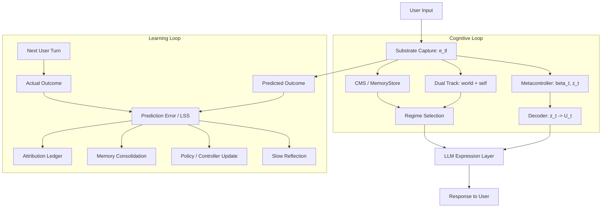

# Next-Generation EmoGPT — System Design

> Status: v2 draft
> Last updated: 2026-04-21
> Scope: system-level thesis and invariants (not implementation spec)
> Sources: Nested Learning (NL, arXiv:2512.24695), Emergent Temporal Abstractions (ETA, arXiv:2512.20605)
> Downstream: `docs/specs/*.md`, `docs/DATA_CONTRACT.md`, `.cursor/rules/`

## Part 0. Purpose and Scope

This document defines the **target-state design invariants** for a next-generation EmoGPT system. It is:

- the single source of truth for **why** the system is built this way
- the grounding for all `docs/specs/*.md` capability specs
- the bridge between NL/ETA academic ideas and our product/engineering decisions

It is **not** an implementation plan, a module API reference, or a paper restatement.

---

## Part 1. Core Thesis

### What the system is

EmoGPT is a **bounded, continuously adapting digital organism** whose core product is relationship and subjectivity (EQ + trust), not only intelligence (IQ). The system is not a static model plus prompts. It is an explicitly layered adaptive system with fast, medium, and slow learning loops.

### Five pillars

1. **Prediction error is the primitive learning signal.**
   The system learns by predicting outcomes and updating itself from the mismatch between prediction and reality. Reward and punishment are not externally labeled — they are derived from prediction error. Following NL: *"Memory is a neural update caused by an input, and learning is the process for acquiring effective and useful memory"* (NL §3.1). The gradient of the loss with respect to the model's output is the **local surprise signal (LSS)** — the fundamental measure of how surprising a prediction was. All credit, evaluation, and reward are downstream of this primitive.

2. **The system is a nested, multi-timescale associative memory system.**
   Following NL's NSAM framework, the entire system — substrate, controllers, optimizers, memory — is modeled as a set of interconnected associative memories at different update frequencies. Architecture and optimizer are not independent design knobs; they are jointly a **neural learning module** whose behavior depends on the whole.

3. **Temporal abstraction is explicit and lives above token generation.**
   Following ETA, the system maintains a formal layer of temporally-abstract internal actions (controller codes `z_t`) above the raw token level, with learned switching conditions (`β_t`). Internal control operates in this compressed latent space, not in the high-dimensional token space. This enables efficient exploration, sparse-reward learning, and meaningful credit assignment.

4. **Relationship and task are distinct prediction spaces.**
   The system tracks two partially separated learning tracks: world/task (predicting task outcomes) and self/relationship (predicting relational consequences). These are not style variants; they are separate prediction error streams with distinct memory, credit, and controller update paths. This single-other relationship track generalizes to multi-agent social cognition in R16-R20.

5. **The LLM is the expression layer, not the primary learner.**
   The pretrained language model provides the substrate and the voice. Learning, adaptation, and control happen in the layers above it — controllers, memory, reflection, regime — not through prompt engineering or token-level fine-tuning.

---

## Part 2. Design Laws (R1–R20)

Requirements are organized by dependency, not by number. R-IDs are stable and referenced across all specs.

### Foundation: contracts and ownership

**R8. Snapshot-First, Contract-First Architecture**

Every meaningful runtime area has a single primary owner. Cross-module exchange happens through immutable public snapshots. Consumers do not reconstruct producer internals. Enriched publishers are preferred over downstream rebuilding. Runtime controllers may consume substrate state, but must not silently become second owners.

**R15. Migration Must Preserve Explainability and Rollback**

The system evolves by bounded incremental packets. Each adaptive layer has a clear owner. Each public exchange is inspectable. Old and new learning paths have named exit conditions. Rollout is reversible. Evaluation evidence must precede scope widening.

### Identity: dual tracks and being

**R7. Self/Relationship Learning Is Separate from Task Learning**

The architecture tracks two partially separated learning tracks:

- **World/task track**: facts, plans, user situations, external goals — prediction errors about task outcomes
- **Self/relationship track**: trust, attachment, interaction regime, repair history — prediction errors about relational consequences

These tracks share infrastructure but remain semantically distinct in memory writes, credit assignment, controller updates, and evaluation metrics. In the current default runtime, this now means separate `world_temporal` and `self_temporal` owners with independent controller state and bounded update surfaces, plus a compact public `temporal_abstraction` aggregate slot for downstream consumers. Relationship continuity is not a side effect of problem solving.

**R12. Evaluation Must Cover Being, Not Only Task Success**

Required evaluation families: task capability, interaction quality, relationship continuity, learning quality, abstraction quality, safety and boundedness. A system that only scores well on one-turn helpfulness is insufficient.

**R14. Social and Cognitive Regimes Need Persistent Identity**

Regimes (casual social, acquaintance building, emotional support, guided exploration, problem solving, repair and de-escalation) are represented in runtime state, recallable from memory, selectable by higher-level control, and trainable through delayed outcomes. They are not prompt labels.

### Social Cognition Learning: from single-other to multi-agent

R16-R20 extend R7, R11, R-PE, R1, R3/R4, and R14 from one anonymous interlocutor to a social world containing multiple people, roles, shared contexts, and groups. These requirements are not a multi-person CRM schema. They define learned social cognition owners: each owner publishes immutable snapshots, emits pre-action social predictions, receives outcome evidence, contributes typed social prediction error, and exposes compact state for ETA controllers rather than renderer-owned text rules.

**R16. Multi-Party Identity Learning Is Foundational**

Every other-agent state carries an `interlocutor_id`. `user_model`, `relationship_state`, and `interlocutor_state` must evolve from flat single-other snapshots into keyed maps over interlocutors. `MemoryEntry` gains an audience / subject scope so the system knows whom a memory is about and who is allowed to hear it. A default `primary` interlocutor is allowed during migration, but it is a compatibility key, not a cognitive truth.

The cognitive anchor is multi-agent Theory of Mind: children and adults do not merely track "a user"; they track distinct other minds with different beliefs, intentions, feelings, preferences, and relationship histories (Premack & Woodruff 1978; Wellman; Saxe). Applying Alice's preference to Bob is not a harmless retrieval mistake; it is a social misattribution.

Owner / timescale: the multi-party identity owner is the single writer for interlocutor identity, relationship identity, and memory audience scope. `online-fast` assigns active speaker / addressee identity for the current turn, `session-medium` consolidates scene-level identity continuity, and `background-slow` promotes durable identity / relationship boundaries after reflection.

Prediction error: before acting, the owner predicts which interlocutor each social state belongs to and which audience may receive it. Wrong-person memory application, private-memory leakage, or identity merge/split errors produce typed social prediction error and feed credit / memory correction.

ETA consumption: metacontrollers and regime selection consume compact keyed identity state to choose `z_t` and switching conditions. The renderer must not infer "who this is about" from text; it only expresses the plan produced from owner snapshots.

Kernel impact: `UserModelSnapshot`, `RelationshipStateSnapshot`, and `InterlocutorState` become keyed aggregates; `MemoryEntry` grows `audience_ids` / `subject_ids`; `ResponseContext` carries active speaker / audience keys; compatibility keeps single-user flows under `primary` until ACTIVE rollout.

**R17. Theory-of-Mind Learning Owners Are Distinct from Preference**

Other-mind modeling is not one `user_model` bucket. The system needs distinct learned owners for what the other seems to believe, intend, feel, and prefer. Preference is durable style / value tendency; belief is their model of the world; intent is likely action; feeling is current affective state. These have different update rules and different failure modes.

The cognitive anchor is the classic Theory-of-Mind distinction: belief, desire/preference, intention, and affect are separable latent states (Premack & Woodruff 1978; Wellman). A person may prefer comfort, believe a task is urgent, intend to act practically, and feel fragile at the same time. Collapsing these into one semantic record causes wrong predictions.

Owner / timescale: `belief_about_other`, `intent_about_other`, `feeling_about_other`, and `preference_about_other` are separate owners keyed by `interlocutor_id`. `online-fast` accepts structured proposals for current affect / intent, `session-medium` reconciles repeated evidence into working models, and `background-slow` promotes durable preferences / beliefs only after conflict-aware consolidation.

Prediction error: each owner emits a different social prediction: belief predicts how new information will be interpreted, intent predicts follow-through, feeling predicts affective response, and preference predicts stable response style. Outcome mismatch updates the owning state and contributes owner-specific social PE.

ETA consumption: ToM snapshots are compact advisories to latent controllers and regime selection. Long-term policy adaptation happens in controller code space; LLM structured output may propose ToM updates, but it is not the owner and cannot bypass reconciliation.

Kernel impact: `UserModelModule.stable_preferences` is decomposed into four learned owner surfaces; semantic proposal adapters target the correct owner; response assembly and prompt planning consume owner summaries rather than reconstructing preference / belief / intent from raw text.

**R18. Conversational Role Learning Is a Per-Turn State**

Each turn has social roles: active speaker, addressee, subject, witness, overhearer, and possibly group audience. The same utterance has different cognitive meaning depending on who is being addressed, who is being discussed, and who can hear it. Role is a runtime state, not a prompt style.

The cognitive anchor is audience design and conversational grounding (Bell 1984; Clark 1996). Speakers adapt utterances to addressees and overhearers; references and commitments depend on the conversational frame. A multi-person lifeform must model this frame explicitly.

Owner / timescale: `ConversationalRoleModule` owns `ConversationalRoleSnapshot`. `online-fast` assigns roles for the current turn, `session-medium` stabilizes scene-level participation structure, and `background-slow` records durable interaction patterns only through reflection proposals.

Prediction error: role assignment predicts who should respond, who is affected by the response, and who receives memory writes. Wrong addressee, missed witness constraints, or subject/addressee confusion generates social PE.

ETA consumption: role state is consumed by controllers / regime selection as compact input to `z_t` and `beta_t`. It may alter social action mode, but renderer code must not implement role routing by string matching.

Kernel impact: `ResponseContext` gains role fields; memory writes and semantic proposals include role scope; evidence gates include three-party cases where the agent speaks to one person about another while a witness is present.

**R19. Common Ground Is Per-Dyad and Per-Group Learned Memory**

Common ground is what the system believes is mutually known, accepted, or currently shared with a dyad or group. It is not the same as personal memory and not derivable from individual profiles. "We", "that thing", and "as before" only work when common ground is explicit.

The cognitive anchor is Clark's theory of common ground: conversation relies on recursively shared assumptions and evidence of mutual acceptance. The system needs bounded recursion, not infinite mind reading; default depth `k=2` is sufficient for practical reference and repair.

Owner / timescale: `CommonGroundModule` owns dyad and group common-ground atoms. `online-fast` tests whether a reference can be resolved, `session-medium` updates scene-level shared facts and commitments, and `background-slow` consolidates durable shared context.

Prediction error: the owner predicts whether references, ellipses, pronouns, and "we" will resolve for the audience. Repair, clarification, or failed reference resolution generates common-ground PE and triggers owner-side update.

ETA consumption: common-ground state shapes latent social action selection, e.g. whether to elaborate, compress, repair, or ask for grounding. The renderer only expresses the chosen plan; it does not infer common ground from surface keywords.

Kernel impact: a new `common_ground` slot publishes dyad / group snapshots, memory retrieval can filter by shared scope, and response assembly consumes compact common-ground summaries.

**R20. Group Is a First-Class Adaptive Entity**

A group is not the sum of individual relationship states. Families, teams, cohorts, and conversations have their own continuity, norms, regimes, and joint commitments. The system must model a group as an adaptive owner with its own prediction error and credit path.

The cognitive anchor is joint attention and joint commitment (Tomasello 2008). Joint action has properties that individual preference union cannot explain: shared goals, mutual accountability, and group-level repair.

Owner / timescale: `GroupModule` owns group identity, group membership, group regime, joint attention, and joint commitments. `online-fast` tracks current group participation, `session-medium` updates group continuity after scenes, and `background-slow` promotes durable group norms and commitments.

Prediction error: group state predicts joint commitment durability, group regime fit, shared-goal progress, and whether a response preserves group trust. Group-level PE is not reducible to per-person PE and must flow into its own credit evidence.

ETA consumption: group snapshots inform latent controller choices and regime identity. The group owner can bias metacontroller state, but cannot become a prompt label or a renderer template switch.

Kernel impact: a new `groups` slot publishes group snapshots; commitment / open-loop / relationship consumers gain group scope; evidence includes family / team scenarios where group continuity diverges from any single individual's state.

### Learning: prediction error, timescales, and compression

**R-PE. Prediction Error Is the Primitive Learning Signal (new)**

The system must explicitly produce predictions about outcomes before acting and compare them to actual outcomes after the next turn. The difference — prediction error / local surprise signal — is the raw material from which all credit, memory updates, and policy changes are derived. This is not an optional diagnostic; it is the primary signal driving all adaptation.

- Evaluation scores are *readouts* of prediction error, not the source of learning
- Credit records are *aggregations* of prediction error over time and across levels
- Reward and punishment are the sign and magnitude of prediction error

**R1. Multi-Timescale Learning Is Mandatory**

The system operates at explicitly different update frequencies:

- `online-fast`: per turn or per wave adaptation
- `session-medium`: per scene or per conversation adaptation
- `background-slow`: post-session reflection and consolidation
- `rare-heavy`: offline retraining, distillation, or policy refresh

Not all knowledge should live in one parameter block. Not all state should update with the same cadence. Fast adaptation should not require rewriting the whole model. Slow consolidation should not block the live interaction loop.

**R2. Stable Substrate + Adaptive Controllers**

The system distinguishes a relatively stable foundation substrate from higher-level adaptive controllers. The default stance is now stricter: keep the foundation substrate frozen in the live runtime, and place online adaptation in bounded controller layers, memory writes, routing policies, and reflection-driven updates. Substrate-level training or artifact import belongs to offline owner paths unless an explicit experimental live-mutation mode is enabled.

ETA's rate-distortion analysis demonstrates that freezing the base model is necessary for discovering temporal abstractions — joint training leads to degenerate solutions. NL's frequency-ordered levels reinforce this: different levels must keep clear update boundaries instead of collapsing all learning into one gradient flow.

**R13. The Training Loop Must Alternate Compression and Reinforcement**

Following ETA's wake-sleep cycle and NL's nested levels:

- **SSL phase**: compress interaction history into structured internal representations
- **RL phase**: reinforce controllers and strategies in the compressed representation space

This alternation operates at multiple scales. The invariant: reinforcement should act on a compressed and structured internal substrate, not on raw behavior alone.

### Control: temporal abstraction and internal RL

**R3. Temporal Abstraction Is a First-Class Capability**

The system supports a formal layer of temporally-abstract actions above token generation. Following ETA:

- The metacontroller produces controller codes `z_t` and switching gates `β_t`
- `β_t ≈ 0`: persist current abstract action; `β_t ≈ 1`: switch to new action
- The decoder maps `z_t` to residual stream controller parameters `U_t`
- Each abstract action executes a sequence of behaviorally meaningful steps
- Switching patterns emerge from the variational bottleneck (`α · D_KL`), not from explicit labels

Product mapping: abstract actions correspond to strategies like trust repair, guided exploration, listen-first mode, or collaborative planning.

**R4. Internal Control Happens Above Raw Token Space**

Following ETA's Internal RL:

- Stage 1 (SSL): train a non-causal encoder to discover `z_t` and `β_t` via variational objective (Eq.3)
- Stage 2 (Internal RL): replace the non-causal encoder with a causal policy `π(z_t | e_{1:t})`, freeze everything else, and train with RL

The action space is `z_t` (low-dimensional latent codes), not raw tokens. The environment includes the frozen autoregressive model plus the metacontroller's decoder and switch unit. Advantages: action space dimensionality reduction (`n_z ≪ n_e`), temporal compression (abstract action timescale), simplified credit assignment (sparse switching), and exploration efficiency (sampling `z ~ N(0,I)` produces meaningful behavior sequences).

### Memory: continuum and consolidation

**R5. Memory Is a Continuum, Not a Binary Split**

Required strata: transient working state, session episodic state, durable semantic memory, derived indexes. Each stratum has different update frequencies, promotion/decay rules, and reconstruction capabilities.

**Paradigm-level understanding** (NL): memory is any input-driven neural update distributed across all parameters. Learning is acquiring useful memory. This includes CMS bands, controller weights, optimizer state, and anything that changes in response to input.

**Runtime-level implementation**: the system uses explicit owner modules (MemoryStore, CMS, snapshots) to make the paradigm inspectable and controllable. This engineering layer does not contradict NL — it makes NL's distributed memory observable and auditable for a product system.

**R6. Reflection and Consolidation Are Core**

The slow reflection path converts lived interaction into durable cognitive change:

- Reads interaction traces, decisions, outcomes, and prediction errors
- Extracts durable lessons, not just summaries
- Produces two types of output: **memory consolidation** (beliefs, open loops, preference traces) and **policy consolidation** (controller priors, strategy preferences, regime weights)
- Runs at `background-slow` timescale, does not block live interaction

In NL terms, reflection is the `background-slow` CMS layer compressing long-window prediction errors into persistent structure. In ETA terms, it is the SSL phase of the slow-scale wake-sleep cycle.

### Credit, modification, and state

**R9. Hierarchical Credit Assignment**

Credit assignment operates at multiple levels: token/utterance, turn, session, long-horizon, and abstract-action. All credit derives from prediction error aggregated at different timescales. Sparse rewards are expected, not edge cases.

ETA's temporal abstraction simplifies credit assignment: each abstract action corresponds to a complete subgoal execution, so prediction error can be attributed at the abstract-action level rather than per-token.

**R10. Self-Modification Must Be Gated and Layered**

Allowed self-modification targets: retrieval weighting, strategy priors, abstract controller parameters, reflection heuristics, memory promotion thresholds. Live foundation-substrate mutation is blocked by default; any substrate-level adaptation must stay offline or be explicitly quarantined as experimental.

Gating rules define what can be modified online, what requires background validation, what requires offline retraining, and what requires human review.

**R-MI. Human Mentor Guidance Is Typed Intake, Not Prompt Override**

Human mentorship is part of the adaptive system, but it is not a privileged prompt channel. When a human mentor gives guidance, the system must treat it as a typed intake event: classify the guidance by meaning, route it to the single owner that can act on it, and preserve audit / rollback evidence.

The first distinction is between **behavior protocol** and **experience**:

- If guidance changes what the system should do next — action posture, boundary, strategy ordering, temporal phase behavior, activation conditions, or success / failure criteria — it must become a `BehaviorProtocol` or a reviewed `ProtocolRevisionProposal`. It enters the adaptive controller surface through `ProtocolRegistryModule`, affects `ActiveMixtureSnapshot`, and can shape the next turn.
- If guidance explains what happened, why an outcome was good or bad, or what evidence should be remembered, it is experience / knowledge / case material. It must enter the appropriate memory, case, knowledge, credit, or consolidation owner and influence future behavior through retrieval, delayed credit, and reflection.

Mentor intake therefore sits at the human-in-the-loop boundary between operations and cognition. It may be assisted by an LLM classifier, but classification must be structured and owner-oriented, not keyword matching. If a target owner is not implemented, the system must return an explicit unsupported / queued result rather than silently degrading to prompt text. A mentor instruction that should immediately change behavior but only lands as memory is a control failure; a retrospective experience that becomes a hard rule is an overfitting failure.

**R11. Runtime State Must Expose a Learnable Internal Representation**

The system maintains explicit internal state rich enough for both behavioral control and later reflection: active motives and tensions, candidate strategies, uncertainty, user-state estimates, relationship-state estimates, current regime, and expected outcomes. If the system cannot name and publish its internal state, it cannot learn reliably from it.

---

## Part 3. NL Bridge — Design Implications

This section distills the NL paper into design-relevant claims. It is not a paper restatement.

### Core claims we adopt

1. **Associative memory is the universal primitive.** All components — MLP layers, attention, optimizers, momentum — can be understood as associative memories mapping keys to values, each optimizing an internal objective. This provides a unified lens for designing the system.

2. **Local Surprise Signal (LSS) is the fundamental value.** Training a layer with backpropagation is equivalent to building an associative memory that maps each input to its prediction error. The gradient is not just an optimization tool; it is the *content* being memorized.

3. **Optimizers are associative memories on gradients.** SGD+momentum is a 2-level associative memory. Adam adds adaptive second moments. M3 adds multi-scale momentum. Each optimizer has different memory management characteristics. The choice of optimizer must reflect the patterns of generated gradients.

4. **Nested levels and frequency ordering.** Components are sorted into levels by update frequency and dependencies. Higher level = lower frequency. Knowledge transfers between levels via: direct parametric conditioning, shared backpropagation at different rates, meta-learned initialization, or generation of one level's parameters by another.

5. **CMS is the memory architecture pattern.** A chain of MLP blocks at different update frequencies, each compressing its context into parameters. Anti-forgetting via knowledge backflow from slow to fast layers. Three variants: nested (slow meta-learns fast init), sequential (chain), independent (parallel + aggregate).

### What NL does NOT dictate for our system

- It does not require removing explicit modules — our snapshot-contract architecture is a *runtime layer* implementing NL's paradigm-level distributed memory.
- It does not mandate a specific optimizer — M3 is one instantiation, not the only one.
- Hope is a reference architecture, not mandatory — our system may implement CMS + temporal control differently.

---

## Part 4. ETA Bridge — Architectural Constraints

This section distills the ETA paper into binding architectural constraints.

### Terminology mapping

| Paper term | Repo term | Meaning |
|---|---|---|
| `e_{t,l}` | residual activation / SubstrateSnapshot | Hidden state at layer `l`, step `t` |
| `β_t` | switch gate / switching gate | Continuous gate in [0,1] controlling abstract action persistence |
| `z_t` | controller code / abstract action code | Low-dimensional latent code specifying current abstract action |
| `z̃_t` | candidate code | Newly sampled code before switch gate interpolation |
| `U_t` | residual controller / decoder output | Linear residual stream controller decoded from `z_t` |
| metacontroller | metacontroller | The encoder + switch unit + decoder system |
| subgoal | abstract action (preferred product term) | A temporally-extended meaningful behavior segment |
| internal RL | Internal RL | RL in `z_t` space, with autoregressive model as part of environment |

### Binding constraints from ETA

1. **Two-stage training is non-optional.** SSL discovers structure (Eq.3: action prediction + `α · D_KL` to standard normal). Internal RL exploits it (causal policy `π(z_t | e_{1:t})`). Mixing the stages or skipping SSL leads to degenerate solutions.

2. **Freezing the substrate is necessary.** Rate-distortion analysis shows joint training of base model + metacontroller destroys temporal structure. The substrate must be frozen (or extremely slowly updated) before temporal abstractions can be discovered.

3. **Switching must emerge, not be hardcoded.** The variational bottleneck `α` drives sparse, subgoal-aligned switching patterns. Manual switch thresholds are fallbacks, not the design target. The system should track switch sparsity as a health metric.

4. **Control must be in latent space, not token space.** Internal RL operates on `z_t`, not on generated tokens. Standard token-level RL (e.g., GRPO applied to raw output) fails on hierarchical sparse-reward tasks.

5. **Non-causal → causal transition.** During SSL, the encoder sees the full sequence (non-causal embedding `s(e_{1:T})`). During deployment/RL, only causal information is available. This asymmetry is the core of the variational training — the causal policy must learn to approximate the non-causal posterior without access to future tokens.

---

## Part 5. Integrated Mapping: NL × ETA × EmoGPT

### How the pieces fit together

### Key integration principles

1. **Prediction error flows downward, not upward.** Prediction error is computed from the mismatch between expected and actual outcomes. From that primitive, credit records are aggregated, memory is consolidated, controllers are updated, and reflection is triggered. Evaluation scores are readouts, not sources.

2. **Memory, policy, and reflection are all expressions of nested memory update.** In NL terms, they are different associative memories at different frequencies, all driven by the same prediction error signal. In engineering terms, they are distinct modules with distinct owners, publishing their state through immutable snapshots.

3. **The LLM generates text; the cognitive loop generates behavior.** The LLM's role is to turn internal control state into natural language. It does not decide strategy, select regime, or assign credit. Those happen in the layers above it, in the latent controller space.

4. **IQ and EQ are not separate systems.** IQ is reducing prediction error in the world/task track. EQ is reducing prediction error in the self/relationship track. They share the substrate and the temporal abstraction layer but maintain distinct error streams, credit ledgers, and memory paths.

5. **CMS implements NL's frequency ordering; metacontroller implements ETA's temporal abstraction.** These are complementary, not redundant. CMS provides multi-timescale knowledge persistence. The metacontroller provides temporal segmentation and latent control. CMS can enhance the metacontroller's memory (R3); the metacontroller's prediction errors can drive CMS updates (R1).

---

## Part 6. Acceptance Questions

The design is on-track only if the answer to most of these becomes "yes":

1. Does the system expose prediction error explicitly as a first-class runtime object?
2. Does memory update from prediction error at multiple timescales (`online-fast` through `background-slow`)?
3. Does `β_t` produce sparse, meaningful temporal segmentation without manual label supervision?
4. Does Internal RL happen in latent controller space (`z_t`) rather than raw token space?
5. Do world/self tracks produce distinct prediction-error trajectories?
6. Can the system adapt across sessions without full retraining?
7. Can it improve from sparse, delayed social or task outcomes?
8. Can it separate relationship learning from pure task optimization?
9. Can it consolidate experience into durable memory and controller priors?
10. Can it expose enough internal state to support reflection, evaluation, and rollback?
11. Can new adaptive layers be added without destroying module ownership and public contracts?
12. Can fixed multi-turn dialogue benchmarks show that high prediction error triggers temporally aligned controller changes and later improvement relative to weak baselines?
13. Can human mentor guidance be classified into protocol / revision / experience / knowledge / case / boundary intake and routed to the correct owner without becoming prompt-only behavior?

---

## Part 6.1. Current Implementation Delta (Non-Normative)

This section records the current implementation delta without relaxing the target-state requirements above. If there is any tension between current code and this document, treat the numbered requirements in this file as the target, and treat downstream system/spec docs as the current implementation source.

### Already landed in runtime or evidence paths

- `prediction_error` is already a first-class ACTIVE runtime object; `memory`, `temporal`, `regime`, `credit`, and `reflection` directly consume it in the live stack.
- The default continual learner path is deliberately conservative: bounded writeback is default for memory, temporal priors, regime priors, reflection outputs, and session-post slow-loop consolidation, while live substrate mutation remains outside the default path.
- The session owner already runs a bounded PE-scheduled joint loop and can trigger substrate-aware `rare-heavy` review. Offline artifacts now carry temporal, memory, and substrate checkpoints, and owner-side checkpoint/rollback surfaces exist across all three.
- The dialogue evidence plane already exceeds the original fixed scripted benchmark requirement: besides canonical cases, the repo now has perturbation, systematic replay, replay-selection artifacts, multi-artifact acceptance, and NL-essence gates.
- The lifeform layer (`lifeform-core.vitals`) now ships an always-on drive layer producing slow-scale PE between turns. This closes the "turn-driven assistant" gap: idle ticks accumulate drive deviation and can surface proactive follow-ups when crossing a configured threshold, without violating the snapshot-first contract (R8) or the frozen-substrate doctrine (R2). See `docs/specs/lifeform-vitals.md`.

### Partially landed or still gated

- Slow reflection can already write back bounded changes to memory, regime, and temporal priors. This is now the default continual-learning surface, but application remains gated by credit evidence and evolution judgement rather than being an unconstrained path.
- CMS has landed as a machine-readable owner state with nested MLP profiles and slow-to-fast initialization telemetry, but this is one concrete engineering realization of the memory/timescale thesis rather than the full design space.
- The new session-post slow loop is now the default `background-slow` owner path: turn-time final wiring emits a deferred writeback request, and session/context boundaries enqueue bounded post-session consolidation jobs that apply through owner-side memory/regime/temporal surfaces. The path is asynchronous with respect to user-facing turn latency, but still remains gated by writeback mode, credit evidence, and evolution judgement.

### Full-autograd migration (NL/ETA algorithm-realism uplift)

A bounded, rollback-safe migration brings the highest-value NL/ETA *algorithm internals* from hand-derived pure-Python updates to **real torch autograd**, with the pure-Python path retained as the rollback baseline and torch advancing per-owner through `WiringLevel` `DISABLED -> SHADOW -> ACTIVE`. This does not relax R2 (autograd trains controller layers, not the frozen substrate) or R8 (torch tensors stay owner-internal; public snapshot schemas unchanged).

- **Backend foundation**: `volvence_zero.tensor_backend` (in `vz-contracts`, shared by `vz-temporal` and `vz-memory`) provides a `TensorBackend` abstraction with a pure-Python rollback baseline and a real torch autograd backend, plus a determinism config and a forward parity harness (pure↔torch identical within 1e-9 at float64).
- **ETA Eq.3 alignment landed (offline)**: `temporal/torch_metacontroller.py` trains a GRU encoder + switch + decoder by real backprop, with the KL term defaulting to the paper's `D_KL(q || N(0, I))` (learned-prior kept as a CMS variant), an STE switch replacing the fixed 0.55 threshold, and a matched KL-target ablation that confirms the variational bottleneck compresses the posterior as `alpha` grows.
- **Internal RL on `z_t` landed (offline)**: `internal_rl/torch_internal_rl.py` is a real PPO autograd policy + critic (GAE, clipped surrogate, entropy) over a hierarchical sparse/delayed-reward episode; a matched no-optimize control isolates the learning effect.
- **Runtime SHADOW parity landed**: `temporal/backend_metacontroller.py` and `memory/torch_cms_band.py` provide backend-agnostic forwards so the SAME model runs on pure and torch; SHADOW dual-runs prove field-by-field parity (CMS torch even reproduces the production `CMSBandMLP.forward`) plus a latency gate before ACTIVE promotion — exact rollback.
- **NL deep-optimizer + LSS landed**: `m3_optimizer.DeltaMomentumOptimizer` adds NL Figure 4 delta-momentum (gradient-dependent weight decay); `prediction/torch_lss.py` computes the true gradient LSS (`∂L/∂output`) as an auditable offline artifact and proves the runtime semantic PE equals the negative true LSS.
- **Owner-mainline integration landed and runtime-configurable**: the torch paths are no longer sidecar proofs — they are wired into the real owners behind `WiringLevel` (DISABLED default, SHADOW, ACTIVE) with pure-Python as the rollback baseline, and are now controllable through the canonical runtime config (`FinalRolloutConfig.temporal_ssl_backend` / `temporal_runtime_backend` / `internal_rl_backend` / `cms_torch_backend`, all default DISABLED), threaded by `AgentSessionRunner` / `ETANLJointLoop` / `build_final_runtime_modules` to the owning trainer / policy / sandbox / CMS core. SSL (`MetacontrollerSSLTrainer.ssl_backend`) trains the live store ndim params via autograd; the runtime metacontroller (`FullLearnedTemporalPolicy.runtime_backend`) routes its `_step_impl_ndim` forward through a parity-gated torch backend; Internal RL (`InternalRLSandbox.rl_backend` / `CausalZPolicy`) runs real PPO autograd over the live `ZTransition` batch and writes track weights + critic back; CMS (`CMSMemoryCore.cms_backend`) uses a torch autograd band gradient kernel across all variants/replay while preserving backflow and checkpoints; a controlled hierarchical suite strictly demonstrates alpha-driven switch sparsity + held-out action-family reuse; and the gradient LSS is carried as a float-only rare-heavy checkpoint feeding prediction-owner internal calibration. No public snapshot schema changed.
- **Still backlog (named owners + exit conditions)**: Adam-as-associative-memory, DGD / self-modifying Titans (HOPE) recurrent self-reference, and a unified nested autograd tower with shared multi-rate backprop remain target-state, to land in their own convergence packets with evidence first.

### Still target-state, not fully implemented

- `rare-heavy` is no longer only a temporal/memory artifact path: the current runtime can clone substrate state into an offline owner, train a bounded adapter-delta-style substrate update, export it through the same rare-heavy artifact path, and verify it through replay-selection and acceptance gates. In the default frozen-substrate doctrine, live sessions treat substrate mutation as review / rare-heavy / experimental evidence, not as the default continual-learning surface. What is still missing is a fuller stable-substrate continual pretraining/distillation pipeline beyond this bounded substrate-aware adapter path.
- Dual-track control is no longer only semantic: the default runtime now runs separate `world` / `self` temporal owners and updates them independently. What remains unfinished is the final paper-complete endpoint: stronger per-track causal isolation in all downstream evidence paths and a less aggregate-dependent public surface for consumers such as evaluation and benchmarks.
- Online-fast Titans/DGD-style substrate self-modification described in the NL/ETA mapping is still not part of the default runtime doctrine. The repo may carry bounded substrate-delta proposal machinery for evidence or experimental mode, but the default continual learner is retained through memory / temporal / regime / reflection writeback with substrate mutation disabled by default.

---

## Non-Goals

This system does not require:

- unrestricted online training of all model parameters
- removing explicit modules in favor of an opaque monolith
- replacing all symbolic or structured state with latent-only representations
- assuming human-level AGI emerges from scaling alone
- treating relationship behavior as merely prompt style
- collapsing ETA's temporal abstraction into token-level RL
- implementing every NL paper construction literally (Hope, M3, etc. are design patterns, not mandatory)

---

## Summary

**NL** provides the system-level doctrine: prediction error as primitive signal, associative memory as universal lens, multi-timescale nested learning, continuum memory.

**ETA** provides the action mechanism: discover temporally-abstract internal controllers through variational SSL, reinforce them in latent space through Internal RL, compose them for hierarchical behavior.

**EmoGPT** applies both to a relationship-aware digital being: dual-track prediction (task + relationship), regime-driven behavioral control, snapshot-first engineering discipline, and bounded self-modification with rollback.

The result is not a better prompt stack, but a bounded learning organism:

- stable at the substrate
- adaptive at the controller layers
- reflective in the background
- memory-rich across timescales
- relationship-aware as a first-class objective
- responsive to human mentor guidance through typed intake rather than prompt override
- explainable through explicit contracts
- learning from its own prediction errors
