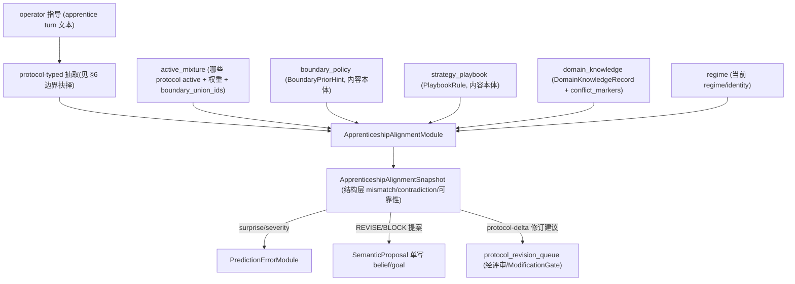

# DRAFT 提案：学徒对齐版本空间下沉到 Protocol / 控制器层

> **状态：Packet 1 + A1（PE overlay readout + 协议修订路径）已落地（SHADOW）。**
> Packet 1（protocol 层只读对比）已实现：vz-cognition 的 `ApprenticeshipAlignmentSnapshot` 增 `guidance_constraints`（enriched publisher）；vz-application 新增 `apprenticeship_protocol_alignment` owner（SHADOW），把 guidance 约束与编译后 strategy/knowledge 工件做有限选项集层比对。
> A1（2026-07-16，#90 残余）已实现：快照新增 `pe_overlay_magnitude` / `pe_overlay_source`（结构裁决派生的 PE-shaped 只读 overlay，application 侧消费——Step 2b 的 tier 约束落锤）与 `revision_proposals`（protocol-lineage 冲突 → 保守 WEIGHT_DECAY / L3 / 1-turn window typed 提案——Step 3）；`ProtocolRevisionQueueModule` 增加 `apprenticeship_protocol_alignment` 依赖，同一 R10 gate + 人审队列 + dedup 路由（单 router，R8）。契约测试 `tests/contracts/test_apprenticeship_protocol_revision_path.py`。
> 现有内容层 token Jaccard 实现保持不变，作为 Goal B 兜底（M1 后 topic 相似度走 `semantic_topic_similarity` hybrid 接缝）。理论保证仍未实施（§8 触发条件未满足）。
> 本文件描述演进意图；已落地部分以代码为准。

---

## 1. 背景：为什么要改

现有 `apprenticeship_alignment` owner 把 operator 指导抽成自由文本约束（`IntentConstraint`），用**字符 bigram token Jaccard**与 `belief_assumption` / `goal_value` 等快照的文本做覆盖度/矛盾比对（stub embedding 对中文不可分，已实测 cosine 恒 1.0 → 退而用 Jaccard）。

两个根本问题：

1. **层级错位（R3/R4）**：在**表达/文本层**做语义判断，违背"内部控制在 token 之上、决策在控制器代码空间"的精神。换更强的 embedding 只是治标。
2. **有限选项集合不成立**：自由文本是开放无界空间，没有有限策略类 Π，论文（Reliable Active Apprenticeship Learning, Hanneke & Yang et al., ALT 2025）的可靠性 + eluder 保证在这层**无从定义**。

## 2. 核心修正：encode into emerged basis，不是 emerge new abstraction

澄清一个概念坑：系统里 ETA 的"涌现"是对 **AI 自身行为轨迹**涌现 option / action family（`vz-temporal` 的 `discover_latent_action_family` / `action_family_version`），是对"何时切换 β_t"的几何事件发现。

**一句外部指令不是行为轨迹，不能"涌现"出新抽象。** 正确且符合 R4 的做法是：

> 把新指导**编码 / 投影到「已经涌现 / 已声明」的有限结构表示**，在那一层比较。

- ❌ "对单句做在线 ETA 涌现" / "在原始连续 z_t 上比向量" —— 误用、且无干净 encoder。
- ✅ "把指令 typing 成 protocol 元素 / 映射到 regime / action_family 标签，在有限离散结构层比" —— 成立、可定义保证。

## 3. 分层版本空间：两个产品目标对应论文不同部分

论文沿我们两个目标干净裂成两半：

| 产品目标 | 操作对象 | 有限选项集 | 借用论文哪部分 | 比较机制 |
|---|---|---|---|---|
| **Goal A**：指导 vs 认知、可靠性 | 有限控制器/protocol/regime 选项 | ✅ 成立 | 可靠性区 + eluder（**下沉到此层才有定义**） | 结构元素 entailed/informative/inconsistent |
| **Goal B**：教材/指导内部矛盾 | 开放内容（事实/价值断言） | ❌ 不成立 | 带噪专家 + 版本空间塌空（**不用 eluder**） | NLI / 一致性（仍可在内容层，但只做矛盾不做可靠性保证） |

**结论**：Goal A 的版本空间**下沉到 protocol / 控制器层**；Goal B 的矛盾检测可保留内容层（NLI），但明确它拿不到也不需要 eluder 保证。

## 4. 首选靶子：BehaviorProtocol 层比对

`vz-contracts/behavior_protocol.py` 已提供**有限、typed、带 confidence/review_level 的结构化选项集**：

- `StrategyPrior`（`problem_pattern` + `recommended_ordering`/`recommended_pacing` + `avoid_patterns`）
- `BoundaryContract`（hard rule / `blocked_topics` / `refer_out_required`）
- `IdentityAssertion`（`requires_self_traits` / `forbidden_self_traits` / `required_regime_compatibility`）
- `KnowledgeSeed`（含 `conflict_markers`）

且**"utterance → 这些结构"的 extractor 已存在**（lifeform 层）：`lifeform-protocol-runtime` 的 `document_uptake` / `mentor_intake`、`lifeform-service/protocol_uptake.py`。

在这一层，对比/矛盾有**精确定义**（不再靠文本相似度）：

- 同 `problem_pattern` 上两条 `StrategyPrior` 的 `recommended_ordering` 相反 → **矛盾**（Goal B 的 strategy 级）；
- 新指令抽出的 `BoundaryContract` 与 active 的 boundary 撞（同 `blocked_topics` 但 `refer_out_required` 相反等）→ **矛盾**；
- `IdentityAssertion.required_self_traits` ∩ 某条 `forbidden_self_traits` ≠ ∅ → **身份矛盾**；
- 新指令是 active mixture 已有的 → **entailed（无信息，agreement 区，可靠）**；新增 → **informative（V 收缩，disagreement 区，标未把握）**。

**这一层"有限选项集合成立"** → 可靠性谓词与 eluder 信息量在此才真正有定义。

第二锚（更深，建议后置）：把"这条指导期望哪个 `regime_id` / `action_family`"对上"当前 active 的是哪个"——离散标签比对，不碰连续 z_t。

## 5. owner 依赖重定向（关键设计变更）

现有依赖：`belief_assumption` / `goal_value` / `user_model` / `boundary_consent` / `regime`（在 NL 文本上比）。

**目标依赖**（在 protocol-compiled 结构上比）：

要点：

- `active_mixture`（owner = `vz-application.ProtocolRegistryModule`，SHADOW）**只发 IDs + 权重 + boundary_union_ids，不发内容本体**（DATA_CONTRACT §`active_mixture` 契约语义）。所以**内容**要从 compiled application owners 读：`boundary_policy`（BoundaryPriorHint）、`strategy_playbook`（PlaybookRule）、`domain_knowledge`（DomainKnowledgeRecord，已带 `conflict_markers`）。
- "当前逻辑"= 这些 compiled 结构 + active_mixture 选了哪些 + regime。这就是 operator 指导要对比的"现状"。
- 信念修正仍走 `SemanticProposal` 单写 belief/goal（不变）；**新增**：当指导真正改变"怎么做"（策略/边界/身份）时，应产出 **protocol-delta 修订建议**进 `protocol_revision_queue`，经评审 / `ModificationGate`，而不是只写 memory（呼应 R-MI：改行为→protocol，记经验→memory）。

## 6. 库边界抉择（必须先拍板）

铁律：**`vz-*` 不能 import `lifeform-*`**。而 utterance→protocol 的现成 extractor 在 lifeform 层。两条合规路线二选一：

- **路线甲（lifeform 层 typing）**：operator 指令在 lifeform/platform 层先用现成 uptake 抽成 typed protocol-delta，作为已 typed 输入喂进 kernel；alignment owner 只消费 `active_mixture` + compiled snapshots + 这批 typed delta。
  - 优点：复用现成 extractor，不在内核造轮子；符合"内核不持有产品层 extractor"。
  - 缺点：需要一条把 typed delta 送进 kernel 的契约通道（类似 `dialogue_external_outcome` 那种单一 typed 入口）。
- **路线乙（vz 层 protocol-shaped extractor）**：在 vz-cognition 放一个产出 protocol 元素的抽取接口（类似现有 `GuidanceConstraintExtractor`，但输出 `StrategyPrior`/`BoundaryContract` 等 vz-contracts 类型），LLM 实现可注入。
  - 优点：内核自洽，owner 依赖图干净。
  - 缺点：与 lifeform 层 uptake 逻辑重复，需防分叉（SSOT 风险）。

> **建议：路线甲**（typed delta 走单一 kernel 入口契约），避免在内核重建 protocol 抽取。但这需要新增一条 typed 通道，工作量更大。请拍板。

> **Packet 1 已决（边界硬约束）**：protocol 层对比 owner 落在 **`vz-application`**（`application/modules/apprenticeship_protocol_alignment.py`，slot `apprenticeship_protocol_alignment`）。原因：编译后 protocol 内容（`PlaybookRule` / `KnowledgeHit` / `BoundaryPolicySnapshot`）与迁移后的 `active_mixture` owner 都在 vz-application，而 `vz-cognition` 不能 import `vz-application`（tier order + import-boundary CI）。所以草案原"路线乙（vz 层 extractor）"对**比对编译内容**这步行不通——真正可行的是把 owner 放到能看见这些内容的 application 层。Packet 1 用 enriched `guidance_constraints` 跨 owner 传递 guidance 表示（不重抽）。guidance→protocol-typed 的真正抽取（路线甲/乙）仍待后续。

## 7. 比较算子（结构层，取代 Jaccard）

不再用文本相似度，而是**按 protocol 元素类型逐类做结构匹配**：

- Strategy：按 `problem_pattern` 归组（仍需一个语义归组器——可先用现有 embedding 仅做**候选召回**，判定用结构字段）；`recommended_ordering` / `avoid_patterns` 的集合关系判 entailed / informative / inconsistent。
- Boundary：`blocked_topics` 交集 + `refer_out_required` / `severity` 对比。
- Identity：trait 集合的 required/forbidden 交叉。
- Knowledge：复用 `DomainKnowledgeRecord.conflict_markers` 既有冲突标记。

**embedding 退居"候选召回"**（找"可能讲同一件事的 protocol 元素"），**判定走结构字段**——这既绕开了 stub embedding 不可分的问题，又把决策放回结构层。

## 8. 论文映射与学习理论保证

- Goal A 下沉到 protocol 层后，**有限选项集合成立** → 可靠性谓词（agreement→可自主 / disagreement→标未把握）与 eluder 信息量有定义。
- **但仍建议暂不填 eluder/Massart-Tsybakov 上下界数学**：除非要做"有界 operator 查询预算下的可靠自治"（让 AI 自判"这个我有把握不用问你"并给频率保证）。当前产品目标是检测+对比+标记，不需要 PAC 上界。
- 触发条件（何时再填理论保证）：当出现"最小化 operator 介入 + 形式化可靠性"这个明确目标时，且 Π 已稳定在 protocol/regime 有限空间上。

## 9. 迁移与回滚（WiringLevel 三态）

- **当前**：内容层 Jaccard 版，SHADOW，保留为过渡兜底（无 protocol/LLM 时）。
- **Step 1（draft 落地）✅ 已完成**：vz-application 新增 protocol 层比较路径（`apprenticeship_protocol_alignment`，SHADOW），消费 enriched `guidance_constraints` + 编译后 strategy/knowledge 工件，结构层 covered/novel/conflict 判定 + 候选召回。注：当前 owner 与上游 `apprenticeship_alignment` 都是 SHADOW，`propagate` 中 SHADOW→SHADOW 依赖拿不到（SHADOW 输出不进 active 链），所以默认全 SHADOW 配置下本 owner inert，靠 standalone 单测验证；要在 propagate 里真正点亮需先把 `apprenticeship_alignment` 升 ACTIVE。
- **Step 2a（门控）✅ 已完成**：`build_final_runtime_modules` / `run_final_wiring_turn` 新增 `apprenticeship_turn: bool = False` 参数，取代写死的 `apprenticeship=True`。默认 False → 普通 turn 发布 idle apprenticeship 快照、**不向 PE 注入每轮 Jaccard surprise**；调用方（知道 `trigger_kind` 的 lifeform `run_turn`）在 apprentice/ingestion turn 设 True。这是安全激活的前提。
- **Step 2b（✅ 已落锤，A1 2026-07-16）**：⚠️ 草案原写"PE overlay 改读 protocol 层 mismatch"**不可行**——PE 在 `vz-cognition`，protocol 层 owner 在 `vz-application`（下游），PE 跨不了 tier。**落锤**：protocol 裁决经**两条 application-tier 路径**进学习——(a) `protocol_revision_queue`（行为学习面：conflict → typed 修订提案 → R10 gate，对应 R-MI「改行为→protocol」）；(b) 快照自带 `pe_overlay_magnitude` / `pe_overlay_source` PE-shaped 只读 readout（evidence/telemetry 消费，report-only）。PE 的 overlay 继续挂在内容层 `apprenticeship_alignment`（kernel-tier 认识论 surprise），且仅在 `apprenticeship_turn=True` 时触发。credit/reflection 直接消费 protocol 快照的路线**不采用**（避免 kernel-tier 类型跨界 import）。
- **Step 2c（lifeform）✅ 已完成**：`apprenticeship_turn` 已贯通三层——`LifeformSession.run_turn`（按 `is_apprenticeship_trigger(trigger_kind)`，signature-guard 透传）→ `BrainSession.run_turn_async`/`run_turn` → `AgentSession.run_turn` → `run_final_wiring_turn`。默认 False，全部 additive/backward-compatible。门控现在在真实 apprentice/ingestion turn 自动点亮，普通 chat turn 保持 idle（不向 PE 注噪）。`test_agent_session_runner` 49/49 通过。
- **Step 3（✅ 已完成，A1 2026-07-16）**：protocol-delta 修订建议进 `protocol_revision_queue`。alignment owner 对 protocol-lineage（`protocol:{id}:playbook/knowledge:{entry}`，compiler 命名约定精确解析）conflict 产出保守提案（WEIGHT_DECAY / L3 / `observation_window_turns=1` → gate 恒 QUEUED_FOR_HUMAN，单句 operator 指导永不静默改协议）；非 lineage 工件（case-derived 等）不出提案，其修订仍走 reflection。`ProtocolRevisionQueueModule` 是唯一 router（dedup by proposal_id 跨 turn 保持）。
- 任一步可回滚到 SHADOW/DISABLED；内容层 Jaccard 版本始终保留为 fallback。

## 10. 待决问题（请拍板）

1. **库边界路线**：甲（lifeform 层 typing + kernel typed 通道）还是乙（vz 层 protocol-shaped extractor）？
2. **protocol-delta 修订是否纳入本期**：还是先只做"检测/对比/PE"，修订建议留到后续？
3. **Goal B 矛盾检测层级**：是否保留内容层 NLI（开放断言矛盾），还是只在 protocol 元素层做矛盾（放弃 protocol 之外的事实矛盾检测）？
4. **strategy 归组器**：embedding 候选召回是否可接受（仅召回、判定走结构），还是要求纯结构归组？
5. **eluder/噪声理论保证**：确认本期不填？

## 11. 不改什么

- 现有 shipped 实现（`apprenticeship/` 内容层版本 + 测试）保持，作为过渡/兜底，不删。
- R8/R-PE/单写者/SHADOW-first/可回滚 等不变量全部沿用。
- 本草案只在敲定后，按 convergence-packet workflow 分步改代码 + 同步 [`apprenticeship-alignment.md`](./apprenticeship-alignment.md)。

## 12. 参考

- [`apprenticeship-alignment.md`](./apprenticeship-alignment.md) — 现状 spec
- [`protocol-runtime.md`](./protocol-runtime.md) — BehaviorProtocol / active_mixture / 编译路径
- `docs/DATA_CONTRACT.md` §`active_mixture` 契约语义 — IDs+权重，不发内容本体
- `docs/next_gen_emogpt.md` — R3/R4（控制器空间）、R-MI（人类指导分流 protocol vs memory）、R-PE
- Hanneke, Yang, Wang & Song, *Reliable Active Apprenticeship Learning*, ALT 2025, PMLR 272:512-538
