# Common Adapter 与 Character Package

## Purpose 与 owner

本契约定义“一个进程级共享 Common Adapter Model + 每角色一个不可变特色包”。
它不新增 kernel semantic owner：

- `vz-substrate` 是 L1 `CommonAdapterBundle`、rare-heavy delta、State-KV
  generator、control basis 和 L2 Prefix/KV 数值载体的唯一 owner；
- `lifeform-domain-character` 是 `CharacterPackageManifest` 与角色 bake
  provenance 的唯一 owner；
- `lifeform-service` 只校验、注册和按 session 的 typed `character_id` 路由，
  不解释角色语义，不从文本推断人物身份；
- L3 memory / personal / relationship conditioning 仍按 `tenant_scope` 隔离，
  永远不得写回 L1/L2 artifact。

## 分层与正式契约

| 层 | 正式 artifact | 生命周期 | 可变性 |
|---|---|---|---|
| L0 | frozen base model + weights SHA-256 | process | frozen |
| L1 | `CommonAdapterBundle` (`common-adapter-bundle.v1`) | process | offline rare-heavy only |
| L2 | `CharacterPackageManifest` (`character-package-manifest.v1`) | character | offline bake only |
| L3 | tenant memory + conditioning snapshot | tenant:user/session | bounded online |

`CommonAdapterBundle` 必须同时携带：

1. 非空 `SubstrateRareHeavyCheckpoint` adapter payload；
2. personal/relationship `PrefixKVArtifact` State-KV generator；
3. `ControlBasisArtifact`；
4. `common_adapter_version`、base `model_id`、模型权重 SHA-256，以及由全部
   nested artifact 派生的 `compatibility_fingerprint`；
5. cognition `ModificationGate.OFFLINE` 的 allow/deny 记录、validation delta、
   capacity cost、evaluation ref 和 rollback evidence。

runtime 加载 L1 时重新解析本地 Hugging Face snapshot 并计算权重文件摘要，随后
校验 model id、hidden width、hook layers、rare-heavy runtime fingerprint、
State-KV geometry 与 control basis geometry。任一漂移 fail loudly。省略整个 bundle
是 byte-identical rollback；运行时禁止替换 bundle 或在线改基础权重。

`CharacterPackageManifest` 统一绑定：

- `character_id / character_name`；
- `base_model_id + common_adapter_version + compatibility_fingerprint`；
- 必选 `LifeformTemplate` content-addressed ref；
- 推荐 `CharacterPrefixKVPackage` ref；
- 可选 PEFT Character LoRA directory ref；
- held-out behavior fidelity evidence；
- OFFLINE gate record 和 rollback evidence；
- `revalidation_mode = full-rebake | fidelity-only`。

manifest、template、Prefix/KV、LoRA 目录与 fidelity report 都是内容寻址的不可变
对象。ACTIVE 必须有 Prefix/KV、held-out + source-immutable + feedback-free pass、
相同 L1 双指纹和可逆 allow gate；包含角色 LoRA 时还必须有
`base + common adapter + character LoRA` 组合臂证据。

## 训练顺序

```mermaid
flowchart LR
    D["跨角色 live-through / companion / 通用能力 trace"] --> RH["PEFT rare-heavy<br/>Qwen q_proj/v_proj/o_proj"]
    RH --> CK["冻结 base + rare-heavy"]
    CK --> SKV["State-KV teacher/student distillation"]
    SKV --> P["OFFLINE ModificationGate proposal"]
    P --> G["cognition gate record"]
    G --> B["CommonAdapterBundle vN"]
    B --> CB["角色 Prefix/KV bake"]
    CB --> F["held-out behavior fidelity"]
    F --> M["CharacterPackageManifest"]
```

`scripts/train_common_adapter_model.py train` 是 L1 唯一入口：先运行
`PeftLoraRareHeavyBackend`，再把 standalone checkpoint 传给
`train_state_kv_prefix.py --common-adapter-checkpoint`。后者在 reference norm、
teacher、student、wrong-user control 的所有前向都安装同一 delta，并在训练 manifest
发布 `training_order=base+rare-heavy->state-kv` 与 checkpoint digest。`publish`
必须消费 cognition 产生且 proposal id 精确匹配的 gate record，训练脚本禁止自批。

`scripts/bake_zhang_wuji_character_package.py`（后续角色可使用同形入口）必须加载
ACTIVE L1、核对基础权重哈希，并在 `base + common adapter vN` 前向上测 reference
norm、teacher-force 角色 Prefix/KV。无 fidelity/gate 时只产出 SHADOW manifest；
提供证据时必须通过 `CharacterPackageManifest.require_active()` 才能写出可晋升包。

## 多角色 session 路由

`CharacterPrefixKVRegistry` 是进程内只读注册表，键为 typed `character_id`。每个
entry 同时冻结 manifest package id、L1 version/fingerprint、wiring level 和
Prefix/KV package。`POST /v1/sessions` 可提交 `character_id`；service 只接受与所选
vertical 声明的 immutable character id 完全一致的值。随后 expression 每次调用
`runtime.generate(character_id=...)`：

- ACTIVE entry 拼入该角色的 DynamicCache slots；
- SHADOW entry 只在 `GenerationResult.character_prefix_shadow_id` 留下载入事实；
- unknown / 空 character id 不注入；
- 可选 Character LoRA 只在该角色当前 generate 的上下文管理器内激活。

同一 transformers runtime 仍是串行 decode；多个角色包可以同驻内存，但 L3
conditioning 和 memory 必须继续按 tenant:user 隔离。

## Evidence 与升级

`GenerationResult.character_id / character_prefix_applied /
character_prefix_id / character_prefix_wiring_level / character_prefix_shadow_id`
只证明物理路由，不证明角色 fidelity。行为晋升证据只能来自 manifest 指向的 held-out
report 与 gate record。

L1 从 vN 升级到 vN+1 时，所有 L2 manifest 因双指纹不匹配而自动失效：

- `full-rebake` 必须在新 L1 上重新 bake Prefix/KV，再跑 fidelity；
- `fidelity-only` 可复用原载体，但仍必须对新组合跑 held-out fidelity 并重新 gate；
- `scripts/revalidate_character_packages.py` 批量处理 fidelity-only，并把
  full-rebake 项明确报告为 pending，绝不静默改签。

回滚 L1 是移除新 bundle 或恢复前一 bundle；回滚 L2 是 registry entry 从 ACTIVE
切到 SHADOW/DISABLED 或恢复前一 manifest。两者均无需修改 base 或 L3 状态。

## Deprecated carrier

`CharacterResidualAdapterPackage` 已废弃，只保留旧 artifact 的 SHADOW 审计与回滚
读取能力，不得与统一 manifest 同时 ACTIVE，也不得新建晋升证据链。角色表达层只允许
Prefix/KV 与可选 PEFT Character LoRA 两档数值载体。
