# Common Adapter 与 Character Package

> Status: L1/L2 contracts、per-session 多角色路由与 SHADOW attestation 已落地；ACTIVE 仍受证据门约束
> Last updated: 2026-08-01

## Purpose 与 owner

本契约定义“一个进程级共享 Common Adapter Model + 每角色一个不可变特色包”。
它不新增 kernel semantic owner：

- `vz-substrate` 是 L1 `CommonAdapterBundle`、rare-heavy delta、State-KV
  generator、control basis 和 L2 Prefix/KV 数值载体的唯一 owner；
- `lifeform-domain-character` 是 `CharacterPackageManifest` 与角色 bake
  provenance 的唯一 owner；
- `lifeform-service` 只校验、注册和按 session 的 typed `character_id` 路由，
  不解释角色语义，不从文本推断人物身份；
- L3 memory / personal / relationship conditioning 仍按 `tenant_scope` 隔离，
  永远不得写回 L1/L2 artifact。

## 分层与正式契约

| 层 | 正式 artifact | 生命周期 | 可变性 |
|---|---|---|---|
| L0 | frozen base model + weights SHA-256 | process | frozen |
| L1 | `CommonAdapterBundle` (`common-adapter-bundle.v1`) | process | offline rare-heavy only |
| L2 | `CharacterPackageManifest` (`character-package-manifest.v1`) | character | offline bake only |
| L3 | tenant memory + conditioning snapshot | tenant:user/session | bounded online |

`CommonAdapterBundle` 必须同时携带：

1. 非空 `SubstrateRareHeavyCheckpoint` adapter payload；
2. personal/relationship `PrefixKVArtifact` State-KV generator；
3. `ControlBasisArtifact`；
4. `common_adapter_version`、base `model_id`、模型权重 SHA-256，以及由全部
   nested artifact 派生的 `compatibility_fingerprint`；
5. cognition `ModificationGate.OFFLINE` 的 allow/deny 记录、validation delta、
   capacity cost、evaluation ref 和 rollback evidence。

runtime 加载 L1 时重新解析本地 Hugging Face snapshot 并计算权重文件摘要，随后
校验 model id、hidden width、hook layers、rare-heavy runtime fingerprint、
State-KV geometry 与 control basis geometry。任一漂移 fail loudly。省略整个 bundle
是 byte-identical rollback；运行时禁止替换 bundle 或在线改基础权重。
`COMMON_ADAPTER_BUNDLE_PATH` 是独立的 L1 启动入口：即使没有加载任何 L2 manifest，
启动器也必须解析 bundle、执行 `require_active()` 并把它交给 runtime；禁止只在角色包
存在时才加载，或把显式配置的 bundle 静默降成 base-only。Unix shell 与 Windows
PowerShell 两个 browser-chat 入口必须保持同一 admission 与 per-session binding 语义。

`CharacterPackageManifest` 统一绑定：

- `character_id / character_name`；
- `base_model_id + common_adapter_version + compatibility_fingerprint`；
- 必选 `LifeformTemplate` content-addressed ref；
- 推荐 `CharacterPrefixKVPackage` ref；
- 可选 PEFT Character LoRA directory ref；
- held-out behavior fidelity evidence；
- OFFLINE gate record 和 rollback evidence；
- `revalidation_mode = full-rebake | fidelity-only`。

manifest、template、Prefix/KV、LoRA 目录与 fidelity report 都是内容寻址的不可变
对象。ACTIVE 必须有 Prefix/KV、held-out + source-immutable + feedback-free pass、
相同 L1 双指纹和可逆 allow gate。角色 LoRA 还需要 prefix-only / LoRA-only /
prefix+LoRA 三臂证据；该 typed evidence 未落地前含 `lora_ref` 的 manifest 只能
SHADOW。

## 训练顺序

```mermaid
flowchart LR
    D["跨角色 live-through / companion / 通用能力 trace"] --> RH["PEFT rare-heavy<br/>Qwen q_proj/v_proj/o_proj"]
    RH --> CK["冻结 base + rare-heavy"]
    CK --> SKV["State-KV teacher/student distillation"]
    SKV --> P["OFFLINE ModificationGate proposal"]
    P --> G["cognition gate record"]
    G --> B["CommonAdapterBundle vN"]
    B --> CB["角色 Prefix/KV bake"]
    CB --> F["held-out behavior fidelity"]
    F --> M["CharacterPackageManifest"]
```

`scripts/train_common_adapter_model.py train` 是 L1 唯一入口：先运行
`PeftLoraRareHeavyBackend`，再把 standalone checkpoint 传给
`train_state_kv_prefix.py --common-adapter-checkpoint`。后者在 reference norm、
teacher、student、wrong-user control 的所有前向都安装同一 delta，并在训练 manifest
发布 `training_order=base+rare-heavy->state-kv` 与 checkpoint digest。`publish`
必须消费 cognition 产生且 proposal id 精确匹配的 gate record，训练脚本禁止自批。
`common-adapter-candidate.v2` ID 同时绑定训练集 digest/数量、LoRA 与 State-KV 全部超参数、hook layers
和两个随机种子。`train_common_adapter_model.py evaluate` 在同一冻结 runtime 上运行
base、candidate、wrong-state teacher-forced NLL 臂，把 typed held-out coverage、负控、
capacity cost 和 rollback readout 交给 cognition `ModificationGate.OFFLINE`；deny 是正式
证据，不能通过手写 gate record 或降低断言绕过。
`publish` 必须重算 observation summary/cognition decision，并同时核对 held-out digest、
evaluation report SHA-256 与 gate `evaluation_ref`，不得只凭 candidate id 接收 allow。

### Forge rare-heavy request boundary

Forge 第五阶段只在 L1 训练入口之前增加 content-addressed build request，不改变本节 owner：

- `forge plan-rare-heavy` 绑定 base model id/weights SHA-256、traces、control basis、held-out corpus、
  显式 hook layers、全部 LoRA/State-KV 超参数与评估阈值；请求固定
  `owner=vz-substrate`、`requested_wiring=DISABLED`、
  `training_order=rare-heavy→state-kv→offline-gate`、`training_decides_gate=false`；
- 请求只写 `artifacts/`，不能成为 runtime bundle path，也不能触发 train/evaluate/publish；
- `validate_common_adapter_evidence()` 是 substrate pipeline 的公开只读验证 seam，统一复核
  candidate nested artifact、State-KV manifest、held-out report 和 cognition gate；`publish_bundle()`
  复用同一 seam，避免裁决与发布形成两套验证逻辑；
- loop-external `forge_common_adapter_adjudicator.py` 还要逐项核对请求与 candidate provenance、
  control/checkpoint、held-out digest、评估阈值及 gate decision。只有全部匹配且 gate 是可逆
  ALLOW 才输出 `READY`，其他情况为 `STOP`；READY 仍不执行 publish。

本阶段没有新的真实 GPU candidate/ALLOW evidence；因此该接口的落地不改变任何现有 L1 ACTIVE
资格。回滚只需停止生成请求或删除未发布的 request/verdict；已发布 L1 仍按本 spec 的 bundle
回滚规则处理。

`scripts/bake_zhang_wuji_character_package.py`（后续角色可使用同形入口）必须加载
ACTIVE L1、核对基础权重哈希，并在 `base + common adapter vN` 前向上测 reference
norm、teacher-force 角色 Prefix/KV。无 fidelity/gate 时只产出 SHADOW manifest；
提供证据时必须通过 `CharacterPackageManifest.require_active()` 才能写出可晋升包。
`scripts/evaluate_character_package.py` 运行 common-only 与
common + Character Prefix/KV（以及 manifest 声明时的真实 PEFT Character LoRA）组合
臂，输出 fidelity report、evidence、gate record 与 evaluated manifest。Gate proposal
必须绑定 exact ungated candidate content id，且 gate 绑定 report SHA-256。
内置 NLL 评测只能发布 `system_self_eval`；不得把同一 report 重标为 LLM judge 或
external validation。manifest locator 重定位时，proposal 绑定重定位后的 ungated id。

## 多角色 session 路由

`CharacterPrefixKVRegistry` 是进程内只读注册表，键为 typed `character_id`。每个
entry 同时冻结 manifest package id、L1 version/fingerprint、wiring level 和
Prefix/KV package。service loader 同时发布不可变 `CharacterSessionBinding`，把
`character_id → manifest package id → content-addressed LifeformTemplate path →
Prefix/KV registry key → optional Character LoRA figure id` 冻结成一次正式交换。
`POST /v1/sessions` 可提交任一已加载且非 DISABLED 的 `character_id`；所选 vertical
只需实现 `CharacterPackageTemplateAdapter`，不再要求该 id 等于 vertical 的历史硬编码
默认角色。显式 `template_id` 不得覆盖 manifest 的 content-addressed template。

SessionManager 从 binding 调用 `give_birth`，并把该 session 的 `character_id` 与角色
LoRA scoped pool 绑定到新 Lifeform；expression synthesizer 的 id 来自此 session
binding，而不是 vertical factory 的硬编码值。若 dynamic id 与 vertical 的历史默认 id
不同，默认角色专属 grounding text 必须清空，角色语义只由 manifest template owner
发布。随后 expression 每次调用 `runtime.generate(character_id=...)`：

- ACTIVE entry 拼入该角色的 DynamicCache slots；
- SHADOW entry 只在 `GenerationResult.character_prefix_shadow_id` 留下载入事实；
- unknown / 空 character id 不注入；
- 可选 Character LoRA 只在该角色当前 generate 的上下文管理器内激活。

Character LoRA 使用 `CharacterRuntimeAssets` 私有的 `PersonaLoRAPool`，不得注册到
进程级 default pool。DLaaS figure/persona LoRA 继续使用 per-ai_id pool；两者同时存在时
角色 manifest LoRA 优先，且只允许一个 activation context，角色没有已晋升 LoRA 时才
允许 figure/persona LoRA 激活，禁止 nested activation 或 last-register-wins 覆盖。
当前 `includes_character_lora` 只证明旧组合臂，不满足重量档晋升；在包 F 的
prefix-only / LoRA-only / prefix+LoRA typed 消融证据落地前，任何含 `lora_ref` 的
manifest 都只能 SHADOW，`active_eligible` 与 service loader 双重 fail-closed。

同一 transformers runtime 仍是串行 decode；多个角色包可以同驻内存，但 L3
conditioning 和 memory 必须继续按 tenant:user 隔离。

### 启动安全默认与环境契约

正式浏览器启动入口 `start_browser_chat_qwen.sh` 与张无忌 wrapper 使用以下契约：

- `CHARACTER_PACKAGE_MODE` 的进程默认值是 `shadow`，只接受
  `disabled|shadow|active`；未显式晋升时加载包只产生 SHADOW attestation；
- `CHARACTER_PACKAGE_WIRING` 是可选的逗号分隔 `character_id=mode` 覆盖表，同一
  character id 重复、缺 `=` 或未知 mode 均在启动时 fail loudly；
- `CHARACTER_PACKAGE_MANIFESTS` 非空时必须同时提供可读的
  `COMMON_ADAPTER_BUNDLE_PATH`；L1 必须已通过 allow gate，manifest 与 L1 的 model、
  version、compatibility fingerprint 和 artifact SHA 必须一致；
- ACTIVE entry 必须通过 `manifest.require_active()`；base weights SHA-256、nested
  carrier geometry 或 manifest artifact digest 任一不一致均拒绝启动，不降级 SHADOW；
- 生成路径对空或 unknown `character_id` 不注入 Prefix/KV；离线
  `score_conditioned_continuation(character_id=...)` 为防 evidence candidate 静默变成
  control arm，对 unknown/SHADOW id 反而必须 fail loudly；
- `POST /v1/sessions` 的 `character_id` 只接受 loader 发布的
  `CharacterSessionBinding`；不允许从用户文本猜角色，unknown
  或 DISABLED id 返回 typed `invalid_character_id`；`GET /v1/verticals` 发布可选 id。
- `ZHANG_WUJI_CHARACTER_PREFIX_MODE=active` 永久拒绝；legacy 单 Prefix 路径只允许
  SHADOW attestation；`ZHANG_WUJI_CHARACTER_RESIDUAL_MODE=active` 同样永久拒绝，
  residual 只保留显式 SHADOW 回滚审计。ACTIVE 唯一入口是
  `CHARACTER_PACKAGE_MANIFESTS`，必须经过 `manifest.require_active()`。

张无忌现有 residual artifact 只作为 `CharacterResidualAdapterPackage` 的 SHADOW、
只读回滚证据保留；新角色以及重新 bake 的张无忌特色载体只走统一
`CharacterPackageManifest + Character Prefix/KV`（可选真实 PEFT Character LoRA）。
旧 residual 与新 manifest 禁止同时 ACTIVE，也不得为 residual 新建晋升证据。

## Evidence 与升级

`GenerationResult.character_id / character_prefix_applied /
character_prefix_id / character_prefix_wiring_level / character_prefix_shadow_id`
只证明物理路由，不证明角色 fidelity。行为晋升证据只能来自 manifest 指向的 held-out
report 与 gate record。

SHADOW 的正式语义是 **attestation-only**：loader 校验 manifest、L1 双指纹和全部
artifact digest，注册 typed binding/registry entry；生成时不拼 Prefix/KV、不激活角色
LoRA，只在 `GenerationResult.character_prefix_shadow_id` 留下载入事实。SHADOW 不做
legacy 单包与 registry 的在线双注入/输出并跑；数值 parity 由离线 evaluate 的 matched
arms 负责，避免把未经晋升的载体带入 serving forward。

L1 从 vN 升级到 vN+1 时，所有 L2 manifest 因双指纹不匹配而自动失效：

- `full-rebake` 必须在新 L1 上重新 bake Prefix/KV，再跑 fidelity；
- `fidelity-only` 可复用原载体，但仍必须对新组合跑 held-out fidelity 并重新 gate；
- `scripts/revalidate_character_packages.py` 批量处理 fidelity-only，并把
  full-rebake 项明确报告为 pending，绝不静默改签。

回滚 L1 是移除新 bundle 或恢复前一 bundle；回滚 L2 是 registry entry 从 ACTIVE
切到 SHADOW/DISABLED 或恢复前一 manifest。两者均无需修改 base 或 L3 状态。

## Deprecated carrier

`CharacterResidualAdapterPackage` 已废弃，只保留旧 artifact 的 SHADOW 审计与回滚
读取能力，不得与统一 manifest 同时 ACTIVE，也不得新建晋升证据链。角色表达层只允许
Prefix/KV 与可选 PEFT Character LoRA 两档数值载体。

`ZHANG_WUJI_CHARACTER_PACKAGE_PATH` 同样是 legacy SHADOW-only 单 Prefix 入口。退出条件：
张无忌 unified manifest 首次以 ACTIVE 在正式默认启动路径稳定发布后保留一个版本作为
显式回滚观察窗，下一版本删除该环境变量、loader 分支和对应文档；观察窗内回滚只允许
切 manifest 为 SHADOW/DISABLED 或显式启用 legacy SHADOW，绝不恢复 legacy ACTIVE。
