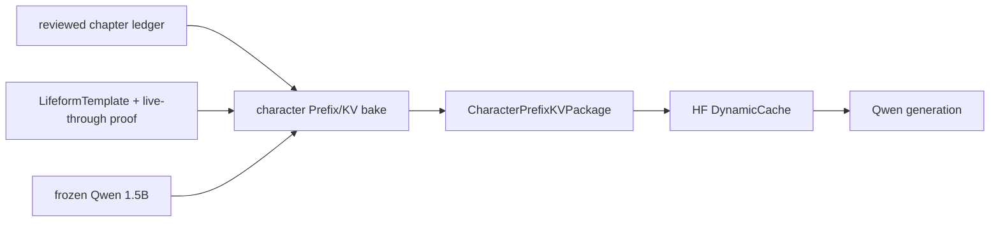

# Character Prefix/KV Package

## Purpose

Character live-through establishes lifeform state and owner hydration. A
separate rare-heavy bake may compile reviewed character decisions into a
bounded, frozen-substrate Prefix/KV carrier for a target model family. This
carrier is an application artifact, not a new semantic owner and not a prompt
substitute for the live-through memory checkpoint.

## Contract

`CharacterPrefixKVPackage` (`character-prefix-kv-package.v1`) contains:

- character identity and the source `LifeformTemplate` identity hash;
- a locator plus digest for the reviewed live-through proof;
- the source live-through `model_id` and the target bake `model_id`;
- the exact target `model_id`;
- a fixed, finite state vector and its declared coordinate labels;
- a `PrefixKVArtifact` with per-layer K/V geometry and measured norm caps.

The package ID is the SHA-256 of its canonical payload. Loading validates the
package ID, nested artifact ID, model ID, layer count, KV head count, head
dimension, coordinate count, finite values and positive reference norms.

## Data Flow

The base model remains frozen. The runtime concatenates the static character
slots with an explicitly selected personal Prefix/KV carrier when both are
present. No module may infer character identity from text matching or recreate
the package from a prompt. A missing or incompatible package fails loudly on
the pinned Zhang Wuji 1.5B startup path; a generic runtime with no package is
unchanged.

## Evidence Boundary

`GenerationResult.character_prefix_applied` and
`GenerationResult.character_prefix_id` attest physical carrier delivery only.
They do not prove canonical behavior fidelity. The bake source, training loss,
and held-out behavior evaluation remain separate evidence records. Rollback is
to unset `ZHANG_WUJI_CHARACTER_PACKAGE_PATH`, which restores the prior frozen
Qwen path without changing the LifeformTemplate or its memory checkpoint.
