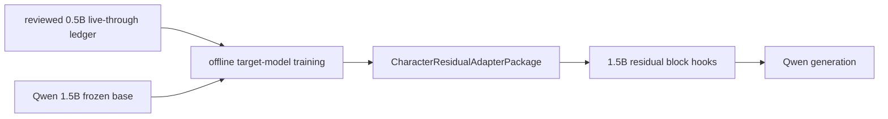

# Character Residual Adapter Package

## Purpose

`CharacterResidualAdapterPackage` is the model-side artifact for a reviewed
character. It is distinct from the `LifeformTemplate`, application case
memory, relationship conditioning and Character Prefix/KV package. The
template and reviewed ledger provide training provenance; the adapter is
trained again on the pinned target model.

## Contract

The package records:

- target `model_id` and `hidden_size`;
- exact residual hook layers;
- source live-through model, template integrity hash and proof digest;
- bounded per-layer residual vectors;
- training mode, sample count and final teacher-forcing loss;
- a SHA-256 content address over the complete canonical payload.

Loading fails loudly on model ID, hidden width, layer availability, vector
width, finite-value or delta-cap mismatches. A 0.5B artifact cannot be loaded
into a 1.5B runtime, even when both are Qwen models.

## Data Flow



The base Qwen parameters remain frozen. The adapter is injected only through
the explicit substrate path. `GenerationResult.character_residual_applied`
and `character_residual_adapter_id` attest physical delivery; they do not by
themselves establish behavior quality.

## Rollout

`start_browser_chat_zhang_wuji.sh` points at the target-model artifact but
keeps `ZHANG_WUJI_CHARACTER_RESIDUAL_MODE=shadow` by default. Active delivery
requires:

```bash
ZHANG_WUJI_CHARACTER_RESIDUAL_MODE=active \
  bash start_browser_chat_zhang_wuji.sh
```

Prefix/KV remains independently controlled and shadow by default. The
residual adapter and Prefix/KV paths are not simultaneously promoted until a
held-out behavior-quality gate passes for the residual arm.
