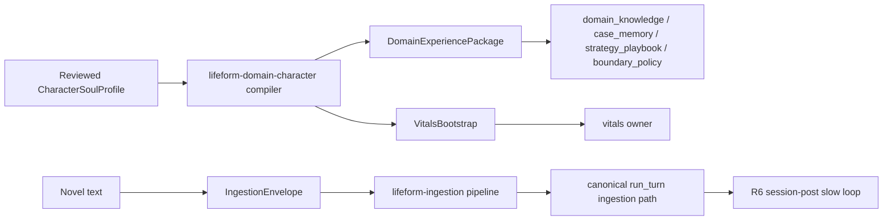

# Character Soul Bootstrap Spec

> Status: draft
> Last updated: 2026-05-01
> 对应需求: R5, R6, R7, R8, R11, R14, R15

## 要解决的问题

如何把小说人物转成可审计、可回滚的 lifeform 冷启动材料，而不是把整本小说塞进 prompt 或新增一个 `PersonaModule` 抢占 memory / regime / semantic owners 的所有权。

## 关键不变量

- Character bootstrap 是 lifeform vertical，不是新的 brain kernel owner。
- 输入必须是 reviewed `CharacterSoulProfile` 或原文 `IngestionEnvelope`，不得通过关键词匹配从小说文本直接驱动行为。
- `CharacterSoulProfile` 编译到既有 `DomainExperiencePackage`、`VitalsBootstrap` 和 ingestion envelope。
- factual / value seeds 进入 `domain_knowledge`，signature cases 进入 `case_memory`，pacing priors 进入 `strategy_playbook`，boundaries 进入 `boundary_policy`。
- 原文小说只通过 `lifeform-ingestion` 走 `LifeformSession.run_turn(..., trigger_kind=INGESTION)`，durable 化仍由 R6 session-post slow loop 负责。
- 回滚通过 package ID、envelope ID 和 evidence lineage 进行，不直接删除 owner 私有状态。

## 接口契约

新 wheel：

```text
packages/lifeform-domain-character/
```

公开 API：

- `CharacterSoulProfile`：reviewed 角色画像，不做文本推断。
- `build_character_package(profile)`：产出 `DomainExperiencePackage`。
- `build_character_vitals_bootstrap(profile)`：产出 `VitalsBootstrap`。
- `build_character_ingestion_envelope(profile, novel_text, ...)`：产出 `IngestionEnvelope(source_kind=BOOK)`。

## 数据流



## 与其他能力域的关系

| 关系 | 能力域 | 说明 |
|---|---|---|
| 依赖 | Domain Experience Layer | 角色画像编译成已有 package 数据结构 |
| 依赖 | Runtime Ingestion | 小说原文通过 canonical ingestion path 进入 |
| 依赖 | Lifeform Vitals | 角色 drive profile 通过 `VitalsBootstrap` 表达 |
| 协作 | Cognitive Regime | 角色风格通过 case / playbook / delayed credit 影响 regime，而不是成为 prompt 标签 |
| 协作 | Semantic State Owners | 深层关系、价值、边界仍由九个 semantic owners 持有并发布 |

## 变更日志

- 2026-05-01: 初始版本。新增 `lifeform-domain-character` vertical，落地同仓、异包、强边界的 character bootstrap 路线。
