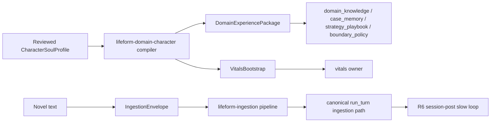

# Character Soul Bootstrap Spec

> Status: draft
> Last updated: 2026-05-01
> 对应需求: R5, R6, R7, R8, R11, R14, R15

## 要解决的问题

如何把小说人物转成可审计、可回滚的 lifeform 冷启动材料，而不是把整本小说塞进 prompt 或新增一个 `PersonaModule` 抢占 memory / regime / semantic owners 的所有权。

## 关键不变量

- Character bootstrap 是 lifeform vertical，不是新的 brain kernel owner。
- 输入必须是 reviewed `CharacterSoulProfile` 或原文 `IngestionEnvelope`，不得通过关键词匹配从小说文本直接驱动行为。
- `CharacterSoulProfile` 编译到既有 `DomainExperiencePackage`、`VitalsBootstrap` 和 ingestion envelope。
- factual / value seeds 进入 `domain_knowledge`，signature cases 进入 `case_memory`，pacing priors 进入 `strategy_playbook`，boundaries 进入 `boundary_policy`。
- 原文小说只通过 `lifeform-ingestion` 走 `LifeformSession.run_turn(..., trigger_kind=INGESTION)`，durable 化仍由 R6 session-post slow loop 负责。
- 回滚通过 package ID、envelope ID 和 evidence lineage 进行，不直接删除 owner 私有状态。

## 接口契约

新 wheel：

```text
packages/lifeform-domain-character/
```

公开 API：

- `CharacterSoulProfile`：reviewed 角色画像，不做文本推断。
- `build_character_package(profile)`：产出 `DomainExperiencePackage`。
- `build_character_vitals_bootstrap(profile)`：产出 `VitalsBootstrap`。
- `build_character_ingestion_envelope(profile, novel_text, ...)`：产出 `IngestionEnvelope(source_kind=BOOK)`。

## 数据流



## 与其他能力域的关系

| 关系 | 能力域 | 说明 |
|---|---|---|
| 依赖 | Domain Experience Layer | 角色画像编译成已有 package 数据结构 |
| 依赖 | Runtime Ingestion | 小说原文通过 canonical ingestion path 进入 |
| 依赖 | Lifeform Vitals | 角色 drive profile 通过 `VitalsBootstrap` 表达 |
| 协作 | Cognitive Regime | 角色风格通过 case / playbook / delayed credit 影响 regime，而不是成为 prompt 标签 |
| 协作 | Semantic State Owners | 深层关系、价值、边界仍由九个 semantic owners 持有并发布 |

## Lifeform Template + Birth Pipeline (waves T1-T11, 2026-05-09)

This wheel now ships a full "novel → lived brain → saveable template → give_birth" pipeline. The 11 waves layered on top of the original character bootstrap:

| Wave | What landed | Public API |
|---|---|---|
| T1 | `NarrativeScene` / `NarrativeArc` schema + reviewed 张无忌 demo arc | `lifeform_domain_character.{NarrativeScene, NarrativeArc, build_zhang_wuji_demo_arc}` |
| T2 | `ExperientialReplayDriver` — drives a NarrativeArc through a Lifeform with PE回流 via existing `submit_dialogue_outcome` path | `ExperientialReplayDriver`, `ReplayReport`, `SceneReplayRecord` |
| T3 | First-person rewriter helper + Track.SELF attribution pinning | `to_first_person`, `FirstPersonRewriteResult` |
| T4 | `LifeformTemplate` schema + JSON serialization + `IncompatibleTemplateVersion` | `LifeformTemplate`, `LifeformTemplateManifest`, `ApplicationOwnerState`, `compute_template_integrity_hash` |
| T5 | `save_lifeform_template` — extract lived state to disk | `save_lifeform_template`, `SaveLifeformTemplateResult` |
| T6 | `give_birth` — reincarnate from saved template, drives anchored at saved levels | `give_birth`, `RebirthBundle` |
| T7 | LLM-assisted profile extraction with mandatory human review | `extract_profile_candidate`, `review_profile_candidate`, `ReviewedProfileCandidate` |
| T8 | LLM-assisted scene extraction (reviewed) | `extract_arc_candidate`, `review_arc_candidate`, `NarrativeArcCandidate` |
| T9 | Pure-function drive shape evolution proposer | `compute_drive_shape_evolution`, `DriveShapeEvolution`, `DriveSpecDelta` |
| T10 | Rare-heavy `ModificationGate.OFFLINE` apply + `invert_delta` rollback drill | `apply_drive_evolution_through_gate`, `DriveEvolutionApplyResult`, `GatedDriveSpecDelta`, `invert_delta` |
| T11 | End-to-end demo (`examples/character_full_lifecycle_demo.py`) + regression test | — |

**Key invariants preserved across all waves**:

* No new brain owner — every wave layers on existing R8-compliant export / restore APIs (`MemoryStore.create_checkpoint`, `Lifeform(memory_store=...)`, owner-side `restore_checkpoint` paths).
* `LifeformTemplate` is a saveable artifact, not a runtime owner; it has a typed `schema_version` (current `1`) and `give_birth` raises `IncompatibleTemplateVersion` on mismatch.
* `integrity_hash` covers profile + evolved_profile + vitals_bootstrap + vitals_drive_levels + application_state — i.e. the **identity payload**. Memory checkpoint and replay report are excluded because their dynamic ids prevent stable canonicalisation; both have their own typed schema versions.
* LLM-assisted extraction (T7 / T8) returns *candidates*; the final typed artifact requires `review_profile_candidate` / `review_arc_candidate` with non-empty reviewer + locator.
* Drive evolution (T10) goes through `ModificationGate.OFFLINE` with `validation_delta ≥ 0.05` + `capacity_cost ≤ 0.75` + non-empty `rollback_evidence` + `is_reversible=True`. Inverting a delta and re-applying it through the gate must recover the base profile (rollback drill, pinned by `tests/contracts/test_rare_heavy_apply.py`).
* All test data (張无忌 profile, demo NarrativeArc, sample excerpts) is reviewer-paraphrased original content — no verbatim copyrighted novel text ships in the wheel.

## Chapter Subjective Live-Through（逐章主观烘焙，2026-07-13）

完整角色烘焙不是把整本小说作为第三人称材料塞入 memory，也不是把所有人物事实塞进一个巨型 profile。对 fictional character，正式 lived artifact 是按章节排序的 reviewed subjective ledger：

| Artifact | Owner / 位置 | 作用 |
|---|---|---|
| `ReviewedChapterExperience` | `lifeform-domain-character.chapter_experience` | 每章 coverage record：`experienced / learned / not-known / no-change`，包含 epistemic cutoff、证据 locator、reviewer、主观 known facts、被排除的未来/他者事实 |
| `CharacterSemanticEventBundle` | `lifeform-domain-character.chapter_experience` | 将 reviewed relationship / belief / goal / commitment / boundary 变化作为 typed proposal source 交给 semantic owners |
| `ChapterLiveThroughLedger` | bake artifact | 按 chapter_index 排序的全书账本；每章必须有 coverage，允许 `no-change`，禁止静默跳章 |
| `ChapterLiveThroughDriver` | `lifeform-domain-character.chapter_replay` | 仅编排现有 session API：semantic events → `run_turn(APPRENTICE)` → decision turn → typed outcome → `end_scene` |

关键不变量：

- 原文小说只作为离线抽取和人工审查输入；runtime replay 消费 reviewed paraphrase / typed event，不消费原文。
- LLM 辅助抽取只产 candidate ledger；operator CLI 从 `PROTOCOL_LLM_*` 构造外部 OpenAI-compatible client（默认 `PROTOCOL_LLM_PROVIDER=openrouter` + `PROTOCOL_LLM_API_KEY`），不得改用内部 substrate 或绕过 review gate。
- `NOT_KNOWN` 章节不能携带 scenes、known facts 或 semantic events；未来知识和他者私密心理只进入审计排除项。
- 只有角色亲历的关键选择运行 `NarrativeScene` replay；后来听说/学到的事实走 reviewed semantic event 或 application owner seed。
- `CharacterSemanticEvent` 只产 `SemanticProposal`，由 `SemanticStateStore` 单写者合并；角色 vertical 不直写 9 个 semantic owner。
- `LifeformTemplate` schema v2 可携带 `OwnerPersistenceSnapshot(owner_name="semantic_state")`，重生时复用 owner hydration 协议恢复 semantic spine。

回滚：

- Template v1 仍可读取；未携带 owner hydration snapshots 的模板退化为原 profile/memory/vitals 路径。
- `build_character_ingestion_envelope(..., source_kind=BOOK)` 保留为“读资料”路径，但不得作为 fictional protagonist 主观人生 bake 的 ACTIVE 主路径。

## 变更日志

- 2026-07-13: 新增逐章主观 live-through contract：`ReviewedChapterExperience` / `CharacterSemanticEventBundle` / `ChapterLiveThroughLedger` / `ChapterLiveThroughDriver`。明确 raw BOOK ingestion 不能代表主角亲历；LifeformTemplate v2 通过 owner hydration snapshot 持久化 semantic spine；operator CLI 可通过 `PROTOCOL_LLM_*` 使用外部 OpenRouter/OpenAI-compatible LLM 生成 candidate ledger，仍需人工 review。
- 2026-05-09: Lifeform Template + Birth Pipeline 完整落地（T1-T11）。新增模块：`narrative.py` / `replay.py` / `first_person.py` / `template.py` / `template_save.py` / `template_load.py` / `extraction/profile_llm.py` / `extraction/scene_llm.py` / `evolution.py` / `rare_heavy_apply.py` / `arcs/zhang_wuji_demo_arc.py`。新增 80+ 个契约 / e2e 测试。`examples/character_full_lifecycle_demo.py` 演示完整管线。
- 2026-05-01: 初始版本。新增 `lifeform-domain-character` vertical，落地同仓、异包、强边界的 character bootstrap 路线。
