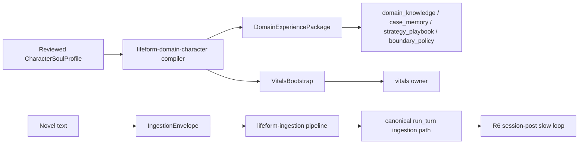

# Character Soul Bootstrap Spec

> Status: draft
> Last updated: 2026-05-01
> 对应需求: R5, R6, R7, R8, R11, R14, R15

## 要解决的问题

如何把小说人物转成可审计、可回滚的 lifeform 冷启动材料，而不是把整本小说塞进 prompt 或新增一个 `PersonaModule` 抢占 memory / regime / semantic owners 的所有权。

## 关键不变量

- Character bootstrap 是 lifeform vertical，不是新的 brain kernel owner。
- 输入必须是 reviewed `CharacterSoulProfile` 或原文 `IngestionEnvelope`，不得通过关键词匹配从小说文本直接驱动行为。
- `CharacterSoulProfile` 编译到既有 `DomainExperiencePackage`、`VitalsBootstrap` 和 ingestion envelope。
- factual / value seeds 进入 `domain_knowledge`，signature cases 进入 `case_memory`，pacing priors 进入 `strategy_playbook`，boundaries 进入 `boundary_policy`。
- 原文小说只通过 `lifeform-ingestion` 走 `LifeformSession.run_turn(..., trigger_kind=INGESTION)`，durable 化仍由 R6 session-post slow loop 负责。
- 回滚通过 package ID、envelope ID 和 evidence lineage 进行，不直接删除 owner 私有状态。

## 接口契约

新 wheel：

```text
packages/lifeform-domain-character/
```

公开 API：

- `CharacterSoulProfile`：reviewed 角色画像，不做文本推断。
- `build_character_package(profile)`：产出 `DomainExperiencePackage`。
- `build_character_vitals_bootstrap(profile)`：产出 `VitalsBootstrap`。
- `build_character_ingestion_envelope(profile, novel_text, ...)`：产出 `IngestionEnvelope(source_kind=BOOK)`。

## 数据流


```mermaid
flowchart LR
    NovelText["Novel text"] --> IngestionEnvelope["IngestionEnvelope"]
    ReviewedProfile["Reviewed CharacterSoulProfile"] --> CharacterCompiler["lifeform-domain-character compiler"]
    CharacterCompiler --> DomainPackage["DomainExperiencePackage"]
    CharacterCompiler --> VitalsBootstrap["VitalsBootstrap"]
    DomainPackage --> ExistingOwners["domain_knowledge / case_memory / strategy_playbook / boundary_policy"]
    VitalsBootstrap --> VitalsOwner["vitals owner"]
    IngestionEnvelope --> IngestionPipeline["lifeform-ingestion pipeline"]
    IngestionPipeline --> CanonicalTurn["canonical run_turn ingestion path"]
    CanonicalTurn --> SlowLoop["R6 session-post slow loop"]
```

## 与其他能力域的关系

| 关系 | 能力域 | 说明 |
|---|---|---|
| 依赖 | Domain Experience Layer | 角色画像编译成已有 package 数据结构 |
| 依赖 | Runtime Ingestion | 小说原文通过 canonical ingestion path 进入 |
| 依赖 | Lifeform Vitals | 角色 drive profile 通过 `VitalsBootstrap` 表达 |
| 协作 | Cognitive Regime | 角色风格通过 case / playbook / delayed credit 影响 regime，而不是成为 prompt 标签 |
| 协作 | Semantic State Owners | 深层关系、价值、边界仍由九个 semantic owners 持有并发布 |

## Lifeform Template + Birth Pipeline (waves T1-T11, 2026-05-09)

This wheel now ships a full "novel → lived brain → saveable template → give_birth" pipeline. The 11 waves layered on top of the original character bootstrap:

| Wave | What landed | Public API |
|---|---|---|
| T1 | `NarrativeScene` / `NarrativeArc` schema + reviewed 张无忌 demo arc | `lifeform_domain_character.{NarrativeScene, NarrativeArc, build_zhang_wuji_demo_arc}` |
| T2 | `ExperientialReplayDriver` — drives a NarrativeArc through a Lifeform with PE回流 via existing `submit_dialogue_outcome` path | `ExperientialReplayDriver`, `ReplayReport`, `SceneReplayRecord` |
| T3 | First-person rewriter helper + Track.SELF attribution pinning | `to_first_person`, `FirstPersonRewriteResult` |
| T4 | `LifeformTemplate` schema + JSON serialization + `IncompatibleTemplateVersion` | `LifeformTemplate`, `LifeformTemplateManifest`, `ApplicationOwnerState`, `compute_template_integrity_hash` |
| T5 | `save_lifeform_template` — extract lived state to disk | `save_lifeform_template`, `SaveLifeformTemplateResult` |
| T6 | `give_birth` — reincarnate from saved template, drives anchored at saved levels | `give_birth`, `RebirthBundle` |
| T7 | LLM-assisted profile extraction with mandatory human review | `extract_profile_candidate`, `review_profile_candidate`, `ReviewedProfileCandidate` |
| T8 | LLM-assisted scene extraction (reviewed) | `extract_arc_candidate`, `review_arc_candidate`, `NarrativeArcCandidate` |
| T9 | Pure-function drive shape evolution proposer | `compute_drive_shape_evolution`, `DriveShapeEvolution`, `DriveSpecDelta` |
| T10 | Rare-heavy `ModificationGate.OFFLINE` apply + `invert_delta` rollback drill | `apply_drive_evolution_through_gate`, `DriveEvolutionApplyResult`, `GatedDriveSpecDelta`, `invert_delta` |
| T11 | End-to-end demo (`examples/character_full_lifecycle_demo.py`) + regression test | — |

**Key invariants preserved across all waves**:

* No new brain owner — every wave layers on existing R8-compliant export / restore APIs (`MemoryStore.create_checkpoint`, `Lifeform(memory_store=...)`, owner-side `restore_checkpoint` paths).
* `LifeformTemplate` is a saveable artifact, not a runtime owner; it has a typed `schema_version` (current `1`) and `give_birth` raises `IncompatibleTemplateVersion` on mismatch.
* `integrity_hash` covers profile + evolved_profile + vitals_bootstrap + vitals_drive_levels + application_state — i.e. the **identity payload**. Memory checkpoint and replay report are excluded because their dynamic ids prevent stable canonicalisation; both have their own typed schema versions.
* LLM-assisted extraction (T7 / T8) returns *candidates*; the final typed artifact requires `review_profile_candidate` / `review_arc_candidate` with non-empty reviewer + locator.
* Drive evolution (T10) goes through `ModificationGate.OFFLINE` with `validation_delta ≥ 0.05` + `capacity_cost ≤ 0.75` + non-empty `rollback_evidence` + `is_reversible=True`. Inverting a delta and re-applying it through the gate must recover the base profile (rollback drill, pinned by `tests/contracts/test_rare_heavy_apply.py`).
* All test data (張无忌 profile, demo NarrativeArc, sample excerpts) is reviewer-paraphrased original content — no verbatim copyrighted novel text ships in the wheel.

## Chapter Subjective Live-Through（逐章主观烘焙，2026-07-13）

完整角色烘焙不是把整本小说作为第三人称材料塞入 memory，也不是把所有人物事实塞进一个巨型 profile。对 fictional character，正式 lived artifact 是按章节排序的 reviewed subjective ledger：

| Artifact | Owner / 位置 | 作用 |
|---|---|---|
| `ReviewedChapterExperience` | `lifeform-domain-character.chapter_experience` | 每章 coverage record：`experienced / learned / not-known / no-change`，包含 epistemic cutoff、证据 locator、reviewer、主观 known facts、被排除的未来/他者事实 |
| `CharacterSemanticEventBundle` | `lifeform-domain-character.chapter_experience` | 将 reviewed relationship / belief / goal / commitment / boundary 变化作为 typed proposal source 交给 semantic owners |
| `ChapterLiveThroughLedger` | bake artifact | 按 chapter_index 排序的全书账本；每章必须有 coverage，允许 `no-change`，禁止静默跳章 |
| `ChapterLiveThroughDriver` | `lifeform-domain-character.chapter_replay` | 仅编排现有 session API：setting / decision turn → canonical `EnvironmentOutcome` → outcome assimilation turn → Internal-RL integration turn → reviewed semantic events → `end_scene` |

关键不变量：

- 原文小说只作为离线抽取和人工审查输入；runtime replay 消费 reviewed paraphrase / typed event，不消费原文。
- LLM 辅助抽取只产 candidate ledger；operator CLI 从 `PROTOCOL_LLM_*` 构造外部 OpenAI-compatible client（默认 `PROTOCOL_LLM_PROVIDER=openrouter` + `PROTOCOL_LLM_API_KEY`），不得改用内部 substrate 或绕过 review gate。
- `NOT_KNOWN` 章节不能携带 scenes、known facts 或 semantic events；未来知识和他者私密心理只进入审计排除项。
- 只有角色亲历的关键选择运行 `NarrativeScene` replay；后来听说/学到的事实走 reviewed semantic event 或 application owner seed。
- `CharacterSemanticEvent` 只产 `SemanticProposal`，由 `SemanticStateStore` 单写者合并；角色 vertical 不直写 9 个 semantic owner。
- `LifeformTemplate` schema v2 可携带 owner-published hydration snapshots；重生时复用同一协议恢复 semantic spine、regime、PE/credit learned heads、reflection learner 与 `joint_loop.learning`。
- scene 的 reviewed terminal 只作为 `EnvironmentMeasurement(task_progress=1, terminal=True)` 的外部事实；character vertical 不发布 `action_payoff`，reward 仍由 PE owner 的 `ActualOutcome` 与 PE-derived credit 形成。
- character bake 是 reviewed trajectory 的 teacher-forced live-through：decision turn 先运行，随后 canonical action 与 outcome 作为已发生的一人称经历进入 assimilation；它证明经验进入学习链，不等同于“当前策略已能自主复现 canonical action”的行为保真评估。
- reviewed semantic events 必须在对应章节的 scene choice/outcome 全部发生后才进入正式 owner；禁止先灌入章节结论再让角色做决定。
- bake proof 不得由 character consumer 遍历 owner 内部 dataclass：semantic owner 通过 `SemanticEventDelivery` 解释外部 event 是否落入声明 slot，Memory owner 通过 `entry_count()` 发布条目数量，runtime 通过 `AgentTurnResult.track_z_t_codes` 发布 world/self 的正式 `z_t` readout。
- 正式 bake profile 必须启用 `internal_rl_runtime_replay=ACTIVE`。每个 scene 都要证明 prior prediction id → EnvironmentOutcome → PE action context → world/self lineage-matched transition → `runtime-replay` optimizer update；只记录 dialogue outcome 不算 live-through。
- chapter/scene boundary 必须 drain session-post slow loop，并证明 memory entry 增长、delayed credit 发布、temporal prior 与 application owners（case memory / domain knowledge / strategy playbook / boundary policy）至少有正式写回。
- `joint_loop.learning` 使用现有严格 owner persistence snapshot（排除 episode-local pending replay）随模板 hydration snapshots 保存；重生时恢复 dual-track temporal / Internal-RL learned state，不把 world/self temporal 变成独立 hydration writer。

回滚：

- Template v1 仍可读取；未携带 owner hydration snapshots 的模板退化为原 profile/memory/vitals 路径。
- `build_character_ingestion_envelope(..., source_kind=BOOK)` 保留为“读资料”路径，但不得作为 fictional protagonist 主观人生 bake 的 ACTIVE 主路径。

## Independent Behavioral Fidelity Evaluation（独立行为保真评估，2026-07-28）

行为保真评估与 bake 是两个严格分离的阶段。bake 可以 teacher-force reviewed trajectory；
behavior evaluation 必须让冻结来源状态在一次性 sandbox 中自主作答，且 stimulus 只能包含
`setting / decision_point`，不得包含 `canonical_action / canonical_outcome`。

公开工件：

| 工件 | 作用 |
|---|---|
| `BehaviorFidelityStimulus` | oracle-free 场景与决策输入；自身发布 digest |
| `BehaviorFidelityReference` | 单独保存 reviewed canonical action/outcome；capture 阶段不可见 |
| `BehaviorFidelityCapture` | 自主响应、regime、abstract action、world/self `z_t`、sandbox/source 指纹和无反馈证明 |
| `ReviewedBehaviorFidelityAssessment` | digest-bound 语义审查；五维评分与逐维理由，不在运行时代码中做关键词判决 |
| `BehaviorFidelityReport` | fail-closed 单臂报告 |
| `BehaviorFidelityComparisonReport` | baked vs matched cold control；只有 baked 自身通过且领先达到阈值才能声明 learned behavior advantage |

五个评分维度：

1. `action_choice_alignment`
2. `protective_intent_alignment`
3. `risk_posture_alignment`
4. `situation_model_alignment`
5. `character_motivation_alignment`

关键不变量：

- capture 与 reference 物理分离；candidate response、stimulus、reference 都用 SHA-256 绑定审查。
- 评估只在 disposable sandbox 中运行；source template/profile 前后 digest 必须一致。
- 评估不调用 `submit_dialogue_outcome`、`submit_environment_outcome`、`end_scene` 或任何
  evaluation-to-learning 接口；sandbox 内 turn 导致的临时 fingerprint 变化直接丢弃。
- 文本语义由 reviewed assessment 或未来的结构化 LLM judge / 外部人评解释；禁止关键词、
  正则、字符串包含或词典把输出映射为 action。
- evidence source 必须标记为 `system_self_eval / llm_judge / external_validated`；
  非 external evidence 只能发布 diagnostic verdict。
- 单场景通过要求 source/feedback/sandbox/leakage 门全部通过、具体行动与 situation model
  达阈值且 overall score 达阈值。内部状态变化、`z_t` 非空或 regime 改变均不能替代行为通过。

第十二回首个 matched-control 暴露了 action-realization 断点：baked `0.000`，
cold `0.030`。首次链路收敛后得到 `0.840 vs 0.030`，但复核发现回答逐项来自
profile 预置的 `protecting-bystander-from-collateral`，并非第十二回实际行动，因此该
结果降级为 mechanism diagnostic，不能作为 bake learned advantage。

后续 profile-answer holdout 同时从 baked/cold 公共 profile 删除该 signature case
及 `crisis-decisive-when-bystander-at-risk` strategy prior。现状测试先稳定复现失败：
baked 错取光明顶旧案例；补齐 terminal `EnvironmentOutcome` →
`ExperiencedActionEvidence` → gated CaseMemory slow-loop 后，baked 新会话从
`case:slow-loop:held-out-action-bake:*:experienced-action:*` 召回第十二回的
reviewed action schema，cold 不具备该 lineage；原 action/outcome 均未进入动作 statement。
随后独立 synthetic unseen-transfer 场景把人物、地点与关系全部替换为陌生人威胁陌生
旅人：baked 仍从 ch-11 slow-loop lineage 发布“立即制止 + 言语喝止”的通用步骤，
cold 不具备该 schema，回答也不泄漏胡青牛、纪晓芙或 canonical outcome。这证明
reviewed abstraction 已跨 owner、跨 session 迁移；尚未证明 Internal RL 自主发现
schema，也尚未获得外部人类行为保真。

进一步的 schema-holdout gate 删除 ch-11 scene 的 reviewed action schema。bake 仍须
证明 action-time latent family/version/`z_t` digest 进入 gated application owner，
但对应 case 必须保持 `schema-pending` 且不可渲染；未见场景不得召回或复述原章节动作。
当前该 gate 已通过，因此可以声称 live-through 保留了 Internal RL 行为族 lineage；
仍不能声称系统自主形成了“立即制止 + 言语喝止”的语义抽象。

## 变更日志

- 2026-07-28: 增加 ch-11 action-schema holdout：latent family/version/`z_t` digest 经 terminal outcome 与 slow-loop 持久化，但 schema-pending case fail closed、未见场景拒绝 episode replay；结论限定为 Internal RL lineage 存活，不是自主语义抽象成功。
- 2026-07-28: 增加未见同构威胁场景迁移测试与 reviewed `EnvironmentActionSchema`：适用条件/动作步骤经 terminal outcome → session-post → CaseMemory persistence，检索不读取 action/outcome，baked/cold 与章节实体泄漏门通过；当前结论限定为 reviewed abstraction transfer。
- 2026-07-28: 增加 profile-answer holdout causal gate，并修复 lived action 只进 Memory/PE、未进入 CaseMemory 的断点：terminal scene outcome 经 typed evidence 和既有慢层 gate 写入 application owner、跨 session persistence 后再召回；baked/cold 公共 profile 不再含被测答案。此前 `0.840 vs 0.030` 降级为 mechanism diagnostic。
- 2026-07-28: 收敛 abstract action → concrete action 断点：CaseMemory owner 发布语义近邻 action grounding，ResponseAssembly 与 temporal action 同拍绑定，expression 只渲染 owner statement。同一第十二回 matched control 从 `0.000 vs 0.030` 变为 `0.840 vs 0.030`，当前仅为 llm-judge diagnostic pass。
- 2026-07-28: 新增独立只读 character behavior-fidelity harness。采用 oracle-free capture + digest-bound reviewed semantic assessment，冻结三态 evidence source，增加 baked/cold matched control 与无回灌证明。第十二回首个诊断为 fail，禁止用 Internal-RL 更新或 `z_t` 差异冒充行为保真。
- 2026-07-28: 修复“账本 replay 冒充 live-through”：scene outcome 现在通过 canonical `EnvironmentOutcome` 在下一拍进入 PE，随后以真实 runtime replay 结算 world/self 两轨并触发 `z_t` Internal RL；reviewed semantic events 改为 scene choice/outcome 之后发布，消除结论先于经历的因果泄漏；新增逐 scene 六门证明报告与单章证据模式。session-post slow loop 的详细结果成为 lifeform 公共只读证据，`joint_loop.learning` 与 reflection consolidation learner 进入 owner hydration 保存/恢复。最小验收章为第十二回“针其膏兮药其育”单场景。
- 2026-07-20: 首次全书烘焙落地（倚天屠龙记 40 回 → `zhang-wuji-live-through.json` template v2）。`split_source_chapters` 支持金庸版式回目标题（列首中文数字 + 全角空格 + 回目对句，如"一　天涯思君不可忘"）；chapter live-through prompt 升级 v2（`chapter_live_through.system.v2`）：主观锚点强制为命名角色本人，出生前/缺席章节必须 not-known/learned，禁止把父辈/他者视角误标为 experienced。
- 2026-07-13: 新增逐章主观 live-through contract：`ReviewedChapterExperience` / `CharacterSemanticEventBundle` / `ChapterLiveThroughLedger` / `ChapterLiveThroughDriver`。明确 raw BOOK ingestion 不能代表主角亲历；LifeformTemplate v2 通过 owner hydration snapshot 持久化 semantic spine；operator CLI 可通过 `PROTOCOL_LLM_*` 使用外部 OpenRouter/OpenAI-compatible LLM 生成 candidate ledger，仍需人工 review。
- 2026-05-09: Lifeform Template + Birth Pipeline 完整落地（T1-T11）。新增模块：`narrative.py` / `replay.py` / `first_person.py` / `template.py` / `template_save.py` / `template_load.py` / `extraction/profile_llm.py` / `extraction/scene_llm.py` / `evolution.py` / `rare_heavy_apply.py` / `arcs/zhang_wuji_demo_arc.py`。新增 80+ 个契约 / e2e 测试。`examples/character_full_lifecycle_demo.py` 演示完整管线。
- 2026-05-01: 初始版本。新增 `lifeform-domain-character` vertical，落地同仓、异包、强边界的 character bootstrap 路线。
