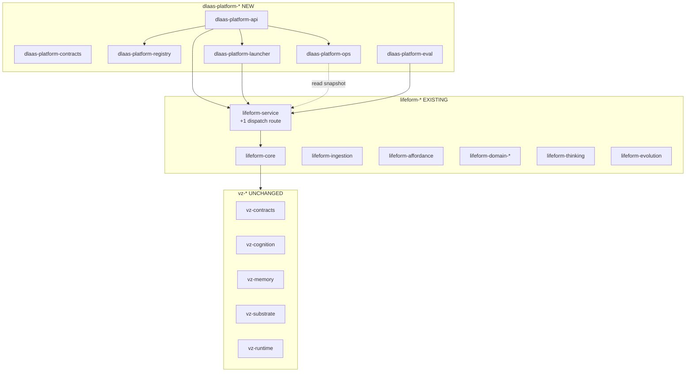

# DLaaS Platform Layer Spec

> Status: draft
> Last updated: 2026-05-09
> 对应需求: R2（稳定基底 + 自适应控制器）、R4（控制不在 token 空间）、R8（快照优先 / 单一所有者）、R11（内部状态可发布）、R15（迁移可解释性 + 可回滚）

## 要解决的问题

把 EmoGPT 的公开 DLaaS API（参见 `docs/api/DLAAS_README.md`）作为目标形状，在 VZ 现有 8 wheel 之上**新增第三层 wheel 前缀** `dlaas-platform-*`，承担：

1. **Control plane**：tenant / shell / asset / template / template_version / contract / focus_person / identity_link / handoff_ticket / exam / launch_license 的多租户资源治理；
2. **Runtime envelope 翻译**：把 typed `InteractionEnvelope`（chat / observe / feedback / teach / task / report / command）翻译成已有的 `LifeformSession.run_turn` / `BrainSession.submit_*_event` / `submit_dialogue_outcome` 调用；
3. **Ops**：pause / resume / operator-message / handoff queue / SSE conversations stream；
4. **Eval gate**：audience 分析 / exam runs / launch license（仅 readout，禁止反向写 kernel）。

**核心立场**：所有 control-plane 概念**不属于** `vz-cognition`（不是认知状态）、**也不属于** `lifeform-*`（不是产品适配）—— 它们是更高一层的"编排基底"，必须由独立 wheel 拥有，避免污染 R2/R4/R8 三条铁律。

## 关键不变量（CI / spec / PR review 共同强制）

1. **vz-* 内核 7 个 wheel diff = 0 行**。任何 PR 修改 `packages/vz-*` 都必须有显式书面理由（仅 substrate streaming 等 additive 接口可例外，需单独 review）。
2. **dlaas-platform-\* 禁止 import kernel 内部**。CI 由 [tests/contracts/test_import_boundaries.py](../../tests/contracts/test_import_boundaries.py) 强制：`dlaas-platform-*` 不允许 import `volvence_zero.{cognition,memory,temporal,substrate,application,runtime}.*` 任何子包；只能通过 `vz-contracts` 公共 snapshot 类型 + `lifeform-core.Lifeform` facade + `lifeform-service` HTTP 入口与内核交互。
3. **dlaas-platform-\* 禁止反向 import lifeform 适配 internal**。只能通过 `lifeform-service.app`（HTTP）+ `lifeform-core.Lifeform` 公共 facade + `lifeform-affordance` 公共描述符 schema 进入 lifeform 层；禁止直接 `from lifeform_domain_emogpt import ...`。
4. **interaction_type 必须 typed enum dispatch**。禁止从 `human_brief` 等自然语言字段用关键词匹配推断 interaction_type；客户端必须显式声明（守 [.cursor/rules/no-keyword-matching-hacks.mdc](../../.cursor/rules/no-keyword-matching-hacks.mdc)）。
5. **所有 control-plane 资源是平台层的 SSOT**。`tenant_state` / `contract_state` / `instance_status` / `handoff_ticket_state` 的唯一所有者是 `dlaas-platform-registry` / `dlaas-platform-launcher` / `dlaas-platform-ops`；其它任何 wheel 都只读它们发布的快照。
6. **focus_persons / identity_links 不创建第二 owner**。person profile / belief / preference / role 状态的所有者仍是 `vz-cognition.social` + `vz-cognition.semantic_state.user_model`；平台层只持有"哪些 person 属于这个 ai_id"的索引，写入路径只走 `BrainSession.submit_profile_event`。identity_links 只是把 canonical user 拼接为 `volvence_zero.memory.UserIdentity.scope_key`，0 改 vz-memory。
7. **handoff trigger = 平台读 rupture_state 快照**。`dlaas-platform-ops` 把 `vz-cognition.rupture_state.RuptureStateSnapshot` 作为 handoff 升级的 evidence，按 `RuptureKind` 决定阈值（守 [docs/specs/rupture-and-repair.md](./rupture-and-repair.md) 不变量）；**不**在 kernel 加任何 handoff owner。
8. **eval gate 只 readout 不学**。Audience / Exam / License 的 LLM judge 仅产 readout（自然性 / 简洁性等），禁止反向写回 reward / Face 梯度（守 EVO-2 + R12 + [docs/specs/evaluation.md](./evaluation.md)）。

## 三层 wheel 架构



## 接口契约

### Wheel 职责

| Wheel | 职责 | 边界规则 |
|---|---|---|
| `dlaas-platform-contracts` | 全部 frozen dataclass + JSON schema：`InteractionEnvelope` / `OutputAct` / `TenantSpec` / `ShellSpec` / `AssetSpec` / `TemplateSpec` / `ContractSpec` / `FocusPersonSpec` / `IdentityLinkSpec` / `HandoffTicketSpec` 等 | 零 lifeform / vz import；纯类型 |
| `dlaas-platform-registry` | SQLite/Postgres-backed 持久化 + auth 中间件；唯一 owner of tenant/shell/asset/template/contract/focus_person/identity_link/handoff_ticket | 不调内核；不调 lifeform-* internals |
| `dlaas-platform-launcher` | `InstanceManager`：管 `{ai_id → Lifeform}`，shared substrate，awake/sleep，LRU eviction | 通过 `lifeform-core.Lifeform` facade + `lifeform-service.SessionManager` 进入运行时 |
| `dlaas-platform-api` | aiohttp `/dlaas/*` router + 三种 auth header 中间件 + `OutputAct` 包装 | 端点入口，不持有任何 cognitive state |
| `dlaas-platform-ops` | pause/resume/operator-message/handoff queue/SSE conversations stream；ledger | 只读 rupture_state / vitals / pe 快照做 ops 决策 |
| `dlaas-platform-eval` | audience 分析 / exam runs / launch license gate | 复用 `lifeform-evolution` 框架；LLM judge 仅 readout |

### `InteractionEnvelope` → kernel 入口路由表

| `interaction_type` | kernel 入口 | 说明 |
|---|---|---|
| `chat` | `LifeformSession.run_turn(USER_INPUT)` | 普通对话 |
| `observe` | `IngestionPipeline.run` 或 `BrainSession.submit_{semantic_events,profile_event,task_event,reviewed_knowledge_event,tool_result}` | 按 `structured_context.observation_type` switch |
| `feedback` | `LifeformSession.submit_dialogue_outcome(kind=…)` | 复用 `DialogueExternalOutcomeKind` typed enum |
| `teach` / `task` | `LifeformSession.run_turn(trigger_kind=APPRENTICE)` | 复用 vitals apprentice override 路径 |
| `report` | `LifeformSession.end_scene(drain_slow_loop=True)` + reflection snapshot 投影 | 触发 R6 慢环 |
| `command` | 显式动作白名单（`refresh_person_context` → `submit_profile_event`、`pause_session` → ops pause、`end_scene` 等） | 禁止字面量 fallback |

### `OutputAct` 包装

平台层把 `volvence_zero.agent.response.AgentResponse + rationale_tags + AffordanceRegistry.snapshot` 包成 DLaaS wire format：

```python
@dataclass(frozen=True)
class OutputAct:
    act_type: str                  # text / image / system / tool_call ...
    capability: str                # text_streaming / markdown / image_display ...
    payload: Mapping[str, Any]     # {"content": "..."} 等
    degraded: bool = False         # 当 shell.embodiment 不支持原 capability 时退化
    original_capability: str = ""  # degraded=True 时记录原能力
```

shell 不接受的 capability 由 platform-api 在出站时 degrade 到 `text` + `degraded=True`，**不**让 kernel 感知 shell embodiment。

## 与其他能力域的关系

| 关系 | 能力域 | 说明 |
|---|---|---|
| 依赖 | Affordance | shell.embodiment 直接复用 4 Kind 描述符（Tool/Action/Organ/Shell） |
| 依赖 | Domain Experience Layer | template.runtime_template_id 必须命中已注册 vertical |
| 依赖 | Runtime Ingestion | asset 通过 `IngestionEnvelope` 进入；activate 触发 R6 沉淀 |
| 协作 | Rupture and Repair | handoff trigger 读 `rupture_state` snapshot |
| 协作 | Semantic State Owners | focus_persons / identity_links 写入只走 `submit_profile_event` |
| 协作 | Evaluation | exam / license 是 R12 readout，不是学习源 |
| 协作 | Multi-timescale Learning | platform 不跨任何时间尺度持有学习状态 |

## WiringLevel 迁移路径

按 [.cursor/rules/cursor-convergence-workflow.mdc](../../.cursor/rules/cursor-convergence-workflow.mdc) 三态迁移：

1. **DISABLED**：types 与 docs 已存在；端点已加但响应 503 / 标记 experimental。
2. **SHADOW**：端点开放；老 `/v1/sessions/...` 端点继续可用；契约测试 SHADOW 模式跑。
3. **ACTIVE**：完整契约测试 + 多租户隔离 + 持久化 + 完整生命周期 e2e 全绿后切换；老端点保留 ≥ 1 个 release cycle。

切片 7（测试集中收口）完成前，**所有平台 wheel 默认 SHADOW**；老 `/v1/sessions/...` 是 ACTIVE 主路径。

## 变更日志

- 2026-05-09: 初始版本。新增 6 个 `dlaas-platform-*` wheel 占位 + 8 条不变量；slot 占位（`tenant_state` / `contract_state` / `instance_status` / `handoff_ticket_state`）登记到 `docs/DATA_CONTRACT.md`。
