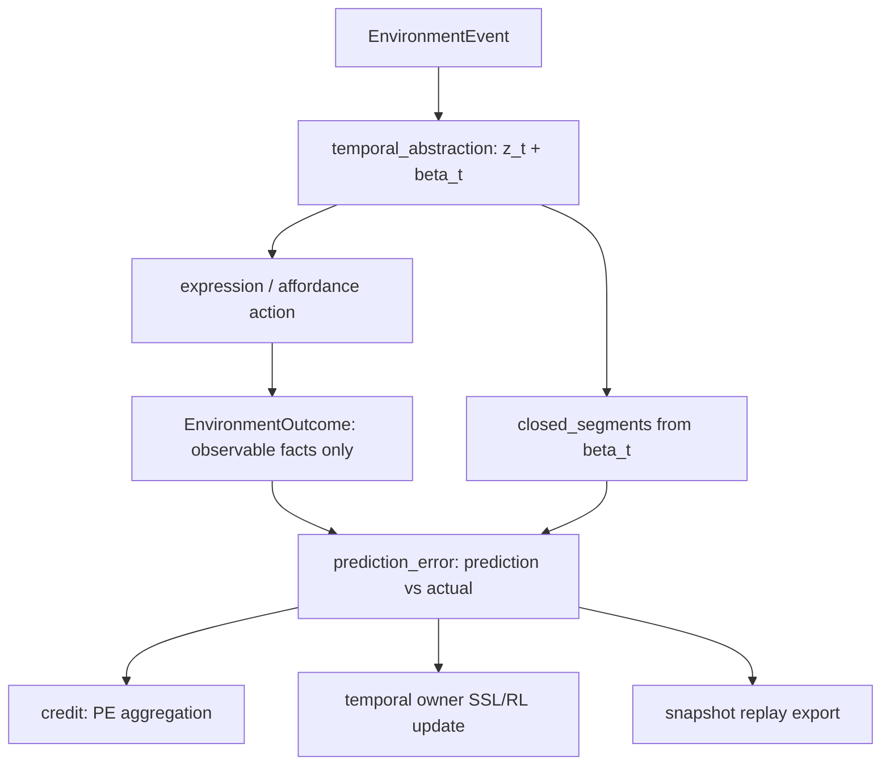

# Emergent Action Abstraction Spec

> Status: draft
> Last updated: 2026-05-02
> 对应需求: R-PE, R1, R3, R4, R8, R9, R10, R11, R13, R15

## 要解决的问题

Environment Interface 已经把聊天、工具结果、ingestion、tick / scene 等入口统一成 `EnvironmentEvent / EnvironmentOutcome`。但动作与环境反馈要进入 ETA / NL 的涌现抽象，不能再造一套平行的 action trace / ledger / encoder 系统。

第一性约束是：

- `prediction_error` 是唯一的预测-现实 mismatch owner。
- `temporal_abstraction` 是唯一的 `z_t / beta_t` 时间抽象 owner。
- `credit` 是 PE 的下游聚合层，不直接持有环境反馈。
- `EnvironmentOutcome` 只承载外部 adapter 能直接观察的事实。

因此，本能力域要解决的是：如何把复杂动作与环境反馈压进现有 PE-first、`z_t / beta_t`-centered 闭环，而不引入第二套 trace owner、delayed ledger 或 action encoder。

## 关键不变量

- 不新增 `action_outcome_trace` runtime slot。
- 不新增 `DelayedOutcomeLedger` owner；delayed outcome 的边界来自 `beta_t` segment closure。
- 不新增独立 Action/Outcome encoder owner；动作抽象仍由 metacontroller 在 `z_t` 空间学习。
- `EnvironmentOutcome` 不承载 trust / common-ground / commitment / information-gain 等语义 delta；这些由对应 owner 的 pre/post snapshot delta 计算。
- `prediction_error` snapshot 可以被丰富 action context，但 PE owner 仍是唯一 mismatch owner。
- replay 是既有 snapshot 序列的 append-only export，不是新的 runtime schema。

## Architecture Shape



## Layer 1. Minimal EnvironmentOutcome Observation Fields

`EnvironmentOutcome` 只添加外部 adapter / affordance invoker 可以诚实观察的字段：

| 字段 | 类型 | 默认 | 语义 |
|---|---|---|---|
| `latency_ms` | `int | None` | `None` | 外部动作端到端延迟 |
| `monetary_cost` | `float` | `0.0` | 归一化成本 |
| `reversibility` | `str` | `"reversible"` | `reversible` / `costly` / `irreversible` |
| `environment_state_delta_kind` | `str` | `"none"` | host / owner 控制枚举；默认无外部状态变化 |

显式不加入：

- `trust_delta`
- `common_ground_delta`
- `commitment_progress_delta`
- `information_gain`

这些不是 invoker 可观察事实，必须由 `relationship_state`、`common_ground`、`commitment`、memory / knowledge owner 自己发布并由 PE owner 读取。

## Layer 2. Temporal Segment Closure

ETA 的延迟结果边界来自 `beta_t` 的 segment 切换。Phase 1 在 `temporal_abstraction` 公共 snapshot 中发布 `closed_segments`。

不变量：

- `TemporalModule` / `TemporalAggregateModule` 仍是 segment 的唯一 owner。
- PE owner 只消费 `closed_segments`，不自己推断 segment 边界。
- 没有 horizon sweep ledger；跨 turn credit 的时间边界来自 segment closure。

## Layer 3. PE Action Context

Phase 1 丰富现有 PE dataclasses，而不是新增 trace snapshot：

- `PredictedOutcome`
- `ActualOutcome`
- `PredictionErrorSnapshot`

新增可选 action context：

- `segment_id`
- `abstract_action_id`
- `z_t_digest`
- `regime_id`
- `affordance_name`
- `environment_event_id`
- `environment_outcome_id`

PE owner 从 `temporal_abstraction`、`regime`、`affordance` 和 `EnvironmentOutcome` 可观察字段中读取 context，然后发布唯一 PE snapshot。

## Layer 4. Owner-Delta Evidence

复杂环境反馈由对应 owner 负责描述：

| 反馈 | 唯一 owner |
|---|---|
| trust / relationship movement | `relationship_state` |
| commitment progress | `commitment` |
| common-ground movement | `common_ground` |
| information gain | memory / domain knowledge owner |
| affordance latency / cost / reversibility | `EnvironmentOutcome` |

PE 读取这些 owner 的 pre/post public snapshot delta。消费者不得把这些 delta 填回 `EnvironmentOutcome` 或 renderer 文案。

## Layer 5. Credit From PE Segments

新增 helper：

```python
derive_segment_closure_credit_records(
    prediction_error_snapshot: PredictionErrorSnapshot,
    temporal_snapshot: TemporalAbstractionSnapshot,
) -> tuple[CreditRecord, ...]
```

语义：

- 只读 PE snapshot 与 temporal snapshot。
- 生成 keyed by `segment_id / abstract_action_id / z_t_digest` 的 credit records。
- 不读取 raw outcome text。
- 不持有 trace store。

## Layer 6. Snapshot Replay Export

Replay 是现有 snapshot 的 append-only artifact，不是 runtime slot：

- `EnvironmentEvent`
- `EnvironmentOutcome`
- `temporal_abstraction.closed_segments`
- `prediction_error`
- `credit`
- manifest / seed / git sha

Evidence bundle 根据这些既有 snapshot 生成 replay summary。导出层不得推断运行时状态。

## Acceptance Gates

- `pe-owner-remains-single`: 仓库不存在 runtime slot `action_outcome_trace`；PE 仍是唯一 mismatch owner。
- `segment-closure-from-beta`: delayed outcome 边界来自 temporal `closed_segments`。
- `outcome-fields-observable-only`: `EnvironmentOutcome` 不包含 trust / common-ground / commitment / information-gain semantic delta。
- `credit-from-pe-only`: segment/action credit records 只从 `PredictionErrorSnapshot` 派生。
- `replay-from-snapshots`: replay artifact 可由现有 snapshots 生成，不依赖 trace-specific runtime schema。
- `affordance-selection-no-rules`: affordance selection 仍走 metacontroller state，无硬编码 action routing。

## 与其他能力域的关系

| 关系 | 能力域 | 说明 |
|---|---|---|
| 依赖 | Environment Interface | 消费 `EnvironmentEvent / EnvironmentOutcome` |
| 依赖 | Prediction Error 主链 | PE owner 承载 action context 与 segment closure evidence |
| 依赖 | 时间抽象与内部控制 | `closed_segments` 由 `beta_t` / `z_t` owner 发布 |
| 依赖 | 信用分配与自修改 | credit 只从 PE 派生 segment/action records |
| 协作 | Affordance 体系 | affordance invoker 只填写可观察 outcome fields |
| 协作 | 证据计划 | replay artifact 由 existing snapshots 导出 |

## 回滚

- Outcome 字段都有默认值，旧调用不受影响。
- `closed_segments` 可为空。
- PE action context 可为空。
- segment credit helper 可不接 final wiring。
- replay export 是 out-of-turn artifact，可单独关闭。

## 变更日志

- 2026-05-02: 重写 Phase 1 方案，移除 `action_outcome_trace` owner / delayed ledger / action-outcome encoder owner，改为 PE + temporal segment closure 的 ETA/NL 第一性实现。
