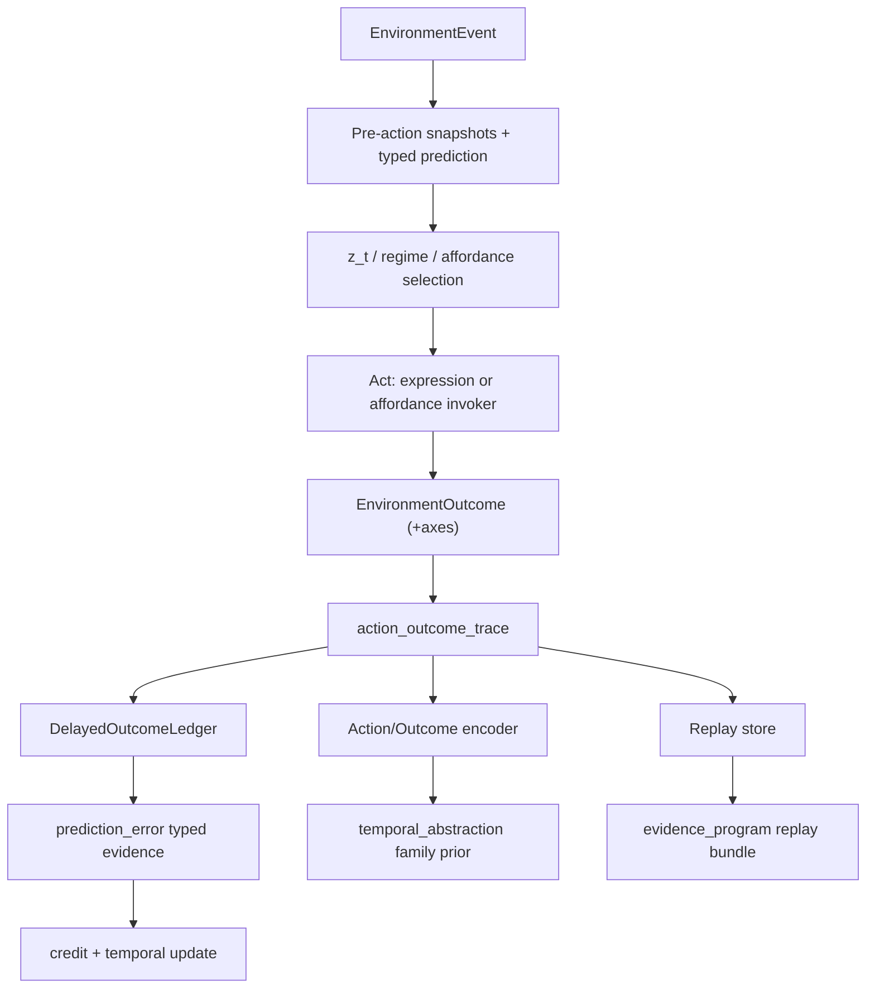

# Emergent Action Abstraction Spec

> Status: draft (Phase 0 design freeze)
> Last updated: 2026-05-02
> 对应需求: R-PE, R1, R3, R4, R8, R9, R10, R11, R15

## 要解决的问题

Environment Interface（`docs/specs/environment-interface.md`）已经把“环境事件如何进入内核”统一成 `EnvironmentEvent / EnvironmentOutcome`，但要让复杂的环境反馈真正变成可**涌现**的时间抽象（ETA `z_t / β_t`），还缺一段中间架构：

- 语言 substrate 有天然 residual 表示；**动作**和**环境反馈**没有。
- `submit_tool_result` 当前只能把 tool 结果折叠成 semantic event，无法稳定地做“预测 → 观察 → 误差 → 回放”。
- 多数环境反馈不是即时的：工具失败几轮后才显现，承诺几 scene 后才结算，关系信任跨 session 才变化。
- 没有一条可持久、可回放、可对比的“动作-结果”主链，ETA 强化学习只能在 token 空间学习，违反 R4。

本 spec 冻结把复杂环境反馈压成**可预测、可比较、可回放** `event / action / outcome / PE` 序列所需的 6 层架构。Phase 0 只锁定契约和边界；Phase 1 按 ACTIVE minimal 路线落地。

## 关键不变量

- 动作-结果轨迹由**唯一 owner**持有；其他 owner 不得重写开放 trace。
- 轨迹是机器可读的结构化证据，不是日志；所有字段来自上游 owner snapshot，不来自 renderer 文案。
- `EnvironmentOutcome` 的新增 axes 是**结构化数值**，不是关键词分类。
- 延迟结算只通过轨迹 owner 发布 typed evidence 进入 `prediction_error` 链；不旁路 credit / memory / temporal。
- replay store 是 out-of-turn 工件，不参与 turn-time 传播；任何回放必须能由 manifest + seed + code sha 重现。
- encoder 是 `temporal_abstraction` / `vz-temporal` 侧的 readout，不是第二 owner；编码结果是 advisory snapshot，不是学习规则。
- affordance 的**选择**仍由 metacontroller 在 `z_t` 空间学，trace 只提供 evidence，不硬编码路由（承接 `docs/specs/affordance.md`）。
- 本 spec 不新建 kernel 基础学习源；所有新增数据面都映射到现有的 R-PE / R9 / R3 路径。

## Architecture Shape

## Layer 1. ActionOutcomeTrace 契约

Phase 0 冻结 trace value 的语义字段，不写 Python dataclass。Phase 1 在 `vz-contracts` 新增 `volvence_zero.action_outcome_trace` 模块。

字段语义：

- `trace_id`
- `event_id`：关联 `EnvironmentEvent`
- `scene_id` / `session_id`
- `actor_id`：来自 event frame
- `abstract_action_id`：来自 `temporal_abstraction`
- `affordance_name`：可选，若本次选了外部 affordance
- `regime_id`：来自 `regime`
- `z_t_digest`：由 temporal owner 发布的 compact projection，不得是完整参数
- `expected_outcome_digest`：owner 生成的结构化预期，例如 per-axis 预期值
- `prediction_id`：对应 `prediction_error` 链的 predicted outcome id
- `outcome_id`：对应 `EnvironmentOutcome.outcome_id`，resolved 前为 null
- `outcome_status`：`pending` / `resolved` / `stale` / `contradicted`
- `pre_snapshot_refs`：`tuple[(slot_name, version)]`
- `post_snapshot_refs`：`tuple[(slot_name, version)]`
- `provenance`：产生 trace 的路径（runtime / replay / import）
- `created_at_ms` / `resolved_at_ms`

**Owner**：新增正式 runtime slot `action_outcome_trace`，属于 `vz-runtime`（候选）或新 wheel `vz-trace`。Phase 1 决定，优先不新增 wheel。

**Wiring**：Phase 1 直接按 ACTIVE minimal 接入 final wiring；若出现行为漂移，通过 `WiringLevel = SHADOW` / `DISABLED` 回滚。

## Layer 2. EnvironmentOutcome Axis Taxonomy

在 `EnvironmentOutcome`（已存在于 `packages/vz-contracts/src/volvence_zero/environment.py`）扩展机器可读 axes。Phase 0 只冻结字段语义与默认值，Phase 1 按需在 dataclass 增加 optional 字段。

| Axis | 类型 | 语义 |
|---|---|---|
| `latency_ms` | `int \| None` | 动作端到端延迟；`None` 表示无计量 |
| `monetary_cost` | `float` | 归一化成本，默认 `0.0` |
| `information_gain` | `float` | `[-1, 1]`；结果改变了多少未知量 |
| `risk_delta` | `float` | `[-1, 1]`；对 boundary / safety 的相对变化 |
| `privacy_scope_delta` | `str` | `"narrow"` / `"stable"` / `"widen"` |
| `trust_delta` | `float` | `[-1, 1]`；关系轨道信任估计变化 |
| `commitment_progress_delta` | `float` | `[-1, 1]`；对相关 commitment 的推进度 |
| `common_ground_delta` | `float` | `[-1, 1]`；对 dyad/group common ground 的变化 |
| `reversibility` | `str` | `"reversible"` / `"costly"` / `"irreversible"` |
| `environment_state_delta_kind` | `str` | owner 决定的受控枚举，避免自由文本驱动逻辑 |

**不变量**：

- 每个 axis **由上游 owner 基于 snapshot 计算**，而不是 renderer 从文本抽取。
- 所有 axis 都是 optional，缺省值在 spec 中固定。
- axes **不是行为规则**；它们只作为 PE calibration 与 credit 的结构化输入。

## Layer 3. DelayedOutcomeLedger

轨迹 owner 同时拥有 ledger。ledger 解决“outcome 不是即时的”这一事实。

- 打开条件：轨迹在本 turn 完成 action 后写入 ledger，`outcome_status = pending`。
- 关闭条件任一：
  1. 后续 `EnvironmentOutcome.prediction_id` 命中同一 trace。
  2. scene 或 session 边界触发 ledger sweep。
  3. 超过 trace 指定的 `horizon_turns` / `horizon_scenes`，标记 `stale`。
  4. 与先前 resolution 冲突，标记 `contradicted`。
- 关闭时发布 typed `prediction_error` evidence：`PredictionErrorSource.action_outcome_trace`，携带 per-axis delta 与 calibration 权重。
- `credit` / `temporal` / `reflection` 通过既有 `prediction_error` 通道消费，不直接读取 ledger 内部。

**不变量**：

- PE magnitude 来自 axis delta + calibration，不来自文本分析。
- stale / contradicted 也是 typed evidence，不被吞掉。
- ledger 不替代 `session_post_slow_loop`；session-post 仍负责 durable consolidation。

## Layer 4. Replay Store + Evidence Export

- 新增 append-only 持久化工件 `action_outcome_replay`，由 trace owner 或独立 writeback helper 管理。
- 每条记录包含：trace 全量字段 + pre/post snapshot digests + manifest / seed / code sha。
- 不参与 turn-time DAG；replay 通过独立 CLI / API 读取。
- 加入 `docs/specs/evidence_program.md` 的 unified evidence bundle：新增 artifact `replay_bundle.json`，内含 trace 数量、axis coverage、resolution verdict 分布。

**不变量**：

- replay 必须可由 manifest + seed + code sha 重新生成；运行时状态不会在 export 时被推断。
- replay 不得包含 raw user text 或 PII 明文；含 sensitive payload 的 trace 必须 redact。
- replay store 的 schema 变更要走 `docs/specs/evidence_program.md` 的 artifact 迁移协议。

## Layer 5. Action/Outcome Encoder

- 新的 readout，从 trace 序列生成 compact 表示，提供给 `temporal_abstraction` 与 `credit`。
- 输出（planned snapshot 扩展，不新增 owner）：
  - `action_family_id`
  - `outcome_cluster_id`
  - `z_t_alignment_score`
  - `encoder_embedding`（可选，只在训练管线启用时发布）
- 训练面：通过现有 SSL + RL 交替循环在 replay store 上学习；符合 R13 压缩-强化交替。
- 读取面：`temporal_abstraction` owner 在现有 `AffordanceSelectionState` 旁新增子状态 `ActionOutcomeEncodingState`；消费者只读这个 sub-state。

**不变量**：

- encoder 输出是 advisory，不直接触发学习；学习仍由 SSL/RL 的 owner-side 接口驱动。
- encoder 不持有 trace 存储；它只读取 replay store 或 live trace snapshot。

## Layer 6. Affordance Selection Learning

Extend `docs/specs/affordance.md` acceptance gates（Phase 0 只冻结 gate 文本，不改 schema）：

- `affordance-selection-learned-from-traces`：`AffordanceSelectionState` 的 `candidate_scores` 必须由 metacontroller 基于 replay 中的 `action_outcome_trace` 训练，grep 不到 `if name == ...` 之类硬编码。
- `affordance-outcome-axes-wired`：`AffordanceInvoker` 在调用 `submit_tool_result` 前必须把 `EnvironmentOutcome` 的 axis 字段填写；空 axis 用 spec 默认值而非省略。
- `affordance-replay-reproducible`：注册的 affordance 调用可从 replay store 重放，重放结果的 trace axis 与原 trace 一致。

## 与 R-PE / 信用 / ETA 的关系

- `prediction_error` 仍是唯一 learning primitive；本 spec 增加的只是**带上下文的 typed evidence**。
- `credit` 仍是 PE 的下游聚合；trace 为 abstract-action / delayed-outcome credit 提供稳定证据，不新增学习源。
- `temporal_abstraction` 仍由 metacontroller 在 `z_t` 空间学；encoder 提供更稳定的 family prior，不抢 owner 身份。
- `regime` / `reflection` / `memory` 继续通过 `prediction_error` 间接消费 trace evidence。

## 接口契约（公开数据流向）

**消费的输入**：

- `EnvironmentEvent`（`payload_summary`、`frame`、`consent_context`）
- `temporal_abstraction`（`abstract_action_id`、`z_t_digest`）
- `regime`（`regime_id`）
- `affordance`（`selected`、`candidates_for_turn`）
- `EnvironmentOutcome`（axis 字段）

**产出的输出**：

- `action_outcome_trace` snapshot（Phase 1 新增 runtime slot）
- `prediction_error` 新增 typed source：`action_outcome_trace`
- `replay_bundle.json`（evidence artifact）
- `temporal_abstraction` 子状态 `ActionOutcomeEncodingState`（owner 内部扩展）

## Phase 1 落地路线（ACTIVE minimal）

每层按以下顺序推进，允许行为漂移但必须可回滚：

1. 在 `vz-contracts` 新增 `ActionOutcomeTrace` / axis 扩展 / ledger verdict 枚举（contract-only，不接入 final wiring）。
2. 在 `vz-runtime`（或新 `vz-trace`）实装 `action_outcome_trace` owner；默认 `ACTIVE`，留 `WiringLevel` 降级路径。
3. `BrainSession.submit_tool_result` 与 `AgentSessionRunner.run_turn` 在完成动作后写入 ledger，outcome 到达时 close trace。
4. `prediction_error` owner 新增 typed source 消费 trace resolution；与现有 `task/relationship/regime/action` 维度并列。
5. `affordance` wheel 更新 invoker 与 selection，读取 trace evidence；执行 3 条 Phase 1 acceptance gate。
6. `vz-temporal` 新增 encoder readout；`replay_bundle.json` 进入 `evidence_program.md` 工件。

每个 slice 独立 PR，独立 evidence，独立 rollback plan；违反 R-PE / R4 的 gate 必须 fail closed。

## 回滚路径

- trace owner：通过 `WiringLevel = SHADOW` 只发布但不成为下游消费源。
- axis 扩展：消费者必须容忍 `None` 默认；axes 全空时行为等价于旧 outcome。
- ledger：可关停 sweep（仅产生 `stale`），保证不会污染 PE。
- replay store：单独 kill switch；关闭不影响 turn-time 行为。
- encoder：`ACTIVE` 失败时退回纯 metacontroller 输出。
- affordance learning：退回硬编码 allow-list 或 `DISABLED` 注册表。

## 当前 proof surface（Phase 1 计划）

Phase 1 引入后应能证明：

1. `trace-lifecycle-end-to-end`：一条 action 从 `run_turn` 写入 trace，经过 outcome 到达或 scene 边界，回到 `prediction_error`。
2. `delayed-outcome-resolves-not-guesses`：仅靠 keyword 或默认值无法把 trace 标 `resolved`；必须匹配 prediction/outcome 或 ledger sweep。
3. `axes-calibrate-pe`：同一动作在两类 axis 结果下产生可区分的 PE magnitude，且差异来自 calibration 而非 text diff。
4. `replay-reproducibility`：从 replay store 重放一段 trace 能得到位等价的 trace value。
5. `encoder-is-advisory`：禁用 encoder 时系统仍能学习，只是收敛更慢；encoder 不是唯一信号源。
6. `affordance-learning-gates-green`：6 层都落地后，`affordance.md` 新增三条 gate 在 bench 报告中 green。

## 与其他能力域的关系

| 关系 | 能力域 | 说明 |
|---|---|---|
| 依赖 | Environment Interface | 消费 `EnvironmentEvent / EnvironmentOutcome` |
| 依赖 | Prediction Error 主链 | trace resolution 发布 typed PE evidence |
| 依赖 | 时间抽象与内部控制 | `z_t_digest` / encoder readout |
| 依赖 | 信用分配与自修改 | credit 消费 trace-derived PE evidence |
| 协作 | Affordance 体系 | 提供学习证据，不替代 selection 决策 |
| 协作 | 认知 Regime | trace 带 regime 上下文，支持 regime-level credit |
| 协作 | 证据计划 | replay bundle 进入 unified evidence |

## 变更日志

- 2026-05-02: 初始 draft，冻结 action_outcome_trace / axis taxonomy / delayed ledger / replay / encoder / affordance learning 六层架构作为 Phase 0 design freeze。
