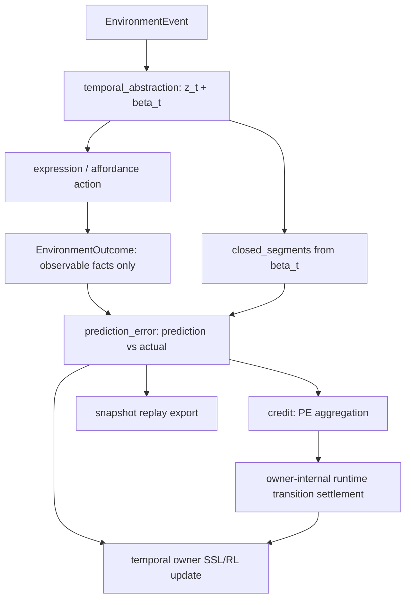

# Emergent Action Abstraction Spec

> Status: draft
> Last updated: 2026-07-20
> 对应需求: R-PE, R1, R3, R4, R8, R9, R10, R11, R13, R15

## 要解决的问题

Environment Interface 已经把聊天、工具结果、ingestion、tick / scene 等入口统一成 `EnvironmentEvent / EnvironmentOutcome`。但动作与环境反馈要进入 ETA / NL 的涌现抽象，不能再造一套平行的 action trace / ledger / encoder 系统。

第一性约束是：

- `prediction_error` 是唯一的预测-现实 mismatch owner。
- `temporal_abstraction` 是唯一的 `z_t / beta_t` 时间抽象 owner。
- `credit` 是 PE 的下游聚合层，不直接持有环境反馈。
- `EnvironmentOutcome` 只承载外部 adapter 能直接观察的事实。

因此，本能力域要解决的是：如何把复杂动作与环境反馈压进现有 PE-first、`z_t / beta_t`-centered 闭环，而不引入第二套 trace owner、delayed ledger 或 action encoder。

## 关键不变量

- 不新增 `action_outcome_trace` runtime slot。
- 不新增 `DelayedOutcomeLedger` owner；delayed outcome 的边界来自 `beta_t` segment closure。
- 不新增独立 Action/Outcome encoder owner；动作抽象仍由 metacontroller 在 `z_t` 空间学习。
- `EnvironmentOutcome` 不承载 trust / common-ground / commitment / information-gain 等语义 delta；这些由对应 owner 的 pre/post snapshot delta 计算。
- `prediction_error` snapshot 可以被丰富 action context，但 PE owner 仍是唯一 mismatch owner。
- out-of-turn snapshot replay 是既有 snapshot 序列的 append-only export；online runtime transition replay 是 Internal-RL owner 的有界训练状态。两者都不是新的 runtime slot，前者只供诊断，禁止反序列化后喂给 PPO。

## Architecture Shape


```mermaid
flowchart TD
    EnvEvent["EnvironmentEvent"] --> Temporal["temporal_abstraction: z_t + beta_t"]
    Temporal --> Action["expression / affordance action"]
    Action --> Outcome["EnvironmentOutcome: observable facts only"]
    Outcome --> PE["prediction_error: prediction vs actual"]
    Temporal --> Segment["closed_segments from beta_t"]
    Segment --> PE
    PE --> Credit["credit: PE aggregation"]
    PE --> TemporalUpdate["temporal owner SSL/RL update"]
    PE --> Replay["snapshot replay export"]
    Credit --> RuntimeReplay["owner-internal runtime transition settlement"]
    RuntimeReplay --> TemporalUpdate
```

## Layer 1. Minimal EnvironmentOutcome Observation Fields

`EnvironmentOutcome` 只添加外部 adapter / affordance invoker 可以诚实观察的字段：

| 字段 | 类型 | 默认 | 语义 |
|---|---|---|---|
| `latency_ms` | `int | None` | `None` | 外部动作端到端延迟 |
| `monetary_cost` | `float` | `0.0` | 归一化成本 |
| `reversibility` | `str` | `"reversible"` | `reversible` / `costly` / `irreversible` |
| `environment_state_delta_kind` | `str` | `"none"` | host / owner 控制枚举；默认无外部状态变化 |
| `situation_summary` | `str` | `""` | 可选、outcome-free 的 pre-action 可观察情境；只供 background semantic compression，不是 reward |

reviewed environment adapter 还可选择发布
`EnvironmentActionSchema(schema_id, applicability_conditions, action_steps, description)`，
用于把已经执行的动作与 episode-specific 文案分离。它是 action observation 的结构化注释，
不是 reward、evaluation label 或 token-space policy；未提供时保持旧契约。

`situation_summary` 不授予 environment adapter 语义 owner 身份。它与 action statement
可由 application 的 background-slow decoder 读取；outcome/detail、PE 与 evaluation
不得进入 semantic candidate prompt。candidate 属于 CaseMemory owner，并与 reviewed
`EnvironmentActionSchema` 保持不同 provenance。

显式不加入：

- `trust_delta`
- `common_ground_delta`
- `commitment_progress_delta`
- `information_gain`
- future outcome / preferred current response

这些不是 invoker 可观察事实，必须由 `relationship_state`、`common_ground`、`commitment`、memory / knowledge owner 自己发布并由 PE owner 读取。

## Layer 2. Temporal Segment Closure

ETA 的延迟结果边界来自 `beta_t` 的 segment 切换。Phase 1 在 `temporal_abstraction` 公共 snapshot 中发布 `closed_segments`。

不变量：

- `TemporalModule` / `TemporalAggregateModule` 仍是 segment 的唯一 owner。
- PE owner 只消费 `closed_segments`，不自己推断 segment 边界。
- 没有 horizon sweep ledger；跨 turn credit 的时间边界来自 segment closure。

## Layer 3. PE Action Context

Phase 1 丰富现有 PE dataclasses，而不是新增 trace snapshot：

- `PredictedOutcome`
- `ActualOutcome`
- `PredictionErrorSnapshot`

新增可选 action context：

- `segment_id`
- `abstract_action_id`
- `z_t_digest`
- `regime_id`
- `affordance_name`
- `environment_event_id`
- `environment_outcome_id`

PE owner 从 `temporal_abstraction`、`regime`、`affordance` 和 `EnvironmentOutcome` 可观察字段中读取 context，然后发布唯一 PE snapshot。

## Layer 4. Owner-Delta Evidence

复杂环境反馈由对应 owner 负责描述：

| 反馈 | 唯一 owner |
|---|---|
| trust / relationship movement | `relationship_state` |
| commitment progress | `commitment` |
| common-ground movement | `common_ground` |
| information gain | memory / domain knowledge owner |
| affordance latency / cost / reversibility | `EnvironmentOutcome` |

PE 读取这些 owner 的 pre/post public snapshot delta。消费者不得把这些 delta 填回 `EnvironmentOutcome` 或 renderer 文案。

## Layer 5. Credit From PE Segments

新增 helper：

```python
derive_segment_closure_credit_records(
    prediction_error_snapshot: PredictionErrorSnapshot,
    temporal_snapshot: TemporalAbstractionSnapshot,
) -> tuple[CreditRecord, ...]
```

语义：

- 只读 PE snapshot 与 temporal snapshot。
- 生成 keyed by `segment_id / abstract_action_id / z_t_digest` 的 credit records。
- 不读取 raw outcome text。
- 不持有 trace store。
- 当前主链路中 `CreditModule` 声明消费 `temporal_abstraction`，在 PE-first credit 派生后追加该 helper 的结果；`closed_segments` 为空或不匹配时返回空 tuple（Packet B 修复了之前 mismatch 分支误返回 `None` 的 bug），不影响既有 credit。
- Credit owner 现在以 `CreditRecord.prediction_id / segment_id / abstract_action_id /
  environment_event_id / environment_outcome_id` 发布结构化 lineage，并在
  `CreditSnapshot.recent_action_lineage_credits` 保留 owner view；通用 recent window
  截断不会擦除动作 lineage。`context` 仍可带相同内容供人读，但 consumer 禁止解析文本
  重建 lineage。这些字段不改变 PE 或 credit 数值公式。

## Layer 6. Snapshot Replay Export

Replay 是现有 snapshot 的 append-only artifact，不是 runtime slot：

- `EnvironmentEvent`
- `EnvironmentOutcome`
- `temporal_abstraction.closed_segments`
- `prediction_error`
- `credit`
- manifest / seed / git sha

Evidence bundle 根据这些既有 snapshot 生成 replay summary。导出层不得推断运行时状态。

当前 runtime `export_snapshot_replay_artifact()` 输出 `action_replay` section，内容来自既有 `prediction_error`、`temporal_abstraction`、`credit` snapshots；`dialogue_trace` 仍是并行 debug artifact，不是 replay 所依赖的 runtime schema。

### Layer 6.1. Online Runtime Transition Replay

Online Internal-RL 不从上节的导出 artifact 反序列化训练数据。`ETANLJointLoop` 复用自身既有 pending
rollout staging，由 Internal-RL owner 在动作拍捕获真实 substrate、track runtime state、实际 `z_t`、
posterior、`beta_t`、行为 likelihood 与 prediction lineage；下一拍只接受 lineage 匹配的既有
`EnvironmentOutcome`、PE snapshot 与 PE 派生 credit，并用真实 next-substrate delta 结算
`runtime-replay` transition。

`internal_rl_runtime_replay` 与 pure/torch optimizer backend 是两个独立开关：

- `DISABLED`：保持历史 synthetic rollout；
- `SHADOW`：捕获、结算并报告 coverage/lineage/drop reason，但不进入训练 staging；
- `ACTIVE`：只训练已结算 runtime replay；样本不足显式等待，不得回退 synthetic。

该状态随 owner checkpoint 往返；除 Credit owner 新增的结构化 lineage view 外，不扩
`EnvironmentOutcome`、`PredictionErrorSnapshot` 或 public temporal snapshot shape，
也不让 environment/evaluation 直接提供 reward。

Internal-RL owner 还在 `RuntimeReplayReport.outcome_lineages` 发布最近 outcome-bound
`RuntimeReplayOutcomeLineage`：world/self capture IDs、prediction/outcome、Credit owner
record IDs、双轨 transition count，以及 optimizer consumption / policy update 状态。
session runtime 只把匹配 outcome 的证明映射为 application 的 `ActionLearningLineage`；
CaseMemory 不从全局计数、arm 名称或描述文本推断 admission。

## Acceptance Gates

- `pe-owner-remains-single`: 仓库不存在 runtime slot `action_outcome_trace`；PE 仍是唯一 mismatch owner。
- `segment-closure-from-beta`: delayed outcome 边界来自 temporal `closed_segments`。
- `outcome-fields-observable-only`: `EnvironmentOutcome` 不包含 trust / common-ground / commitment / information-gain semantic delta。
- `background-action-abstraction-no-outcome-label`: semantic decoder 只读多条
  situation/action observation；单例或 latent family ID 冲突不得调用 decoder；
  `action_family_version` 只作全局 bank revision 审计锚点，跨经历可不同，promotion
  必须经过 `ModificationGate.BACKGROUND`。
- `background-action-abstraction-owner-continuity`: schema-free evidence 只以
  CaseMemory-owned typed checkpoint 跨 session 续接；consumer 不解析描述文本，同
  outcome 矛盾 fail loudly，compact snapshot 回灌不得擦除 typed payload，已有
  promotion 的整个 family ID 不再发布 pending evidence。
- `promoted-action-applicability-fail-closed`: promotion checkpoint 必须保存 owner
  发布的 typed applicability conditions；CaseMemory 只以当前语境、schema id、
  conditions 与 risk markers 请求 structured readout。缺 evaluator、旧记录缺条件、
  解析失败、不适用或置信度 `<0.75` 时不得召回该 promotion；action steps、outcome、
  PE、credit 与 evaluation 不得进入 applicability prompt。
- `promotion-requires-internal-rl-lineage`: 四臂冻结消融要求 baked 命中 target
  promotion，而 cold、no-RL 与 shuffled-lineage 不得命中。Credit owner 通过
  `recent_action_lineage_credits` 保留结构化 prediction/outcome lineage；Internal-RL
  owner 按 outcome 发布双轨 settlement、credit record IDs、optimizer consumption 与
  policy-update 状态；runtime 只映射为 `ActionLearningLineage`，CaseMemory 只聚合
  `admission_ready` evidence。旧 checkpoint 缺 lineage 时可恢复但 fail closed。
  修复后 baked/cold/no-RL/shuffled 为 `4/0/0/0`，该 lineage gate 通过；evaluation
  不得依据 arm label 或文本描述代替证明。
- `selected-family-not-aggregate-label`: world/self temporal family 分歧时，
  `TemporalAggregateSnapshot.active_abstract_action` 可发布
  `world:<id>|self:<id>` 供审计，但环境 outcome 的 lived-action family 与
  `ResponseActionRealization` 必须绑定同拍 `RetrievalPolicySnapshot.abstract_action`
  所选单轨 family。禁止把 aggregate 组合字符串作为稳定 family identity 写进
  CaseMemory，也禁止 response consumer 用 aggregate 字符串否决 owner 已发布的
  action grounding。
- `credit-from-pe-only`: segment/action credit records 只从 `PredictionErrorSnapshot` 派生。
- `replay-from-snapshots`: replay artifact 可由现有 snapshots 生成，不依赖 trace-specific runtime schema。
- `runtime-replay-owner-bounded`: online replay 只存在于 Internal-RL/joint-loop owner checkpoint，不新增 slot 或第二 trace owner。
- `runtime-replay-lineage`: 真实 transition 只由匹配的 outcome→PE→credit lineage 结算，错配 fail loudly。
- `active-replay-no-synthetic-fallback`: ACTIVE 无已结算样本时报告 waiting，不调用 synthetic rollout。
- `affordance-selection-no-rules`: affordance selection 仍走 metacontroller state，无硬编码 action routing。
- `segment-credit-attributes-to-tool` (Packet B — long-horizon-closure): closed segment 命中且对应 PE 携带非空 `affordance_name` 或 `prediction_id` 时，派生的 segment credit record 的 `context` 字段必须包含同样的 `affordance_name=...` 与 `prediction_id=...` 子串；mismatch 分支返回 empty tuple，不返回 `None`。acceptance: `tests/longitudinal/test_affordance_delayed_credit.py`。

## 与其他能力域的关系

| 关系 | 能力域 | 说明 |
|---|---|---|
| 依赖 | Environment Interface | 消费 `EnvironmentEvent / EnvironmentOutcome` |
| 依赖 | Prediction Error 主链 | PE owner 承载 action context 与 segment closure evidence |
| 依赖 | 时间抽象与内部控制 | `closed_segments` 由 `beta_t` / `z_t` owner 发布 |
| 依赖 | 信用分配与自修改 | credit 只从 PE 派生 segment/action records |
| 协作 | Affordance 体系 | affordance invoker 只填写可观察 outcome fields |
| 协作 | 证据计划 | replay artifact 由 existing snapshots 导出 |

## 回滚

- Outcome 字段都有默认值，旧调用不受影响。
- `closed_segments` 可为空。
- PE action context 可为空。
- segment credit helper 可不接 final wiring。
- replay export 是 out-of-turn artifact，可单独关闭。
- online runtime replay 默认 `DISABLED`；回滚 transition source gate 即恢复 synthetic 路径，pending owner state 随 checkpoint 恢复。
- 旧 CaseMemory checkpoint 缺 `ActionLearningLineage` 时仍可加载，但 schema-free evidence
  不参与 abstraction；回滚本包可恢复旧 admission 行为，不能声称 no-RL 因果隔离。

## 变更日志

- 2026-07-29: 增加 Credit owner 结构化 action lineage、Internal-RL outcome-bound consumption report 与 CaseMemory fail-closed admission；四臂 no-RL promotion 从 `4/4` 降为 `0/4`。
- 2026-07-28: 增加 outcome-free `situation_summary` 与 application-owned multi-experience semantic candidate 边界；decoder 不读 outcome/evaluation，candidate 与 reviewed EnvironmentActionSchema provenance 隔离，并经 BACKGROUND ModificationGate promotion。
- 2026-07-20: 增加 online runtime transition replay 边界。明确它是 joint-loop/Internal-RL owner 内的有界训练状态，与只读 snapshot replay export 不同；三态 gate 独立于 optimizer backend，ACTIVE 禁止 synthetic fallback，并保持公共 snapshot schema 不变。
- 2026-05-12: Packet B (long-horizon-closure) — 修复 `derive_segment_closure_credit_records` 在 segment id 不匹配时误返回 `None` 的 bug（改为返回 empty tuple）；新增 `affordance_name` / `prediction_id` 到 segment credit record 的 context 字符串，对应 acceptance gate `segment-credit-attributes-to-tool`；测试见 `tests/longitudinal/test_affordance_delayed_credit.py`。
- 2026-05-02: 重写 Phase 1 方案，移除 `action_outcome_trace` owner / delayed ledger / action-outcome encoder owner，改为 PE + temporal segment closure 的 ETA/NL 第一性实现。
