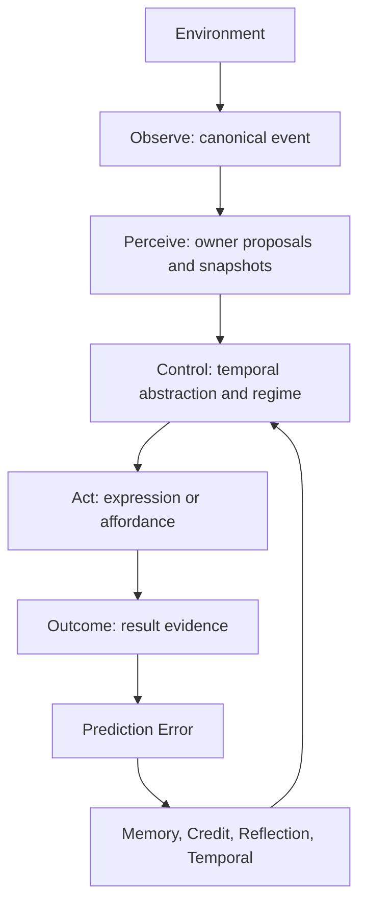

# Environment Interface Spec

> Status: Phase 1 contract landed; `canonical-event-routing` 与 `outcome-links-to-prediction` gates satisfied（adapter 口径）；`rollback-ready` pending
> Last updated: 2026-07-14
> 对应需求: R-PE, R1, R3, R4, R8, R10, R11, R15, R16-R20

## 要解决的问题

当前系统的环境入口分散在 `run_turn`、tool result、ingestion、tick / scene、followup 和 social cognition 输入假设中。它们都能进入认知主链，但缺少一个统一的第一性边界来说明：

- 环境事件如何被规范化；
- 感知层能产生什么，不能拥有什么；
- 行动如何有界地作用环境；
- outcome 如何回到 prediction error 主链；
- social cognition 的 speaker / audience / subject scope 从哪里来。

Environment Interface 不是新的内核 owner，也不是新的 runtime slot。它是生命体层与内核之间的底层边界协议：`lifeform-*` 负责把外部世界适配成 canonical event / outcome，`vz-*` 只消费公共契约和不可变 snapshot。

## 当前实现状态

截至 2026-05-04，本 spec 已从 Phase 0 语义冻结推进到 **Phase 1 contract surface 已落地**：

- `vz-contracts` 已提供 `volvence_zero.environment`
- 已落地 frozen dataclass：
  - `EnvironmentActorRef`
  - `EnvironmentFrame`
  - `EnvironmentEvent`
  - `EnvironmentOutcome`
- 已落地枚举：`EnvironmentEventKind`
- 已落地 compatibility builder：`build_user_input_environment_event(...)`
- 已落地 source-neutral builder：`build_environment_event(...)`；`run_turn`
  的 user / ingestion / apprentice / tool / internal-drive / followup 入口统一
  使用该 builder，event kind 与 trigger kind 由 typed trigger 映射提供
- 已有合同测试：`tests/contracts/test_environment_contracts.py`

已验证的 routing / lineage：

- `user_input`：`LifeformSession.run_turn(..., trigger_kind=USER_INPUT)` 生成 `EnvironmentEventKind.USER_INPUT`
- `ingestion`：`IngestionPipeline` 通过 `run_turn(..., trigger_kind=INGESTION)` 进入主链，并在 report 中保留 kernel result 的 `EnvironmentEventKind.INGESTION`
- `tool_result`：`BrainSession.submit_tool_result(...)` 构造 `EnvironmentOutcome`，下一轮 PE action context 与 snapshot replay 携带 `environment_outcome_id`
- social frame：`MultiPartyIdentityModule` 消费 `EnvironmentEvent.frame`，memory subject / audience scope 与 social PE 路径已有证据测试

2026-07-12/13 之后的逐入口验收结果（与下方 Phase 1 gates 一致，SSOT 以 gates 为准）：

- `followup_due` 已验收为 canonical event turn；`system_tick` / `scene_event` 按
  gate 原文以 **documented compatibility adapter** 口径关闭（tick 不作为 kernel
  turn；scene close 走 typed `scene_closed_evidence`），见 gate 1。
- ingestion envelope provenance -> PE lineage 已有端到端证据（gate 3）。
- expression / scene outcome 的 prior prediction id lineage 已有契约测试（gate 3）。

仍未完成：

- `rollback-ready` gate（gate 5）：tick / scene / followup 路由的 SHADOW /
  per-source disablement rollout 仍 pending。
- tick/followup 的 proactive action 自主闭环（service 层 `FOLLOWUP_DUE` →
  `run_turn` 编排 + followup outcome lineage）见 uplift 计划 CP-20。

## 关键不变量

- 环境不是内核模块；内核不得反向 import 或持有 `lifeform-*` / service / UI / host runtime。
- `EnvironmentEvent` 是统一概念；Phase 1 已在 `vz-contracts` 落地 frozen dataclass，但它仍不是 runtime owner / slot。
- 所有环境入口必须能归入 Observe / Perceive / Act / Assimilate 四面之一。
- 感知层只产生 typed proposals / owner inputs，不拥有最终社会状态、记忆状态或行动结果。
- 所有外部行动必须能形成 pre-action prediction，并通过 outcome 回流到 `prediction_error` typed evidence。
- 行动能力通过 affordance / renderer / invoker 暴露；内核 owner 不直接调用工具、文件系统、网络或产品服务。
- Social Cognition 与 Environment Interface 正交但依赖后者：Environment Event 提供 conversational frame，social cognition owners 消费该 frame 并发布自己的 snapshot / prediction / PE。
- Renderer / prompt planner / downstream response 不得从 raw text 重建 speaker、audience、subject、ToM、common ground 或 group state。

## Architecture Shape



### Observe

Observe is the boundary where host / service / lifeform adapters convert external reality into a canonical event shape. Planned event kinds:

- `user_input`
- `system_tick`
- `scene_event`
- `tool_result`
- `ingestion`
- `apprentice`
- `internal_drive`

Every event must define the social and operational frame when the information is available:

- `actor_id`
- `active_speaker_id`
- `addressee_ids`
- `subject_ids`
- `audience_ids`
- `scene_id`
- `timestamp_ms`
- `provenance`
- `consent_context`
- `trigger_kind`

Absent fields must be explicit defaults, not downstream guesses. For single-user compatibility, `primary` remains a migration key, not a cognitive truth.

### Perceive

Perceive turns canonical events into owner-specific inputs:

- social identity / conversational role proposals;
- ToM typed proposals;
- semantic state proposals;
- memory write candidates;
- boundary / consent observations;
- PE prediction context.

Perception does not own durable state. It may use structured LLM output or embedding similarity as proposal sources, but final state is owned by the target owner snapshot.

### Act

Act covers both expression and external effect:

- expression through `response_assembly` and renderer;
- tool / API / shell / organ execution through affordance descriptors and invokers;
- followup / scene / timing actions through lifeform-side controllers;
- internal action proposals through existing owner-side apply surfaces.

An action is valid only if it declares expected outcome, safety / consent requirements, cost model, idempotency boundary, and return channel.

### Assimilate

Assimilate maps environment outcome back into the learning loop:

- action result becomes typed evidence;
- evidence links to the prior prediction;
- mismatch enters `prediction_error`;
- credit / memory / reflection / temporal owners consume the resulting public PE evidence through normal snapshot paths;
- slow consolidation remains session-post and owner-side.

Current runtime wiring uses next-turn lineage for environment outcomes:

- `BrainSession.submit_tool_result(...)` records the canonical `EnvironmentOutcome.outcome_id`;
- the next `run_turn` injects that id into `PredictionActionContext.environment_outcome_id`;
- `PredictionErrorModule` receives the per-turn context even when the module instance is reused across a session;
- the id is lineage evidence only and does not by itself change the PE magnitude/reward formula.
- `CreditModule` can then derive segment/action credit from PE action context plus `temporal_abstraction.closed_segments`; this keeps credit downstream of PE instead of making outcome a second owner.
- snapshot replay export includes an `action_replay` section built from existing `prediction_error`, `temporal_abstraction`, and `credit` snapshots for audit.

Assimilation must not bypass owners by directly writing memory, regime, temporal, social cognition, or application stores.

## Social Cognition Boundary

Social Cognition remains first-principles design for the social world. It is not replaced by Environment Interface.

The relationship is:

- Environment Interface answers how events, actions, and outcomes cross the lifeform / kernel boundary.
- Social Cognition answers how a multi-agent social world is represented and learned once those events are inside the boundary.

Therefore:

- `multi_party_identity` consumes `active_speaker_id`, `addressee_ids`, `subject_ids`, and `audience_ids` from the Environment Event conversational frame.
- `conversational_role` may refine ambiguous role assignments, but it does not invent the host frame when the host supplied one.
- ToM owners consume keyed interlocutor context and typed proposals; they do not parse raw text in the renderer.
- `common_ground` and `groups` consume role / identity / audience scope and publish their own predictions.

## 接口契约

Phase 1 contract surface 已落地在 `vz-contracts` 的 `volvence_zero.environment`。当前 canonical shape 为：

```python
@dataclass(frozen=True)
class EnvironmentFrame:
    actor: EnvironmentActorRef
    active_speaker_id: str
    addressee_ids: tuple[str, ...]
    subject_ids: tuple[str, ...]
    audience_ids: tuple[str, ...]


@dataclass(frozen=True)
class EnvironmentEvent:
    event_id: str
    event_kind: EnvironmentEventKind
    trigger_kind: str
    frame: EnvironmentFrame
    scene_id: str
    timestamp_ms: int
    provenance: str
    consent_context: tuple[str, ...] = ()
    payload_summary: str = ""


@dataclass(frozen=True)
class EnvironmentOutcome:
    outcome_id: str
    event_id: str
    outcome_kind: EnvironmentEventKind
    action_id: str
    status: str
    summary: str
    detail: str
    confidence: float = 0.8
    prediction_id: str | None = None
    evidence: tuple[str, ...] = ()
    latency_ms: int | None = None
    monetary_cost: float = 0.0
    reversibility: str = "reversible"
    environment_state_delta_kind: str = "none"
```

The single-user compatibility path is `build_user_input_environment_event(...)`, which supplies the explicit `primary -> self` frame instead of leaving speaker / audience / subject scope for downstream inference.

## 与其他能力域的关系

| 关系 | 能力域 | 说明 |
|---|---|---|
| 基础 | 契约式运行时 | Environment Interface obeys snapshot-first boundaries and does not add a kernel owner. |
| 基础 | Prediction Error 主链 | Every action / outcome pair must be linkable to a prior prediction. |
| 依赖 | Lifeform Vitals | `internal_drive` and `system_tick` are environment event sources, not kernel shortcuts. |
| 协作 | Runtime Ingestion | Ingestion is an Environment Event source adapter, not a special learning path. |
| 协作 | Affordance | Affordance is the Act face for learned, bounded environment control. |
| 协作 | MCP Bundle Bridge | External MCP server `resources/list` 经 `MCPResourceAdapter` 转换成 `IngestionEnvelope` 并经 `trigger_kind=INGESTION` 走 canonical event path；MCP `tools/call` 结果经标准 `BrainSession.submit_tool_result` 回流 PE。详见 [`docs/specs/mcp-bridge.md`](mcp-bridge.md)。 |
| 协作 | Social Cognition | Environment Event supplies conversational frame; social owners publish learned social state. |

## Phase 1 Acceptance Gates

1. `canonical-event-routing`
   - All user / ingestion / tool-result / tick / scene entrypoints can be traced to a canonical event or documented compatibility adapter.
   - No new environment entrypoint writes directly to memory, regime, temporal, social cognition, or application owner stores.
   - Status: **satisfied**（2026-07-12）。逐入口证据：
     - `user_input` / `ingestion` / `apprentice` / `internal_drive` / `followup_due`：`tests/lifeform_e2e/test_canonical_environment_routing.py` 逐 trigger 断言 kernel result 的 `environment_event_kind` / `environment_trigger_kind` / 单方兼容 frame；`followup_due` 的 documented host path 为 `due_followups()` → 产品层 `run_turn(trigger_kind=FOLLOWUP_DUE)` → `acknowledge_followup(...)`。
     - `tool_result`：既有 `BrainSession.submit_tool_result(...)` 路径（见 gate 3）。
     - `system_tick`：**documented compatibility adapter** —— tick 不作为 kernel turn 进入认知；其效果只能间接到达（vitals decay → proactive followup → 后续 `FOLLOWUP_DUE` turn；idle → `end_scene`）。
     - `scene_event`：**documented compatibility adapter** —— scene close 以 typed `scene_closed_evidence` 进入 dialogue trace（结构化，不是 turn event）。
2. `social-frame-source-of-truth`
   - Social cognition owners consume speaker / audience / subject scope from Environment Event or role snapshot.
   - Renderer / prompt planner does not infer social frame from raw text.
   - Status: **satisfied for Phase 1 social identity scope**. `multi_party_identity`, memory subject/audience scope, social prediction, and social PE tests pass.
3. `outcome-links-to-prediction`
   - Tool result, expression result, scene outcome, and ingestion report evidence can link to a prior prediction id or documented prediction context.
   - Status: **satisfied**（2026-07-13）。逐入口证据：
     - `tool_result` carries `EnvironmentOutcome` and next-turn `environment_outcome_id` AND (Packet A — long-horizon-closure) `prediction_id` lineage end-to-end through `AffordanceInvoker.invoke(plan_ref=...)` covered by `tests/lifeform_e2e/test_affordance_pe_lineage.py`。
     - `expression`：owner-issued `next_prediction.prediction_id`（CP-10）→ typed `submit_dialogue_outcome` external evidence → 下一轮 `evaluated_prediction.prediction_id` 精确匹配 + `actual_outcome.external_outcome_refs` 携带 evidence id（`tests/contracts/test_expression_outcome_settlement.py`）。
     - `scene`：`LifeformSession.end_scene` 读取上一轮 PE owner 签发的 `next_prediction.prediction_id` 并写入 typed `scene_closed_evidence.evidence_refs`（`scene_prediction:<id>`），trace replay 可从 scene outcome 追溯 prior prediction（`tests/lifeform_e2e/test_ingestion_pipeline_e2e.py` + `tests/test_dialogue_outcome_producers.py`）。
     - `ingestion`：`IngestionPipeline` 将 envelope/chunk provenance 作为 canonical `EnvironmentEvent.provenance` 传入 `run_turn`，`IngestionTurnRecord` 记录 `environment_event_id`、PE action context 中的 `environment_event_id` 和 owner-issued `prediction_id`，证明 envelope chunk → canonical event → PE lineage（`tests/lifeform_e2e/test_ingestion_pipeline_e2e.py`）。
4. `owner-boundary-preserved`
   - `vz-*` wheels do not import `lifeform-*`.
   - Environment adapters do not become second owners for memory, temporal, social cognition, or application state.
   - Status: **satisfied for checked surfaces**. `vz-contracts` owns only data contracts; `lifeform-ingestion` isolation tests forbid owner-store and runtime-internal imports.
5. `rollback-ready`
   - New event routes can run in `SHADOW` or compatibility mode without changing active owner outputs.
   - Status: **pending** for tick / scene / followup route rollout.

## 回滚

Environment Interface Phase 0 has no runtime wiring level because it is design-only. Phase 1 rollout must support:

- compatibility adapters for current `run_turn(user_input)` and `submit_tool_result(...)`;
- `SHADOW` event publication before active owner consumption;
- per-source disablement for ingestion, affordance, scene, and tick adapters;
- evidence lineage from outcome back to event id / prediction id.

## 变更日志

- 2026-07-14: 修复 spec 顶部状态与 Phase 1 gates 的自相矛盾（顶部仍写
  2026-05-04 的 partial 口径，而 gate 1/3 已于 2026-07-12/13 satisfied）。
  统一 SSOT：入口验收状态以 Phase 1 Acceptance Gates 为准，顶部实现状态段
  只做指引。无行为变更。
- 2026-07-13 (2): CP-13 scene + ingestion lineage 闭合。`scene_closed_evidence`
  新增可选 `prediction_id` 并由 `LifeformSession.end_scene` 写入
  `scene_prediction:<id>` evidence ref；`IngestionPipeline` 将
  `IngestionPipeline:<envelope_id>:<chunk_id>:<locator>` 作为 canonical event
  provenance 传入 `run_turn`，并在 `IngestionTurnRecord` 记录
  `environment_event_id` / PE action context event id / owner-issued
  `prediction_id`。`outcome-links-to-prediction` gate 升为 **satisfied**。
  测试：`tests/test_dialogue_outcome_producers.py` +
  `tests/lifeform_e2e/test_ingestion_pipeline_e2e.py`。
- 2026-07-13: CP-13 expression settlement 切片。证明 typed 外部反馈通道
  （`submit_dialogue_outcome`，Rupture-and-Repair M2 单一合法入口）结算的正是
  PE owner 上一轮签发的 prediction：`evaluated_prediction.prediction_id` 与
  turn-N 签发 id 精确匹配，`actual_outcome.external_outcome_refs` 携带 evidence
  id。`outcome-links-to-prediction` 的 expression 子项升为 satisfied；scene
  prediction link 与 ingestion provenance 仍 pending。测试：
  `tests/contracts/test_expression_outcome_settlement.py`。
- 2026-07-12 (3): CP-10 首切片（tool 臂 owner-issued prediction）。
  `PredictedOutcome` 新增 `prediction_id`，由 `PredictionErrorModule` 在发布
  `next_prediction` 时唯一签发（`pe:prediction_error:turn-N:next`）；
  affordance tool loop 的 `_plan_ref_from_snapshots` 改为**转发** PE owner 签发
  的 id（bootstrap 空 id 回退 temporal segment anchor，再无则显式 `None` =
  unknown lineage，禁止编造 id）。expression / scene-close / ingestion 的
  pre-action issuance 与 settlement 仍 pending（CP-10 后续切片）。测试：
  `tests/contracts/test_pe_issued_plan_ref.py`。
- 2026-07-12 (2): `canonical-event-routing` gate 升为 **satisfied**。新增
  `tests/lifeform_e2e/test_canonical_environment_routing.py`（五个 trigger 的
  canonical event kind 逐一 e2e + `FOLLOWUP_DUE` documented host path）；
  `LifeformSession.acknowledge_followup(...)` 补齐产品层 followup 生命周期
  （due → 决定 re-engage → acknowledge）。`system_tick` / `scene_event` 按
  gate 原文以 documented compatibility adapter 口径关闭（tick 不作为 kernel
  turn；scene close 走 typed `scene_closed_evidence`）。
- 2026-07-12: 新增 source-neutral `build_environment_event(...)`，避免
  internal-drive / followup 等入口借用名为 user-input 的 builder。现有
  `build_user_input_environment_event(...)` 保持兼容并委托给 canonical
  builder；`LifeformSession.run_turn` 已切换到 canonical builder。system
  tick / scene lifecycle 尚未进入 kernel turn，因此整体
  `canonical-event-routing` gate 仍为 partial。
- 2026-05-12: Packet A (long-horizon-closure) — `tool_result` 的 outcome→prediction lineage 完成端到端：`PredictionActionContext.prediction_id` 字段新增；`AffordanceInvoker.invoke(plan_ref=...)` -> `EnvironmentOutcome.prediction_id` -> next-turn `PredictionActionContext.prediction_id` 全链路接通；测试见 `tests/lifeform_e2e/test_affordance_pe_lineage.py`。`outcome-links-to-prediction` 的 tool_result 子项可视为 satisfied，整体 gate 仍 partial（待 expression / scene / ingestion）。
- 2026-05-04: 更新实现状态：`volvence_zero.environment` 的 Phase 1 frozen contract surface 已落地，`user_input` / `ingestion` / `tool_result` 环境路由已有测试覆盖，social frame source-of-truth 已通过 Phase 1 social identity scope 测试；tick / scene / followup 与部分 outcome lineage 仍待逐入口验收。
- 2026-05-04: 验收 `ingestion` canonical event kind route：`lifeform-ingestion` envelope / pipeline 测试覆盖 immutable envelope、partial failure 显式化、`trigger_kind=INGESTION` turn routing、`EnvironmentEventKind.INGESTION` 到达 kernel result、scene close、per-chunk exception isolation，以及禁止 import owner store / runtime internals；envelope provenance -> PE lineage 仍待端到端证据。
- 2026-05-04: 验收 `tool_result` 环境 outcome 路径：`BrainSession.submit_tool_result(...)` 构造 `EnvironmentOutcome`，affordance invoker success/failure 均回流 session，下一轮 PE action context 与 snapshot replay 携带 `environment_outcome_id`。
- 2026-05-02: 初始 draft，冻结 Environment Interface 作为生命体环境边界总入口，并明确其与 Social Cognition 的正交依赖关系。
