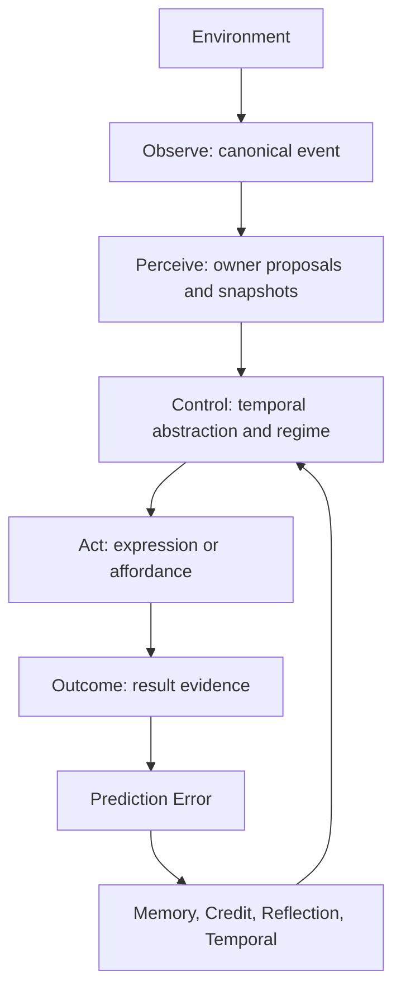

# Environment Interface Spec

> Status: draft
> Last updated: 2026-05-02
> 对应需求: R-PE, R1, R3, R4, R8, R10, R11, R15, R16-R20

## 要解决的问题

当前系统的环境入口分散在 `run_turn`、tool result、ingestion、tick / scene、followup 和 social cognition 输入假设中。它们都能进入认知主链，但缺少一个统一的第一性边界来说明：

- 环境事件如何被规范化；
- 感知层能产生什么，不能拥有什么；
- 行动如何有界地作用环境；
- outcome 如何回到 prediction error 主链；
- social cognition 的 speaker / audience / subject scope 从哪里来。

Environment Interface 不是新的内核 owner，也不是新的 runtime slot。它是生命体层与内核之间的底层边界协议：`lifeform-*` 负责把外部世界适配成 canonical event / outcome，`vz-*` 只消费公共契约和不可变 snapshot。

## 关键不变量

- 环境不是内核模块；内核不得反向 import 或持有 `lifeform-*` / service / UI / host runtime。
- `EnvironmentEvent` 是统一概念；Phase 0 只冻结字段语义，不新增 Python dataclass。
- 所有环境入口必须能归入 Observe / Perceive / Act / Assimilate 四面之一。
- 感知层只产生 typed proposals / owner inputs，不拥有最终社会状态、记忆状态或行动结果。
- 所有外部行动必须能形成 pre-action prediction，并通过 outcome 回流到 `prediction_error` typed evidence。
- 行动能力通过 affordance / renderer / invoker 暴露；内核 owner 不直接调用工具、文件系统、网络或产品服务。
- Social Cognition 与 Environment Interface 正交但依赖后者：Environment Event 提供 conversational frame，social cognition owners 消费该 frame 并发布自己的 snapshot / prediction / PE。
- Renderer / prompt planner / downstream response 不得从 raw text 重建 speaker、audience、subject、ToM、common ground 或 group state。

## Architecture Shape



### Observe

Observe is the boundary where host / service / lifeform adapters convert external reality into a canonical event shape. Planned event kinds:

- `user_input`
- `system_tick`
- `scene_event`
- `tool_result`
- `ingestion`
- `apprentice`
- `internal_drive`

Every event must define the social and operational frame when the information is available:

- `actor_id`
- `active_speaker_id`
- `addressee_ids`
- `subject_ids`
- `audience_ids`
- `scene_id`
- `timestamp_ms`
- `provenance`
- `consent_context`
- `trigger_kind`

Absent fields must be explicit defaults, not downstream guesses. For single-user compatibility, `primary` remains a migration key, not a cognitive truth.

### Perceive

Perceive turns canonical events into owner-specific inputs:

- social identity / conversational role proposals;
- ToM typed proposals;
- semantic state proposals;
- memory write candidates;
- boundary / consent observations;
- PE prediction context.

Perception does not own durable state. It may use structured LLM output or embedding similarity as proposal sources, but final state is owned by the target owner snapshot.

### Act

Act covers both expression and external effect:

- expression through `response_assembly` and renderer;
- tool / API / shell / organ execution through affordance descriptors and invokers;
- followup / scene / timing actions through lifeform-side controllers;
- internal action proposals through existing owner-side apply surfaces.

An action is valid only if it declares expected outcome, safety / consent requirements, cost model, idempotency boundary, and return channel.

### Assimilate

Assimilate maps environment outcome back into the learning loop:

- action result becomes typed evidence;
- evidence links to the prior prediction;
- mismatch enters `prediction_error`;
- credit / memory / reflection / temporal owners consume the resulting public PE evidence through normal snapshot paths;
- slow consolidation remains session-post and owner-side.

Assimilation must not bypass owners by directly writing memory, regime, temporal, social cognition, or application stores.

## Social Cognition Boundary

Social Cognition remains first-principles design for the social world. It is not replaced by Environment Interface.

The relationship is:

- Environment Interface answers how events, actions, and outcomes cross the lifeform / kernel boundary.
- Social Cognition answers how a multi-agent social world is represented and learned once those events are inside the boundary.

Therefore:

- `multi_party_identity` consumes `active_speaker_id`, `addressee_ids`, `subject_ids`, and `audience_ids` from the Environment Event conversational frame.
- `conversational_role` may refine ambiguous role assignments, but it does not invent the host frame when the host supplied one.
- ToM owners consume keyed interlocutor context and typed proposals; they do not parse raw text in the renderer.
- `common_ground` and `groups` consume role / identity / audience scope and publish their own predictions.

## 接口契约

Phase 0 freezes the semantic contract only. A future Phase 1 implementation may introduce a frozen dataclass equivalent to:

```python
@dataclass(frozen=True)
class EnvironmentEvent:
    event_id: str
    event_kind: str
    trigger_kind: str
    actor_id: str
    active_speaker_id: str
    addressee_ids: tuple[str, ...]
    subject_ids: tuple[str, ...]
    audience_ids: tuple[str, ...]
    scene_id: str
    timestamp_ms: int
    provenance: str
    consent_context: tuple[str, ...]
    payload_summary: str
```

This sketch is not an implementation commitment. The Phase 1 contract must land in `vz-contracts` or `lifeform-core` according to the final wheel boundary review.

## 与其他能力域的关系

| 关系 | 能力域 | 说明 |
|---|---|---|
| 基础 | 契约式运行时 | Environment Interface obeys snapshot-first boundaries and does not add a kernel owner. |
| 基础 | Prediction Error 主链 | Every action / outcome pair must be linkable to a prior prediction. |
| 依赖 | Lifeform Vitals | `internal_drive` and `system_tick` are environment event sources, not kernel shortcuts. |
| 协作 | Runtime Ingestion | Ingestion is an Environment Event source adapter, not a special learning path. |
| 协作 | Affordance | Affordance is the Act face for learned, bounded environment control. |
| 协作 | Social Cognition | Environment Event supplies conversational frame; social owners publish learned social state. |

## Phase 1 Acceptance Gates

1. `canonical-event-routing`
   - All user / ingestion / tool-result / tick / scene entrypoints can be traced to a canonical event or documented compatibility adapter.
   - No new environment entrypoint writes directly to memory, regime, temporal, social cognition, or application owner stores.
2. `social-frame-source-of-truth`
   - Social cognition owners consume speaker / audience / subject scope from Environment Event or role snapshot.
   - Renderer / prompt planner does not infer social frame from raw text.
3. `outcome-links-to-prediction`
   - Tool result, expression result, scene outcome, and ingestion report evidence can link to a prior prediction id or documented prediction context.
4. `owner-boundary-preserved`
   - `vz-*` wheels do not import `lifeform-*`.
   - Environment adapters do not become second owners for memory, temporal, social cognition, or application state.
5. `rollback-ready`
   - New event routes can run in `SHADOW` or compatibility mode without changing active owner outputs.

## 回滚

Environment Interface Phase 0 has no runtime wiring level because it is design-only. Phase 1 rollout must support:

- compatibility adapters for current `run_turn(user_input)` and `submit_tool_result(...)`;
- `SHADOW` event publication before active owner consumption;
- per-source disablement for ingestion, affordance, scene, and tick adapters;
- evidence lineage from outcome back to event id / prediction id.

## 变更日志

- 2026-05-02: 初始 draft，冻结 Environment Interface 作为生命体环境边界总入口，并明确其与 Social Cognition 的正交依赖关系。
