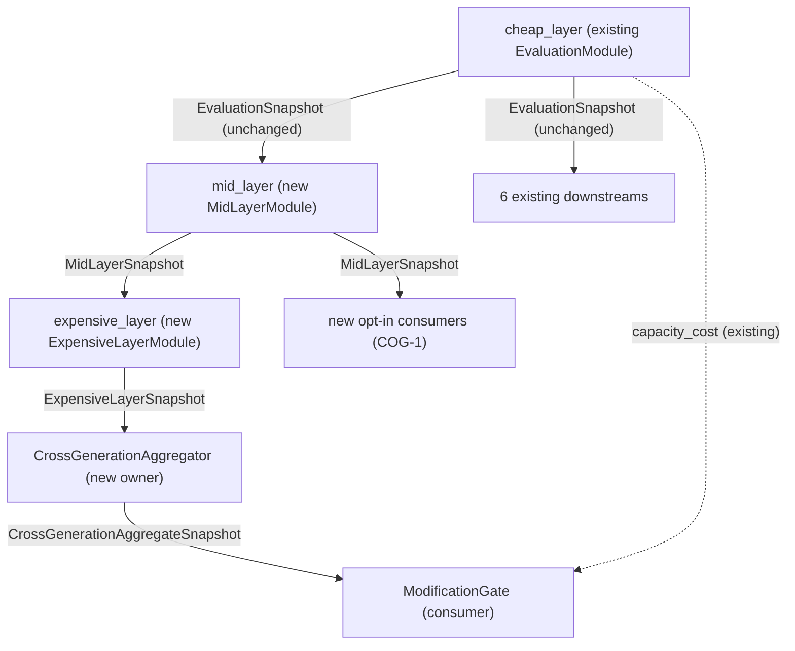

# Evaluation Cascade Spec

> Status: draft
> Last updated: 2026-05-13
> 对应需求: R8, R12, R15（架构 packet A2 + B3）
> 对应改造路线图: [`docs/moving forward/experiment-arch-uplift.md`](../moving%20forward/experiment-arch-uplift.md) §2 A2 + §3 B3
> 对应 plan：架构改造 plan T2 spec-first 前置

---

## 要解决的问题

阶段 C 实验承载力需要 evaluation 从"单层 read-only score 发布"升级为"三层 cascade + cross-generation aggregator"：

- **cheap_layer**：每 turn 跑、deterministic、不调 LLM；现有 `EvaluationModule` 收编为本层
- **mid_layer**：每场景跑、paper-suite-small × N seeds；ablation delta vs baseline；counterfactual contribution readout（COG-1 起跑面）
- **expensive_layer**：每代际 / 每 rare-heavy 跑；head-to-head winrate；LLM-judge readout（仅 readout，不进 gate）
- **CrossGenerationAggregator**：DM-7 / EVO-6 winrate 表；ModificationGate evidence 注入接口

最关键的不变量：**cheap_layer 必须 field-identical 兼容现有 `EvaluationSnapshot`**，因为它有至少 **6 个直接下游消费者**，任何 shape 偏移都会让 R8 SSOT 边界塌陷。

---

## 关键不变量

1. **cheap_layer = 现有 `EvaluationSnapshot` field-identical**：[`packages/vz-cognition/src/volvence_zero/evaluation/types.py:121`](../../packages/vz-cognition/src/volvence_zero/evaluation/types.py) 字段（`turn_scores` / `session_scores` / `alerts` / `description` / `structured_alerts` / `reflection_accuracy` / `longitudinal_verdict`）一字段不增不减、一字段不重命名。
2. **mid / expensive 各自独立 snapshot 族**：发布新的 `MidLayerSnapshot` / `ExpensiveLayerSnapshot` / `CrossGenerationAggregateSnapshot`，下游 **opt-in** 消费；不附加到 `EvaluationSnapshot` 字段内。
3. **LLM-judge 仅 readout，不进 gate**（R12 + OA-2 Mind/Face 隔离 + EVO 特殊条款）：expensive_layer 可以调 LLM 产 readout score；ModificationGate 永远不消费 LLM-judge score 作为 gate decision 输入。
4. **fail-loudly**：任一层失败必须 raise（不允许静默回退）；ModificationGate 在 cascade 上游缺失时 **fail-closed** BLOCK（[`no-swallow-errors-no-hasattr-abuse.mdc`](../../.cursor/rules/no-swallow-errors-no-hasattr-abuse.mdc)）。
5. **cheap_layer 可独立运行**：mid / expensive 缺失时 cheap_layer 正常工作，否则"每 turn 评估"会塌缩。
6. **layer 之间是依赖关系而非聚合关系**：mid 消费 cheap snapshot；expensive 消费 mid snapshot；CrossGenerationAggregator 消费 expensive snapshot。下游消费者按需 opt-in 任意一层。
7. **R8 SSOT**：每一层 snapshot 都有唯一 owner module；禁止跨 module 重建。

---

## 工程挑战

- 把现有 [`packages/vz-cognition/src/volvence_zero/evaluation/backbone.py`](../../packages/vz-cognition/src/volvence_zero/evaluation/backbone.py) 拆为 cheap_layer.py 的内部实现，外部接口（`EvaluationModule.process`）完全不变
- 设计 mid / expensive snapshot schema 同时不污染 cheap snapshot
- 跨层 fail-loudly 的最低代价实现：cheap raise 时是否仍 publish placeholder？mid raise 时下游消费者如何区分"上游正常但本层 failed"与"上游 failed"？
- 与 `CrossGenerationAggregator` 的接口设计：ModificationGate 应该消费 aggregator snapshot 还是直接消费 expensive snapshot？
- B3 metric_means schema-driven：让各层 owner 在 snapshot 发布时声明可抽 metric，不需要改 benchmark 代码即可流入对照表

---

## 算法候选

不涉及。Evaluation cascade 是工程架构层基础设施。三层划分本身借鉴 AlphaEvolve §2.4 evaluation cascade（EVO-2），但本 spec 只涉及 owner / snapshot / wiring 层面，不涉及具体评估算法。

---

## Cascade 总体结构



### 既有 6 个 cheap_layer 下游（迁移基准）

任何 cascade 实施必须保证这 6 个消费者完全不动：

- `credit` (`CreditModule`)：[`packages/vz-cognition/src/volvence_zero/credit/gate.py:1568`](../../packages/vz-cognition/src/volvence_zero/credit/gate.py) — `dependencies = ("dual_track", "evaluation", "prediction_error", "temporal_abstraction")`
- `substrate_self_mod` (`SubstrateSelfModModule`)：[`packages/vz-substrate/src/volvence_zero/substrate/self_mod.py:96`](../../packages/vz-substrate/src/volvence_zero/substrate/self_mod.py) — `dependencies = ("substrate", "evaluation", "prediction_error")`
- `regime` (identity owner)：[`packages/vz-cognition/src/volvence_zero/regime/identity.py:97-101`](../../packages/vz-cognition/src/volvence_zero/regime/identity.py)
- `reflection` (writeback engine)：[`packages/vz-cognition/src/volvence_zero/reflection/writeback.py:1437-1439`](../../packages/vz-cognition/src/volvence_zero/reflection/writeback.py)
- `interlocutor_state` (interlocutor owner)：[`packages/vz-cognition/src/volvence_zero/interlocutor/owner.py:43-45`](../../packages/vz-cognition/src/volvence_zero/interlocutor/owner.py)
- `prediction_error` (error owner)：[`packages/vz-cognition/src/volvence_zero/prediction/error.py:522-524`](../../packages/vz-cognition/src/volvence_zero/prediction/error.py)

**A2 step 1（T7）Done 标志**：上述 6 个 module 全部 PASS，无 dependency 调整。

---

## 接口契约

### A2.1 cheap_layer

`EvaluationSnapshot` 保持完全不变（继续来自 [`packages/vz-cognition/src/volvence_zero/evaluation/types.py:121`](../../packages/vz-cognition/src/volvence_zero/evaluation/types.py)）：

```python
@dataclass(frozen=True)
class EvaluationSnapshot:
    turn_scores: tuple[EvaluationScore, ...]
    session_scores: tuple[EvaluationScore, ...]
    alerts: tuple[str, ...]
    description: str
    structured_alerts: tuple[EvaluationAlert, ...] = ()
    reflection_accuracy: float = 0.0
    longitudinal_verdict: str = ""
```

模块改造：

- 新建 `packages/vz-cognition/src/volvence_zero/evaluation/cheap_layer.py`，把现有 `EvaluationBackbone` 的核心 readout 逻辑迁入
- 现有 `packages/vz-cognition/src/volvence_zero/evaluation/backbone.py` 的 `EvaluationModule` 改为 thin wrapper：内部调用 `cheap_layer.compute_evaluation_snapshot(...)`，外部 `EvaluationModule.process` 接口与 `EvaluationSnapshot` 字段**完全不变**
- 现有 cheap-tier readout（如 `posterior_stability` / `switch_sparsity` / `binary_gate_ratio` / `action_family_*` 等）保留在 cheap_layer 内
- 现有 `mp.*` probe pass-rate 接口在 T10 (B3 metric_means schema-driven) 时改造，本层只暴露 declare-metric 入口

不引入新 owner / 新 slot；`evaluation` slot 由 cheap_layer owner 唯一持有。

### A2.2 mid_layer

新增 owner + 新 snapshot 族：

```python
@dataclass(frozen=True)
class MidLayerScore:
    family: str                            # 与 EvaluationScore 一致（abstraction / safety / ...）
    metric_name: str
    value: float
    confidence: float
    baseline_label: str                    # 用于 ablation delta 的 baseline profile
    delta_vs_baseline: float | None        # 仅当 baseline 与本 profile 不同时填充
    evidence: str

@dataclass(frozen=True)
class CounterfactualContributionReadout:
    """COG-1 起跑面 readout；仅来自 credit.counterfactual_readouts 的 mid-layer 聚合。"""
    record_id: str
    counterfactual_contribution_learned: float
    counterfactual_contribution_baseline: float
    contribution_delta: float
    confidence: float

@dataclass(frozen=True)
class MidLayerSnapshot:
    scenario_id: str                       # 来自 ScriptedDialogueCase.case_id
    seeds: tuple[int, ...]
    profile_label: str
    baseline_label: str                    # 用于 ablation delta
    aggregated_scores: tuple[MidLayerScore, ...]
    counterfactual_readouts: tuple[CounterfactualContributionReadout, ...]
    acceptance_gate_passed: bool           # 现有 `passed` 概念升级为本层 readout
    acceptance_gate_reasons: tuple[str, ...]  # 失败原因（fail-loudly）
    description: str

class MidLayerModule(RuntimeModule[MidLayerSnapshot]):
    slot_name = "evaluation_mid"
    owner = "MidLayerModule"
    value_type = MidLayerSnapshot
    dependencies = ("evaluation", "credit") # 消费 cheap_layer + credit owner COG-1 readouts
    default_wiring_level = WiringLevel.SHADOW
```

**关键不变量（mid_layer）**：

- `dependencies = ("evaluation", "credit")` — 消费 cheap snapshot 与 credit owner 发布的 counterfactual / least-control readout；不重新计算 credit
- `aggregated_scores` 不重复 cheap layer 字段；只发布 cheap layer 无法表达的 ablation delta / 跨场景聚合
- counterfactual_readouts 来自 `credit.counterfactual_readouts` 的镜像，不在本 owner 重新计算（R8 SSOT）

### A2.3 expensive_layer

```python
@dataclass(frozen=True)
class HeadToHeadResult:
    """DM-7 / EVO-6 head-to-head winrate。"""
    profile_a: str
    profile_b: str
    case_count: int
    winrate_a_vs_b: float
    confidence_interval_low: float
    confidence_interval_high: float
    judge_kind: str                        # "deterministic" / "llm-readout"
    notes: str

@dataclass(frozen=True)
class LlmJudgeReadout:
    """LLM-judge readout：仅 readout，禁止进入 gate decision。"""
    case_id: str
    judge_model_id: str                    # 标记调用了哪个 LLM
    naturalness_score: float
    coherence_score: float
    note: str                              # judge 自由文本说明
    # 显式声明此 readout 不进 gate
    is_gate_eligible: bool = False         # 永远是 False，作为不变量

@dataclass(frozen=True)
class ExpensiveLayerSnapshot:
    generation_id: str                     # 跨代际标识
    head_to_head_results: tuple[HeadToHeadResult, ...]
    llm_judge_readouts: tuple[LlmJudgeReadout, ...]
    aggregated_scores: tuple[MidLayerScore, ...]   # 长时间窗聚合
    description: str

class ExpensiveLayerModule(RuntimeModule[ExpensiveLayerSnapshot]):
    slot_name = "evaluation_expensive"
    owner = "ExpensiveLayerModule"
    value_type = ExpensiveLayerSnapshot
    dependencies = ("evaluation_mid",)     # 消费 mid_layer
    default_wiring_level = WiringLevel.SHADOW
```

**关键不变量（expensive_layer）**：

- `LlmJudgeReadout.is_gate_eligible` 类常量 `False` — 在 dataclass 中显式声明此 readout 不进 gate；contract test 强制（详见 §错误处理）
- LLM-judge 调用走集中 prompt 管理（[`llm-prompt-centralization.mdc`](../../.cursor/rules/llm-prompt-centralization.mdc)）
- 不调用 LLM 时 `llm_judge_readouts = ()`；contract test 验证 SHADOW 模式下整个 expensive_layer 可零 LLM 调用运行
- 当前最小实现新增 `build_deterministic_head_to_head_snapshot(...)`：从 profile-level `metric_means` 生成 `HeadToHeadResult`，不调用 LLM，不进入 Face / reward 路径。它用于 Phase 2 smoke / paper-suite aggregate 将 metric delta 提升为 expensive-layer head-to-head evidence。

### A2.4 CrossGenerationAggregator

```python
@dataclass(frozen=True)
class ModificationGateEvidence:
    """ModificationGate 消费此 frozen evidence；不再直接消费 ExpensiveLayerSnapshot。"""
    evidence_id: str
    validation_score: float                # 三类 gate 证据之 1：calibrated evaluation readout
    head_to_head_aggregate_winrate: float  # DM-7 / EVO-6 硬证据
    rollback_evidence_present: bool        # 与现有 evaluate_gate_reasons 一致
    capacity_within_cap: bool              # SYS-2 / 现有 capacity_cost 校验
    audit_evidence_id: str | None          # 与 A5 audit_snapshot 关联；详见 audit-owner.md
    notes: tuple[str, ...]                 # 不影响 decision 的 readout-only 注解

@dataclass(frozen=True)
class CrossGenerationAggregateSnapshot:
    aggregator_id: str
    timestamp_ms: int
    generation_id_window: tuple[str, ...]  # 聚合的 generation 范围
    head_to_head_table: tuple[HeadToHeadResult, ...]
    modification_gate_evidence: ModificationGateEvidence
    description: str

class CrossGenerationAggregatorModule(RuntimeModule[CrossGenerationAggregateSnapshot]):
    slot_name = "evaluation_cross_generation"
    owner = "CrossGenerationAggregatorModule"
    value_type = CrossGenerationAggregateSnapshot
    dependencies = ("evaluation_expensive",)
    default_wiring_level = WiringLevel.SHADOW
```

当前最小实现：

- `build_cross_generation_aggregate_snapshot(expensive_snapshot=...)` 从 `ExpensiveLayerSnapshot.head_to_head_results` 计算 `head_to_head_aggregate_winrate` 与 `validation_score`。
- 当 `head_to_head_results` 为空时保持 skeleton empty snapshot 行为。
- `llm_judge_readouts` 明确不进入 `ModificationGateEvidence`，只作为 expensive layer readout。

**关键不变量（aggregator）**：

- ModificationGate 决策的所有 evaluation-source evidence 必须通过 `ModificationGateEvidence` 字段化；禁止 gate 直接读 expensive snapshot（解耦）
- `audit_evidence_id` 关联 A5 audit_snapshot，但 cascade owner 不直接发布 audit content（保持 R8 owner 边界）

---

## 跨层 failure semantics

### F1：cheap_layer 失败

- cheap_layer raise → **fail-loudly 向上抛**到 orchestrator
- orchestrator 决定该 turn 是否继续；若 cheap 失败：
  - **mid_layer 不执行**（依赖缺失）
  - **expensive_layer 不执行**
  - 6 个现有下游消费者按 `DependencyGuard` 行为：snapshot 缺失 → 各自 module 进入 placeholder 路径
- **绝不允许** cheap_layer 静默回退到 placeholder snapshot — 这会让现有下游消费"看似正常的"空 snapshot，破坏 fail-closed 不变量

### F2：mid_layer 失败

- mid raise → fail-loudly 向上抛
- cheap snapshot 已经发布，6 个 cheap 下游不受影响
- expensive_layer 不执行
- ModificationGate 检测到 `evaluation_mid` snapshot 缺失 → **fail-closed BLOCK**（详见 [`docs/specs/credit-and-self-modification.md`](credit-and-self-modification.md)）

### F3：expensive_layer 失败

- expensive raise → fail-loudly 向上抛
- cheap + mid snapshot 不受影响
- CrossGenerationAggregator 不执行
- ModificationGate 检测到 `evaluation_cross_generation` snapshot 缺失 → **fail-closed BLOCK**

### F4：CrossGenerationAggregator 失败

- aggregator raise → fail-loudly 向上抛
- 前三层 snapshot 不受影响
- ModificationGate 检测到 `evaluation_cross_generation` snapshot 缺失 → **fail-closed BLOCK**

**核心原则**：任一层 failure 都不允许"降级到上一层 snapshot 当替代";ModificationGate fail-closed 是唯一可接受的处理。

---

## WiringLevel 三态语义（每层独立）

| 层 | DISABLED | SHADOW | ACTIVE |
|---|---|---|---|
| cheap_layer | 不执行；下游收 placeholder | 执行但 EvaluationSnapshot 不写入 active upstream | 执行 + 写入 active upstream（**当前默认**）|
| mid_layer | 不执行 | 执行；MidLayerSnapshot 仅供 SHADOW evidence 文档使用，不进 ModificationGate | 执行；ModificationGate 可消费 mid snapshot |
| expensive_layer | 不执行 | 执行；ExpensiveLayerSnapshot 仅 SHADOW evidence | 执行；aggregator 可消费 |
| CrossGenerationAggregator | 不执行 | 执行；ModificationGateEvidence 仅 readout | 执行；ModificationGate 强制消费此 evidence |

**起跑路径**：

1. cheap_layer 永远 ACTIVE（baseline，不可禁用）
2. mid_layer：先 SHADOW（A2 step 2 T8）→ ≥5 seeds × paper-suite-small PASS → ACTIVE
3. expensive_layer：先 SHADOW（A2 step 3 T9）→ ETA strong-proof PASS → ACTIVE
4. aggregator：先 SHADOW（A2 step 3 T9 同步）→ ACTIVE 时 ModificationGate 强制 dependency

---

## B3 metric_means schema-driven 接口

每个 RuntimeModule（含 cascade 各层）在 snapshot 发布时声明可被 benchmark `metric_means` 抽的 metric：

```python
@dataclass(frozen=True)
class BenchmarkMetricDescriptor:
    """Owner-declared metric eligible for benchmark.metric_means extraction."""
    key: str                               # benchmark.metric_means 的 key（snake_case，全局唯一）
    extractor_path: str                    # 从 snapshot value 抽 metric 的路径，例如 "counterfactual_readouts[*].counterfactual_contribution_learned.mean"
    description: str
    declared_by_owner: str                 # 与 RuntimeModule.owner 一致

class RuntimeModule:
    # 现有字段不变
    ...

    # B3 新增
    @classmethod
    def declare_benchmark_metrics(cls) -> tuple[BenchmarkMetricDescriptor, ...]:
        return ()
```

**关键不变量（B3）**：

- benchmark `metric_means` 实际抽取 = `union(hardcoded_keys, all_owner_declared_keys)` — 现有硬编码 key 完全保留（增量而非替换）
- declaration 在 module class load 时一次性产生；运行时不允许动态变更（避免 metric_means 形状随 turn 变化）
- key 全局唯一；冲突时 fail-loudly（启动期 contract test 校验）

---

## 错误处理（fail-loudly 清单）

以下情况必须 raise（不允许静默回退）：

- cheap_layer raise → 向上抛
- mid_layer 引用了 cheap_layer 没有发布的字段 → `AttributeError` 直接抛
- expensive_layer 调用 LLM 失败 → 向上抛（不允许"LLM 失败就跳过 readout"）
- aggregator 计算 head-to-head winrate 时 case_count == 0 → raise（[`no-swallow-errors-no-hasattr-abuse.mdc`](../../.cursor/rules/no-swallow-errors-no-hasattr-abuse.mdc)）
- `LlmJudgeReadout.is_gate_eligible == True` → 启动期 contract test fail；这是不变量违反
- benchmark `metric_means` key 冲突 → 启动期 contract test fail
- owner declared metric extractor path 解析失败 → 启动期 contract test fail

捕获异常时不允许 bare `except` 或 `except Exception` 静默吞掉。

---

## 迁移协议（A2 三阶段）

### Step 1 (T7)：cheap_layer 收编

- 新建 `cheap_layer.py`，迁入 backbone.py 核心逻辑
- `EvaluationModule` 改为 thin wrapper（外部接口完全不变）
- 对照测试：现有 6 个下游 module 的输入 EvaluationSnapshot byte-equivalent
- Done：所有现有 evaluation 下游 PASS；dialogue paper-suite PASS；ETA strong-proof claim verdicts 不退化

### Step 2 (T8)：mid_layer 上线（SHADOW）

- 新建 `mid_layer.py` 与 `MidLayerSnapshot`
- 接入 paper-suite-small benchmark hook
- WiringLevel SHADOW；SHADOW evidence 文档（沿用 `cms-atlas-titans-uplift-shadow-evidence-*.md` 模板）
- Done：dialogue paper-suite PASS；mid_layer SHADOW evidence 通过 ≥5 seeds × paper-suite-small；切 ACTIVE

### Step 3 (T9)：expensive_layer + aggregator

- 新建 `expensive_layer.py` + `cross_generation_aggregator.py`
- LLM-judge readout 走集中 prompt
- WiringLevel SHADOW → ACTIVE
- Done：ETA strong-proof PASS；ModificationGate evidence 注入接口对接 audit owner（与 [`audit-owner.md`](audit-owner.md) 协调）

### Step 4 (T10) B3 并行

- 添加 `RuntimeModule.declare_benchmark_metrics` 类方法
- benchmark `metric_means` 改为 `union(hardcoded_keys, owner_declared_keys)`
- 现有硬编码 key 全部保留
- Done：现有 metric_means byte-equivalent；新增 readout 不改 benchmark 代码即可流入对照表

---

## 与既有 spec / 规则的关系

- 扩展 [`docs/specs/evaluation.md`](evaluation.md)：本 spec 是 evaluation 内部分层重组，外部接口（`EvaluationSnapshot`）field-identical。原 spec 的"六族评估"、`mp.*` probes、`evolution judge` 全部保留在 cheap_layer 范畴。
- 协调 [`docs/specs/credit-and-self-modification.md`](credit-and-self-modification.md) §ModificationGate：本 spec 定义 `ModificationGateEvidence` 字段集，gate 通过 evidence 而非直接 snapshot 消费（解耦）。详见 audit-evidence 接口的 [`audit-owner.md`](audit-owner.md)。
- 兼容 [`docs/DATA_CONTRACT.md`](../DATA_CONTRACT.md) §3.7 EvaluationSnapshot + §6 slot 注册：cheap_layer 保留 `evaluation` slot；A2 实施时在 DATA_CONTRACT §6 新增 `evaluation_mid` / `evaluation_expensive` / `evaluation_cross_generation` 三个 slot（默认 SHADOW）。
- 与 [`profile-registry.md`](profile-registry.md) 协调：cascade 各层的 wiring level 通过 `FinalRolloutConfig` 扁平字段 + capability_wirings 嵌套 map 控制（详见 profile-registry.md §A3.3）。
- 遵守 [`.cursor/rules/ssot-module-boundaries.mdc`](../../.cursor/rules/ssot-module-boundaries.mdc)：四层各有唯一 owner，不跨 module 重建。
- 遵守 [`.cursor/rules/no-swallow-errors-no-hasattr-abuse.mdc`](../../.cursor/rules/no-swallow-errors-no-hasattr-abuse.mdc)：所有跨层失败必须 fail-loudly。
- 遵守 [`.cursor/rules/llm-prompt-centralization.mdc`](../../.cursor/rules/llm-prompt-centralization.mdc)：expensive_layer LLM-judge prompt 集中管理。

---

## Done 检查（spec 评审）

- [ ] cheap_layer EvaluationSnapshot field-identical 不变量明确（含全部 7 个字段）
- [ ] mid / expensive / aggregator snapshot schema 完整，各自 dependencies / wiring level 明确
- [ ] 6 个现有 cheap_layer 下游消费者全部列出，迁移基准清晰
- [ ] 跨层 failure semantics 4 类（F1-F4）覆盖完整，ModificationGate fail-closed 路径明确
- [ ] WiringLevel 三态语义（每层独立）表格完整
- [ ] B3 metric_means schema-driven 接口与 cascade 协调一致
- [ ] LLM-judge `is_gate_eligible = False` 不变量在 contract test 中可机器验证
- [ ] 迁移协议 4 个 step 顺序与 Done 标准明确
- [ ] 与 evaluation.md / credit-and-self-modification.md / audit-owner.md / DATA_CONTRACT.md / profile-registry.md 关系无冲突
