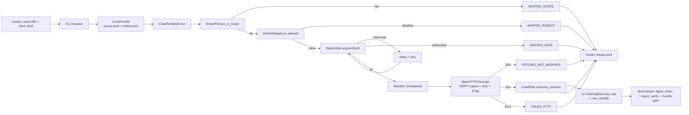

# Figure Corpus Crawler (L0) Spec

> Status: draft (first packet landed; closes debt #19 V2 + debt #28 L0)
> Last updated: 2026-05-10
> 对应需求: R8（snapshot / contract first）、R12（evaluation 单向性）、R15（迁移可解释 + 可回滚）

## 要解决的问题

`docs/known-debts.md` debt #28 把 figure-vertical 的 webcrawl + 数据清洗 + 多源验证拆成 L0 / L1 / L2 三层。本 spec 覆盖 **L0 corpus crawler**：把"我有这个 archive URL，下载它的字节流"自动化，并把字节立刻喂到 L1 `CleaningStore`，建立 content-addressable 三段贯通锚（L0 fetched bytes → L1 raw_sha256 → L2 SourceProvenance.byte_sha256）。

同时关闭 **debt #19 V2 archive fetcher**：`_OfflineArchiveFetcher.fetch()` 之外新增 `live_archive_fetcher(fetch_kind, ...)` 工厂，返回的 `ArchiveFetcher` 用 L0 crawler stack 真实下载，`raw_payload` 是新的 `LiveFetchedBytes`（字节 + sha + content_type）。既有 `offline_archive_fetcher()` 行为不变（向后兼容）。

为什么需要它：

- L1 + L2 都不发 HTTP（contract test AST 静态守门），所以"从 archive URL 拿真字节"必须由 L0 完成
- 直接散在 L1 / L2 里发 HTTP 会污染 SSRF / robots / rate-limit 的安全姿态；集中在 L0 一处就只需要审一遍
- 全 archive 集合是固定且小的（5 个 host），SSRF allowlist 是可行且强治理的方案

## 关键不变量

1. **HTTP 出口集中**。L0 是 figure-vertical **唯一**允许 import HTTP 客户端的层；L1 / L2 仍然禁 HTTP（既有 contract test）。
2. **L0 不写 typed source**。`crawl/` 子包**禁止** import `Figure*Source` typed records；contract test `tests/contracts/test_crawler_module_boundaries.py` AST 静态守门（同 L1 / L2）。
3. **L0 不写 kernel owner**。`crawl/` 子包**禁止** import `volvence_zero.{cognition,...,runtime}.*` 内核模块；同上守门（同 L2）。
4. **L0 不感知 verifier**。`crawl/` 子包**禁止** import `lifeform_domain_figure.verification.*`；crawler 是 artifact 产生者，verifier 在 L1 / curator 路径上独立运行。
5. **SSRF 5 重门**：scheme + host + path-prefix + redirect-1-hop-rescope + body-size-cap，全部在 `BaseHTTPClient` 内强制。
6. **robots.txt fail-closed**：robots.txt 拉取失败（除了显式 404 = "no rules"）→ 该 host 后续所有 URL 拒收。
7. **per-host token bucket** 默认保守（0.5 req/s + burst 5），ScopePolicy 可调。
8. **frontier append-only + dedup by request_id**；持久化到磁盘，可 `resume_from_disk`。
9. **`request_id = sha256(fetch_kind + ":" + url)`**：dedup 与 fetch_kind 联合，同 URL 不同 fetch_kind 是不同 work item（dispatcher 可能选不同 fetcher）。
10. **anchor 三段贯通**：L0 SUCCESS 后写 L1 `CleaningStore.put_raw(...)`，结果中的 `raw_sha256 = SourceProvenance.byte_sha256 = RawDocument.raw_sha256` 是同一字节流的同一 hash。

## R-ID

- R8（snapshot / contract first：`CrawlRequest` / `CrawlResult` 不可变；anchor 三段贯通 = 全链 content-addressable）
- R12（evaluation 单向性：crawler 是 artifact 产生者，绝不写 kernel owner）
- R15（迁移可解释 + 可回滚：append-only frontier + ETag-based incremental + crawl_log 全持久化）

## Schema

```python
class CrawlStatus(str, Enum):
    SUCCESS = "success"
    FETCHED_NOT_MODIFIED = "not_modified"
    SKIPPED_ROBOTS = "skipped_robots"
    SKIPPED_SCOPE = "skipped_scope"
    SKIPPED_RATE = "skipped_rate"
    FAILED_HTTP = "failed_http"
    FAILED_PARSER_PRECHECK = "failed_parser_precheck"

VALID_FETCH_KINDS = frozenset({"generic", "cpae", "wikisource", "gutenberg", "internet_archive"})

@dataclass(frozen=True)
class CrawlRequest:
    url: str
    fetch_kind: str               # one of VALID_FETCH_KINDS
    request_id: str               # sha256(fetch_kind + "\n" + url)
    enqueued_at_iso: str
    referrer: str = ""
    expected_content_type: str = ""

@dataclass(frozen=True)
class CrawlResult:
    request: CrawlRequest
    status: CrawlStatus
    fetched_at_iso: str
    raw_sha256: str = ""          # set iff SUCCESS; == L1 anchor key
    content_type_actual: str = ""
    byte_len: int = 0
    http_status: int = 0
    etag: str = ""
    last_modified: str = ""
    error: str = ""

@dataclass(frozen=True)
class ScopePolicy:
    allowed_hosts: frozenset[str]                              # SSRF allowlist (non-empty)
    user_agent: str
    allowed_path_prefixes: dict[str, tuple[str, ...]] = {}    # default ("/",) per host
    max_pages_per_host: int = 500
    max_body_bytes: int = 50 * 1024 * 1024
    incremental: bool = True

DEFAULT_HOSTS = frozenset({
    "einsteinpapers.press.princeton.edu",
    "en.wikisource.org", "de.wikisource.org", "fr.wikisource.org", "zh.wikisource.org",
    "www.gutenberg.org", "gutenberg.org",
    "archive.org", "ia801.us.archive.org", "ia902.us.archive.org",
    "ctext.org",
})
```

## 5 SSRF Gates (in `BaseHTTPClient.get`)

| # | Gate | Behavior |
|---|------|----------|
| 1 | scheme | reject non-http/https URLs (`file://`, `gopher://` etc.) |
| 2 | host | reject hosts not in `scope.allowed_hosts` |
| 3 | path prefix | reject paths not under `scope.allowed_path_prefixes[host]` (default `("/",)`) |
| 4 | redirect 1-hop rescope | `allow_redirects=False`; on 3xx, validate `Location` against scope, follow at most one hop |
| 5 | body size cap | stream-read body; raise `BodyTooLarge` over `scope.max_body_bytes` |

Plus retry: 429 / 5xx / network error → `urllib3.util.retry.Retry` with backoff.

## 5 Fetchers

| Kind | Module | Behavior |
|---|---|---|
| `generic` | `fetchers/generic.py` | passthrough; content_type = response header (or `expected_content_type` fallback) |
| `cpae` | `fetchers/cpae.py` | URL pattern `https://einsteinpapers.press.princeton.edu/...`; force content_type to `CPAE_PDF_CONTENT_TYPE` |
| `wikisource` | `fetchers/wikisource.py` | rewrite URL with `?action=raw` first (→ `WIKISOURCE_WIKITEXT_CONTENT_TYPE`); fallback rendered HTML (→ `WIKISOURCE_HTML_CONTENT_TYPE`) |
| `gutenberg` | `fetchers/gutenberg.py` | rewrite `/ebooks/N` → `/files/N/N-0.txt` (→ `GUTENBERG_TEXT_CONTENT_TYPE`); fallback HTML (→ `GUTENBERG_HTML_CONTENT_TYPE`) |
| `internet_archive` | `fetchers/internet_archive.py` | GET `https://archive.org/metadata/{id}` JSON, find OCR JSON file (`*_djvu.json` / `*_chocr.html.json` / `*_ocr.json`), GET that → `ARCHIVE_ORG_OCR_CONTENT_TYPE` |

Adding a new archive: (a) new `fetchers/<name>.py` file, (b) extend `VALID_FETCH_KINDS` in `records.py`, (c) register in `_FETCHER_FACTORIES` dict in `fetchers/__init__.py`, (d) update this spec.

## Frontier layout

```
root/
  crawl/
    {run_id}/
      queue.jsonl       # pending CrawlRequests, one JSON per line
      visited.jsonl     # already-popped request_ids (dedup)
      results.jsonl     # CrawlResult append log
```

Resumability: `CrawlFrontier.resume_from_disk(root, run_id)` rebuilds in-memory state from disk. Pending = lines in queue.jsonl whose request_id is not in visited.jsonl.

`root` defaults to `packages/lifeform-domain-figure/data/`; `data/crawl/` is in `.gitignore` (with `raw/` `cleaned/` `verification/`).

## Scheduler pipeline

For each request popped from the frontier:

1. Scope check → SKIPPED_SCOPE on reject (path / host / scheme).
2. Robots check → SKIPPED_ROBOTS on disallow / fail-closed cache state.
3. Per-host page budget (`max_pages_per_host`) → SKIPPED_SCOPE with `"max_pages_per_host"` reason on cap.
4. Rate limit acquire → if dry, `sleep(sleep_hint_seconds)` and retry once; still dry → SKIPPED_RATE.
5. `dispatch_for(request, fetchers)` → KeyError on unknown kind → FAILED_PARSER_PRECHECK.
6. `fetcher.fetch(request, http_client)` →
   - `ScopeRejection` → SKIPPED_SCOPE (e.g., redirect hopped out of scope)
   - `BodyTooLarge` → FAILED_HTTP
   - `FetchError` → FAILED_HTTP
   - `NOT_MODIFIED` → FETCHED_NOT_MODIFIED
   - `HTTPResponse` → continue
7. `derive_content_type(request, response)` (any exception → FAILED_PARSER_PRECHECK)
8. `sink.consume_success(request, response, content_type)` → writes L1 CleaningStore + appends SUCCESS CrawlResult.

Sink does NOT call L1 parser/cleaner; that is curator's `figure_clean.py` step (separation of concerns).

## CLI

`scripts/figure_crawl.py` — five subcommands:

```bash
# Single-URL enqueue
python figure_crawl.py enqueue \
    --root <crawl-root> --run-id einstein-2026Q2 \
    --url 'https://einsteinpapers.press.princeton.edu/vol2-doc/24/pdf' \
    --fetch-kind cpae

# Bulk enqueue
python figure_crawl.py enqueue-batch \
    --root <crawl-root> --run-id einstein-2026Q2 \
    --requests-file seeds.jsonl

# Drive scheduler (writes bytes into L1 CleaningStore)
python figure_crawl.py run \
    --root <crawl-root> --run-id einstein-2026Q2 \
    --cleaning-root <cleaning-root> \
    --rate-rps 0.5 --burst 5 --max-pages 100

# Frontier status
python figure_crawl.py status --root <root> --run-id einstein-2026Q2

# Crawl log
python figure_crawl.py list-results \
    --root <root> --run-id einstein-2026Q2 \
    [--status-filter success]
```

`seeds.jsonl` line schema:

```json
{"url": "...", "fetch_kind": "cpae", "expected_content_type": "application/pdf", "referrer": ""}
```

## V2 ArchiveFetcher closure (debt #19)

`live_archive_fetcher(fetch_kind, *, scope=None, http_client=None, cleaning_store=None, user_agent=None) -> ArchiveFetcher` factory in `corpus/archives/__init__.py`:

- Returns an `ArchiveFetcher`-Protocol-compatible object whose `fetch(url)` returns `ArchiveFetchResult(source_url=url, raw_payload=LiveFetchedBytes(...))`
- `LiveFetchedBytes` is the V2 raw_payload shape: `body` + `raw_sha256` + `content_type` + `http_status`
- Single-URL mode: applies SSRF scope check + dispatches to L0 fetcher + writes bytes to `cleaning_store` if supplied
- Does NOT consult robots.txt or apply rate limit (that is `CrawlScheduler`'s job)
- `offline_archive_fetcher()` retained unchanged — V1 caller / test never broken

Migration map for V1 → V2:

```
V1: payload = curator-supplied CPAEPayload(...)
    source = cpae_to_paper_source(payload, figure_id="einstein")

V2: result = live_archive_fetcher("cpae", cleaning_store=store).fetch(url)
    raw = parse_cpae_pdf(result.raw_payload.body, source_url=url, content_type=result.raw_payload.content_type)
    cleaned = clean_raw_document(raw)
    payload = cleaned_to_cpae_payload(cleaned, document_id=..., volume=..., ...)  # curator metadata still required
    source = cpae_to_paper_source(payload, figure_id="einstein")
```

## 数据流



## 与其他能力域的关系

| 域 | 关系 |
|---|---|
| L1 cleaning ([figure-corpus-cleaning.md](./figure-corpus-cleaning.md)) | L0 SUCCESS 直接写 L1 `CleaningStore.put_raw`；anchor key 同步 |
| L2 verification ([figure-corpus-verification.md](./figure-corpus-verification.md)) | L0 不感知 verifier；curator 在 L1 → L2 bridging 时构造 SourceProvenance（继承 L0/L1 的 raw_sha256） |
| `_OfflineArchiveFetcher` ([archives/__init__.py](packages/lifeform-domain-figure/src/lifeform_domain_figure/corpus/archives/__init__.py)) | 行为不变；新增 `live_archive_fetcher` 工厂关闭 #19 V2 |
| #15 DLaaS asset.uri fetcher | DLaaS 平台层的并行需求；可考虑共用 `BaseHTTPClient` 与 `ScopePolicy`（follow-up packet） |
| #26 metadata client | OpenAlex / Wikidata / Crossref / SEP，shape 不同（JSON API），独立 follow-up；可共用 `BaseHTTPClient` |

## 测试

- `packages/lifeform-domain-figure/tests/crawl_mocks.py` — `FakeSession` + `make_response` HTTP 注入工具
- `test_crawl_records_smoke.py` (7 case) — schema 校验
- `test_crawl_scope_policy_smoke.py` (7 case) — host / scheme / path prefix gates
- `test_crawl_rate_limiter_smoke.py` (5 case) — token refill + per-host 隔离
- `test_crawl_frontier_smoke.py` (5 case) — enqueue / dedup / persistence / resume
- `test_crawl_robots_smoke.py` (5 case) — allow / disallow / 404 / fail-closed / cache hit
- `test_crawl_http_client_smoke.py` (8 case) — SSRF 5 gates + 304 + body cap + 4xx
- `test_crawl_fetchers_smoke.py` (14 case) — 5 fetcher 各路径 + dispatcher
- `test_crawl_sink_smoke.py` (4 case) — L1 store wiring
- `test_crawl_scheduler_smoke.py` (6 case) — 端到端：success / robots / scope / rate / failed_http / max_pages_per_host
- `test_archive_v2_live_fetcher_smoke.py` (6 case) — debt #19 closure：4 archive live + offline 仍 raise + scope reject
- `tests/contracts/test_crawler_module_boundaries.py` (4 case) — AST 守门：typed_source 禁 / kernel 禁 / verification 禁
- `tests/contracts/test_crawler_respects_robots.py` (2 case) — disallow / allow 全链
- `tests/contracts/test_crawler_uses_l1_cleaning_store.py` (1 case) — SUCCESS 后 L1 store 含对应 raw_sha256

合计 73 个新 case，全绿。既有 figure 199 + L1 39 + L2 24 = 262 加 L0 73 = 335 case 全绿，零回归。

## 变更日志

- 2026-05-10 — 初版落地（debt #28 L0 first batch + debt #19 closure）。10 个 crawl 子模块 + 5 fetcher + CLI + 14 个测试套（73 case）+ `live_archive_fetcher` 工厂。`requests` 是新依赖。
