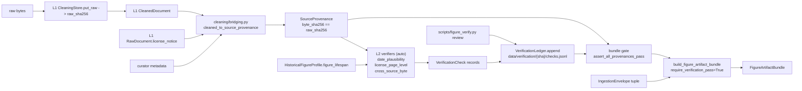

# Figure Corpus Verification + Audit (L2) Spec

> Status: full set landed (first batch + second batch)
> Last updated: 2026-05-10
> 对应需求: R8（snapshot / contract first）、R12（evaluation 单向性）、R15（迁移可解释 + 可回滚）

## 要解决的问题

`docs/known-debts.md` debt #28 把 figure vertical 的 webcrawl + 数据清洗 + 多源验证拆成 L0 / L1 / L2 三层。本 spec 覆盖 **L2 verification + audit**：在 L1 把字节流变成 cleaned text、并配上 typed `SourceProvenance` 之后，对每条 source 跑一组**关闭枚举的验证检查**，把结果落到 append-only 的 `VerificationLedger`，并在 `build_figure_artifact_bundle(...)` 上加一个 `require_verification_pass` gate，拒绝把任何一条 source 在未通过验证的情况下编进 bundle。

为什么需要它：

- L1 解决的是"字节怎么变 cleaned text"，但 cleaned text 仍可能：(i) 来源年份和 figure 生平不对（fact 错配）；(ii) 法律 license 与 reviewer 声明的 `LegalClearance` 矛盾（合规问题）；(iii) 同一份文献在不同源里 byte_sha256 不一致（OCR 或编辑差异，需要选 canonical）
- 这三类问题不能在 L1 cleaner 里 fail loud（cleaner 只看一个 raw bytes，不知道整批的关系），也不能等到 retrieval / coverage / steering / LoRA 这些下游模块去发现（它们会把脏数据消化进去，污染 bundle）
- 必须有一个**显式的、独立的、可 audit 的**验证层，作为 bundle build 的 gate

## 关键不变量

1. **Verifier 不直接产 typed source**。`verification/` 子包**禁止** import `Figure*Source` typed records（必须经 L1 `cleaning/bridging.py` 二段式）；契约测试 `tests/contracts/test_verification_module_boundaries.py` AST 静态守门。
2. **Verifier 不发 HTTP**。L2 的输入是 in-memory `SourceProvenance`，由 curator 或 L1 bridging 喂；任何外部 metadata 抓取属于 #26 follow-up；同上守门。
3. **Verifier 不写 kernel owner**。verifier 是 readout / artifact，与 R12 evaluation 单向性同口径；同上守门。
4. **`VerificationCheck` 不可变**（frozen dataclass）；`evidence` 必须是非空 tuple；`reviewer_id` 必须形如 `auto:<verifier_id>:<int>` 或 `human:<reviewer-id>`。
5. **Ledger append-only**。`VerificationLedger.append(check)` 永不删除或重写历史；override 通过 append 一条 `human:<id>` check 来实现；`latest_per_kind(...)` 取每 kind 最新 append 一条作为生效 verdict。
6. **Anchor key = `source_byte_sha256` = `SourceProvenance.byte_sha256` = L1 `RawDocument.raw_sha256`**。content-addressable 三段贯通；任何破坏这条对应关系的 PR 在 `cleaned_to_source_provenance(cleaned, raw, ...)` 的 `__post_init__` 校验里 fail loud。
7. **Gate 阶段性放行**。bundle gate 只检查 `IMPLEMENTED_CHECK_KINDS` 的全 PASS（本 packet = 3 个 first batch）；deferred kinds 不强制。新 kind 实现时必须**同步**加入 `IMPLEMENTED_CHECK_KINDS`，contract test 自动 surface 缺失覆盖。

## R-ID

- R8（snapshot / contract first）
- R12（evaluation 单向性 / readout 不反向写 kernel）
- R15（迁移可解释 + 可回滚：append-only ledger + bundle gate 显式 fail，不静默 degrade）

## Schema

```python
class CheckKind(str, Enum):
    DATE_PLAUSIBILITY = "date_plausibility"             # impl batch 1
    LICENSE_PAGE_LEVEL = "license_page_level"           # impl batch 1
    CROSS_SOURCE_BYTE = "cross_source_byte"             # impl batch 1
    IDENTITY_DISAMBIGUATION = "identity_disambiguation" # batch 2 (deferred)
    AUTHORSHIP_ATTRIBUTION = "authorship_attribution"   # batch 2 (deferred)
    VERSION_RECONCILIATION = "version_reconciliation"   # batch 2 (deferred)
    TRANSLATION_LINEAGE = "translation_lineage"         # batch 2 (deferred)

IMPLEMENTED_CHECK_KINDS: frozenset[CheckKind] = frozenset(CheckKind)
# All 7 kinds implemented as of debt #28 L2 second batch (2026-05-10):
# - first batch: DATE_PLAUSIBILITY, LICENSE_PAGE_LEVEL, CROSS_SOURCE_BYTE
# - second batch (metadata-dependent, depend on debt #26 V2 clients):
#   IDENTITY_DISAMBIGUATION, AUTHORSHIP_ATTRIBUTION,
#   VERSION_RECONCILIATION, TRANSLATION_LINEAGE

class Verdict(str, Enum):
    PASS = "pass"
    FAIL = "fail"
    NEEDS_REVIEW = "needs_review"

@dataclass(frozen=True)
class VerificationCheck:
    check_kind: CheckKind
    verdict: Verdict
    evidence: tuple[str, ...]      # non-empty bullet strings
    reviewer_id: str               # "auto:<verifier_id>:<int>" or "human:<id>"
    reviewed_at_iso: str
    source_byte_sha256: str        # 64-char hex; == SourceProvenance.byte_sha256
```

## 7 Check Kinds

| # | Kind | Status | 输入 | 输出规则 |
|---|---|---|---|---|
| 1 | `DATE_PLAUSIBILITY` | **impl** | `(provenance, document_year, figure_lifespan)` | `birth <= year <= death`（含端点）→ PASS；外面 → FAIL；`birth > death` → NEEDS_REVIEW（拒判 ill-formed lifespan） |
| 2 | `LICENSE_PAGE_LEVEL` | **impl** | `(provenance)` | `legal_clearance == TENANT_DECLARED` → PASS；`license_label` 含 hard-conflict 短语（"all rights reserved" / "copyright (c)" / "©"）且 clearance 是 PUBLIC_DOMAIN_* → FAIL；含 allowlist 短语 → PASS；空 / sentinel / 都不命中 → NEEDS_REVIEW |
| 3 | `CROSS_SOURCE_BYTE` | **impl** | `(group: tuple[SourceProvenance, ...], document_group_key)` | 单源组 → PASS；同组 byte_sha256 全相同 → 全员 PASS；不同 → 全员 NEEDS_REVIEW + evidence 列冲突 |
| 4 | `IDENTITY_DISAMBIGUATION` | **impl (2026-05-10)** | `(provenance, wikidata_client, expected_qid, expected_birth_year, expected_occupations)` | Wikidata QID single-lookup → birth year cross-check (`±1` tolerance) → FAIL on mismatch；occupation overlap zero with non-empty expected → NEEDS_REVIEW；fetch failure → NEEDS_REVIEW；else PASS |
| 5 | `AUTHORSHIP_ATTRIBUTION` | **impl (2026-05-10)** | `(provenance, openalex_client, expected_openalex_author_id, candidate_work_id, coauthor_anchor_works, candidate_coauthor_openalex_ids)` | OpenAlex author works lookup → direct work-id match → PASS；no match + coauthor overlap data → NEEDS_REVIEW；no match + no overlap data → FAIL；fetch failure → NEEDS_REVIEW |
| 6 | `VERSION_RECONCILIATION` | **impl (2026-05-10)** | `(provenance, crossref_client, source_doi, canonical_doi_hint)` | Crossref `relation` map check (`is-version-of` / `replaces` / `replaced-by` / `is-preprint-of` / `has-preprint` / `is-translation-of` / `has-translation`) → empty → PASS；non-empty + canonical_doi_hint matches → PASS；non-empty + canonical mismatch → NEEDS_REVIEW |
| 7 | `TRANSLATION_LINEAGE` | **impl (2026-05-10)** | `(provenance, crossref_client, source_doi, source_language, figure_native_languages, work_of_qid)` | Crossref `translator` field × language match heuristic：lang-differ + translator-present → PASS；lang-differ + translator-empty → NEEDS_REVIEW；lang-match + translator-empty → PASS；lang-match + translator-present → NEEDS_REVIEW |

## Storage layout

```
root/
  verification/
    {source_byte_sha256}/
      checks.jsonl       # one VerificationCheck per line, append-only
```

每行 JSON 形如：

```json
{"check_kind": "date_plausibility", "verdict": "pass", "evidence": ["document_year=1905", "figure_lifespan=[1879,1955] (inclusive)", "source_id=..."], "reviewer_id": "auto:date_plausibility:1", "reviewed_at_iso": "2026-05-10T12:00:00+00:00", "source_byte_sha256": "..."}
```

`root` 默认 `packages/lifeform-domain-figure/data/`（与 L1 `raw/` `cleaned/` 同治理；`.gitignore` 排除 `data/verification/`，仅保留 `data/.gitkeep`）。

## Bundle gate

```python
@dataclass(frozen=True)
class FigureBundleInputs:
    profile: HistoricalFigureProfile
    envelopes: tuple[IngestionEnvelope, ...]
    extra_style_terms: tuple[str, ...] = ()
    time_window_id: str | None = None
    steering: object | None = None
    lora: object | None = None
    # L2 (新增):
    provenance_records: tuple[SourceProvenance, ...] = ()
    verification_ledger: VerificationLedger | None = None
    require_verification_pass: bool = False
```

在 `build_figure_artifact_bundle(inputs)` 顶部：

```python
if inputs.require_verification_pass:
    if inputs.verification_ledger is None:
        raise VerificationGateError("...needs verification_ledger")
    if not inputs.provenance_records:
        raise VerificationGateError("...provenance_records is empty")
    assert_all_provenances_pass(
        inputs.provenance_records, inputs.verification_ledger
    )
```

`assert_all_provenances_pass` 对每个 provenance 跑：对每个 `IMPLEMENTED_CHECK_KINDS`，从 `ledger.latest_per_kind(byte_sha256)` 取最新 check；缺失 → "missing-check"；非 PASS → 列出 verdict + reviewer_id。任一失败 → `VerificationGateError`，message 列出每 source 每 kind 的失败原因。

`require_verification_pass=False`（默认）下行为 = land 之前；既有 caller 零回归。

## L1 → L2 接线（修法 5）

L1 的 `cleaning/bridging.py` 新增 `cleaned_to_source_provenance(cleaned, raw, *, source_id, figure_id, source_url, legal_clearance, capture_method, captured_by, captured_at_iso, provenance_note, license_label_override="", jurisdiction_hint="") -> SourceProvenance`：

- `byte_sha256 = raw.raw_sha256`（L1 anchor 直传 L2）
- `license_label = license_label_override or raw.license_notice or L1_LICENSE_SENTINEL`（curator override 优先；否则用 L1 抽到的；否则 sentinel `"(no license notice scraped)"`）
- 校验 `cleaned.raw_sha256 == raw.raw_sha256`，避免 cleaned/raw 错配

L1 sentinel 让 `LICENSE_PAGE_LEVEL` verifier 在无 license_notice 时显式产 `NEEDS_REVIEW`（fail-loud），gate 在 `require_verification_pass=True` 下拒收。

## CLI (`scripts/figure_verify.py`)

```bash
# 批量跑全部 7 个 auto verifier (Wave I closure)
python figure_verify.py run-batch \
    --root <verification-root> \
    --provenance-file <provenances.jsonl> \
    --figure-context-file <figure-context.json> \
    --metadata-mode {offline,live}

# 抽样（read-only inspection）
python figure_verify.py review --root <root> --sample 10 [--seed 42]

# 单 anchor 人审 override
python figure_verify.py review --root <root> \
    --anchor <byte_sha256> \
    --check-kind license_page_level \
    --verdict pass \
    --reviewer reviewer-x \
    --evidence "manual approval" "external licence on file"

# 列出全部 anchor + latest_per_kind 矩阵
python figure_verify.py list --root <root>
```

`provenances.jsonl` 每行是一个 `SourceProvenance` 字段集合 + 7 个 verifier 必需的 extras（前 3 个是 first-batch；后面 5 个是 second-batch metadata-driven verifiers，缺失任一字段时对应 axis 落 `NEEDS_REVIEW`）：

```json
{"source_id": "...", "figure_id": "einstein", "source_url": "...", "license_label": "...", "legal_clearance": "public_domain_global", "capture_method": "transcribed", "captured_by": "...", "captured_at_iso": "...", "byte_sha256": "...", "provenance_note": "...", "jurisdiction_hint": "", "document_year": 1905, "figure_lifespan": [1879, 1955], "document_group_key": "einstein-1905-paper-1", "candidate_work_id": "W4205692301", "candidate_coauthor_openalex_ids": [], "source_doi": "10.1002/andp.19053220607", "source_language": "de", "canonical_doi_hint": ""}
```

`figure-context.json` 是**每个 figure 一份**的常量（4 个 metadata-driven verifier 一起读）：

```json
{
  "expected_qid": "Q937",
  "expected_birth_year": 1879,
  "expected_occupations": ["physicist"],
  "expected_openalex_author_id": "A5023888391",
  "coauthor_anchor_works": [],
  "figure_native_languages": ["de"]
}
```

`--metadata-mode offline`（default）走 `_OfflineWikidataClient` / `_OfflineOpenAlexClient` / `_OfflineCrossrefClient` 的 V1 stub —— 它们的 `.fetch_*` 抛 `NotImplementedError`，run-batch 包裹后写 `NEEDS_REVIEW`（不让 ledger 出现 `missing-check`）。`--metadata-mode live` 走 V2 client 真发 HTTP（`MetadataCache` 自动复用，SSRF 白名单 + role gate 都生效）。CLI 用 `utf-8-sig` 读 JSONL（容忍 Windows 注入的 BOM）。

**Singleton CROSS_SOURCE_BYTE**：当一个 anchor 没有 `document_group_key` 同伴时，run-batch 仍会写一行 `verdict=PASS, reviewer_id=auto:cross_source_byte_singleton:1`，避免 bundle gate 看到 `missing-check`。

## 数据流



## 与其他能力域的关系

| 域 | 关系 |
|---|---|
| L1 cleaning ([figure-corpus-cleaning.md](./figure-corpus-cleaning.md)) | L2 直接消费 L1 的 `RawDocument.license_notice` 与 `raw_sha256`；新 helper `cleaned_to_source_provenance` 在 `cleaning/bridging.py` |
| `SourceProvenance` D2 schema (`corpus/provenance.py`) | L2 直接消费；本 packet 不改 schema，只新增 verifier + ledger + gate |
| Bundle build (`compiler.py:build_figure_artifact_bundle`) | gate 挂载点；`FigureBundleInputs` 加 3 个默认字段，既有 caller 零回归 |
| `compute_bundle_integrity_hash` (`figure_artifact.py`) | 本 packet **不**折入 verification fingerprint（属 #25 工作） |
| L0 crawler frontier ([figure-corpus-crawl.md](./figure-corpus-crawl.md)) | **landed (2026-05-10)**；crawler 输出字节流给 L1，L1 输出 + curator metadata 由 `cleaned_to_source_provenance` 桥到 L2；L0 与 L2 通过 L1 间接耦合，no direct import |
| #26 metadata client | deferred 4 verifier 的前置依赖；schema 已立，stub 在 `verifiers/__init__.py` |

## 测试

- `packages/lifeform-domain-figure/tests/test_verification_records_smoke.py` — schema 校验（9 case）
- `packages/lifeform-domain-figure/tests/test_verification_ledger_smoke.py` — append + read + latest_per_kind + list_anchors（7 case）
- `packages/lifeform-domain-figure/tests/test_verifier_date_plausibility_smoke.py` — 6 case（in-range / boundary / above / below / inverted lifespan）
- `packages/lifeform-domain-figure/tests/test_verifier_license_page_level_smoke.py` — 6 case（PD/conflict/sentinel/CC-BY/tenant_declared/unrelated）
- `packages/lifeform-domain-figure/tests/test_verifier_cross_source_byte_smoke.py` — 5 case（singleton / consistent / disagreeing / empty / blank-key）
- `packages/lifeform-domain-figure/tests/test_cleaning_to_provenance_bridging_smoke.py` — 5 case（sha 透传 / license 默认 / override / sentinel / mismatched-sha 拒收）
- `packages/lifeform-domain-figure/tests/test_verification_gate_smoke.py` — 7 case（默认 off / 全 PASS / 缺 ledger / 缺 provenance / 缺 check / 单 FAIL / human 覆盖）
- `tests/contracts/test_bundle_admits_only_verified_sources.py` — 6 case 跨 wheel 守门（默认 off / 全 PASS / 缺 kind / 单 FAIL / IMPLEMENTED_CHECK_KINDS 子集 / deferred 调用）
- `tests/contracts/test_verification_module_boundaries.py` — 4 case AST 静态扫（typed source / HTTP / kernel module 三类禁止 import）

合计 **55 个新 test case**，加 L1 39 + 既有 199 = 293 case 全绿。

## 变更日志

- 2026-05-10 — 初版落地（debt #28 L2 first batch）。3 / 7 verifier 真实现（DATE_PLAUSIBILITY / LICENSE_PAGE_LEVEL / CROSS_SOURCE_BYTE）；4 deferred kinds schema 立 + NotImplementedError stub；ledger + gate + CLI + L1 接线 + 9 个测试套（55 case）。
- 2026-05-12 — Wave I closure：`figure_verify run-batch` 真调度全部 7 个 verifier（前 3 个 first-batch + 4 个 metadata-driven second-batch）。CLI 加 `--metadata-mode {offline, live}` + `--figure-context-file`；缺 figure-context / 缺 per-source extras 时对应 axis 写 `NEEDS_REVIEW`（永不 `missing-check`）。Singleton anchors 拿到 trivially-PASS 的 `cross_source_byte` 行。新增 contract test [`tests/contracts/test_run_batch_covers_all_implemented_check_kinds.py`](../../tests/contracts/test_run_batch_covers_all_implemented_check_kinds.py)：AST 静态守门 `figure_verify.py` import + 调用全部 `IMPLEMENTED_CHECK_KINDS` 的 verifier；未来扩 IMPLEMENTED_CHECK_KINDS 必须同时 wire CLI。新增 4 个 smoke case（[`test_verification_run_batch_smoke.py`](../../packages/lifeform-domain-figure/tests/test_verification_run_batch_smoke.py)）。
- 2026-05-10 — second batch land（debt #28 L2 second batch + debt #26 closure）。剩余 4 / 7 verifier 真实现（IDENTITY_DISAMBIGUATION / AUTHORSHIP_ATTRIBUTION / VERSION_RECONCILIATION / TRANSLATION_LINEAGE），全 backed by V2 metadata clients (Wikidata / OpenAlex / Crossref)。`IMPLEMENTED_CHECK_KINDS = frozenset(CheckKind)` 全 7 启用；bundle gate 现要求每条 source 的 7 axes 全 PASS（含 NEEDS_REVIEW 转 PASS 必经 human override）。新增 `MetadataDependentVerifierContext` typed bundle 让 batch CLI 一次注入所有客户端 + 图灵 figure 上下文（QID / OpenAlex author id / native langs / co-author anchors）。新增 21 个 per-package case + 4 个 contract case（含 `test_figure_bundle_metadata_fingerprint` 跨切 #25 R15 byte-level 回滚契约）。
