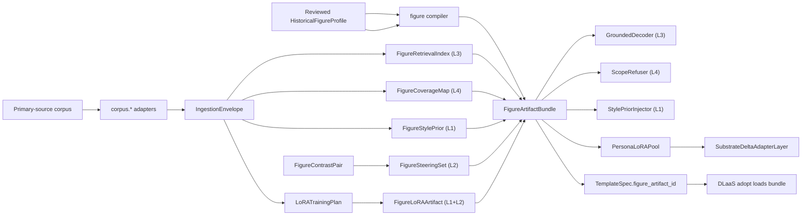

# Real-Person Figure Vertical Spec

> Status: draft
> Last updated: 2026-05-10
> 对应需求: R2, R5, R6, R8, R9, R10, R11, R12, R14, R15

## 要解决的问题

把一个真实人物（已逝历史人物或在世授权人物）的全部一手资料 — 论文、书信、演讲、手稿 — 编译成一个**忠诚度可控的数字生命**：在它写过的领域上引证可追溯，在它没写过的领域上明确拒答，在它写过的内容上语气/立场尽量贴近。

不能把人物全集塞进 prompt，也不能从基底 LLM 让它"自由发挥地像 Einstein 说话"——前者是检索糊脸，后者是让 Qwen 的物理学先验冒充 Einstein。

## 与 character vertical 的关系

`lifeform-domain-figure` 与 [`lifeform-domain-character`](../../packages/lifeform-domain-character/) 是**并列 vertical**，不是父子或扩展关系。两个 vertical 的不变量差距足以撑起独立 wheel：

| | `lifeform-domain-character` | `lifeform-domain-figure` |
|---|---|---|
| 来源 | 单一作者虚构叙事 | 多源头一手资料（论文 / 信件 / 演讲 / 笔记） |
| 真值性质 | 文本即真理 | 文本是**证据**，不是真理 |
| 覆盖面 | 角色只活在书里那些场景 | 物理 / 政治 / 哲学 / 宗教，**有大量空白** |
| 引证义务 | "小说里写..." | "Einstein 在 1924 年给 X 的信中说..." — 法律和事实双重义务 |
| 对照集 | 书里其它角色 | **有名有姓的对手**（Bohr / Heisenberg / Born），已成文 |
| 时间分层 | 通常一致 | **早期 vs 晚期**立场可能不同，需要时间版本化 |
| 多语言 | 通常单语 | 德 / 英 / 法 / 原始手稿混杂 |
| IP | 作者 / 版权方 | 公共领域（已故）vs 在世（差异巨大） |

## 关键不变量

- Figure vertical 是 lifeform 应用层 vertical，**不**新增 brain kernel owner。
- 输入必须是 reviewed `HistoricalFigureProfile` + 多个 `FigureCorpusSource` envelope；不通过关键词匹配从语料文本直接驱动行为（`no-keyword-matching-hacks.mdc`）。
- 编译产物 `FigureArtifactBundle` 是**不可变快照**（frozen dataclass），跨 wheel 只读消费（R8 SSOT）。
- 一手语料只通过 `lifeform-ingestion` 走 canonical `LifeformSession.run_turn(..., trigger_kind=INGESTION)`；durable 化由 R6 session-post slow loop 负责。
- 任何对基底权重的位移（steering / persona LoRA）走 rare-heavy `ModificationGate.OFFLINE` 通道，必须 `validation_delta ≥ 0.05` + `is_reversible=True` + 非空 `rollback_evidence`（R10）。
- 回滚通过 `figure_artifact_id` 切换实现，不直接改基底权重（R15）。
- 默认 wiring 都从 `WiringLevel.SHADOW` 开始，evaluation 证据先行才晋升。

## 保真阶梯（L1 / L2 / L3 / L4）

这是这个 vertical 的核心契约面，所有产物围绕它组织：

| 层级 | 含义 | 数据制品 | 运行时执行者 |
|---|---|---|---|
| **L1 语气保真** | "听起来像他" — 词汇 / 句法 / 常用类比 | `FigureStylePrior` (P2.3) + `FigureLoRAArtifact` (F6) | `StylePriorInjector` (P3.3) + `PersonaLoRAPool` (P6.3) |
| **L2 立场保真** | "在他写过的议题上观点对得上" | `FigureSteeringSet` (F5) + `FigureLoRAArtifact` | `SubstrateDeltaAdapterLayer` 常量 delta + `PersonaLoRAPool` |
| **L3 引证保真** | "每段实质性断言都能回溯到他的原文" | `FigureRetrievalIndex` (P2.1) | `GroundedDecoder` (P3.1) |
| **L4 不知拒答** | "他没写过的领域系统拒答 / 软免责" | `FigureCoverageMap` (P2.2) | `ScopeRefuser` (P3.2) |

**早停点**：L1 + L3 + L4 = **零 GPU 训练**就能上线的 minimum-viable Figure。L2 / 加强版 L1 是 F5 / F6 的边际收益层，需要 ModificationGate evidence 才进。

## 接口契约

新 wheel：

```text
packages/lifeform-domain-figure/
```

公开 API（按 packet 渐进添加）：

| Packet | 公开符号 |
|---|---|
| P1.1 | `HistoricalFigureProfile`, `TimeWindowedView`, `build_einstein_profile` |
| P1.2 | `build_figure_ingestion_envelope`, `FigureCorpusSource`, ingest_papers / ingest_letters / ingest_lectures / ingest_notebooks |
| P2.1 | `FigureRetrievalIndex`, `RetrievalEvidence`, `build_figure_retrieval_index` |
| P2.2 | `FigureCoverageMap`, `CoverageDecision`, `build_figure_coverage_map` |
| P2.3 | `FigureStylePrior`, `FigureArtifactBundle`, `build_figure_artifact_bundle`, `build_figure_lifeform` |
| P5.1 | `FigureContrastPair`, `prepare_steering_data` |
| P5.2 | `FigureSteeringSet`, `bake_figure_steering`, `apply_steering_through_gate` |
| P6.1 | `LoRATrainingPlan`, `prepare_lora_training_data`, `PersonaLoRAProposal` |
| P6.2 | `FigureLoRAArtifact`, `SyntheticLoRABakeBackend`, `PEFTLoRABakeBackend` (interface stub) |
| P6.3 | `apply_persona_lora_through_gate` |

`vz-substrate` 上的最小附加面（additive，与 [`docs/moving forward/dlaas-platform-rollout.md`](../moving%20forward/dlaas-platform-rollout.md) 切片 5.4 的 substrate streaming additive 例外口径一致）：

| Packet | 模块 |
|---|---|
| P3.1 | `volvence_zero.substrate.grounded_decode_hook` — `GroundedDecodeHook` Protocol |
| P6.3 | `volvence_zero.substrate.persona_lora_pool` — `PersonaLoRAPool` |

`lifeform-expression` 上的最小附加面：

| Packet | 模块 |
|---|---|
| P3.1 | `lifeform_expression.grounded_decoder` — `GroundedDecoder` |
| P3.2 | `lifeform_expression.scope_refuser` — `ScopeRefuser` |
| P3.3 | `lifeform_expression.style_prior_injector` — `StylePriorInjector` + `LifeformLLMResponseSynthesizer.figure_bundle` 注入点 |

`dlaas-platform-*` 上的最小附加面：

| Packet | 文件 / 字段 |
|---|---|
| P4.1 | `TemplateSpec.figure_artifact_id`, `.citation_policy`, `.coverage_policy`, `.figure_time_window` |
| P4.2 | `lifeform-service` adopt 路径加载 `FigureArtifactBundle` 并注入 synthesizer |

## 数据流



## 与其他能力域的关系

| 关系 | 能力域 | 说明 |
|---|---|---|
| 依赖 | Domain Experience Layer | 知识 / 案例 / 策略 / 边界编译进既有 application owner |
| 依赖 | Runtime Ingestion | 一手语料通过 canonical ingestion path 进入 |
| 依赖 | Lifeform Vitals | 时间版本化的 drive 通过 `VitalsBootstrap` 表达 |
| 协作 | Cognitive Regime | 风格 / 立场通过 case / playbook / delayed credit 影响 regime，不进入 prompt 关键词 |
| 协作 | Semantic State Owners | 关系 / 价值 / 边界由九个 semantic owners 持有 |
| 协作 | Substrate (R2) | 仅通过 `SubstrateDeltaAdapterLayer` 的 LoRA / steering 受限位移；**不**端到端微调基底 |
| 协作 | ModificationGate (R10) | rare-heavy artifact (steering / LoRA) 强制走 OFFLINE 闸 |
| 协作 | DLaaS Templates (Phase 3) | `TemplateSpec` 携 `figure_artifact_id`；adopt 时加载 bundle |

## 复制 character vertical 的 rare-heavy 范式

steering 和 persona LoRA 的 ModificationGate 集成 mirror [`packages/lifeform-domain-character/src/lifeform_domain_character/rare_heavy_apply.py`](../../packages/lifeform-domain-character/src/lifeform_domain_character/rare_heavy_apply.py) 的 `apply_drive_evolution_through_gate`：

* `validation_delta ≥ 0.05`（OFFLINE 边际）
* `capacity_cost ≤ 0.75`
* `rollback_evidence` 必填
* `is_reversible=True`
* 反向 delta 应用后能恢复基底（rollback drill 测试覆盖）

## 后端形态（hybrid）

* **F5 steering** — 真后端。CPU 可跑（量小、线性 readout / contrastive head）。
* **F6 LoRA** — `SyntheticLoRABakeBackend` 优先（确定性合成 LoRA delta，与 `SubstrateDeltaAdapterLayer` 同形，用于 SHADOW / e2e 验证）；`PEFTLoRABakeBackend` 留接口空壳，真实 GPU 训练作为 future packet 单独接入。Mirror [`packages/vz-substrate/src/volvence_zero/substrate/residual_backend.py`](../../packages/vz-substrate/src/volvence_zero/substrate/residual_backend.py) 现有的 `SyntheticOpenWeightResidualRuntime` / `TransformersOpenWeightResidualRuntime` 双后端格局。

## 变更日志

- 2026-05-10: 初始版本。落地 vertical scaffold + L1/L2/L3/L4 阶梯定义 + F1-F6 packet 序列描述。
