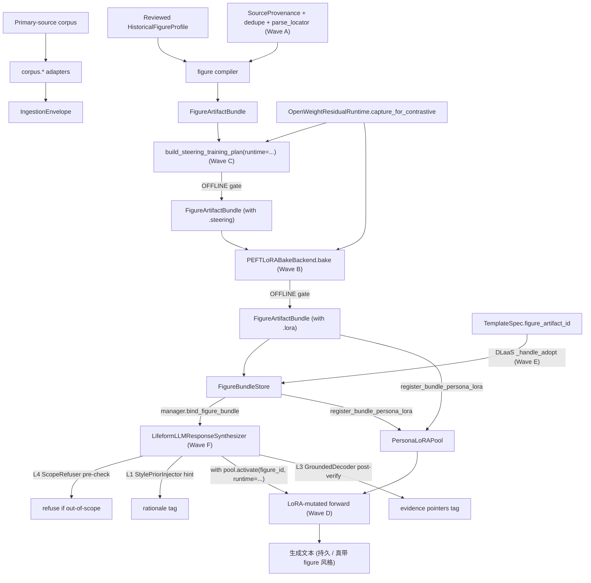

# Real-Person Figure Vertical Spec

> Status: draft
> Last updated: 2026-05-10
> 对应需求: R2, R5, R6, R8, R9, R10, R11, R12, R14, R15

## 要解决的问题

把一个真实人物（已逝历史人物或在世授权人物）的全部一手资料 — 论文、书信、演讲、手稿 — 编译成一个**忠诚度可控的数字生命**：在它写过的领域上引证可追溯，在它没写过的领域上明确拒答，在它写过的内容上语气/立场尽量贴近。

不能把人物全集塞进 prompt，也不能从基底 LLM 让它"自由发挥地像 Einstein 说话"——前者是检索糊脸，后者是让 Qwen 的物理学先验冒充 Einstein。

## 与 character vertical 的关系

`lifeform-domain-figure` 与 [`lifeform-domain-character`](../../packages/lifeform-domain-character/) 是**并列 vertical**，不是父子或扩展关系。两个 vertical 的不变量差距足以撑起独立 wheel：

| | `lifeform-domain-character` | `lifeform-domain-figure` |
|---|---|---|
| 来源 | 单一作者虚构叙事 | 多源头一手资料（论文 / 信件 / 演讲 / 笔记） |
| 真值性质 | 文本即真理 | 文本是**证据**，不是真理 |
| 覆盖面 | 角色只活在书里那些场景 | 物理 / 政治 / 哲学 / 宗教，**有大量空白** |
| 引证义务 | "小说里写..." | "Einstein 在 1924 年给 X 的信中说..." — 法律和事实双重义务 |
| 对照集 | 书里其它角色 | **有名有姓的对手**（Bohr / Heisenberg / Born），已成文 |
| 时间分层 | 通常一致 | **早期 vs 晚期**立场可能不同，需要时间版本化 |
| 多语言 | 通常单语 | 德 / 英 / 法 / 原始手稿混杂 |
| IP | 作者 / 版权方 | 公共领域（已故）vs 在世（差异巨大） |

## 关键不变量

- Figure vertical 是 lifeform 应用层 vertical，**不**新增 brain kernel owner。
- 输入必须是 reviewed `HistoricalFigureProfile` + 多个 `FigureCorpusSource` envelope；不通过关键词匹配从语料文本直接驱动行为（`no-keyword-matching-hacks.mdc`）。
- 编译产物 `FigureArtifactBundle` 是**不可变快照**（frozen dataclass），跨 wheel 只读消费（R8 SSOT）。
- 一手语料只通过 `lifeform-ingestion` 走 canonical `LifeformSession.run_turn(..., trigger_kind=INGESTION)`；durable 化由 R6 session-post slow loop 负责。
- 任何对基底权重的位移（steering / persona LoRA）走 rare-heavy `ModificationGate.OFFLINE` 通道，必须 `validation_delta ≥ 0.05` + `is_reversible=True` + 非空 `rollback_evidence`（R10）。
- 回滚通过 `figure_artifact_id` 切换实现，不直接改基底权重（R15）。
- 默认 wiring 都从 `WiringLevel.SHADOW` 开始，evaluation 证据先行才晋升。

## 保真阶梯（L1 / L2 / L3 / L4）

这是这个 vertical 的核心契约面，所有产物围绕它组织：

| 层级 | 含义 | 数据制品 | 运行时执行者 |
|---|---|---|---|
| **L1 语气保真** | "听起来像他" — 词汇 / 句法 / 常用类比 | `FigureStylePrior` (P2.3) + `FigureLoRAArtifact` (F6) | `StylePriorInjector` (P3.3) + `PersonaLoRAPool` (P6.3) ✅ Wave F live in `LifeformLLMResponseSynthesizer.synthesize` |
| **L2 立场保真** | "在他写过的议题上观点对得上" | `FigureSteeringSet` (F5, real residual) + `FigureLoRAArtifact` | `SubstrateDeltaAdapterLayer` + `PersonaLoRAPool` ✅ Wave D real hot-swap via `LoRAAwareResidualRuntime.activate_lora` |
| **L3 引证保真** | "每段实质性断言都能回溯到他的原文" | `FigureRetrievalIndex` (P2.1) + `EvidencePointer` (Wave A) | `GroundedDecoder` (P3.1) ✅ Wave F invoked post-generation |
| **L4 不知拒答** | "他没写过的领域系统拒答 / 软免责" | `FigureCoverageMap` (P2.2) | `ScopeRefuser` (P3.2) ✅ Wave F invoked pre-generation |

**早停点**：L1 + L3 + L4 = **零 GPU 训练**就能上线的 minimum-viable Figure。L2 / 加强版 L1 是 F5 / F6 的边际收益层，需要 ModificationGate evidence 才进。

**全链真接通（2026-05-12 Wave A-G land）**：

* **Wave A** — D2 三件 helper（`compute_dedup_report` / `fingerprint_provenance` / `parse_locator`）真接进 `build_figure_artifact_bundle` 主管线 + `GroundedDecoder.verify_with_pointers` 暴露结构化 `EvidencePointer`（debt #24 closure）
* **Wave B** — `PEFTLoRABakeBackend.bake` 真训练循环：`peft.LoraConfig` + HF 短 epoch + adapter export → `tuple[SubstrateDeltaAdapterLayer, ...]`；CLI `--backend peft`（debt #18 closure）
* **Wave C** — `OpenWeightResidualRuntime.capture_for_contrastive(...)` 真 hidden-state 抽方向；`build_steering_training_plan(contrast_set, substrate_runtime=runtime, layer_index=...)` 退役 hashing-embedding 主路径，hashing 仅作 fallback（debt #21 closure）
* **Wave D** — `LoRAAwareResidualRuntime` Protocol；`TransformersOpenWeightResidualRuntime.activate_lora` 真 forward-hook 加 delta；`PersonaLoRAPool.activate(figure_id, runtime=runtime)` context-manager 真改 forward + 出 context 字节级回滚（debt #20 closure）
* **Wave E** — `_handle_adopt` 主路径自动 `lookup_figure_bundle(bundle_id=template.figure_artifact_id)` + `register_bundle_persona_lora(bundle)` + `manager.bind_figure_bundle(bundle)`；`Lifeform.bind_figure_bundle(bundle)` 透传到每个 session 的 synthesizer（debt #22 closure）
* **Wave F** — `LifeformLLMResponseSynthesizer.synthesize` 真嵌入 ScopeRefuser pre-check（STRICT_REFUSE 短路）+ StylePriorInjector hint tag + `pool.activate(figure_id, runtime=runtime)` context wrapper + GroundedDecoder post-verify tag
* **Wave G** — `test_full_chain_e2e_real_wiring.py` 一次性把 corpus → real residual steering → real PEFT LoRA → OFFLINE gate → pool register → activate over Transformers runtime → logit shift → byte-identical deactivate → enforcer wired 全部跑通

**仍开放的 debt**：`#19`/`#27`/`#28` curated 真材料数据集（用户排除"真材料"范围）。

## 接口契约

新 wheel：

```text
packages/lifeform-domain-figure/
```

> **Corpus 字节流全链（debt #28 L0 + L1 + L2 first batch + debt #19，2026-05-10 全部落地）**：从一个 archive URL 开始，到 bundle gate 通过，完整 6 步：
>
> 1. **L0 crawl** — [`docs/specs/figure-corpus-crawl.md`](./figure-corpus-crawl.md)：`scripts/figure_crawl.py enqueue` + `run` → 5 SSRF gate + robots.txt + token-bucket rate limit + 5 archive-aware fetcher（generic / cpae / wikisource / gutenberg / internet_archive）→ `CrawlSink.consume_success` 把字节写入 L1 `CleaningStore.put_raw`，建立 `raw_sha256` anchor
> 2. **L1 cleaning** — [`docs/specs/figure-corpus-cleaning.md`](./figure-corpus-cleaning.md)：`scripts/figure_clean.py clean` 用 `parse_by_content_type` + `clean_raw_document` 产 `RawDocument` / `CleanedDocument`；cleaner 不发 HTTP / 不直接产 typed source
> 3. **L1 → L2 桥接** — `cleaning/bridging.py.cleaned_to_source_provenance(...)`：把 `raw.license_notice` 流到 `SourceProvenance.license_label`，把 `raw.raw_sha256` 流到 `byte_sha256`
> 4. **L1 → typed payload 桥接** — `cleaning/bridging.py.cleaned_to_*_payload(...)` + 既有 `*_to_*_source(...)` → 下表 P1.2 的 `FigureCorpusSource`
> 5. **L2 verification** — [`docs/specs/figure-corpus-verification.md`](./figure-corpus-verification.md)：`scripts/figure_verify.py run-batch` 跑已实现的 3 个 verifier（DATE_PLAUSIBILITY / LICENSE_PAGE_LEVEL / CROSS_SOURCE_BYTE）落 `VerificationLedger`；verifier 不发 HTTP / 不写 kernel owner / 不直接产 typed source
> 6. **Bundle gate** — `build_figure_artifact_bundle(FigureBundleInputs(..., require_verification_pass=True, provenance_records=..., verification_ledger=...))`：拒收任一非全 PASS 的 source
>
> 关键不变量（contract test AST 静态守门）：L0 是 figure-vertical **唯一**允许 HTTP 出口；L1 / L2 仍禁 HTTP；L0 / L2 禁直产 typed source；L0 / L2 禁写 kernel owner；L0 禁 import L2。
>
> `corpus.archives.live_archive_fetcher(fetch_kind, ...)` 工厂（debt #19 closure）封装 L0 crawler stack 为 V2 `ArchiveFetcher` Protocol，单 URL 模式（无 robots / 无 rate limit）；`offline_archive_fetcher()` 行为不变。

公开 API（按 packet 渐进添加）：

| Packet | 公开符号 |
|---|---|
| P1.1 | `HistoricalFigureProfile`, `TimeWindowedView`, `build_einstein_profile` |
| P1.2 | `build_figure_ingestion_envelope`, `FigureCorpusSource`, ingest_papers / ingest_letters / ingest_lectures / ingest_notebooks |
| P2.1 | `FigureRetrievalIndex`, `RetrievalEvidence`, `build_figure_retrieval_index` |
| P2.2 | `FigureCoverageMap`, `CoverageDecision`, `build_figure_coverage_map` |
| P2.3 | `FigureStylePrior`, `FigureArtifactBundle`, `build_figure_artifact_bundle`, `build_figure_lifeform` |
| P5.1 | `FigureContrastPair`, `prepare_steering_data` |
| P5.2 | `FigureSteeringSet`, `bake_figure_steering`, `apply_steering_through_gate` |
| P6.1 | `LoRATrainingPlan`, `prepare_lora_training_data`, `PersonaLoRAProposal` |
| P6.2 | `FigureLoRAArtifact`, `SyntheticLoRABakeBackend`, `PEFTLoRABakeBackend` (interface stub) |
| P6.3 | `apply_persona_lora_through_gate` |

`vz-substrate` 上的最小附加面（additive，与 [`docs/moving forward/dlaas-platform-rollout.md`](../moving%20forward/dlaas-platform-rollout.md) 切片 5.4 的 substrate streaming additive 例外口径一致）：

| Packet | 模块 |
|---|---|
| P3.1 | `volvence_zero.substrate.grounded_decode_hook` — `GroundedDecodeHook` Protocol |
| P6.3 | `volvence_zero.substrate.persona_lora_pool` — `PersonaLoRAPool` |

`lifeform-expression` 上的最小附加面：

| Packet | 模块 |
|---|---|
| P3.1 | `lifeform_expression.grounded_decoder` — `GroundedDecoder` |
| P3.2 | `lifeform_expression.scope_refuser` — `ScopeRefuser` |
| P3.3 | `lifeform_expression.style_prior_injector` — `StylePriorInjector` + `LifeformLLMResponseSynthesizer.figure_bundle` 注入点 |

`dlaas-platform-*` 上的最小附加面：

| Packet | 文件 / 字段 |
|---|---|
| P4.1 | `TemplateSpec.figure_artifact_id`, `.citation_policy`, `.coverage_policy`, `.figure_time_window` |
| P4.2 | `lifeform-service` adopt 路径加载 `FigureArtifactBundle` 并注入 synthesizer |

## 数据流



## 与其他能力域的关系

| 关系 | 能力域 | 说明 |
|---|---|---|
| 依赖 | Domain Experience Layer | 知识 / 案例 / 策略 / 边界编译进既有 application owner |
| 依赖 | Runtime Ingestion | 一手语料通过 canonical ingestion path 进入 |
| 依赖 | Lifeform Vitals | 时间版本化的 drive 通过 `VitalsBootstrap` 表达 |
| 协作 | Cognitive Regime | 风格 / 立场通过 case / playbook / delayed credit 影响 regime，不进入 prompt 关键词 |
| 协作 | Semantic State Owners | 关系 / 价值 / 边界由九个 semantic owners 持有 |
| 协作 | Substrate (R2) | 仅通过 `SubstrateDeltaAdapterLayer` 的 LoRA / steering 受限位移；**不**端到端微调基底 |
| 协作 | ModificationGate (R10) | rare-heavy artifact (steering / LoRA) 强制走 OFFLINE 闸 |
| 协作 | DLaaS Templates (Phase 3) | `TemplateSpec` 携 `figure_artifact_id`；adopt 时加载 bundle |

## 复制 character vertical 的 rare-heavy 范式

steering 和 persona LoRA 的 ModificationGate 集成 mirror [`packages/lifeform-domain-character/src/lifeform_domain_character/rare_heavy_apply.py`](../../packages/lifeform-domain-character/src/lifeform_domain_character/rare_heavy_apply.py) 的 `apply_drive_evolution_through_gate`：

* `validation_delta ≥ 0.05`（OFFLINE 边际）
* `capacity_cost ≤ 0.75`
* `rollback_evidence` 必填
* `is_reversible=True`
* 反向 delta 应用后能恢复基底（rollback drill 测试覆盖）

## 后端形态（hybrid）

* **F5 steering** — 真后端。CPU 可跑（量小、线性 readout / contrastive head）。
* **F6 LoRA** — 双后端：`SyntheticLoRABakeBackend`（确定性合成 LoRA delta，CPU-only，SHADOW / 测试默认）+ `PEFTLoRABakeBackend`（真 PEFT 训练循环，opt-in via `vz-runtime[torch]`）。两者输出 `FigureLoRAArtifact.adapter_layers` 形状统一，`PersonaLoRAPool.register(...)` 接受任一 backend 的产物。Mirror [`packages/vz-substrate/src/volvence_zero/substrate/residual_backend.py`](../../packages/vz-substrate/src/volvence_zero/substrate/residual_backend.py) 现有的 `SyntheticOpenWeightResidualRuntime` / `TransformersOpenWeightResidualRuntime` 双后端格局。

## 变更日志

- 2026-05-10: 初始版本。落地 vertical scaffold + L1/L2/L3/L4 阶梯定义 + F1-F6 packet 序列描述。
- 2026-05-12: Wave A-G land — 全链真接通。debt #18 / #20 / #21 / #22 / #24 闭合；synthetic + PEFT 双 LoRA backend；real residual stream contrastive steering；`LoRAAwareResidualRuntime` Protocol + 真 forward-hook hot-swap；DLaaS adopt 主路径自动 hook；synthesizer 嵌入 L1 / L3 / L4 enforcement。剩余开放：debt #19 / #27 / #28 真材料（curated corpus 数据集）。
