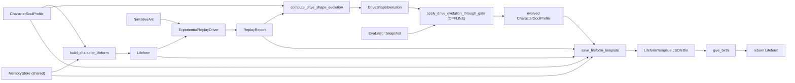

# Lifeform Template Spec

> Status: draft
> Last updated: 2026-05-09
> 对应需求: R5（连续记忆）, R8（契约优先）, R10（有界自修改）, R11（内部状态可发布）, R14（regime 持久身份）, R15（迁移可解释性和可回滚）

## 要解决的问题

如何把一个"活过的"角色 lifeform 完整序列化到磁盘 + 从磁盘恢复成一个新的运行实例，使得"小说人物 → 生命模板 → give_birth"成为可重复的工程操作？

## 关键不变量

- `LifeformTemplate` 是 **schema + 序列化产物**，不是 runtime owner。它没有 `process()`，不发布 snapshot，不拥有任何运行时状态。
- 模板内每个组件都来自既有 owner-side export / restore API（`MemoryStore.create_checkpoint`、`Lifeform(memory_store=...)`、`ApplicationDomainKnowledgeStore.create_checkpoint` 等），**禁止**绕过 owner 直接读写私有状态。
- 每个 `LifeformTemplate` 携带 `schema_version: int`（当前 `1`）；`give_birth` 在版本不匹配时抛 `IncompatibleTemplateVersion`，禁止跨版本静默加载。
- `integrity_hash` 是 SHA-256，覆盖**身份载荷**：manifest（除 hash 字段）+ profile + evolved_profile + vitals_bootstrap + vitals_drive_levels + application_state。`memory_checkpoint` 与 `replay_report` 因含动态 id（`checkpoint_id`、float drive levels）不在身份 hash 内，但它们各有自己的 schema 校验。
- `give_birth` 默认 `verify_integrity=True`；只有调试 tampered 模板时才允许显式关闭。
- 重生时 vitals `initial_level` **必须**用模板保存的 `vitals_drive_levels`，让新实例从"上辈子的体感"启动而不是从 spec 默认值。
- LLM-assisted 提取（profile / scene）只产 *candidate*；转换为 typed artifact 必须经 `review_*_candidate` 显式人审入口（reviewer + locator 双必填）。
- Tier 4 drive 演化通过 `ModificationGate.OFFLINE`（rare-heavy）准入：`validation_delta ≥ 0.05` + `capacity_cost ≤ 0.75` + 非空 `rollback_evidence` + `is_reversible=True`。
- 测试数据全部为合成原创（无版权小说原文）；`tests/contracts/test_no_copyrighted_text.py` 在未来 wave 可加静态扫描。

## 数据流

## 接口契约

**消费的输入**：

- 一个 `CharacterSoulProfile`（基础身份）
- 可选 `evolved_profile`（Tier 4 演化后的版本）
- `MemoryStore` 引用（shared，跨 session 持续）
- `VitalsBootstrap` + `vitals_drive_levels`（保存的运行时 drive levels）
- `ApplicationOwnerState`（4 个 application owner 的 checkpoint）
- 可选 `ReplayReport`（活过哪段小说的审计 trail）

**产出的输出**：

- 单个 JSON 文件（`<output_dir>/<template_id>.json`）含全部 schema-versioned 字段 + `integrity_hash`
- `LifeformTemplate` typed dataclass（in-memory 形式可直接进 `give_birth`）
- 重生路径返回 `RebirthBundle`：`Lifeform` + 用到的 stores + 原始模板（审计回溯）

**owner 边界**：

- `MemoryStore` 通过 `create_checkpoint` / `restore_checkpoint` 自己负责持久化
- `ApplicationDomainKnowledgeStore` / `ApplicationCaseMemoryStore` 同样自管
- `VitalsBootstrap` 是 reviewed 配置，存模板时整体序列化；reviewable
- `temporal_bootstrap` / `regime_bootstrap` v1 schema 暂未纳入（基础 build_character_lifeform 不注入这两个）；后续 schema_version 升级时可通过 additive 字段加入

## 与其他能力域的关系

| 关系 | 能力域 | 说明 |
|---|---|---|
| 依赖 | 连续记忆系统（R5/R6） | `MemoryStore.create_checkpoint` / `restore_checkpoint` 是模板的核心 import/export 路径 |
| 依赖 | 契约式运行时（R8） | 模板不是 owner，所有 import/export 走既有 owner 公共 API |
| 依赖 | Domain Experience Layer | profile 通过 `build_character_package` 编译成 `DomainExperiencePackage`，套到既有 4 个 application owner |
| 依赖 | Lifeform Vitals | 重生时 vitals 用保存的 current level 启动，保证"前世记忆"在 drive 层延续 |
| 依赖 | 信用分配与自修改（R10） | Tier 4 drive 演化通过 `ModificationGate.OFFLINE` 准入；rollback drill 强制检查双向可逆 |
| 依赖 | Character Soul Bootstrap | 本 spec 是 character vertical 的下游序列化层，重用 reviewer-paraphrased 原则 |

## 变更日志

- 2026-05-09: 初始版本。Lifeform Template + Birth Pipeline 完整落地（waves T1-T11）；schema_version=1。
