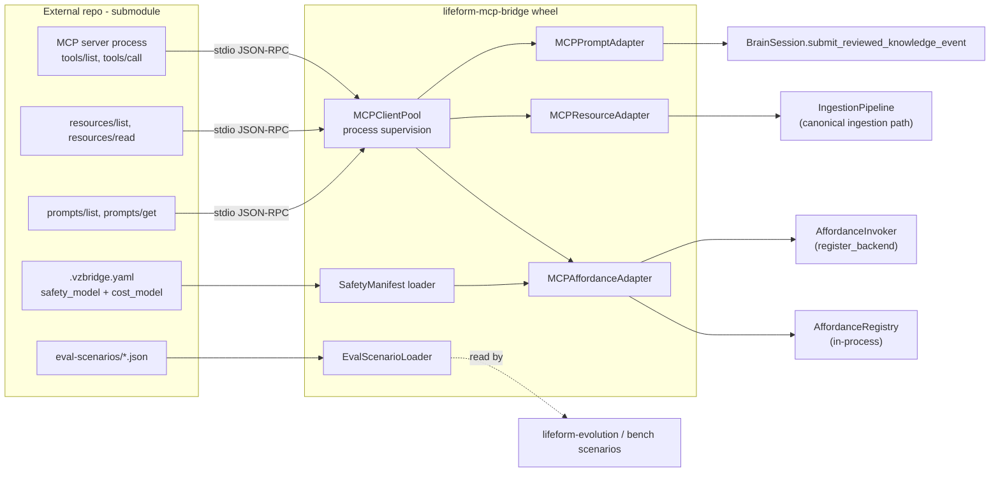

# MCP Bundle Bridge Spec

> Status: draft
> Last updated: 2026-05-12
> 对应需求: R3 (时间抽象), R4 (内部控制), R5 (连续记忆), R8 (快照优先 / 单一所有者), R10 (有界 / 门控自修改), R11 (内部状态可发布), R15 (迁移可解释 / 可回滚)
> 来源: mcp-tools-bundle-bridge packet (2026-05-12)

## 要解决的问题

VolvenceZero 主项目应该专注于"能学会用工具的脑"，而不是"实现一千个工具"。但要让 lifeform 真的有用，必须能挂上丰富的工具集 + 知识库 + 评测场景，且这些内容物可以由独立 repo / 独立团队迭代而**不**污染 kernel。

业界标准是 [Model Context Protocol (MCP)](https://modelcontextprotocol.io/)，Anthropic 推动、Claude Desktop / Cursor / 其他 LLM 客户端共用的工具集成协议。本 spec 把 MCP 引入为 lifeform-side 的二级 affordance / ingestion / scenario 来源，**不**改 kernel owner，**不**绕开既有 safety 门。

## 关键不变量

1. **R8 — kernel owner 不变**：MCP server 是外部数据源，**不**是 owner。`AffordanceDescriptor` 仍由 `lifeform-mcp-bridge` 在主进程内构造；`DomainKnowledgeRecord` / `CaseMemoryRecord` 仍由 `vz-application` owner 经 ingestion path 写入。MCP server 的 stdout/HTTP 不能直写任何 owner store。
2. **R10 — safety 永远是主项目的事**：MCP 协议本身**没有** `safety_model` / `cost_model` / `requires_user_confirmation`。外部 repo 必须出 reviewed `.vzbridge.yaml` 声明每个 tool 的 safety + cost + when_to_use(≥50) + when_not_to_use(≥50)。bridge 加载时缺 manifest 必须 fail-loud；不允许 hash 默认到 unsafe。
3. **不吞错**：MCP server 启动 / 调用失败必须抛 typed `MCPBridgeError` 子类（`MCPMissingSafetyManifestError` / `MCPCallTimeoutError` / `MCPProtocolError` / `MCPConnectionLostError` / `MCPServerSpawnError` / `MCPSafetyManifestSchemaError`）。禁止 bare `except: pass`。
4. **R3/R4 — 学习边界保留**：bridge 不改 affordance 选择的学习面。MCP-supplied tools 进入同一个 `AffordanceRegistry`，由现有 `AffordanceModule` 用 z_t 投影做评分；descriptor name 经 hash 投影，没有"MCP tools 优先"或"in-process 优先"的硬路由。
5. **崩溃隔离**：MCP server 进程崩溃必须**不**让主进程崩溃；崩溃 → 该 server 提供的 affordances 在下一个 `AffordanceSnapshot` 中带 `blocked_reason="mcp_unavailable:<server_name>"`。
6. **wheel 边界**：`lifeform-mcp-bridge` 依赖 `lifeform-affordance` + `lifeform-ingestion` + `vz-contracts` + `mcp` (官方 SDK) + `pyyaml`；**不**反向 import `volvence_zero.{cognition,memory,temporal,substrate,application,runtime}.*`。
7. **R15 — 可回滚**：`BrainConfig.mcp_bridge_wiring: WiringLevel = ACTIVE` 默认（与 owner_hydration 同纪律：production 默认开启）；空 `mcp_server_specs` 是 no-op；`DISABLED` 完全禁用 bridge 构造。

## Architecture



## MCP Protocol Mapping

### Tool translation: `tools/list` → `AffordanceDescriptor`

| MCP tool field | AffordanceDescriptor field | Source |
|---|---|---|
| `name` | `name` (prefixed: `<server_name>.<tool_name>`) | MCP server |
| `description` | `description` | MCP server |
| `inputSchema` | `parameters_schema` (JSON Schema) | MCP server |
| `outputSchema` (if present) | `output_schema` | MCP server (defaults to `{"type": "object"}`) |
| —— | `kind = AffordanceKind.TOOL` | bridge convention |
| —— | `version = "<server_version>+mcp"` | MCP server (or `"0.0.0+mcp"` fallback) |
| —— | `display_name = tool_name.title()` | bridge fallback (manifest can override) |
| —— | `when_to_use` (≥50) | **safety manifest required** |
| —— | `when_not_to_use` (≥50) | **safety manifest required** |
| —— | `cost_model` (`AffordanceCost`) | **safety manifest required** |
| —— | `safety_model` (`AffordanceSafety`) | **safety manifest required** |
| —— | `affordance_tags` | safety manifest (default `("mcp",)`) |
| —— | `source_path = "mcp://<server_name>"` | bridge convention |

**Name collision rule**: bridge prefixes with `<server_name>.` so `tools-bundle-v1.read_file` and `coding-vertical.read_file` co-exist.

### Resource translation: `resources/list` → `IngestionEnvelope`

| MCP resource field | IngestionChunk / Envelope field |
|---|---|
| `uri` | `IngestionChunk.locator` + `IngestionProvenance.source_uri` |
| `name` | `IngestionChunk.chunk_id` (sanitised, prefixed with server name) |
| `description` (`+` resource content via `resources/read`) | `IngestionChunk.text` |
| `mimeType` | dropped (text-only ingestion); binary resources fail-loud |
| —— | `IngestionEnvelope.envelope_id = "mcp:<server_name>:<run_uuid>"` |
| —— | `IngestionEnvelope.source_kind = IngestionSourceKind.CORPUS` |
| —— | `IngestionEnvelope.compliance_profile = IngestionComplianceProfile.FORCED` (operator-supplied) |
| —— | `IngestionProvenance.uploader = f"mcp:{server_name}"` |
| —— | `IngestionProvenance.integrity_hash = sha256(resource bytes)` |

**Failure mode**: a resource that returns binary content (`mimeType` not text) is captured as `IngestionChunk(parse_error="non_text_mime:<mime>")` and listed in `partial_failures`. Silent drop is forbidden.

### Prompt translation: `prompts/list` → `submit_reviewed_knowledge_event`

| MCP prompt field | reviewed_knowledge_event field |
|---|---|
| `name` | `knowledge_id = f"mcp_prompt:{server_name}:{prompt_name}"` |
| `description` | `summary` |
| `prompts/get` (full template after substitution) | `detail` |
| —— | `source_label = f"mcp:{server_name}:prompts"` |
| —— | `confidence = 0.7` (bridge default; overridable via manifest) |
| —— | `relevance_hint = ""` |
| —— | `needs_followup = False` |

Prompt support is **optional** (default off via `BrainConfig.mcp_prompt_wiring`); enabling it ingests the templates as low-confidence reviewed knowledge so the lifeform can later retrieve them as guidance.

### Eval scenarios: `eval-scenarios/*.json` (no MCP RPC)

External repo carries `eval-scenarios/*.json` files at a conventional path. `EvalScenarioLoader.load_from_repo(repo_root)` discovers and validates them against the existing `lifeform-evolution` scenario schema. **Not** an MCP RPC because scenarios are static artifacts, not runtime tool calls.

## Safety Manifest Schema

`<external_repo>/.vzbridge.yaml`:

```yaml
schema_version: 1
server:
  name: "tools-bundle-v1"        # must match MCPServerSpec.name
  description: "Reference VolvenceZero tool bundle (read_file, web_search, python_eval)."
tools:
  - name: "read_file"
    when_to_use: |
      Use when the lifeform needs the literal text content of a file
      (typically code or markdown) before reasoning about it.
    when_not_to_use: |
      Don't use to enumerate large directories — that should be a
      separate list_dir affordance. Don't use on binary files.
    cost_model:
      latency_class: fast
      monetary_class: free
      rate_limit_per_minute: 60
    safety_model:
      requires_user_confirmation: false
      irreversible: false
      requires_consent_grant: ["read_filesystem"]
      blocked_in_regimes: []
      audit_required: false
    affordance_tags: ["read", "filesystem", "code"]

  - name: "python_eval"
    when_to_use: |
      Use when the lifeform needs to compute something a regular
      reply cannot — small arithmetic, dataframe inspection, etc.
    when_not_to_use: |
      Don't use for file/network IO; this is a sandboxed compute
      backend only. Don't use to fix bugs in the user's code.
    cost_model:
      latency_class: slow
      monetary_class: free
      rate_limit_per_minute: 10
    safety_model:
      requires_user_confirmation: true
      irreversible: false
      requires_consent_grant: ["execute_code"]
      blocked_in_regimes: ["emotional_support"]
      audit_required: true
    affordance_tags: ["execute", "compute"]

resources:
  default_compliance_profile: "forced"   # or "consultative"

prompts:
  enabled: false                          # default
```

Validation rules (enforced by `SafetyManifest.load`):

- `schema_version` must equal `1`
- `server.name` must match the `MCPServerSpec.name` configured in `BrainConfig.mcp_server_specs`
- Every `tools/list` returned tool name **MUST** appear in `tools[*].name`; missing → `MCPMissingSafetyManifestError`
- `when_to_use` / `when_not_to_use` ≥50 chars (matches `AffordanceDescriptor.MIN_SELECTION_HINT_CHARS`)
- `cost_model.latency_class` ∈ {`instant`, `fast`, `slow`, `very_slow`}
- `cost_model.monetary_class` ∈ {`free`, `low`, `medium`, `high`}
- All YAML errors raise `MCPSafetyManifestSchemaError` with the offending key path

## BrainConfig Extension

```python
@dataclass(frozen=True)
class MCPServerSpec:
    name: str                              # stable, used in descriptor name + manifest key
    transport: Literal["stdio", "http"]
    command: tuple[str, ...] = ()          # for stdio (e.g. ("python", "-m", "vz_bundle.server"))
    url: str = ""                          # for http (e.g. "http://localhost:8080/mcp")
    env: Mapping[str, str] = field(default_factory=dict)
    safety_manifest_path: str = ""         # required, absolute or repo-relative
    autostart: bool = True
    restart_policy: Literal["never", "on_crash", "always"] = "on_crash"
    call_timeout_seconds: float = 30.0
    enable_resources: bool = True
    enable_prompts: bool = False           # default off

# In BrainConfig:
mcp_server_specs: tuple[MCPServerSpec, ...] = ()
mcp_bridge_wiring: WiringLevel = WiringLevel.ACTIVE
```

`Lifeform.create_session(...)` flow when `mcp_bridge_wiring is ACTIVE` and `mcp_server_specs` non-empty:

1. Get-or-create the per-`Lifeform` `MCPClientPool` (sessions share servers)
2. For each spec: `pool.ensure_started(spec)` (autostart=True)
3. `MCPAffordanceAdapter.populate(registry, invoker, pool, specs)` — register all tool descriptors + backends
4. `MCPResourceAdapter.populate(brain_session, pool, specs)` — single ingestion turn(s) with `trigger_kind=INGESTION`
5. (Optional) `MCPPromptAdapter.populate(brain_session, pool, specs)` — submit reviewed knowledge

## Lifecycle and Failure Modes

| Failure | Behavior |
|---|---|
| `MCPServerSpawnError` (subprocess won't start) | Log + raise; `Lifeform.create_session` fails fast (not silently down-graded). Operators must remove the spec from BrainConfig to recover. |
| `MCPSafetyManifestSchemaError` | Same: fail at session creation. Manifest must be fixed in external repo. |
| `MCPMissingSafetyManifestError` (server lists a tool not in manifest) | Same: fail at session creation. |
| `MCPCallTimeoutError` (single tool call exceeds `call_timeout_seconds`) | `AffordanceInvocationStatus.BACKEND_FAILED` with `error_class="mcp_timeout"`. Tool stays registered. |
| `MCPProtocolError` (JSON-RPC error from server) | Same: BACKEND_FAILED, `error_class="mcp_protocol_error"`. |
| `MCPConnectionLostError` (server died mid-session) | Pool restarts per `restart_policy`. While down: `AffordanceCandidate.blocked_reason="mcp_unavailable:<server_name>"`. Main process continues. |

## Acceptance Gates

1. `mcp-tool-becomes-affordance` — Given a running MCP server with `tools/list = [{name: "read_file", inputSchema: {...}}]` and a complete `.vzbridge.yaml`, the bridge produces a valid `AffordanceDescriptor` registered under name `<server>.read_file` with safety/cost from manifest.
2. `safety-manifest-required` — Server lists tool with no manifest entry → `MCPMissingSafetyManifestError` raised at populate. Server lists tool whose manifest entry has `when_to_use < 50 chars` → `MCPSafetyManifestSchemaError`.
3. `mcp-server-crash-isolated` — Killing the MCP server subprocess does NOT crash the main lifeform process. Next `AffordanceSnapshot` lists the affected affordances with `blocked_reason="mcp_unavailable:<name>"`.
4. `mcp-resource-routes-through-ingestion` — Server `resources/list` returns 1 markdown resource → after `populate`, the canonical `IngestionPipeline` emitted at least one `EnvironmentEventKind.INGESTION` event; `vz-application` `domain_knowledge` slot now contains a record traceable to that resource.
5. `mcp-tool-respects-safety-gate` — When manifest declares `requires_user_confirmation=true` for a tool, calling the affordance via `AffordanceInvoker.invoke(...)` without `user_confirmed=True` returns `AffordanceInvocationStatus.DENIED_BY_BOUNDARY`.
6. `external-repo-import-boundary-clean` — `lifeform-mcp-bridge` source files have no `import volvence_zero.cognition` / `import volvence_zero.memory` / etc.; `tests/contracts/test_mcp_bridge_import_boundary.py` enforces.

## Rollback

| 触发 | 操作 |
|---|---|
| 系统级 MCP 故障 | `BrainConfig.mcp_bridge_wiring = WiringLevel.DISABLED` |
| 单 server 故障 | 从 `BrainConfig.mcp_server_specs` 移除该 spec |
| 单 tool 故障 | 在 `.vzbridge.yaml` 标记 `excluded: true`（bridge 跳过该 tool 不注册） |
| 安全升级 | 在 `.vzbridge.yaml` 提升 `safety_model.requires_user_confirmation = true` |

## 与其他能力域的关系

| 关系 | 能力域 | 说明 |
|---|---|---|
| 复用 | Affordance 体系 (15) | 所有 MCP tool 都进 `AffordanceRegistry`；选择仍由 `AffordanceModule` z_t 投影 |
| 复用 | Environment Interface (6B) | MCP tool 调用走 `BrainSession.submit_tool_result` 同一 canonical 路径；invoker 默认 plan_ref 透传到 PE lineage |
| 复用 | Runtime Ingestion (16) | MCP resource 经 `IngestionPipeline.run` → `trigger_kind=INGESTION` → 标准 vitals apprentice override |
| 复用 | Domain Experience Layer (11) | MCP-derived knowledge 进 `domain_knowledge` 等既有 application owner，不新建 owner |
| 复用 | Owner Hydration (20) | MCP-derived state 跟所有 owner 一样跨 session 续接，无特殊路径 |
| 协作 | 评估体系 (8) | MCP eval scenarios 由 `lifeform-evolution` benchmark loader 加载，不走 MCP RPC |

## Non-goals

- **不**自己造工具协议；用 MCP 官方 SDK
- **不**实现 MCP server 内的具体 tool 逻辑（外部 repo 的事）
- **不**让 MCP server 直接写 `vz-cognition` / `vz-memory` 内部状态
- **不**让 safety_model 默认 hash 到 unsafe（必须 reviewed manifest）
- **不**让 MCP server crash 影响主进程稳定性

## 变更日志

- 2026-05-12: 初稿，定义 MCP server spec / safety manifest / 三类 adapter / WiringLevel 三态 / 6 个 acceptance gate；`BrainConfig.mcp_bridge_wiring` 默认 ACTIVE。
