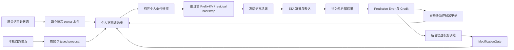

# 推理前个人状态条件化

## 1. 目标

Volvence 不要求用户把完整经历、关系和决策偏好重新写进 prompt。系统从已有
`user_model`、`relationship_state`、`goal_value`、`boundary_consent` 四个语义
owner 的不可变快照中，自动形成一份紧凑、可审计的个人状态条件，并在冻结基底
开始生成前通过有界控制入口影响残差流。

这不是改变 tokenizer 或重训整个 encoder，也不是把用户资料拼成一段隐藏
system prompt。精确事实、原话和证据继续走现有可审计上下文；神经侧条件只表达
稳定程度、关系连续性、情绪负荷、决策准备度、可逆性与边界风险等压缩 readout。

## 2. 唯一 Owner 与正式契约

| 项目 | 契约 |
|------|------|
| slot | `personal_conditioning` |
| owner | `PersonalConditioningModule`（`vz-cognition`） |
| value | frozen `PersonalConditioningSnapshot`（`vz-contracts`） |
| dependencies | `user_model`, `relationship_state`, `goal_value`, `boundary_consent` |
| default wiring | `SHADOW` |
| consumer | session response generation → open-weight substrate |

`PersonalConditioningSnapshot` 固定发布：

- 16 维 `[0, 1]` 有界状态向量与冻结坐标名；
- 四个来源快照的版本号与内容指纹；
- 覆盖度派生的置信度；
- 显式 cold-start 标志与可读审计描述；
- `rendered_statement`：owner 用确定性模板把**同一份** typed readout 渲染成的
  英文自然语言状态说明（State KV 臂 B′ 与蒸馏教师上下文共用）。渲染只消费
  16 个带标签坐标与 confidence（数值 → 定性分档 → 英文子句），**禁止**读取
  `SemanticRecord` 文本、原始对话或个人资料，因此其信息量与隐私姿态与潜向量
  完全一致。cold-start 或零置信度时必须为空串（契约不变量强制）。

owner 只能读取上游公开 typed readout，禁止读取原始对话、遍历 owner 内部存储、
解析 prompt 或用关键词重新判断用户语义。缺少个人证据时必须发布全零 cold-start
快照，不能凭默认人格猜测用户。

### 2.1 Conditioning bank 家族与 Relationship bank（State KV P4-a）

Personal 是六个 State KV bank 中的第一个。从第二个 bank 起，owner 侧统一发布
**无 scope 的通用 `ConditioningBankReadout`**（`conditioning-bank-readout.v1`，
`vz-contracts`），不再每 bank 铸造专用契约；`PersonalConditioningSnapshot` v1
属历史冻结形态，仅由其专用 adapter 投影，不作新 bank 模板。契约拆分的原因：
scoped `ConditioningBankSnapshot` 强制非空 tenant/user scope，而 cognition owner
不应知道会话身份——于是 owner 发布它能知道的一半（typed 坐标、来源指纹、
confidence、`rendered_statement`、provenance），runtime 在消费点经通用
`bank_readout_to_bank(readout, slot_name, scope, freshness, revocation, ...)`
补上只有 runtime 知道的一半。adapter 以 `expected_bank_type(slot_name)` 守门
（readout 接错 slot 立刻 fail loudly），并从 `source_versions` 的
`boundary_consent` 条目提升 `consent_version`；REVOKED / cold-start 投影时
readout、confidence、`rendered_statement` 一律归零。

第二个 bank——Relationship bank：

| 项目 | 契约 |
|------|------|
| slot | `relationship_conditioning` |
| owner | `RelationshipConditioningModule`（`vz-cognition`） |
| value | frozen `ConditioningBankReadout`，`bank_type=RELATIONSHIP` |
| dependencies | `relationship_state`, `boundary_consent` |
| default wiring | `SHADOW`（`FinalRolloutConfig.relationship_conditioning`） |
| consumer | session 装配链（text）+ substrate（versioned residual / Relationship Prefix-KV） |

Relationship compiler `relationship-conditioning.v2` 发布 14 维 dyad 读出：
`rel_trust` / `rel_cumulative_trust` / `rel_continuity` /
`rel_repair_pressure` / `rel_emotional_load` / `rel_stabilization_need` /
`rel_trust_recovery` / `rel_tension_load`（未解张力数按 4 饱和归一）/
`rel_attunement_trend` / `rel_relationship_continuity` /
`rel_repair_progress`（已完成 repair / repair+tension evidence）/
`rel_relationship_depth`（age turns 按 20 饱和归一）/
`rel_consent_compliance` / `rel_consent_clarity`。与 Personal 的 5 个
relationship/boundary 坐标存在部分信息重叠是有意的：每个 bank 是对同一批
owner 快照的**自足**编译，Relationship bank 的差异贡献在长程半边
（cumulative trust、recovery、stabilization、tension load、attunement
trajectory、repair progress 与 relationship depth），这也是 P4-c 每-bank
独立增益消融要检验的维度。compiler version 连同上游快照进入
`source_fingerprint`，所以编译逻辑或坐标集合变化不会错误复用旧 cache /
lineage identity。两个模块都是 readout consumer，
`relationship_state` / `boundary_consent` 的语义 owner 不变，无第二 owner。
`rendered_statement` 与 Personal 同姿态：确定性模板、只消费带标签坐标 +
confidence、cold-start 空串。回滚 = 配置置 `DISABLED`（模块停发）。

**P4-b / Relationship latent consumer 语义（多 bank 组装与 lineage）**：

- 消费门：session 装配链只从 active_snapshots 读该 slot（SHADOW 不消费，
  逐字节保持单 bank 行为），且要求 non-cold、confidence > 0、未撤销。
- **独立载体门**：`FinalRolloutConfig.relationship_conditioning_mode` 与
  Personal carrier 分离。默认 `text` 保持既有 owner-rendered prompt 路径；
  显式 `residual` / `prefix_kv` 把同一 scoped `ConditioningBankSnapshot` 封装为
  `ConditioningBankLatentCarrier`（`conditioning-bank-latent-carrier.v1`），
  text statement 必须为空。cold-start / zero confidence / freshness=0 /
  REVOKED 在 carrier 构造前归零或拒绝，禁止只记 lineage 不产生因果路径。
- substrate-owned `relationship-conditioning-residual.v2` 是默认 generic bank
  projector：只接受 `RELATIONSHIP`，以 `0.5` 为 neutral 将 14 维 `[0,1]`
  readout 转为有符号坐标，固定正弦 basis 投影后 L2 归一，最终幅度为
  `0.12 × confidence × freshness`。显式加载
  `relationship-conditioning-projector.v1` 时，runtime 以 artifact 的
  model-derived basis、目标层和逐层 gain 替换固定 basis，并把
  `relationship-contrastive-residual-v1:<artifact_id>` 发布为 carrier /
  lineage version。artifact 的 model id、hidden width、hook layers 和 14 个
  readout labels 必须与 runtime / admitted bank 精确一致。全 neutral / 退化
  零向量不报告 applied；bank type、labels 或 projector version 不匹配必须
  fail loudly。Personal 与 Relationship delta 各自消费自己的 layer gains，
  禁止先合并后误用 Personal gain。
- `relationship-prefix-kv.v1` 是 substrate-owned 的 Relationship 专属 wrapper：
  它把通用 `PrefixKVArtifact` 绑定到 `RELATIONSHIP` bank、
  `relationship-conditioning.v2` owner schema 和精确 14 维 labels，并用独立
  artifact id / `relationship-prefix-kv-carrier.v1:<artifact_id>` 防止 Personal
  或 Character artifact 因几何相同而误装。加载时精确校验 model、attention
  geometry 与 `norm_cap <= 0.12`；推理时 carrier version、labels、scale 还要与
  已加载 artifact 再次相等。Relationship 状态按 `confidence × freshness` 向
  neutral 收缩后生成每层 K/V slots，拼接次序固定为 Character → Personal →
  Relationship。缺失或漂移均 fail loudly，禁止静默回落 residual。
- `GenerationResult.conditioning_bank_carriers_applied` 是物理投递真值；
  response rationale 发布 `relationship_conditioning=<carrier>:<version>:<fp>`，
  `ConditioningLineage.state_encoder_version` 发布同一 version。不能根据“传入了
  carrier”推断 applied。synthetic runtime 只做可观察 trace-only intake 并报告
  applied 空集；vLLM 不暴露 residual hooks 或 Prefix-KV cache injection，收到
  carrier 必须明确 fail loudly。
- text 模式下 prompt 状态段按 bank 顺序携带各 owner 渲染的 statement
  段落，审计 ref 以 `;` 同序连接；turn 级 `ConditioningLineage` 经
  `bank_readout_to_bank` 投影携带多 bank 指纹（按 bank_type 排序），
  `router_version="static-all.v1"`（版本化的确定性全选；P4-c 换学习型
  Top-K router 时必须换版本号）。

**P4-c Top-K router 与 bank 增益门**：

- temporal owner 拥有投递选择策略并发布不可变
  `ConditioningRouterDecision`；session 装配链只消费决策并执行投递。策略调用
  `select_conditioning_banks(user_input, banks, k)`；语义相关性只走共享
  `semantic_topic_similarity`，比较 owner 发布的 `rendered_statement`，
  不解析自然语言关键词、不遍历 bank 内部坐标。打分为
  `semantic relevance × confidence × freshness`，`is_injectable` 在打分前
  硬门，按 `bank_type` 确定性破平，版本为 `topk-semantic.v1`。
- `FinalRolloutConfig.conditioning_router` 默认 `SHADOW`：保持
  `static-all.v1` 投递不变，只把候选全量分数和 Top-K 决策写入 lineage 的
  `shadow_router_*` 审计字段；`ACTIVE` 时 prompt、latent carrier 与 lineage
  从同一 selected set 裁剪；`DISABLED` 不执行评分并回滚到
  `static-all.v1`。`conditioning_router_top_k >= 1`，默认上限 4。
- bank 增益证据使用固定 text carrier、关闭 generation dynamic residual 的
  四臂：`state-kv-bank-none` / `state-kv-bank-personal-only` /
  `state-kv-bank-relationship-only` / `state-kv-bank-dual`。只读 owner
  `state_kv_bank_gain_gate` 要求 dual-vs-ablated 配对输出分叉、盲裁判
  matching 增量 bootstrap CI 下界大于 0，并要求无关 bank 的 router 分低且
  matching 增量 CI 上界不为正。
- 四臂 runner 保存冻结模型和 judge 指纹、原始 response、owner-rendered
  judge material、bank fingerprint 与 router score。`state-kv-bank-gain.v3`
  先要求每个 gain probe 的 persona 在对应 bank 上同时形成不同 rendered
  material 和 lineage fingerprint；任一对比坍缩时，独立增益只能记
  `insufficient_data`，不得把“没有 treatment”解释成因果失败。v3 另用同一
  bank material 的盲裁判检查 `state-kv-bank-none` persona accuracy；其
  bootstrap CI 下界若高于 chance，说明非 bank semantic path 已泄漏 treatment，
  对应独立增益只能记 `insufficient_data`，不得冻结 bank。`--reuse-observations`
  可在不重生成 turn 的前提下重裁判冻结观测。缺观测同样只记
  `insufficient_data`，只有对比、隔离都完整后的明确失败才冻结 bank 数量；
  回滚只需将 router 或 Relationship bank 置 `DISABLED`。
- 2026-07-29 的 v1 run 因 repair / steady 在 Relationship bank 上发布相同
  material 与 fingerprint，已作废为无效 treatment，不进入冻结结论。
  2026-07-30 v3 最终 matched run 通过正式 typed external semantic event 注入
  persona，预检和全部 4 个 gain probe 上 Personal / Relationship 的 material
  与 fingerprint 对比均为 `4/4`；64 个真实 turn 中每个 bank 有 8 个
  dual-vs-ablated 配对样本。non-bank persona control 未证明泄漏：Personal
  accuracy `0.625`（CI `0.25..0.875`）、Relationship `0.50`
  （CI `0.125..0.875`），两者 CI 均覆盖 chance。升级到
  `relationship-conditioning.v2` 后，Relationship 输出分叉率从旧 10 维 run
  的 `0.25` 提升到 `0.375`，证明轨迹 readout 确实改变生成；但 blind match
  gain 仍为 `0.0`（CI `[0,0]`）。Personal 分叉率同为 `0.375`、gain
  `0.0`（CI `[0,0]`）。无关 Relationship bank 负控通过（最大 router score
  `0.026223 < 0.2`，match-gain CI `[0,0]`）。因此
  `gate_state=fail` 是 contrast-valid、isolation-valid 的独立增益失败，bank
  数量继续冻结在 Personal + Relationship。下一步应诊断 Relationship
  text carrier / generation budget，而不是扩大 bank 或重复同构样本。
- 同日 max16 小型诊断使用冻结 probe-limit（2 gain + 2 irrelevant、两 persona、
  四臂，共 32 turn，minimum samples 4），不进入 P6 promotion。Personal
  divergence `0.75`、gain `+0.25`（CI `0..0.75`），只显示值得扩证据的弱方向；
  Relationship divergence 同为 `0.75`，但 gain 仍为 `0.0`（CI `[0,0]`）。
  因此 4-token 截断不是 Relationship 零增益的充分根因；Relationship 的下一
  收敛包必须建立版本化 latent carrier，并以 text-vs-latent matched pilot
  开门。该 carrier 通过前禁止扩大 Relationship 数据或解冻新增 bank。
- 2026-07-30 Relationship carrier 包完成两轮同矩阵 pilot（每轮 none / text /
  residual 三 profile × 两 persona × 4 probes，共 24 turn），均不进入 P6。
  v1 的 uncentered 固定 basis 与 v2 的 neutral-centered 有符号 basis 都满足：
  text/latent owner source fingerprint `8/8` 相同、residual applied attestation
  `8/8`、latent prompt 跨 persona `4/4` 逐字节同指纹；因此 carrier 接线、
  treatment identity 与 prompt 隔离成立。v2 修复了公共正向分量淹没状态差异的
  projector 缺陷，并让技术负控出现 state-dependent 物理分叉，但两个 gain probe
  的 Relationship blind match 仍为 `0.50`（text / residual / none 都在 chance）。
  结论是固定任意 basis 不足以形成可识别关系策略，默认继续 text + SHADOW；
  下一包必须 bake model-derived Relationship projector 或专属 Prefix-KV artifact，
  过 matched gain 与 irrelevant-control 门后才允许扩大样本或晋升。
- 2026-07-30 model-derived projector 包从冻结 Qwen2.5-0.5B 的中层残差烘焙
  14 个 Relationship 对比方向（56 条正/负 anchor），artifact
  `8b8adb2694f51533d2c2a8a3ec13d12090a57dbe014df270271f60309b8d9333`
  与 bake manifest 位于 `artifacts/state_kv/projectors/`。同一 24-turn matched
  pilot 再次通过 source fingerprint `8/8`、applied `8/8`、prompt identity
  `4/4`，血缘逐 turn 发布 artifact version；但 none / text / learned-residual
  的 Relationship blind match 仍全部为 `0.50`，三臂 persona divergence 也同为
  `1.0`。因此 model-derived **线性 residual** 方向已被该门否证，默认继续
  text + SHADOW；不得靠扩大同构样本或调高 `0.12` 上限追分。下一收敛包应建立
  Relationship 专属、版本化 Prefix-KV artifact，并复用相同 matched gate。
- 2026-07-31 Relationship Prefix-KV 包冻结 `relationship-prefix-kv.v1` artifact
  `e0d60083731bb7b013c69696c7959a8480d4fa054442d0bde2bb687486dfbb46`：训练只用
  owner-derived 14 维 interior states，repair / steady endpoint 与 pilot probes
  全部 held out；基底 Qwen2.5-0.5B 保持冻结，4 slots、rank 4、
  `norm_cap=0.12`。同一 none / text / Prefix 三 profile、两 persona、4 probes 的
  24-turn matched pilot 通过 source fingerprint `8/8`、Prefix applied `8/8`、
  prompt identity `4/4`；三臂 blind match 仍均为 `0.50`。因此专属载体、隔离和
  审计已实现，但当前小样本未证明 Relationship 增益；默认继续 text + SHADOW，
  Prefix profile 只作可回滚证据路径，不进入 P6 promotion。

## 3. 当前收敛包：生成前残差预置

当前实现采用最小、可回滚的 residual bootstrap：

1. 四个语义 owner 发布本轮 typed snapshots。
2. `PersonalConditioningModule` 编译 16 维状态并发布审计快照。
3. `SHADOW` 时快照只进入 runtime evidence map，模型输出必须保持原路径。
4. `ACTIVE` 时 session 只把非 cold-start 快照传给 open-weight runtime。
5. 默认 runtime 使用固定、确定性的有界投影把 16 维状态映射到 hidden width；
   只有显式加载兼容的版本化 projector artifact 时才替换该 basis。
6. 默认投影只注入最早配置的一个 residual hook 层；实验 artifact 可以声明已
   hook 的多个层及每层 `[0, 1]` gain。所有目标层的 forward hook 在 prefill 和
   每个 decode step 都会触发，因此投影是整段生成期恒定的加性偏置，不是只作用
   于第一个生成 token 的一次性前置条件。
7. `DISABLED` 是立即回滚路径；任何不支持 residual hook 的 runtime（包括 vLLM
   和抽象基类默认实现）收到个人条件化输入时必须 fail loudly，不能静默丢弃或
   退回 prompt 拼接。唯一例外是 synthetic 测试 runtime：它以 trace-only 方式
   记录收到的快照并上报 `personal_conditioning_applied=False`，这是已文档化、
   可观察的显式回退，不得被消费者当作真实注入。

注入幅度由 `confidence × personal_conditioning_scale` 限制，默认 scale 为
`0.08`，构造时硬上限为 `0.12`。冻结基底参数不改变，个人向量不写入模型权重。

这一包解决“用户无需手写完整个人上下文，最终生成可读取系统已知个人状态”的
工程入口，但不声称已经完成整条认知链的最前置条件化。当前语义抽取和首个
temporal 决策仍早于这次注入。

### 3.1 State KV 实验臂接线（P0-b）

`FinalRolloutConfig.personal_conditioning_mode` 决定 ACTIVE 快照的**投递形态**，
两条路径由 `session_observation` 保证互斥，同一轮绝不同时生效：

| 模式 | 行为 | 对应实验臂 |
|------|------|-----------|
| `"residual"`（默认） | 快照经 `ResponseContext.personal_conditioning` 进入 runtime 残差通道（上文第 4–6 条） | 臂 E |
| `"text"` | owner 的 `rendered_statement` 经 `ResponseContext.personal_conditioning_statement` 进入 system prompt 的稳定前段；runtime **收不到**条件化快照 | 臂 B′ |
| `"prefix_kv"` | 同一份快照经 `ResponseContext.personal_conditioning_carrier="prefix_kv"` 进入 runtime 的有界 State-KV 前缀通道；system prompt 不收到 `rendered_statement` | 臂 G |

slot 为 `SHADOW` / `DISABLED` 时该开关无效（臂 A = 默认 `SHADOW`）：没有 ACTIVE
快照进入 `session_observation`，`ResponseContext` 回到无条件化的 residual 默认载体。
臂以显式 dialogue profile 提供：`state-kv-arm-a` / `state-kv-arm-bprime` /
`state-kv-arm-e` / `state-kv-arm-g-prefix-pure`，**不进**默认 ablation 矩阵，
跑分需显式传 `profile_labels=`。

审计：text 模式在 rationale tags 记录
`personal_conditioning_text={schema}:{confidence}:{fingerprint 前缀}`，与
residual / prefix-KV 模式的 `personal_conditioning` /
`personal_conditioning_not_applied` 标签同级；prefix-KV 还通过 runtime decode
attestation 记录 carrier 与 seed，保证三种投递形态同等可审计。

### 3.2 载体识别臂（prompt 载体闭合）

上述三臂的 system prompt 仍含 regime guidance / `prompt_residue_summary` /
speech plan 等**状态派生段**，因此臂之间的 prompt 并非逐字节相同，不能用于
「状态没有经 prompt 到达模型」这类主张。第二个开关
`FinalRolloutConfig.prompt_state_delivery` 负责关闭这条 prompt 载体：

| 模式 | 行为 |
|------|------|
| `"text"`（默认） | 现状生产路径，逐字节等价 |
| `"suppressed"` | `build_system_prompt` 只组装不变表达规则段，状态派生段整组不进 prompt |

由此得到两条 pure 臂 `state-kv-arm-a-pure` / `state-kv-arm-e-pure`：两者
prompt 逐字节相同，差异只在 residual 通道。`personal_conditioning_mode="text"`
与 `"suppressed"` 组合为非法配置（渲染语句会被静默丢弃），构造期即 raise。

`suppressed` 会同时移除 boundary / disclaimer / refer-out 的 prompt 侧引导，
因此是**证据专用模式，禁止部署**；边界约束在该臂下仅由 `GenerationConstraints`
的 substrate 侧后处理承担，`prompt-state-suppressed` capability 由守门测试限制
只能出现在 `*-pure` 臂上。

实验设计、载体清单与判据见
[`state-kv-identification-evidence.md`](./state-kv-identification-evidence.md)。

已知限制：当前 Transformers 与 vLLM runtime 均无**跨调用**的 prompt prefix KV
复用，B′ 的“前缀 KV 缓存”延迟对齐仍属包 C 的工程范围；本阶段只保证状态段位于
system prompt 的稳定早段（cache 友好位置）。§3.4 的 State-KV 前缀是另一回事：
它是逐调用生成的状态载体，不是对 prompt 前缀的缓存复用。

### 3.3 版本化 projector artifact（证据专用）

`vz-substrate` 是 16 维状态到冻结模型 hidden width 映射的唯一 owner。显式
artifact 使用 `personal-conditioning-projector.v1`，冻结以下兼容字段：

- 精确 `model_id`、`hidden_size` 与 16 个有序 `vector_labels`；
- L2 归一化的 16 行 basis、目标 `layer_indices` 与逐层 `(0, 1]` gain；
- `training_mode`、训练素材指纹、样本数与 canonical SHA-256 `artifact_id`。

runtime 加载时对 schema、artifact hash、模型、宽度和 hook 层逐项 fail loudly；
未知字段、缺少 hash、非归一化行或不支持的训练模式均拒绝。artifact 只保存浮点
投影与出处元数据，不保存用户事实、对话或 torch tensor，也不修改基底权重。

当前 `contrastive-residual-v1` 由冻结 Qwen 的正/负语义 anchor 残差差向量烘焙，
并在三个 middle hook 层以 gain 1.0 复用同一 basis。它是方向初始化实验，不是
由 evaluation 分数反向训练的长期策略，也未经过 `ModificationGate`，因此不得
成为默认 ACTIVE 路径。省略 `personal_conditioning_projector` 参数即可原子回滚
到 `fixed-sine-cosine-v1` 的单层行为；无需改快照 owner、runtime wiring 或权重。

### 3.4 版本化 Prefix-KV artifact 与单一 substrate owner

§3.3 的 projector 只能改注入**方向**，改不了幅度：`clamp_personal_conditioning_scale`
把 residual 通道硬钉在 `[0, 0.12]`，实测相对扰动约 0.25%，两条 artifact 都没能让
双人输出分叉。带宽侧的处置是换载体，而不是抬 cap。

`vz-substrate` 同时是 State-KV 前缀载体的唯一 owner——16 维 readout 到 KV 空间的
映射只在 `prefix_kv_artifact.py` 定义一次，`personal_conditioning` owner 仍然只
产出那一份快照，不新增第二个语义 owner。artifact 使用 `state-kv-prefix.v1`：

- 精确 `model_id` 与注意力几何（`num_layers` / `num_kv_heads` / `head_dim` / `num_slots`）；
- 低秩生成器：`tanh(encoder · state + bias)` 经 `bottleneck_rank` 瓶颈，再由逐层
  低秩解码器展开成 K/V；秩是契约项而非超参细节，它限定 16 维 readout 能有多少
  信息到达 attention；
- **逐层实测参考范数**与 `norm_cap ≤ 0.5`：生成的每个 head 向量按
  `norm_cap × reference_norm` 只缩不放；
- `training_mode`、素材指纹、样本数与 canonical SHA-256 `artifact_id`。

逐层参考范数不是形式主义。Qwen2.5-0.5B 的实测 key 范数从 layer 0 的 259.7 降到
中层的约 14，单一全局上限会同时过松和过紧；而范数匹配的**随机**前缀在 gain 0.25
就已经把输出打成 `'......'`，gain 1.0 完全崩坏。因此 `reference_*_norms` 必须为正
且有限，否则该层的 cap 会在 artifact 仍自称有界的情况下静默失效——契约层直接拒绝。

载体由 `FinalRolloutConfig.personal_conditioning_mode="prefix_kv"` 通过
`session_observation` 写入 `ResponseContext.personal_conditioning_carrier` 选择。
两条潜载体互斥：同一轮只会构建 residual delta 或 prefix-KV delta 中的一个，
否则无法归因是哪条通道带的状态。快照准入条件完全相同（缺失 / cold-start /
零置信度都不注入），所以两臂的差别只有载体本身。缺少 artifact 时请求
`prefix_kv` 直接 raise，不回落到 residual——静默回落会发布一条标着 prefix-KV
而证据来自另一条通道的臂。

默认 rollout 仍保留 `personal_conditioning=SHADOW` 与
`personal_conditioning_mode="residual"` 作为字节级回滚点。正式打开 prefix-KV
需要同时满足：`personal_conditioning=ACTIVE`、`personal_conditioning_mode="prefix_kv"`、
runtime 装载兼容 `state-kv-prefix.v1` artifact。回滚方式是把 slot 调回
`SHADOW` / `DISABLED`，或在 runtime 构造中省略 `personal_conditioning_prefix`
artifact；已加载但未被请求的 artifact 对默认载体保持惰性。

**已知非对称：解码路径。** prefix 载体不能用 `model.generate`：预填充 cache 会让它
把 prompt 前 `num_slots` 个 token 当成已缓存而截断 prompt，并从加宽后的 mask 推出
被整体后移的 `position_ids`——单是这个位移就会改变输出，让内容全零的前缀也看起来
像个能用的载体。因此该臂走自带的贪心循环，把真实 token 钉在位置 `0..n-1`。守门
测试断言：不给前缀时，该循环与 `model.generate` 的贪心输出**逐字节相同**。这条
等价性是 arm G 可以和 A / E / B′ 相比的前提，一旦破了，臂间差异就可能来自解码器
而不是被测载体。默认路径仍用 greedy 复核这条等价性；若打开 `temperature > 0` 的
stochastic rollout，必须由证据 runner 显式传 per-turn `sampling_seed`，seed 进入
C5 `decode_fp` 与 rationale tag。未对齐 seed 的 prefix-KV 采样直接 raise。

`personal-conditioning-prefix-kv` capability 与 `personal-conditioning-off` /
`-text` / `-residual` 互斥，守门测试断言除 `state-kv-arm-g-prefix-pure` 外没有任何
profile 选它。省略 `personal_conditioning_prefix` 参数即原子回滚：已加载但未被
请求的 artifact 对默认载体完全惰性，这一点也有守门测试。

历史 `teacher-distilled-prefix-v1` 由 B′ 文本臂教师蒸馏而来（基底冻结，只训
122,948 个生成器参数）。它在 p0 / p2 两条探针上取得了跨 CPU/MPS 稳定的双人分叉，
是第一条做到这点的潜通道；但 p1 仍双人同文，错用户负对照停在 0.508（随机），
因此判据 2 未过，不得晋升默认 ACTIVE，也不触发盲裁判预算。

机制定位（P4 门 A / 门 B）：状态确实进入 prefill 并可从真实 token 的残差流线性
读出（held-out R² 0.858），但 slot 注意力几乎不随状态变化（跨状态离散度比跨探针句
低 58 倍）。即注意力权重近乎恒定、value 随状态变，贡献形如 `w · V(state)`——一个
恒定增益的状态相关偏置，也就是 residual 载体的多层版本。因此加 slot 数或抬
`norm_cap` 只会放大偏置，不会产生按人路由；要动的是让注意力权重本身成为状态的函数。

2026-07-27 起，trainer 默认导出
`teacher-distilled-routed-prefix-v1`：在原 B′ 教师蒸馏与 wrong-user margin 之外，
额外加入 deterministic state→slot route target，对 prefill 末位真实 attention 的
prefix slot 分布做 cross-entropy。这个目标只训练 prefix **key** 能否让 slot 注意力
随 16 维状态变化，不新增语义 owner、不读取原始对话，也不改变 runtime 解码路径。
旧 `teacher-distilled-prefix-v1` artifact 仍保持可读用于复核；只有重新 bake 并通过
P4/P3 证据后，才可更新本节对当前 artifact 的结论。

2026-07-28 的标准 routed artifact 表明初始 `route_weight=0.35` 仍不足以过严格
P4 Gate A；将默认 route 权重调到 **1.0** 后，
`artifacts/state_kv/projectors/qwen2.5-0.5b-routed-prefix-rw1.json`
通过 P4 机制门（Gate A/B pass，`carrier_is_live=true`），并在 P3 中通过
prompt identity 与 output divergence。但 wrong-user training control 仍只有 0.523，
且 P3 未接跨家族 blind judge，整体 verdict 仍是 `insufficient_data`。因此当前
可声称的是 State-KV carrier 已在标准机制门上进入系统并被模型读到；身份识别、
默认 ACTIVE 晋升和“不依赖 context engineering”的外部主张仍等待 held-out P3/P2
与 blind judge。

同日新增的 `state-strategy-routed-prefix-v1` 不再以 B′ 文本臂为教师上限，而是从
16 维状态直接生成策略目标：高压力 / 低控制感状态输出稳态、修复与小步行动，高稳定 /
高信任 / 高决策准备度状态输出标准、下一步与验证推进。标准 artifact
`artifacts/state_kv/projectors/qwen2.5-0.5b-state-strategy-routed-prefix.json`
（artifact ID `8064f8b6de8ec215807619f404c84404087109076634d1ffda53112b4684e238`，
16 states、3 epochs、`route_weight=1.0`、`wrong_user_control_accuracy=0.875`）
已在 MPS 上通过：

- P3 prompt-closed 行为识别：`retain-strict`，`BAAI/bge-m3` embedding judge 12/12，
  CI 1.000..1.000，A-pure control 6/12 且 CI 覆盖随机；
- P4 机制门：Gate A/B pass，`carrier_is_live=true`，best held-out mean R² 0.9141。
- P2 held-out pairwise 识别：`repair-vs-execute` 为 `retain-strict`，29/32，
  CI 0.781..1.000；`boundary-vs-commit` 为 `retain-strict`，27/32，
  CI 0.719..0.969；两组 A-pure control 均覆盖随机。
- P2 aggregate retention gate：两组 P2 合计 G-prefix 56/64，accuracy 0.875，
  bootstrap seed CI low floor 0.781；A-pure 合计 32/64，CI 0.375..0.625 覆盖随机。
- P2 probe-limited stochastic retention gate（CPU）：`temperature=0.2`、`sampling_seed=1701`、
  `probe_limit=4`、`max_new_tokens=16` 下，两组 P2 均为 `retain-strict`；合计
  G-prefix 16/16，A-pure 8/16 且 CI 覆盖随机；per-turn seed audit 80/80 通过。
- P2 full-probe stochastic retention gate（CPU）：完整 16 probes、`max_new_tokens=16`、
  `temperature=0.2`、`sampling_seed=1701` 下，两组 P2 均为 `retain-strict`；合计
  G-prefix 64/64，A-pure 32/64 且 CI 覆盖随机；per-turn seed audit 320/320 通过。
- P2 cross-generation-seed gate（CPU）：同一 full-probe 配置在 generation seeds
  1701 / 1702 / 1703 上逐 seed retention 均通过；合计 G-prefix 192/192，
  A-pure 96/192，bootstrap CI 0.427..0.573 覆盖随机。
- P2 cross-family judge court：`BAAI/bge-m3` panel 为 G-prefix 64/64，
  `moka-ai/m3e-base` panel 为 52/64，两个完整 panel 的 court 均清 chance并通过；
  既有 all-MiniLM 弱裁判负对照继续 fail-closed。

这把“state readout 能进入 Prefix-KV 并影响冻结 Qwen 输出”证明到标准 artifact
级别，并补上了未见过 persona/probe 的 held-out 行为识别、多 generation-seed
stochastic 稳定性和双裁判复核。runtime wiring 已把 prefix-KV 接成正式 opt-in
投递模式。显式 `state-kv-active-v1` 部署 profile 已硬绑定该 artifact，并通过
`state-kv-deployment-gate.v1` 的 cold-start、零置信度、SHADOW、revocation、
跨用户隔离、稳定重放与原子回滚门。仓库默认 profile 仍为 SHADOW/residual；
这是显式 opt-in 晋升，不是全局默认切换。

完整数据与反主张边界见
[`state-kv-identification-evidence.md`](./state-kv-identification-evidence.md) §P3 / §P4。

## 4. 完整目标架构

完整升级分为三个可独立回滚的收敛包：

| 包 | 能力 | 退出门槛 |
|----|------|----------|
| A：当前 residual bootstrap | 最终生成前默认单层有界注入；建立 owner、契约、审计和 SHADOW 基线 | cold-start 严格无效；SHADOW byte-equivalent；ACTIVE 有可测 steering 且无安全回归 |
| A.1：证据用 projector artifact | 冻结基底上的版本化 contrastive basis 与显式多层 gain；默认路径不变 | matched ablation 过输出分叉门槛才允许进入盲裁判；失败则保留否证 artifact 并转 Prefix-KV |
| B：首轮感知前水合（物理 capture + lineage 已落地） | session 开始时加载上一轮已审计快照，让 State-KV 在 substrate capture 前进入真实 prefill，再由 temporal 消费条件化残差 | applied attestation 与同版本 lineage 贯穿 capture→temporal；四臂 matched ablation 中 residual、`z_t`、`beta_t` 因果分叉，撤销臂精确归零 |
| C：可训练多层前缀 | 用受 gate 管理的 profile encoder / Prefix-KV 取代固定投影，在多个选定层形成更强但仍有界的条件 | matched ablation 显著优于 prompt-only 与固定投影；跨任务迁移成立；回滚可恢复冻结基线 |

B 包的实现边界：`AgentSessionRunner` 只在
`personal_conditioning=ACTIVE` 且 carrier 为 `residual` 或 `prefix_kv` 时，把上一轮
ACTIVE、non-cold 的 `PersonalConditioningSnapshot` 通过 generic bank adapter 编译成
`ConditioningLineageRef`，并把同一份 typed snapshot 交给 substrate owner 的
`capture_conditioned(...)`。Prefix-KV capture 使用与生成路径相同的 state-derived
逐层 K/V cache、固定真实 token `position_ids=0..n-1`，随后把条件化 prompt-token
residual 发布为 `SubstrateSnapshot`；temporal owner 从该正式 snapshot 计算 `z_t` /
`beta_t`，并把 lineage 原样转发到
`TemporalAbstractionSnapshot.conditioning_lineage_refs`。该字段证明同一 bank 版本进入了
ETA 的公共快照链，但不替代物理注入 attestation：capture 读取
`SubstrateSnapshot.personal_conditioning_applied`，generation 读取
`GenerationResult.personal_conditioning_applied` 和 prefix-KV decode tags。
`SHADOW`、`DISABLED`、`text` carrier、cold-start 与撤销后 zeroed bank 均不注入也不发布
substrate lineage；`begin_new_context()` 会清空上一轮水合源。

每轮 `DialogueTrace` 同时保存并导出当轮的 `ConditioningLineage`，使延迟到达的
`DialogueExternalOutcomeEvidence(session_scope, action_turn_index)` 可以只读联回真正
塑造该动作的 bank set。归因 join 由 runtime 的
`resolve_conditioning_lineage_for_outcome(...)` 唯一拥有：证据不可归因、目标 turn 已从
有界 trace 中淘汰或该轮没有 live bank 时显式返回 `None`；证据与 trace 的
`session_scope` 不一致属于跨用户/跨会话契约错误，必须 fail loudly，禁止猜测邻近 turn
或回退到当前 bank。该 readout 只服务审计与后续 credit attribution，不修改 trace、
PE、credit 或 conditioning owner 状态。

**P5-b：PE / credit 的 bank 归因维度**。lineage 进入学习信号走既有 temporal 通道，
不新建任何交换：runtime 的 `_prediction_action_context_from_upstream` 读取
`TemporalAbstractionSnapshot.conditioning_lineage_refs`，用 `vz-contracts` 的共享归约
`summarize_conditioning_lineage_refs`（union bank set、按 `(bank, fingerprint)` 排序去重、
同 bank 双 fingerprint 保留以暴露 mid-capture 版本漂移、router version 排序合并）填入
`PredictionActionContext.conditioning_bank_set / conditioning_bank_fingerprints /
conditioning_router_version`。credit owner 把这三个字段随既有 lineage 字段一起拷贝到
`CreditRecord.conditioning_bank_set / conditioning_bank_fingerprints`（typed，供 P5-c
bank-confidence readout 机器消费），并在 `context` 文本追加
`conditioning_banks=a+b` 便于 grep。空 tuple 表示该动作没有任何 live bank
（cold-start / SHADOW / 撤销 / 无 lineage 的 text 轮），是有意义的负样本，
不是缺数据；PE 计算本身不变，bank 维度只是 readout。

**P5-c：credit 反馈闭环（bank confidence 的 online-fast 有界更新）**。两个
conditioning bank owner（Personal / Relationship）新增可选依赖 `credit`，从快照
通道消费 P5-b 的 typed 归因：只统计 `conditioning_bank_set` 命名本 bank 的
`CreditRecord`，经 `vz-cognition/conditioning_credit_feedback` 的共享有界规则
折算成 `credit_confidence_delta`——EMA（α=0.2）平滑当轮归因信号、gain=0.3、
delta 硬上限 ±0.15、timestamp 水位防止滚动
`CreditSnapshot.recent_action_lineage_credits` 窗口被重复计数；该 owner 窗口有界
保留环境 action lineage 或 typed bank lineage，不会被同轮的通用评估信用挤出；
无归因记录的轮次不动 EMA（bank 未 live 是路由事实，不是质量证据）。两个 owner
共用同一条更新规则，避免两个 bank 对同一 credit 流产生不同解释。delta 与
evidence-derived base confidence 分开发布（两个 value 契约各新增
`credit_confidence_delta` 字段，默认 0.0，cold-start 强制为 0），审计可随时分解
"证据基线"与"credit 漂移"。门控 `FinalRolloutConfig.conditioning_credit_feedback`：
`SHADOW`（默认）计算并发布 delta 但不施加；`ACTIVE` 施加到 confidence
（clamp [0,1]，负漂移可把 bank 压到 `is_injectable=False`，这正是设计后果）；
`DISABLED` 停止消费、delta 发布 0（回滚点）。EMA 状态（`BankCreditFeedbackState`）
由 `AgentSessionRunner` session 级持有、每轮注入重建的模块实例，写者只有
conditioning owner 本身；credit 仍是纯 readout 生产者，不反向持有 conditioning。
退出条件（设计文档 P5 门）：ACTIVE 臂（J）对 SHADOW 臂（I）应表现出随轮次增长
的增量。2026-07-29 的 10 轮 matched I/J run 使用逐轮 typed `HELPED` 人审结果：
机制门通过，前半程 active-minus-shadow confidence 均值 `0.008776`，后半程
`0.028602`，增长 `0.019826`；response divergence 为 `0.0`，因此只声称反馈
机制随轮次累积，matched quality/outcome 增益仍为 `insufficient_data`。

**P5-d D0 控制维度证据门**。`state_kv_control_dim_diagnostic` 只接受同一
turn 的完整 `z_t`、前三维路径与 dynamic-off 的三臂 matched outcome；至少 8 个样本，
且 full-minus-rank3 outcome 的 bootstrap CI 下界达到 0.02，才允许进入全维
basis / per-layer substrate artifact 包。v34 learned basis 证明的是 rank-3
执行器具有可测因果功率与 selector 迁移信号，不是 full-vs-rank3 增量证据，
不得替代 D0。2026-07-29 D0 在 learned-ndim 16 维 temporal owner 上完成
8 个 matched track 样本：full-minus-rank3 均值 `+0.008663`、95% CI
`[-0.008084, +0.025064]`；rank3-minus-off 均值 `-0.012190`、CI
`[-0.027389, +0.003967]`。两门均失败，`bottleneck_proven=false`，D2/H
臂停止，生产 substrate 保留 rank-3。arbitrary-rank basis 与 per-layer gain
只作为隔离实验能力；同 rank artifact 替换须经 `ModificationGate.OFFLINE`，
rank 扩容属于 `substrate.capacity`，禁止绕过 human review。

2026-07-28 标准 artifact
`8064f8b6de8ec215807619f404c84404087109076634d1ffda53112b4684e238`
在冻结 Qwen2.5-0.5B CPU 上通过 `state-kv-temporal-causal.v1`：同 prompt 的
baseline / correct-state / wrong-user / revoked 四臂中，correct 与 wrong 均实际投递；
相对 baseline 的 residual mean-absolute distance 为 0.41854 / 0.41620，`z_t` 距离为
0.13199 / 0.13591，`beta_t` 差为 0.19799 / 0.20386；两份状态彼此也分叉，而 revoked
在 residual、`z_t`、`beta_t` 上均精确回到 baseline。该结果证明 State-KV 物理经过
prefill residual 并被 temporal controller 抽象；不等价于多裁判行为 court 或默认
部署晋升已经通过。后续独立部署包已通过双裁判、多 generation-seed 与安全门，
并只对 `state-kv-active-v1` 开放 ACTIVE。

## 5. 学习与持续学习关系

个人条件不是每个用户一套 500M 参数，也不是每轮微调一份模型。共享部分是一个
小型 profile encoder / projector；每个用户只保存语义 owner 快照、低维状态、
记忆引用和 lineage。这样新的交互结果可以通过 Prediction Error 与 Credit 更新
用户自己的快速状态，同时把跨用户可迁移规律以匿名、审计后的训练样本送到后台
慢速层。共享投影的新版本必须经过 `ModificationGate`，不能在线直接改基底。

这使持续学习形成两条同时存在的闭环：

- 个体闭环：交互 → 结果 → 误差 → 个人状态更新 → 下一轮推理前加载；
- 群体闭环：去标识经验 → 反事实/对比训练 → gate 验证 → 共享投影版本升级。

## 6. 训练与验证

固定投影只是安全 bootstrap，不应被包装成已学习的“人类表征”。训练版至少需要：

- 同一问题、不同关系/目标/边界状态的 matched counterfactual pairs；
- 同一用户跨轮的 outcome 与 delayed outcome；
- 错误个人状态、错用户、乱序状态和撤销状态的 negative controls；
- prompt-only、RAG-only、固定投影、learned projector、Prefix-KV 五臂同基底消融。

核心指标包括决策一致性、关系校准、边界违规率、追问信息增益、结果改善、
跨会话连续性、错用户泄漏率、状态撤销生效延迟和同基底 steering gain。任何
ACTIVE 提升都必须同时满足：安全指标不劣化、cold-start 不受扰动、来源 lineage
完整、可一键切回 `DISABLED`。

## 7. 隐私、审计与回滚

- 每次应用都记录 schema、来源 slot/version、内容指纹、confidence 和 runtime
  是否实际注入；不在日志中复制原始个人资料。“是否实际注入”的事实来源是
  `GenerationResult.personal_conditioning_applied`（由 runtime 上报），消费者
  不得以“传入了快照”推断注入发生；传入但未注入时必须记录显式的
  `personal_conditioning_not_applied` 标签。
- 用户删除或撤销 consent 后，runner 先把
  `ConditioningRevocationState.REVOKED` 设为一等 admission state；当前已缓存的
  pre-capture 快照立即清空，后续 capture / generation / lineage 均不注入。owner
  再更新正式快照；恢复 ACTIVE 后只允许使用新版本重编译。
- `freshness=0` 表示 owner 已将 bank 判为过期，统一令
  `ConditioningBankSnapshot.is_injectable=False`；router、lineage 和 carrier
  均不得接收。
- 不允许跨用户复用个人状态；共享训练只消费经过策略批准的去标识样本。
- `SHADOW → ACTIVE → DISABLED` 是唯一上线和回滚顺序；禁止 consumer 私自读取
  SHADOW 快照并生效。
