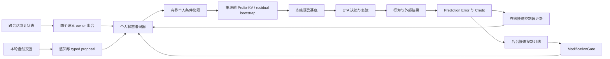

# 推理前个人状态条件化

## 1. 目标

Volvence 不要求用户把完整经历、关系和决策偏好重新写进 prompt。系统从已有
`user_model`、`relationship_state`、`goal_value`、`boundary_consent` 四个语义
owner 的不可变快照中，自动形成一份紧凑、可审计的个人状态条件，并在冻结基底
开始生成前通过有界控制入口影响残差流。

这不是改变 tokenizer 或重训整个 encoder，也不是把用户资料拼成一段隐藏
system prompt。精确事实、原话和证据继续走现有可审计上下文；神经侧条件只表达
稳定程度、关系连续性、情绪负荷、决策准备度、可逆性与边界风险等压缩 readout。

## 2. 唯一 Owner 与正式契约

| 项目 | 契约 |
|------|------|
| slot | `personal_conditioning` |
| owner | `PersonalConditioningModule`（`vz-cognition`） |
| value | frozen `PersonalConditioningSnapshot`（`vz-contracts`） |
| dependencies | `user_model`, `relationship_state`, `goal_value`, `boundary_consent` |
| default wiring | `SHADOW` |
| consumer | session response generation → open-weight substrate |

`PersonalConditioningSnapshot` 固定发布：

- 16 维 `[0, 1]` 有界状态向量与冻结坐标名；
- 四个来源快照的版本号与内容指纹；
- 覆盖度派生的置信度；
- 显式 cold-start 标志与可读审计描述；
- `rendered_statement`：owner 用确定性模板把**同一份** typed readout 渲染成的
  英文自然语言状态说明（State KV 臂 B′ 与蒸馏教师上下文共用）。渲染只消费
  16 个带标签坐标与 confidence（数值 → 定性分档 → 英文子句），**禁止**读取
  `SemanticRecord` 文本、原始对话或个人资料，因此其信息量与隐私姿态与潜向量
  完全一致。cold-start 或零置信度时必须为空串（契约不变量强制）。

owner 只能读取上游公开 typed readout，禁止读取原始对话、遍历 owner 内部存储、
解析 prompt 或用关键词重新判断用户语义。缺少个人证据时必须发布全零 cold-start
快照，不能凭默认人格猜测用户。

## 3. 当前收敛包：生成前残差预置

当前实现采用最小、可回滚的 residual bootstrap：

1. 四个语义 owner 发布本轮 typed snapshots。
2. `PersonalConditioningModule` 编译 16 维状态并发布审计快照。
3. `SHADOW` 时快照只进入 runtime evidence map，模型输出必须保持原路径。
4. `ACTIVE` 时 session 只把非 cold-start 快照传给 open-weight runtime。
5. 默认 runtime 使用固定、确定性的有界投影把 16 维状态映射到 hidden width；
   只有显式加载兼容的版本化 projector artifact 时才替换该 basis。
6. 默认投影只注入最早配置的一个 residual hook 层；实验 artifact 可以声明已
   hook 的多个层及每层 `[0, 1]` gain。所有目标层的 forward hook 在 prefill 和
   每个 decode step 都会触发，因此投影是整段生成期恒定的加性偏置，不是只作用
   于第一个生成 token 的一次性前置条件。
7. `DISABLED` 是立即回滚路径；任何不支持 residual hook 的 runtime（包括 vLLM
   和抽象基类默认实现）收到个人条件化输入时必须 fail loudly，不能静默丢弃或
   退回 prompt 拼接。唯一例外是 synthetic 测试 runtime：它以 trace-only 方式
   记录收到的快照并上报 `personal_conditioning_applied=False`，这是已文档化、
   可观察的显式回退，不得被消费者当作真实注入。

注入幅度由 `confidence × personal_conditioning_scale` 限制，默认 scale 为
`0.08`，构造时硬上限为 `0.12`。冻结基底参数不改变，个人向量不写入模型权重。

这一包解决“用户无需手写完整个人上下文，最终生成可读取系统已知个人状态”的
工程入口，但不声称已经完成整条认知链的最前置条件化。当前语义抽取和首个
temporal 决策仍早于这次注入。

### 3.1 State KV 实验臂接线（P0-b）

`FinalRolloutConfig.personal_conditioning_mode` 决定 ACTIVE 快照的**投递形态**，
两条路径由 `session_observation` 保证互斥，同一轮绝不同时生效：

| 模式 | 行为 | 对应实验臂 |
|------|------|-----------|
| `"residual"`（默认） | 快照经 `ResponseContext.personal_conditioning` 进入 runtime 残差通道（上文第 4–6 条） | 臂 E |
| `"text"` | owner 的 `rendered_statement` 经 `ResponseContext.personal_conditioning_statement` 进入 system prompt 的稳定前段；runtime **收不到**条件化快照 | 臂 B′ |

slot 为 `SHADOW` / `DISABLED` 时该开关无效（臂 A = 默认 `SHADOW`）。三个臂以
显式 dialogue profile 提供：`state-kv-arm-a` / `state-kv-arm-bprime` /
`state-kv-arm-e`，**不进**默认 ablation 矩阵，跑分需显式传 `profile_labels=`。

审计：text 模式在 rationale tags 记录
`personal_conditioning_text={schema}:{confidence}:{fingerprint 前缀}`，与
residual 模式的 `personal_conditioning` / `personal_conditioning_not_applied`
标签同级，保证两种投递形态同等可审计。

### 3.2 载体识别臂（prompt 载体闭合）

上述三臂的 system prompt 仍含 regime guidance / `prompt_residue_summary` /
speech plan 等**状态派生段**，因此臂之间的 prompt 并非逐字节相同，不能用于
「状态没有经 prompt 到达模型」这类主张。第二个开关
`FinalRolloutConfig.prompt_state_delivery` 负责关闭这条 prompt 载体：

| 模式 | 行为 |
|------|------|
| `"text"`（默认） | 现状生产路径，逐字节等价 |
| `"suppressed"` | `build_system_prompt` 只组装不变表达规则段，状态派生段整组不进 prompt |

由此得到两条 pure 臂 `state-kv-arm-a-pure` / `state-kv-arm-e-pure`：两者
prompt 逐字节相同，差异只在 residual 通道。`personal_conditioning_mode="text"`
与 `"suppressed"` 组合为非法配置（渲染语句会被静默丢弃），构造期即 raise。

`suppressed` 会同时移除 boundary / disclaimer / refer-out 的 prompt 侧引导，
因此是**证据专用模式，禁止部署**；边界约束在该臂下仅由 `GenerationConstraints`
的 substrate 侧后处理承担，`prompt-state-suppressed` capability 由守门测试限制
只能出现在 `*-pure` 臂上。

实验设计、载体清单与判据见
[`state-kv-identification-evidence.md`](./state-kv-identification-evidence.md)。

已知限制：当前 Transformers 与 vLLM runtime 均无**跨调用**的 prompt prefix KV
复用，B′ 的“前缀 KV 缓存”延迟对齐仍属包 C 的工程范围；本阶段只保证状态段位于
system prompt 的稳定早段（cache 友好位置）。§3.4 的 State-KV 前缀是另一回事：
它是逐调用生成的状态载体，不是对 prompt 前缀的缓存复用。

### 3.3 版本化 projector artifact（证据专用）

`vz-substrate` 是 16 维状态到冻结模型 hidden width 映射的唯一 owner。显式
artifact 使用 `personal-conditioning-projector.v1`，冻结以下兼容字段：

- 精确 `model_id`、`hidden_size` 与 16 个有序 `vector_labels`；
- L2 归一化的 16 行 basis、目标 `layer_indices` 与逐层 `(0, 1]` gain；
- `training_mode`、训练素材指纹、样本数与 canonical SHA-256 `artifact_id`。

runtime 加载时对 schema、artifact hash、模型、宽度和 hook 层逐项 fail loudly；
未知字段、缺少 hash、非归一化行或不支持的训练模式均拒绝。artifact 只保存浮点
投影与出处元数据，不保存用户事实、对话或 torch tensor，也不修改基底权重。

当前 `contrastive-residual-v1` 由冻结 Qwen 的正/负语义 anchor 残差差向量烘焙，
并在三个 middle hook 层以 gain 1.0 复用同一 basis。它是方向初始化实验，不是
由 evaluation 分数反向训练的长期策略，也未经过 `ModificationGate`，因此不得
成为默认 ACTIVE 路径。省略 `personal_conditioning_projector` 参数即可原子回滚
到 `fixed-sine-cosine-v1` 的单层行为；无需改快照 owner、runtime wiring 或权重。

### 3.4 版本化 Prefix-KV artifact 与单一 substrate owner（证据专用）

§3.3 的 projector 只能改注入**方向**，改不了幅度：`clamp_personal_conditioning_scale`
把 residual 通道硬钉在 `[0, 0.12]`，实测相对扰动约 0.25%，两条 artifact 都没能让
双人输出分叉。带宽侧的处置是换载体，而不是抬 cap。

`vz-substrate` 同时是 State-KV 前缀载体的唯一 owner——16 维 readout 到 KV 空间的
映射只在 `prefix_kv_artifact.py` 定义一次，`personal_conditioning` owner 仍然只
产出那一份快照，不新增第二个语义 owner。artifact 使用 `state-kv-prefix.v1`：

- 精确 `model_id` 与注意力几何（`num_layers` / `num_kv_heads` / `head_dim` / `num_slots`）；
- 低秩生成器：`tanh(encoder · state + bias)` 经 `bottleneck_rank` 瓶颈，再由逐层
  低秩解码器展开成 K/V；秩是契约项而非超参细节，它限定 16 维 readout 能有多少
  信息到达 attention；
- **逐层实测参考范数**与 `norm_cap ≤ 0.5`：生成的每个 head 向量按
  `norm_cap × reference_norm` 只缩不放；
- `training_mode`、素材指纹、样本数与 canonical SHA-256 `artifact_id`。

逐层参考范数不是形式主义。Qwen2.5-0.5B 的实测 key 范数从 layer 0 的 259.7 降到
中层的约 14，单一全局上限会同时过松和过紧；而范数匹配的**随机**前缀在 gain 0.25
就已经把输出打成 `'......'`，gain 1.0 完全崩坏。因此 `reference_*_norms` 必须为正
且有限，否则该层的 cap 会在 artifact 仍自称有界的情况下静默失效——契约层直接拒绝。

载体由 `ResponseContext.personal_conditioning_carrier` 选择（`"residual"` 默认 /
`"prefix_kv"`）。两条载体互斥：同一轮只会构建其中一个 delta，否则无法归因是哪条
通道带的状态。快照准入条件完全相同（缺失 / cold-start / 零置信度都不注入），所以
两臂的差别只有载体本身。缺少 artifact 时请求 `prefix_kv` 直接 raise，不回落到
residual——静默回落会发布一条标着 prefix-KV 而证据来自另一条通道的臂。

**已知非对称：解码路径。** prefix 载体不能用 `model.generate`：预填充 cache 会让它
把 prompt 前 `num_slots` 个 token 当成已缓存而截断 prompt，并从加宽后的 mask 推出
被整体后移的 `position_ids`——单是这个位移就会改变输出，让内容全零的前缀也看起来
像个能用的载体。因此该臂走自带的贪心循环，把真实 token 钉在位置 `0..n-1`。守门
测试断言：不给前缀时，该循环与 `model.generate` 的贪心输出**逐字节相同**。这条
等价性是 arm G 可以和 A / E / B′ 相比的前提，一旦破了，臂间差异就可能来自解码器
而不是被测载体。默认路径仍用 greedy 复核这条等价性；若打开 `temperature > 0` 的
stochastic rollout，必须由证据 runner 显式传 per-turn `sampling_seed`，seed 进入
C5 `decode_fp` 与 rationale tag。未对齐 seed 的 prefix-KV 采样直接 raise。

`personal-conditioning-prefix-kv` capability 与 `personal-conditioning-off` /
`-text` / `-residual` 互斥，守门测试断言除 `state-kv-arm-g-prefix-pure` 外没有任何
profile 选它。省略 `personal_conditioning_prefix` 参数即原子回滚：已加载但未被
请求的 artifact 对默认载体完全惰性，这一点也有守门测试。

历史 `teacher-distilled-prefix-v1` 由 B′ 文本臂教师蒸馏而来（基底冻结，只训
122,948 个生成器参数）。它在 p0 / p2 两条探针上取得了跨 CPU/MPS 稳定的双人分叉，
是第一条做到这点的潜通道；但 p1 仍双人同文，错用户负对照停在 0.508（随机），
因此判据 2 未过，不得晋升默认 ACTIVE，也不触发盲裁判预算。

机制定位（P4 门 A / 门 B）：状态确实进入 prefill 并可从真实 token 的残差流线性
读出（held-out R² 0.858），但 slot 注意力几乎不随状态变化（跨状态离散度比跨探针句
低 58 倍）。即注意力权重近乎恒定、value 随状态变，贡献形如 `w · V(state)`——一个
恒定增益的状态相关偏置，也就是 residual 载体的多层版本。因此加 slot 数或抬
`norm_cap` 只会放大偏置，不会产生按人路由；要动的是让注意力权重本身成为状态的函数。

2026-07-27 起，trainer 默认导出
`teacher-distilled-routed-prefix-v1`：在原 B′ 教师蒸馏与 wrong-user margin 之外，
额外加入 deterministic state→slot route target，对 prefill 末位真实 attention 的
prefix slot 分布做 cross-entropy。这个目标只训练 prefix **key** 能否让 slot 注意力
随 16 维状态变化，不新增语义 owner、不读取原始对话，也不改变 runtime 解码路径。
旧 `teacher-distilled-prefix-v1` artifact 仍保持可读用于复核；只有重新 bake 并通过
P4/P3 证据后，才可更新本节对当前 artifact 的结论。

2026-07-28 的标准 routed artifact 表明初始 `route_weight=0.35` 仍不足以过严格
P4 Gate A；将默认 route 权重调到 **1.0** 后，
`artifacts/state_kv/projectors/qwen2.5-0.5b-routed-prefix-rw1.json`
通过 P4 机制门（Gate A/B pass，`carrier_is_live=true`），并在 P3 中通过
prompt identity 与 output divergence。但 wrong-user training control 仍只有 0.523，
且 P3 未接跨家族 blind judge，整体 verdict 仍是 `insufficient_data`。因此当前
可声称的是 State-KV carrier 已在标准机制门上进入系统并被模型读到；身份识别、
默认 ACTIVE 晋升和“不依赖 context engineering”的外部主张仍等待 held-out P3/P2
与 blind judge。

同日新增的 `state-strategy-routed-prefix-v1` 不再以 B′ 文本臂为教师上限，而是从
16 维状态直接生成策略目标：高压力 / 低控制感状态输出稳态、修复与小步行动，高稳定 /
高信任 / 高决策准备度状态输出标准、下一步与验证推进。标准 artifact
`artifacts/state_kv/projectors/qwen2.5-0.5b-state-strategy-routed-prefix.json`
（artifact ID `8064f8b6de8ec215807619f404c84404087109076634d1ffda53112b4684e238`，
16 states、3 epochs、`route_weight=1.0`、`wrong_user_control_accuracy=0.875`）
已在 MPS 上通过：

- P3 prompt-closed 行为识别：`retain-strict`，`BAAI/bge-m3` embedding judge 12/12，
  CI 1.000..1.000，A-pure control 6/12 且 CI 覆盖随机；
- P4 机制门：Gate A/B pass，`carrier_is_live=true`，best held-out mean R² 0.9141。
- P2 held-out pairwise 识别：`repair-vs-execute` 为 `retain-strict`，29/32，
  CI 0.781..1.000；`boundary-vs-commit` 为 `retain-strict`，27/32，
  CI 0.719..0.969；两组 A-pure control 均覆盖随机。
- P2 aggregate retention gate：两组 P2 合计 G-prefix 56/64，accuracy 0.875，
  bootstrap seed CI low floor 0.781；A-pure 合计 32/64，CI 0.375..0.625 覆盖随机。
- P2 probe-limited stochastic retention gate（CPU）：`temperature=0.2`、`sampling_seed=1701`、
  `probe_limit=4`、`max_new_tokens=16` 下，两组 P2 均为 `retain-strict`；合计
  G-prefix 16/16，A-pure 8/16 且 CI 覆盖随机；per-turn seed audit 80/80 通过。
- P2 full-probe stochastic retention gate（CPU）：完整 16 probes、`max_new_tokens=16`、
  `temperature=0.2`、`sampling_seed=1701` 下，两组 P2 均为 `retain-strict`；合计
  G-prefix 64/64，A-pure 32/64 且 CI 覆盖随机；per-turn seed audit 320/320 通过。

这把“state readout 能进入 Prefix-KV 并影响冻结 Qwen 输出”证明到标准 artifact
级别，并补上了未见过 persona/probe 的 held-out 行为识别。它仍是证据专用 artifact，
不是默认 `ACTIVE` 晋升；默认 wiring / 回滚开关与多模型裁判矩阵仍需后续包处理。

完整数据与反主张边界见
[`state-kv-identification-evidence.md`](./state-kv-identification-evidence.md) §P3 / §P4。

## 4. 完整目标架构

完整升级分为三个可独立回滚的收敛包：

| 包 | 能力 | 退出门槛 |
|----|------|----------|
| A：当前 residual bootstrap | 最终生成前默认单层有界注入；建立 owner、契约、审计和 SHADOW 基线 | cold-start 严格无效；SHADOW byte-equivalent；ACTIVE 有可测 steering 且无安全回归 |
| A.1：证据用 projector artifact | 冻结基底上的版本化 contrastive basis 与显式多层 gain；默认路径不变 | matched ablation 过输出分叉门槛才允许进入盲裁判；失败则保留否证 artifact 并转 Prefix-KV |
| B：首轮感知前水合 | session 开始时加载上一轮已审计快照，让 substrate capture、temporal 和最终生成消费同一条件版本 | 同版本 lineage 贯穿 perception→decision→generation；跨用户隔离；撤销后下一轮归零 |
| C：可训练多层前缀 | 用受 gate 管理的 profile encoder / Prefix-KV 取代固定投影，在多个选定层形成更强但仍有界的条件 | matched ablation 显著优于 prompt-only 与固定投影；跨任务迁移成立；回滚可恢复冻结基线 |

## 5. 学习与持续学习关系

个人条件不是每个用户一套 500M 参数，也不是每轮微调一份模型。共享部分是一个
小型 profile encoder / projector；每个用户只保存语义 owner 快照、低维状态、
记忆引用和 lineage。这样新的交互结果可以通过 Prediction Error 与 Credit 更新
用户自己的快速状态，同时把跨用户可迁移规律以匿名、审计后的训练样本送到后台
慢速层。共享投影的新版本必须经过 `ModificationGate`，不能在线直接改基底。

这使持续学习形成两条同时存在的闭环：

- 个体闭环：交互 → 结果 → 误差 → 个人状态更新 → 下一轮推理前加载；
- 群体闭环：去标识经验 → 反事实/对比训练 → gate 验证 → 共享投影版本升级。

## 6. 训练与验证

固定投影只是安全 bootstrap，不应被包装成已学习的“人类表征”。训练版至少需要：

- 同一问题、不同关系/目标/边界状态的 matched counterfactual pairs；
- 同一用户跨轮的 outcome 与 delayed outcome；
- 错误个人状态、错用户、乱序状态和撤销状态的 negative controls；
- prompt-only、RAG-only、固定投影、learned projector、Prefix-KV 五臂同基底消融。

核心指标包括决策一致性、关系校准、边界违规率、追问信息增益、结果改善、
跨会话连续性、错用户泄漏率、状态撤销生效延迟和同基底 steering gain。任何
ACTIVE 提升都必须同时满足：安全指标不劣化、cold-start 不受扰动、来源 lineage
完整、可一键切回 `DISABLED`。

## 7. 隐私、审计与回滚

- 每次应用都记录 schema、来源 slot/version、内容指纹、confidence 和 runtime
  是否实际注入；不在日志中复制原始个人资料。“是否实际注入”的事实来源是
  `GenerationResult.personal_conditioning_applied`（由 runtime 上报），消费者
  不得以“传入了快照”推断注入发生；传入但未注入时必须记录显式的
  `personal_conditioning_not_applied` 标签。
- 用户删除或撤销 consent 后，owner 先更新正式快照；下轮条件必须由新版本重编译。
- 不允许跨用户复用个人状态；共享训练只消费经过策略批准的去标识样本。
- `SHADOW → ACTIVE → DISABLED` 是唯一上线和回滚顺序；禁止 consumer 私自读取
  SHADOW 快照并生效。
