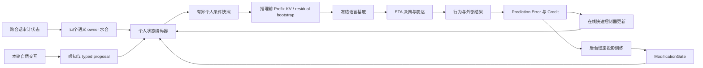

# 推理前个人状态条件化

## 1. 目标

Volvence 不要求用户把完整经历、关系和决策偏好重新写进 prompt。系统从已有
`user_model`、`relationship_state`、`goal_value`、`boundary_consent` 四个语义
owner 的不可变快照中，自动形成一份紧凑、可审计的个人状态条件，并在冻结基底
开始生成前通过有界控制入口影响残差流。

这不是改变 tokenizer 或重训整个 encoder，也不是把用户资料拼成一段隐藏
system prompt。精确事实、原话和证据继续走现有可审计上下文；神经侧条件只表达
稳定程度、关系连续性、情绪负荷、决策准备度、可逆性与边界风险等压缩 readout。

## 2. 唯一 Owner 与正式契约

| 项目 | 契约 |
|------|------|
| slot | `personal_conditioning` |
| owner | `PersonalConditioningModule`（`vz-cognition`） |
| value | frozen `PersonalConditioningSnapshot`（`vz-contracts`） |
| dependencies | `user_model`, `relationship_state`, `goal_value`, `boundary_consent` |
| default wiring | `SHADOW` |
| consumer | session response generation → open-weight substrate |

`PersonalConditioningSnapshot` 固定发布：

- 16 维 `[0, 1]` 有界状态向量与冻结坐标名；
- 四个来源快照的版本号与内容指纹；
- 覆盖度派生的置信度；
- 显式 cold-start 标志与可读审计描述；
- `rendered_statement`：owner 用确定性模板把**同一份** typed readout 渲染成的
  英文自然语言状态说明（State KV 臂 B′ 与蒸馏教师上下文共用）。渲染只消费
  16 个带标签坐标与 confidence（数值 → 定性分档 → 英文子句），**禁止**读取
  `SemanticRecord` 文本、原始对话或个人资料，因此其信息量与隐私姿态与潜向量
  完全一致。cold-start 或零置信度时必须为空串（契约不变量强制）。

owner 只能读取上游公开 typed readout，禁止读取原始对话、遍历 owner 内部存储、
解析 prompt 或用关键词重新判断用户语义。缺少个人证据时必须发布全零 cold-start
快照，不能凭默认人格猜测用户。

## 3. 当前收敛包：生成前残差预置

当前实现采用最小、可回滚的 residual bootstrap：

1. 四个语义 owner 发布本轮 typed snapshots。
2. `PersonalConditioningModule` 编译 16 维状态并发布审计快照。
3. `SHADOW` 时快照只进入 runtime evidence map，模型输出必须保持原路径。
4. `ACTIVE` 时 session 只把非 cold-start 快照传给 open-weight runtime。
5. runtime 使用固定、确定性的有界投影把 16 维状态映射到 hidden width。
6. 投影只注入到最早配置的那一个 residual hook 层；该层的 forward hook 在
   prefill 和每个 decode step 都会触发，因此投影是整段生成期恒定的加性偏置，
   不是只作用于第一个生成 token 的一次性前置条件。
7. `DISABLED` 是立即回滚路径；任何不支持 residual hook 的 runtime（包括 vLLM
   和抽象基类默认实现）收到个人条件化输入时必须 fail loudly，不能静默丢弃或
   退回 prompt 拼接。唯一例外是 synthetic 测试 runtime：它以 trace-only 方式
   记录收到的快照并上报 `personal_conditioning_applied=False`，这是已文档化、
   可观察的显式回退，不得被消费者当作真实注入。

注入幅度由 `confidence × personal_conditioning_scale` 限制，默认 scale 为
`0.08`，构造时硬上限为 `0.12`。冻结基底参数不改变，个人向量不写入模型权重。

这一包解决“用户无需手写完整个人上下文，最终生成可读取系统已知个人状态”的
工程入口，但不声称已经完成整条认知链的最前置条件化。当前语义抽取和首个
temporal 决策仍早于这次注入。

### 3.1 State KV 实验臂接线（P0-b）

`FinalRolloutConfig.personal_conditioning_mode` 决定 ACTIVE 快照的**投递形态**，
两条路径由 `session_observation` 保证互斥，同一轮绝不同时生效：

| 模式 | 行为 | 对应实验臂 |
|------|------|-----------|
| `"residual"`（默认） | 快照经 `ResponseContext.personal_conditioning` 进入 runtime 残差通道（上文第 4–6 条） | 臂 E |
| `"text"` | owner 的 `rendered_statement` 经 `ResponseContext.personal_conditioning_statement` 进入 system prompt 的稳定前段；runtime **收不到**条件化快照 | 臂 B′ |

slot 为 `SHADOW` / `DISABLED` 时该开关无效（臂 A = 默认 `SHADOW`）。三个臂以
显式 dialogue profile 提供：`state-kv-arm-a` / `state-kv-arm-bprime` /
`state-kv-arm-e`，**不进**默认 ablation 矩阵，跑分需显式传 `profile_labels=`。

审计：text 模式在 rationale tags 记录
`personal_conditioning_text={schema}:{confidence}:{fingerprint 前缀}`，与
residual 模式的 `personal_conditioning` / `personal_conditioning_not_applied`
标签同级，保证两种投递形态同等可审计。

### 3.2 载体识别臂（prompt 载体闭合）

上述三臂的 system prompt 仍含 regime guidance / `prompt_residue_summary` /
speech plan 等**状态派生段**，因此臂之间的 prompt 并非逐字节相同，不能用于
「状态没有经 prompt 到达模型」这类主张。第二个开关
`FinalRolloutConfig.prompt_state_delivery` 负责关闭这条 prompt 载体：

| 模式 | 行为 |
|------|------|
| `"text"`（默认） | 现状生产路径，逐字节等价 |
| `"suppressed"` | `build_system_prompt` 只组装不变表达规则段，状态派生段整组不进 prompt |

由此得到两条 pure 臂 `state-kv-arm-a-pure` / `state-kv-arm-e-pure`：两者
prompt 逐字节相同，差异只在 residual 通道。`personal_conditioning_mode="text"`
与 `"suppressed"` 组合为非法配置（渲染语句会被静默丢弃），构造期即 raise。

`suppressed` 会同时移除 boundary / disclaimer / refer-out 的 prompt 侧引导，
因此是**证据专用模式，禁止部署**；边界约束在该臂下仅由 `GenerationConstraints`
的 substrate 侧后处理承担，`prompt-state-suppressed` capability 由守门测试限制
只能出现在 `*-pure` 臂上。

实验设计、载体清单与判据见
[`state-kv-identification-evidence.md`](./state-kv-identification-evidence.md)。

已知限制：当前 Transformers 与 vLLM runtime 均无跨调用 prefix KV cache，
B′ 的“前缀 KV 缓存”延迟对齐属于包 C / State KV P3 的工程范围；本阶段只保证
状态段位于 system prompt 的稳定早段（cache 友好位置）。

## 4. 完整目标架构

完整升级分为三个可独立回滚的收敛包：

| 包 | 能力 | 退出门槛 |
|----|------|----------|
| A：当前 residual bootstrap | 最终生成前单层有界注入；建立 owner、契约、审计和 SHADOW 基线 | cold-start 严格无效；SHADOW byte-equivalent；ACTIVE 有可测 steering 且无安全回归 |
| B：首轮感知前水合 | session 开始时加载上一轮已审计快照，让 substrate capture、temporal 和最终生成消费同一条件版本 | 同版本 lineage 贯穿 perception→decision→generation；跨用户隔离；撤销后下一轮归零 |
| C：可训练多层前缀 | 用受 gate 管理的 profile encoder / Prefix-KV 取代固定投影，在多个选定层形成更强但仍有界的条件 | matched ablation 显著优于 prompt-only 与固定投影；跨任务迁移成立；回滚可恢复冻结基线 |

## 5. 学习与持续学习关系

个人条件不是每个用户一套 500M 参数，也不是每轮微调一份模型。共享部分是一个
小型 profile encoder / projector；每个用户只保存语义 owner 快照、低维状态、
记忆引用和 lineage。这样新的交互结果可以通过 Prediction Error 与 Credit 更新
用户自己的快速状态，同时把跨用户可迁移规律以匿名、审计后的训练样本送到后台
慢速层。共享投影的新版本必须经过 `ModificationGate`，不能在线直接改基底。

这使持续学习形成两条同时存在的闭环：

- 个体闭环：交互 → 结果 → 误差 → 个人状态更新 → 下一轮推理前加载；
- 群体闭环：去标识经验 → 反事实/对比训练 → gate 验证 → 共享投影版本升级。

## 6. 训练与验证

固定投影只是安全 bootstrap，不应被包装成已学习的“人类表征”。训练版至少需要：

- 同一问题、不同关系/目标/边界状态的 matched counterfactual pairs；
- 同一用户跨轮的 outcome 与 delayed outcome；
- 错误个人状态、错用户、乱序状态和撤销状态的 negative controls；
- prompt-only、RAG-only、固定投影、learned projector、Prefix-KV 五臂同基底消融。

核心指标包括决策一致性、关系校准、边界违规率、追问信息增益、结果改善、
跨会话连续性、错用户泄漏率、状态撤销生效延迟和同基底 steering gain。任何
ACTIVE 提升都必须同时满足：安全指标不劣化、cold-start 不受扰动、来源 lineage
完整、可一键切回 `DISABLED`。

## 7. 隐私、审计与回滚

- 每次应用都记录 schema、来源 slot/version、内容指纹、confidence 和 runtime
  是否实际注入；不在日志中复制原始个人资料。“是否实际注入”的事实来源是
  `GenerationResult.personal_conditioning_applied`（由 runtime 上报），消费者
  不得以“传入了快照”推断注入发生；传入但未注入时必须记录显式的
  `personal_conditioning_not_applied` 标签。
- 用户删除或撤销 consent 后，owner 先更新正式快照；下轮条件必须由新版本重编译。
- 不允许跨用户复用个人状态；共享训练只消费经过策略批准的去标识样本。
- `SHADOW → ACTIVE → DISABLED` 是唯一上线和回滚顺序；禁止 consumer 私自读取
  SHADOW 快照并生效。
