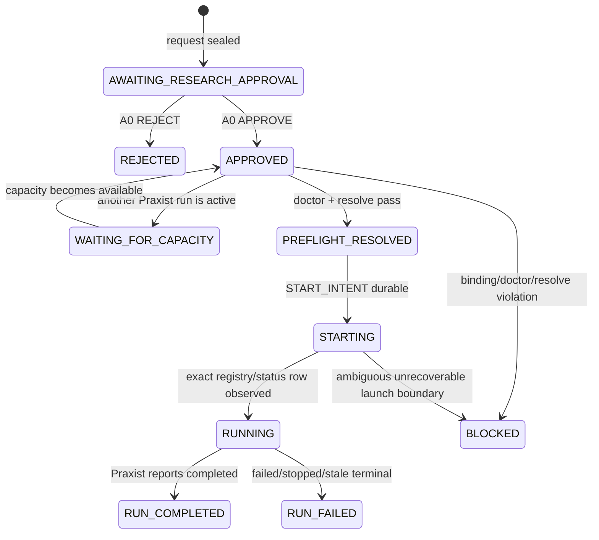

# Research Control Plane：Praxist 自动研究启动与可恢复调和

> Status: v1 mechanism landed；单 pilot A0 Request 正等待人审；无有效 research run，formal validator 与部署 adapter 尚未落地
> Last updated: 2026-08-29
> Owner: `volvence_forge`（development-plane control artifacts only）
> Companion contracts: [`research-opportunity-discovery.md`](./research-opportunity-discovery.md)、[`external-research-adapter.md`](./external-research-adapter.md)、[`research-promotion-pipeline.md`](./research-promotion-pipeline.md)

## 1. 决策摘要

Volvence 需要一条长期运行的研究控制链，但**不在仓库根目录放一个拥有业务状态的巨型脚本**。
根脚本无法可靠拥有审批、幂等、恢复、审计和多任务仲裁；它也容易把 Praxist Frontier 误接成
production authority。

正式入口由 `volvence_forge` 提供：

```text
typed research signal / ResearchOpportunity
    → frozen ResearchRequest
    → A0 named-human approval
    → doctor / resolve
    → start --daemonize --json
    → targeted status reconciliation
    → committed Praxist handoff
    → loop-external validation + ModificationGate
    → A1 SHADOW authorization
    → target-owned canary
    → A2 ACTIVE authorization
```

本 spec 实现中间生命周期段：

```text
ResearchRequest → A0 approval/rejection → doctor → resolve → start → status
```

上游 `research-opportunity-discovery.md` 已能从 typed failure pattern 形成 Request，但仍不从任意自然语言
发现问题。本控制面不生成 task project、不读取 sealed holdout、不导入候选、不调用
`ModificationGate`，也不改变 `DISABLED / SHADOW / ACTIVE`。研究完成只表示 Praxist 生命周期已结束，
不表示候选已被验证或获准上线。

## 2. 唯一 owner 与边界

`volvence_forge` 是本控制面的唯一 writer，拥有：

- content-addressed `ResearchRequest`；
- exact-bound A0 `ResearchApproval`；
- 每个 request 的 append-only `ResearchControlEvent` chain；
- 从上述 immutable artifacts 投影出的 inbox state。

Praxist 继续唯一拥有：

- task project/plugin resolution；
- detached run registry 与进程生命周期；
- generation、Frontier、Incubator、Gems 和研究保留；
- run-local canonical artifacts。

Volvence runtime owner、formal validator、`ModificationGate` 和 target adapter 的职责不变。本控制面
不是 `vz-*` runtime wheel，不注册 `docs/DATA_CONTRACT.md` slot，不发布 Brain snapshot，也不把
Praxist evaluator 或 status 变成 PE/credit 来源。

外部领域通过 `forge-external-research-request.v1` 进入同一 control registry，复用完全相同的 Approval、
Event、lock、doctor/resolve/start/status 实现；它不是 Volvence Task，也不进入本 spec 后半段的 promotion
路径。Foundry first-class Intent 与 simulation handoff 的额外约束见 `external-research-adapter.md`。

## 3. 为什么不用根目录脚本

根目录脚本最多可以是无状态命令别名，不得持有 queue、审批或 latest state。当前不新增该别名，
因为 `forge` console entry 已是稳定入口。周期执行交给 launchd/systemd/CI/Codex automation 等外部
scheduler，每次只执行一个有界调和回合：

```bash
forge research-reconcile --once
```

Praxist run 本身由 `praxist start --daemonize` 托管；调和器退出不会终止研究。控制面因此不需要另一个
常驻 wrapper、PID file 或自制 `fork/setsid` 实现。

## 4. Artifact contracts

正式 schema：`forge/schemas/research_control.schema.json`。

### 4.1 `forge-research-request.v1`

Request 在 A0 之前冻结人类实际要批准的完整执行面：

- `forge-research-task.v1` locator + byte SHA-256；
- task project absolute root、`task_project_manifest.v1` compatible digest、逐文件 digest 与 file count；
- Praxist executable absolute locator + byte SHA-256；源码 checkout 可识别时再绑定 package tree digest；
- deterministic absolute `run_dir` 与同名 `run_id`；
- config profile、显式 agent system/runtime/provider/model、strategy、cohort、generations；
- typed trigger kind、named submitter、rationale 与零到多个 structured evidence refs；
- 明确的 authority false：未批准研究启动，未批准 production promotion。

Task snapshot 只排除 Praxist manifest v1 明确排除的 cache/data/runtime-output roots；included path 中
出现 symlink 直接拒绝。Request 创建后，审批和启动前都会重算所有内容绑定。任何 byte、executable、
config 或可识别 Praxist source tree 漂移都 fail closed。

上游 task registry 可以用 `auto` 在每台 host 上发现 Praxist，但该 token 不进入 Request。Forge 必须在
Request 提交前把它解析为当前 host 的 absolute executable，并连同 byte SHA-256/source checkout identity
冻结；`~` run root 同样先展开成 absolute `run_dir`。因此 macOS 与 WSL 可以共享 registry policy，却不能
共享或搬运一张已经绑定另一台 host 路径的 A0 Request。

非 Codex-native Request 禁止依赖 credential-presence 驱动的 provider/model mutable default；四项运行选择
必须显式给出。Codex-native 会把 agent/runtime/provider 规范化为 native OpenAI 路径，但 exact model 仍
必须由提交者指定并由 `doctor` 校验 catalog。真实 subprocess 遇到 `--codex-native` 时必须删除
`OPENAI_API_KEY / CODEX_API_KEY / CODEX_ACCESS_TOKEN / OPENAI_BASE_URL / PRAXIST_CODEX_BIN /
MODEL / PRAXIST_MODEL`，只允许 Praxist 使用当前主机保存的 ChatGPT 登录；非 Codex-native profile
继续按其显式 provider 契约继承宿主凭据。

被 manifest 排除的大型 dataset/simulator 不由控制面复制或逐字节哈希；Task 必须发布其 immutable
dataset/simulator metadata，需 A0 精确绑定的外部清单应通过 `--evidence` 加入 Request。Praxist doctor/
resolve 继续负责检查声明路径和 runtime readiness。

Request 只接受已经存在、静态可检查且与 Volvence Task 中
`praxist.task_project_manifest_sha256` 一致的 task project。尚无 task、evaluator、baseline、role/audit
或 runtime assets 的机会仍是 `NEEDS_TASK_DESIGN`，不能用空壳 Request 自动启动。

### 4.2 `forge-research-approval.v1`

Approval 精确绑定 `request_id + request file SHA-256`，scope 固定为 `praxist_research_start`，decision
只能是 `APPROVE | REJECT`。它要求 named reviewer 与非空 reason，并固定：

- APPROVE 只授权执行该 Request 中的 doctor/resolve/start/status；
- REJECT 不可启动；
- 两者都不授权 formal validation、candidate import、SHADOW 或 ACTIVE；
- 同一 Request 不允许出现互相冲突的多张 approval。

Task、budget、model、run dir 或 executable 任一改变都必须生成新 Request 并重新 A0，不能修改旧
Approval。

### 4.3 `forge-research-control-event.v1`

Event 是 create-only append chain，包含 contiguous sequence、previous-event file SHA-256、Request /
Approval exact bindings、规范化 command receipt 和 run snapshot。正式 event kind：

- `CAPACITY_OBSERVED`
- `DOCTOR_SUCCEEDED`
- `RESOLVE_INTENT`
- `RESOLVE_SUCCEEDED`
- `START_INTENT`
- `START_CONFIRMED`
- `STATUS_OBSERVED`
- `CONTROL_BLOCKED`

命令 receipt 保存 argv、exit code、timeout flag、stdout/stderr digest；不保存进程环境、credential、raw
stderr 或 token。成功输出只投影 schema 所需的非秘密 lifecycle fields。

## 5. State machine



`RUN_COMPLETED` 的下一合法动作是 task-local exporter 生成
`forge-praxist-candidate-handoff.v1`，再进入通用上架流水线。不得从 completion status 直接推导
candidate maturity、Gate ALLOW 或 wiring authority。

## 6. 调和算法与 crash boundary

每次 `research-reconcile --once`：

1. 获取全局 control lock，再逐 Request 获取 lock；所有 artifact 重新校验 schema、identity 和 hash chain。
2. 无 Approval 返回 `AWAITING_RESEARCH_APPROVAL`；REJECT 返回 `REJECTED`，不调用 Praxist。
3. 对已启动 Request 只执行 `praxist status --run-id <run_id> --json`。
4. 对未启动 Request 先执行 `praxist status --active --json`；存在任何 live Praxist run 时保持
   `WAITING_FOR_CAPACITY`，v1 默认不并发抢占 host。
5. 重算 Task、task project、executable、config、evidence 和 Praxist source bindings。
6. 执行 exact profile 的 `praxist doctor --json --task-path ...`，再执行
   `praxist resolve <task> --run-dir <request-control>/preflight`。
7. 校验 resolve JSON、`task_project_manifest.json` 和 Volvence Task 中冻结的 manifest digest。
8. resolve 后再次检查 host capacity，关闭 preflight 期间外部 run 启动的 TOCTOU；为空时才 create-only
   写入 `START_INTENT`，随后执行
   `praxist start --task-path ... --run-dir ... --daemonize --json`。
9. 校验返回的 `run_id/run_dir/task_path/pid`，再 targeted status；后续 scheduler 只做同一 targeted poll。

`START_INTENT` 是不可跨越的幂等边界。若 worker 在 launch 前后崩溃，下一回合先查 deterministic
`run_id`：

- registry/status 已有 exact row：恢复为 `START_CONFIRMED`，禁止再次 start；
- 无 row 且 `run_dir` 不存在：允许完成一次尚未发生的 start；
- 无 row 但 `run_dir` 已出现：写 `BLOCKED`，要求 operator/Praxist lifecycle repair，禁止猜测并重复启动。

同理，`RESOLVE_INTENT` 后只接受完整且 exact-bound 的 preflight artifacts；partial directory 不会被静默
覆盖。

## 7. CLI surface

```text
forge research-scan <failure_patterns.jsonl> \
  [--registry <research_task_registry.yaml>] --once [--json]

forge research-submit <task.json> \
  --task-project <path> \
  --praxist-executable <path> \
  --run-dir <path> \
  --requested-by <name> \
  --reason <reason> [frozen launch profile...]

forge research-submit-external <descriptor.json> \
  --requested-by <name> --reason <reason> [--json]

forge research-inbox [--json]

forge research-approve <request.json> \
  --approved-by <human> --reason <reason> [--reject]

forge research-reconcile --once [--request <request.json>] [--json]

forge research-handoff-external <request.json> \
  --recorded-by <name> --reason <reason> [--json]
```

`research-submit` 是 detector 与人类共用的稳定提交 seam，但它本身不做自然语言发现。
`research-scan` v1 只消费 `forge-failure-pattern.v3`，形成不可变 Opportunity，再按 exact
component/target registry mapping 调用该 seam；禁止用关键词、正则或 LLM prose 选择 task，更不能直接
触发 start。其他 prediction-error/benchmark/protocol-gap typed adapter 尚未开放。

`research-submit-external` 只接受已冻结的 external descriptor，并把 Foundry Intent 映射为独立 external
Request；它不接受 `forge-research-task.v1`，也不自动批准或启动。`research-handoff-external` 只封存
`RUN_COMPLETED` 的 simulation evidence，不调用 Candidate importer、ModificationGate 或 wiring owner。

## 8. Human gates 与上架链

| Gate | 输入 | 只授权 | 明确不授权 |
|---|---|---|---|
| A0 Research | frozen Request + task/runtime identity | 一次 Praxist detached research lifecycle | candidate import、SHADOW、ACTIVE |
| A1 SHADOW | mature handoff + loop-external validation + ModificationGate ALLOW | target adapter SHADOW/canary | ACTIVE |
| A2 ACTIVE | fresh canary/validation + fresh Gate + prior SHADOW receipt | target adapter ACTIVE | 其他 owner 或其他 candidate |

A1/A2 已由 `research-promotion-pipeline.md` 的 receipt contract 约束，实际 apply 仍属于 target owner。

## 9. 四能力轴

- **Appendable**：Request/Approval/Event chain 可恢复，但不是 CMS memory claim。
- **Readable**：只读取 typed Task、Praxist JSON 和 canonical artifacts；不从日志 prose 重建状态。
- **Learnable**：research score/status 永不进入 PE/credit；formal evaluation 仍是 gate evidence，不是 reward。
- **Steerable**：本包不改变 runtime steering；production 必须继续走相邻
  `DISABLED→SHADOW→ACTIVE` receipt 和 target adapter。

因此 v1 只能声称“研究生命周期控制机制可审计、可恢复”，不能声称四轴闭环或产品效果成立。

## 10. Failure semantics、安全与隐私

- schema、identity、hash chain、path、manifest、symlink 或 command output shape 错误：fail loudly；
- doctor/resolve/start non-zero 或 timeout：写 `CONTROL_BLOCKED`，不自动扩大权限或反复重试；
- status 只能 targeted poll 已知 run；global status 只用于只读容量检查；
- subprocess 永远传 argv list，禁止 shell；不接受任意 extra args；
- credential 只由 Praxist/current host runtime 读取，不进入 Request、Event、stdout summary 或测试 fixture；
  Codex-native doctor/resolve/start 额外清除 provider key、base URL、binary 和 model 环境覆盖，避免冻结的
  saved-login profile 被宿主环境静默改写；
- run output 不得位于 Praxist source checkout；control artifacts 只能写到 `artifacts/research_control/`；
- v1 不 stop、resume、kill 或 crop run。出现 stale/failed 只报告，由显式 Praxist control workflow 处理。

## 11. 迁移、退出与回滚

本包不改现有 Forge proposal、promotion receipt 或 production defaults。停用自动控制只需停止外部
scheduler；detached Praxist run 仍由 Praxist registry 管理，需显式 `praxist stop <run_id>`。

完全退出时删除 Forge CLI/module/schema/spec 引用即可；已生成 Request/Approval/Event 和 Praxist run
保留审计史。由于本包从未改变 runtime wiring，不存在本包自己的 ACTIVE rollback；候选回滚继续走
promotion receipt 的相邻降级。

## 12. v1 限制与后续收敛包

- typed `research-scan`、Opportunity 与 `NEEDS_TASK_DESIGN` registry 已落地，但 v1 只接
  `forge-failure-pattern.v3`；
- task registry 只登记一个 `coding_memory_inheritance` pilot，尚不自动设计或修复其他 runnable task；
- 默认 host-wide 单 active-run，不做 GPU/resource quota portfolio scheduling；
- capacity check 在 resolve 前后各执行一次，但 Praxist 当前没有跨 client 的 host-capacity reservation；
  外部 operator 在最终检查后并发 start 的极窄竞争窗仍需未来 scheduler lease 关闭；
- pip-installed Praxist 只能绑定 executable bytes；可识别 source checkout 才额外绑定 package tree；
- task project 外部的已安装 plugin/dependency 与 manifest 排除的数据资产依赖 task-owned metadata；对
  高价值 run 应把 lockfile、dataset manifest 和 simulator image digest 作为 Request evidence；
- 首个真实 run 仍必须精确批准 A0 Request；注册和扫描都不授予启动权限；
- Forge 不提供 OS-level execution denial；另一个 shell 直接调用 `praxist start` 的 out-of-band run 只能按
  exact identity 检出、停止并排除，不能写进 Request event chain；
- run completion 后仍需 pilot exporter、formal validator、Gate adapter 和 target-owned deployment seam。

下一包只在用户明确批准当前 `coding_memory_inheritance` Request 后，验证
Request → real Praxist run → committed handoff；
不得同时上线第二个 owner，也不得在 pilot 中跳过 A1/A2。
