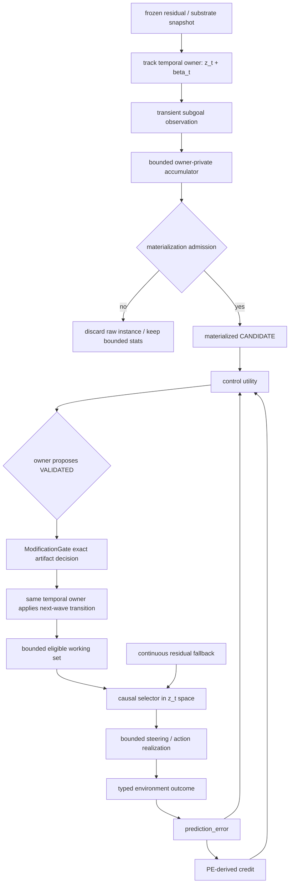

# Subgoal Readout → Temporal Abstraction Working Set Spec

> Status: design draft（目标契约与实施顺序提案；尚未授权 runtime 行为变更）
> Last updated: 2026-08-22
> 对应需求: R-PE, R1, R2, R3, R4, R8, R9, R10, R11, R13, R15
> 上位规范: [temporal-abstraction.md](./temporal-abstraction.md)、
> [emergent-action-abstraction.md](./emergent-action-abstraction.md)、
> [multi-timescale-learning.md](./multi-timescale-learning.md)、
> [contract-runtime.md](./contract-runtime.md)
> 研究背景: [Sutton / Oak 与 Volvence 对比](../../research/richsutton/04_VOLVENCE_COMPARISON.md)、
> [对 Volvence 的实施建议](../../research/richsutton/05_RECOMMENDATIONS.md)

## 0. 决策摘要

Volvence 不枚举、保存或治理 LLM 内部全部潜在 subgoal。残差中一次可读的 subgoal
activation 只是**瞬时观测**，不是一个自动获得永久身份的 artifact。

只有当一类时序结构在多次经历中重复出现，并具备初步稳定性、时序性和预测压缩价值时，
`vz-temporal` 才把它**物化**为可寻址、可版本化的 candidate。candidate 还必须经过独立的
held-out prediction、grounded control、约束和资源检验，才能成为 operational abstraction。
只有这部分少量物化对象进入候选、验证、休眠和退休流程。

本 spec 的核心架构决定是：

1. 保留连续、开放的 `z_t` 学习空间，不把系统退化为有限标签路由器；
2. 在连续空间上建立一个**有界、动态、可审计的 abstraction working set**；
3. raw readout 不进入 artifact lifecycle；被物化的控制绑定才进入；
4. `beta_t` termination 与 artifact retirement 是两个不同概念；
5. 不创建全局 `LifecycleManager`，生命周期状态仍由各 track temporal owner 拥有；
6. 第一阶段不抽取跨域通用 lifecycle 框架，只在 temporal owner 内证明机制；
7. `WiringLevel` 继续负责 DISABLED / SHADOW / ACTIVE，不能复制成另一套 lifecycle 状态；
8. production ACTIVE 不由本 spec 授权，必须另经 PE→credit 证据、`ModificationGate`
   和部署配置上限。

这里的 governance 是四能力轴上的横切准入与退出纪律，不新增第五条产品能力轴。

一句话：

> Read freely, materialize sparingly, activate cautiously, retire bindings—not concepts.

## 1. 要解决的问题

冻结 LLM 的残差流可以在特定代理任务中线性读出 active subgoal。这说明基底已经承载
某些时序结构，但不能直接推出：

- 系统已经自主发现了稳定 subgoal；
- 两次相似 readout 代表同一个可复用抽象；
- readout 对真实行动具有因果控制价值；
- 所有 readout 都应该写入长期记忆；
- 已读出的概念需要由 Volvence 创建或从 LLM 中删除；
- 当前 ETA operationalization 已经成立。

另一方面，当前 `vz-temporal` 已在 `MetacontrollerParameterStore` 内维护
`DiscoveredActionFamily`，支持有界 family bank、create/reuse/split/merge/prune、
competition 和 delayed-credit feedback。现有实现已经接近“工作集”，但仍混合了四件事：

1. 当拍 latent observation；
2. 跨经历 pattern 聚合；
3. 稳定 abstraction identity；
4. 可实际参与控制的 action family。

这会带来错误物化、信用稀释、身份漂移、无法审计 prune、以及“存在 family 即具有控制
资格”的风险。本 spec 要把这四层拆开，同时不建立第二个 temporal owner。

## 2. 术语与边界

| 术语 | 定义 | 是否持久化 | 是否进入生命周期 | 是否可改变行为 |
|---|---|---:|---:|---:|
| **Latent subgoal capacity** | 冻结 LLM / residual space 中潜在可表达的 subgoal 结构；不可枚举 | 否 | 否 | 只能经控制器间接作用 |
| **Subgoal readout observation** | 当前 turn / segment 从 residual、`z_t`、`beta_t` 读到的瞬时结构 | 默认否；证据 lane 可有界记录 | 否 | 否 |
| **Pattern accumulator** | temporal owner 对相似 observation 保存的有界充分统计量 | owner checkpoint | 否 | 否 |
| **Materialized abstraction** | 通过准入条件后获得稳定 ID/version/digest 的 action family | 是 | 是 | 默认只能 SHADOW |
| **Operational abstraction** | 已验证并获 Gate/部署授权，可被 selector 选入当前控制工作集的 materialized abstraction | 是 | 是 | 仅在有效 ACTIVE wiring 下可以 |
| **Execution segment** | 某个 abstraction 的一次有始有终的执行实例 | closure lineage | 否；它是经历 | 是 |
| **Retired binding** | 已撤销的“latent pattern → stable family → control”绑定 | compact tombstone | 终态 | 否 |

### 2.1 “开放空间”而非数学上的无穷维

当前 `z_t ∈ R^d` 是有限维连续空间，但对系统而言具有开放、不可枚举、缺少稳定地址的性质。
本 spec 不把它改成一个有限类别集合，而是在其上建立小型的动态坐标系：

```text
continuous z_t / residual space
          │
          ├── bounded validated abstraction working set
          │       ├── family A
          │       ├── family B
          │       └── family C
          │
          └── continuous residual path for novelty / fallback
```

任何 working-set 方案都必须保留 continuous residual path；无法匹配既有 abstraction
时必须允许未物化表示继续流动，而不是强制归类。

### 2.2 “建立”“结束”“退休”不是同一件事

- **物化 / establishment**：跨经历 pattern 首次获得稳定 artifact identity；
- **termination**：一次 option-like 执行因 `beta_t` switch / typed boundary 结束；
- **dormancy**：artifact 暂时不参与选择，但仍可重新验证；
- **retirement**：系统永久撤销该版本的控制绑定，保留 lineage/tombstone；
- **concept deletion**：删除 LLM 内部概念；Volvence 不做、也不声称能做。

`beta_t` termination 可以每个 episode 发生很多次，而 artifact retirement 应非常少见，
由长期证据、依赖失效、安全约束或替代关系触发。

### 2.3 与 Sutton option 结构的对应

一个进入 operational working set 的 temporal abstraction，最多可逐步形成 option-like
结构，但初始 candidate 不必假装已经完整：

| Sutton / option 元素 | Volvence 对应 | 本 spec 的边界 |
|---|---|---|
| initiation set `I_k` | typed context/applicability readout | 由 learned/typed state 决定，不用关键词规则 |
| intra-option policy `pi_k` | `z_t` causal policy + bounded decoder/controller | 仍保留 continuous residual path，不固化为文本脚本 |
| termination `beta_k` | learned `beta_t` + typed external boundary | 结束一次 execution segment，不退休 artifact |
| option model | bounded prediction of later state/outcome | 后置能力；没有 grounded model 证据时不宣称 planning abstraction |
| library retirement | owner-local DORMANT/RETIRED transition | 工程治理层，不是 option 数学中的 termination |

## 3. 当前实现基线与缺口

| 当前组件 | 可以复用的能力 | 本 spec 识别的缺口 |
|---|---|---|
| `DiscoveredActionFamily` | centroid、support、stability、drift、competition、outcome/credit history | 无 typed stage、per-family version/digest、parent/dependency lineage |
| `discover_latent_action_family()` | owner-local create/reuse/split/merge/prune；默认 `max_families=6` | observation 可直接创建 family；prune 后缺 compact tombstone；summary 字符串承担 lifecycle 语义 |
| `ActionFamilyPublicSummary` | 已有只读聚合统计，不泄露 mutable weights | 未区分瞬时 readout、候选、已验证和控制资格 |
| `action_family_version` | bank 变更可审计 | 只标记整库 revision，不能精确授权某个 family version |
| `TemporalSegmentClosure` | `beta_t` 产生 segment 结束与 PE lineage | 不能表达 artifact retirement，也不应该承担该职责 |
| `TemporalActionAdvisoryProposal` | artifact ID/version、evidence refs、ACTIVE authorization 防火墙 | 只覆盖 relationship advisory，不是 generic temporal family lifecycle |
| `ModificationGate` | validation、capacity、rollback、reversibility、old/new hash | 尚未统一绑定到每个 temporal family 的 exact version/digest |
| `WiringLevel` / `propagate()` | 正式 DISABLED/SHADOW/ACTIVE 与 shadow 隔离 | 是接线层，不应兼任抽象成熟度状态 |

当前 `kill-eta` 判词继续有效：现有 action-family machinery 存在，不等于当前
16 维折叠入口或 ETA rate-distortion 主张已被证明。本 spec 是新的、可反证的
operationalization 计划，不得通过换名绕过已封存判词。

## 4. 不可让步的不变量

### 4.1 Readable 不等于 materialized

- 每拍 readout 可以很多，但不会自动获得永久 ID。
- raw observation 默认只活一个 turn / segment；证据记录必须有硬上限。
- consumer 不得因 readout label 相同就推断它们属于同一 abstraction。
- LLM/semantic decoder 给出的名字只作 background 可读描述，不决定 identity、路由或晋升。

### 4.2 唯一 owner

- WORLD bank 由 `TrackTemporalModule(track=WORLD)` 及其 owner-private parameter store 拥有。
- SELF bank 由 `TrackTemporalModule(track=SELF)` 及其 owner-private parameter store 拥有。
- `TemporalAggregateModule` 只聚合并发布，不拥有、合并或退休 track bank。
- `vz-runtime` 只编排和施加部署 ceiling，不解释 abstraction utility。
- `ModificationGate` 只批准 exact proposal，不保存或修改 family payload。
- expression/application 不得从 family ID、summary 或文本重建 temporal 内部语义。

### 4.3 有界性

以下四项都必须有独立硬上限：

1. 当前拍发布的 readout 数；
2. owner-private observation / evidence window；
3. 每 track 的 materialized candidate bank；
4. 每 context/regime 可参与选择的 validated working set。

历史经历总量增长时，以上内存与每拍计算不得按生命期线性增长。当前
`max_families=6` 只作为兼容回滚基线，不作为理论最优常数；任何调整都必须在固定
resource budget 下比较。

### 4.4 学习信号与验证信号隔离

- structure discovery 可以使用正式 residual、时序 prediction objective、PE 与 KL bottleneck；
- materialization / utility update 只能使用上述信号及其下游 credit；
- evaluation、judge、人类标签和 synthetic truth 只能作验证锚或机制实验；
- missing / delayed outcome 不得被编码成负 credit；
- consent / boundary 是 hard constraint，不压成可交换的 scalar reward。

### 4.5 控制资格与生命周期正交

- `CANDIDATE` 不能因存在而进入用户可见行为；
- `VALIDATED` 只表示证据足以请求控制授权，不表示当前已经 ACTIVE；
- 有效控制还必须同时满足 Gate receipt、deployment ceiling、依赖有效和 module wiring；
- `DORMANT` / `RETIRED` 必须 strict no-op；
- module SHADOW 下，任何 per-family 状态都不能进入 active snapshot mapping。

## 5. 架构形态



这条链中不存在生命周期中央服务。共用的是 frozen contract 和纯校验函数；可变状态只在
track owner 内。

### 5.1 时间尺度

| 时间尺度 | 允许行为 | 禁止行为 |
|---|---|---|
| `online-fast` | 发布当前 readout；更新固定大小充分统计；在已授权 working set 中选择/结束 segment | 创建无界 family；修改 topology；根据 evaluation 即时晋升 |
| `session-medium` | 结算 segment PE/credit；更新 utility、drift、coverage；提出 stage transition | 阻塞 live turn；直接切 production ACTIVE |
| `background-slow` | materialize、merge、split、dormancy/retirement proposal；SHADOW planning audit | LLM curator 直接写 family；用总结文本作 reward |
| `rare-heavy` | decoder/controller artifact 更新、跨版本迁移、离线 confirmation | 在线重写 foundation substrate；绕过 ModificationGate |

当前 `learning_phase / structure_frozen` 边界继续成立：causal runtime/rl phase 默认
`structure_frozen=True`；topology mutation 只能在明确的 SSL/background owner phase 发生。

## 6. 状态模型

### 6.1 瞬时 observation：不是 artifact

目标概念形态如下；是否作为公共 dataclass 发布由实施包 A 冻结，但它绝不成为新 runtime slot：

```python
@dataclass(frozen=True)
class TemporalSubgoalReadout:
    observation_id: str
    track: Track
    turn_index: int
    segment_id: str | None
    z_t_digest: str
    beta_t: float
    matched_abstraction_ref: TemporalAbstractionRef | None
    match_confidence: float
    novelty_score: float
```

约束：

- 不包含 raw text、未来 outcome、evaluation 或 semantic owner 私有状态；
- `matched_abstraction_ref=None` 是合法且重要的结果；
- observation ID 只用于当拍/证据 lineage，不是稳定 abstraction ID；
- 默认不进入 hydration；若 evidence lane 记录，使用有界 ring / append-only artifact，
  不进入 runtime selection owner。

### 6.2 Owner-private pattern accumulator

accumulator 保存足以判断是否值得物化的统计，而不是全部历史：

- latent / decoder prototype 的有界统计；
- distinct episode / regime / segment coverage；
- recurrence 与 recency；
- posterior drift / persistence；
- matched prediction IDs、settled outcome IDs 和 credit IDs 的有界引用摘要；
- novelty / redundancy；
- resource cost；
- accumulator schema/version/RNG state。

accumulator 是 `vz-temporal` 私有状态，通过现有 owner hydration/checkpoint 恢复；
consumer 不得读取其 mutable buffer。

### 6.3 Materialized abstraction

第一阶段使用 temporal-specific contract，不提前抽取通用 `ArtifactLifecycle`：

```python
class TemporalAbstractionStage(str, Enum):
    CANDIDATE = "candidate"
    VALIDATED = "validated"
    DORMANT = "dormant"
    RETIRED = "retired"


@dataclass(frozen=True)
class TemporalAbstractionRef:
    track: Track
    abstraction_id: str
    version: int
    digest: str


@dataclass(frozen=True)
class TemporalAbstractionUtilitySummary:
    settled_prediction_count: int
    distinct_episode_count: int
    distinct_regime_count: int
    prediction_error_delta: float | None
    control_credit_delta: float | None
    stability: float
    posterior_drift: float
    redundancy: float
    resource_cost: float
    evidence_refs: tuple[str, ...]


@dataclass(frozen=True)
class TemporalAbstractionPublicSummary:
    ref: TemporalAbstractionRef
    stage: TemporalAbstractionStage
    requested_wiring: WiringLevel
    utility: TemporalAbstractionUtilitySummary
    parent_refs: tuple[TemporalAbstractionRef, ...]
    dependency_refs: tuple[TemporalAbstractionRef, ...]
    gate_record_ref: str | None
    rollback_ref: TemporalAbstractionRef | None
    reason_codes: tuple[str, ...]
```

这些是目标 shape，不是当前已实现承诺。实施前必须在 `docs/DATA_CONTRACT.md` 将对
`temporal_abstraction` 的 additive enrichment 注册清楚；第一包禁止新增平行 slot。

### 6.4 阶段与 WiringLevel 分离

| Stage | 语义 | 允许的 requested wiring 上限 |
|---|---|---|
| `CANDIDATE` | 已物化、可寻址，证据仍在积累 | SHADOW |
| `VALIDATED` | prediction/control/constraint 证据满足预注册门，可请求授权 | ACTIVE，但必须另有 exact Gate record 与部署 ceiling |
| `DORMANT` | 暂无资格或当前不适用，保留数据与复验入口 | DISABLED |
| `RETIRED` | 该版本永久退出 selection；compact tombstone 保留 | DISABLED，终态 |

`VALIDATED` 不等于 `ACTIVE`。有效接线由显式 meet 解析：

```text
effective_wiring = meet(
    stage_ceiling,
    owner_requested_wiring,
    gate_authorized_ceiling,
    deployment_profile_ceiling,
    dependency_availability,
    module_wiring,
)
```

解析必须是无状态、枚举显式的纯函数；禁止依赖 Enum 排序偶然性。任一 ref/version/digest
不匹配时 fail closed。

## 7. 物化准入与容量策略

### 7.1 物化是漏斗，不是逐条登记

```text
many transient readouts
        ↓ bounded aggregation
few recurrent patterns
        ↓ materialization gate
few CANDIDATE artifacts
        ↓ held-out PE / credit / constraint evidence
smaller VALIDATED bank
        ↓ context-conditioned selection
very small active working set per turn
```

raw observation 只有同时满足以下类别的最小证据，才可由 owner 物化：

1. **复现性**：出现在多个独立 segment/episode，而非同一轨迹重复采样；
2. **稳定性**：latent/decoder prototype 漂移有界；
3. **时序性**：具有非平凡 persistence/termination 结构，而非单 token 瞬态；
4. **新颖性**：与现有 family 不足以安全 merge；
5. **预测压缩**：相对连续基线具有可检验的 future prediction/PE 价值；
6. **资源资格**：候选池有容量，或它能在预注册 replacement rule 下胜过可淘汰候选。

不得用 family 名称、文本相似关键词、人工 ontology 或 evaluator label 完成准入。
早期 SHADOW 实验可以使用冻结数值阈值，但阈值必须写入 artifact/manifest，并与 learned
admission 或 matched baseline 比较；它不能被包装成已学会的语义能力。

### 7.2 三类 utility 分开报告

#### Prediction utility

在 held-out、已结算 outcome 上，相对 matched continuous/no-family baseline 是否降低 PE。
必须保留原始误差、coverage 和置信区间，不能只发布合成分数。

#### Control utility

在相同 planning/steering 预算下，选择该 abstraction 是否改善 PE-derived credit 或真实
outcome。至少包含 strict-noop、permuted-family 或 shuffled-lineage 对照。模型自评、
synthetic persona 顺从和 evaluator preference 不算 live control utility。

#### Constraint/resource utility

边界/consent 违规为硬拒绝；计算、内存、extra forward、checkpoint 大小作为 promotion
constraint 单独报告，不混入语义 reward。

### 7.3 满容量时的行为

- raw readout 可以被丢弃；“没有物化”不是学习失败；
- 低证据 accumulator 可以被压缩/过期，不产生 artifact tombstone；
- 已物化 candidate 的替换必须记录 exact utility/evidence comparison；
- `VALIDATED` 不得仅因 recency 低被淘汰；稀有高信用结构需要有界保护；
- semantic owner 的边界、承诺、身份事实不属于 temporal capacity eviction 面；
- 没有足够替换证据时，拒绝新 candidate，而不是无界扩容。

### 7.4 create / update / merge / split / retire lineage

- create：新 ID，version=1，来源为 accumulator evidence refs；
- prototype update：同 ID 新 version/digest，旧 version 可回滚；
- merge：较早稳定 identity 作为 primary，新 version 记录所有 parent refs；secondary 退休；
- split：parent 保留并产生新 version，child 获得新 ID 和 parent ref；
- retire：保留 ID/version/digest、reason、replacement/ref、evidence 和 rollback ref；
- retired version 不原地复活；重新采用旧 payload 必须形成新 version 并重新验证。

当前 bank-level `action_family_version` 继续保留用于整个集合 revision；它不能代替
per-family version/digest。

## 8. 连续学习与结构化工作集如何协作

本 spec 不用离散 abstraction 替代 Internal RL。目标是两层控制：

```text
inner continuous learning:
    residual / PE / KL -> z_t representation and causal policy

outer structured learning:
    repeated z_t trajectories -> materialized families
    PE / credit -> applicability, utility, selection, termination
```

每拍 selector 可以输出稀疏 mixture，也可以选择不使用任何物化 family：

```text
w_t = select(z_t, context_snapshots, validated_working_set)
delta_t = bounded_decoder(z_t, w_t)

constraints:
    support(w_t) <= K_active
    no eligible family -> continuous residual / strict-noop path
    ||delta_t|| <= configured norm cap
```

这里的 `w_t` 必须由 learned/typed state 产生，不得由文本关键词路由。family ID 保持 opaque；
application 的 action grounding 和 expression realization 继续由各自 owner 解释。

### 8.1 PE + KL 能证明什么

PE/KL bottleneck 可以支持“形成了有预测压缩价值的时序表示”，但单独不能证明：

- 稳定 identity 已跨情境成立；
- option termination 正确；
- control intervention 对真实结果有益；
- 该 family 应获 ACTIVE 权限。

因此准入分两级：

```text
materialization:
    recurrence + stability + temporal structure + predictive compression

operational authorization:
    held-out prediction utility + grounded control utility
    + constraints + rollback + exact lineage
```

### 8.2 Credit 粒度

credit 必须至少能区分：

- family 被选择是否正确；
- family 内部 controller effect 是否正确；
- termination timing 是否正确；
- family 本身是否仍有预测价值。

不得把一次失败同时无差别惩罚所有相近 readout。`TemporalSegmentClosure` 提供执行实例边界，
`abstract_action_id / z_t_digest / prediction_id / outcome_id` 提供 exact join；artifact utility
只能从这些 typed lineage 聚合。

## 9. 状态转移与退休语义

### 9.1 允许的转移

```text
CANDIDATE ───────► VALIDATED
    │                   │
    ├──────► DORMANT ◄──┘
    │             │     │
    └──────► RETIRED ◄──┘

DORMANT ──fresh evidence──► CANDIDATE
RETIRED ── terminal；旧 payload 再采用时创建新 version
```

| 转移 | 最小条件 | 执行者 |
|---|---|---|
| accumulator → `CANDIDATE` | 物化准入、容量、可恢复 identity | track temporal owner |
| `CANDIDATE` → `VALIDATED` | locked prediction/control evidence + Gate eligibility | track temporal owner，消费 exact Gate record |
| `CANDIDATE/VALIDATED` → `DORMANT` | coverage 不足、context 不适用、暂时失去依赖；无需删除历史 | track temporal owner |
| `DORMANT` → `CANDIDATE` | 新的真实 evidence，生成新 version | track temporal owner |
| 任意非终态 → `RETIRED` | 被替代、长期无效、依赖永久失效、安全/consent hard stop | track temporal owner；高风险路径需 Gate/边界授权 |

### 9.2 即时安全与最终状态分开

当 dependency、consent 或 Gate authorization 失效时：

1. effective wiring resolver 当拍返回 DISABLED / strict no-op；
2. owner 在下一次合法更新中转为 DORMANT 或 RETIRED；
3. consumer 不反向调用 owner，也不级联写状态；
4. retired tombstone 保留，防止旧 checkpoint/receipt 静默复活。

因此无需中央反向依赖图或 LifecycleManager，也不会因 owner 更新滞后一拍继续执行失效抽象。

### 9.3 退休的准确含义

retirement 只撤销：

- 进入 eligible working set 的资格；
- 被 selector 选中并获得 credit 的稳定 artifact identity；
- 对应版本的 Gate authorization；
- 下游对该 exact ref 的有效依赖。

它不删除冻结 LLM 中的 latent concept，也不禁止未来重新读出相似结构。未来 readout 若再次
累积足够新证据，可以物化为新 version/identity，并重新过门。

## 10. Snapshot、持久化与 Gate 契约

### 10.1 公共交换

第一阶段优先 additive enrich 现有 `TemporalAbstractionSnapshot`，不新增 runtime slot：

- 当前拍一个 compact `current_subgoal_readout`（可选）；
- `working_set_version`；
- bounded `abstraction_summaries`；
- `selected_abstraction_ref`（可空）；
- `selection_wiring / selection_reason_codes`；
- bounded `recent_transition_receipts`。

公共 snapshot 不发布 raw centroid、mutable tensor、完整 outcome history 或 owner-private
accumulator。需要深度诊断时由 owner 导出 out-of-turn、content-addressed evidence artifact。

### 10.2 Hydration

owner checkpoint 至少覆盖：

- candidate/validated/dormant payload 与 per-family version/digest；
- bounded accumulator 及 schema version；
- utility sufficient statistics；
- parent/dependency/rollback refs；
- bounded recent retired tombstones、单调 bank revision 与 content-addressed revocation summary；
- bank revision、capacity config、RNG/optimizer state；
- pending exact outcome/credit lineage。

恢复时 owner 名称、track、schema、digest、容量和所有 ref 必须校验；不匹配 fail loudly。

### 10.3 ModificationGate

第一阶段复用现有 `ModificationProposal / SelfModificationRecord`，proposal target 使用精确、
可验证的 temporal artifact ref，例如：

```text
temporal-abstraction:<track>:<abstraction_id>@<version>#<digest>
```

Gate record 必须绑定 old/new hash、evidence refs、capacity cost、rollback checkpoint、
reversibility 和允许的最高 wiring。stale version/digest 的 ALLOW 记录不得应用到新候选。

当前 `SelfModificationRecord` 尚未显式承载 per-artifact wiring ceiling。包 E 必须对现有 Gate
record 做 additive typed enrichment，或冻结一个由同一 Gate owner 发布的等价 authorization
receipt；禁止把 wiring ceiling 埋进 `justification` 字符串，也禁止另建 Gate owner。

Gate 不产生 utility、不持有 payload、不直接 mutation parameter store。runtime 可以 staging
record，但只有原 track owner 在下一合法 owner update 中应用状态转移。

## 11. Acceptance Gates

- `readout-is-not-artifact`：单次/重复同拍 readout 不自动增加 materialized bank；raw instance
  不进入长期 lifecycle。
- `no-global-lifecycle-owner`：不存在 `LifecycleManager`、`SubgoalRegistryModule` 或新的全局
  mutable registry；WORLD/SELF 分轨单写者保持。
- `continuous-path-preserved`：bank 为空、无匹配或全部 DISABLED 时，连续 `z_t`/strict-noop
  基线仍可运行；不得强制映射到最近 family。
- `bounded-at-all-levels`：readout、accumulator、candidate bank、eligible set、runtime tombstone index
  与每拍 compute 均有硬上限和测试。
- `materialization-is-owner-local`：只有 temporal owner 可 create/update/merge/split；consumer
  只读 frozen summary。
- `pe-credit-only-utility`：prediction/control utility 可追溯到 PE/credit lineage；evaluation、
  judge、human anchor、synthetic truth 无学习写入权限。
- `missing-outcome-is-not-negative`：pending/expired-unobserved 不自动降低 candidate utility。
- `termination-is-not-retirement`：`beta_t` segment closure 不改变 artifact stage；退休也不伪造
  segment closure。
- `stage-is-not-wiring`：`VALIDATED` 不自动 ACTIVE；SHADOW 输出不能进入 active snapshots。
- `exact-artifact-authorization`：Gate record 与 track/ID/version/digest 任一错配均 fail loudly。
- `retired-is-strict-noop`：retired ref 无法 selection、无法被 stale checkpoint/receipt 复活。
- `lineage-survives-hydration`：create/update/merge/split/retire 和 rollback 在 checkpoint round-trip
  后保持一致。
- `opaque-family-identity`：family ID 不携带业务文本语义；consumer 不用字符串/正则路由。
- `fixed-resource-comparison`：所有收益必须在相同参数、memory、replay、planning 和 per-step
  compute 预算下与 continuous/no-family baseline 比较。
- `kill-eta-boundary-preserved`：本机制 CODE/SHADOW 通过不能改写既有 `kill-eta`，除非新
  preregistered evidence 明确满足其重开条件。

## 12. Evidence Program

### E0：契约与仪表有效性

证明：

- readout、accumulator、artifact 三层可机械区分；
- 已知 novelty/redundancy/drift/identity failure fixture 可被读数检出；
- no-op、immutability、hydration、capacity 和 stale receipt guard 生效；
- DISABLED 下历史 runtime 输出字节级不变。

E0 只授予 CODE，不授予抽象有效性。

### E1：物化是否优于随意分桶

matched arms：

1. continuous `z_t` baseline，无 materialized bank；
2. 当前 heuristic action-family bank；
3. random/fixed bucket bank；
4. 新 bounded materialization SHADOW；
5. permuted identity / shuffled lineage negative control。

主指标为 held-out settled-outcome PE、family identity stability、bank turnover 和 resource。
若新方案只让内部 summary 更漂亮而不改善预测，停止在 SHADOW。

### E2：结构是否提供控制价值

在固定 steering/planning 预算下比较：

- strict noop；
- continuous-only selector；
- abstraction selector；
- permuted abstraction selector；
- always-on / oracle upper-bound（仅 evidence，不可部署）。

primary 必须来自真实/受控环境 outcome → PE → credit；用户可见语言 evaluator 只能作次级锚。

### E3：长期容量与回返

覆盖：

- abrupt / gradual regime change；
- old family return；
- rare/high-credit family；
- merge/split 后 identity 保持；
- retirement 后相似 readout 再出现；
- cross-session hydration；
- 固定 memory/compute 下的长期 turnover。

### E4：有限 canary

只有 E0–E3 locked evidence 通过后才可另立 canary prereg：

- 一个 track；
- 一个 deployment profile；
- 小型 active working set；
- 单字段回滚；
- no-op/permuted matched control；
- 真实 settled outcome；
- boundary/consent 零违规。

本 spec 本身不授权 E4 或 production ACTIVE。

## 13. 分阶段实施计划

每个实施包只解决一个 owner/contract 问题，默认控制在 3–8 个关键文件；前一包未过退出门，
不得把后一包提前接成 ACTIVE。

### 包 A：冻结 temporal-specific contract（无行为变化）

**目标**：先把 readout、artifact、stage、wiring 的边界写成类型。

计划改动：

- 在 `vz-contracts/temporal_types.py` 增加 temporal-specific ref/stage/public summary；
- 对 `TemporalAbstractionSnapshot` 做 additive、默认空 enrichment；
- 在 `docs/DATA_CONTRACT.md` 注册 existing slot enrichment、owner、依赖和 SHADOW 默认；
- contract tests 覆盖 frozen、非法状态、digest/ref、默认构造兼容；
- 不抽取 generic lifecycle package，不新增 slot。

退出条件：旧调用全部兼容；默认空字段；所有 stage/wiring 非法组合 fail loudly；无 runtime 行为差异。

回滚：移除 additive 默认空字段和 temporal-specific types；不存在持久数据迁移。

### 包 B：readout 与 materialization 分离（owner-only SHADOW）

**目标**：避免 observation 直接创建正式 family。

计划改动：

- 在 `MetacontrollerParameterStore` 内加入有界 accumulator；
- `discover_latent_action_family()` 拆为 observe / aggregate / materialize 三个 owner-private 步骤；
- runtime/rl phase 保持 structure frozen；materialization 只在 SSL/background cadence；
- 加 `WiringLevel`/capability 开关，DISABLED 精确保留当前 family 行为，SHADOW 双算不写 active bank；
- 发布 compact readout/coverage/resource telemetry。

验证：单次 readout 不建 family；跨 episode 聚合可建 candidate；上限、determinism、no-op、
checkpoint round-trip；相同 seed 与 DISABLED 基线字节一致。

退出条件：E0 全过，且额外内存/延迟在预注册预算内。

回滚：关闭新 capability，继续使用当前 action-family bank 与 `max_families=6` 基线。

### 包 C：per-family identity、stage 与 tombstone

**目标**：让物化对象可精确授权、退休和恢复。

计划改动：

- 为 family 增加 per-family ID/version/digest、stage、parent/rollback refs；
- create/update/merge/split/prune 改为 typed transition receipts；
- prune 迁移为 RETIRED compact tombstone，而不是无审计消失；
- public summary 只发布 bounded utility/lineage，不泄露 centroid；
- 旧 checkpoint 在新 capability SHADOW 下映射为 `CANDIDATE`，不得自动获得 ACTIVE 授权。

验证：transition matrix、merge/split lineage、retired strict no-op、旧 checkpoint hydration、
bank revision 与 per-family version 不混淆。

退出条件：任何 family 的当前身份、来源、状态、替代和回滚点可由 owner snapshot/证据回答。

回滚：关闭 typed lifecycle capability；保留新 checkpoint 只读备份，恢复旧 bank snapshot。

### 包 D：PE/credit utility settlement

**目标**：让 candidate 是否成立由真实预测和控制结果决定。

计划改动：

- 复用 `TemporalSegmentClosure` 与结构化 action lineage；
- owner 消费 lagged PE/credit snapshot 或正式 out-of-turn settlement；
- 分别发布 prediction utility、control utility、coverage、missing outcome；
- evaluator/human/synthetic fields 在类型和 guard 上禁止进入 update；
- 加 continuous/no-family、random bucket、permuted lineage matched arms。

验证：exact join、重复结算幂等、错配 fail loudly、missing outcome no-op、evaluation 泄漏失败测试。

退出条件：E1 在 held-out settled outcomes 上通过；未通过则保持 candidate readout-only。

回滚：关闭 utility write capability，保留原 PE/credit 主链和只读 evidence。

### 包 E：Gate-bound eligible working set（仍默认 SHADOW）

**目标**：把“已验证”与“可控制”分开。

计划改动：

- 使用 exact temporal target 编译 `ModificationProposal`；
- owner 校验 `SelfModificationRecord` 的 ID/version/digest/hash/checkpoint；
- 增加纯 `resolve_effective_wiring()`；
- selector 只看 eligible refs，保留 continuous/no-match path；
- runtime 只提供 deployment/module ceiling，不解释 utility。

验证：stale receipt、wrong track、wrong digest、dependency invalidation、SHADOW active-map isolation、
strict noop、single-field rollback。

退出条件：只能经 exact ALLOW record 进入 eligible set；默认仍无用户可见变化。

回滚：capability 降为 DISABLED，selector 回到 continuous/current baseline。

### 包 F：retirement、dependency 与 rollback drill

**目标**：证明不需要中央 LifecycleManager 也能安全退出。

计划改动：

- owner-local dormancy/retirement proposal；
- dependency ref 失效时当拍 effective no-op、下一 owner update 收敛状态；
- tombstone 防旧 receipt/checkpoint 复活；
- rollback 生成新 version/ref，不原地改写历史；
- runtime 只保留 bounded recent tombstone index；更老历史折叠为 content-addressed revocation
  summary / audit artifact。是否可激活始终以“ref 当前存在于非 retired allowlist + exact
  Gate record + bank revision 未回退”为准，因此无需把所有 retired payload 常驻 agent state。

验证：上游退休、下游 strict no-op、跨恢复不复活、rollback exactness、容量长期不增长。

退出条件：E3 通过；退休、恢复、重现相似 readout 三种情况能机械区分。

回滚：冻结 topology mutation，恢复上一个 owner checkpoint；module/capability 降级。

### 包 G：控制价值 formal 与有限 canary（后置）

**目标**：只有在前述机制成立后，检验 abstraction working set 是否优于 continuous baseline。

计划改动：

- 预注册 E2/E4；
- 固定 planning/steering/resource budget；
- 一个 track、一个环境 family、小型 working set；
- ACTIVE canary 仍受现有 bounded steering、consent/boundary 和 production activation 约束；
- 输出 CODE / MECHANISM / PRODUCT 三层判词。

退出条件：grounded outcome 上 abstraction selector 优于 matched continuous baseline 和负控，
且 retention/resource/boundary 不越线。否则回滚 SHADOW，并保留“不支持”的证据。

回滚：单字段 SHADOW/DISABLED，恢复 canary 前 checkpoint；不影响 raw readout 和连续 `z_t` 路径。

## 14. 四能力轴自检

| 能力轴 | 本 spec 中的成立方式 | 不允许的偷换 |
|---|---|---|
| Appendable | 只持久化 bounded accumulator、materialized artifact、utility/lineage/tombstone；可跨 session 恢复 | 保存全部 readout / prompt history 冒充抽象库 |
| Readable | 当前 readout 与 working-set summary 由 temporal owner 冻结发布 | consumer 从 family summary 文本或 raw residual 重建 owner 状态 |
| Learnable | structure 来自 PE/KL/SSL，utility 来自 PE→credit exact settlement | evaluation/judge/human label 变 reward；同名即同类 |
| Steerable | 只有 exact Gate + deployment ceiling + valid deps 下的少量 working set 可进入有界控制 | candidate 存在即 ACTIVE；token RL；无 norm cap；shadow fallback |

闭环必须是：

```text
experience
  → transient readout
  → bounded evidence / optional materialization
  → PE/credit validation
  → gated working-set selection
  → bounded intervention
  → next grounded outcome
  → new PE settlement
```

如果最后三步没有成立，只能声称“读到并聚合了 latent structure”，不能声称建立了可用的
operational abstraction。

## 15. 非目标与诚实边界

本 spec 不做以下主张：

- 不声称枚举或解释 LLM 内部全部概念；
- 不声称所有 readable subgoal 都值得物化；
- 不建立全局 subgoal ontology；
- 不创建 `LifecycleManager` 或第二 temporal owner；
- 不在线端到端更新基础 LLM；
- 不将 family ID 变成 prompt 标签或关键词 router；
- 不用生命周期管理替代 `beta_t` termination；
- 不因 contract/SHADOW 落地宣称 OaK、ETA 或完整四能力 thesis 成立；
- 不授权 production ACTIVE。

当前最诚实的目标命题是：

> 在连续 `z_t` 学习保持开放的前提下，少量经真实 PE/credit 验证的 temporal
> abstractions 能否形成一个固定资源、可寻址、可回滚的工作集，并相对 continuous-only
> baseline 改善 held-out prediction 与 grounded control。

这是一个可被实验支持或否决的命题，而不是新的架构口号。

## 16. 变更日志

- 2026-08-22: 初版。冻结 raw readout / pattern accumulator / materialized abstraction /
  operational abstraction 四层边界；明确 continuous `z_t` + bounded working set 双路径、
  `beta_t` termination 与 retirement 区分、owner-local state + Gate authorization +
  WiringLevel 接线；给出包 A–G 的渐进实施与证据计划。未修改 runtime 行为或授权 ACTIVE。
