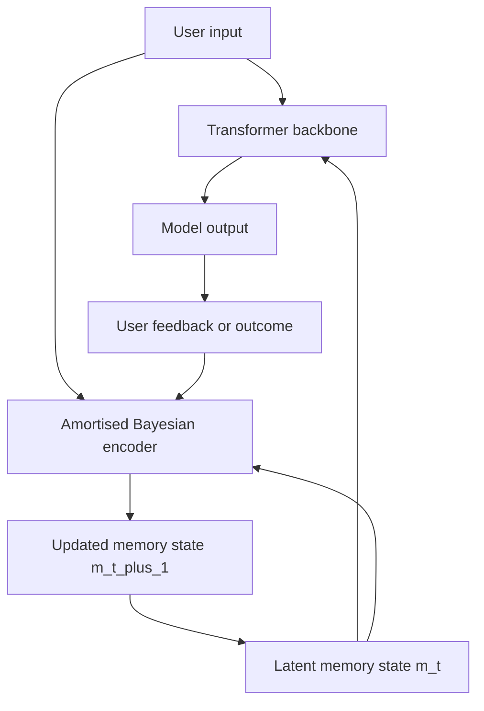

# BOLT: Bayesian Online Learning Transformer 调研备忘

> 调研时间：2026-07-14  
> 结论性质：公开资料检索 + 基于作者公开研究脉络的技术推断。由于未检索到 BOLT 原文，本文不会把 BOLT 描述为已公开发表的论文。

## TL;DR

以用户提供的题名 `BOLT: Bayesian Online Learning Transformer` 和作者组合（Ross M. Clarke、Yichuan Zhang、Jinli Hu、José Miguel Hernández-Lobato；Boltzbit / University of Cambridge）检索，目前没有找到可公开访问的论文页面、arXiv 记录、OpenReview 页面或作者主页条目。更合理的判断是：这篇文章可能是 Boltzbit 内部稿、尚未公开的预印本、会议投稿稿，或标题/作者 OCR 有误。

从作者公开论文与机构叙事看，BOLT 的研究思路大概率是：把 LLM 的个性化/在线适应从“上下文塞更多文本”或“在线微调权重”改成一个固定容量的 latent memory state；每轮前向后，用 amortised encoder 根据用户反馈更新这个 latent state，使其近似执行贝叶斯后验更新。它与我们方案的关系不是“谁替代谁”，而是一个可吸收的局部机制：BOLT 更像 `vz-memory` / `vz-temporal` 内部的候选在线更新算子；Volvence / EmoGPT 是更大的多时间尺度、双轨、契约式数字生命架构。

## 1. 原文检索记录

### 1.1 精确检索

检索关键词包括：

- `"BOLT" "Bayesian Online Learning Transformer"`
- `"Bayesian Online Learning Transformer" "Ross Clarke"`
- `"Bayesian Online Learning Transformer" "Boltzbit"`
- `"BOLT" "latent memory" "amortised encoder" "feedback"`
- `"Ross M. Clarke" "Yichuan Zhang" "Jinli Hu" "Hernández-Lobato"`
- `"Boltzbit" "transformer" "latent memory" "online learning"`

检索范围覆盖 arXiv、Google 搜索结果、José Miguel Hernández-Lobato 个人 publication page、ML Anthology、researchr、Boltzbit research page，以及相关题名片段搜索。

结果：没有找到与用户片段精确匹配的公开条目。

### 1.2 同名 BOLT / BolT 混淆项

公开检索中出现多篇名为 BOLT 或 BolT 的论文，但都不是用户提供的论文：

- `BolT: Fused Window Transformers for fMRI Time Series Analysis`：fMRI 时间序列 Transformer，作者与主题均不符。
- `BOLT: Bootstrap Long Chain-of-Thought in Language Models without Distillation`：长 CoT 训练方法，作者与主题均不符。
- `BOLT: Boost Large Vision-Language Model Without Training for Long-form Video Understanding`：长视频 VLM 帧选择方法，作者与主题均不符。
- `Basis-Oriented Low-rank Transfer for Few-Shot and Test-Time Adaptation`：低秩迁移 / test-time adaptation，题名缩写为 BOLT，但不是 Bayesian Online Learning Transformer。
- `Bootstrap Own Latent of Transformer`：医学图像 ViT 自监督学习，也不是用户片段所指。

### 1.3 判定

当前最稳妥结论：

- 这篇 `BOLT: Bayesian Online Learning Transformer` **尚未公开可检索**，或公开渠道未索引。
- 用户给出的片段存在明显 OCR/排版噪声，例如 `LL,Ms`、`undates`、`workfow`、`Cambndge`、`Hernández-Lobato`，说明来源可能是 PDF 截图、会议稿、内部文档或未正式发布页面。
- 不应把它归入任何已公开的同名 BOLT 论文。

## 2. 作者与机构画像

### 2.1 Ross M. Clarke

公开资料显示，Ross M. Clarke 曾在 Cambridge Machine Learning Group 与 José Miguel Hernández-Lobato 合作，公开论文主要集中在优化与高效更新：

- `Scalable One-Pass Optimisation of High-Dimensional Weight-Update Hyperparameters by Implicit Differentiation`，ICLR 2022。核心是通过隐式微分高效优化高维权重更新超参数。
- `Adam Through a Second-Order Lens`，NeurIPS Workshop 2023。把 Adam 放到二阶优化视角下理解。
- `Studying K-FAC Heuristics by Viewing Adam Through a Second-Order Lens`，ICML 2024。继续将 K-FAC / Adam / 二阶近似联系起来，研究近似曲率与优化启发式。
- `Series of Hessian-Vector Products for Tractable Saddle-Free Newton Optimisation of Neural Networks`，TMLR 2024。关注用 Hessian-vector product 级数让 saddle-free Newton 类方法更可行。

这些工作共同指向一个能力底色：如何把昂贵的学习 / 更新 / 二阶信息压缩成可计算、可摊还、可在线使用的更新机制。若他参与 BOLT，合理推断他会关心 latent memory update 的训练稳定性、近似二阶结构、隐式更新或元优化。

### 2.2 José Miguel Hernández-Lobato

José Miguel Hernández-Lobato 是剑桥机器学习领域长期从事贝叶斯机器学习、变分推断、贝叶斯优化、元学习和 probabilistic deep learning 的研究者。与 BOLT 最相关的公开线索不是某一篇同名论文，而是他的研究范式：

- 用神经网络摊还近似推断过程。
- 用分布式表示承载 posterior / uncertainty。
- 把 inference algorithm 本身学习成一个可前向执行的模型。

近期相关公开工作中，`Distribution Transformers: Fast Approximate Bayesian Inference With On-The-Fly Prior Adaptation` 尤其接近 BOLT 的思想背景。该工作使用 Transformer 做单次前向摊还推断，输入 prior 与 observations，输出同一分布族下的 posterior，并强调 sequential composition。它不是 BOLT，公开作者列表也不包含 Hernández-Lobato；这里将它作为“Transformer 作为摊还贝叶斯推断器”的相邻公开研究，而非 JMHL 组论文。

### 2.3 Yichuan Zhang 与 Jinli Hu

Yichuan Zhang 和 Jinli Hu 是 Boltzbit 创始团队核心成员。公开公司资料把 Boltzbit 定位为面向 “General Learning Intelligence” / “live-learning in production” 的企业 AI 研究公司，强调超越静态预训练模型，让模型在生产环境中持续适应。

Boltzbit research page 当前公开论文主题更偏 Boltzmann machines、MCMC、HMC 与采样 / 推断算法：

- `Continuous Relaxations for Discrete Hamiltonian Monte Carlo`，2022。
- `Quasi-Newton Methods for Markov Chain Monte Carlo`，2023。
- `A Gradient Based Strategy for Hamiltonian Monte Carlo Hyperparameter Optimization`，2025。

这些方向与 “Bayesian Online Learning Transformer” 的名字是相容的：Boltzbit 的公开叙事一直偏“生成模型 + 推断算法 + 在线学习”，而非单纯 prompt/RAG 工程。

### 2.4 机构线索：Boltzbit

Boltzbit 的公开叙事可以概括为三点：

- 认为传统 LLM 权重里编码了大量静态知识，但缺少随用户 / 业务上下文持续适应的能力。
- 借用 Boltzmann machine、MCMC、HMC、Bayesian inference 等更基础的学习 / 推断算法。
- 目标是可在生产环境 live-learning 的生成式模型，而不是只靠离线训练和上下文拼接。

这与用户提供的 BOLT 摘要开头高度一致：摘要明确说现有 LLM 的知识静态，不能长期适应用户 unique workflow and task contexts；BOLT 引入 latent memory state，并在每次 forward pass 由 amortised encoder 根据 user feedback 更新。

## 3. BOLT 可能的研究思路

以下是“基于公开线索 + 用户片段”的推断，不是原文复述。

### 3.1 关键机制拆解

**冻结或基本冻结的 Transformer 主干**  
BOLT 可能保留大模型作为表达与背景知识 substrate，避免每个用户 / 每轮反馈都在线更新全量权重。这样可以降低成本，并避免生产环境中持续微调导致的灾难性漂移。

**固定容量 latent memory state**  
用户片段明确提到 `latent memory state`。这说明 BOLT 不只是把用户历史塞进 context window，而是在模型内部维护一个连续潜变量，作为用户 / 任务上下文的压缩状态。

**amortised encoder 做在线更新**  
片段提到 `At each forward pass, an amortised encoder updates this latent memory based on the user's feedback`。这很关键：它不是通过梯度下降在 test time 慢慢调权重，而是学一个 encoder，把“旧 latent memory + 新输入 + 用户反馈”映射成“新 latent memory”。这就是把推断过程摊还进网络。

**贝叶斯解释：prior 到 posterior**  
如果题名中的 `Bayesian Online Learning` 是严肃命名，那么旧 memory 可以视为 prior / belief state，新反馈是 evidence，更新后的 memory 是 posterior approximation。amortised encoder 近似执行贝叶斯后验更新。

**长期个性化与 workflow adaptation**  
摘要强调适应用户 workflow and task contexts over time。BOLT 目标应该是用户级、任务级的长期适应，而不是单轮 benchmark reasoning。

### 3.2 可能的前向-反馈-更新回路

### 3.3 与相邻公开方向的关系

BOLT 的方向与以下公开研究邻近，但不等同：

- **In-context learning as Bayesian inference**：把 Transformer 的 ICL 解释成隐式贝叶斯推断。BOLT 可能把这种解释工程化为显式 latent state。
- **Distribution Transformers**：用 Transformer 做摊还 posterior mapping。BOLT 若存在，很可能把类似思想从静态数据集 posterior 推断扩展到交互反馈下的用户在线学习。
- **Continuous latent context / latent memory tokens**：用连续 latent context token 存储 online learning state。BOLT 的 latent memory state 可能属于这一族，但更强调 Bayesian update 与 user feedback。
- **Palimpsa / metaplastic attention memory**：用带不确定性的记忆更新缓解遗忘。BOLT 若是 Bayesian，就也可能有 uncertainty-aware plasticity，但公开片段不足以确认。

## 4. 与 Volvence / EmoGPT 方案的对比

### 4.1 我方方案的核心

根据 `docs/next_gen_emogpt.md`、`docs/specs/00_INDEX.md` 和 `docs/DATA_CONTRACT.md`，我们当前方案不是“给 LLM 加一个记忆模块”，而是一个有边界的持续适应系统：

- 核心产品是 relationship and subjectivity（EQ + trust），不只是 IQ 或任务性能。
- Prediction error / local surprise signal 是原始学习信号；evaluation 和 credit 是下游 readout / aggregation。
- 系统是 nested multi-timescale associative memory：`online-fast`、`session-medium`、`background-slow`、`rare-heavy` 分层更新。
- 冻结或稳定 substrate 与自适应 controller 分离；在线适应发生在 controller、memory、routing、reflection 等有界层。
- ETA 层维护 token 之上的 controller code `z_t` 与 switching condition `β_t`，长期策略学习发生在 latent control space，而不是 token 表达层。
- World/task 与 self/relationship 是两条不同 prediction space，有不同 memory、credit、controller update 与 evaluation。
- 跨模块通信遵守 snapshot-first / contract-first：每个 owner 发布不可变快照，消费者不重建生产者内部状态。
- Regime、语义 owner、relationship state 等都是持久可发布的 runtime state，不是 prompt label。

### 4.2 逐维对比

**适应机制**  
BOLT 侧重每次 forward pass 中用 amortised encoder 更新 latent memory，本质是“学会的后验更新器”。我方方案则把适应拆到多个 owner 与多个时间尺度：fast turn 内可更新控制器 / memory proposal，session 层聚合，background 层反思沉淀，rare-heavy 层才允许离线刷新 artifact。BOLT 更像一个紧凑算法核；我方更像一套完整适应治理结构。

**状态载体**  
BOLT 的核心状态是一个 latent memory state，优点是紧凑、连续、可微、token 成本低；风险是可解释性、边界与所有权需要额外设计。我方状态载体是多 owner snapshots + controller latent state + memory continuum。它牺牲一部分端到端简洁性，换取可检查、可回滚、可分权治理。

**学习信号**  
BOLT 片段说 based on user feedback，说明反馈是更新输入，但尚不清楚它如何区分任务错误、偏好变化、关系破裂、长期承诺失败等不同信号。我方把 prediction error 作为原始信号，并明确拆分 world/task 与 self/relationship 两条轨道，避免把所有反馈压成单一 reward 或单一 personalization state。

**时间尺度**  
BOLT 摘要强调 at each forward pass，属于 online-fast 的强机制。它可能能持续滚动更新，但是否有中期 consolidation、慢反思、rare-heavy artifact refresh，目前从公开片段看不出来。我方明确要求四级时间尺度，尤其强调慢整合不阻塞实时交互，快速适应不重写整个模型。

**模块边界与所有权**  
BOLT 如果只是单体模型架构，天然边界可能是 backbone、latent memory、encoder、decoder。但它不必然解决生产系统里的“谁拥有用户模型、谁拥有关系状态、谁发布可检查摘要、消费者能否直接读取内部隐变量”等问题。我方以 R8 / DATA_CONTRACT 为硬约束：跨模块只能读 immutable snapshot，谁拥有数据谁负责描述。

**目标函数与产品目标**  
BOLT 从摘要看主要解决 LLM 长期适应用户 workflow and task contexts 的问题，偏任务个性化 / 工作流学习。我方的目标更大：关系连续性、主体性、信任、social regime、repair、boundary consent 都是正式学习对象。换句话说，BOLT 更接近“Bayesian online personalization Transformer”；我方是“多时间尺度关系型数字生命系统”。

**可回滚与安全边界**  
BOLT 的 latent memory 如果直接影响输出，需要额外机制来审计和回滚某次用户反馈造成的状态变化。我方 R15 要求每个 adaptive layer 有 owner、exit condition、evaluation evidence 和 rollback path；这对产品化数字生命非常关键。

### 4.3 互补性判断

BOLT 不应被视为我们方案的替代品。它更适合作为我们内部某个 owner 的候选实现：

- 在 `vz-memory` 中，BOLT-like latent posterior memory 可以作为情景 / 用户工作流记忆的压缩 state，但必须由 memory owner 发布可解释 snapshot。
- 在 `vz-temporal` 中，BOLT-like amortised update 可以作为 `z_t` / `β_t` controller state 的在线更新算子，但不能绕过 temporal owner 或把策略学习拉回 token 空间。
- 在 `vz-cognition` 的 prediction-error / credit 链上，BOLT-like encoder 可以消费 typed prediction error，而不是直接吞原始文本反馈。
- 在 `vz-runtime` 中，它只能作为被编排的模块内部机制，不应成为跨模块共享的隐式全局状态。

最值得借鉴的是它可能提供一种“低成本、无在线梯度、固定容量、可训练”的 fast adaptation kernel；最需要避免的是把所有用户学习都塞进一个不可解释 latent vector，导致 owner 边界、关系轨道、慢反思与回滚能力消失。

## 5. 对我方的启示

**把摊还贝叶斯更新作为控制器/记忆内部算子候选**  
我们可以研究一个 `AmortisedBeliefUpdater`：输入上一版 owner state、typed prediction error、当前 evidence，输出新 owner-local latent state 与 public snapshot summary。关键是它必须在 owner 内部工作，不能成为跨模块黑箱。

**把固定容量 latent memory 用于 online-fast，而不是替代 CMS 全层记忆**  
BOLT 的固定容量 memory 适合高速适应和短期压缩，不适合承载所有长期社会事实。长期关系、承诺、边界、common ground 仍应进入对应 owner 的持久结构与慢反思路径。

**借鉴 uncertainty-aware update，而不是只学 point state**  
如果 BOLT 真是 Bayesian，它很可能不仅存状态均值，也存不确定性或可塑性信息。对我们来说，这可以帮助决定哪些记忆需要快速更新，哪些需要等待更多 evidence，哪些应进入 repair / clarification。

**用 Clarke 的优化脉络启发训练方法**  
隐式微分、二阶近似、K-FAC / Hessian-vector product 方向可以用于训练更新器本身：不是在线对大模型做梯度更新，而是在离线训练阶段学一个更稳定的 update rule。

**保持我方架构的范围优势**  
BOLT 解决的是“模型如何从用户反馈中在线学习”的核心技术点；我们还要解决“学什么、谁拥有、何时更新、如何解释、如何回滚、如何区分任务和关系”。这部分是 Volvence 方案相对单体模型论文的系统优势。

## 6. 可后续验证的问题

- BOLT 的 latent memory 是否包含 uncertainty / covariance，还是只是一个 deterministic hidden state？
- 用户反馈是显式 label、ranking、correction，还是从下一轮行为中提取 outcome？
- 更新是在每轮 forward 后持久化，还是仅在 session 内有效？
- 它是否区分 task memory、preference memory、relationship memory，还是统一进单个 latent memory？
- 它的训练目标是 next-token / supervised feedback / variational ELBO / online regret，还是混合目标？
- 是否有防止 stale feedback、恶意反馈、单轮误更新的 uncertainty gate？

这些问题若原文公开后需要重点核对，因为它们直接决定 BOLT 能否作为我方某个 owner 的内部更新器。

## 7. 参考链接

- Boltzbit Research: [https://www.boltzbit.com/research](https://www.boltzbit.com/research)
- Boltzbit company profile / live-learning narrative: [https://uk.linkedin.com/company/boltzbit](https://uk.linkedin.com/company/boltzbit)
- Ross M. Clarke publication list, ML Anthology: [https://mlanthology.org/authors/c/clarke-ross-m/](https://mlanthology.org/authors/c/clarke-ross-m/)
- Ross M. Clarke publication list, researchr: [https://researchr.org/alias/ross-m.-clarke](https://researchr.org/alias/ross-m.-clarke)
- José Miguel Hernández-Lobato publications: [https://jmhl.org/publications/](https://jmhl.org/publications/)
- `Studying K-FAC Heuristics by Viewing Adam Through a Second-Order Lens`, ICML 2024: [https://researchr.org/publication/ClarkeH24](https://researchr.org/publication/ClarkeH24)
- `Distribution Transformers: Fast Approximate Bayesian Inference With On-The-Fly Prior Adaptation`: [https://arxiv.org/html/2502.02463v3](https://arxiv.org/html/2502.02463v3)
- `Memory-Based Meta-Learning on Non-Stationary Distributions`: [https://arxiv.org/pdf/2302.03067](https://arxiv.org/pdf/2302.03067)
- `Continuous Latent Contexts Enable Efficient Online Learning in Transformers`: [https://arxiv.org/pdf/2605.09867](https://arxiv.org/pdf/2605.09867)
- `Learning to Remember, Learn, and Forget in Attention-Based Models`: [https://arxiv.org/pdf/2602.09075](https://arxiv.org/pdf/2602.09075)
- Volvence local design reference: `docs/next_gen_emogpt.md`
- Volvence local specs index: `docs/specs/00_INDEX.md`
- Volvence local data contract: `docs/DATA_CONTRACT.md`

