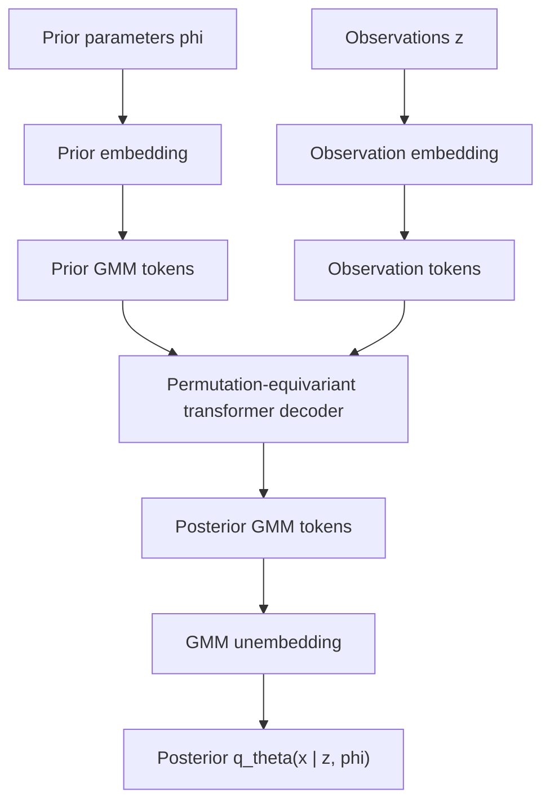

# Distribution Transformers 深入分析

> 论文：`Distribution Transformers: Fast Approximate Bayesian Inference With On-The-Fly Prior Adaptation`  
> arXiv：`2502.02463`  
> 作者：George Whittle, Juliusz Ziomek, Jacob Rawling, Michael A. Osborne  
> 机构：University of Oxford / Mind Foundry Limited  
> 调研时间：2026-07-14

## 0. 先纠正一个归因点

这篇公开论文的作者列表里**没有** José Miguel Hernández-Lobato。公开 arXiv 条目列出的作者是 George Whittle、Juliusz Ziomek、Jacob Rawling、Michael A. Osborne，机构是 Oxford Machine Learning Research Group 与 Mind Foundry。

它仍然和 Hernández-Lobato 相关的原因不是作者归属，而是研究范式相邻：它属于 amortised Bayesian inference、Transformer-as-inference-engine、posterior approximation 这一大脉络；这和 Hernández-Lobato 长期做的贝叶斯机器学习 / 摊还推断 / probabilistic deep learning 是同一技术版图。因此，在 BOLT 调研里把它作为“思想邻近论文”是合理的，但不能说成 “JMHL 组论文”。

## 1. 一句话概括

这篇论文的核心不是“用 Transformer 做贝叶斯推断”，而是把**分布本身 token 化**：把 prior 表示成一个 GMM component token 序列，用 Transformer decoder 结合 observations 做一次前向映射，输出同样是 GMM 形式的 posterior。因为 posterior 和 prior 属于同一表示族，它可以在下一步继续作为 prior 使用，从而支持顺序贝叶斯滤波。

## 2. 它要解决的问题

传统贝叶斯推断原则上很好：能表达 uncertainty，能把 prior knowledge 和 observations 合并成 posterior。但现实里有三个工程问题：

**精确 posterior 通常不可解**  
实际模型里后验很少有闭式解，只能用 MCMC、SVI、particle filter、normalizing flow 等近似方法。

**常规近似推断太慢**  
MCMC / VI / particle filter 在每个新任务、每组新数据、每个新 prior 下都要重新优化或采样。对实时 sensor fusion、在线滤波、快速 sensitivity analysis 来说，分钟级或秒级都太慢。

**现有 amortised inference 多数固定 prior**  
PFN / TabPFN 这类 Transformer-based amortised inference 可以一轮前向给 posterior-like output，但通常把 prior 固定在训练分布里。test time 改 prior 往往需要重训、微调，或把 prior 参数当 observation 塞进去，这不是结构化的 prior adaptation。

论文抓住的缺口是：我们需要一种模型，能在 test time 接受不同 prior，快速输出 posterior，并且 posterior 能自然变成下一步 prior。

## 3. 核心创新

### 3.1 prior-flexible amortised inference

普通 amortised Bayesian inference 学的是：

```text
observations -> posterior approximation
```

Distribution Transformer 学的是：

```text
prior + observations -> posterior approximation
```

更准确地说，它在训练时从 meta-prior `p(phi)` 里采样 prior 参数 `phi`，再采样 latent `x` 和 observation `z`。这样模型学习的不是某个固定 prior 下的 posterior update，而是一整个 prior family 上的 posterior update。

这个设计让 test time 可以 on-the-fly 改 prior，而不需要重新训练模型。

### 3.2 GMM 是统一分布接口

论文把 prior 和 posterior 都表示为 Gaussian Mixture Model：

```text
q(x) = sum_i w_i N(x; mu_i, Sigma_i)
```

这一步很关键，因为 GMM 有两个性质：

- 表达力强：足够多 component 时，可以近似很多连续分布。
- 天然可 token 化：一个 GMM 是若干 component 的无序集合，每个 component 有 weight、mean、covariance。

所以它可以把“一个分布”变成“一个 token sequence”：

```text
[(w_1, mu_1, Sigma_1), ..., (w_k, mu_k, Sigma_k)]
```

GMM component 的顺序不影响分布，因此模型必须保持 permutation equivariance。论文通过不加 positional encoding 来保持这一点。

### 3.3 Transformer decoder 做 distribution-to-distribution mapping

结构上可以拆成四块：

- **Prior embedding**：把 prior 参数 `phi` 映射成长度为 `k` 的 latent GMM token 序列。
- **Observation embeddings**：把 sensor reading、dataset、query point 等 observation 编成 observation token。
- **Transformer decoder**：prior tokens 之间 self-attention，同时通过 cross-attention 读取 observation tokens。
- **GMM unembedding**：把更新后的 latent component tokens 解码回 GMM 参数，得到 posterior mixture。

流程可以这样看：



### 3.4 近似共轭：posterior 可以继续当 prior

这篇论文最重要的工程特点是“same family in, same family out”：

```text
GMM prior -> GMM posterior
```

这构成一种近似共轭。严格贝叶斯里，共轭 prior 的好处是 posterior 和 prior 同族，可以递归更新。DT 用 GMM family 人工制造一个通用近似版本：

```text
p_t(x) as GMM
observe z_t
DT(p_t, z_t) -> p_{t+1}(x) as GMM
```

这样它就不是一次性 posterior estimator，而是可以做 filtering 的在线推断器。

这点把它和 PFN / TabPFN / 一般 SBI 模型区分开：很多模型能给单次 posterior，但输出不是可继续作为输入的 prior family，顺序推断就会退化成“把所有历史 observation 越堆越长”，计算会随时间增长。DT 的递归更新理论上可以做到每步常数级推断成本。

## 4. 训练目标

论文采用 sample-based training，不要求直接访问真实 posterior 密度。训练分布按层级生成：

```text
phi ~ p(phi)
x ~ p(x | phi)
z ~ p(z | x)
```

其中 `p(phi)` 是 meta-prior，也就是“训练时预期会遇到哪些 prior”的分布。

核心 loss 是负对数似然：

```text
E[-log q_theta(f(x) | z, phi)]
```

论文证明这个目标等价于最小化真实 posterior `p(x | z, phi)` 与近似 posterior `q_theta(x | z, phi)` 之间的 expected KL divergence，差一个与模型参数无关的常数。

另外它还加了 prior reconstruction / prior loss：

```text
E[-log q_theta(x | phi)]
```

这个 prior loss 有两个作用：

- 让 prior embedding 的 latent tokens 本身能被 unembedding 解码成 prior GMM。
- 让 pre-conditioning 和 post-conditioning 共享一个更一致的 latent distribution space，从而支持“posterior 再作为 prior”的递归使用。

所以这篇论文的训练目标不是普通 supervised label loss，而是“学一个可组合的 posterior update operator”。

## 5. 实验特点

### 5.1 解析后验验证

论文先用有闭式 posterior 的 inverse-gamma prior + normal-variance likelihood 验证：DT 确实学到了近似贝叶斯更新。

关键观察：

- narrow meta-prior 下，PFN 还能工作。
- wide meta-prior 下，PFN 因为没有显式 prior 输入，posterior 形状会失败。
- DT 在 wide / narrow 两种 meta-prior 下都能拟合 posterior，5-component GMM 接近真实分布。

这验证了 “prior-flexible” 是实质能力，不只是接口变化。

### 5.2 GP predictive posterior + hyperposterior

论文测试了带 hyperprior 的 Gaussian Process。这里不只是预测 `y`，还要推断 kernel hyperparameter 的 posterior。

常规方法会把 predictive posterior 和 hyperposterior 分开处理，或者依赖 MCMC / VI。DT 则把它们统一进一个 approximate posterior 任务，在 expected NLL 和 runtime 上都表现强。

这个实验说明 DT 不只是处理低维 toy posterior，而可以处理更接近科学计算和小数据建模的问题。

### 5.3 量子系统参数推断

论文还做了 quantum system parameter inference。它的价值在于：

- likelihood 涉及真实随机性和模拟。
- prior sensitivity analysis 很重要。
- 传统 SVI 需要随机估计 likelihood 相关项，速度和稳定性都受影响。

DT 在这里的意义是：离线训练后，test time 可以快速扫不同 prior / observation 组合，适合做快速 sensitivity analysis。

### 5.4 顺序推断：sensor fusion 与 stochastic volatility

这是论文最能体现差异的部分。

在 Bayesian sensor fusion 中，DT 和 particle filter 的 NLL 接近，但速度接近 EKF，远快于 particle filter。论文报告中，DT 对 100 series batch 的迭代时间约 `0.017s`，particle filter 约 `0.818s`，接近 50 倍差距。

在 factor-structure stochastic volatility 这种高维、稀疏信息、EKF 不适用的问题里，DT 能达到只有极大粒子数 PF 才能达到的精度区间，同时保留更低计算成本。

这说明 DT 的真正定位是：在非线性、非高斯、不适合 EKF、又不想承受 PF 成本的地方，用 learned posterior update 近似替代传统滤波器。

## 6. 论文的真正特点

**第一，它把 prior 当一等输入，而不是训练背景。**  
这和很多 PFN-style 方法不同。prior 不再是隐含在训练分布里的固定假设，而是 test time 可变的输入对象。

**第二，它把 posterior 输出设计成可递归的数据结构。**  
这是比“预测一个分布”更深的设计。posterior 不是终点，而是下一步 prior 的合法输入。

**第三，它用 GMM component token 让概率分布进入 Transformer。**  
这不是 token 文本，也不是 embedding memory，而是结构化 probability object。Transformer 在这里扮演“分布更新器”，不是语言模型。

**第四，它将摊还成本前移。**  
训练阶段覆盖 meta-prior / likelihood family，推断阶段从分钟级优化/采样变成毫秒级前向。这是典型 amortisation tradeoff：前期训练贵，长期重复使用便宜。

**第五，它适合明确建模的连续 latent variable 问题。**  
它的优势场景是 sensor fusion、filtering、scientific inference、small-data Bayesian posterior、hyperparameter posterior 等，不是开放域语言生成。

## 7. 局限与风险

**meta-prior 必须覆盖未来任务。**  
DT 的泛化来自训练时采样的 prior family。如果 test time prior 严重 out-of-support，posterior update 质量会下降。论文做了 meta-prior misspecification ablation，但这仍是核心风险。

**GMM 在高维空间成本高。**  
full covariance 的参数量随 latent dimension 二次增长；component self-attention 随 component 数量二次增长。论文也承认 dominant memory cost 来自 full-covariance decoding。

**连续分布友好，不天然适配离散语义状态。**  
人类关系、承诺、边界、信任修复这类状态不是天然的低维连续随机变量。若要接入，需要先定义 owner-local latent variables 和 observation model，不能直接套 GMM。

**递归误差会累积。**  
posterior 反复作为 prior 使用时，每一步近似误差都会被带到下一步。论文说中等长度下误差较小，但长生命周期 agent 的多年记忆不是它已验证的场景。

**它不是 LLM 个性化系统。**  
DT 没有处理自然语言反馈解析、用户偏好归因、关系轨道、长期 memory governance、恶意反馈等产品问题。

## 8. 与 BOLT 推断路线的关系

如果 BOLT 真如片段所说，是一个带 latent memory state 的 Bayesian Online Learning Transformer，那么 Distribution Transformer 可以看作它的“数学邻居”：

- DT：显式 prior distribution + observation -> explicit posterior distribution。
- BOLT：可能是 latent memory prior + user feedback -> updated latent memory posterior。

两者都反对“test time 重新优化大模型权重”，都倾向于把更新规则 amortise 成一次前向。但差别很大：

- DT 的 state 是显式 GMM 分布，有权重、均值、协方差。
- BOLT 的 state 可能是隐式 latent memory vector，不一定可解释为显式概率分布。
- DT 的 observation model 通常是明确的科学 / filtering 任务。
- BOLT 的 feedback 来自用户交互，语义更复杂，噪声和归因问题更大。
- DT 追求近似共轭和递归滤波。
- BOLT 可能追求长期个性化和用户 workflow adaptation。

因此，DT 对 BOLT 最有价值的启发是：不要只说 latent memory update 是 Bayesian，要让 memory 的 prior/posterior 结构、uncertainty、递归组合性尽量显式化。

## 9. 与 Volvence / EmoGPT 的关系

DT 很值得我们借鉴，但不能直接替代我们的架构。

### 9.1 可借鉴点

**owner-local posterior update**  
我们可以把 DT 思路抽象成某些 owner 内部的 belief updater：输入 owner 当前 belief distribution、typed evidence / prediction error，输出新的 belief distribution。

适合候选：

- `prediction_error` owner 的 uncertainty readout。
- `world_temporal` 中对任务环境状态的 belief update。
- `self_temporal` 中对关系趋势的低维 latent belief update。
- `user_model` / `relationship_state` 的某些连续维度，例如信任、稳定偏好强度、承诺可靠性。
- `environment_interface` 中对外部环境隐状态的 filtering。

**posterior-as-next-prior 的递归接口**  
这和我方多时间尺度学习很契合。每个 owner 的当前 snapshot 可以看作 public posterior summary；下一轮 evidence 进入 owner 后，owner 内部做 posterior update，再发布新 snapshot。

**uncertainty 显式化**  
DT 的 GMM 表示天然带 uncertainty。对我们来说，uncertainty 不是附属指标，而应影响记忆写入、credit 强度、repair 触发、是否需要 clarification。

**低成本 online-fast 更新**  
DT 展示了“昂贵训练离线完成，在线只做一次前向”的路径。这与我们 R2 的稳定 substrate + adaptive controller 方向一致：在线不要改大模型，而是在有界 owner / controller 层做快速更新。

### 9.2 不能直接照搬的地方

**不能把所有语义状态压成一个 GMM。**  
Volvence 的 R8 / R11 要求状态有 owner、可命名、可发布。关系、承诺、边界、common ground 不能被一个全局 latent distribution 吞掉。

**不能跳过 typed evidence。**  
DT 的 observation 是模型定义清楚的数据；我们的 user feedback 需要先经过感知、语义 proposal、prediction error attribution，再进入对应 owner。不能把原始对话文本直接当 observation 喂给一个黑箱 updater。

**不能让 updater 成为第二 owner。**  
如果引入 DT-like updater，它只能是 owner 内部算法。跨模块仍然只读取 immutable snapshot，不能读取 updater 的内部 hidden state。

**不能只优化 posterior likelihood。**  
我们的目标不只是任务 posterior 准确，还包括 relationship continuity、repair、boundary consent、长期信任、regime 稳定性。DT 的 expected NLL 是很好的 inference metric，但不足以覆盖数字生命产品目标。

### 9.3 最合理的接入形态

如果未来要引入 DT-like 技术，我建议不是做一个全局 `DistributionTransformerModule`，而是定义一个可注入的 owner-local update kernel：

```text
OwnerSnapshot_t
TypedEvidence_t
PredictionError_t
    -> owner-local posterior state
    -> OwnerSnapshot_t_plus_1
```

其中 posterior state 可以在 owner 内部是 GMM / mixture / ensemble / latent distribution，但发布给其他模块的仍然是 owner 负责描述的不可变 snapshot。

## 10. 对我们当前研究路线的判断

Distribution Transformer 证明了一件很重要的事：Transformer 不一定只是 text generator，也可以是 learned Bayesian update operator。它把“学习到的推断算法”做得非常清楚：输入是 prior 与 evidence，输出是 posterior，而且输出可递归。

这对我们方案是强支持，而不是竞争：

- 支持 R2：在线适应应发生在有界控制器 / 记忆层，而不是改大模型权重。
- 支持 R1：fast update 可以是摊还推断，slow update 可以训练 / 校准 updater。
- 支持 R-PE：evidence 与 prediction error 应成为 posterior update 的输入。
- 支持 R8：posterior state 必须有 owner，跨模块看 snapshot。
- 支持 R3/R4：内部 latent state 可以承载控制与 belief，不必外化成 token。

但它也提醒我们：如果我们只说“latent memory / belief state”，而不定义 prior、evidence、posterior、uncertainty 和递归接口，就会停留在概念层。DT 的价值在于它把这些概念落成了可训练、可评估、可递归的概率对象。

## 11. 后续可跟进问题

- 是否能把 DT 的 GMM 表示替换成更适合语义状态的 mixture of structured beliefs？
- 是否能把 prediction error 显式作为 observation token，而不只是原始 observation？
- 是否能让 owner snapshot 同时发布 human-readable description 与 machine-readable uncertainty？
- 是否能为 relationship_state / user_model 定义低维 latent variables，使 DT-like updater 有合法建模对象？
- 是否能用 DT-like updater 做 SHADOW 路径，与现有启发式/规则式 owner update 并跑比较？
- 是否能把 slow reflection 的输出作为 meta-prior 调整，而不是直接写快层状态？

## 12. 参考链接

- arXiv abstract: <https://arxiv.org/abs/2502.02463>
- arXiv HTML: <https://arxiv.org/html/2502.02463v3>
- OpenReview page: <https://openreview.net/forum?id=bMHwh8qAGc>
- Code repository: <https://github.com/GWhittle110/distribution-transformers>
- Related: `Transformers can do Bayesian inference` / PFNs: <https://arxiv.org/abs/2112.10510>
- Related: `Can Transformers Learn Full Bayesian Inference in Context?`: <https://arxiv.org/abs/2501.16825>
- Local context: `research/bolt-bayesian-online-learning-transformer.md`
- Local design reference: `docs/next_gen_emogpt.md`
- Local contract reference: `docs/DATA_CONTRACT.md`
