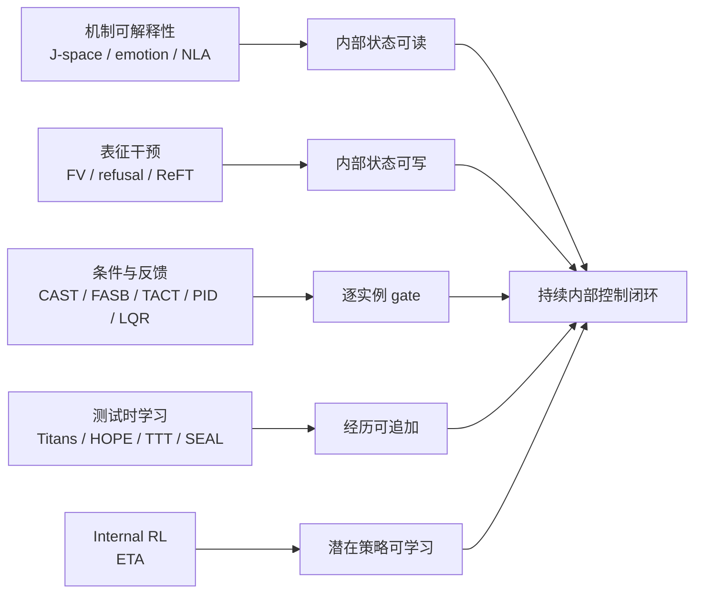

# 01 · 领域地图：业界已经走到哪一步

## 1. 总体收敛

2024–2026 的工作形成了四条从不同方向汇合的路线：

每条支路都已有强局部结果，但汇合点仍空缺。最常见的断链是：

- readout 没有真实 causal authority；
- steering gate 不从 outcome 学；
- memory update 只优化 token loss，不处理真实行动后果；
- online learning 修改基底权重，失去局部回滚和删除能力；
- 结果只在单次 episode 或 benchmark 中成立，没有跨 session 恢复。

## 2. 路线 A：从“能 probe”到内生工作空间

### A1. Function Vectors：任务函数可压成因果向量

ICLR 2024 的 Function Vectors 用 causal mediation 找到少量 attention heads 搬运的紧凑任务表示。
提取后的向量可在 zero-shot 和不同自然文本上下文中触发任务，说明模型内部不只是编码内容，也编码
“应该执行哪种函数”。这是 Readable→Steerable 的早期强证据。

边界在 2026 年被进一步钉死：ICLR 2026 的 **Causality ≠ Invariance** 发现，同一个概念在
open-ended 与 multiple-choice 等不同格式下提取的 Function Vectors 近乎正交。因果有效不等于表示不变。
作者用跨格式 representational similarity 选 heads 得到 Concept Vectors，跨格式与语言更稳。

对 Volvence 的含义：

- readout artifact 必须绑定 format/domain/language/model/layer；
- “在当前 heldout 可读”不能授权跨域 consumer；
- 选 reader heads 时，应加入跨视图一致性目标，而不只最大化同域 accuracy。

来源：[Function Vectors, ICLR 2024](https://proceedings.iclr.cc/paper_files/paper/2024/hash/4ae163cb8788970e53b4fd9578141139-Abstract-Conference.html)、
[Causality ≠ Invariance, ICLR 2026](https://proceedings.iclr.cc/paper_files/paper/2026/hash/86b3697c4eb7792c951831636bfdacd5-Abstract-Conference.html)。

### A2. J-space：最接近“模型自己使用内部控制面”

Anthropic 2026 的 Jacobian lens 不只训练一个相关 probe，而是估计中间 activation 对未来 token 的
平均线性化因果作用，并识别一个稀疏、可言说的 J-space。论文报告的关键性质是：

- **reportable**：可读出模型准备言说的概念；
- **directed modulation**：模型能按指令把概念调入 workspace；
- **causally used**：把 `spider` 坐标换成 `ant`，输出从 8 变 6；两跳中间概念 swap 在
  Haiku/Sonnet/Opus 4.5 上 top-1 成功率为 54%/70%/70%；
- **flexibly reused**：同一国家表示可被 capital/language/continent/currency 等下游函数消费；
- **selective**：通常最多约 25 个活跃概念，解释的总 activation variance 不超过 10%；重度 ablation
  把受控多跳推理降到接近零，但大量浅层任务和流畅性相对保留。

这是当前最强的 IC-2 证据：控制表征不是纯外接插件，模型内部原本就在调用它。

仍缺：跨 session 持久性、关系状态绑定、多 token/关系结构的完整读出、PE 学习和 open-weight
跨家族复现。论文自己也指出，概念 bag 不表达绑定关系，且并非每个位置都可解释。

来源：[Verbalizable Representations Form a Global Workspace](https://transformer-circuits.pub/2026/workspace/index.html)。

### A3. Emotion Concepts 与 Persona Vectors：关系域的最近邻

Emotion Concepts 在 Claude Sonnet 4.5 上识别 171 个情绪概念方向，发现 valence/arousal 几何、
speaker-distinct representation 与对偏好、alignment 行为的因果作用。它对关系智能很相关，但作者明确说
这些方向主要表示当前语境中 operative emotion concept，而非一个持续维持的角色内在情绪状态。

Persona Vectors 在 Qwen2.5-7B 和 Llama-3.1-8B 上显示，sycophancy、hallucination、evil 等方向既能
监控部署期波动，也能预测和缓解 fine-tuning 后的人格漂移。

两者共同证明“人格/情绪不是只能在文本表面测”，却不能证明：

- 这些方向就是用户或模型的真实心理状态；
- 局部 activation 等于跨 session relationship state；
- 自动 judge 测得的 trait change 能成为学习 reward。

来源：[Emotion Concepts](https://transformer-circuits.pub/2026/emotions/index.html)、
[Persona Vectors](https://arxiv.org/abs/2507.21509)。

### A4. Natural Language Autoencoders：命名读出的新路线

Natural Language Autoencoders 用 activation verbalizer 把内部激活压成自然语言描述，再由 activation
reconstructor 从描述重建激活，以 cycle/reconstruction 目标无监督训练。它比固定标签 probe 更适合发现
未预设状态，但其文本解释首先是压缩码，不自动是真实语义或 owner state。

对 Volvence 的正确位置是：**readout proposal generator**。NLA 可以提出候选命名，正式 owner 必须再用
冻结 heldout、因果 patch、跨格式校准和 snapshot lineage 验证；NLA 文本不得直接进入 credit。

来源：[Natural Language Autoencoders](https://transformer-circuits.pub/2026/nla/index.html)。

## 3. 路线 B：从静态向量到学习式执行器

### B1. 单方向因果控制是真实的，但只在部分行为上简单

- ICLR 2024 Function Vectors：任务函数的紧凑因果表示；
- NeurIPS 2024 Refusal Direction：13 个开源 chat model、最高 72B 中，单一方向可抑制或诱发拒绝；
- Persona / emotion vectors：人格和情绪概念方向可改变复杂行为。

这些结果证明某些控制面近似低维，但也暴露安全问题：如果安全行为被单方向承载，它同样容易被 rank-one
删除。低维可控性既是产品机会，也是 attack surface。

### B2. ReFT：从手工方向升级为学习式低秩干预

LoReFT 在冻结基底上学习低秩 representation intervention，在常识、算术、instruction tuning 与 GLUE
上报告比 LoRA 高 15–65 倍的参数效率。它说明 executor 不必依赖“正负均值差”或 probe 轴，可以直接在
heldout 目标上学习一个低秩、位置选择性的写算子。

Volvence 已采用的 rank-8、no-free-bias、zero-code noop 思路与其同属一族，但我们的额外约束是：

- norm cap；
- reader/executor lineage 一致；
- strict noop；
- gate 与 executor 分 owner；
- learning 只能来自 PE/credit，不可直接把 judge loss 当长期 reward。

来源：[ReFT, NeurIPS 2024](https://proceedings.neurips.cc/paper_files/paper/2024/hash/75008a0fba53bf13b0bb3b7bff986e0e-Abstract-Conference.html)。

## 4. 路线 C：条件、逐实例与反馈控制

### C1. CAST：条件 gate 已成为标准强基线

CAST 读取 prompt activation 的 condition vector，满足相似度规则时才施加 behavior vector。它证明
reader 与 executor 可分离，且 selective intervention 比 indiscriminate steering 更接近部署。

它仍是静态规则：阈值和条件由离线数据选择，不从终局 PE 在线学习。因此它应是 Volvence 的
`static-gate` 对照臂，而不是 Learnable 的完成证据。

来源：[IBM CAST, ICLR 2025](https://research.ibm.com/publications/programming-refusal-with-conditional-activation-steering--1)。

### C2. FASB：必要性、强度与 backtracking

FASB 在生成中持续读取内部状态，动态判断是否干预及干预强度；检测到偏移后会回退并重生成，因为在错误
token 已输出后才加方向往往太迟。它把 Steerable 从 turn-level gate 推到 token/trajectory-level control。

可借的是状态机和“延迟检测需要 rollback”的工程思想；不可直接借的是其任务分数与 gating 目标，后者并非
Volvence 的 PE-only 信用链。

来源：[FASB, NeurIPS 2025](https://papers.neurips.cc/paper_files/paper/2025/hash/0c6c92a0c5237761168eafd4549f1584-Abstract-Conference.html)。

### C3. TACT：最接近真实 agent 终局的 Read→Gate→Write

TACT 在 coding agent 长轨迹中把步骤标为 calibrated / overthinking / overacting，从 residual 读出两个
drift axes（AUC 约 0.9），只对漂移步骤回拉。在 SWE-bench Verified、Terminal-Bench 2.0、CLAW-Eval 上，
Qwen3.5-27B 平均 resolve rate 提升 5.8 个百分点，Gemma-4-26B-A4B-it 提升 4.8 个百分点，
steps-to-resolve 最多下降 26%，且不增加 LLM 调用、prompt token 或重试。

它是 M3 级强证据，但不是 M4：drift 标签与方向离线构造，没有 outcome→PE→credit→gate 的持续更新，
也没有跨 episode 记忆。

来源：[TACT](https://arxiv.org/abs/2605.05980)。

### C4. 逐实例多层 steering：固定层假设开始被淘汰

2026-08 的 Deployable Per-Instance Multi-Layer Activation Steering 显示最佳注入层随输入变化；固定全局层
无法恢复逐实例 oracle 的收益。其无标签部署配方包含 prompt-conditioned layer ranker、方向分类器和
adaptive-K gate：在六个 persona trait 上恢复 exhaustive steerable lift 的均值约 93%（Llama-3-8B）和
65%（Aya-Expanse-8B），方向预测与 gold 不一致约 3.4%，两模型每个 cell 的平均净效应仍为正。

论文还展示过量全局选层会把 already-correct 输入翻错，甚至进入 content-free attractor；主要问题是
方向而非单纯 magnitude。对 Volvence，这是 2026-08 最直接的新工程启示：

- gate 不应只输出 `{noop, steer}`，长期可能需要输出 layer subset / dose；
- 但扩 action space 前，先证明当前 substrate 有 authority；
- layer ranker 只能作为 frozen proposal，在线学习仍由 PE-credit owner 约束。

来源：[Deployable Per-Instance Multi-Layer Activation Steering](https://arxiv.org/abs/2608.08829)。

### C5. PID / Activation-LQR：steering 正在变成控制理论问题

PID Steering 把常见 steering 解释为 P controller，再加入跨层累计误差与变化率项；Activation-LQR 则把
transformer layers 建模为局部线性时变系统，用 layer Jacobian 和 LQR feedback 追踪 semantic setpoint，
并给出 tracking error 分析。

这条路线对 boundedness、overshoot、stability 和 dose schedule 很有价值，但其“error”通常是到语义
setpoint 的几何误差，不是用户行动后的 Prediction Error。它能改善 executor/controller 数学，不能替代
Learnable 的信号合法性。

来源：[PID Steering](https://arxiv.org/abs/2510.04309)、
[Activation-LQR](https://arxiv.org/abs/2604.19018)。

## 5. 路线 D：经历写进内部状态

### D1. Titans / ATLAS / Nested Learning / HOPE

Titans 把 neural memory 作为运行时可更新的长期记忆，以新输入和当前记忆的 mismatch/surprise 驱动写入；
公开实验扩到超过 2M context。ATLAS 增强容量、历史窗口和 memory management，在 BABILong 10M context
报告超过 80% accuracy。Nested Learning 把模型写成多个不同频率、各有 context flow 的嵌套优化问题，
提出 Continuum Memory System、自修改 Titans 与 HOPE。

这条线为“多时间尺度内部状态”和“误差驱动写入”提供了强架构同构，但其 surprise 主要是 memory-local
prediction mismatch，目标多为 language modeling / long-context recall；它不等价于行动后真实 N+1 PE，
也没有 world/self owner、删除、consent 或关系连续性。

来源：[Titans](https://arxiv.org/abs/2501.00663)、[ATLAS](https://arxiv.org/abs/2505.23735)、
[Nested Learning, NeurIPS 2025](https://proceedings.neurips.cc/paper_files/paper/2025/hash/4309616aaed8e848009bc4a7ef73b493-Abstract-Conference.html)。

### D2. TTT-E2E：快权重有效，但精确记忆不能被压缩替代

TTT-E2E 在测试时用 next-token prediction 更新最后 1/4 blocks 的 MLP，把当前 context 压进权重。
3B 模型训练 164B tokens，在 128K context 的 latency 比 full attention 快 2.7 倍；但 exact pass-key
NIAH 在 128K 上为 0.06，而 full attention 为 0.99。

它同时提供正负两条证据：局部快层确实能“focus on the present”，但压缩型 parametric memory 不能替代
exact episodic storage。Volvence 应保留 CMS strata 与显式检索，不把一个 neural memory 当万能容器。

来源：[TTT-E2E](https://test-time-training.github.io/e2e.pdf)。

### D3. SEAL：自编辑可学，但写权重代价高

SEAL 让模型生成自己的训练数据和更新指令，再以更新后下游表现训练 self-edit policy。它证明“学习如何
学习/编辑自己”可产生显著任务增益，但每次编辑评估约 30–45 秒，重复编辑仍有遗忘；其 reward 来自下游
performance，且写入基底/adapter 权重，不符合 online-fast 冻结基底与单字段回滚约束。

来源：[SEAL, NeurIPS 2025](https://papers.neurips.cc/paper_files/paper/2025/hash/6b41e04c41726e2a60e456d0a2b961ab-Abstract-Conference.html)。

## 6. 路线 E：潜在控制器学习

ETA 在冻结自回归模型上增加 higher-order non-causal sequence model，控制基底 residual stream；其内部
controller 压缩长 activation chunks，并学 termination condition。直接在 controller latent 上做 Internal RL，
能在 gridworld 和 MuJoCo 分层任务的 sparse reward 下学习，而标准 token/action-space RL 失败。

它是 Learnable+Steerable 的最近邻，但仍有三条距离：

1. 环境是受控仿真，不是自然语言关系或真实 coding workflow；
2. reward 是外部 sparse task reward，不是 PE-only；
3. 没有跨 session Appendable、owner snapshot 与 production rollback。

来源：[Emergent Temporal Abstractions](https://arxiv.org/abs/2512.20605)。

## 7. 负面结果正在重塑行业上限

| 负面结果 | 说明 | 对我们的硬约束 |
|---|---|---|
| Steering off Course | 最多 36 模型、14 家族中效果高度不稳定，常无增益甚至退化 | 任一 artifact 都必须 model/version bound，不许宣称 universal vector |
| Understanding (Un)Reliability | 单样本常出现反向作用；方向一致性与类别可分性预测成功 | precheck 必须在训练 executor 前，不是失败后解释 |
| Causality ≠ Invariance | 同一概念的 causal FV 可因输入格式而近正交 | readout 必须跨视图测试和标注 lineage |
| FaithSteer-BENCH | 固定部署 operating point 下出现虚假可控、能力税和轻微扰动脆弱性 | promotion 同时过 controllability / utility / robustness 三门 |
| Per-instance steering | 固定全局层破坏 already-correct 样本，过量可输出坍塌 | layer/dose 应逐实例，strict noop 是主能力 |
| Forecasting Side Effects | 67 行为、3 模型中副作用常见、有结构且不对称 | side-effect matrix 前置到 ACTIVE 审计 |
| CL-Bench | 六个真实 stateful domain 中 naive ICL 胜过专用 memory | memory-only 必须是被挑战者，不能默认有益 |
| TTT-E2E NIAH | parametric compression 的 exact recall 严重失败 | exact/episodic 与 compressed/semantic memory 分层 |
| Spurious Forgetting | performance drop 常是 alignment 失活而非知识删除；冻结底层显著恢复 | 先诊断“不会”还是“不能调用”，再决定重写记忆 |

来源见 [`08_SOURCE_LEDGER.md`](08_SOURCE_LEDGER.md)。

## 8. 行业成熟度结论

按 IC-0→IC-4 分级：

| 能力 | 成熟度 | 判断 |
|---|---|---|
| IC-0 相关可读 | 研究成熟 | 多行为、多模型、工具链丰富；仍有标注/校准问题 |
| IC-1 外生因果写入 | 研究成熟、部署不稳 | 因果性无疑，普适性与副作用未解决 |
| IC-2 内生工作空间 | 强新证据、待复现 | J-space 是突破，但集中于 Claude 与单次前向 |
| IC-3 条件反馈控制 | 快速工程化 | static gate、逐 token、逐实例层选择和反馈控制均已出现 |
| IC-4 持续学习闭环 | 开放问题 | 没有公开工作同时闭合长期记忆、合法信用、逐实例控制和真实结果 |

这意味着竞争窗口仍存在，但窗口已经从“发现 activation steering”移动到“证明受治理的长期闭环”。
