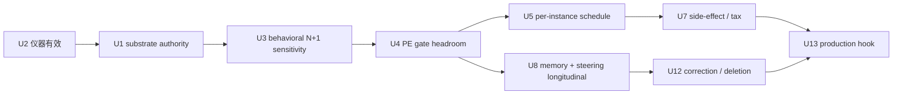

# 03 · 尚未解决的问题：优先级、owner 与决定性实验

## 1. 排序原则

优先级不是按论文热度，而按“若不解决，后续投入是否失去因果意义”排序：

1. 上游 substrate authority 与仪器效度；
2. 信用是否能看到干预；
3. 逐实例控制是否胜过静态基线；
4. 长期写入是否有净增益；
5. 工程与安全能否晋升。

`P0` 表示不通过就不应继续扩大模型或策略；`P1` 表示闭环主张必须解决；`P2` 表示性能和规模化问题。

## 2. 总表

| ID | 优先级 | 未解问题 | 当前 Volvence 证据 | 最相关外部工作 | 唯一 owner / 主域 |
|---|---:|---|---|---|---|
| U1 | P0 | substrate 是否真的能应用已知策略 | P1k-R1 12/12 valid，0.50 accuracy，0 pair-flip，FAIL | J-space swap、ReFT、TACT | `vz-substrate` |
| U2 | P0 | readout 是否有分辨力、因果性与跨视图稳定性 | v1 d=0.315 失准；v2 d=0.592 登记，formal 未出 | J-space、Concept Vectors、reliability studies | substrate residual + cognition sensor |
| U3 | P0 | N+1 PE 是否对用户可见干预敏感 | C1 契约完成；C3 表示面未完成，behavioral outcome 未证 | TACT、PID/LQR、CL-Bench | PE owner / `vz-cognition` |
| U4 | P0 | gate 是否在合法信用上有可学习 headroom | S3-A/E 代理 PASS；对话域未 PASS | ETA、CAST、per-instance gate | `vz-temporal` gate |
| U5 | P1 | 最佳 layer/direction/dose 是否逐实例变化 | 当前 artifact 固定 layer/geometry | Per-instance steering、FASB | sensor→gate→executor 三 owner |
| U6 | P1 | control 是否跨模型/版本/格式保持 | artifact 有 lineage，缺系统迁移证据 | Causality ≠ Invariance、Steering off Course | artifact publishers |
| U7 | P1 | steering 副作用和能力税能否预测/约束 | 有 norm/noop/safety 门，缺 cross-effect formal | Side Effects、FaithSteer-BENCH | evaluation readout + ModificationGate |
| U8 | P1 | memory 写入何时有益、何时污染 | CMS 可运行；多频净增益与强基线优势未证 | CL-Bench、Outlandish、Titans | `vz-memory` |
| U9 | P1 | exact memory 与 compressed memory 如何协同 | CMS 分层存在，行为级分层优势未证 | TTT-E2E、Titans/ATLAS | `vz-memory` + substrate carriers |
| U10 | P1 | 局部 emotion/persona 如何变成持久关系状态 | 9 类 owner 存在；Readable/人类锚未过 | Emotion Concepts、Persona Vectors | relationship semantic owner |
| U11 | P1 | delayed credit 如何处理真实异步 outcome | C1 terminal settlement 有契约；真人 outcome qualification 未过 | ETA、CL-Bench | PE→credit owner |
| U12 | P1 | 删除、冲突、更正是否真的改变后续行为 | P4.2 机械闭合；行为价值未证 | CL-Bench、unlearning 反例 | memory / semantic owner |
| U13 | P1 | production hook 是否保持证据链 | transformers SHADOW；vLLM ACTIVE 明确不支持 | vllm-lens、Goodfire、pyReFT | `vz-substrate` + runtime |
| U14 | P2 | 多个控制概念如何组合而不互相污染 | 未形成 formal | Persona algebra、cross-effect matrix | executor artifact owner |
| U15 | P2 | activation harvest / second forward 的成本是否可接受 | 尚无正式 SLO | Goodfire、vllm-lens | substrate/runtime |

## 3. P0：先解决，否则不要扩策略

### U1 · substrate control authority

**问题。** 已知正确策略被明示后，目标基底是否能把它变成不同动作？P1k-R1 的答案目前是否定的：
策略披露并未引起 pair-flip。这可能意味着模型容量、提示/残差入口、动作解码或读出目标不对。

**为什么比 gate 更上游。** 如果 oracle condition + oracle policy 都不能改变 action，学习 gate 只是在学何时
调用一个无效 actuator。

**外部可用证据。** J-space 的 intermediate swap、ReFT 的学习式低秩 intervention、TACT 的真实 agent
drift correction 提供三种不同 actuator 参照。

**决定性实验。** 同一模型、同一 prompt、同一样本、同一生成预算，冻结四臂：

1. strict noop；
2. disclosed text policy；
3. oracle condition + learned bounded residual executor；
4. direct target-state patch / causal upper bound。

主判据必须是 paired action flip、目标 action probability、N+1 outcome；内部投影只作诊断。

**Kill condition。** 第 4 臂在两个可控合成任务上仍无显著 causal effect，则停止该模型/层的 gate 与 memory
联调，回到 substrate/model-capacity 或 action decoder owner。

### U2 · readout validity 与 invariance

**问题。** 一个高 accuracy probe 可能只读到格式、标签泄漏、共模方向或输出准备，而不是目标控制状态。

**外部警告。** Function Vector 跨格式近正交；steering reliability 研究显示 direction coherence 和 class
separation 才预测可控性；J-space 也只覆盖少量可言说内容。

**决定性实验。** 对同一 latent condition 建立至少四个 view：paraphrase、question format、language、
surface-order；冻结 train view，其他 view 只做 heldout。比较：linear probe、diff-of-means、RSA-selected
Concept Vector、J-lens-like token readout。报告：

- same-vs-diff Cohen's d；
- calibration / ECE；
- direction coherence；
- cross-view retrieval；
- causal patch sensitivity；
- already-correct damage。

**Kill condition。** 只有同 view accuracy、跨 view 近 chance，则将 readout 标为 domain-local，不得承担正式
semantic owner 或跨 session policy input。

### U3 · N+1 PE 的行为敏感性

**问题。** 当前 C3 定义首先比较 action/noop 后的下一轮表示 MSE。它能证明 representation alignment，
但除非 steering 确实改变用户可见生成并由真实下一拍响应，否则不能证明 behavioral control。

**决定性实验。** 对同一真实 turn 运行 matched steer/noop，分别记录：

1. intervention 后当前 response 的 action-level 差异；
2. 下一轮真实 observation；
3. frozen N+1 representation target；
4. external mechanical outcome（若领域有 oracle）；
5. 人类锚只读评价。

要求 PE improvement 与至少一个 action/outcome 差异有稳定条件关联，但不把 human/judge 分数回灌。

**Kill condition。** PE 可改善而行为完全不变，或行为改善与 PE 方向长期相反：将该 head 降级为
representation-only diagnostic，另立 behavioral prediction head，不得修改现有记录掩盖分歧。

### U4 · PE-learned gate headroom

**问题。** always-on executor 若已近最优，gate 没有可学余量；executor 若本身无效，gate 也无意义。

**外部参照。** CAST 是 static gate；per-instance steering 显示 saturated/already-correct 输入上 noop 很重要；
ETA 证明 latent policy 可从 sparse reward 学习。

**决定性实验。** 在 U1/U3 通过后，比较：noop、always-on、CAST/static threshold、random-gate、
PE-learned gate、oracle gate。所有臂共享 reader/executor/norm/预算，只有 gate 不同。

**Kill condition。** oracle ≤ always-on 或 oracle-vs-static 无 headroom，则不训练 learned gate；先重构任务分布
或 executor。PE-learned 连续多 seed 不胜 static，则保留 static baseline，不以“在线”之名晋升。

## 4. P1：完整闭环必须解决

### U5 · 逐实例 layer / direction / dose

固定 layer artifact 易管理，却可能牺牲大量个体可控性。外部结果显示最佳 layer subset 随输入改变，
全局强 steering 会把高置信正确输入翻错。

下一步不是立即扩大 production action space，而是离线测 oracle headroom：

```text
fixed global layer
vs per-instance oracle layer
vs prompt-only layer ranker
vs PE-conditioned layer scheduler
```

只有 oracle headroom 显著且 ranker 可在 heldout 回收，才新增 layer-schedule artifact；否则固定 layer 更可审计。

### U6 · 跨模型、版本与格式迁移

任何 reader/executor 都应默认 **non-transferable**。最低迁移矩阵：

- 同模型 / 新 prompt format；
- 同家族 / 新 size；
- 新 checkpoint / 同 size；
- 新模型家族。

迁移失败不是 bug，可接受的结果是 fail closed + re-fit；不可接受的是 silent reuse。

### U7 · side effects 与 capability tax

Forecasting Side Effects 在 67 行为、3 个模型上发现 cross-effects 常见、结构化且非对称；FaithSteer-BENCH
显示轻微 instruction/role/encoding 变化会暴露虚假可控和能力税。

Volvence promotion 至少需要：

- target effect；
- unrelated utility；
- perturbation robustness；
- cross-effect asymmetry；
- already-correct damage；
- norm/dose curve；
- strict noop identity；
- rollback 后 bit/behavior recovery。

若副作用方向可由 unsteered representation 预测，可把 predictor 作为 read-only risk gate；不得把预测分数
写成学习 reward。

### U8 · memory write eligibility

CL-Bench 的关键教训是“有 memory”经常比 naive ICL 更差。Volvence 必须把以下臂固定为长期强基线：

1. stateless；
2. full recent context / naive ICL；
3. retrieval-only memory；
4. gated CMS；
5. gated CMS + steering。

写门至少考虑 novelty、prediction error、conflict、source confidence、consent、expected future utility、
deletion scope；evaluation score 不得作为写入源。

### U9 · exact 与 compressed memory 分工

TTT-E2E 的 128K NIAH `0.06 vs 0.99` 是结构性反例：压缩记忆即使平均 loss 更好，也可能完全丢失精确键。

决定性实验应把任务拆成：exact fact、paraphrased semantic、procedure、relationship preference、
conflict update；每类分别比较 episodic retrieval、semantic summary、neural carrier 和 hybrid。

### U10 · local concept 与 persistent relationship state

Emotion Concepts 明确发现 emotion vector 多为局部 operative concept。若 Volvence 把它直接写成持久 self/
relationship state，就会把“一次语境需要”固化成“人物本体”。

需要三层分离：

- local observation；
- owner inference with uncertainty；
- persistent state only after repeated, outcome-consistent evidence。

人类标注只验证三层区分，不直接成为学习源。

### U11 · delayed real outcome credit

真实对话 outcome 可能在数轮、数小时或下一 session 才出现。credit 必须保留 decision lineage、
counterfactual eligibility、过期窗口和重复结算拒绝。外部 ETA 的 learned termination 可借鉴时间抽象，
但不能借其外部 sparse reward 替换 PE。

### U12 · correction / deletion 的行为证明

“数据库记录已删”不是遗忘证明。至少要测：

- exact recall 消失；
- paraphrase recall 消失；
- derived semantic snapshot 重算；
- conflict resolution 使用新值；
- unrelated locality 保持；
- checkpoint restore 后仍满足删除。

### U13 · production residual path

当前 transformers SHADOW 机制不能自动外推到 vLLM。vllm-lens 与 Goodfire 证明 fork/patch 可行，但
Volvence 仍需验证 exact layer、continuous batching、tensor parallel、prefill/decode、adapter coexistence、
norm attestation 与 rollback。无法保留证据链时，应继续 SHADOW，而非做假 hook。

## 5. P2：性能与规模化

### U14 · 组合控制

Persona/Function Vector 的加法组合有正结果，但 cross-effect 与 collapse 说明组合不保证线性。应先构建
pairwise cross-effect matrix，再考虑 orthogonalization、priority、mutual exclusion 或 constrained control。

### U15 · 成本

activation capture、second forward、per-layer rank、Jacobian 和 counterfactual 都会增加成本。正式预算必须
拆成：harvest、reader、gate、hook、preview/counterfactual、checkpoint、audit。Goodfire 的 frontier-scale
吞吐只能证明可行性，不能替代我们自己的 P50/P95/P99 与显存压力测试。

## 6. 研究顺序的唯一合理依赖



最大风险是跳过 U1/U2，直接投入更大模型、更复杂 gate 或更长 longitudinal run。那会把上游无 authority /
仪器失准包装成“策略没有学会”，继续增加不可归因的复杂度。
