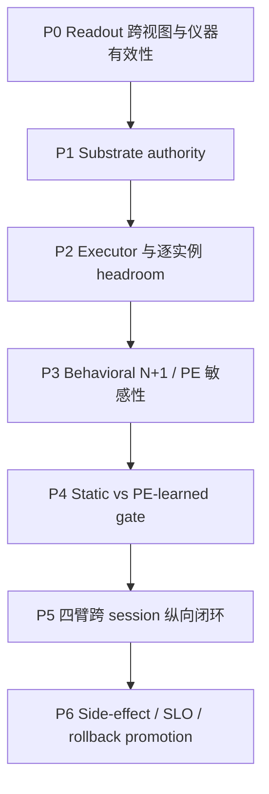

# 05 · 证据与实验路线：从 substrate floor 到四轴纵向闭环

## 1. 总原则

本路线不是一次改完主链，而是七个可独立停止的收敛包。每包只回答一个因果问题；上一包失败时，
后续包不自动执行。

共同冻结条件：

- 同一 base model digest、prompt template、generation params、context budget；
- train/validation/secret heldout 与 artifact fit 完全隔离；
- reader/executor 冻结后，online 只允许 gate policy 更新；
- evaluation/human/judge 只读，学习只走 PE→credit；
- 所有 intervention 有 norm cap、strict noop、decision/artifact lineage；
- 所有 formal 在看到结果前冻结 arms、seeds、budget、metric、threshold 与 kill condition。

## 2. 路线总览



## 3. Packet P0：Readable 仪器与跨视图效度

### 问题

目标状态是否被读到，且读到的是跨表面形式的状态而非数据捷径？

### Arms

1. current v2 linear reader；
2. diff-of-means / CAA reader；
3. RSA-selected Concept Vector reader；
4. J-lens-like future-token reader（若当前模型/规模可行）；
5. random matched subspace control。

### Views

- 原格式；
- paraphrase；
- open-ended ↔ multiple-choice；
- 中英或可用双语；
- order/role perturbation；
- 目标概念不变、词面改变的 counterfactual。

### 主判据

- heldout same-vs-diff Cohen's d；
- cross-view balanced accuracy / calibration；
- 1-NN identity retrieval；
- direction coherence；
- causal patch 后目标 action/logit 的 signed effect；
- random-control separation。

### Exit

- **PASS**：至少一个 reader 同域和跨视图都过预注册门，causal effect 同向；
- **DOMAIN_LOCAL**：同域过、跨视图失败；可继续研究，但 snapshot 必须限制 domain/format；
- **INSTRUMENT_INVALID**：分辨力或 random control 失败；停止 P1。

### Owner

substrate residual publisher + cognition sensor owner；本包不新增平行语义 owner。

## 4. Packet P1：Substrate authority floor

### 问题

在 oracle 条件和目标已知时，基底能否被内部干预改变？

### 四臂

| Arm | 条件 | 作用 |
|---|---|---|
| N0 | strict noop | 基线 |
| T1 | disclosed text policy | 复现 P1k 类“知道规则能否执行” |
| R2 | oracle condition + bounded learned residual executor | 测 activation actuator |
| U3 | direct state patch / best causal upper bound | 测 substrate 理论上限 |

### 主指标

- paired action flip rate；
- target action probability / margin；
- exact task outcome；
- already-correct damage；
- intervention norm 与 dose-response；
- strict noop identity。

### Exit

- `substrate-authority-supported`：R2/U3 在 heldout 有稳定、同向、非零 effect，且 damage 受控；
- `executor-insufficient`：U3 有效、R2 无效 → 只改 executor；
- `substrate-control-floor`：U3 也无效 → 停止 gate/longitudinal，换模型、层或 action decoder 另包复审。

## 5. Packet P2：Executor 与 per-instance headroom

### 问题

固定 layer / direction / dose 是否已足够，还是需要逐实例 scheduler？

### Arms

1. current fixed-layer executor；
2. ReFT challenger（同 rank/norm/budget）；
3. per-instance oracle layer subset；
4. prompt-only frozen layer ranker；
5. random layer subset；
6. sensor-off matched unconditional executor。

### 主指标

- oracle lift over fixed；
- ranker recovery of oracle lift；
- reverse-effect rate；
- correct→wrong / wrong→correct；
- adaptive-K dose curve；
- fluency/capability collapse point；
- compute/latency。

### 决策

- oracle 无显著 headroom：维持固定 layer，拒绝扩 action schema；
- oracle 有、ranker 无：保留研究，不部署；
- ranker 回收预注册比例且 damage 降低：冻结 layer-schedule artifact，进入 P3；
- ReFT 不胜当前 executor：不引入新依赖。

## 6. Packet P3：行为层 N+1 与 PE 敏感性

### 问题

干预是否改变当前用户可见 action，并使 arm-independent 下一拍 target 产生可归因的 PE 差异？

### 数据流

```text
same turn state
 ├─ noop generation ─┐
 └─ steer generation ├─ current action diff
                     └─ actual next observation
                           ↓
                  frozen N+1 target/head
                           ↓
                PE(action) vs PE(noop)
```

### 三类终局

1. mechanical outcome：coding tests、tool result、exact environment state；
2. behavioral next-turn outcome：用户下一轮真实选择/纠正/继续；
3. human anchor：只读验证，不进入 credit。

### 主判据

- steering 对当前 action 的敏感性；
- PE advantage 的 paired CI；
- PE 与 mechanical/behavioral outcome 的方向一致性；
- action-independent target / predictor fingerprint；
- duplicate settlement 与 lineage drift 必须 fail loudly。

### Exit

- `behavioral-pe-sensitive`：行为和 PE 均有可归因变化；
- `representation-only-sensitive`：PE 变、行为不变；降级为诊断，不进入 P4；
- `pe-signal-insensitive`：无 headroom；封存该 head；
- `credit-direction-conflict`：PE 与真实 outcome 方向冲突；另立 PE head 研究，禁止调阈值挽救。

## 7. Packet P4：Static gate 与 PE-learned gate

### 问题

在线从 PE-credit 学“何时扳”，是否优于所有静态与随机基线？

### Arms

| Arm | Gate | Reader / executor |
|---|---|---|
| G0 | noop | 共享冻结 |
| G1 | always-on | 共享冻结 |
| G2 | CAST/static threshold | 共享冻结 |
| G3 | random gate（同 action rate） | 共享冻结 |
| G4 | PE-learned gate | 共享冻结，只更新 gate |
| G5 | oracle gate | 共享冻结，估计上限 |

若 P2 通过，可另加 `G4-layer`，但不得同时改变 gate 学习规则与 executor 形态。

### 训练约束

- credit 只来自 P3 已通过的 PE settlement；
- no step label、no judge reward、no human reward；
- multi-restart 选择只看 train side；
- heldout validation 不参与 restart 选择；
- checkpoint round-trip 恢复精确 action sequence。

### 主判据

- G4 > G0/G1/G2/G3；
- worst-seed CI；
- selectivity 与 action rate；
- PE improvement 与真实 outcome；
- no substrate/reader/executor update；
- policy version 与 duplicate credit audit。

### Exit

- learned gate 不胜 G2：保留 CAST/static，不宣称 Learnable；
- G5 不胜 G1：任务无择时 headroom，停止；
- G4 只提高 evaluation judge：判 R12 泄漏，结果 invalid；
- 全门通过：只授权 longitudinal SHADOW，不自动 ACTIVE。

## 8. Packet P5：四臂跨 session 主实验

### 核心问题

四能力组合是否产生超出各局部模块的增益？

### 预注册四臂

| Arm | Appendable | Steering | Gate | 目的 |
|---|---|---|---|---|
| L0 Stateless | 否 | strict noop | 无 | 冻结基线 |
| L1 Memory-only | gated CMS | noop | 无 | 测 Appendable 独立贡献 |
| L2 Static-control | 否 | bounded executor | CAST/static | 测 Readable+Steerable 独立贡献 |
| L3 Full-loop | gated CMS | bounded executor | PE-learned | 测四轴组合 |

附加强基线但不进入四臂主判词：full recent-context / naive ICL、oracle memory、oracle gate。

### 匹配要求

- 同 base/prompt/generation；
- 相同最大 context/token/latency budget；
- 无 memory 的臂使用等预算 null carrier，避免单纯长度差；
- 同一 episode sequence 与 counterbalanced order；
- L2/L3 共用 reader/executor；
- L1/L3 共用 memory owner/write policy，唯一差异是控制闭环；
- 每个 session 前后有 canonical checkpoint；
- 删除/冲突 episode 预注册，不能只测正向记忆。

### 主指标

1. real N+1 outcome / mechanical task success；
2. CL-Bench 风格 gain 与自定义 headroom-normalized gain；
3. cross-session retention；
4. paraphrase robustness；
5. conflict update；
6. locality / unrelated capability tax；
7. stale-memory recovery；
8. delete + restore 后的行为；
9. rollback drill；
10. human anchor agreement（validation only）。

### 必须成立的归因

```text
L1 > L0     Appendable 有独立价值
L2 > L0     static internal control 有独立价值
L3 > L1     steering 在有记忆时仍有增量
L3 > L2     appendable state 让 learned control 更好
L3 > max(L0,L1,L2)  四轴组合有系统增益
```

若只满足最后一条但前面归因不清，结果为 exploratory，不升级 thesis。

### 失败解释

- L1 ≤ naive ICL：write/retrieval policy 失败，不扩大 memory；
- L2 ≤ L0：control 无净效应或能力税抵消；
- L3 ≈ L2：memory 未进入 gate 的有效状态；
- L3 ≈ L1：gate/executor 无附加价值；
- L3 提升但 delete/rollback 失败：不得 production；
- 仅 judge 提升、mechanical/behavioral 不变：无效。

## 9. Packet P6：Side-effect、工程 SLO 与 promotion

### 三层门

| 层 | 必测 |
|---|---|
| Scientific | controllability、headroom、cross-model、worst-seed、side-effect matrix |
| Engineering | P50/P95/P99 latency、throughput、VRAM、continuous batching、TP/PP、failure recovery |
| Governance | artifact hash、source lineage、strict noop、shadow isolation、ModificationGate、single-field rollback |

### 后端对照

1. transformers reference hook；
2. vllm-lens isolated engine；
3. production candidate adapter/plugin；
4. strict-no-plugin baseline。

要求同输入、同模型 digest、同 delta 的 action/logit/effect 一致性；后端差异必须在 tolerance 内，否则
不能把 transformers formal 迁移到 vLLM。

### Promotion 不是本研究包自动完成的事

P6 通过后也只生成 candidate evidence。正式 ACTIVE 仍服从 `steering-runtime.md` 的 B3、
ModificationGate、activation plan、canary receipt 与单字段 rollout。

## 10. 模型与领域最低外推矩阵

最终系统主张最低需要：

- 两个模型家族；
- 两个领域，其中至少一个有机械 outcome；
- 至少一个跨 session 人类/真实环境 lane；
- 同一结论跨多个 seed/restart；
- 一个 model upgrade / artifact invalidation drill。

推荐领域组合：

1. coding-lab：机械 oracle、长轨迹、TACT/CL-Bench 可比；
2. relationship-lab：真实语义、用户状态、delayed outcome，但 human anchor 只读。

两者分别承担可验证性和产品相关性，不能用其中一个替代另一个。

## 11. 结果判词词表

为避免 null 被过度解释，统一使用：

- `mechanism-supported`；
- `domain-local-only`；
- `instrument-invalid`；
- `substrate-control-floor`；
- `executor-insufficient`；
- `pe-signal-insensitive`；
- `representation-only-sensitive`；
- `credit-direction-conflict`；
- `static-gate-sufficient`；
- `learned-gate-supported`；
- `longitudinal-four-axis-supported`；
- `promotion-blocked-by-slo|safety|rollback`。

任何失败都保留原始 prereg 和结果，不以新指标覆盖旧判词。
