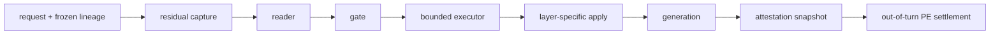

# 06 · 工程可行性：内部控制能否进入真实推理服务

## 1. 结论先行

工程上，“在大模型推理中捕获和修改 residual stream”已经不是不可行问题；真正的问题变成：

> 能否在不破坏 continuous batching、吞吐、安全边界和证据 lineage 的前提下，把同一个已验证
> intervention 精确地施加到 production backend，并保持 strict noop 与单字段回滚。

公开工具证明了可行性，但没有任何工具开箱即满足 Volvence 契约。推荐路线是：

1. 保留 transformers reference backend 作为语义 oracle；
2. 用 vllm-lens 做隔离可行性与性能 spike；
3. 只复用必要的 hook/transport 思想，自建最小 typed adapter；
4. 通过跨后端等价、SLO、安全与 rollback 后再进入 B3 候选。

## 2. 目标推理链



每个方框的工程输出都必须是可验证数据，不是隐藏 Python object：

| 组件 | 最低 attestation |
|---|---|
| capture | model digest、layer、position、dtype、shape、source hash、residual norm |
| reader | artifact id/hash、normalization、label/margin、domain/version |
| gate | decision id、policy id/version、observations、action/probability |
| executor | artifact id/hash、condition/layer/dose、delta norm、cap ratio、strict-noop |
| hook | backend/version、实际 layer、prefill/decode phase、applied hash |
| generation | sampling config、context length、truncation、output/action digest |
| settlement | target/head fingerprint、action/noop lineage、credit consumption state |

## 3. 外部工具对照

| 工具 / 报告 | 已公开能力 | 可借 | 不能直接接受 |
|---|---|---|---|
| pyReFT | ReFT 训练/保存/分享；单基底多 intervention；continuous batching | 离线 executor challenger、artifact 组织 | 通用 intervention 语义不含我们的 norm/noop/PE/owner 契约 |
| IBM activation-steering | ActAdd/CAST、condition vector、逻辑组合、教程 | static-gate baseline、数据与可视化 | 默认 additive vector、离线阈值，不是 PE-learned gate |
| vllm-lens | vLLM capture/write、generic/persistent hooks、TP/PP、HTTP、J-lens examples | backend spike、跨后端复现、harvest | 强制 eager、cloudpickle RCE 面、自动 plugin、通用 hook 太宽 |
| Goodfire | trillion-parameter SGLang patch、3B activation overnight、自报实时 CoT steer | 大规模 harvest 和 server patch 架构 | 公司自报；无完整行为、能力税、回滚或 SLA 证据 |

许可证当前公开页：pyReFT Apache-2.0、IBM activation-steering Apache-2.0、vllm-lens MIT。
真正 vendoring 前仍须固定 commit、复核依赖许可证与安全公告。

## 4. vllm-lens 深入判断

### 4.1 为什么值得评估

其公开仓库已经覆盖 Volvence 当前缺口的大部分机械能力：

- 指定 layer residual extraction；
- in-flight steering vector；
- per-request 与 persistent hooks；
- pre-hook / post-hook；
- tensor parallel / pipeline parallel；
- Python 与 HTTP client；
- causal tracing、Jacobian lens/J-space、emotion tracker 示例；
- benchmark notebook。

这意味着“vLLM 没有任何 residual 出口”应继续作为**Volvence 当前实现事实**，但不再是行业不可行性结论。

### 4.2 三个硬风险

1. **性能语义改变**：插件会强制 `enforce_eager=True`，关闭 CUDA graphs。是否可接受必须按目标模型、
   batch、prefill/decode 比例实测，不能引用项目 README 推断。
2. **安全边界**：HTTP generic hook 用 cloudpickle 序列化函数，官方明确等价于 server arbitrary code
   execution。production 不得接受远端任意 hook；只能加载 allowlisted typed artifact。
3. **插件旁路**：auto-register + persistent hooks 可能绕过 Volvence WiringLevel。必须能证明 disable 是
   complete noop、进程启动时无残留 hook、每次请求只消费已验证 artifact。

### 4.3 正确 spike 范围

只做隔离进程和公开模型，不接用户数据，不修改 production 默认。固定一个 layer、一个 vector、一个
strict noop，对比 transformers 与 vllm-lens：

- capture tensor cosine / norm / hash；
- steer 后 logits / greedy output；
- prefill 与 decode 注入位置；
- batch 内不同 request 不串扰；
- TP=1 与 TP>1；
- plugin disable 后 bit/behavior identity；
- P50/P95/P99、tokens/s、VRAM；
- server restart 后 persistent hook 清空；
- 未授权 hook 请求 fail closed。

若无法把 generic Python hook 收窄为 typed declarative intervention，终止接入。

## 5. 参考实现策略：薄 adapter，不 vendoring 整个控制面

推荐分层：

```text
Volvence artifact/snapshot contract       ← SSOT
          │
          ▼
BackendSteeringAdapter (typed, minimal)
          ├── TransformersReferenceAdapter
          └── VllmCandidateAdapter
                  │
                  └── narrow capture/apply primitives
```

后端 adapter 只负责张量读写，不拥有：

- condition 语义；
- gate policy；
- PE/credit；
- artifact training；
- promotion 决策；
- memory。

这样可以借 vllm-lens 的底层机制而不让其 generic hook 成为第二个策略 owner。

## 6. Artifact 合约建议

不在本研究包修改 schema；若实施，先走 `DATA_CONTRACT.md` 注册。候选最小字段：

```text
model_id
model_digest
backend_compatibility[]
layer_indices[]
hidden_width
dtype
reader_artifact_id / sha256
executor_artifact_id / sha256
condition_codes_sha256
layer_schedule_artifact_id? / sha256?
rank
control_norm_cap_ratio
strict_noop_digest
training_prereg_sha256
source_tree_sha256
```

per-instance layer schedule 若进入，只发布 artifact id 与离散 schedule 选择，不把任意 Python function
装入 snapshot。

## 7. 后端等价测试

### 7.1 Capture equivalence

- 相同 tokenizer/input ids/attention mask；
- 相同 model weights digest、dtype、layer definition；
- 明确 pre/post residual；
- compare per-token cosine、relative L2、norm、top principal projections；
- 允许数值 tolerance，但 tolerance 在看结果前冻结。

### 7.2 Apply equivalence

- 同一完整宽度 delta；
- 同一 position 和 layer；
- noop delta exact zero；
- cap 前后 norm attestation；
- greedy logits top-k / sequence match；
- sampling 模式只对 distribution 做重复统计，不要求逐 token identity。

### 7.3 Isolation

- 同 batch 内 steer/noop request 不串扰；
- persistent hook 不跨 tenant/session；
- crash/retry 不重复施加；
- cancellation 后 hook state 被清理；
- checkpoint/restore 不保留未授权 runtime function。

## 8. 性能预算

必须分别计量，不把总 overhead 归给一个模糊的“steering”：

| 成本项 | 量测 |
|---|---|
| residual capture | 每 layer/position 的复制、通信、host transfer |
| reader | matmul / normalization / top-k 或 J-lens unembed |
| gate | policy inference、per-instance layer rank |
| executor | low-rank projection与 delta 构造 |
| hook | eager/CUDA graph loss、kernel break、TP sync |
| counterfactual | second forward / matched noop |
| observability | hash、snapshot serialize、trace storage |
| checkpoint | gate/memory state durability |

外部 Goodfire 吞吐和 vllm-lens benchmark 只能作为可行性先验，正式 SLO 用目标硬件与真实 batch profile。

## 9. 安全模型

### 必须阻断

- 未签名/未 hash 的 vector 或 Python hook；
- model/layer/width/dtype 漂移；
- ACTIVE consumer 读取 SHADOW artifact；
- remote cloudpickle；
- 环境变量抬高 WiringLevel；
- server restart 后自动恢复未授权 persistent hook；
- vector 超 norm cap；
- noop 非零；
- 一个 request 修改全局 model state；
- telemetry 保存原始敏感对话或完整 residual 超出保留策略。

### 攻击面

Refusal Direction 已证明 activation control 可直接关闭安全行为。内部控制基础设施应按高权限代码执行面管理：

- artifact allowlist/signature；
- least privilege；
- per-request tenancy；
- audit log；
- irreversible write 禁止；
- emergency disable；
- canary 与 rollback。

## 10. Rollback 分层

| 级别 | 动作 | 预期恢复 |
|---|---|---|
| R0 | gate action→noop | 无 delta，保留 reader observability |
| R1 | gate wiring→SHADOW | 用户不可见，继续双跑 |
| R2 | executor hook off | 停止额外 forward/hook |
| R3 | sensor/executor/gate 全 DISABLED | 回到未安装控制链 |
| R4 | backend plugin disable / process restart | 清除底层 hook 与缓存 |
| R5 | artifact rollback | 回到前一已验证 hash/version |

每级都应有可机械验证的 before/after receipt；“配置改了”不是 rollback evidence。

## 11. 工程成功的最低定义

只有同时成立以下条件，才能说“production residual path 工程可行”：

- reference/candidate backend effect 等价；
- strict noop identity；
- continuous batching 无 request 串扰；
- P95/P99 与吞吐在预注册预算内；
- typed artifact，无任意远端代码；
- model/layer/dtype/source lineage 完整；
- restart、cancel、retry、rollback 可验证；
- SHADOW/ACTIVE 隔离；
- 科学 P3–P5 已通过。

只完成 hook 或 demo，不满足这个定义。
