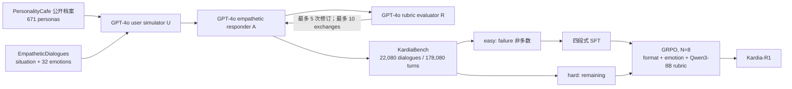

# 01｜论文深读：Kardia-R1 真正证明了什么

## 1. 论文定位

Kardia-R1 把共情对话拆成两个相连但不同的贡献：

1. **KardiaBench**：用 671 份 PersonalityCafe 公开档案与
   EmpatheticDialogues 的情境 / emotion 类别，合成 22,080 段 persona-grounded
   短多轮对话；
2. **Kardia-R1**：先在“easy”轨迹上做四段式 SFT，再在“hard”轨迹上用
   Rubric-as-Judge GRPO 做离线后训练。

正式论文为 [arXiv:2512.01282v2](https://arxiv.org/abs/2512.01282)，已列入
WWW 2026 proceedings。正文与附录的本地归档见
[PDF](papers/kardia-r1-arxiv-2512.01282v2.pdf)。

## 2. 完整数据与训练链



### 2.1 数据合成

GPT-4o `gpt-4o-2024-11-20` 同时承担三种角色：

- `U`：读取 profile、situation、emotion 与历史，生成用户话语；
- `A`：生成 understanding、reasoning、emotion、response 四个 span；
- `R`：按 rubric 判为 `FAIL / PASS / SOLVED`，失败时让 `A` 最多修订 5 次。

外层对话最多 10 次 exchange，`SOLVED` 提前终止。身份漂移、情绪跳变或结构退化的
轨迹会被删除；test set 由专业标注者检查并修正错误响应。

关键边界：这些是**真实档案锚定的合成对话**，不是 671 名用户与系统发生的真实互动。
后续 user turn 仍由同一个 GPT-4o 生成生态产生，不是独立环境后果。

### 2.2 四段式监督

每个 assistant target 依次包含：

1. `understanding`：总结用户意图与情绪线索；
2. `reasoning`：生成共情 appraisal；
3. `emotion`：从 32 类中选择一个标签；
4. `response`：生成不超过约 30 tokens 的支持性回复。

这是一种有用的**标注分面**，但前三段是模型生成文本。它们能让监督目标更清楚，不能仅
凭可见性证明它们忠实解释模型内部状态。

### 2.3 easy / hard 划分

论文按每条轨迹的 `pFAIL / pPASS / pSOLVED` 划分：

```text
easy if
  pFAIL < pPASS + pSOLVED
  OR
  pFAIL + pPASS < pSOLVED
```

若三者是和为 1 的频率，第二项蕴含第一项，因此 `OR` 的第二个条件是冗余的；整个规则
事实上退化为 `pFAIL < 0.5`。这不必然破坏 curriculum，但说明“difficulty-aware”规则比
论文叙述更粗，而且没有发布逐轨迹分组或 split 代码供核验。

论文强调合成时的 rubric signal 不直接作为监督标签或 reward，只用于过滤与难度估计；
但样本是否被保留、被修订到什么版本，本身仍由该 rubric 塑形，所以不能说合成偏差被消除。

### 2.4 SFT 与 Rubric-ERL

SFT：easy subset、2 epochs、AdamW、`lr=1e-4`、global batch 128、8×A100。

GRPO：hard subset、2 epochs、`lr=1e-6`、global batch 32、每个 context 采 8 个候选。
总 reward 为：

```text
r = 1/3 * format_reward
  + 1/3 * emotion_exact_match
  + 1/3 * rubric_judge_reward
```

其中：

- format 检查四对 tag 是否齐全、有序、非空；
- emotion 是与 gold label 的精确匹配；
- rubric 由 Qwen3-8B 对 Relevance、Fluency、Empathy、Persona Consistency、Safety
  五维打分后归一化到 `[0, 1]`。

因此高层“共情质量”五维合计只占 reward 的三分之一；格式和单标签分类各占三分之一。
论文未给五维聚合细节、judge prompt、尺度校准、KL `β`、clip `ε` 或随机种子。

## 3. 结果应该怎么读

### 3.1 Kardia-R1 相对 SFT-only 的净增量

下表直接由论文 Table 2 相减；Emotion 是百分点，其余为 1–5 rubric 分数差。

| Backbone | Emotion | Relevance | Fluency | Empathy | Persona | Safety |
|---|---:|---:|---:|---:|---:|---:|
| Qwen2.5-3B | +0.33 | +0.040 | +0.019 | +0.034 | +0.046 | +0.037 |
| Qwen2.5-7B | +0.12 | +0.078 | +0.011 | +0.050 | +0.248 | +0.114 |
| Gemma-2B | +0.20 | -0.031 | +0.061 | +0.024 | +0.073 | -0.052 |
| Gemma-7B | +0.61 | +0.033 | -0.017 | +0.077 | +0.025 | +0.077 |
| **四模型均值** | **+0.315** | **+0.030** | **+0.018** | **+0.046** | **+0.098** | **+0.044** |

这说明 Rubric-ERL 的边际作用存在，但并非每个模型、每个维度都单调改善。

### 3.2 SFT-only 相对原始 backbone 的平均增量

同样按 Table 2 计算，四模型均值为：

| Emotion | Relevance | Fluency | Empathy | Persona | Safety |
|---:|---:|---:|---:|---:|---:|
| +59.257 pp | +0.739 | +0.582 | +1.187 | +0.947 | +0.249 |

所以论文真正的主结果首先是：**数据与结构化 SFT 极其有效**。GRPO 的贡献更像在已经很强的
SFT 结果上，对 Persona、Empathy、Safety 等软维度继续整理，而非制造主要能力跃升。

### 3.3 人评证据

论文让 3 名具有 counseling / affective communication 经验的专家，对 160 个 test case
做 Kardia-R1 与 GPT-4o / PsyLLM 的 A/B preference，五维结果总体偏向 Kardia-R1。
这是有价值的外部锚，但证据仍有限：

- 未报告逐维置信区间、effect size、评审间一致性或每个 backbone 的独立样本量；
- 未说明样本抽样、输出顺序随机化、模型身份盲法；
- 标注者分歧先讨论，仍无法达成一致时由 supervisory LLM 最终裁决，因此并非纯人类终局；
- 自动评测使用 GPT-5-mini，训练使用 Qwen3-8B rubric，虽非同一 judge，却优化和评测同一
  套 rubric 轴，仍需要跨 judge family 稳健性才能排除 rubric-style overfitting。

## 4. “可验证”主张只成立一半

| 组成 | 是否机械可验证 | 判断 |
|---|---|---|
| 四段 tag / 顺序 / 非空 | 是 | 真正的形式验证 |
| emotion exact match | 在标签被接受为 gold 时是 | 分类正确性可验证，但 gold 本身来自既有情境标签 |
| relevance / empathy / persona / safety | 否 | Qwen3-8B 的可解释软评价，不是环境真值 |
| visible reasoning | 否 | 可读文本，不等于忠实内部因果解释 |

因此更准确的表述是“**部分机械约束 + 人类可读 rubric 的软奖励**”，不是完整
verifiable RL。对 Volvence 而言，这类 judge 可以进入 evaluation readout，不能成为
PE/credit 的替代源。

## 5. 复现与审计缺口

截至审计日，公开 GitHub checkout 只有：

- `infer_hf.py`
- `infer_swift.py`
- `README.md`
- `LICENSE`
- 三张图片

缺失项包括：

- GPT-4o 的 `U / A / R` prompts、清洗与语义去重代码；
- train/test 与 easy/hard manifests；
- SFT / GRPO 配置、reward 实现、judge prompt、checkpoint selection 脚本；
- 自动评测与人评原始记录、置信区间和评审一致性；
- 论文中“best checkpoint across RL epochs”的独立选择集与选择指标。

Table 3 只列 train/test，没有 validation。论文未说明 best checkpoint 是否依据训练 reward、
独立 holdout 还是 test 指标选择；这是一项**不可审计的选择口径**，但现有材料不足以断言
发生了 test leakage。

两份公开推理脚本还存在两个实际边界：

1. system prompt 中的 `{{profile}}` 与 `{{situation}}` 没有被替换，示例只传一条 user
   message，因此公开 demo 并未真正演示 persona grounding；
2. `trust_remote_code=True` 被无条件开启，而公开页面没有解释为何标准 Qwen 衍生模型需要
   远程代码信任。产品接入时不应照抄该供应链设置。

## 6. 安全与产品边界

论文的 Safety 是 judge / 人评的单轴平均分，没有覆盖：

- 危机识别 recall、漏报与误报；
- 依赖诱导、过度认同、迎合、真人关系替代；
- capability / propensity / elicitation pressure / evaluation awareness；
- 跨 session 的累积伤害与撤回边界。

模型卡同时写“不是临床治疗”，公开 prompt 却要求模型扮演 `supportive therapist` 和
`psychological expert`。这个角色边界张力没有在论文中解决。Volvence 不应复制该 framing，
而应继续让 `boundary_consent`、风险带与表达层边界保持正式契约。

## 7. 最终科学裁决

### 论文较强地支持

- 真实档案锚定的合成短多轮数据，比纯 situation-centric 数据更适合训练 persona-aware
  情感支持表达；
- 四段式 SFT 能让 2B–7B 模型在同分布 benchmark 上显著提升 emotion accuracy 与
  rubric 质量；
- Rubric-ERL 在部分主观轴上相对 SFT 有小幅、跨 backbone 大体正向的边际增益。

### 论文没有证明

- visible reasoning 是忠实的内部状态读出；
- LLM rubric 是客观或不可游戏的 reward；
- 系统能跨 session 记忆、纠正用户模型或持续学习；
- “共情”改善会在真实用户后续行为与长期关系健康上成立；
- 临床安全、production safety 或开放世界适应已成立；
- KardiaBench 的原始网络档案可无条件用于商业训练或产品。

