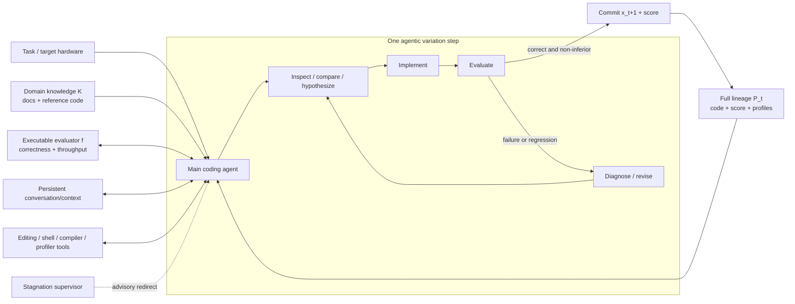

# AVO 架构与证据深读

## 1. 名词与证据边界

本文中的 AVO 是 **Agentic Variation Operators**，不是 autonomous vehicle、ambient occlusion 或
adversarial variational optimization。

必须把两组公开材料分开：

1. **论文证据**：Chen et al., arXiv `2603.24517v1`，验证 attention kernel 的自主进化搜索。
2. **官方扩展**：NVIDIA 2026-08-21 技术博客，描述更完整的 long-horizon harness 图，并报告
   ARC-AGI-3 public set 结果。

后者是重要的一手工程披露，但不是论文增补，也没有给出独立方法、消融或可复现实验附件。因此本文用
“论文证明”“官方博客报告”“本文推断”三个口径，不把它们合并为同一级证据。

## 2. AVO 真正改了什么

### 2.1 传统 LLM 进化搜索

论文把一组候选及分数写成：

\[
\mathcal{P}_t = \{(x_i, \mathbf{f}(x_i))\},
\qquad
\mathcal{P}_{t+1}=\operatorname{Update}(\mathcal{P}_t,(x_{t+1},\mathbf{f}(x_{t+1}))).
\]

传统 LLM-augmented variation 通常是：

\[
\operatorname{Vary}(\mathcal{P}_t)
=\operatorname{Generate}(\operatorname{Sample}(\mathcal{P}_t)).
\]

框架决定选谁、何时调用模型、怎样评测和更新 archive；LLM 只完成一次 `Generate`。AlphaEvolve、
FunSearch 等系统的 archive 与 evaluator 可以非常复杂，但一次 LLM invocation 仍主要是候选生成。

### 2.2 AVO 的关键替换

AVO 把整个 `Vary` 换成自主 agent：

\[
\operatorname{Vary}(\mathcal{P}_t)
=\operatorname{Agent}(\mathcal{P}_t,\mathcal{K},\mathbf{f}).
\]

其中：

- `P_t`：完整候选谱系及每个候选的多维分数；
- `K`：CUDA/PTX/Blackwell 文档、参考实现、FlashAttention-4 源码等 domain knowledge；
- `f`：正确性与吞吐量 evaluator；
- `Agent`：可以浏览文件、读文档、改代码、运行 shell、编译、测试、Profiler、诊断和重试的通用
  coding agent。

真正的新颖点不是“用 LLM 写 CUDA”，而是**取消一次生成即返回候选的边界**。一个 variation step 内部
可以有很多 tool actions 和失败尝试；agent 自己决定何时查历史、何时换假设、何时调用 evaluator、何时
放弃或提交。

## 3. 论文可恢复出的系统结构

这个图同时包含论文 §3 的 operator 结构与 §3.3 的 self-supervision。以下实现细节是公开材料明确给出的：

| 组件 | 公开定义 | 没有公开的内容 |
|---|---|---|
| Main agent | 内部开发、frontier LLM 驱动的通用 coding agent；标准编辑、shell、文件和文档工具 | kernel run 的确切模型、prompt、context compaction、采样参数 |
| Lineage | 每个 committed kernel 及其 score；每版是 git commit | 完整失败树、commit metadata、可下载仓库 |
| Knowledge base | CUDA guide、PTX ISA、Blackwell spec、现有实现 | 固定清单、版本与 content digest |
| Evaluator | correctness 失败则 score=0；其余为各 benchmark configuration 的 throughput vector | evaluator source、完整环境镜像与 measurement artifacts |
| Memory | 累积 prior edits、compiler/profiler output 和 reasoning 的 conversation history | 多时间尺度 schema、检索/压缩策略、删除与恢复协议 |
| Supervisor | 检测 stall / unproductive cycles，审阅总体轨迹并给出新方向 | 触发阈值、模型、上下文、权限、输出 schema 和 ablation |
| Commit gate | 正确且相对当前 best match-or-improve 才持久化 | 多目标 tie-break、噪声容限的完整实现 |

### 3.1 “进化”其实是单谱系

论文把 AVO 定义成一族 variation operators，理论上可接 archive、island 或 population；但实际实验采用：

- 一个 seed `x_0`；
- 一条 `x_1, x_2, ..., x_40` committed lineage；
- 只有正确且不劣的版本进入谱系；
- population branching 与 archive management 明确留作未来工作。

因此 AVO 的实证不能证明 agentic operator 与 MAP-Elites/island 的组合，也不能证明 diversity maintenance。
“超过 500 个方向”是 agent 内部探索量，不是 500 个可审计 population members。

### 3.2 两种持久状态

论文实际有两种不同状态：

1. **正式 committed lineage**：git commit + score，单调保留成功候选；
2. **agent 内部轨迹**：失败的实现、诊断与 reasoning，留在 conversation/context 中，不进入正式 lineage。

这种区分很实用，但也产生审计缺口：成功谱系可以复查，失败经验的完整性、压缩和跨 context 恢复无法从
论文复现。NVIDIA 8 月博客把 memory 描述为能跨单一 context 保留进展，但没有公开其存储与恢复协议。

## 4. Kernel 实验

### 4.1 设置

| 项 | 论文设置 |
|---|---|
| Hardware | NVIDIA B200 |
| Software | CUDA 13.1；PyTorch 2.10.0 |
| Target | forward prefilling attention |
| Precision / head dim | BF16 / 128 |
| Sequence length | 4,096 / 8,192 / 16,384 / 32,768 |
| Token control | batch × sequence length 固定 32,768 tokens |
| MHA | 16 heads；causal 与 non-causal |
| GQA | 32 query heads；4 或 8 KV heads |
| Baselines | cuDNN 9.19.1；FlashAttention-4 commit `71bf77c` |
| Timing | 与 FA4 相同 timing script 和 warm-up/repeat；完整实验重复 10 次 |

### 4.2 报告结果

- 7 天无人干预运行，超过 500 个内部优化方向，40 个 committed versions。
- MHA causal：对 cuDNN `+0.4%` 到 `+3.5%`；对 FA4 `+5.0%` 到 `+10.5%`。
- MHA non-causal：在 16K/32K 对 cuDNN `+1.8%` 到 `+2.4%`；短序列与两个 baseline 都在
  measurement noise 内。
- 从 MHA kernel 转到 GQA 约 30 分钟；causal 最高对 cuDNN `+7.0%`、对 FA4 `+9.3%`；
  non-causal 最高分别 `+6.0%` 与 `+4.5%`。
- 论文附录另用 FA4 论文公开数字比较，以减轻不同机器/driver/thermal/clock 对绝对 TFLOPS 的影响。

这里的“最高”不能替换完整配置表；特别是 non-causal 短序列没有稳定优势。

### 4.3 三个可归因的代码优化

论文没有对 memory/supervisor/agent loop 做系统消融，但对三次相邻 kernel commit 做了局部代码消融：

| 版本变化 | 优化 | Non-causal geomean | Causal geomean |
|---|---|---:|---:|
| v19→v20 | branchless accumulator rescaling + lighter fence | `+8.1%` | `+1.6%` |
| v29→v30 | correction 与第二个 MMA stage overlap | `+1.1%` | `+0.4%` |
| v32→v33 | warp-group register 从 `192/80/48` 调为 `184/88/56` | `+2.1%` | 约 `0%` |

这些结果支持“产出的修改具备真实微架构内容”，但不单独证明是 AVO architecture 而非强模型、长预算、
文档访问或特定工程环境造成的收益。

## 5. ARC-AGI-3 扩展

### 5.1 官方报告

NVIDIA 8 月博客称，在不改底层 AVO agent、只替换任务接口和 evaluator 的条件下：

- 输入是精确 `64 × 64` text grid，没有 image tokens；
- agent 只获得 available actions，不获得规则或目标说明；
- Claude Opus 5 完成 public set 的 25 个环境、183 个 level；
- 分数为 `100.00 RHAE`，共 6,624 environment actions；
- VISTA 同模型的公开报告是 7,542 actions，AVO 少约 12%。

RHAE 按 level 比较 AI 与首次人类 action count，并对后续 level 加权。官方 scoring docs 明确：模型内部
reasoning、只读检查与工具调用只要不改变环境，都**不计入 action**。因此 6,624 是环境交互效率，不是
token、wall-clock、GPU 或总推理成本。

### 5.2 不能从该结果推出什么

- NVIDIA 明确说 AVO 与 VISTA 不同在 backend、observation representation、memory、context management
  等多个方面，所以 12% 不是 memory 或 supervisor 的因果效应。
- NVIDIA 明确说结果只覆盖 public set，不覆盖 semi-private / private competition sets。
- 博客把 ARC Prize 的约 30% model-level 报告与 AVO 100% 并列，但同时承认 reasoning setting、agent system
  和 evaluation setup 不同；不能相减得到“AVO 贡献 70 个点”。
- 同一 public set 已被多个 2026 harness 饱和。VISTA 作者还明确提醒：所用模型晚于 public games 发布，
  无法排除训练暴露；private set 才是 generalization 检验。该风险同样使 AVO public-set 结果不宜被解释为
  unseen continual learning 证据。
- 没有公开 AVO ARC trajectories、prompt、memory contents 或 supervisor interventions，无法独立重放。

## 6. AVO 的证据强度

| 主张 | 当前证据 | 判定 |
|---|---|---|
| agent 能长期完成真实 kernel 优化 | 7 天 B200 run、40 commits、最终 benchmark、三项代码消融 | 强工程证据，复现性不足 |
| agentic variation 优于固定 variation | 无 matched agent-loop ablation | 未证明 |
| memory 是收益原因 | 无 memory-off / lineage-only 对照；ARC 博客明确未隔离 | 未证明 |
| supervisor 防止停滞 | 有运行叙述，无 trigger log / off-arm | 机制披露，非因果证据 |
| 同一 harness 可跨域 | kernel 与 ARC public set 两类展示 | 有 transfer signal；实现闭源且 public set 饱和 |
| AVO 是 continual learner | 没有参数学习、PE-credit 或跨任务持久策略证据 | 不能这样主张 |
| AVO 是通用进化 population 架构 | 只跑 single lineage | 未证明 |
| AVO 可安全上线 | paper 只有 correctness/performance commit gate | 未证明；需外部 runtime/security boundary |

## 7. 论文谱系定位

| 工作 | variation / search 的主要 owner | 与 AVO 的关系 |
|---|---|---|
| Evolution through Large Models (`2206.08896`) | LLM 作为程序 mutation operator，外部 MAP-Elites 管理搜索 | 源头：LLM 变异 |
| FunSearch | LLM 生成单函数，外部 evaluator/database | 源头：可验证程序搜索 |
| AlphaEvolve (`2506.13131`) | 外部 evolutionary database/sample/eval；LLM 生成代码 diff | AVO 主要对照：LLM 只在 Generate |
| LoongFlow (`2512.24077`) | 固定 Plan-Execute-Summarize + MAP-Elites/Boltzmann | AVO 对照：仍是预定义工作流 |
| TTT-Discover (`2601.16175`) | PUCT/buffer 固定；test-time gradient 更新 Generate policy | AVO 正交：AVO 学 workflow autonomy，不更新模型权重 |
| AVO (`2603.24517`) | 一个 agent 自主承担 Sample/Generate/inner eval/repair | 新增 operator autonomy；当前单谱系 |
| VISTA / Tycho | ARC direct-interaction harness / programmatic world model | 8 月 AVO 的 ARC 对照，不是原论文基线 |

完整一手链接与本地归档状态见 [`SOURCES_AND_DOWNLOADS.md`](./SOURCES_AND_DOWNLOADS.md)。

## 8. 对架构的最终解释

AVO 最准确的定义是：

> 一个以通用 coding agent 实现的、长程、工具增强、反馈驱动、可监督的 outer-loop variation operator。

它不是新的 Transformer、memory neural architecture 或 online RL algorithm。它把“搜索管线中的一个函数”
变成“可以主动操作整个开发环境的一段自治过程”。这正是其工程价值，也正是必须给它外部权限边界的原因。
