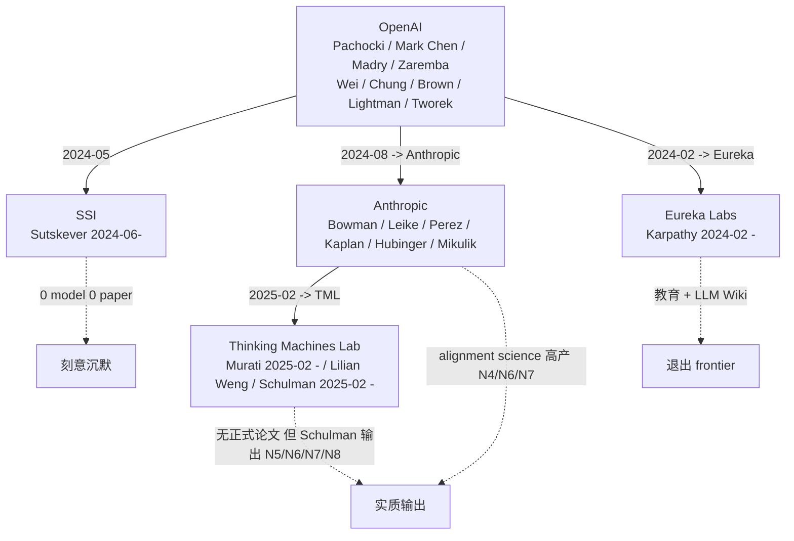

# OpenAI Diaspora 路线图（2026 版）

> 本文聚焦 OpenAI 系**已离职**的核心人物及其新机构 2024-2026 的路线 + 与 cognitive AGI 的关系。
> "刻意沉默"或"路线偏移"本身是数据点。

## 一、Diaspora 全景（2026-04 截面）



## 二、各实体详细路线图

### 2.1 SSI（Safe Superintelligence Inc.）

**领头**：Ilya Sutskever（2024-06 离开 OpenAI 后立即创立）

**关键事实（截至 2026-04）**：
- **0 模型** 发布
- **0 论文** 发表
- **0 demo** 公开
- 估值 \$32B（2026-04 报道）

**已知信念（来自访谈、SSI 官方少量声明）**：
- "build straight to superintelligence" — 不做中间产品
- 商业上完全 insulate，避免 deployment 压力扭曲安全研究
- 团队规模刻意保持小（~10-20 人级别，估）

**对 VZ 的解读**：
1. **数据点本身的意义**：作为 GPT 系列的奠基人之一，Sutskever 选择**完全不参与**当前的 frontier 工程军备赛——这是对"目前主流路线没有解决根本问题"的强烈表态。
2. **SSI 的反向参照**：SSI 的"pre-product 沉默"路线在 \$32B 估值下被资本市场接受——说明**当前 cognitive AGI 议题的资本不再要求"快速 ship product"**。这给 VZ"先做对再做大"留出了战略空间。
3. **VZ 不要模仿 SSI 的"完全沉默"**：VZ 是养成式数字生命，必须有真实部署和真实关系积累；与 SSI"build superintelligence"的目标完全不同，沉默不适合 VZ。

### 2.2 Thinking Machines Lab（TML）

**领头**：
- **Mira Murati**（CEO，2025-02 创立，前 OpenAI CTO）
- **John Schulman**（Chief Scientist，2025-02 从 Anthropic 加入）
- **Lilian Weng**（co-founder，前 OpenAI VP Safety Systems）

**关键事实（截至 2026-04）**：
- 2025-02 公司创立
- 2026-01 联合创始人 **Barret Zoph & Luke Metz 回流 OpenAI**（路线分歧的信号）
- 2026-03 与 NVIDIA 战略合作：1GW Vera Rubin compute 多年合约
- 2026-04 估值 \$50B
- **未发布正式产品 / 论文**——但 Schulman 个人在此期间输出了 4 篇关键论文（N5/N6/N7/N8）

**官方定位**："customization, interpretability, and open-weight base models"

**对 VZ 的解读**：

1. **Schulman 的 4 篇论文是 TML 路线的强信号**：
   - N5 Chunky Post-Training：post-training data 决定行为（隐含"customization 路线"）
   - N6 CoT 不可信：reasoning 不是黑盒（隐含"interpretability"）
   - N7 model spec 内部冲突：spec 自身是问题（隐含"基础模型质量论"）
   - N8 auditor agent：audit 是 agent（隐含"工具化 oversight"）
   
   **隐含路线**：TML 押注"基础模型 + interpretability 工具 + 可定制 fine-tune"的市场，而非"frontier 单点突破"。

2. **Zoph & Metz 回流 OpenAI 的信号**：暗示 TML 路线在工程实现层面与 OpenAI 的 frontier 路线**部分冲突**——回流者更想做 frontier。
   
3. **NVIDIA Vera Rubin 1GW 合作**：表明 TML 在 2026 内有大型基础模型训练计划，但仍**保持 open-weight 承诺**。

4. **对 VZ 借鉴价值**：
   - TML 的"customization + interpretability"工具栈可能成为 VZ 的**潜在 substrate 选择**（如果 TML open-weight base model 发布）
   - **直接借鉴**：Schulman 4 篇论文的方法论（详见 01）
   - **不要借鉴**：TML 仍走 frontier 大模型路线，VZ 不需要也不能。

### 2.3 Anthropic（含 Diaspora 与 OpenAI 系连接）

**OpenAI 系核心成员**：
- Sam Bowman（2023 加入，alignment）
- Jan Leike（2024-05 加入，前 OpenAI Superalignment co-lead）
- John Schulman（2024-08 加入，2025-02 离职去 TML）
- Carson Denison / Vlad Mikulik / Ethan Perez 等 Alignment Science 团队
- Boaz Barak 部分时间在 OpenAI（不在 Anthropic）

**关键事实（2025-2026）**：
- Claude 3.7 Sonnet（含 Extended Thinking）2025-02
- Claude 4 Opus / Sonnet 2025
- Claude 4.5 系列 2025-2026
- **alignment science 高产**：N4 + N6 + N7（其中 N6/N7 含 Schulman）
- Constitutional AI 路线持续演进

**对 VZ 的解读**：

1. **Anthropic 已成为 cognitive AGI alignment 的实质前沿**：N4 (Natural Emergent Misalignment) 是本年度技术深度最强的发现之一，理论与工程价值都超过同期 OpenAI 的产出。
2. **Anthropic 路线 vs OpenAI 路线的关键差异**：
   - OpenAI：deliberative alignment（让模型 reason over spec）→ safe-completions（output 中心）
   - Anthropic：Constitutional AI（spec 直接训）→ inoculation prompting（语义 framing 控制）
   - **Anthropic 更早、更系统地做"学习生成机制"研究**（reward hacking generalization、faithfulness、spec stress）
3. **Anthropic 的 Auditing Game / Auditor Agent 范式**（在 N8 中复用）= VZ ModificationGate 的工程母版
4. **Anthropic 仍在 token-RL 路线**：N4 / N6 都是 token CoT 实验的反例。这反向加强 VZ 的控制器代码空间路线。

### 2.4 Eureka Labs（Karpathy）

**领头**：Andrej Karpathy（2024-02 离开 OpenAI 创立）

**关键事实**：
- 2024-2025：以 LLM 教学为主（Zero to Hero / nanoGPT / micrograd）
- 2025-10 nanochat：~8000 行 Python 实现完整 ChatGPT 训练 + 推理 pipeline，\$100/4h on 8×H100
- 2025-12: "2025 LLM Year in Review"（识别 RLVR 是 paradigm shift）
- 2026-04: LLM Wiki pattern（持久增长的 markdown 知识结构）

**Karpathy 对 cognitive AGI 的实质观点（基于公开发言）**：
1. RLVR 是当前最重要的能力增强机制（token 空间 RL）
2. test-time compute 是 scaling 第二战场
3. **LLM Wiki 模式**：把 LLM 当作"主动维护持久知识结构"的 agent，而非 query-response 工具
4. agent 的关键是**累积 + schema 配置 + 反复重写自己的 wiki**

**对 VZ 的解读**：

1. **退出 frontier**：Karpathy 已不做 frontier 模型研究，转向教育 + 工程方法学
2. **LLM Wiki 与 VZ R5/R6 derived 索引层有相似性**：
   - Karpathy: 持久增长的 markdown wiki + schema 配置 + LLM 作为维护者
   - VZ: derived 层（聚合索引、知识图谱）+ owner-snapshot 契约
   - **差异**：Karpathy 的 wiki 是单层、单维度的；VZ 的 derived 是 4 层之一，有跨 owner 整合
3. **VZ 借鉴价值**：
   - LLM Wiki 模式可作为 VZ derived 层的**用户可见呈现**（用户可以看到 EmoGPT 自己维护的 wiki，包含 user_model、relationship_state、commitment 等的人类可读视图）
   - **不要借鉴**：Karpathy 没有 controller layer / regime / PE 概念，他的 wiki 仍是 token 空间产出，没有运行时分层

### 2.5 Hyung Won Chung 与 Jason Wei（OpenAI 现役）

**Chung**：仍在 OpenAI，专注 reasoning / agents（领导 Codex mini training）
**Wei**：仍在 OpenAI，N2 GPT-5 System Card 共同作者

两人均参与 GPT-5 + BrowseComp（2504.12516 browsing agent benchmark）；个人独立 paper 在 2025-11 ~ 2026-05 期间未见显著突破。

**对 VZ 的解读**：他们仍是 OpenAI"通用推理 + agent"路线的核心，工程整合期没有理论级新作品。

## 三、Diaspora 现象的元分析

### 3.1 为什么会出现这次 diaspora？

| 触发 | 核心人物 | 时间 |
|---|---|---|
| 2023-11 OpenAI 董事会变动 | Sutskever 等 | 2024-06 离开 |
| 2024 reasoning 路线确定 | Schulman | 2024-08 → Anthropic |
| 工程 vs 安全张力 | Murati / Lilian Weng | 2025-02 → TML |
| 教育 / 开源价值观 | Karpathy | 2024-02 → Eureka |

**共同特征**：他们都是 OpenAI **早期奠基者或 R&D 核心**，都不再认同当前 OpenAI 的"产品化加速 + 工程整合"路线。

### 3.2 Diaspora 路线分布的 4 象限

```
                       慢速 / 安全优先
                              ↑
                    SSI ●     │
         pre-product, $32B    │
                              │
                              │      ● VZ
                              │  养成式 + EQ + 主体性
                              │
                              │
不可知<──────────────────┼──────────────────>实用
                              │      ● TML
                              │   open-weight base
                              │
                              │
                              │
                              │      ● Anthropic
                              │  alignment science + Claude
                              │
                              │      ● OpenAI
                              │   GPT-5 工程整合
                              ↓
                       快速 / 工程优先

                              ● Eureka Labs
                              （退出 frontier，教育向）
```

**VZ 在这张图的位置是独家的**：慢速 / 安全优先（与 SSI 同侧）但**有持续运行时部署**（与 OpenAI / Anthropic / TML 同侧）。这是养成式数字生命的双重要求决定的。

### 3.3 对 VZ 的元启示

1. **资本市场已接受"非 frontier"路线**：SSI \$32B + TML \$50B 都没有 frontier model。VZ 不必把自己定位为 frontier 才能融资。
2. **离开 OpenAI 的人都没去做"养成式数字生命"**：意味着 VZ 的设计空间没有强力 incumbent 的威胁。
3. **Schulman 的轨迹是"alignment 实证 + interpretability 工具"路线**：这部分输出（N5/N6/N7/N8）是 VZ 可以持续追踪并吸收的具体技术资产。
4. **SSI 的"刻意沉默"是 inspirational 但不是模板**：VZ 必须真实部署，但可以学习"不被 frontier 噪音裹挟"的定力。

## 四、本年度未变的判断

| 旧版 2025-10 判断 | 2026-04 状态 |
|---|---|
| OpenAI 在 IQ 路线上工程能力断崖领先 | **保持**（GPT-5 整合证实） |
| OpenAI 没有触碰多时间尺度学习 / 双轨身份 / PE 一级信号 / 9 owner SSOT | **保持**（GPT-5 + N1-N8 全部未触及） |
| VZ 的护城河是"养成式数字生命的存在性能力" | **保持加强**（diaspora 中无人进入此空间） |
| VZ 应吸收 OpenAI 工程红利作为基底 | **保持加强**（且现在多了一个 TML open-weight 基底候选）|

## 五、单句结论

> **OpenAI diaspora 中：Sutskever 选择沉默、Karpathy 退出 frontier、Murati/Weng/Schulman 走 customization+interpretability、Anthropic 系做 alignment science——没有任何一支进入 VZ 的"养成式 + 双轨 + 多时间尺度"设计空间。VZ 的护城河在 2026-04 仍然完整。**
