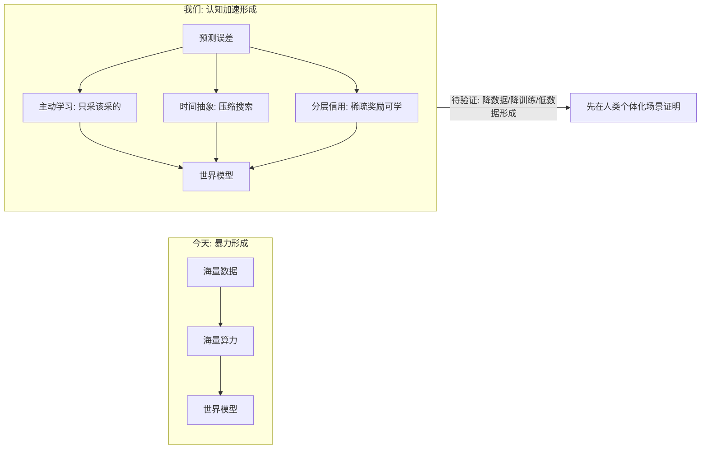
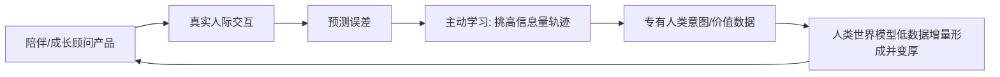

# 人类世界模型验证轮 — 选题 / 定位 + 资金 / 估值

> 面向资本对话的战略文档（精简版）。撰写时点：2026-06。
> 技术底座：[next_gen_emogpt.md](../../docs/next_gen_emogpt.md)（R-PE / R1 / R2 / R3-R4 / R7 / R9）、[01_paper_by_paper.md](../openai-frontier-2025/notes/01_paper_by_paper.md)（主动学习 / 定向采样）。
> 数字为 planning 级估算（含假设），非精确财务模型。

---

## 一句话：先证明人类世界模型，再 enable 更广义的世界模型

世界模型今天卡在一件简单的事上：**数据太贵、训练太贵**。

> **我们先在人类个体化世界模型里证明一件事：认知回路能在低数据、强反馈噪声、无现成数据集的条件下，让模型在基底先验之上持续形成。**

这不是直接宣称已经解决物理 / 具身世界模型的成本问题。更严格的说法是：**人类侧是最先可产品化、可收集真实交互、可做 ablation 的活体证明；物理侧是同一控制原则的后续迁移与合作场景。**

---

## 为什么这个方向值得验证

- 物理侧（World Labs、极佳视界等）的主流路线是**堆数据 + 堆算力**。（涉及的具体数字——如"千万小时视频"、"具身赛道半年数百亿"——以各家公开口径为准，文档对外前需逐条核实出处，不引用无源数字。）
- 成本不是唯一瓶颈，但**是当前最现实、可被认知回路尝试撬动的那个**：除了钱和数据，世界模型还有长程一致性、可控性等开放算法难题；我们不声称解决全部，只把"降低数据/训练门槛"作为要验证的核心假设。
- "世界模型"是当下少数能上 10 亿美元级 FOMO 的词，但本文不靠 FOMO 倒推结论。**融资阶段的真实目标不是证明物理侧已成立，而是先拿出人类侧的可复现实验证据**，再决定是否扩到物理侧合作 benchmark。

---

## 怎么 enable：认知引擎的三个价值点

> 下面三点是**待验证假设**，不是既成事实。当前融资轮只承诺做人类侧产品 + ablation，不承诺物理侧降本已经成立。

1. **降数据 — 主动学习**。只采最有信息量的数据（样本选择 + 主动推断 / 预测误差驱动），把"全量收集"变成"主动问、主动选"。近期目标：在人类个体化建模任务上，相对随机采样 / 普通日志训练，用更少标注轨迹达到同等质量。
2. **降训练成本 — 时间抽象 + 分层信用 + 冻结基底**。`z_t/β_t` 压缩动作/搜索空间（R3/R4）；分层信用让稀疏奖励可训（R9）；冻结基底只训控制器、不重训整模（R2，**省的是训练，不省推理 serving**）。近期目标：证明控制器层相对 LoRA / RAG / 普通 memory baseline 有可测收益，而不是只靠叙事成立。
3. **低数据形成 — 预测误差自排课程**。当某个个体/关系没有现成数据集时，不是"无数据凭空形成"，而是通过真实交互持续生成数据；认知引擎用预测误差（R-PE）决定下一步问什么、记什么、学什么，在基底先验之上增量生长出个体化模型。

---

## 证明链：先杀死自嗨，再谈扩张

当前最小证明不是"我们已经 enable 所有世界模型"，而是：

1. **人类侧 benchmark**：同一个用户 / 关系建模任务，在相同基底下，对比普通 LLM + memory、RAG、LoRA / adapter、随机采样标注，验证 PE + 主动学习 + 多时间尺度控制器是否显著提升预测、关系连续性、用户校正后的稳定性。
2. **PE 定义清楚**：预测误差不能偷换成 engagement。必须明确观测对象：用户显式纠正、后续事实一致性、目标达成、关系状态回访、生理 / 情绪标注等；短期粘性只能作为产品指标，不能当作世界模型真值。
3. **扩张门槛**：只有当人类侧 ablation 成立，才把同一控制原则迁移到物理 / 具身合作 benchmark。物理侧需要独立适配器和独立评估，不能用人类侧成功直接替代证明。

**杀死条件**：如果主动学习不优于随机采样，控制器不优于普通 memory/RAG，PE 信号无法稳定定义，或者用户价值主要来自基底能力而非持续个体化回路，则 thesis 应收缩为产品型 memory company，而不是世界模型 enablement company。

---

## 基底（substrate）：冻结、不自训、可替换

**当前阶段不自己训基底。** 自己预训基底,"降成本"这套叙事当场崩掉。

- **取现成开源权重模型,冻结使用**——这是 R2「稳定基底 + 自适应控制器」的工程选择：把高风险、重资产的基座训练排除在当前轮之外。不要把它讲成宇宙真理；adapter / LoRA / post-training 仍是现实竞争路线，我们要证明的是"冻结基底 + 控制器"在当前任务和成本约束下更优。
- **人类世界模型**:基底 = 强开源 LLM（中国语境优选 Qwen / DeepSeek / GLM,现有栈已跑 Qwen）。
- **物理世界模型扩张**:基底换成物理 / 世界模型（合作方或开源），同样冻结——R2 冻结基底的**原则**与具体 substrate 无关（但接入工程不是 drop-in，详见下文竞争壁垒第 4 点）。
- **我们自己训的只有认知控制器层**（元控制器 `z_t/β_t`、NL 多时间尺度控制器、记忆、主动学习回路），参数与算力是基底的零头——这就是当前轮可压到 $10M 级别的原因。

### 为什么基底自己做不到（堵尽调最狠的两刀）

基底再大也**结构性地缺**这些——是种类问题,不是规模问题:

1. **不会稳定地持续学习**:冻结模型只有 in-context 那一层在动（ICL ≈ 隐式的有限步内更新，但**不跨会话固化**），关系不自动累积。注意：大厂已经在补 per-user memory / tool state，这是真实竞争威胁，不要讲成"基底永远做不到"。
2. **没有预测误差回路**:它只生成文本,不"预测→对比现实→从差值更新"（R-PE 是搭在它之上的）。
3. **没有潜空间控制**:它在 token 空间输出,没有显式可控的抽象动作 `z_t/β_t`;我们认为 token 空间"推理 trace"未必等于真实决策路径（工作假设，非定论）。
4. **没有多时间尺度记忆**:冻结模型只有一个冻结频率;快/中/慢学习循环正是缺的部分。RAG 式 memory 是平铺仓库,不是被 PE 更新的关联记忆。
5. **没有"针对这个人、随交互持续更新"的世界模型**:基底确实从互联网文本里学到了**泛化的、静态的**人类心理/关系先验（所以它会说话）——但它**没有**对某个具体用户意图/价值/关系动态的、跨会话持续建模并被现实反馈纠偏的能力。我们要的不是"再学一遍泛人类常识",而是这条**持续、个体化、PE 纠偏**的回路;这正是冻结基底结构上给不了的。

> 投资人会问"护城河岂不是建在别人基座上?" 答:**护城河不能只靠"基底是商品"这句话。早期基底会强烈影响体验、成本和上限；真正可守的是认知控制器层 + 专有人类交互数据飞轮 + 可复现的个体化评估体系。** 一句话:**基底负责"会说话"(泛化静态先验),我们负责证明"会持续学习、会记住你这个人、会自己决定学什么"(个体化动态回路)比普通 memory/RAG 更有效。**

---

## 未来形态与竞争壁垒（堵尽调最狠的四刀）

**1. "基底和控制层一定分离吗?不能做进 inference time?"**
控制层**现在就在 inference time 里**——ETA 的 `z_t/β_t` 在前向传播中算出、把 `U_t` 注入残差流,是叠加在冻结前向上的控制信号,不是第二趟推理。真正的"分离"是**更新频率的分离**(R1/R2):基底慢/冻,控制层快。按 NL,架构/优化器/记忆本是同一嵌套物、只是更新率不同——**未来完全可打包成一个模型**;但"慢基底 + 快自适应层"的边界必须保留(混训会塌)。所以"合进一个模型"不会消灭这层能力,只是把边界内化。**我们做的事(多时间尺度持续学习 + PE + 潜空间控制 + 主动取数),打包成几个文件都得存在。**

**2. "大厂 / 在位者就不会做这件事吗?"**
诚实承认两件事:(i) 机制不是秘密——最聪明的人(LeCun、NL/ETA 作者)正在做,这是 2026 前沿共识;(ii) **关系/陪伴数据飞轮已经有人在跑**——Character.AI(已并入 Google)、Replika、小冰、豆包等在亿级规模上积累陪伴交互数据。所以护城河**不是**"别人不会做 / 没人有数据",而是下面三点的差:
- **利用方式不同**:在位者基本把这些数据用于 RLHF / 微调 / 检索式记忆,**不是**用 PE + 主动学习 + 多时间尺度控制器去做"个体化、持续纠偏的世界模型"。我们赌的是这条**利用回路**,不是"独占数据"。
- **激励与产品形态错位**:大厂主力是冻结、无状态、对所有人一样的多租户 API;真正的持续个体化(哪怕只是 per-user 记忆/状态层,不必改权重)与之是两种运维与对齐模型,亿级 API 上做全量个体化是负担。**注意**:这只是减速带不是护城河——ChatGPT memory 已经在做 per-user 状态,大厂用 per-user memory + tool state + reward model 做出 80% 产品效果是现实风险。我们的领先必须靠回路成熟度、评估体系和数据飞轮速度,不能靠"他们不会做"。
- 结论:不是"别人做不到 / 没数据",是"我们在**这条特定利用回路 + 个体化轨迹质量**上更早、更专注";价值归于把闭环咬合得最好、飞轮转得最快的一方。

**3. "是特殊路径,还是只是团队强?"**
诚实说:不是一条别人找不到的秘密算法(NL/ETA 都公开)。边在四件事的乘积——(a) 整合**整个闭环**而非摘单个机制(价值在咬合的闭环);(b) 选了**现成数据集缺失、必须在线生成、且有机会形成专有轨迹**的领域(人类世界);(c) **下行有界**(冻结基底=便宜,押错也有产品+数据兜底)+ **上行是一个品类** → EV 更高;(d) 强团队在不成熟工具链上早期执行本身即壁垒。**不是"有秘籍",是"对的架构 × 对的领域+数据 × 早执行"→ EV 更高、下行更小。**

**4. "基底只能是基础模型吗?LeCun 的 JEPA 会不会自动实现?"**
不会自动实现——**JEPA 恰是我们最好的基底候选,不是替代品**。JEPA/V-JEPA 在潜空间预测世界动态(感知级世界模型,对物理侧比 LLM 更合适),但它**不给**:`z_t/β_t` 时间抽象控制、多时间尺度**持续**学习、**主动取数**、per-relationship 持久记忆、PE 驱动的信用/策略更新——它的"预测误差"是表征学习的训练 loss,不是运行时控制信号。**而且 LeCun 自己的架构也是分离的**(H-JEPA 世界模型 + configurator/actor + intrinsic cost),独立验证了"基底 + 控制层"的分离不是我们的怪癖。

> 诚实标注"substrate 无关"的边界:控制层与基底的分离原则是通用的,但**接入工程不是 drop-in**。当前控制器把 `U_t` 注入 transformer 残差流,是 LLM 架构特定的;换成 JEPA(潜空间、无 token 输出)需要**另一套接入适配器**,且会丢掉 LLM 的"会说话/声音"层。所以更准确的说法是:**人类侧 LLM 基底**和**物理侧 JEPA/世界模型基底**是两套并行的接入栈,共享同一套控制器原则、但各有适配成本。在此意义上,**JEPA 成熟 = 物理侧的顺风**(更好的物理基底可冻结复用),不是威胁;但别把它讲成"任意基底零成本互换"。

> 收口:整个前沿(LeCun / NL / ETA)在收敛到"冻结基底 + 多时间尺度控制 + 内禀/PE 信号"。**胜负手不在"想法独不独特",在执行 + 领域 + 数据。** 这比"我们有秘密路径"更扛尽调。

---

## 活体证明：人类世界模型

为什么先做人类世界模型——因为它是"认知把低数据个体化建模做出来"**最干净、且我们现在就能验证**的场景：

- **缺的不是泛人类常识，而是"这个具体的人随时间变化的意图/价值/关系"**——这类**个体化、动态、随交互更新**的轨迹数据：物理侧有视频可堆，人类侧没有现成大规模语料可爬可买，只能在真实交互中**边交互边长出来**。
- 所以它**必须靠真实交互在低数据条件下增量形成**：主动问、主动选、用预测误差自排课程。能在这种"无现成数据集、只能在线生长"的条件下把个体化世界模型做厚，就证明了人类侧回路本身。（基底提供的泛化先验是起点，不是终点；我们证明的是"在先验之上持续个体化"这条回路。）
- 落地即产品即数据飞轮：**陪伴 / 成长顾问**现在就能 demo、就能收入，每次真实交互都吐出**个体化、带反馈标签**的专有轨迹数据。

> 同一套控制器原则迁到物理世界模型上，才可能给物理侧玩家**降数据、降训练成本**（冻结基底原则与 substrate 无关，`z_t/β_t` 可换基底，但需另一套接入适配栈）。人类侧证"在先验上增量长出个体化模型"；物理侧必须另做合作 benchmark，不能用人类侧成功直接替代证明。**不抢身体，先把控制回路证明清楚，再谈合作 / 授权。**

---

## 资源与资金需求（自底向上，18 个月验证轮）

| 项 | 口径 / 假设 | 金额（USD） |
|---|---|---|
| 人员 | 18 个月均值约 19 人：研究 5 / 工程 7 / 数据+评估 3 / 产品 2 / GTM+G&A 2；按约 ~$180k 全负担/年 | $5.2M |
| 训练算力（只训控制器层） | 冻结基底，只做控制器 / adapter / ablation 训练；不做基座预训练 | $0.9M |
| 推理 serving（产品 + 实验） | 冻结基底**不降** serving 单价；目标是小规模高质量 cohort，不追 20–50 万 MAU | $0.8M |
| 数据获取 + 专家标注 + 主动学习运营 | 以验证 PE / 情绪 / 关系状态 ground truth 为主；少量高价值专家标注 + 模型辅助标注 | $1.0M |
| 产品 / 获客（启动数据飞轮） | 陪伴 / 成长顾问小规模 bootstrap，优先留存和高质量反馈，不买大规模增长 | $0.6M |
| 云 / 存储 / 安全 / 合规 | 非 GPU 基建、隐私、安全、删除 / 导出 / 审计能力 | $0.5M |
| G&A / 法务 / 办公 / 储备 | 公司运营、法务、融资与缓冲 | $1.0M |
| **合计** | | **$10.0M** |

**本轮募资锚定 ≈ $10M**。这不是把公司一次性打到"世界模型平台"阶段，而是买 18 个月去回答三个硬问题：人类侧产品是否有真实留存 / 付费，PE + 主动学习 + 控制器是否显著优于 baseline，物理侧扩张是否值得进入合作 benchmark。

### 数据量口径（"降数据"的目标，非既成事实）

- 产品 bootstrap：期间不追求 20–50 万 MAU；目标是 **1–3 万高质量早期用户 / cohort**，拿到足够长的跨会话轨迹、纠正信号、留存和付费数据。
- **标注分层（避免"专家单价不成立"陷阱）**：绝大多数轨迹走自动 / 模型辅助标注；真正占用领域专家（心理 / 教练）的是 **~1–2 万条**高价值 / 争议 / 边界轨迹，按 $30–80/条计，外加评估设计与复核成本，对齐 $0.8–1.3M 数据预算。
- 对比物理侧（World Labs / 极佳视界等堆视频路线，量级以其公开口径为准，文档落地前需核实出处）：当前轮**不承诺**物理侧数据需求低 1–2 个量级；只把它列为下一阶段合作 benchmark 的待验证目标。

---

## 估值（按出让 10–15%）

> 估值不能靠"募资额 ÷ 出让比例"自证；下面只是稀释算术，真实估值要靠团队、demo、早期留存、ablation 设计和可比轮次支撑。

| 募资额 | 出让 | 投后估值 |
|---|---|---|
| **$10M（锚定）** | 10% | $100M |
| **$10M（更现实）** | 12.5% | $80M |
| **$10M（保守）** | 15% | ~$67M |

本轮锚定 **$10M**，合理谈判区间可放在 **$67–100M post**。若 pre-product / pre-ablation，$100M post 偏激进；若已有强 demo、核心团队、早期高留存 cohort 或科学顾问背书，则可向上谈。

> **诚实说明**:本轮不应该卖"独角兽线"，而应该卖"低成本验证一个可能很大的非共识 thesis"。对资本要准备的真正依据是:(a) 早期产品 traction(留存/付费/CAC 实数);(b) PE + 主动学习 + 控制器相对 baseline 的 ablation 计划和阶段证据;(c) 可比公司(陪伴 / AI memory / 世界模型工具链)近期轮次的估值锚。

---

## 风险与边界

- **不滑向 token 空间 RL**：长期策略学习在控制器 `z_t` 空间（R3/R4）。
- **不做无界自修改**：有界、可回滚、走 ModificationGate（R10/R15）。
- **降本主张必须带证据**：对外"降数据 / 降成本"需可复现 ablation + 基线对比，否则是空头支票；当前轮只承诺验证，不承诺已经成立。评估只读，不反向变训练源（R12）。
- **不过度承诺具身**：人类侧先证，物理侧降本只讲成路线图 / 合作 benchmark。
- **数据合规**：人类意图 / 关系数据是 trust boundary，采集 / 存储 / 使用可审计、可删除、可导出。
- **执行边界**：纯战略文档，不写代码、不改内核；技术 spec 走 `docs/specs/`。

---

## 一页电梯稿

> 世界模型今天主流是堆数据、堆算力的暴力游戏，成本是最现实的瓶颈。但我们当前不直接宣称已经解决物理 / 具身世界模型，而是先在人类个体化世界模型里证明核心回路：主动学习让系统少问废问题、预测误差让它知道该学什么、时间抽象 + 冻结基底让训练集中在控制器层而不是重训基座。活体证明是**人类世界模型**——某个具体的人的意图与关系动态没有现成语料可爬可买，我们在真实交互中把它增量做厚，并用陪伴 / 成长顾问产品拿到带反馈的专有轨迹。若人类侧 ablation 证明 PE + 主动学习 + 多时间尺度控制器显著优于普通 LLM + memory / RAG / LoRA baseline，再把同一控制原则迁到物理世界模型基底（如 JEPA）上做合作 benchmark。当前轮锚定 **$10M / 18 个月**，目标不是买增长，而是验证产品留存、技术 ablation 和物理侧扩张门槛。**别人用钱和数据堆世界模型；我们先证明认知回路能在低数据的人类个体化场景里形成模型，再决定它能否成为更广义世界模型的降本引擎。**
